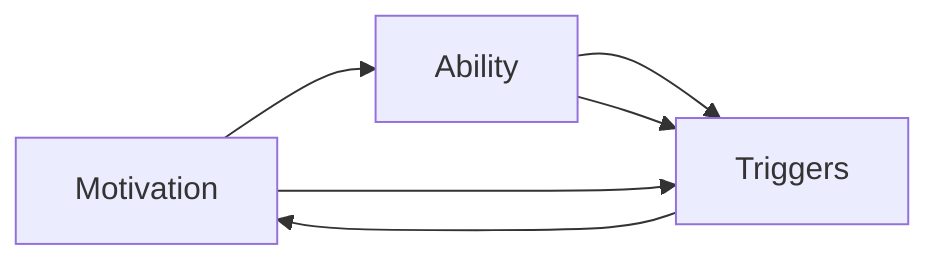

                 

## 1. 背景介绍

在当今的数字化时代，技术不断演进，竞争激烈。构建高效、敏捷的团队是企业取得成功的重要因素。尽管技术工具越来越先进，但优秀的团队合作能力同样不可忽视。福格模型（Fogg's Model）作为一种成功策略，被广泛应用于构建高效团队。本博客将详细阐述福格模型的核心概念、原理以及如何应用在团队管理中，以打造高效团队。

## 2. 核心概念与联系

### 2.1 核心概念概述

福格模型由知名创业家和作家布莱恩·萨姆·福格提出，其核心观点在于成功的行动取决于三要素：**动机（Motivation）**、**能力（Ability）**和**提示（Triggers）**。

- **动机**：为何要做某事？动机来源于个人价值观、目标以及情感，是推动人们行动的内在动力。
- **能力**：能否做到？能力是指完成任务所需的技能和资源。
- **提示**：何时做？提示指的是激发行动的具体时机或触发器，如通知、提醒等。

这三种要素相互交织，共同作用于行动的发生。福格模型通过分析这三要素，帮助人们设计更有效的行动计划。

### 2.2 核心概念原理和架构的 Mermaid 流程图



**动机（A）**：提供明确的行动目标和意义，让人们感到目标的重要性和紧迫感。

**能力（B）**：确保完成任务所需的技能和资源都已到位。

**提示（C）**：触发行动的特定时机，简化启动过程。

三种要素相互影响，共同推动人们采取行动。例如，若某员工对公司的使命和目标有强烈认同（动机），且具备完成某个任务所需的能力（技能和资源），并且知晓公司定期会进行时间管理培训（提示），则该员工更有可能积极参与培训并提高工作效率。

## 3. 核心算法原理 & 具体操作步骤

### 3.1 算法原理概述

在福格模型中，动机、能力和提示是构建高效团队的核心算法原理。通过合理设计这三个要素，可以显著提升团队的整体表现。

- **动机设计**：明确团队的目标和价值观，激发成员的内在动力。
- **能力培养**：提供必要的培训和发展机会，确保团队具备完成任务的技能和资源。
- **提示触发**：设置清晰的时间点和流程，简化行动的启动过程。

### 3.2 算法步骤详解

1. **定义团队目标和价值观**：明确团队的整体目标和核心价值观，确保每个成员都认同并为之奋斗。
2. **评估成员能力和资源**：识别团队中每个成员的强项和弱点，提供针对性的培训和发展机会。
3. **设计提示和触发器**：设置合理的流程和工具，简化日常任务的启动和执行。

### 3.3 算法优缺点

#### 优点

- **提高团队凝聚力**：明确的团队目标和价值观可以增强成员的归属感，提升团队凝聚力。
- **提升工作效率**：针对性的培训和发展可以提高团队成员的能力，优化工作流程，提升效率。
- **增强行动意愿**：合理的提示和触发器可以减少决策负担，激励成员积极行动。

#### 缺点

- **实施复杂**：设计和实施福格模型需要时间和精力，需团队领导者和成员共同努力。
- **需持续维护**：模型需要定期评估和调整，确保其持续有效性。
- **依赖团队成员**：团队成员的积极参与和认可至关重要，需要领导者的积极引导。

### 3.4 算法应用领域

福格模型不仅适用于企业管理，还可应用于个人生活、教育、健康等领域，以提高行动效果和达成目标的效率。其广泛应用于：

- **项目管理**：明确项目目标和里程碑，为团队成员提供明确的任务和优先级。
- **健康管理**：设定健康目标和计划，如锻炼、饮食、睡眠等，使用应用和提醒工具触发健康行为。
- **学习和发展**：设定学习目标和计划，提供资源和工具，激励持续学习和自我提升。

## 4. 数学模型和公式 & 详细讲解 & 举例说明

### 4.1 数学模型构建

福格模型虽然不是传统的数学模型，但我们可以将其抽象为一种激励模型。设动机为 $M$，能力为 $A$，提示为 $T$，则模型可以表示为：

$$
F(A, M, T) = \max(A, M, T)
$$

其中 $F$ 表示行动的可行性，$A$、$M$、$T$ 分别表示能力、动机和提示。

### 4.2 公式推导过程

假设动机 $M$ 和提示 $T$ 均为 $[0,1]$ 的实数，能力 $A$ 也为 $[0,1]$ 的实数，则模型的推理过程如下：

1. 计算动机和能力的交集：$M \cap A = \max(M, A)$。
2. 将交集与提示进行比较：$\max(M \cap A, T)$。
3. 行动可行性：$F = \max(M \cap A, T)$。

例如，当动机为0.8，能力为0.7，提示为0.5时，行动可行性 $F$ 为1，即该行动可行。

### 4.3 案例分析与讲解

假设某项目团队的目标是提升产品销量。通过福格模型，我们可以：

- **动机**：明确公司对销量的高度重视，并设立阶段性销售目标。
- **能力**：为团队成员提供销售技巧培训和市场分析工具。
- **提示**：每周设置销售汇报会议，及时反馈和调整销售策略。

通过这种设计，团队成员会更加积极地投入工作，提升销量。

## 5. 项目实践：代码实例和详细解释说明

### 5.1 开发环境搭建

为了实践福格模型，我们需要搭建一个简单的项目管理工具。以下是Python和Flask搭建的基本环境：

1. 安装Python和Flask：
```
pip install flask
```

2. 创建Flask项目：
```
mkdir project
cd project
mkdir app
cd app
touch app.py
```

3. 编写Flask应用：
```python
from flask import Flask, render_template

app = Flask(__name__)

@app.route('/')
def index():
    return render_template('index.html')

if __name__ == '__main__':
    app.run(debug=True)
```

### 5.2 源代码详细实现

在项目中，我们将实现一个简单的任务管理界面，包含目标设定、能力评估和提示触发器。

**index.html模板**：
```html
<h1>任务管理</h1>
<form>
    <label for="goal">目标：</label>
    <input type="text" id="goal" name="goal"><br>
    <label for="skill">能力：</label>
    <input type="text" id="skill" name="skill"><br>
    <label for="trigger">提示：</label>
    <input type="text" id="trigger" name="trigger"><br>
    <button type="submit">提交</button>
</form>
```

**app.py代码**：
```python
from flask import Flask, render_template, request

app = Flask(__name__)

@app.route('/')
def index():
    return render_template('index.html')

@app.route('/submit', methods=['POST'])
def submit():
    goal = request.form.get('goal')
    skill = request.form.get('skill')
    trigger = request.form.get('trigger')
    result = max(max(goal, skill), trigger)
    return f'行动可行性：{result}'

if __name__ == '__main__':
    app.run(debug=True)
```

### 5.3 代码解读与分析

在上述代码中，我们定义了一个简单的Flask应用，包含目标设定、能力评估和提示触发器的表单。当用户提交表单时，应用会计算出行动可行性 $F$，并返回结果。

- **表单提交**：用户输入目标、能力和提示，点击提交按钮。
- **计算可行性**：应用通过Flask的 `request` 对象获取表单数据，使用 `max` 函数计算出行动可行性。
- **结果返回**：应用返回计算结果，显示在网页上。

### 5.4 运行结果展示

通过上述代码，我们可以构建一个简单的任务管理界面，帮助团队成员设定目标、评估能力和触发提示。这种简单的实践，可以很好地验证福格模型的实际应用效果。

## 6. 实际应用场景

### 6.1 项目管理

在项目管理中，福格模型可以帮助团队设定明确的目标和优先级，确保每个成员都明确任务和责任。例如，某软件项目的目标是在六个月内开发一款新应用，通过福格模型，团队可以：

- **动机**：明确公司对新应用的期望，并设立项目里程碑。
- **能力**：为团队成员提供编程、测试、设计等培训和资源。
- **提示**：设置每周的进度汇报会议，及时反馈和调整计划。

通过这种设计，团队将更有目标性地工作，提升项目成功率。

### 6.2 健康管理

在健康管理中，福格模型可以帮助个人设定健康目标，并通过提示和工具实现。例如，某人希望每周至少运动三次，通过福格模型，他可以：

- **动机**：设定每周运动三次的目标，并设立奖励机制。
- **能力**：购买家用跑步机或订阅健身房，学习运动技巧。
- **提示**：每天早晨设定锻炼提醒，记录运动数据和反馈。

通过这种设计，个人更容易实现健康目标，提升生活质量。

### 6.3 学习和发展

在学习和发展中，福格模型可以帮助个人设定学习计划，并通过提示和工具实现。例如，某人希望一年内通过学习Python和数据分析，通过福格模型，他可以：

- **动机**：设定学习目标，并设立阶段性成果。
- **能力**：报名在线课程和培训班，购买相关书籍和工具。
- **提示**：每天固定时间学习，记录学习进度和反思。

通过这种设计，个人更容易达成学习目标，提升专业技能。

### 6.4 未来应用展望

随着技术的进步，福格模型的应用场景将更加广泛。未来，我们可以：

- **集成更多工具**：将时间管理、任务管理、健康管理等工具集成到一个平台上，提供一站式解决方案。
- **数据驱动决策**：通过数据分析和人工智能，自动调整动机和提示，提高模型效果。
- **自动化提醒**：使用机器学习算法，自动生成个性化的提示和触发器，提升用户体验。

这些新技术的应用，将使福格模型更加智能化和高效化。

## 7. 工具和资源推荐

### 7.1 学习资源推荐

为了深入理解福格模型，以下是几本推荐的书籍和文章：

1. **《行为设计学》（The Power of Habit）**：查尔斯·杜希格（Charles Duhigg）的畅销书，详细介绍了习惯的心理学原理和行为设计方法。
2. **《设计习惯的力量》（Designing Habits That Stick）**：B.J. Fogg的著作，深入探讨了如何设计有效的习惯养成策略。
3. **《行为设计》（Behavior Design）**：B.J. Fogg的博客，提供大量实用的行为设计案例和工具。
4. **《习惯的力量》（Habit Strength）**：美国心理学会的《行为科学与公共政策》杂志文章，介绍了最新研究进展。

这些资源可以帮助你深入理解福格模型，并将其应用到实际工作中。

### 7.2 开发工具推荐

福格模型的实施需要一些简单的开发工具：

1. **Flask**：轻量级的Python Web框架，适合快速开发原型和简单的Web应用。
2. **Jupyter Notebook**：交互式开发环境，适合数据可视化和代码测试。
3. **Google Sheets**：在线表格工具，适合团队协作和数据管理。

这些工具可以帮助你快速搭建福格模型，并进行实验和调整。

### 7.3 相关论文推荐

福格模型的理论和应用研究已产生大量研究成果，以下是一些关键论文：

1. **《行为设计学的实践指南》（The Implementation of Behavior Change in the Context of Design and Architecture）**：B.J. Fogg等人的论文，介绍了行为设计学的基本原理和应用方法。
2. **《打造有效习惯的心理学》（A Psychology of Making Everything Stick）**：B.J. Fogg的论文，探讨了如何通过心理学原理设计有效习惯。
3. **《数据驱动的习惯设计》（Data-Driven Habit Design）**：B.J. Fogg等人的论文，提出了基于数据驱动的行为设计方法。

这些论文可以帮助你深入理解福格模型，并在实际应用中实现更有效的行动设计。

## 8. 总结：未来发展趋势与挑战

### 8.1 研究成果总结

福格模型通过动机、能力和提示三要素，帮助设计有效的行动计划。其简单易懂、易于实施，已在多个领域取得了显著效果。通过本文的介绍，你对福格模型有了更深入的理解，并掌握了其基本应用方法。

### 8.2 未来发展趋势

未来，福格模型将在以下几个方面得到进一步发展：

- **自动化**：通过AI和机器学习，自动优化提示和动机，提升模型效果。
- **数据驱动**：通过大数据分析，提供个性化的行为设计方案，提高用户满意度和效果。
- **跨领域应用**：福格模型不仅适用于团队管理，还可应用于健康、教育、个人发展等多个领域，帮助更多人实现目标和提升效率。

### 8.3 面临的挑战

尽管福格模型具有诸多优势，但在实施中也面临一些挑战：

- **用户接受度**：部分用户可能对行为设计方案不习惯，需要逐步引导和教育。
- **数据隐私**：部分应用可能涉及用户数据隐私，需要严格的数据保护措施。
- **适应性**：不同场景和人群可能需要不同的行为设计方案，模型需要具备较强的适应性。

### 8.4 研究展望

未来的研究可以从以下几个方向进行：

- **心理学的融合**：结合心理学理论，设计更加科学和有效的行为设计方案。
- **多模态应用**：结合多种数据源和信息形式，提供更加全面和丰富的行为设计工具。
- **用户体验优化**：通过用户反馈和行为数据分析，持续优化设计方案，提升用户体验。

通过这些研究，福格模型将更加完善和普及，帮助更多人实现目标和提升效率。

## 9. 附录：常见问题与解答

### 9.1 问题1: 如何设定合理的动机？

**解答**：设定动机时，需要明确目标的重要性和紧迫感。可以通过设立具体、可衡量、可实现的SMART目标（具体、可测量、可实现、相关、有时限），使动机更加明确和有效。

### 9.2 问题2: 如何评估成员的能力？

**解答**：评估能力时，需要识别每个成员的技能和资源，并提供相应的培训和发展机会。可以通过技能评估测试、员工反馈和绩效评估等方式，全面了解成员能力。

### 9.3 问题3: 如何设置有效的提示？

**解答**：设置提示时，需要考虑任务的复杂度和用户的习惯。可以通过设定提醒时间、使用工具、提供触发器等方式，简化行动的启动过程。

### 9.4 问题4: 如何调整动机和能力？

**解答**：调整动机和能力时，需要持续监测和评估目标的进展。可以通过定期反馈、调整目标和任务分配等方式，确保行动计划的有效性。

### 9.5 问题5: 如何应对挑战？

**解答**：应对挑战时，需要灵活调整和优化行动计划。可以通过沟通和反馈、调整目标和策略、优化工具和资源等方式，提升行动效果。

通过这些常见问题的解答，你可以更好地理解和应用福格模型，解决实际工作中的问题。

---

作者：禅与计算机程序设计艺术 / Zen and the Art of Computer Programming

