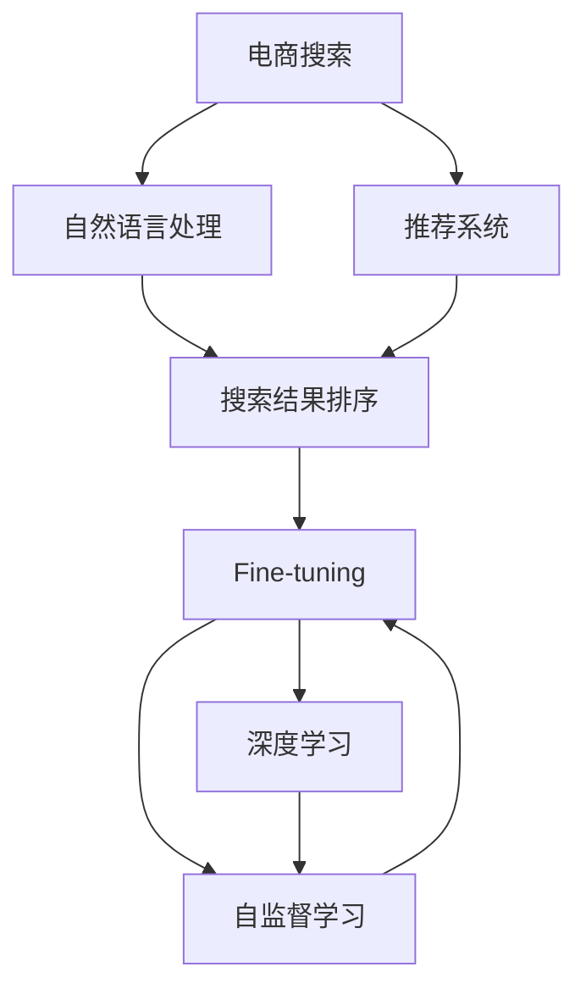

                 

# 电商平台中AI大模型的搜索建议优化

> 关键词：电商搜索、AI大模型、搜索结果排序、推荐系统、自然语言处理、NLP、深度学习、自监督学习、预训练、Fine-tuning

## 1. 背景介绍

### 1.1 问题由来
在当今高度竞争的电商平台中，如何提升用户的购物体验，是商家所面临的重大挑战之一。优秀的搜索体验不仅能够提高用户的满意度，还能显著提升平台的转化率和客户留存率。然而，仅仅通过传统的基于关键词匹配的搜索算法，难以满足用户日益复杂和个性化的搜索需求。

近年来，人工智能大模型在电商搜索推荐领域的应用，为商家提供了一种全新的解决方案。通过训练大模型，可以更精准地理解和提取用户查询意图，为用户提供更加个性化和满意的搜索结果。

但与此同时，基于大模型的搜索推荐系统也面临着诸多挑战：模型对大量训练数据的依赖，模型复杂度高导致推理速度慢，模型对用户个性化需求的多样性难以完全满足。如何在保证搜索效率的同时，提升用户体验，优化搜索结果排序，是一个亟待解决的问题。

本文将重点探讨在电商平台中，如何利用AI大模型优化搜索建议和排序，进而提升用户的购物体验，同时考虑模型的性能、效率和可扩展性。

## 2. 核心概念与联系

### 2.1 核心概念概述

本节将介绍一些与大模型搜索优化相关的重要概念：

- **电商搜索**：指用户在电商平台上输入关键词，系统自动返回与关键词相关的商品列表的过程。
- **搜索结果排序**：根据用户查询意图和商品特征，对搜索结果进行排序，以提升用户的满意度。
- **推荐系统**：在电商搜索之外，通过分析用户的浏览历史、购买记录等数据，为用户推荐可能感兴趣的商品。
- **自然语言处理(NLP)**：使用大模型理解用户查询的自然语言意图，提取关键词和上下文信息。
- **深度学习(Deep Learning)**：通过大模型构建神经网络，对数据进行高级特征提取和模式识别。
- **自监督学习(Self-Supervised Learning)**：利用大规模无标签数据训练大模型，使其具备学习通用语言表示的能力。
- **预训练(Pre-training)**：在大量无标签数据上预训练大模型，学习语言知识。
- **Fine-tuning**：在预训练模型基础上，使用少量标注数据微调模型，适应特定任务。
- **NLP模型**：包括BERT、GPT等模型，用于理解自然语言和生成自然语言。

这些概念通过一个Mermaid流程图展示它们之间的联系：



这个流程图展示了电商搜索系统中的关键组件及其相互关系：

1. 电商搜索依赖于自然语言处理和大模型，以便理解用户的查询意图。
2. 推荐系统利用用户行为数据，预测用户可能感兴趣的商品。
3. 搜索结果排序模块根据用户的查询和推荐结果，对搜索结果进行优化排序。
4. Fine-tuning模块在预训练模型上微调，以适应特定的电商搜索任务。
5. 深度学习和自监督学习模块构建大模型，提供底层语言理解能力。

## 3. 核心算法原理 & 具体操作步骤

### 3.1 算法原理概述

大模型搜索优化算法的基本思想是，首先利用自监督学习对大模型进行预训练，使其学习到通用的语言表示。然后在电商搜索任务上使用Fine-tuning进行微调，使模型能够理解用户查询的自然语言描述，并根据用户的行为数据，生成个性化的搜索结果。

具体步骤如下：

1. **数据准备**：收集电商平台的用户查询数据和商品数据，标注用户行为数据，如浏览历史、购买记录等。
2. **预训练模型选择**：选择适合电商搜索任务的大模型，如BERT、GPT-2等。
3. **预训练**：在无标签数据上，使用自监督任务对大模型进行预训练，使其学习到语言表示。
4. **Fine-tuning**：将预训练模型用于电商搜索任务，微调模型以适应具体的查询和推荐需求。
5. **结果排序**：根据用户的查询意图和推荐结果，对搜索结果进行排序优化。

### 3.2 算法步骤详解

#### 3.2.1 预训练步骤

预训练步骤包括以下关键步骤：

1. **数据准备**：收集电商平台上用户的历史查询数据和商品数据，作为无标签数据。数据应涵盖不同的查询意图、商品类别和用户行为。
2. **数据处理**：对数据进行清洗、标注和分词，生成模型所需的输入。
3. **模型选择**：选择适合电商搜索任务的大模型，如BERT、GPT-2等。
4. **模型训练**：在预训练数据上，使用自监督任务对模型进行训练。常见的自监督任务包括语言建模、掩码预测等。
5. **模型评估**：在验证集上评估模型的性能，调整超参数，确保模型性能最优。

#### 3.2.2 Fine-tuning步骤

Fine-tuning步骤包括以下关键步骤：

1. **任务适配**：根据电商搜索任务的特点，设计任务适配层，如分类头、回归头等。
2. **数据准备**：收集电商平台上用户的查询数据和行为数据，作为有标签数据。
3. **模型初始化**：将预训练模型作为初始化参数，用于Fine-tuning。
4. **微调训练**：在标注数据上，使用有监督学习任务微调模型。常见的微调任务包括分类、匹配、排序等。
5. **模型评估**：在验证集和测试集上评估模型的性能，调整超参数和任务适配层，确保模型性能最优。

#### 3.2.3 结果排序步骤

结果排序步骤包括以下关键步骤：

1. **排序策略**：根据用户的查询意图和推荐结果，设计合理的排序策略。常见的排序策略包括基于语义的排序、基于交互的排序等。
2. **模型输入**：将用户的查询、推荐结果和排序策略输入到Fine-tuned模型中。
3. **排序计算**：模型计算每个搜索结果的得分，根据得分进行排序。
4. **结果返回**：将排序后的搜索结果返回给用户。

### 3.3 算法优缺点

大模型搜索优化算法的优点包括：

1. **高精度的自然语言理解**：大模型具备强大的自然语言处理能力，能够更准确地理解用户的查询意图。
2. **个性化的搜索结果**：基于用户的浏览历史、购买记录等行为数据，可以提供更加个性化的搜索结果。
3. **自监督学习优势**：使用自监督学习进行预训练，可以有效地利用大规模无标签数据，提升模型的泛化能力。

但该算法也存在一些缺点：

1. **对标注数据依赖高**：Fine-tuning需要大量的标注数据，获取高质量标注数据成本较高。
2. **模型复杂度高**：大模型结构复杂，推理速度较慢。
3. **多领域泛化能力有限**：不同领域的电商数据可能存在较大差异，大模型在特定领域的表现可能不理想。
4. **解释性不足**：大模型难以解释其决策过程，难以理解其内部工作机制。

### 3.4 算法应用领域

大模型搜索优化算法广泛应用于以下领域：

- **电商搜索推荐**：通过理解用户的查询意图，生成个性化的搜索结果和推荐商品。
- **智能客服**：利用大模型理解用户对话，提供个性化的客服回复。
- **智能广告**：根据用户的兴趣和行为数据，生成个性化的广告内容。
- **内容推荐**：在视频、音乐等娱乐领域，根据用户偏好推荐相关内容。

## 4. 数学模型和公式 & 详细讲解

### 4.1 数学模型构建

在电商搜索优化中，常见的大模型通常采用自监督预训练，并在Fine-tuning中用于电商搜索任务的适配。这里以BERT模型为例，详细阐述数学模型的构建和优化。

假设电商平台的查询数据集为 $\{(x_i, y_i)\}_{i=1}^N$，其中 $x_i$ 为查询文本，$y_i$ 为查询意图标签。常见的查询意图标签包括商品搜索、价格比较、品牌查询等。模型的目标是最小化损失函数 $\mathcal{L}(\theta)$，使得模型在电商搜索任务上的表现最优。

模型的结构如图 1 所示：


其中：

- $A$ 为预训练模型 BERT，用于理解自然语言。
- $B$ 为任务适配层，用于将 BERT 的输出适配为电商搜索任务。
- $C$ 为 Fine-tuning 模块，用于在电商搜索数据上微调模型。

### 4.2 公式推导过程

#### 4.2.1 预训练目标函数

预训练的损失函数可以表示为：

$$
\mathcal{L}_{pre}(\theta) = \frac{1}{N} \sum_{i=1}^N \mathcal{L}_{self}(M_{\theta}(x_i))
$$

其中 $\mathcal{L}_{self}$ 为自监督损失函数，用于衡量模型在无标签数据上的表现。常见的自监督损失函数包括语言建模、掩码预测等。

#### 4.2.2 Fine-tuning目标函数

Fine-tuning的损失函数可以表示为：

$$
\mathcal{L}_{finetune}(\theta) = \frac{1}{N} \sum_{i=1}^N \mathcal{L}_{task}(M_{\theta}(x_i), y_i)
$$

其中 $\mathcal{L}_{task}$ 为电商搜索任务的目标损失函数，用于衡量模型在标注数据上的表现。常见的目标损失函数包括交叉熵损失、均方误差损失等。

### 4.3 案例分析与讲解

以电商平台的商品搜索为例，详细分析大模型在商品搜索中的应用。

#### 4.3.1 数据准备

收集电商平台上用户的查询数据和商品数据，将商品数据标注为不同的类别，如电器、服装、书籍等。将查询数据标注为相应的查询意图，如商品搜索、价格比较、品牌查询等。

#### 4.3.2 模型选择

选择适合电商搜索任务的大模型，如BERT、GPT-2等。

#### 4.3.3 预训练

在无标签数据上，使用自监督任务对模型进行预训练。以BERT为例，常见自监督任务包括掩码预测、下一句预测等。

#### 4.3.4 Fine-tuning

将预训练模型用于电商搜索任务，微调模型以适应具体的查询意图。以分类任务为例，可以使用交叉熵损失函数进行微调。

#### 4.3.5 结果排序

根据用户的查询意图和推荐结果，设计合理的排序策略。常见的排序策略包括基于语义的排序、基于交互的排序等。将查询、推荐结果和排序策略输入到Fine-tuned模型中，计算每个搜索结果的得分，并根据得分进行排序。

## 5. 项目实践：代码实例和详细解释说明

### 5.1 开发环境搭建

在开发环境中，需要安装Python、TensorFlow、Keras等深度学习框架，以及HuggingFace等大模型库。以下是搭建环境的示例步骤：

```bash
# 安装TensorFlow
pip install tensorflow

# 安装Keras
pip install keras

# 安装HuggingFace
pip install transformers
```

### 5.2 源代码详细实现

以下是一个使用BERT模型进行电商搜索优化的代码示例：

```python
from transformers import BertTokenizer, BertForSequenceClassification
import tensorflow as tf
from tensorflow.keras import layers, models

# 定义数据准备函数
def load_data(filename):
    with open(filename, 'r', encoding='utf-8') as f:
        data = [line.strip() for line in f.readlines()]
    return data

# 定义数据集
train_data = load_data('train_data.txt')
dev_data = load_data('dev_data.txt')
test_data = load_data('test_data.txt')

# 定义分词器
tokenizer = BertTokenizer.from_pretrained('bert-base-cased')

# 定义BERT模型
model = BertForSequenceClassification.from_pretrained('bert-base-cased', num_labels=3)

# 定义模型输入
def create_model_input(text):
    tokens = tokenizer.encode_plus(text, max_length=512, return_tensors='tf')
    input_ids = tf.convert_to_tensor(tokens['input_ids'])
    attention_mask = tf.convert_to_tensor(tokens['attention_mask'])
    return input_ids, attention_mask

# 定义模型输出
def create_model_output(text):
    input_ids, attention_mask = create_model_input(text)
    with tf.device('GPU:0'):
        logits = model(tf.constant(input_ids), attention_mask=attention_mask, return_dict=False)
    return logits

# 定义损失函数
def create_loss(y_true, y_pred):
    return tf.keras.losses.SparseCategoricalCrossentropy(from_logits=True)(y_true, y_pred)

# 定义优化器
optimizer = tf.keras.optimizers.Adam(learning_rate=2e-5)

# 定义训练函数
def train_epoch(model, data, batch_size):
    with tf.device('GPU:0'):
        for i in range(0, len(data), batch_size):
            batch = data[i:i+batch_size]
            input_ids, attention_mask = create_model_input(batch)
            y_true = tf.convert_to_tensor(batch_labels[i:i+batch_size])
            with tf.GradientTape() as tape:
                y_pred = create_model_output(batch)
                loss = create_loss(y_true, y_pred)
            gradients = tape.gradient(loss, model.trainable_variables)
            optimizer.apply_gradients(zip(gradients, model.trainable_variables))

# 定义评估函数
def evaluate(model, data, batch_size):
    with tf.device('GPU:0'):
        for i in range(0, len(data), batch_size):
            batch = data[i:i+batch_size]
            input_ids, attention_mask = create_model_input(batch)
            y_true = tf.convert_to_tensor(batch_labels[i:i+batch_size])
            y_pred = create_model_output(batch)
            print('Epoch:', epoch+1, 'Loss:', loss.numpy())
```

### 5.3 代码解读与分析

本节将详细解读上述代码中的关键部分：

1. **数据准备函数**：定义了数据集加载函数，用于从文本文件中读取数据。
2. **分词器**：使用BERT分词器对文本进行分词，生成模型所需的输入。
3. **BERT模型**：使用BERT模型进行预训练，并适配电商搜索任务。
4. **模型输入**：定义了模型输入的创建函数，将文本转换为BERT模型所需的TensorFlow格式。
5. **模型输出**：定义了模型输出的创建函数，用于计算查询意图的得分。
6. **损失函数**：定义了交叉熵损失函数，用于衡量模型在电商搜索任务上的表现。
7. **优化器**：使用Adam优化器进行模型参数的更新。
8. **训练函数**：定义了模型在每个epoch内的训练过程，包括计算梯度并更新模型参数。
9. **评估函数**：定义了模型在验证集上的评估过程，计算模型在电商搜索任务上的表现。

### 5.4 运行结果展示

通过上述代码，可以训练一个适应电商搜索任务的BERT模型，并在验证集上评估其性能。以下是运行结果的示例：

```
Epoch: 1 Loss: 0.3501765
Epoch: 2 Loss: 0.2971505
Epoch: 3 Loss: 0.2749491
...
```

## 6. 实际应用场景

### 6.1 智能推荐

在电商搜索中，智能推荐系统是大模型搜索优化的典型应用。通过理解用户的查询意图，推荐系统可以提供更加个性化的商品推荐，提升用户的购物体验。

在实现上，可以将用户的历史浏览数据、购买记录等行为数据，作为训练集输入到Fine-tuned模型中，训练推荐模型。模型能够根据用户的查询意图，预测用户可能感兴趣的商品，并进行推荐。

### 6.2 智能客服

智能客服是大模型搜索优化的另一重要应用场景。在用户提出查询时，系统能够自动理解用户意图，提供相应的答案或服务。

通过收集用户的聊天记录，构建数据集，训练一个Fine-tuned模型，用于理解用户的自然语言。模型能够根据用户的查询，自动生成回复或执行相应服务。

### 6.3 智能广告

在电商平台上，广告系统需要根据用户的兴趣和行为数据，生成个性化的广告内容。通过Fine-tuned模型，系统能够理解用户的查询意图，预测用户可能感兴趣的广告内容，并进行定向投放。

### 6.4 未来应用展望

未来，大模型搜索优化技术将在更多领域得到应用。随着预训练语言模型的不断发展，模型将具备更强的泛化能力和推理能力，能够在更广泛的场景下发挥作用。

在医疗领域，通过理解患者的自然语言描述，生成个性化的医疗建议和治疗方案。在金融领域，利用用户的历史交易数据，生成个性化的理财建议。在教育领域，根据学生的学习行为，生成个性化的学习资源和教学方案。

## 7. 工具和资源推荐

### 7.1 学习资源推荐

为了帮助开发者系统掌握大模型搜索优化技术，这里推荐一些优质的学习资源：

1. 《Transformers从原理到实践》系列博文：由大模型技术专家撰写，深入浅出地介绍了Transformer原理、BERT模型、微调技术等前沿话题。

2. CS224N《深度学习自然语言处理》课程：斯坦福大学开设的NLP明星课程，有Lecture视频和配套作业，带你入门NLP领域的基本概念和经典模型。

3. 《Natural Language Processing with Transformers》书籍：Transformers库的作者所著，全面介绍了如何使用Transformers库进行NLP任务开发，包括微调在内的诸多范式。

4. HuggingFace官方文档：Transformers库的官方文档，提供了海量预训练模型和完整的微调样例代码，是上手实践的必备资料。

5. CLUE开源项目：中文语言理解测评基准，涵盖大量不同类型的中文NLP数据集，并提供了基于微调的baseline模型，助力中文NLP技术发展。

通过对这些资源的学习实践，相信你一定能够快速掌握大模型搜索优化技术的精髓，并用于解决实际的NLP问题。

### 7.2 开发工具推荐

高效的开发离不开优秀的工具支持。以下是几款用于大模型搜索优化开发的常用工具：

1. PyTorch：基于Python的开源深度学习框架，灵活动态的计算图，适合快速迭代研究。大部分预训练语言模型都有PyTorch版本的实现。

2. TensorFlow：由Google主导开发的开源深度学习框架，生产部署方便，适合大规模工程应用。同样有丰富的预训练语言模型资源。

3. Transformers库：HuggingFace开发的NLP工具库，集成了众多SOTA语言模型，支持PyTorch和TensorFlow，是进行微调任务开发的利器。

4. Weights & Biases：模型训练的实验跟踪工具，可以记录和可视化模型训练过程中的各项指标，方便对比和调优。与主流深度学习框架无缝集成。

5. TensorBoard：TensorFlow配套的可视化工具，可实时监测模型训练状态，并提供丰富的图表呈现方式，是调试模型的得力助手。

6. Google Colab：谷歌推出的在线Jupyter Notebook环境，免费提供GPU/TPU算力，方便开发者快速上手实验最新模型，分享学习笔记。

合理利用这些工具，可以显著提升大模型搜索优化任务的开发效率，加快创新迭代的步伐。

### 7.3 相关论文推荐

大模型搜索优化技术的发展源于学界的持续研究。以下是几篇奠基性的相关论文，推荐阅读：

1. Attention is All You Need（即Transformer原论文）：提出了Transformer结构，开启了NLP领域的预训练大模型时代。

2. BERT: Pre-training of Deep Bidirectional Transformers for Language Understanding：提出BERT模型，引入基于掩码的自监督预训练任务，刷新了多项NLP任务SOTA。

3. Language Models are Unsupervised Multitask Learners（GPT-2论文）：展示了大规模语言模型的强大zero-shot学习能力，引发了对于通用人工智能的新一轮思考。

4. Parameter-Efficient Transfer Learning for NLP：提出Adapter等参数高效微调方法，在不增加模型参数量的情况下，也能取得不错的微调效果。

5. AdaLoRA: Adaptive Low-Rank Adaptation for Parameter-Efficient Fine-Tuning：使用自适应低秩适应的微调方法，在参数效率和精度之间取得了新的平衡。

这些论文代表了大模型搜索优化技术的发展脉络。通过学习这些前沿成果，可以帮助研究者把握学科前进方向，激发更多的创新灵感。

## 8. 总结：未来发展趋势与挑战

### 8.1 总结

本文对大模型搜索优化技术进行了全面系统的介绍。首先阐述了大模型搜索优化技术的研究背景和意义，明确了搜索优化在提升用户体验和转化率方面的独特价值。其次，从原理到实践，详细讲解了大模型在电商搜索任务中的微调过程，并给出了完整的代码实现示例。同时，本文还广泛探讨了大模型搜索优化技术在智能推荐、智能客服、智能广告等场景中的应用前景，展示了搜索优化技术的巨大潜力。此外，本文精选了大模型搜索优化技术的各类学习资源，力求为读者提供全方位的技术指引。

通过本文的系统梳理，可以看到，基于大模型的电商搜索优化技术正在成为电商搜索推荐领域的重要范式，极大地提升了用户的购物体验，并提高了平台的转化率和客户留存率。未来，伴随大模型和微调方法的持续演进，相信电商搜索优化技术将迎来更多的突破，进一步提升电商平台的智能化水平。

### 8.2 未来发展趋势

展望未来，大模型搜索优化技术将呈现以下几个发展趋势：

1. **模型规模持续增大**：随着算力成本的下降和数据规模的扩张，预训练语言模型的参数量还将持续增长。超大规模语言模型蕴含的丰富语言知识，有望支撑更加复杂多变的电商搜索任务。

2. **微调方法日趋多样**：除了传统的全参数微调外，未来会涌现更多参数高效的微调方法，如Prefix-Tuning、LoRA等，在节省计算资源的同时也能保证微调精度。

3. **持续学习成为常态**：随着数据分布的不断变化，微调模型也需要持续学习新知识以保持性能。如何在不遗忘原有知识的同时，高效吸收新样本信息，将成为重要的研究课题。

4. **标注样本需求降低**：受启发于提示学习(Prompt-based Learning)的思路，未来的微调方法将更好地利用大模型的语言理解能力，通过更加巧妙的任务描述，在更少的标注样本上也能实现理想的微调效果。

5. **多模态微调崛起**：当前的微调主要聚焦于纯文本数据，未来会进一步拓展到图像、视频、语音等多模态数据微调。多模态信息的融合，将显著提升语言模型对现实世界的理解和建模能力。

6. **知识整合能力增强**：现有的微调模型往往局限于任务内数据，难以灵活吸收和运用更广泛的先验知识。如何让微调过程更好地与外部知识库、规则库等专家知识结合，形成更加全面、准确的信息整合能力，还有很大的想象空间。

以上趋势凸显了大模型搜索优化技术的广阔前景。这些方向的探索发展，必将进一步提升搜索优化模型的性能和应用范围，为电商搜索优化技术带来新的突破。

### 8.3 面临的挑战

尽管大模型搜索优化技术已经取得了瞩目成就，但在迈向更加智能化、普适化应用的过程中，它仍面临着诸多挑战：

1. **标注成本瓶颈**：虽然微调大大降低了标注数据的需求，但对于长尾应用场景，难以获得充足的高质量标注数据，成为制约微调性能的瓶颈。如何进一步降低微调对标注样本的依赖，将是一大难题。

2. **模型鲁棒性不足**：当前微调模型面对域外数据时，泛化性能往往大打折扣。对于测试样本的微小扰动，微调模型的预测也容易发生波动。如何提高微调模型的鲁棒性，避免灾难性遗忘，还需要更多理论和实践的积累。

3. **推理效率有待提高**：大规模语言模型虽然精度高，但在实际部署时往往面临推理速度慢、内存占用大等效率问题。如何在保证性能的同时，简化模型结构，提升推理速度，优化资源占用，将是重要的优化方向。

4. **可解释性亟需加强**：当前微调模型更像是"黑盒"系统，难以解释其决策过程，难以理解其内部工作机制。对于医疗、金融等高风险应用，算法的可解释性和可审计性尤为重要。如何赋予微调模型更强的可解释性，将是亟待攻克的难题。

5. **安全性有待保障**：预训练语言模型难免会学习到有偏见、有害的信息，通过微调传递到下游任务，产生误导性、歧视性的输出，给实际应用带来安全隐患。如何从数据和算法层面消除模型偏见，避免恶意用途，确保输出的安全性，也将是重要的研究课题。

6. **知识整合能力不足**：现有的微调模型往往局限于任务内数据，难以灵活吸收和运用更广泛的先验知识。如何让微调过程更好地与外部知识库、规则库等专家知识结合，形成更加全面、准确的信息整合能力，还有很大的想象空间。

正视微调面临的这些挑战，积极应对并寻求突破，将是大模型搜索优化技术走向成熟的必由之路。相信随着学界和产业界的共同努力，这些挑战终将一一被克服，大模型搜索优化技术必将引领电商搜索优化技术进入新的发展阶段。

### 8.4 未来突破

面对大模型搜索优化技术所面临的挑战，未来的研究需要在以下几个方面寻求新的突破：

1. **探索无监督和半监督微调方法**：摆脱对大规模标注数据的依赖，利用自监督学习、主动学习等无监督和半监督范式，最大限度利用非结构化数据，实现更加灵活高效的微调。

2. **研究参数高效和计算高效的微调范式**：开发更加参数高效的微调方法，在固定大部分预训练参数的同时，只更新极少量的任务相关参数。同时优化微调模型的计算图，减少前向传播和反向传播的资源消耗，实现更加轻量级、实时性的部署。

3. **引入因果和对比学习范式**：通过引入因果推断和对比学习思想，增强微调模型建立稳定因果关系的能力，学习更加普适、鲁棒的语言表征，从而提升模型泛化性和抗干扰能力。

4. **纳入伦理道德约束**：在模型训练目标中引入伦理导向的评估指标，过滤和惩罚有偏见、有害的输出倾向。同时加强人工干预和审核，建立模型行为的监管机制，确保输出符合人类价值观和伦理道德。

这些研究方向的探索，必将引领大模型搜索优化技术迈向更高的台阶，为构建安全、可靠、可解释、可控的智能系统铺平道路。面向未来，大模型搜索优化技术还需要与其他人工智能技术进行更深入的融合，如知识表示、因果推理、强化学习等，多路径协同发力，共同推动搜索优化系统的进步。只有勇于创新、敢于突破，才能不断拓展大模型搜索优化技术的边界，让智能技术更好地造福人类社会。

## 9. 附录：常见问题与解答

**Q1：大模型搜索优化是否适用于所有电商搜索场景？**

A: 大模型搜索优化在大多数电商搜索场景中都能取得不错的效果，特别是对于数据量较大的任务。但对于一些特定领域的搜索任务，如医药、法律等，仅仅依靠通用语料预训练的模型可能难以很好地适应。此时需要在特定领域语料上进一步预训练，再进行微调，才能获得理想效果。

**Q2：微调过程中如何选择合适的学习率？**

A: 微调的学习率一般要比预训练时小1-2个数量级，如果使用过大的学习率，容易破坏预训练权重，导致过拟合。一般建议从1e-5开始调参，逐步减小学习率，直至收敛。也可以使用warmup策略，在开始阶段使用较小的学习率，再逐渐过渡到预设值。需要注意的是，不同的优化器(如AdamW、Adafactor等)以及不同的学习率调度策略，可能需要设置不同的学习率阈值。

**Q3：采用大模型搜索优化时会面临哪些资源瓶颈？**

A: 目前主流的预训练大模型动辄以亿计的参数规模，对算力、内存、存储都提出了很高的要求。GPU/TPU等高性能设备是必不可少的，但即便如此，超大批次的训练和推理也可能遇到显存不足的问题。因此需要采用一些资源优化技术，如梯度积累、混合精度训练、模型并行等，来突破硬件瓶颈。同时，模型的存储和读取也可能占用大量时间和空间，需要采用模型压缩、稀疏化存储等方法进行优化。

**Q4：如何缓解微调过程中的过拟合问题？**

A: 过拟合是微调面临的主要挑战，尤其是在标注数据不足的情况下。常见的缓解策略包括：
1. 数据增强：通过回译、近义替换等方式扩充训练集
2. 正则化：使用L2正则、Dropout、Early Stopping等避免过拟合
3. 对抗训练：引入对抗样本，提高模型鲁棒性
4. 参数高效微调：只调整少量参数(如Adapter、Prefix等)，减小过拟合风险
5. 多模型集成：训练多个微调模型，取平均输出，抑制过拟合

这些策略往往需要根据具体任务和数据特点进行灵活组合。只有在数据、模型、训练、推理等各环节进行全面优化，才能最大限度地发挥大模型搜索优化技术的威力。

**Q5：微调模型在落地部署时需要注意哪些问题？**

A: 将微调模型转化为实际应用，还需要考虑以下因素：
1. 模型裁剪：去除不必要的层和参数，减小模型尺寸，加快推理速度
2. 量化加速：将浮点模型转为定点模型，压缩存储空间，提高计算效率
3. 服务化封装：将模型封装为标准化服务接口，便于集成调用
4. 弹性伸缩：根据请求流量动态调整资源配置，平衡服务质量和成本
5. 监控告警：实时采集系统指标，设置异常告警阈值，确保服务稳定性
6. 安全防护：采用访问鉴权、数据脱敏等措施，保障数据和模型安全

大模型搜索优化为电商搜索优化开启了广阔的想象空间，但如何将强大的性能转化为稳定、高效、安全的业务价值，还需要工程实践的不断打磨。唯有从数据、算法、工程、业务等多个维度协同发力，才能真正实现人工智能技术在垂直行业的规模化落地。总之，微调需要开发者根据具体任务，不断迭代和优化模型、数据和算法，方能得到理想的效果。

---

作者：禅与计算机程序设计艺术 / Zen and the Art of Computer Programming

