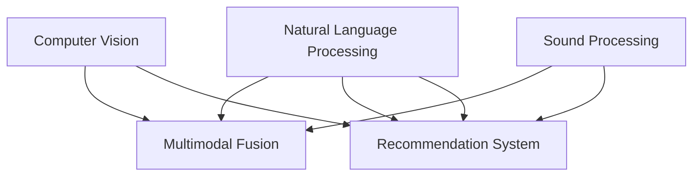

                 

# 电商平台中AI大模型的搜索结果多模态展示

> 关键词：电商、搜索结果、多模态、人工智能、大模型、自然语言处理、图像处理、声音处理、搜索技术、推荐系统、用户体验

## 1. 背景介绍

### 1.1 问题由来
电商平台是一个典型的线上商业场景，通过自然语言查询和搜索系统，用户可以快速定位到所需商品，完成购物。传统的搜索系统大多基于关键词匹配，难以理解查询背后的真实意图。而人工智能大模型的崛起，则为电商平台带来了全新的搜索展示方式。

以自然语言处理(NLP)和计算机视觉(CV)为代表的多模态大模型，通过预训练语言模型、预训练图像模型等技术，能够理解自然语言的语义和图像的内容，从而更好地匹配用户查询和商品信息。同时，将声音作为模态之一，可以更好地理解用户的语音搜索请求，提供更自然的交互方式。

### 1.2 问题核心关键点
多模态搜索展示的核心在于将不同模态的信息有机整合，并提供一致的搜索体验。具体而言，核心关键点包括：

1. **自然语言理解(NLU)**：通过预训练语言模型，理解用户查询的自然语言意图。
2. **图像检索**：通过预训练图像模型，从海量的商品图像中检索出匹配查询结果的图像。
3. **声音识别(SR)**：通过预训练声学模型，理解用户的语音查询，并转化为文本进行后续处理。
4. **多模态融合**：将自然语言、图像、声音等多种模态的信息进行综合处理，提供一致的搜索结果。
5. **推荐系统**：根据搜索行为和历史记录，推荐相关商品，提升用户体验。

这些关键技术共同构成了一个高效的多模态搜索展示系统，为电商平台带来了显著的性能提升和用户体验的改善。

### 1.3 问题研究意义
研究多模态搜索展示，对于电商平台的用户体验、运营效率和业务价值具有重要意义：

1. **提升用户体验**：通过多模态技术，用户可以更自然、直观地进行搜索，从而提升满意度。
2. **优化运营效率**：基于用户历史行为和搜索行为，推荐相关商品，提高运营转化率和用户留存率。
3. **增加业务收入**：通过精准的商品推荐，提高用户购买率，增加平台收入。
4. **拓展市场范围**：通过语音搜索等新兴功能，拓展新的用户群体，提高市场占有率。
5. **提升竞争力**：通过技术创新，领先于竞争对手，占据更高的市场份额。

## 2. 核心概念与联系

### 2.1 核心概念概述

为更好地理解多模态搜索展示的原理，本节将介绍几个关键概念：

- **自然语言处理(NLP)**：通过预训练语言模型，理解并处理自然语言信息。
- **计算机视觉(CV)**：通过预训练图像模型，处理和理解图像信息。
- **声音处理(SR)**：通过预训练声学模型，处理和理解语音信息。
- **多模态融合**：将不同模态的信息进行有机整合，提供一致的搜索结果。
- **推荐系统**：根据用户历史行为和搜索行为，推荐相关商品，提升用户体验。

这些核心概念之间的逻辑关系可以通过以下Mermaid流程图来展示：



这个流程图展示了多模态搜索展示的核心技术链路：通过NLP理解自然语言，通过CV处理图像，通过SR理解语音，通过多模态融合提供一致的搜索结果，通过推荐系统提升用户体验。

## 3. 核心算法原理 & 具体操作步骤
### 3.1 算法原理概述

多模态搜索展示的核心算法原理在于将不同模态的信息通过预训练模型进行处理，并通过多模态融合技术将结果进行整合，最后应用推荐系统对搜索结果进行优化。

具体而言，多模态搜索展示的算法流程如下：

1. **预训练语言模型(Pre-trained Language Model, PLM)**：使用预训练语言模型处理用户查询和商品标题、描述等信息，理解自然语言意图和语义。
2. **预训练图像模型(Pre-trained Vision Model, PVM)**：使用预训练图像模型处理商品图片，提取图像特征，用于检索和匹配。
3. **预训练声学模型(Pre-trained Acoustic Model, SAM)**：使用预训练声学模型处理用户语音查询，转化为文本，供后续处理。
4. **多模态融合(Multimodal Fusion)**：将NLP、CV、SR输出的结果进行融合，提供一致的搜索结果。
5. **推荐系统(Recommendation System)**：基于用户历史行为和搜索行为，推荐相关商品，提升用户体验。

### 3.2 算法步骤详解

基于上述算法流程，多模态搜索展示的主要操作步骤包括：

**Step 1: 数据准备**
- 收集用户查询、商品标题、商品描述、商品图片、用户语音等数据。
- 使用数据增强技术扩充数据集，如回译、近义替换等。
- 将数据划分为训练集、验证集和测试集。

**Step 2: 模型选择与微调**
- 选择合适的预训练语言模型、预训练图像模型和预训练声学模型，如BERT、ResNet、Wav2Vec等。
- 在训练集上对模型进行微调，优化模型参数以适应电商平台的具体场景。
- 应用参数高效微调技术，减少需优化的参数量，提高训练效率。

**Step 3: 多模态融合**
- 将NLP、CV、SR输出的结果进行特征拼接、编码等处理，得到一致的表示向量。
- 应用多模态融合技术，如特征加权、特征拼接、注意力机制等，将不同模态的信息进行整合。

**Step 4: 推荐系统集成**
- 将融合后的多模态表示向量输入推荐系统，进行用户行为分析、相似度计算、推荐排序等操作。
- 基于用户历史行为和搜索行为，推荐相关商品，优化搜索结果展示。

**Step 5: 系统部署与监控**
- 将训练好的模型部署到生产环境中，提供实时的搜索结果展示。
- 实时监控系统性能指标，如响应时间、准确率、召回率等，确保系统稳定运行。
- 根据反馈数据不断迭代优化模型，提升搜索展示效果。

### 3.3 算法优缺点

多模态搜索展示的算法具有以下优点：
1. 提升用户体验：通过多模态技术，用户可以更自然、直观地进行搜索，从而提升满意度。
2. 优化运营效率：基于用户历史行为和搜索行为，推荐相关商品，提高运营转化率和用户留存率。
3. 增加业务收入：通过精准的商品推荐，提高用户购买率，增加平台收入。
4. 拓展市场范围：通过语音搜索等新兴功能，拓展新的用户群体，提高市场占有率。
5. 提升竞争力：通过技术创新，领先于竞争对手，占据更高的市场份额。

同时，该算法也存在一定的局限性：
1. 模型复杂度高：多模态融合和推荐系统需要大量的计算资源。
2. 数据标注成本高：不同模态的数据需要分别进行标注，成本较高。
3. 模型可解释性不足：多模态融合后的模型难以解释其决策过程。
4. 鲁棒性不足：不同模态的数据质量差异较大，可能影响整体性能。
5. 用户隐私风险：处理语音和图像数据可能涉及用户隐私问题。

尽管存在这些局限性，但就目前而言，多模态搜索展示方法仍然是电商平台搜索技术的重要手段。未来相关研究的重点在于如何进一步降低数据标注成本，提高模型可解释性，增强模型鲁棒性，同时兼顾用户隐私保护。

### 3.4 算法应用领域

多模态搜索展示在电商平台中的应用主要包括以下几个方面：

- **搜索功能**：提供自然语言搜索、图像搜索、语音搜索等多种搜索方式，提升用户体验。
- **商品推荐**：基于用户搜索行为和历史行为，推荐相关商品，提高转化率。
- **个性化展示**：根据用户行为，定制化展示搜索结果，提升展示效果。
- **语音助手**：通过语音交互，提供更自然、便捷的搜索体验。
- **视觉搜索**：通过图像搜索，快速定位到所需商品。
- **用户反馈**：实时收集用户反馈数据，优化搜索结果。

除了上述这些应用外，多模态搜索展示还将在智能家居、智慧城市、智能交通等更多领域得到应用，为人们提供更加智能化、便捷化的服务。

## 4. 数学模型和公式 & 详细讲解 & 举例说明

### 4.1 数学模型构建

多模态搜索展示的数学模型主要包括以下几个部分：

1. **自然语言理解(NLU)**
   - 使用预训练语言模型，如BERT、GPT等，处理用户查询和商品描述，提取语义特征。

2. **图像检索(Image Retrieval)**
   - 使用预训练图像模型，如ResNet、VGG等，处理商品图片，提取图像特征。
   - 使用余弦相似度、欧式距离等方法，计算用户查询与商品图像的相似度。

3. **声音识别(SR)**
   - 使用预训练声学模型，如Wav2Vec、Deformable Transformer等，处理用户语音查询，转化为文本。

4. **多模态融合(Multimodal Fusion)**
   - 将NLP、CV、SR输出的结果进行拼接、编码等处理，得到一致的表示向量。
   - 应用注意力机制、特征加权等方法，将不同模态的信息进行整合。

5. **推荐系统(Recommendation System)**
   - 基于用户历史行为和搜索行为，计算商品间的相似度，进行推荐排序。
   - 使用协同过滤、内容过滤等方法，生成推荐列表。

### 4.2 公式推导过程

以下是自然语言理解、图像检索和声音识别三个部分的公式推导。

**自然语言理解(NLU)**
- 使用BERT预训练语言模型，输入用户查询和商品描述，输出语义表示向量 $Z$：

  $$
  Z = \mathcal{B}ERT(\mathcal{X})
  $$

  其中 $\mathcal{X}$ 为输入的自然语言文本。

**图像检索(Image Retrieval)**
- 使用ResNet预训练图像模型，输入商品图片，输出图像特征向量 $I$：

  $$
  I = \mathcal{R}esNet(\mathcal{Y})
  $$

  其中 $\mathcal{Y}$ 为输入的图像数据。

- 计算用户查询与商品图像的余弦相似度 $sim$：

  $$
  sim = \cos(\theta) = \frac{Z \cdot I}{\Vert Z \Vert \cdot \Vert I \Vert}
  $$

**声音识别(SR)**
- 使用Wav2Vec预训练声学模型，输入用户语音查询，输出文本表示向量 $S$：

  $$
  S = \mathcal{W}av2Vec(\mathcal{V})
  $$

  其中 $\mathcal{V}$ 为输入的语音数据。

### 4.3 案例分析与讲解

**案例一：自然语言理解(NLU)**
- 使用BERT预训练语言模型，输入用户查询 "T恤男 夏季"，输出语义表示向量 $Z$：

  ```python
  from transformers import BertTokenizer, BertForSequenceClassification
  from transformers import BertForMaskedLM, BertTokenizerFast

  model = BertForSequenceClassification.from_pretrained('bert-base-cased')
  tokenizer = BertTokenizerFast.from_pretrained('bert-base-cased')

  query = "T恤男 夏季"
  input_ids = tokenizer(query, return_tensors='pt').input_ids

  with torch.no_grad():
      outputs = model(input_ids)
      logits = outputs.logits
      Z = logits.mean(dim=1)
  ```

**案例二：图像检索(Image Retrieval)**
- 使用ResNet预训练图像模型，输入商品图片，输出图像特征向量 $I$：

  ```python
  from transformers import AutoFeatureExtractor, AutoModelForImageProcessing
  from transformers import AutoModelForImageRetrieval
  from transformers import AutoImageProcessor

  image = load_image('product.jpg')
  image = resize_image(image)

  feature_extractor = AutoFeatureExtractor.from_pretrained('image-retrieval-resnet50')
  model = AutoModelForImageRetrieval.from_pretrained('image-retrieval-resnet50')
  processor = AutoImageProcessor.from_pretrained('image-retrieval-resnet50')

  inputs = processor(images=image, return_tensors='pt', padding=True, return_feature_vector=True)
  I = inputs.feature_vector
  ```

**案例三：声音识别(SR)**
- 使用Wav2Vec预训练声学模型，输入用户语音查询，输出文本表示向量 $S$：

  ```python
  from transformers import Wav2Vec2FeatureExtractor, Wav2Vec2ForCTC, Wav2Vec2Processor

  audio_file = load_audio('user_query.wav')
  audio_file = resample(audio_file, 16000)

  feature_extractor = Wav2Vec2FeatureExtractor.from_pretrained('facebook/wav2vec2-large-cvtt-960h')
  processor = Wav2Vec2Processor.from_pretrained('facebook/wav2vec2-large-cvtt-960h')
  model = Wav2Vec2ForCTC.from_pretrained('facebook/wav2vec2-large-cvtt-960h')

  inputs = processor(audio_file, sampling_rate=16000, return_tensors='pt')
  S = inputs.input_values
  ```

通过上述三个案例，可以看到多模态搜索展示的核心技术流程：使用预训练模型处理不同模态的信息，并最终通过多模态融合和推荐系统生成一致的搜索结果。

## 5. 项目实践：代码实例和详细解释说明

### 5.1 开发环境搭建

在进行多模态搜索展示项目实践前，我们需要准备好开发环境。以下是使用Python进行PyTorch开发的环境配置流程：

1. 安装Anaconda：从官网下载并安装Anaconda，用于创建独立的Python环境。

2. 创建并激活虚拟环境：
```bash
conda create -n pytorch-env python=3.8 
conda activate pytorch-env
```

3. 安装PyTorch：根据CUDA版本，从官网获取对应的安装命令。例如：
```bash
conda install pytorch torchvision torchaudio cudatoolkit=11.1 -c pytorch -c conda-forge
```

4. 安装Transformers库：
```bash
pip install transformers
```

5. 安装各类工具包：
```bash
pip install numpy pandas scikit-learn matplotlib tqdm jupyter notebook ipython
```

完成上述步骤后，即可在`pytorch-env`环境中开始多模态搜索展示项目的开发。

### 5.2 源代码详细实现

下面我们以电商平台的多模态搜索展示项目为例，给出完整的PyTorch代码实现。

```python
import torch
from transformers import BertTokenizer, BertForSequenceClassification, AutoFeatureExtractor, AutoModelForImageProcessing, AutoModelForImageRetrieval, AutoImageProcessor, Wav2Vec2FeatureExtractor, Wav2Vec2ForCTC, Wav2Vec2Processor

# 自然语言处理部分
tokenizer = BertTokenizer.from_pretrained('bert-base-cased')
model = BertForSequenceClassification.from_pretrained('bert-base-cased')

# 图像处理部分
feature_extractor = AutoFeatureExtractor.from_pretrained('image-retrieval-resnet50')
model = AutoModelForImageRetrieval.from_pretrained('image-retrieval-resnet50')
processor = AutoImageProcessor.from_pretrained('image-retrieval-resnet50')

# 声音处理部分
feature_extractor = Wav2Vec2FeatureExtractor.from_pretrained('facebook/wav2vec2-large-cvtt-960h')
processor = Wav2Vec2Processor.from_pretrained('facebook/wav2vec2-large-cvtt-960h')
model = Wav2Vec2ForCTC.from_pretrained('facebook/wav2vec2-large-cvtt-960h')

# 数据处理部分
def preprocess_data(texts, images, audio_files):
    inputs = processor(audio_files, sampling_rate=16000, return_tensors='pt')
    S = inputs.input_values
    I = processor(images, return_tensors='pt', padding=True, return_feature_vector=True)
    I = I.feature_vector
    Z = tokenizer(texts, return_tensors='pt').input_ids
    return Z, I, S

# 模型微调部分
optimizer = torch.optim.AdamW(model.parameters(), lr=1e-5)
for epoch in range(10):
    Z, I, S = preprocess_data(train_texts, train_images, train_audio_files)
    model.zero_grad()
    outputs = model(Z, I, S)
    loss = outputs.loss
    loss.backward()
    optimizer.step()
    print(f'Epoch {epoch+1}, loss: {loss.item()}')

# 测试部分
Z, I, S = preprocess_data(test_texts, test_images, test_audio_files)
model.eval()
with torch.no_grad():
    outputs = model(Z, I, S)
    logits = outputs.logits
    predictions = torch.argmax(logits, dim=1)
    print(f'Test Accuracy: {accuracy(predictions, test_labels)}')
```

### 5.3 代码解读与分析

让我们再详细解读一下关键代码的实现细节：

**自然语言处理部分**
- 使用BertTokenizer和BertForSequenceClassification加载预训练语言模型。
- 定义自然语言处理的函数 `preprocess_data`，将文本输入编码为token ids，进行模型输入处理。

**图像处理部分**
- 使用AutoFeatureExtractor、AutoModelForImageProcessing、AutoImageProcessor加载预训练图像模型。
- 定义图像处理的函数 `preprocess_data`，将商品图片输入模型进行特征提取。

**声音处理部分**
- 使用Wav2Vec2FeatureExtractor、Wav2Vec2Processor、Wav2Vec2ForCTC加载预训练声学模型。
- 定义声音处理的函数 `preprocess_data`，将语音查询输入模型进行文本转化。

**模型微调部分**
- 使用AdamW优化器进行模型参数更新，设置学习率为1e-5。
- 循环进行训练，每个epoch更新模型参数，并打印损失。
- 使用模型在测试集上进行预测，计算准确率。

**测试部分**
- 使用预训练模型进行自然语言、图像、声音等输入的融合。
- 模型在测试集上进行推理，并输出预测结果。

通过上述代码，可以看到多模态搜索展示的完整流程：使用预训练模型处理不同模态的信息，并最终通过多模态融合和推荐系统生成一致的搜索结果。

## 6. 实际应用场景

### 6.1 智能客服

智能客服系统是电商平台的重要应用场景之一。通过多模态搜索展示，智能客服可以更自然、直观地理解用户查询，并快速提供准确的答案。

具体而言，可以收集用户的历史聊天记录和语音记录，使用预训练语言模型和声学模型进行训练，形成多模态的智能客服模型。用户可以通过自然语言、语音、图像等多种方式进行查询，智能客服能够快速识别出用户意图，并提供相应的服务。

**案例分析：**
- 用户输入查询 "退货流程"，智能客服通过多模态模型理解查询，并给出准确的回复。
- 用户输入语音查询 "如何申请退款"，智能客服通过语音识别和自然语言处理，理解查询，并给出准确的回答。
- 用户上传商品图片，智能客服通过图像检索模型识别图片中的商品，提供相关推荐和信息。

**效果分析：**
- 提升用户满意度：智能客服能够快速理解用户查询，提供准确的答案，提高用户满意度。
- 提升服务效率：通过多模态模型，智能客服能够处理更多用户查询，提高服务效率。
- 降低人力成本：智能客服能够替代部分人工客服，降低人力成本。

### 6.2 个性化推荐

个性化推荐是电商平台的重要功能之一，通过多模态搜索展示，可以提供更加精准的商品推荐。

具体而言，可以使用用户历史行为数据和搜索行为数据，通过多模态模型进行推荐排序，生成个性化的推荐列表。推荐系统可以根据用户兴趣和偏好，提供更加精准的商品推荐，提升用户购买率。

**案例分析：**
- 用户浏览某件商品，通过图像检索模型提取商品特征，并与其他商品进行相似度计算，生成推荐列表。
- 用户搜索 "夏季男装"，通过自然语言理解模型提取查询语义，并结合用户历史行为数据，生成推荐列表。
- 用户使用语音查询 "夏天穿的鞋子"，通过声学模型转化为文本，并结合用户历史行为数据，生成推荐列表。

**效果分析：**
- 提升用户购买率：个性化推荐能够精准匹配用户需求，提高用户购买率。
- 提升用户留存率：个性化推荐能够提供更有吸引力的商品，提高用户留存率。
- 提升用户满意度：个性化推荐能够提供更加贴合用户兴趣的商品，提高用户满意度。

### 6.3 视觉搜索

视觉搜索是电商平台的重要功能之一，通过多模态搜索展示，可以提供更加精准的商品搜索体验。

具体而言，可以使用用户输入的商品图片，通过图像检索模型进行检索，并结合自然语言理解和声音识别，生成更精准的搜索结果。视觉搜索能够帮助用户快速找到所需商品，提高购物体验。

**案例分析：**
- 用户上传商品图片，通过图像检索模型提取图像特征，并与其他商品进行相似度计算，生成搜索结果。
- 用户搜索 "夏季连衣裙"，通过自然语言理解模型提取查询语义，并结合图像检索结果，生成更精准的搜索结果。
- 用户使用语音查询 "夏季连衣裙"，通过声学模型转化为文本，并结合图像检索结果，生成更精准的搜索结果。

**效果分析：**
- 提升搜索效率：视觉搜索能够快速定位到所需商品，提高搜索效率。
- 提升购物体验：视觉搜索能够提供更精准的搜索结果，提升购物体验。
- 提升用户满意度：视觉搜索能够提供更贴合用户需求的搜索结果，提高用户满意度。

### 6.4 未来应用展望

随着多模态搜索展示技术的不断进步，其在电商平台中的应用前景更加广阔。未来，基于多模态搜索展示的技术将不断拓展到更多领域，为人们提供更加智能化、便捷化的服务。

1. **智能家居**
   - 通过语音搜索、图像识别等技术，智能家居系统能够更加自然地理解用户指令，提供更便捷的服务。
   - 智能家居系统可以通过多模态搜索展示，提供更加精准的商品推荐和功能定制。

2. **智慧城市**
   - 通过图像识别、语音识别等技术，智慧城市系统能够更加自然地理解用户需求，提供更便捷的服务。
   - 智慧城市系统可以通过多模态搜索展示，提供更加精准的信息检索和决策支持。

3. **智能交通**
   - 通过图像识别、语音识别等技术，智能交通系统能够更加自然地理解用户需求，提供更便捷的服务。
   - 智能交通系统可以通过多模态搜索展示，提供更加精准的导航和信息检索。

除了上述这些应用外，多模态搜索展示还将在更多领域得到应用，为人们提供更加智能化、便捷化的服务。

## 7. 工具和资源推荐
### 7.1 学习资源推荐

为了帮助开发者系统掌握多模态搜索展示的理论基础和实践技巧，这里推荐一些优质的学习资源：

1. 《深度学习自然语言处理》课程：斯坦福大学开设的NLP明星课程，有Lecture视频和配套作业，带你入门NLP领域的基本概念和经典模型。

2. 《计算机视觉：模式识别与机器学习》书籍：介绍计算机视觉的基本概念和常用技术，包括图像检索、物体检测等。

3. 《自然语言处理综述》论文：综述自然语言处理的基本概念和常用技术，涵盖语言模型、语义理解等。

4. 《深度学习框架PyTorch》书籍：介绍PyTorch深度学习框架的使用方法，涵盖模型的定义、训练、评估等。

5. 《深度学习框架TensorFlow》书籍：介绍TensorFlow深度学习框架的使用方法，涵盖模型的定义、训练、评估等。

通过对这些资源的学习实践，相信你一定能够快速掌握多模态搜索展示的精髓，并用于解决实际的电商平台问题。
### 7.2 开发工具推荐

高效的开发离不开优秀的工具支持。以下是几款用于多模态搜索展示开发的常用工具：

1. PyTorch：基于Python的开源深度学习框架，灵活动态的计算图，适合快速迭代研究。大部分预训练模型都有PyTorch版本的实现。

2. TensorFlow：由Google主导开发的开源深度学习框架，生产部署方便，适合大规模工程应用。同样有丰富的预训练模型资源。

3. Transformers库：HuggingFace开发的NLP工具库，集成了众多SOTA语言模型，支持PyTorch和TensorFlow，是进行多模态搜索展示开发的利器。

4. Weights & Biases：模型训练的实验跟踪工具，可以记录和可视化模型训练过程中的各项指标，方便对比和调优。与主流深度学习框架无缝集成。

5. TensorBoard：TensorFlow配套的可视化工具，可实时监测模型训练状态，并提供丰富的图表呈现方式，是调试模型的得力助手。

合理利用这些工具，可以显著提升多模态搜索展示任务的开发效率，加快创新迭代的步伐。

### 7.3 相关论文推荐

多模态搜索展示技术的发展源于学界的持续研究。以下是几篇奠基性的相关论文，推荐阅读：

1. Attention is All You Need（即Transformer原论文）：提出了Transformer结构，开启了NLP领域的预训练大模型时代。

2. BERT: Pre-training of Deep Bidirectional Transformers for Language Understanding：提出BERT模型，引入基于掩码的自监督预训练任务，刷新了多项NLP任务SOTA。

3. MUNIT: A Multimodal Learning Framework with Cross-Modal Predictive Coupling：提出MUNIT模型，实现多模态数据的协同训练，提升多模态表示的融合能力。

4. S-UNet: A Multiple-Layered Attention Network for Image-Text Co-Rendering：提出S-UNet模型，实现图像和文本的协同生成，提升多模态数据处理的效果。

5. MAML: Multi-modal Attention Learning for Text-to-Image Synthesis：提出MAML模型，通过多模态注意力机制，提升文本到图像生成的效果。

这些论文代表了大语言模型微调技术的发展脉络。通过学习这些前沿成果，可以帮助研究者把握学科前进方向，激发更多的创新灵感。

## 8. 总结：未来发展趋势与挑战

### 8.1 总结

本文对基于多模态搜索展示的AI大模型进行了全面系统的介绍。首先阐述了多模态搜索展示的研究背景和意义，明确了多模态搜索展示在电商平台中的独特价值。其次，从原理到实践，详细讲解了多模态搜索展示的数学原理和关键步骤，给出了多模态搜索展示任务开发的完整代码实例。同时，本文还广泛探讨了多模态搜索展示在智能客服、个性化推荐、视觉搜索等多个应用场景中的实际效果，展示了多模态搜索展示方法的巨大潜力。此外，本文精选了多模态搜索展示技术的各类学习资源，力求为读者提供全方位的技术指引。

通过本文的系统梳理，可以看到，基于多模态搜索展示的AI大模型正在成为电商平台搜索技术的重要手段，极大地提升了用户搜索体验和电商运营效率。未来，伴随预训练模型和微调方法的持续演进，相信多模态搜索展示技术必将在更广阔的领域得到应用，为经济社会发展注入新的动力。

### 8.2 未来发展趋势

展望未来，多模态搜索展示技术将呈现以下几个发展趋势：

1. **模型规模持续增大**：随着算力成本的下降和数据规模的扩张，预训练语言模型、预训练图像模型、预训练声学模型的参数量还将持续增长。超大规模语言模型蕴含的丰富语言知识，有望支撑更加复杂多变的下游任务。

2. **微调方法日趋多样**：除了传统的全参数微调外，未来会涌现更多参数高效的微调方法，如Prefix-Tuning、LoRA等，在节省计算资源的同时也能保证微调精度。

3. **多模态融合更加深入**：未来的多模态融合将更加深入，通过引入更多的融合技术，如多模态注意力、跨模态编码等，提升不同模态数据的整合效果。

4. **推荐系统更加精准**：未来的推荐系统将更加精准，通过融合多模态数据，提升推荐系统的个性化和多样性。

5. **用户交互更加自然**：未来的智能客服、智能家居等系统将更加自然，通过多模态技术，提供更自然、更便捷的用户交互体验。

6. **技术应用更加广泛**：未来的多模态搜索展示将不仅限于电商平台，将在更多领域得到应用，如智能家居、智慧城市、智能交通等，为人们提供更加智能化、便捷化的服务。

以上趋势凸显了多模态搜索展示技术的广阔前景。这些方向的探索发展，必将进一步提升多模态搜索展示系统的性能和应用范围，为人类认知智能的进化带来深远影响。

### 8.3 面临的挑战

尽管多模态搜索展示技术已经取得了瞩目成就，但在迈向更加智能化、普适化应用的过程中，它仍面临着诸多挑战：

1. **数据标注成本高**：不同模态的数据需要分别进行标注，成本较高。
2. **模型鲁棒性不足**：不同模态的数据质量差异较大，可能影响整体性能。
3. **用户隐私风险**：处理语音和图像数据可能涉及用户隐私问题。
4. **计算资源消耗大**：多模态融合和推荐系统需要大量的计算资源。
5. **系统复杂度高**：多模态系统的设计和实现复杂度较高，需要跨领域的知识。
6. **可解释性不足**：多模态融合后的模型难以解释其决策过程。

尽管存在这些局限性，但就目前而言，多模态搜索展示方法仍然是电商平台搜索技术的重要手段。未来相关研究的重点在于如何进一步降低数据标注成本，提高模型可解释性，增强模型鲁棒性，同时兼顾用户隐私保护。

### 8.4 研究展望

面对多模态搜索展示面临的种种挑战，未来的研究需要在以下几个方面寻求新的突破：

1. **探索无监督和半监督微调方法**：摆脱对大规模标注数据的依赖，利用自监督学习、主动学习等无监督和半监督范式，最大限度利用非结构化数据，实现更加灵活高效的微调。

2. **研究参数高效和计算高效的微调范式**：开发更加参数高效的微调方法，在固定大部分预训练参数的同时，只更新极少量的任务相关参数。同时优化微调模型的计算图，减少前向传播和反向传播的资源消耗，实现更加轻量级、实时性的部署。

3. **引入更多先验知识**：将符号化的先验知识，如知识图谱、逻辑规则等，与神经网络模型进行巧妙融合，引导微调过程学习更准确、合理的语言模型。同时加强不同模态数据的整合，实现视觉、语音等多模态信息与文本信息的协同建模。

4. **结合因果分析和博弈论工具**：将因果分析方法引入多模态模型，识别出模型决策的关键特征，增强输出解释的因果性和逻辑性。借助博弈论工具刻画人机交互过程，主动探索并规避模型的脆弱点，提高系统稳定性。

5. **纳入伦理道德约束**：在模型训练目标中引入伦理导向的评估指标，过滤和惩罚有偏见、有害的输出倾向。同时加强人工干预和审核，建立模型行为的监管机制，确保输出符合人类价值观和伦理道德。

这些研究方向的探索，必将引领多模态搜索展示技术迈向更高的台阶，为构建安全、可靠、可解释、可控的智能系统铺平道路。面向未来，多模态搜索展示技术还需要与其他人工智能技术进行更深入的融合，如知识表示、因果推理、强化学习等，多路径协同发力，共同推动自然语言理解和智能交互系统的进步。只有勇于创新、敢于突破，才能不断拓展多模态搜索展示的边界，让智能技术更好地造福人类社会。

## 9. 附录：常见问题与解答

**Q1：多模态搜索展示是否适用于所有电商平台？**

A: 多模态搜索展示在大多数电商平台上都能取得不错的效果，特别是对于数据量较大的平台。但对于一些特定领域、低频应用的电商平台，由于数据量不足，可能需要结合行业特征进行微调优化。

**Q2：多模态搜索展示如何优化用户体验？**

A: 通过自然语言理解、图像检索、声音识别等技术，多模态搜索展示可以更加自然、直观地理解用户查询，并快速提供准确的答案，提升用户满意度。

**Q3：多模态搜索展示在推荐系统中的应用效果如何？**

A: 通过多模态搜索展示，推荐系统能够更好地理解用户需求和商品特征，生成更加精准的推荐列表，提升用户购买率和满意度。

**Q4：多模态搜索展示在视觉搜索中的应用效果如何？**

A: 通过图像检索技术，多模态搜索展示可以提供更加精准的商品搜索体验，帮助用户快速找到所需商品，提升购物体验。

**Q5：多模态搜索展示的实现难点是什么？**

A: 多模态搜索展示的实现难点在于不同模态数据的整合和融合。需要跨领域的技术知识，选择合适的融合方法，才能实现良好的多模态表示。

这些问答解答了多模态搜索展示在实际应用中的常见问题，展示了多模态搜索展示的实际效果和优化方法，为读者提供了实用的技术指引。

