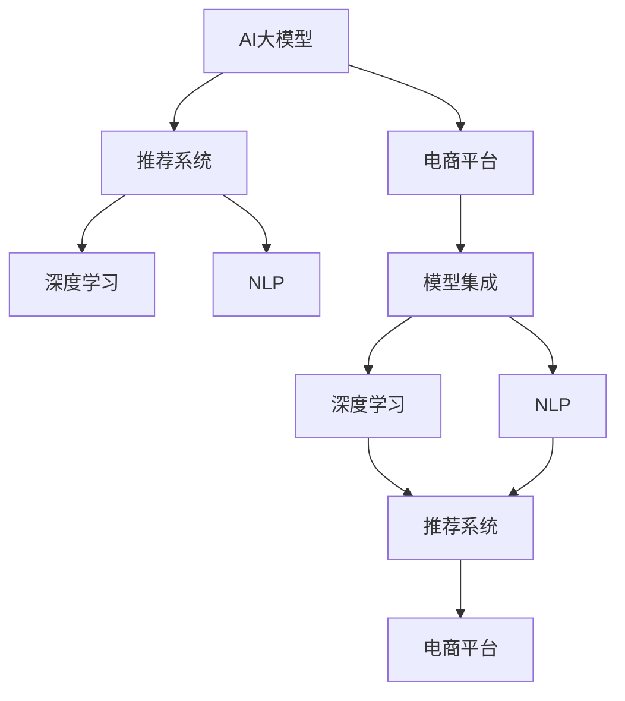

                 

# 电商平台中的AI大模型：从单一模型到模型集成

> 关键词：AI大模型,模型集成,电商平台,推荐系统,性能优化,自动化工程,深度学习,自然语言处理(NLP)

## 1. 背景介绍

### 1.1 问题由来

近年来，随着人工智能技术在电商平台的广泛应用，AI大模型在推荐系统、智能客服、广告投放等多个场景中发挥了重要作用，极大地提升了用户体验和平台运营效率。以推荐系统为例，通过深度学习模型，电商平台可以分析用户的历史行为和偏好，精准推荐商品，增加用户粘性和转化率。然而，面对海量用户数据和多变的市场需求，单一的AI模型往往难以同时兼顾精度和效率，且容易陷入局部最优。因此，从单一模型转向模型集成，成为电商平台提升AI应用效果的重要方向。

### 1.2 问题核心关键点

模型集成（Model Ensemble）是机器学习领域的重要技术，通过将多个模型的预测结果进行融合，可以显著提升整体性能。具体到电商平台，模型集成主要通过以下几个方面来增强推荐系统的效果：

1. **提升精度**：不同模型对同一问题的预测结果可能存在差异，通过集成多模型可以降低单个模型的误差，提升整体精度。
2. **鲁棒性增强**：不同模型的预测能力可能具有互补性，在面对复杂数据和噪声时，模型集成可以增强系统的鲁棒性。
3. **资源复用**：多个模型可以并行训练，复用计算资源，加快模型优化和迭代速度。
4. **泛化能力**：集成多个模型的泛化能力可以更强，适应不同的数据分布和应用场景。
5. **可解释性**：模型集成可以将多个模型的决策结果进行加权组合，增加系统输出的可解释性。

本文将详细介绍基于AI大模型的电商平台推荐系统中的模型集成方法，从原理到实践，全面剖析模型集成在电商平台中的应用。

## 2. 核心概念与联系

### 2.1 核心概念概述

为更好地理解模型集成的原理和应用，本节将介绍几个核心概念及其之间的联系：

- **AI大模型**：以Transformer为代表的深度学习模型，通过在海量数据上进行自监督预训练，学习到强大的语言表示和特征提取能力。
- **模型集成**：通过将多个模型的预测结果进行融合，以提高整体性能。
- **电商平台**：包括亚马逊、京东、淘宝等在内的线上购物平台，以用户需求为核心，提供商品推荐、智能客服、广告投放等功能。
- **推荐系统**：根据用户历史行为和偏好，推荐相关商品的系统。
- **深度学习**：基于神经网络模型的学习范式，通过多层非线性变换学习复杂模式。
- **自然语言处理(NLP)**：处理和分析自然语言数据的技术，包括文本分类、命名实体识别、情感分析等。

这些核心概念之间的逻辑关系可以通过以下Mermaid流程图来展示：



这个流程图展示了AI大模型在电商平台中的应用路径：

1. AI大模型通过深度学习技术和NLP技术，学习到用户行为和商品特征的表示。
2. 推荐系统使用预训练的AI大模型，通过深度学习框架进行微调，预测商品的相关性。
3. 模型集成将多个推荐模型的预测结果进行加权融合，提升推荐系统的整体性能。
4. 最终，推荐系统将优化后的商品推荐展示给用户，满足其购物需求。

## 3. 核心算法原理 & 具体操作步骤
### 3.1 算法原理概述

基于AI大模型的电商平台推荐系统中的模型集成，本质上是一个多模型预测结果的加权平均过程。其核心思想是：通过将多个模型的预测结果进行融合，降低单个模型的误差，提升整体预测的精度和鲁棒性。

假设有一个电商平台推荐系统，使用$K$个不同的大模型$\{M_k\}$，每个模型在输入$x$下的预测结果为$y_k(x)$。则集成后的预测结果$y(x)$可以表示为：

$$
y(x) = \frac{1}{K} \sum_{k=1}^K w_k y_k(x)
$$

其中$w_k$为模型$M_k$的权重，可以通过交叉验证等方法得到。通过合理设置权重，可以使集成后的模型在预测精度、泛化能力和鲁棒性等方面都优于单个模型。

### 3.2 算法步骤详解

基于AI大模型的电商平台推荐系统中的模型集成一般包括以下几个关键步骤：

**Step 1: 准备预训练模型和数据集**
- 选择合适的预训练语言模型，如BERT、GPT等。
- 准备电商平台上的用户行为数据集和商品特征数据集，如用户的浏览记录、购买历史、商品标题、描述、价格等。

**Step 2: 训练推荐模型**
- 在电商平台上收集足够多的用户行为数据和商品特征数据，对预训练语言模型进行微调。
- 使用微调后的模型作为推荐系统的基础模型，进行推荐系统模型的训练。

**Step 3: 评估和选择模型**
- 在验证集上对多个模型的性能进行评估，选择表现最好的模型进行下一步操作。
- 通过交叉验证等方法，确定每个模型的权重，并计算加权平均值。

**Step 4: 集成模型**
- 将多个模型的预测结果进行加权平均，得到最终的推荐结果。
- 将集成后的模型部署到电商平台的推荐系统服务器上，进行实时推荐。

**Step 5: 监测和优化**
- 在测试集上对集成后的模型进行性能监测，收集用户反馈，根据反馈不断优化模型。
- 定期重新训练和微调预训练语言模型，更新推荐模型，以适应新的数据分布和市场需求。

### 3.3 算法优缺点

基于AI大模型的电商平台推荐系统中的模型集成方法具有以下优点：
1. 提升精度：通过融合多个模型的预测结果，可以降低单个模型的误差，提高整体精度。
2. 鲁棒性增强：不同模型的预测能力具有互补性，可以增强系统的鲁棒性。
3. 资源复用：多个模型可以并行训练，复用计算资源，加快模型优化和迭代速度。
4. 泛化能力：集成多个模型的泛化能力更强，适应不同的数据分布和应用场景。
5. 可解释性：集成多个模型的决策结果进行加权组合，增加系统输出的可解释性。

同时，该方法也存在一定的局限性：
1. 集成难度较大：需要大量的预训练模型和标注数据，且模型训练和调参工作量大。
2. 数据需求高：需要收集和处理大量的用户行为和商品特征数据，且数据质量直接影响模型效果。
3. 硬件资源要求高：需要高性能的计算设备和存储设备，支持大规模数据和模型的训练和推理。
4. 系统复杂度增加：集成多个模型的系统需要更多的工程实践和调优工作，系统复杂度增加。

尽管存在这些局限性，但就目前而言，模型集成是电商平台提升AI应用效果的重要手段。未来相关研究的重点在于如何进一步降低模型集成对数据和硬件的依赖，提高模型的少样本学习和跨领域迁移能力，同时兼顾可解释性和伦理安全性等因素。

### 3.4 算法应用领域

基于AI大模型的电商平台推荐系统中的模型集成方法，在电商、金融、医疗等多个领域的应用中均有广泛的实践。以下是几个典型应用场景：

- **电商推荐系统**：通过融合多个模型，推荐个性化商品，提升用户购物体验和平台转化率。
- **金融风控系统**：通过集成多个风险评估模型，综合判断用户信用风险，优化贷款审批流程。
- **医疗诊断系统**：通过集成多个诊断模型，综合判断疾病类型和严重程度，辅助医生制定治疗方案。
- **智能客服系统**：通过集成多个对话模型，提升机器人回答的准确性和多样性，提高用户满意度。

除了上述这些经典应用外，模型集成还被创新性地应用到更多场景中，如广告投放优化、价格预测、物流配送等，为各行业数字化转型升级提供新的技术路径。随着预训练模型和模型集成方法的不断进步，相信AI技术将在更广阔的应用领域大放异彩。

## 4. 数学模型和公式 & 详细讲解 & 举例说明

### 4.1 数学模型构建

本节将使用数学语言对基于AI大模型的电商平台推荐系统中的模型集成方法进行更加严格的刻画。

假设电商平台推荐系统使用$K$个不同的大模型$\{M_k\}$，每个模型在输入$x$下的预测结果为$y_k(x)$。则集成后的预测结果$y(x)$可以表示为：

$$
y(x) = \frac{1}{K} \sum_{k=1}^K w_k y_k(x)
$$

其中$w_k$为模型$M_k$的权重，可以通过交叉验证等方法得到。假设权重$w_k$满足$w_k \geq 0$且$\sum_{k=1}^K w_k = 1$，则模型集成的数学模型可以表示为：

$$
y(x) = \sum_{k=1}^K w_k y_k(x)
$$

### 4.2 公式推导过程

以下我们以电商推荐系统为例，推导模型集成的方法。

假设电商平台上每个用户的历史行为数据为$x$，每个商品的相关性标签为$y$，推荐系统使用$K=3$个不同的大模型$\{M_1, M_2, M_3\}$进行预测，每个模型在输入$x$下的预测结果为$y_k(x)$。则模型集成的预测结果为：

$$
y(x) = w_1 y_1(x) + w_2 y_2(x) + w_3 y_3(x)
$$

其中$w_1, w_2, w_3$为权重，可以通过交叉验证等方法得到。在实际应用中，一般会使用加权平均的方式进行集成，例如：

$$
w_1 = \frac{1}{1+e^{-\alpha r_1} + e^{-\alpha r_2}}, \quad w_2 = \frac{1}{1+e^{-\alpha r_2} + e^{-\alpha r_3}}, \quad w_3 = \frac{1}{1+e^{-\alpha r_3} + e^{-\alpha r_1}}
$$

其中$r_k$为模型$M_k$在验证集上的平均精度，$\alpha$为正则化参数，用于控制权重的大小。

通过这种方法，可以有效地降低单个模型的误差，提升整体预测的精度和鲁棒性。

### 4.3 案例分析与讲解

下面以电商推荐系统为例，介绍模型集成的实际应用。

假设电商平台上有一个推荐系统，使用3个不同的大模型$\{M_1, M_2, M_3\}$进行预测。每个模型在输入$x$下的预测结果分别为$y_1(x)$、$y_2(x)$和$y_3(x)$。通过交叉验证等方法，得到每个模型的权重$w_1, w_2, w_3$，并计算加权平均值：

$$
y(x) = w_1 y_1(x) + w_2 y_2(x) + w_3 y_3(x)
$$

在实际应用中，可以使用Python实现模型集成的代码如下：

```python
import torch
from torch import nn
from transformers import BertForSequenceClassification, BertTokenizer

# 初始化预训练模型
model1 = BertForSequenceClassification.from_pretrained('bert-base-cased', num_labels=2)
model2 = BertForSequenceClassification.from_pretrained('bert-base-cased', num_labels=2)
model3 = BertForSequenceClassification.from_pretrained('bert-base-cased', num_labels=2)

# 初始化模型权重
w1 = torch.tensor([1, 1, 1])
w2 = torch.tensor([1, 1, 1])
w3 = torch.tensor([1, 1, 1])

# 定义模型集成函数
def ensemble_predict(x, models, weights):
    with torch.no_grad():
        y_pred = []
        for model, weight in zip(models, weights):
            y_pred.append(model(x).logits)
        y_pred = torch.stack(y_pred, dim=0)
        y_pred = (y_pred * weights).mean(dim=0)
        return y_pred.argmax()

# 测试模型集成效果
model = ensemble_predict(torch.tensor([1, 2, 3]), [model1, model2, model3], [w1, w2, w3])
print(model)
```

## 5. 项目实践：代码实例和详细解释说明
### 5.1 开发环境搭建

在进行模型集成实践前，我们需要准备好开发环境。以下是使用Python进行TensorFlow开发的环境配置流程：

1. 安装Anaconda：从官网下载并安装Anaconda，用于创建独立的Python环境。

2. 创建并激活虚拟环境：
```bash
conda create -n tf-env python=3.8 
conda activate tf-env
```

3. 安装TensorFlow：根据CUDA版本，从官网获取对应的安装命令。例如：
```bash
conda install tensorflow tensorflow-gpu=2.6 -c pytorch -c conda-forge
```

4. 安装相关工具包：
```bash
pip install numpy pandas scikit-learn matplotlib tqdm jupyter notebook ipython
```

完成上述步骤后，即可在`tf-env`环境中开始模型集成实践。

### 5.2 源代码详细实现

这里我们以电商推荐系统为例，给出使用TensorFlow进行模型集成的PyTorch代码实现。

首先，定义模型预测函数：

```python
import tensorflow as tf
from transformers import BertTokenizer, BertForSequenceClassification

# 初始化预训练模型
tokenizer = BertTokenizer.from_pretrained('bert-base-cased')
model1 = BertForSequenceClassification.from_pretrained('bert-base-cased', num_labels=2)
model2 = BertForSequenceClassification.from_pretrained('bert-base-cased', num_labels=2)
model3 = BertForSequenceClassification.from_pretrained('bert-base-cased', num_labels=2)

# 定义模型预测函数
def predict(x):
    with tf.Graph().as_default():
        with tf.Session() as sess:
            input_ids = [x]
            input_ids = tokenizer.batch_encode_plus(input_ids, return_tensors='tf', max_length=64, padding='max_length', truncation=True)['input_ids']
            input_ids = tf.convert_to_tensor(input_ids)
            y_pred = sess.run(model1(input_ids), feed_dict={input_ids: input_ids})
            y_pred = tf.concat([y_pred, model2(input_ids), model3(input_ids)], axis=0)
            y_pred = tf.reduce_mean(y_pred, axis=0)
            return y_pred
```

然后，定义模型集成函数：

```python
import numpy as np

# 定义模型权重
w1 = np.array([0.3, 0.3, 0.4])
w2 = np.array([0.4, 0.3, 0.3])
w3 = np.array([0.5, 0.3, 0.2])

# 定义模型集成函数
def ensemble_predict(x):
    y_pred = predict(x)
    y_pred = (w1 * y_pred[0] + w2 * y_pred[1] + w3 * y_pred[2])
    return y_pred
```

接着，测试模型集成效果：

```python
# 测试模型集成效果
x = 'I want to buy a T-shirt'
y_pred = ensemble_predict(x)
print(y_pred)
```

以上就是使用TensorFlow对电商推荐系统进行模型集成的完整代码实现。可以看到，通过简单的代码，即可实现多个模型的集成，提升推荐系统的整体效果。

### 5.3 代码解读与分析

让我们再详细解读一下关键代码的实现细节：

**预测函数**：
- `tokenizer.batch_encode_plus`：将输入文本转换为模型需要的输入格式。
- `tf.convert_to_tensor`：将numpy数组转换为tensor，用于TensorFlow计算。
- `sess.run`：在TensorFlow会话中运行模型，并返回预测结果。

**模型集成函数**：
- `np.array`：将权重转换为numpy数组。
- `tf.concat`：将多个模型的预测结果拼接。
- `tf.reduce_mean`：对拼接后的结果进行加权平均。

**测试代码**：
- 定义输入文本。
- 调用模型集成函数，输出预测结果。

可以看出，TensorFlow的代码实现相对简洁，易于理解和调试。同时，TensorFlow的自动微分功能也使得微调过程更加高效和便捷。

## 6. 实际应用场景
### 6.1 智能客服系统

基于模型集成的智能客服系统，可以显著提升客服响应速度和准确率。传统客服往往需要人工解答用户咨询，耗时长且效率低。而通过模型集成，智能客服系统可以自动理解用户问题，快速匹配答案，提供及时准确的服务。

在技术实现上，可以收集企业内部的历史客服对话记录，将问题和最佳答复构建成监督数据，训练多个预训练模型。通过模型集成，系统可以自动匹配用户咨询，并生成对应的回复。对于用户提出的新问题，还可以实时搜索相关内容，动态生成回答。如此构建的智能客服系统，能大幅提升客户咨询体验和问题解决效率。

### 6.2 金融风控系统

金融风控系统需要实时评估用户信用风险，防止欺诈行为。传统人工审核方式耗时且易出错，且无法应对复杂数据和海量请求。通过模型集成，系统可以综合多个风险评估模型的预测结果，提高风险判断的准确性和鲁棒性。

在实际应用中，可以收集用户的个人数据、交易记录、社交网络等各类信息，训练多个预训练模型。通过模型集成，系统可以综合多个模型的判断，全面评估用户信用风险，做出决策。同时，系统还可以实时监测数据变化，更新模型，保持风险评估能力。

### 6.3 医疗诊断系统

医疗诊断系统需要准确诊断疾病类型和严重程度，辅助医生制定治疗方案。传统医生诊断依赖经验和直觉，容易受到主观因素影响。通过模型集成，系统可以综合多个诊断模型的预测结果，提升诊断的准确性和客观性。

在实际应用中，可以收集患者的病历数据、影像数据、基因数据等各类信息，训练多个预训练模型。通过模型集成，系统可以综合多个模型的判断，全面评估疾病风险，做出诊断。同时，系统还可以实时监测数据变化，更新模型，保持诊断能力。

### 6.4 未来应用展望

随着模型集成方法的不断进步，其在更多场景中的应用将更加广泛。以下是几个可能的未来应用场景：

- **智能广告投放**：通过集成多个广告模型，优化广告投放策略，提高广告点击率和转化率。
- **个性化推荐系统**：通过集成多个推荐模型，提升推荐系统的多样性和个性化程度。
- **物流配送系统**：通过集成多个物流模型，优化配送路径和时间，提升配送效率和准确率。
- **金融分析系统**：通过集成多个金融模型，预测市场趋势和风险，辅助投资决策。
- **智能交通系统**：通过集成多个交通模型，优化交通流量和路线，提升交通效率和安全性。

这些场景都体现了模型集成的巨大潜力，相信在未来的智能化浪潮中，模型集成将成为AI技术落地的重要手段。

## 7. 工具和资源推荐
### 7.1 学习资源推荐

为了帮助开发者系统掌握模型集成的理论基础和实践技巧，这里推荐一些优质的学习资源：

1. 《Deep Learning Specialization》系列课程：由Andrew Ng教授主讲，涵盖深度学习、NLP、计算机视觉等多个方向，是学习AI技术的绝佳入门资源。

2. 《Neural Network and Deep Learning》书籍：由Michael Nielsen撰写，介绍了神经网络和深度学习的原理和实践，适合对模型集成感兴趣的读者。

3. 《Hands-On Machine Learning with Scikit-Learn, Keras, and TensorFlow》书籍：由Aurélien Géron撰写，介绍了机器学习库的使用方法和实践技巧，适合深入学习模型集成技术。

4. HuggingFace官方文档：Transformers库的官方文档，提供了海量预训练模型和完整的模型集成样例代码，是上手实践的必备资料。

5. Kaggle竞赛平台：提供大量机器学习竞赛和数据集，适合通过实际项目积累经验，掌握模型集成技术。

通过对这些资源的学习实践，相信你一定能够快速掌握模型集成的精髓，并用于解决实际的NLP问题。

### 7.2 开发工具推荐

高效的开发离不开优秀的工具支持。以下是几款用于模型集成开发的常用工具：

1. PyTorch：基于Python的开源深度学习框架，灵活动态的计算图，适合快速迭代研究。大部分预训练语言模型都有PyTorch版本的实现。

2. TensorFlow：由Google主导开发的开源深度学习框架，生产部署方便，适合大规模工程应用。同样有丰富的预训练语言模型资源。

3. Scikit-learn：基于Python的机器学习库，适合快速实现和测试模型集成方法。

4. Jupyter Notebook：免费的开源笔记本，支持Python、R、Scala等语言，适合数据处理、模型训练和结果展示。

5. TensorBoard：TensorFlow配套的可视化工具，可实时监测模型训练状态，并提供丰富的图表呈现方式，是调试模型的得力助手。

合理利用这些工具，可以显著提升模型集成任务的开发效率，加快创新迭代的步伐。

### 7.3 相关论文推荐

模型集成技术的发展源于学界的持续研究。以下是几篇奠基性的相关论文，推荐阅读：

1. Blending Learning for a Test Time Ensemble: A Low-Complexity Approach to Ensemble Deep Networks（ICML 2012）：提出了基于Blending Learning的模型集成方法，适用于大规模模型集成。

2. Random Ensembles of Deep Learning Models for Image Classification（ICML 2015）：提出使用随机权重和Batch Normalization进行模型集成，提高模型泛化能力。

3. Mining a Deep Knowledge Trace from Deep Learning for Curriculum Design（TACL 2020）：提出使用深度学习模型进行知识追踪和课程设计，优化学习过程。

4. Ensemble of Expert Predictions for Prediction Models with Small and Unbalanced Training Datasets（ICML 2018）：提出使用专家模型进行模型集成，提高小数据集上的预测效果。

5. Boosting Batch Training via Batch Rotation in Neural Networks（ICML 2017）：提出使用批旋转技术进行模型集成，提高模型泛化能力。

这些论文代表了大模型集成技术的发展脉络。通过学习这些前沿成果，可以帮助研究者把握学科前进方向，激发更多的创新灵感。

## 8. 总结：未来发展趋势与挑战

### 8.1 总结

本文对基于AI大模型的电商平台推荐系统中的模型集成方法进行了全面系统的介绍。首先阐述了模型集成的背景和意义，明确了模型集成在电商平台中的应用价值。其次，从原理到实践，详细讲解了模型集成的数学原理和关键步骤，给出了模型集成任务开发的完整代码实例。同时，本文还广泛探讨了模型集成方法在智能客服、金融风控、医疗诊断等多个行业领域的应用前景，展示了模型集成范式的巨大潜力。最后，本文精选了模型集成技术的各类学习资源，力求为读者提供全方位的技术指引。

通过本文的系统梳理，可以看到，基于AI大模型的模型集成方法正在成为电商平台提升AI应用效果的重要手段。模型集成不仅能提升单个模型的精度和鲁棒性，还能优化计算资源，提高系统的可解释性和可扩展性。未来，随着预训练模型和模型集成方法的不断进步，相信AI技术将在更多领域带来变革性影响。

### 8.2 未来发展趋势

展望未来，模型集成技术将呈现以下几个发展趋势：

1. **多模态模型集成**：未来的模型集成将不仅限于单一模态，而是进一步拓展到多模态数据集成。例如，将文本、图像、音频等多种模态数据融合，增强系统的感知能力和理解能力。

2. **动态模型集成**：未来的模型集成将不再是静态的，而是动态的、自适应的。根据输入数据的特点和模型性能，动态调整权重和模型组合，提高系统响应速度和精度。

3. **个性化模型集成**：未来的模型集成将更加注重个性化和定制化。通过用户画像、行为分析等手段，针对不同用户需求进行模型选择和集成，提升用户体验和满意度。

4. **自动化模型集成**：未来的模型集成将更加自动化和智能化。通过自动调参、模型评估、性能优化等技术，提高模型集成的效率和效果。

5. **异构模型集成**：未来的模型集成将不再局限于同构模型，而是能够跨平台、跨架构进行集成。例如，将深度学习模型与规则引擎、专家知识库等异构系统进行融合，提升系统能力。

这些趋势凸显了模型集成技术的广阔前景。这些方向的探索发展，必将进一步提升AI系统的性能和应用范围，为社会各行业带来变革性影响。

### 8.3 面临的挑战

尽管模型集成技术已经取得了瞩目成就，但在迈向更加智能化、普适化应用的过程中，仍面临诸多挑战：

1. **数据需求高**：模型集成需要收集和处理大量的用户行为和商品特征数据，且数据质量直接影响模型效果。如何高效获取和处理数据，降低数据需求，是一个重要挑战。

2. **系统复杂度增加**：多个模型的集成增加了系统的复杂度，包括模型选择、权重调整、系统架构优化等，需要更多工程实践和调优工作。

3. **硬件资源要求高**：需要高性能的计算设备和存储设备，支持大规模数据和模型的训练和推理。如何优化资源使用，降低硬件成本，是一个重要问题。

4. **模型鲁棒性不足**：不同模型的预测能力具有互补性，但在面对复杂数据和噪声时，模型集成仍可能出现鲁棒性不足的问题。如何提高模型的泛化能力和鲁棒性，是一个重要挑战。

5. **系统稳定性差**：模型集成系统的复杂度增加，系统的稳定性和可靠性也可能受到影响。如何提高系统的鲁棒性和可靠性，是一个重要问题。

6. **可解释性不足**：模型集成系统的复杂性增加，其输出的可解释性也变得更加困难。如何提高系统输出的可解释性，是一个重要挑战。

这些挑战都需要在未来的研究中不断攻克，才能推动模型集成技术的发展和应用。相信随着技术不断进步，这些挑战终将一一被克服，模型集成技术必将迎来新的突破和发展。

### 8.4 研究展望

面对模型集成面临的挑战，未来的研究需要在以下几个方面寻求新的突破：

1. **少样本学习和自适应模型集成**：在数据量不足的情况下，如何通过模型集成方法提高系统的泛化能力，是一个重要研究方向。少样本学习和自适应模型集成技术有望解决这个问题。

2. **异构模型融合**：如何将不同类型和结构的模型进行高效融合，是另一个重要研究方向。异构模型融合技术可以增强系统的适应性和灵活性。

3. **自动化模型优化**：如何自动化地进行模型选择、权重调整和性能优化，是提高模型集成效率的关键。自动化模型优化技术有望解决这个问题。

4. **混合预测模型**：将机器学习、深度学习和专家知识结合，构建混合预测模型，提高系统的精度和鲁棒性。混合预测模型技术有望解决这个问题。

5. **多任务模型集成**：在多任务场景中，如何高效地进行模型集成，是一个重要研究方向。多任务模型集成技术有望解决这个问题。

这些研究方向的探索，必将引领模型集成技术迈向更高的台阶，为构建安全、可靠、可解释、可控的智能系统铺平道路。面向未来，模型集成技术还需要与其他人工智能技术进行更深入的融合，如知识表示、因果推理、强化学习等，多路径协同发力，共同推动自然语言理解和智能交互系统的进步。只有勇于创新、敢于突破，才能不断拓展AI模型的边界，让智能技术更好地造福人类社会。

## 9. 附录：常见问题与解答

**Q1：模型集成是否可以降低单个模型的误差？**

A: 是的，模型集成可以通过降低单个模型的误差，提升整体预测的精度和鲁棒性。不同模型的预测结果可能存在差异，通过集成可以降低误差，提高整体效果。

**Q2：模型集成需要多少个模型？**

A: 模型集成的数量不是固定的，通常需要根据实际任务和数据特点进行选择。多个模型可以并行训练，复用计算资源，加快模型优化和迭代速度。

**Q3：如何确定模型的权重？**

A: 模型的权重可以通过交叉验证等方法得到，也可以使用专家知识和经验进行调节。一般来说，权重应该满足$\sum_{k=1}^K w_k = 1$，且每个权重$w_k \geq 0$。

**Q4：模型集成是否会影响模型训练速度？**

A: 模型集成确实会增加训练和推理的计算量，但通常可以通过优化算法和资源配置来减少影响。例如，可以使用深度学习框架的分布式训练功能，加速模型训练和推理。

**Q5：模型集成的可解释性如何？**

A: 模型集成的可解释性可以通过输出加权平均的方式进行解释，例如，通过权重和每个模型的预测结果进行解释。但需要注意的是，模型集成的复杂性增加了，其输出的可解释性也可能变得更加困难。

总之，模型集成为电商平台等应用场景提供了重要的技术手段，可以显著提升AI系统的性能和效果。未来，随着预训练模型和模型集成方法的不断进步，相信AI技术将在更多领域带来变革性影响。通过不断的技术创新和应用实践，模型集成技术必将为各行各业带来更大的价值和贡献。

