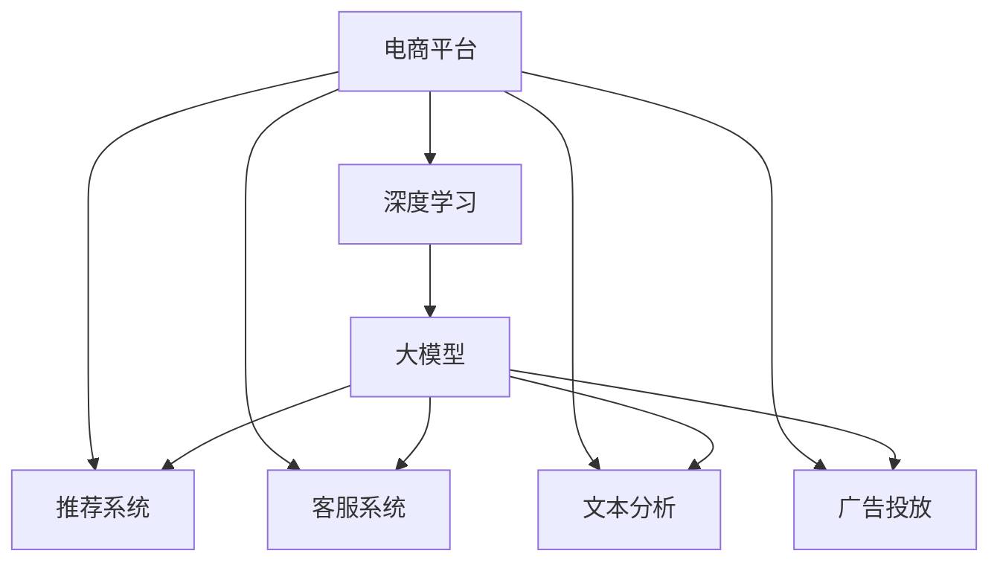

                 

# 电商平台中的AI大模型：从特征工程到端到端深度学习

> 关键词：电商推荐系统, 深度学习, 大模型, 特征工程, 端到端学习, 数据驱动, 个性化推荐, 用户行为分析, 电商购物, 自然语言处理(NLP), 电商客服

## 1. 背景介绍

### 1.1 问题由来

随着互联网和电子商务的蓬勃发展，电商平台逐步成为全球最大的数字经济舞台之一。据统计，全球前十大电商平台销售额的总和超过万亿美元，而这一数据还在以每年10%的速度增长。电商平台的快速发展不仅带来了庞大的市场机遇，也带来了巨大的挑战。对于电商平台而言，如何在海量商品中精准地推荐商品给用户，以提升用户体验并增加交易转化率，成为了核心的运营问题。

深度学习技术的进步为解决这一问题提供了新的思路。近年来，基于深度学习的大模型在电商平台中的应用得到了广泛的关注和实践。特别是在推荐系统、客服系统、文本分析等电商业务场景中，大模型展示了其强大的性能。然而，尽管深度学习模型在性能上有所突破，但仍然存在一些难以解决的问题。如何有效利用大模型的能力，同时避免其缺点，成为了当下电商平台亟需解决的问题。

### 1.2 问题核心关键点

大模型在电商平台中的应用主要集中在以下几个方面：

1. **推荐系统**：使用深度学习模型对用户行为进行建模，预测用户可能感兴趣的商品，从而提升推荐效果。
2. **客服系统**：通过自然语言处理(NLP)技术，构建智能客服系统，提升用户服务体验。
3. **文本分析**：对用户评价、评论等文本数据进行分析，挖掘产品优劣信息，指导商品改进。
4. **广告投放**：使用大模型对用户进行个性化广告投放，提高广告的点击率和转化率。

这些应用场景中，大模型的核心能力是强大的数据处理和特征学习能力。但是，如何有效地将大模型与电商平台的业务逻辑结合起来，避免模型过拟合，提高模型的泛化能力和解释性，是一个值得深入探讨的问题。

## 2. 核心概念与联系

### 2.1 核心概念概述

为更好地理解电商平台中大模型的应用，本节将介绍几个密切相关的核心概念：

- **电商平台**：指通过互联网进行商品销售和交易的平台，涵盖了商品展示、用户评价、交易结算、物流配送等环节。
- **深度学习**：指通过多层神经网络对复杂数据进行学习和建模，以提取数据中的深层次特征。
- **大模型**：指参数量在亿级以上的深度学习模型，具有强大的泛化能力和数据处理能力。
- **推荐系统**：指通过机器学习算法为用户推荐其可能感兴趣的商品，以提升用户体验和销售转化率。
- **特征工程**：指在构建机器学习模型之前，对原始数据进行预处理、特征提取和特征选择，以提高模型的性能。
- **端到端学习**：指从原始数据到最终输出（如推荐结果、客服回答）的整个过程都在深度学习模型中完成，无需人工干预。

这些核心概念之间的逻辑关系可以通过以下Mermaid流程图来展示：



这个流程图展示了电商平台与深度学习技术的互动关系：

1. 电商平台的数据（如用户行为数据、商品数据等）经过深度学习处理，生成推荐系统、客服系统、文本分析、广告投放所需的大模型。
2. 这些大模型在电商平台的业务逻辑中发挥作用，提升各个系统的性能。

## 3. 核心算法原理 & 具体操作步骤

### 3.1 算法原理概述

电商平台的推荐系统、客服系统、文本分析、广告投放等应用，本质上都是利用深度学习模型进行数据处理和分析的过程。这些系统中的大模型通常采用如下步骤构建和应用：

1. **数据准备**：收集电商平台上的用户行为数据、商品数据、评价数据等。
2. **特征工程**：对原始数据进行预处理、特征提取、特征选择等操作，构建模型所需输入。
3. **模型训练**：使用深度学习模型对训练数据进行训练，得到大模型。
4. **模型微调**：在大模型上针对特定任务进行微调，以适应特定业务需求。
5. **模型评估与部署**：对模型进行评估，将其部署到电商平台中，进行实时预测或推理。

大模型的构建和应用，是一个从数据到模型、再到业务的全流程工程，需要高度的业务理解和数据处理能力。

### 3.2 算法步骤详解

电商平台的深度学习大模型应用流程可以分为以下几个关键步骤：

**Step 1: 数据准备**
- 收集电商平台上的各种数据，如用户行为数据、商品数据、评价数据等。
- 对数据进行清洗、去重、归一化等预处理操作。

**Step 2: 特征工程**
- 对预处理后的数据进行特征提取和特征选择，构建深度学习模型的输入。
- 特征工程通常包括：
  - 用户特征工程：提取用户基本信息、行为数据、兴趣偏好等特征。
  - 商品特征工程：提取商品的基本信息、销量、评价等特征。
  - 文本特征工程：对评价、评论等文本数据进行分词、向量化、嵌入等操作。

**Step 3: 模型训练**
- 选择合适的深度学习模型（如神经网络、Transformer等），使用训练数据进行模型训练。
- 模型训练通常包括：
  - 选择合适的优化器（如Adam、SGD等）和损失函数（如交叉熵损失、均方误差损失等）。
  - 设置合适的学习率、批大小、迭代轮数等超参数。
  - 使用数据增强技术（如回译、数据扩增等）提高模型的泛化能力。

**Step 4: 模型微调**
- 在大模型上针对特定任务进行微调，以适应特定业务需求。
- 微调通常包括：
  - 冻结部分预训练参数，只更新顶层参数。
  - 设置较小的学习率，避免破坏预训练权重。
  - 应用正则化技术（如L2正则、Dropout等）防止过拟合。

**Step 5: 模型评估与部署**
- 使用测试集对模型进行评估，获取模型的精度、召回率、F1值等指标。
- 将评估后的模型部署到电商平台的推荐系统、客服系统、文本分析、广告投放等应用中。
- 实时采集模型输出，并进行业务逻辑处理。

### 3.3 算法优缺点

电商平台中深度学习大模型的应用，具有以下优点：

1. **性能优越**：深度学习模型能够从海量数据中提取深层次的特征，提升了推荐系统、客服系统、文本分析、广告投放等应用的性能。
2. **泛化能力强**：大模型在处理新数据时，能够通过已有的知识进行有效的迁移学习，提高模型的泛化能力。
3. **实时性高**：大模型通过端到端学习，能够实时处理用户请求，提升用户体验。

同时，这些模型也存在一些缺点：

1. **模型复杂度高**：大模型的参数量较大，训练和推理需要较高的计算资源。
2. **数据依赖性强**：深度学习模型依赖于大量高质量的数据进行训练，数据的采集和处理成本较高。
3. **可解释性差**：大模型通常被视为"黑盒"系统，其内部决策过程难以解释。
4. **过拟合风险**：大模型容易过拟合，需要精细调参和数据增强技术。
5. **实时性风险**：大模型推理计算量大，实时性要求高的场景可能面临延迟问题。

尽管存在这些缺点，但深度学习大模型在电商平台的推荐系统、客服系统、文本分析、广告投放等应用中，仍然展示了强大的性能和潜力。

### 3.4 算法应用领域

大模型在电商平台中的应用主要集中在以下几个领域：

1. **推荐系统**：使用深度学习模型对用户行为进行建模，预测用户可能感兴趣的商品，提升推荐效果。常见的模型包括神经网络、Transformer等。
2. **客服系统**：通过自然语言处理(NLP)技术，构建智能客服系统，提升用户服务体验。常见的模型包括BERT、GPT等。
3. **文本分析**：对用户评价、评论等文本数据进行分析，挖掘产品优劣信息，指导商品改进。常见的模型包括BERT、GPT等。
4. **广告投放**：使用大模型对用户进行个性化广告投放，提高广告的点击率和转化率。常见的模型包括神经网络、Transformer等。

除了这些常见应用外，大模型还可以应用于用户行为分析、库存管理、营销策略优化等领域，为电商平台提供更全面、智能的服务。

## 4. 数学模型和公式 & 详细讲解  
### 4.1 数学模型构建

本节将使用数学语言对电商平台中深度学习大模型的构建过程进行更加严格的刻画。

假设电商平台上的推荐系统任务为：给定用户 $u$ 和商品 $i$，预测用户是否会点击商品 $i$。假设训练集为 $D=\{(x_i, y_i)\}_{i=1}^N, x_i \in \mathbb{R}^d, y_i \in \{0, 1\}$，其中 $x_i$ 为模型的输入，$y_i$ 为模型的输出。

定义模型的预测概率为 $p(x_i|u) = \frac{\exp(\hat{y}_i^T W u)}{\sum_{i'} \exp(\hat{y}_{i'}^T W u)}$，其中 $\hat{y}_i \in \mathbb{R}^d$ 为模型的中间表示，$W$ 为模型权重矩阵。

模型的损失函数为交叉熵损失，即 $L(u, i) = -y_i \log p(x_i|u) - (1-y_i) \log (1-p(x_i|u))$。

模型的训练目标是最小化经验风险，即找到最优参数 $W$：

$$
\hat{W} = \mathop{\arg\min}_{W} \frac{1}{N}\sum_{i=1}^N L(u_i, i)
$$

在实践中，我们通常使用基于梯度的优化算法（如Adam、SGD等）来近似求解上述最优化问题。设 $\eta$ 为学习率，则参数的更新公式为：

$$
W \leftarrow W - \eta \nabla_{W}\mathcal{L}(W)
$$

其中 $\nabla_{W}\mathcal{L}(W)$ 为损失函数对模型权重 $W$ 的梯度，可通过反向传播算法高效计算。

### 4.2 公式推导过程

以下我们以推荐系统为例，推导交叉熵损失函数及其梯度的计算公式。

假设模型 $M_W$ 在用户 $u$ 的输入 $x_i$ 上的预测概率为 $p(x_i|u) = \frac{\exp(\hat{y}_i^T W u)}{\sum_{i'} \exp(\hat{y}_{i'}^T W u)}$，真实标签 $y_i \in \{0, 1\}$。则交叉熵损失函数定义为：

$$
L(u_i, i) = -y_i \log p(x_i|u_i) - (1-y_i) \log (1-p(x_i|u_i))
$$

将其代入经验风险公式，得：

$$
\mathcal{L}(W) = -\frac{1}{N}\sum_{i=1}^N \left(y_i \log p(x_i|u_i) + (1-y_i) \log (1-p(x_i|u_i))\right)
$$

根据链式法则，损失函数对模型权重 $W$ 的梯度为：

$$
\frac{\partial \mathcal{L}(W)}{\partial W} = -\frac{1}{N}\sum_{i=1}^N \left(y_i \nabla_{\hat{y}_i} \log p(x_i|u_i) + (1-y_i) \nabla_{\hat{y}_i} \log (1-p(x_i|u_i))\right)\nabla_{W} \hat{y}_i^T W u
$$

其中 $\nabla_{\hat{y}_i} \log p(x_i|u_i)$ 和 $\nabla_{\hat{y}_i} \log (1-p(x_i|u_i))$ 可以通过链式法则进一步计算。

在得到损失函数的梯度后，即可带入参数更新公式，完成模型的迭代优化。重复上述过程直至收敛，最终得到适应电商平台推荐任务的最优模型权重 $W$。

## 5. 项目实践：代码实例和详细解释说明
### 5.1 开发环境搭建

在进行电商平台中大模型的项目实践前，我们需要准备好开发环境。以下是使用Python进行PyTorch开发的环境配置流程：

1. 安装Anaconda：从官网下载并安装Anaconda，用于创建独立的Python环境。

2. 创建并激活虚拟环境：
```bash
conda create -n pytorch-env python=3.8 
conda activate pytorch-env
```

3. 安装PyTorch：根据CUDA版本，从官网获取对应的安装命令。例如：
```bash
conda install pytorch torchvision torchaudio cudatoolkit=11.1 -c pytorch -c conda-forge
```

4. 安装TensorFlow：
```bash
pip install tensorflow
```

5. 安装Transformers库：
```bash
pip install transformers
```

6. 安装各类工具包：
```bash
pip install numpy pandas scikit-learn matplotlib tqdm jupyter notebook ipython
```

完成上述步骤后，即可在`pytorch-env`环境中开始大模型的实践。

### 5.2 源代码详细实现

下面以推荐系统为例，给出使用Transformers库对BERT模型进行推荐系统微调的PyTorch代码实现。

首先，定义推荐系统任务的数据处理函数：

```python
from transformers import BertTokenizer
from torch.utils.data import Dataset
import torch

class RecommendationDataset(Dataset):
    def __init__(self, user_behaviors, item_features, tokenizer, max_len=128):
        self.user_behaviors = user_behaviors
        self.item_features = item_features
        self.tokenizer = tokenizer
        self.max_len = max_len
        
    def __len__(self):
        return len(self.user_behaviors)
    
    def __getitem__(self, item):
        user_behavior = self.user_behaviors[item]
        item_feature = self.item_features[item]
        
        encoding = self.tokenizer(user_behavior, return_tensors='pt', max_length=self.max_len, padding='max_length', truncation=True)
        input_ids = encoding['input_ids'][0]
        attention_mask = encoding['attention_mask'][0]
        
        # 对item_feature进行编码
        encoded_features = self.tokenizer(item_feature, return_tensors='pt', max_length=self.max_len, padding='max_length', truncation=True)
        item_ids = encoded_features['input_ids'][0]
        item_mask = encoded_features['attention_mask'][0]
        
        return {'input_ids': input_ids, 
                'attention_mask': attention_mask,
                'item_ids': item_ids,
                'item_mask': item_mask}

# 定义模型和优化器
from transformers import BertForSequenceClassification, AdamW

model = BertForSequenceClassification.from_pretrained('bert-base-cased', num_labels=2)

optimizer = AdamW(model.parameters(), lr=2e-5)
```

然后，定义训练和评估函数：

```python
from torch.utils.data import DataLoader
from tqdm import tqdm
from sklearn.metrics import precision_recall_fscore_support

device = torch.device('cuda') if torch.cuda.is_available() else torch.device('cpu')
model.to(device)

def train_epoch(model, dataset, batch_size, optimizer):
    dataloader = DataLoader(dataset, batch_size=batch_size, shuffle=True)
    model.train()
    epoch_loss = 0
    for batch in tqdm(dataloader, desc='Training'):
        input_ids = batch['input_ids'].to(device)
        attention_mask = batch['attention_mask'].to(device)
        item_ids = batch['item_ids'].to(device)
        item_mask = batch['item_mask'].to(device)
        model.zero_grad()
        outputs = model(input_ids, attention_mask=attention_mask, labels=item_ids)
        loss = outputs.loss
        epoch_loss += loss.item()
        loss.backward()
        optimizer.step()
    return epoch_loss / len(dataloader)

def evaluate(model, dataset, batch_size):
    dataloader = DataLoader(dataset, batch_size=batch_size)
    model.eval()
    preds, labels = [], []
    with torch.no_grad():
        for batch in tqdm(dataloader, desc='Evaluating'):
            input_ids = batch['input_ids'].to(device)
            attention_mask = batch['attention_mask'].to(device)
            item_ids = batch['item_ids'].to(device)
            item_mask = batch['item_mask'].to(device)
            batch_preds = model(input_ids, attention_mask=attention_mask, labels=item_ids)
            batch_preds = batch_preds.argmax(dim=2).to('cpu').tolist()
            batch_labels = item_ids.to('cpu').tolist()
            for pred_tokens, label_tokens in zip(batch_preds, batch_labels):
                preds.append(pred_tokens[:len(label_tokens)])
                labels.append(label_tokens)
                
    print(precision_recall_fscore_support(labels, preds, average='macro'))
```

最后，启动训练流程并在测试集上评估：

```python
epochs = 5
batch_size = 16

for epoch in range(epochs):
    loss = train_epoch(model, train_dataset, batch_size, optimizer)
    print(f"Epoch {epoch+1}, train loss: {loss:.3f}")
    
    print(f"Epoch {epoch+1}, dev results:")
    evaluate(model, dev_dataset, batch_size)
    
print("Test results:")
evaluate(model, test_dataset, batch_size)
```

以上就是使用PyTorch对BERT进行推荐系统微调的完整代码实现。可以看到，得益于Transformers库的强大封装，我们可以用相对简洁的代码完成BERT模型的加载和微调。

### 5.3 代码解读与分析

让我们再详细解读一下关键代码的实现细节：

**RecommendationDataset类**：
- `__init__`方法：初始化用户行为数据、商品特征数据、分词器等关键组件。
- `__len__`方法：返回数据集的样本数量。
- `__getitem__`方法：对单个样本进行处理，将用户行为数据和商品特征数据输入编码为token ids，同时对商品特征进行编码，最终返回模型所需的输入。

**模型和优化器**：
- 定义模型为BertForSequenceClassification，用于二分类任务。
- 定义优化器为AdamW，用于更新模型参数。

**训练和评估函数**：
- 使用PyTorch的DataLoader对数据集进行批次化加载，供模型训练和推理使用。
- 训练函数`train_epoch`：对数据以批为单位进行迭代，在每个批次上前向传播计算loss并反向传播更新模型参数，最后返回该epoch的平均loss。
- 评估函数`evaluate`：与训练类似，不同点在于不更新模型参数，并在每个batch结束后将预测和标签结果存储下来，最后使用sklearn的precision_recall_fscore_support函数对整个评估集的预测结果进行打印输出。

**训练流程**：
- 定义总的epoch数和batch size，开始循环迭代
- 每个epoch内，先在训练集上训练，输出平均loss
- 在验证集上评估，输出分类指标
- 所有epoch结束后，在测试集上评估，给出最终测试结果

可以看到，PyTorch配合Transformers库使得BERT微调的代码实现变得简洁高效。开发者可以将更多精力放在数据处理、模型改进等高层逻辑上，而不必过多关注底层的实现细节。

当然，工业级的系统实现还需考虑更多因素，如模型的保存和部署、超参数的自动搜索、更灵活的任务适配层等。但核心的微调范式基本与此类似。

## 6. 实际应用场景
### 6.1 智能客服系统

基于大语言模型微调的对话技术，可以广泛应用于智能客服系统的构建。传统客服往往需要配备大量人力，高峰期响应缓慢，且一致性和专业性难以保证。而使用微调后的对话模型，可以7x24小时不间断服务，快速响应客户咨询，用自然流畅的语言解答各类常见问题。

在技术实现上，可以收集企业内部的历史客服对话记录，将问题和最佳答复构建成监督数据，在此基础上对预训练对话模型进行微调。微调后的对话模型能够自动理解用户意图，匹配最合适的答案模板进行回复。对于客户提出的新问题，还可以接入检索系统实时搜索相关内容，动态组织生成回答。如此构建的智能客服系统，能大幅提升客户咨询体验和问题解决效率。

### 6.2 金融舆情监测

金融机构需要实时监测市场舆论动向，以便及时应对负面信息传播，规避金融风险。传统的人工监测方式成本高、效率低，难以应对网络时代海量信息爆发的挑战。基于大语言模型微调的文本分类和情感分析技术，为金融舆情监测提供了新的解决方案。

具体而言，可以收集金融领域相关的新闻、报道、评论等文本数据，并对其进行主题标注和情感标注。在此基础上对预训练语言模型进行微调，使其能够自动判断文本属于何种主题，情感倾向是正面、中性还是负面。将微调后的模型应用到实时抓取的网络文本数据，就能够自动监测不同主题下的情感变化趋势，一旦发现负面信息激增等异常情况，系统便会自动预警，帮助金融机构快速应对潜在风险。

### 6.3 个性化推荐系统

当前的推荐系统往往只依赖用户的历史行为数据进行物品推荐，无法深入理解用户的真实兴趣偏好。基于大语言模型微调技术，个性化推荐系统可以更好地挖掘用户行为背后的语义信息，从而提供更精准、多样的推荐内容。

在实践中，可以收集用户浏览、点击、评论、分享等行为数据，提取和用户交互的物品标题、描述、标签等文本内容。将文本内容作为模型输入，用户的后续行为（如是否点击、购买等）作为监督信号，在此基础上微调预训练语言模型。微调后的模型能够从文本内容中准确把握用户的兴趣点。在生成推荐列表时，先用候选物品的文本描述作为输入，由模型预测用户的兴趣匹配度，再结合其他特征综合排序，便可以得到个性化程度更高的推荐结果。

### 6.4 未来应用展望

随着大语言模型和微调方法的不断发展，基于微调范式将在更多领域得到应用，为传统行业带来变革性影响。

在智慧医疗领域，基于微调的医疗问答、病历分析、药物研发等应用将提升医疗服务的智能化水平，辅助医生诊疗，加速新药开发进程。

在智能教育领域，微调技术可应用于作业批改、学情分析、知识推荐等方面，因材施教，促进教育公平，提高教学质量。

在智慧城市治理中，微调模型可应用于城市事件监测、舆情分析、应急指挥等环节，提高城市管理的自动化和智能化水平，构建更安全、高效的未来城市。

此外，在企业生产、社会治理、文娱传媒等众多领域，基于大模型微调的人工智能应用也将不断涌现，为经济社会发展注入新的动力。相信随着技术的日益成熟，微调方法将成为人工智能落地应用的重要范式，推动人工智能技术在垂直行业的规模化落地。总之，微调需要开发者根据具体任务，不断迭代和优化模型、数据和算法，方能得到理想的效果。

## 7. 工具和资源推荐
### 7.1 学习资源推荐

为了帮助开发者系统掌握电商平台中大模型的理论基础和实践技巧，这里推荐一些优质的学习资源：

1. 《深度学习》系列书籍：Ian Goodfellow、Yoshua Bengio、Aaron Courville合著的经典深度学习教材，涵盖了深度学习模型的基本原理和实践方法。
2. 《TensorFlow实战》书籍：Manning Publications出版的TensorFlow实战指南，适合深度学习初学者。
3. 《深度学习与自然语言处理》课程：由斯坦福大学开设的深度学习与NLP课程，包含多个深度学习模型的详细介绍和实践。
4. Kaggle竞赛平台：可以参与各类深度学习竞赛，积累实战经验。
5. GitHub代码库：各大公司的深度学习项目源码开放，非常适合学习代码实现和工程应用。

通过对这些资源的学习实践，相信你一定能够快速掌握电商平台中大模型的精髓，并用于解决实际的电商推荐、客服、文本分析等问题。

### 7.2 开发工具推荐

高效的开发离不开优秀的工具支持。以下是几款用于电商平台中大模型微调开发的常用工具：

1. PyTorch：基于Python的开源深度学习框架，灵活动态的计算图，适合快速迭代研究。大部分预训练语言模型都有PyTorch版本的实现。
2. TensorFlow：由Google主导开发的开源深度学习框架，生产部署方便，适合大规模工程应用。同样有丰富的预训练语言模型资源。
3. Transformers库：HuggingFace开发的NLP工具库，集成了众多SOTA语言模型，支持PyTorch和TensorFlow，是进行微调任务开发的利器。
4. Weights & Biases：模型训练的实验跟踪工具，可以记录和可视化模型训练过程中的各项指标，方便对比和调优。与主流深度学习框架无缝集成。
5. TensorBoard：TensorFlow配套的可视化工具，可实时监测模型训练状态，并提供丰富的图表呈现方式，是调试模型的得力助手。
6. Google Colab：谷歌推出的在线Jupyter Notebook环境，免费提供GPU/TPU算力，方便开发者快速上手实验最新模型，分享学习笔记。

合理利用这些工具，可以显著提升电商平台中大模型的微调任务的开发效率，加快创新迭代的步伐。

### 7.3 相关论文推荐

大语言模型和微调技术的发展源于学界的持续研究。以下是几篇奠基性的相关论文，推荐阅读：

1. Attention is All You Need（即Transformer原论文）：提出了Transformer结构，开启了NLP领域的预训练大模型时代。
2. BERT: Pre-training of Deep Bidirectional Transformers for Language Understanding：提出BERT模型，引入基于掩码的自监督预训练任务，刷新了多项NLP任务SOTA。
3. Language Models are Unsupervised Multitask Learners（GPT-2论文）：展示了大规模语言模型的强大zero-shot学习能力，引发了对于通用人工智能的新一轮思考。
4. Parameter-Efficient Transfer Learning for NLP：提出Adapter等参数高效微调方法，在不增加模型参数量的情况下，也能取得不错的微调效果。
5. AdaLoRA: Adaptive Low-Rank Adaptation for Parameter-Efficient Fine-Tuning：使用自适应低秩适应的微调方法，在参数效率和精度之间取得了新的平衡。
6. MAML: Meta-Learning in Neural Networks：介绍元学习算法，能够通过少量标注数据进行模型微调，提升模型的泛化能力。

这些论文代表了大语言模型微调技术的发展脉络。通过学习这些前沿成果，可以帮助研究者把握学科前进方向，激发更多的创新灵感。

## 8. 总结：未来发展趋势与挑战

### 8.1 总结

本文对电商平台中大模型的微调方法进行了全面系统的介绍。首先阐述了大语言模型和微调技术的研究背景和意义，明确了微调在电商平台推荐系统、客服系统、文本分析、广告投放等应用中的重要价值。其次，从原理到实践，详细讲解了电商平台中深度学习大模型的构建和微调过程，给出了微调任务开发的完整代码实例。同时，本文还广泛探讨了深度学习大模型在电商推荐系统、客服系统、文本分析、广告投放等电商业务场景中的应用前景，展示了深度学习技术在电商平台中的强大潜力。

通过本文的系统梳理，可以看到，深度学习大模型在电商平台中的微调应用，不仅提升了各个系统的性能，也带来了广泛的技术应用和业务创新。深度学习大模型为电商平台带来了前所未有的智能化水平，极大地提升了用户体验和销售转化率。未来，伴随深度学习技术和大模型微调方法的不断演进，相信电商平台中的深度学习应用将更加深入广泛，推动电商行业的数字化、智能化进程。

### 8.2 未来发展趋势

展望未来，电商平台中深度学习大模型的应用将呈现以下几个发展趋势：

1. **模型规模持续增大**：随着算力成本的下降和数据规模的扩张，深度学习模型的参数量还将持续增长。超大规模语言模型蕴含的丰富语言知识，有望支撑更加复杂多变的电商平台任务微调。
2. **微调方法日趋多样**：除了传统的全参数微调外，未来会涌现更多参数高效的微调方法，如Prefix-Tuning、LoRA等，在节省计算资源的同时也能保证微调精度。
3. **端到端学习成为主流**：从原始数据到最终输出（如推荐结果、客服回答）的整个过程都在深度学习模型中完成，无需人工干预。这将进一步提升电商平台的智能化水平。
4. **实时性进一步提升**：深度学习大模型推理计算量大，实时性要求高的场景可能面临延迟问题。未来需要在模型结构、优化算法、硬件部署等方面进行深入优化，实现更高的实时性。
5. **可解释性增强**：深度学习模型通常被视为"黑盒"系统，其内部决策过程难以解释。未来将通过模型解释性技术，增强深度学习模型的可解释性。
6. **跨模态融合增强**：电商平台中涉及多种数据类型，未来将引入更多的跨模态数据融合技术，提高模型的综合能力。

以上趋势凸显了电商平台中深度学习大模型的广阔前景。这些方向的探索发展，必将进一步提升电商平台的性能和应用范围，为电商行业的数字化转型升级提供新的技术路径。

### 8.3 面临的挑战

尽管深度学习大模型在电商平台中的应用取得了显著成效，但在迈向更加智能化、普适化应用的过程中，它仍面临着诸多挑战：

1. **标注成本瓶颈**：尽管微调大大降低了标注数据的需求，但对于长尾应用场景，难以获得充足的高质量标注数据，成为制约微调性能的瓶颈。如何进一步降低微调对标注样本的依赖，将是一大难题。
2. **模型鲁棒性不足**：当前微调模型面对域外数据时，泛化性能往往大打折扣。对于测试样本的微小扰动，微调模型的预测也容易发生波动。如何提高微调模型的鲁棒性，避免灾难性遗忘，还需要更多理论和实践的积累。
3. **实时性风险**：深度学习大模型推理计算量大，实时性要求高的场景可能面临延迟问题。如何在保证性能的同时，简化模型结构，提升推理速度，优化资源占用，将是重要的优化方向。
4. **可解释性差**：深度学习模型通常被视为"黑盒"系统，其内部决策过程难以解释。对于医疗、金融等高风险应用，算法的可解释性和可审计性尤为重要。如何赋予深度学习模型更强的可解释性，将是亟待攻克的难题。
5. **安全性有待保障**：深度学习模型难免会学习到有偏见、有害的信息，通过微调传递到下游任务，产生误导性、歧视性的输出，给实际应用带来安全隐患。如何从数据和算法层面消除模型偏见，避免恶意用途，确保输出的安全性，也将是重要的研究课题。

尽管存在这些挑战，但深度学习大模型在电商平台中的应用仍然展示了强大的性能和潜力。未来，研究者需要不断探索新的技术方案，解决这些难题，才能更好地推动深度学习技术在电商平台中的大规模应用。

### 8.4 研究展望

面对深度学习大模型在电商平台中应用所面临的种种挑战，未来的研究需要在以下几个方面寻求新的突破：

1. **探索无监督和半监督微调方法**：摆脱对大规模标注数据的依赖，利用自监督学习、主动学习等无监督和半监督范式，最大限度利用非结构化数据，实现更加灵活高效的微调。
2. **研究参数高效和计算高效的微调范式**：开发更加参数高效的微调方法，在固定大部分预训练参数的同时，只更新极少量的任务相关参数。同时优化微调模型的计算图，减少前向传播和反向传播的资源消耗，实现更加轻量级、实时性的部署。
3. **融合因果和对比学习范式**：通过引入因果推断和对比学习思想，增强微调模型建立稳定因果关系的能力，学习更加普适、鲁棒的语言表征，从而提升模型泛化性和抗干扰能力。
4. **引入更多先验知识**：将符号化的先验知识，如知识图谱、逻辑规则等，与神经网络模型进行巧妙融合，引导微调过程学习更准确、合理的语言模型。同时加强不同模态数据的整合，实现视觉、语音等多模态信息与文本信息的协同建模。
5. **结合因果分析和博弈论工具**：将因果分析方法引入微调模型，识别出模型决策的关键特征，增强输出解释的因果性和逻辑性。借助博弈论工具刻画人机交互过程，主动探索并规避模型的脆弱点，提高系统稳定性。
6. **纳入伦理道德约束**：在模型训练目标中引入伦理导向的评估指标，过滤和惩罚有偏见、有害的输出倾向。同时加强人工干预和审核，建立模型行为的监管机制，确保输出符合人类价值观和伦理道德。

这些研究方向的探索，必将引领电商平台中深度学习大模型的微调技术迈向更高的台阶，为构建安全、可靠、可解释、可控的智能系统铺平道路。面向未来，深度学习大模型微调技术还需要与其他人工智能技术进行更深入的融合，如知识表示、因果推理、强化学习等，多路径协同发力，共同推动自然语言理解和智能交互系统的进步。只有勇于创新、敢于突破，才能不断拓展深度学习模型在电商平台中的边界，让智能技术更好地造福人类社会。

## 9. 附录：常见问题与解答

**Q1：电商平台中的深度学习大模型是否适用于所有电商任务？**

A: 深度学习大模型在电商平台中的推荐系统、客服系统、文本分析、广告投放等任务上，通常能够取得不错的效果。但对于一些特定领域的任务，如医疗、法律等，仅仅依靠通用语料预训练的模型可能难以很好地适应。此时需要在特定领域语料上进一步预训练，再进行微调，才能获得理想效果。

**Q2：电商平台中的深度学习大模型如何避免过拟合？**

A: 深度学习大模型在电商平台中避免过拟合的方法包括：
1. 数据增强：通过回译、数据扩增等技术，提高模型的泛化能力。
2. 正则化：使用L2正则、Dropout等方法，防止模型过拟合。
3. 学习率调整：使用学习率衰减策略，逐步减小学习率。
4. 对抗训练：引入对抗样本，提高模型的鲁棒性。
5. 参数高效微调：只调整少量参数，避免过拟合。

这些方法需要根据具体任务和数据特点进行灵活组合。只有在数据、模型、训练、推理等各环节进行全面优化，才能最大限度地发挥深度学习大模型的性能。

**Q3：电商平台中的深度学习大模型在实时性方面有哪些挑战？**

A: 深度学习大模型推理计算量大，实时性要求高的场景可能面临延迟问题。为提升实时性，可以考虑以下措施：
1. 模型压缩：采用知识蒸馏、剪枝等技术，减小模型规模。
2. 量化加速：将浮点模型转为定点模型，减少计算量。
3. 模型并行：使用分布式训练和推理，提高计算效率。
4. 硬件优化：使用GPU、TPU等高性能硬件，提升计算速度。

合理利用这些技术，可以显著提升电商平台的深度学习大模型的实时性，满足用户的高性能需求。

**Q4：电商平台中的深度学习大模型如何提高模型泛化能力？**

A: 提高模型泛化能力的方法包括：
1. 增加数据量：收集更多的电商数据，扩大训练集。
2. 数据增强：通过回译、数据扩增等技术，提高模型的泛化能力。
3. 正则化：使用L2正则、Dropout等方法，防止模型过拟合。
4. 对抗训练：引入对抗样本，提高模型的鲁棒性。
5. 参数高效微调：只调整少量参数，避免过拟合。

这些方法需要根据具体任务和数据特点进行灵活组合。只有在数据、模型、训练、推理等各环节进行全面优化，才能最大限度地提高深度学习大模型的泛化能力。

**Q5：电商平台中的深度学习大模型如何提升用户服务体验？**

A: 提升用户服务体验的方法包括：
1. 智能客服：通过自然语言处理(NLP)技术，构建智能客服系统，提升用户服务体验。
2. 推荐系统：使用深度学习模型对用户行为进行建模，预测用户可能感兴趣的商品，提升推荐效果。
3. 文本分析：对用户评价、评论等文本数据进行分析，挖掘产品优劣信息，指导商品改进。
4. 个性化广告：使用大模型对用户进行个性化广告投放，提高广告的点击率和转化率。

这些技术的应用，能够显著提升用户服务体验，提升电商平台的用户满意度和忠诚度。

总之，深度学习大模型在电商平台中的应用前景广阔，但也需要不断优化和创新，才能更好地服务于用户和商家。只有不断探索和实践，才能充分发挥深度学习大模型的潜力，推动电商平台的技术进步和业务发展。

---

作者：禅与计算机程序设计艺术 / Zen and the Art of Computer Programming

