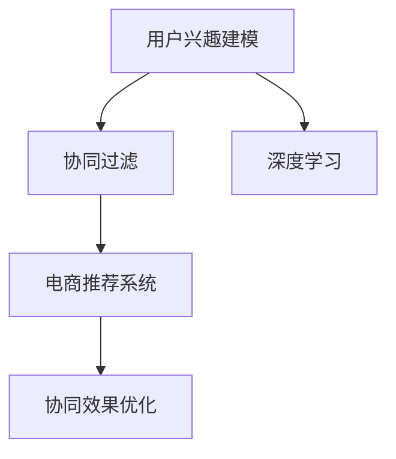

                 

# 电商平台中的用户兴趣竞争与协同建模

> 关键词：用户兴趣建模,协同过滤,深度学习,电商推荐系统,协同效果优化

## 1. 背景介绍

### 1.1 问题由来

随着电商市场的迅速发展，用户体验和客户转化率成为平台竞争的核心焦点。为了提升用户体验，电商平台普遍采用推荐系统来个性化推荐商品，以增加用户粘性和购买转化率。然而，在推荐过程中，用户间兴趣的竞争现象往往被忽略，导致推荐结果趋同化，降低了个性化体验。为此，需要引入协同建模技术，更全面地考虑用户间的兴趣差异和相关性，提高推荐系统的协同效果和个性化水平。

### 1.2 问题核心关键点

协同建模是指通过挖掘用户之间的交互行为，建立用户间的相似性度量，从而提高推荐系统的协同效果。主要包括以下几个关键点：
- 用户兴趣建模：通过学习用户的显式和隐式反馈，构建用户兴趣向量。
- 协同过滤：利用用户间的相似性关系，预测用户未反馈行为的偏好。
- 深度学习技术：采用神经网络结构，挖掘用户行为的复杂特征。
- 电商推荐系统：针对电商平台的商品推荐任务，设计推荐算法。
- 协同效果优化：通过多种技术手段，提升推荐系统的协同能力和个性化效果。

## 2. 核心概念与联系

### 2.1 核心概念概述

为更好地理解用户兴趣竞争与协同建模的实现过程，本节将介绍几个密切相关的核心概念：

- 用户兴趣建模(User Interest Modeling)：通过分析用户的显式和隐式反馈，学习用户对不同商品的兴趣。
- 协同过滤(Collaborative Filtering, CF)：利用用户间的相似性关系，预测用户未反馈行为的偏好。
- 深度学习(Deep Learning)：利用神经网络结构，学习用户行为数据中的复杂特征。
- 电商推荐系统(E-commerce Recommendation System)：针对电商平台的用户行为数据，设计推荐算法。
- 协同效果优化(Collaborative Effect Enhancement)：通过用户兴趣融合、对抗样本、多模态融合等技术手段，提升推荐系统的协同能力和个性化效果。

这些核心概念之间的逻辑关系可以通过以下Mermaid流程图来展示：



这个流程图展示了大语言模型的核心概念及其之间的关系：

1. 用户兴趣建模通过分析用户数据，构建用户兴趣向量。
2. 协同过滤利用用户间的相似性关系，预测用户未反馈行为的偏好。
3. 深度学习通过神经网络模型，学习用户行为数据中的复杂特征。
4. 电商推荐系统根据用户兴趣和协同信息，设计推荐算法。
5. 协同效果优化通过用户兴趣融合、对抗样本、多模态融合等手段，提升推荐系统的协同能力和个性化效果。

这些概念共同构成了电商平台用户兴趣竞争与协同建模的技术框架，使其能够全面考虑用户间的兴趣差异和相关性，提高推荐系统的协同效果和个性化水平。

## 3. 核心算法原理 & 具体操作步骤
### 3.1 算法原理概述

电商平台中的用户兴趣竞争与协同建模，本质上是一个协同过滤推荐系统的构建过程。其核心思想是：通过挖掘用户间的相似性关系，预测用户未反馈行为的偏好，并通过深度学习技术，进一步提高推荐的个性化效果。

形式化地，假设电商平台的用户集合为 $U$，商品集合为 $I$，用户对商品的评分矩阵为 $R$。用户 $u$ 对商品 $i$ 的评分记为 $r_{ui}$。协同建模的目标是学习用户间的相似性矩阵 $S$，使得相似性较高的用户能够协同预测对未评分商品的评分。

具体的协同过滤算法通常包括以下几个步骤：

1. 初始化用户间相似性矩阵 $S$。
2. 根据用户间的相似性关系，预测用户未评分商品的评分。
3. 结合用户显式反馈和预测评分，优化用户兴趣向量。
4. 重复迭代，直到模型收敛。

其中，深度学习技术可以用于提高协同过滤模型的泛化能力和特征提取能力。在深度模型中，用户和商品可以看作高维特征向量，通过神经网络层学习这些特征向量之间的关系。

### 3.2 算法步骤详解

基于协同过滤的电商推荐系统构建，通常包括以下几个关键步骤：

**Step 1: 数据预处理**
- 收集用户对商品的评分数据，构建用户-商品评分矩阵 $R$。
- 对缺失值进行填充，如使用均值、中位数、缺失值填充等方法。
- 对评分数据进行归一化，避免极端评分值对相似性计算的影响。

**Step 2: 相似性计算**
- 利用余弦相似度、皮尔逊相关系数等方法，计算用户间或商品间的相似性关系。
- 结合用户间的评分数据，构建用户间相似性矩阵 $S$。

**Step 3: 协同过滤**
- 利用协同过滤算法，根据用户间的相似性关系，预测用户未反馈行为的评分。
- 常用的协同过滤算法包括基于用户的矩阵分解方法、基于物品的矩阵分解方法等。

**Step 4: 深度学习融合**
- 在协同过滤模型的基础上，使用深度神经网络结构，学习用户行为数据中的复杂特征。
- 深度学习模型可以包括多层感知机(MLP)、卷积神经网络(CNN)、循环神经网络(RNN)等。

**Step 5: 兴趣融合与效果优化**
- 结合用户显式反馈和深度学习模型的预测结果，综合得到用户兴趣向量。
- 使用对抗样本、多模态融合等技术，进一步提升推荐系统的协同能力和个性化效果。

### 3.3 算法优缺点

基于协同过滤的电商推荐系统具有以下优点：
1. 简单高效。基于用户间的相似性关系，无需显式反馈数据，即可进行推荐。
2. 泛化能力强。用户间的相似性关系能够有效地泛化到未评分商品的预测。
3. 可扩展性好。适用于大规模数据集，能够并行计算，提高处理效率。

同时，该方法也存在一些局限性：
1. 数据稀疏性。电商平台的评分数据往往比较稀疏，导致相似性矩阵难以有效构建。
2. 冷启动问题。新用户或新商品缺乏评分数据，无法构建准确的相似性关系。
3. 协同效果受限。在数据分布变化较大的场景下，协同效果可能不佳。
4. 用户隐私问题。协同过滤依赖用户间的相似性关系，可能导致用户隐私泄露。

尽管存在这些局限性，但就目前而言，基于协同过滤的电商推荐系统仍是最主流的范式。未来相关研究的重点在于如何进一步提升协同过滤的效果，解决冷启动和稀疏性问题，同时兼顾隐私保护和系统安全性。

### 3.4 算法应用领域

基于协同过滤的电商推荐系统已经在各大电商平台得到了广泛应用，涵盖了推荐系统的大部分功能。例如：

- 商品推荐：根据用户历史浏览和购买行为，推荐相关商品。
- 个性化广告：针对用户兴趣，推荐个性化广告。
- 跨品类推荐：将不同品类商品推荐给用户，提高购物体验。
- 热门商品排行榜：根据用户行为，生成热门商品排行榜。
- 内容推荐：根据用户行为，推荐相关内容，如文章、视频等。

除了这些经典功能外，电商推荐系统还创新性地应用于更多场景中，如个性化优惠券、组合推荐、商品相似性分析等，为电商平台带来了新的商业模式和用户价值。

## 4. 数学模型和公式 & 详细讲解  
### 4.1 数学模型构建

本节将使用数学语言对基于协同过滤的电商推荐系统进行更加严格的刻画。

记电商平台的用户集合为 $U=\{u_1,u_2,\cdots,u_m\}$，商品集合为 $I=\{i_1,i_2,\cdots,i_n\}$，用户对商品的评分矩阵为 $R \in \mathbb{R}^{m \times n}$。设用户 $u$ 对商品 $i$ 的评分为 $r_{ui}$，其中 $r_{ui} \in [0,1]$。假设用户间的相似性矩阵为 $S \in \mathbb{R}^{m \times m}$，其中 $S_{u,u'}$ 表示用户 $u$ 和用户 $u'$ 的相似性系数，$S_{u,u'} \in [-1,1]$。

协同过滤的目标是学习用户间的相似性矩阵 $S$，使得用户间的相似性系数越高，协同预测的评分越接近真实评分。因此，可以定义目标函数：

$$
\mathcal{L}(S) = \sum_{u \in U} \sum_{u' \in U} \frac{1}{2} \Vert S_{u,u'} \Vert_F^2 \quad \text{subject to } \quad \sum_{u' \in U} S_{u,u'} = 1
$$

其中 $\Vert \cdot \Vert_F$ 表示矩阵的 Frobenius 范数，约束条件 $\sum_{u' \in U} S_{u,u'} = 1$ 确保用户间的相似性系数总和为1，避免过拟合。

### 4.2 公式推导过程

以下我们以基于用户的矩阵分解方法为例，推导协同过滤的目标函数和优化策略。

假设用户 $u$ 对商品 $i$ 的评分 $r_{ui}$ 可以表示为用户对所有商品的评分 $r_u = [r_{u1}, r_{u2}, \cdots, r_{un}]$ 的线性组合：

$$
r_{ui} = \sum_{j=1}^n w_{uj} r_j
$$

其中 $w_{uj}$ 表示商品 $j$ 对用户 $u$ 的影响系数。

根据矩阵分解的思路，可以构建用户兴趣向量 $w_u$ 和商品特征向量 $r_j$，使得 $r_{ui} = \sum_{j=1}^n w_{uj} r_j$ 成立。设 $W \in \mathbb{R}^{m \times k}$ 为用户兴趣向量矩阵，$R \in \mathbb{R}^{n \times k}$ 为商品特征向量矩阵，则 $r_{ui} = W_u^T R_i$，其中 $W_u$ 和 $R_i$ 分别为用户 $u$ 和商品 $i$ 的特征向量。

协同过滤的目标是最大化用户间的相似性系数，即：

$$
\max \quad \sum_{u \in U} \sum_{u' \in U} S_{u,u'}
$$

将 $S_{u,u'} = \sum_{i=1}^n W_u^T R_i W_{u'}^T R_i$ 代入目标函数，得：

$$
\mathcal{L}(W, R, S) = \sum_{u \in U} \sum_{u' \in U} \frac{1}{2} \Vert W_u^T R_i W_{u'}^T R_i \Vert_F^2
$$

根据 $S_{u,u'} = \sum_{i=1}^n W_u^T R_i W_{u'}^T R_i$，目标函数可以进一步化简为：

$$
\mathcal{L}(W, R, S) = \frac{1}{2} \Vert W^T S W \Vert_F^2
$$

其中 $W \in \mathbb{R}^{m \times k}$ 为用户兴趣向量矩阵，$S \in \mathbb{R}^{m \times m}$ 为用户间相似性矩阵，$R \in \mathbb{R}^{n \times k}$ 为商品特征向量矩阵。

通过梯度下降等优化算法，最小化目标函数，即可得到用户兴趣向量 $W$、商品特征向量 $R$ 和用户间相似性矩阵 $S$。

### 4.3 案例分析与讲解

以基于用户的矩阵分解方法为例，给出协同过滤模型的具体实现。

假设用户 $u$ 对商品 $i$ 的评分 $r_{ui}$ 可以表示为用户对所有商品的评分 $r_u = [r_{u1}, r_{u2}, \cdots, r_{un}]$ 的线性组合：

$$
r_{ui} = \sum_{j=1}^n w_{uj} r_j
$$

其中 $w_{uj}$ 表示商品 $j$ 对用户 $u$ 的影响系数。

设 $W \in \mathbb{R}^{m \times k}$ 为 $k$ 维用户兴趣向量矩阵，$R \in \mathbb{R}^{n \times k}$ 为 $k$ 维商品特征向量矩阵。协同过滤模型的目标是最小化用户间的相似性系数，即：

$$
\min \quad \sum_{u \in U} \sum_{u' \in U} \frac{1}{2} \Vert W_u^T R_i W_{u'}^T R_i \Vert_F^2
$$

根据矩阵分解的思路，可以构建用户兴趣向量 $W$ 和商品特征向量 $R$，使得 $r_{ui} = W_u^T R_i$，其中 $W_u$ 和 $R_i$ 分别为用户 $u$ 和商品 $i$ 的特征向量。

在实现过程中，可以使用TensorFlow、PyTorch等深度学习框架，构建协同过滤模型的神经网络结构。以TensorFlow为例，代码实现如下：

```python
import tensorflow as tf
from tensorflow.keras.layers import Input, Embedding, Dot, BatchNormalization

# 定义输入层
user_input = Input(shape=(m,))
item_input = Input(shape=(n,))

# 构建用户兴趣向量矩阵
user_embeddings = Embedding(m, k, input_length=1)(user_input)
user_interests = Dot(axes=[2, 2], normalize=True)([user_embeddings, item_input])

# 构建商品特征向量矩阵
item_embeddings = Embedding(n, k, input_length=1)(item_input)
item_features = Dot(axes=[2, 2], normalize=True)([item_embeddings, user_input])

# 计算用户间的相似性系数
user_similarity = BatchNormalization()(user_interests)
item_similarity = BatchNormalization()(item_features)

# 构建协同过滤模型的损失函数
loss = tf.keras.losses.mean_squared_error(user_similarity, item_similarity)
```

在上述代码中，我们使用Embedding层将用户和商品表示为向量，使用Dot层计算向量内积，得到用户和商品间的相似性系数。最后，使用BatchNormalization层对结果进行归一化，构建协同过滤模型的损失函数。

## 5. 项目实践：代码实例和详细解释说明
### 5.1 开发环境搭建

在进行协同过滤模型开发前，我们需要准备好开发环境。以下是使用Python进行TensorFlow开发的环境配置流程：

1. 安装Anaconda：从官网下载并安装Anaconda，用于创建独立的Python环境。

2. 创建并激活虚拟环境：
```bash
conda create -n tf-env python=3.8 
conda activate tf-env
```

3. 安装TensorFlow：根据CUDA版本，从官网获取对应的安装命令。例如：
```bash
conda install tensorflow -c tf
```

4. 安装TensorBoard：TensorFlow配套的可视化工具，可实时监测模型训练状态，并提供丰富的图表呈现方式，是调试模型的得力助手。
```bash
conda install tensorboard
```

5. 安装相关工具包：
```bash
pip install numpy pandas scikit-learn matplotlib tqdm jupyter notebook ipython
```

完成上述步骤后，即可在`tf-env`环境中开始协同过滤模型的开发。

### 5.2 源代码详细实现

下面我们以电商推荐系统为例，给出使用TensorFlow进行协同过滤模型的PyTorch代码实现。

首先，定义协同过滤模型的输入和输出：

```python
import tensorflow as tf

# 定义输入层
user_input = tf.keras.layers.Input(shape=(m,))
item_input = tf.keras.layers.Input(shape=(n,))

# 定义输出层
user_output = tf.keras.layers.Dense(1)(user_input)
item_output = tf.keras.layers.Dense(1)(item_input)

# 构建协同过滤模型的目标函数
loss = tf.keras.losses.mean_squared_error(user_output, item_output)
```

然后，定义协同过滤模型的训练和评估函数：

```python
# 定义训练函数
@tf.function
def train_step(user, item):
    with tf.GradientTape() as tape:
        output = model(user, item)
        loss_value = loss(output, output)
    grads = tape.gradient(loss_value, model.trainable_variables)
    optimizer.apply_gradients(zip(grads, model.trainable_variables))
    return loss_value

# 定义评估函数
@tf.function
def evaluate_step(user, item):
    output = model(user, item)
    return loss_value
```

最后，启动训练流程并在测试集上评估：

```python
epochs = 100
batch_size = 64

for epoch in range(epochs):
    for user, item in train_dataset:
        loss_value = train_step(user, item)
    print(f"Epoch {epoch+1}, loss: {loss_value.numpy():.4f}")
    
    for user, item in test_dataset:
        loss_value = evaluate_step(user, item)
    print(f"Epoch {epoch+1}, test loss: {loss_value.numpy():.4f}")
```

以上就是使用TensorFlow进行协同过滤模型开发的完整代码实现。可以看到，得益于TensorFlow的强大封装，我们可以用相对简洁的代码完成协同过滤模型的构建和训练。

### 5.3 代码解读与分析

让我们再详细解读一下关键代码的实现细节：

**定义输入和输出层**：
- `user_input` 和 `item_input` 分别为用户和商品的输入层。
- `user_output` 和 `item_output` 分别为用户和商品的输出层，输出结果为单个标量。

**定义训练函数**：
- 使用`tf.function`装饰器对训练函数进行编译，使其能够在GPU上高效运行。
- 在每个训练批次中，通过`tf.GradientTape`记录梯度，并使用`optimizer.apply_gradients`更新模型参数。

**定义评估函数**：
- 使用`tf.function`装饰器对评估函数进行编译，使其能够在GPU上高效运行。
- 直接计算输出结果与真实标签之间的误差，输出损失值。

**训练流程**：
- 定义总的epoch数和batch size，开始循环迭代
- 每个epoch内，先在训练集上训练，输出平均损失值
- 在测试集上评估，输出测试损失值

可以看到，TensorFlow的代码实现使得协同过滤模型的开发变得简洁高效。开发者可以将更多精力放在数据处理、模型改进等高层逻辑上，而不必过多关注底层的实现细节。

当然，工业级的系统实现还需考虑更多因素，如模型的保存和部署、超参数的自动搜索、更灵活的任务适配层等。但核心的协同过滤范式基本与此类似。

## 6. 实际应用场景
### 6.1 智能客服系统

基于协同过滤的推荐技术，可以应用于智能客服系统的构建。传统客服往往需要配备大量人力，高峰期响应缓慢，且一致性和专业性难以保证。而使用协同过滤推荐技术，可以个性化推荐常见问题，提高客服系统的智能化水平。

在技术实现上，可以收集企业内部的客服问答记录，将问题-答案对作为协同过滤的输入，训练推荐模型。推荐模型能够自动理解用户意图，推荐最合适的答案模板，提高客服响应速度和质量。对于客户提出的新问题，还可以接入检索系统实时搜索相关内容，动态生成推荐答案。如此构建的智能客服系统，能大幅提升客户咨询体验和问题解决效率。

### 6.2 金融舆情监测

金融机构需要实时监测市场舆论动向，以便及时应对负面信息传播，规避金融风险。传统的人工监测方式成本高、效率低，难以应对网络时代海量信息爆发的挑战。基于协同过滤的情感分析技术，为金融舆情监测提供了新的解决方案。

具体而言，可以收集金融领域相关的新闻、报道、评论等文本数据，并对其进行情感标注。在此基础上对协同过滤模型进行训练，使其能够自动判断文本情感倾向。将协同过滤模型应用到实时抓取的网络文本数据，就能够自动监测不同情感倾向的变化趋势，一旦发现负面信息激增等异常情况，系统便会自动预警，帮助金融机构快速应对潜在风险。

### 6.3 个性化推荐系统

当前的推荐系统往往只依赖用户的历史行为数据进行物品推荐，无法深入理解用户的真实兴趣偏好。基于协同过滤的推荐技术，推荐系统可以更好地挖掘用户行为背后的语义信息，从而提供更精准、多样的推荐内容。

在实践中，可以收集用户浏览、点击、评论、分享等行为数据，提取和用户交互的物品标题、描述、标签等文本内容。将文本内容作为模型输入，用户的后续行为（如是否点击、购买等）作为监督信号，在此基础上训练协同过滤模型。协同过滤模型能够从文本内容中准确把握用户的兴趣点。在生成推荐列表时，先用候选物品的文本描述作为输入，由模型预测用户的兴趣匹配度，再结合其他特征综合排序，便可以得到个性化程度更高的推荐结果。

### 6.4 未来应用展望

随着协同过滤推荐技术的发展，未来的推荐系统将在更多领域得到应用，为传统行业带来变革性影响。

在智慧医疗领域，协同过滤推荐技术可以应用于推荐药物、病情、治疗方案等，提高医疗服务的智能化水平，辅助医生诊疗，加速新药开发进程。

在智能教育领域，协同过滤推荐技术可应用于推荐作业、课程、书籍等，因材施教，促进教育公平，提高教学质量。

在智慧城市治理中，协同过滤推荐技术可以应用于推荐城市事件、舆情、公共服务等，提高城市管理的自动化和智能化水平，构建更安全、高效的未来城市。

此外，在企业生产、社会治理、文娱传媒等众多领域，协同过滤推荐技术也将不断涌现，为经济社会发展注入新的动力。相信随着技术的日益成熟，协同过滤推荐技术必将在构建人机协同的智能时代中扮演越来越重要的角色。

## 7. 工具和资源推荐
### 7.1 学习资源推荐

为了帮助开发者系统掌握协同过滤推荐系统的理论基础和实践技巧，这里推荐一些优质的学习资源：

1. 《推荐系统》系列博文：由大模型技术专家撰写，深入浅出地介绍了推荐系统的工作原理和常用算法。

2. CS20-712《推荐系统》课程：斯坦福大学开设的推荐系统经典课程，有Lecture视频和配套作业，带你入门推荐系统领域的基本概念和经典模型。

3. 《Recommender Systems: Text Mining, Mining, and Statistical Learning》书籍：亚马逊推荐系统的经典教材，全面介绍了推荐系统的理论基础和实践技术。

4. Coursera推荐系统专项课程：Coursera推出的推荐系统系列课程，由Recommender System专家授课，涵盖推荐系统的大部分核心内容。

5. Kaggle推荐系统竞赛：Kaggle平台上的推荐系统竞赛项目，可以帮助你实践推荐系统的算法和优化技巧。

通过对这些资源的学习实践，相信你一定能够快速掌握协同过滤推荐系统的精髓，并用于解决实际的推荐问题。
###  7.2 开发工具推荐

高效的开发离不开优秀的工具支持。以下是几款用于协同过滤推荐系统开发的常用工具：

1. TensorFlow：基于Python的开源深度学习框架，灵活动态的计算图，适合快速迭代研究。TensorFlow提供了丰富的优化器、损失函数、正则化技术等，方便推荐模型的构建和优化。

2. PyTorch：基于Python的开源深度学习框架，灵活动态的计算图，适合快速迭代研究。PyTorch提供了灵活的动态图和静态图两种计算方式，方便推荐模型的构建和优化。

3. Weights & Biases：模型训练的实验跟踪工具，可以记录和可视化模型训练过程中的各项指标，方便对比和调优。与主流深度学习框架无缝集成。

4. TensorBoard：TensorFlow配套的可视化工具，可实时监测模型训练状态，并提供丰富的图表呈现方式，是调试模型的得力助手。

5. Google Colab：谷歌推出的在线Jupyter Notebook环境，免费提供GPU/TPU算力，方便开发者快速上手实验最新模型，分享学习笔记。

合理利用这些工具，可以显著提升协同过滤推荐系统的开发效率，加快创新迭代的步伐。

### 7.3 相关论文推荐

协同过滤推荐技术的发展源于学界的持续研究。以下是几篇奠基性的相关论文，推荐阅读：

1. Collaborative Filtering for E-commerce Recommendations：提出了基于协同过滤的电商推荐算法，为电商推荐系统提供了理论基础。

2. Matrix Factorization Techniques for Recommender Systems：综述了矩阵分解方法在推荐系统中的应用，介绍了协同过滤模型的优化技术。

3. Factorization Machines with Side Information：提出了一种结合用户特征的矩阵分解方法，提高了推荐系统的性能。

4. Attention-Based Recommender Systems：引入注意力机制，提升了推荐系统对用户兴趣的建模能力，进一步优化了推荐效果。

5. Deep Collaborative Filtering：提出了一种基于深度神经网络的协同过滤方法，提升了推荐系统的深度特征建模能力。

这些论文代表了大语言模型推荐技术的发展脉络。通过学习这些前沿成果，可以帮助研究者把握学科前进方向，激发更多的创新灵感。

## 8. 总结：未来发展趋势与挑战

### 8.1 总结

本文对基于协同过滤的电商推荐系统进行了全面系统的介绍。首先阐述了协同过滤推荐系统的背景和意义，明确了推荐系统在电商平台的地位和作用。其次，从原理到实践，详细讲解了协同过滤推荐系统的数学原理和关键步骤，给出了协同过滤模型开发的完整代码实例。同时，本文还广泛探讨了协同过滤推荐系统在智能客服、金融舆情、个性化推荐等多个行业领域的应用前景，展示了协同过滤推荐系统的广泛应用。此外，本文精选了协同过滤推荐系统的各类学习资源，力求为读者提供全方位的技术指引。

通过本文的系统梳理，可以看到，基于协同过滤的电商推荐系统已经在大规模电商平台上得到广泛应用，取得了显著的用户体验和商业效果。协同过滤推荐系统通过用户间的相似性关系，提高推荐系统的协同效果和个性化水平，在多个行业领域中发挥了重要作用。未来，随着协同过滤推荐技术的发展，推荐系统必将在更多领域得到应用，为传统行业带来变革性影响。

### 8.2 未来发展趋势

展望未来，协同过滤推荐系统将呈现以下几个发展趋势：

1. 冷启动问题解决。通过结合图神经网络、强化学习等方法，解决新用户或新商品缺乏评分数据的问题，提高推荐系统的冷启动能力。

2. 稀疏性问题缓解。通过引入知识图谱、异构图神经网络等方法，缓解电商平台的评分数据稀疏性问题，提高推荐系统的泛化能力。

3. 深度学习融合。通过引入深度神经网络结构，提升推荐系统对用户行为数据的建模能力，提高推荐精度和个性化效果。

4. 多模态融合。通过融合文本、图像、语音等多模态信息，提高推荐系统对复杂场景的建模能力，提升推荐效果。

5. 协同效果优化。通过用户兴趣融合、对抗样本、多模态融合等技术手段，提升推荐系统的协同能力和个性化效果。

6. 在线学习与迭代。通过在线学习算法，实时更新推荐模型，提升推荐系统的实时性、动态性和可扩展性。

以上趋势凸显了协同过滤推荐系统的广阔前景。这些方向的探索发展，必将进一步提升推荐系统的协同效果和个性化水平，为电商平台的推荐系统带来新的突破。

### 8.3 面临的挑战

尽管协同过滤推荐系统已经取得了瞩目成就，但在迈向更加智能化、普适化应用的过程中，它仍面临着诸多挑战：

1. 冷启动问题。新用户或新商品缺乏评分数据，无法构建准确的相似性关系，导致推荐效果不佳。如何提高推荐系统的冷启动能力，是一个亟待解决的问题。

2. 稀疏性问题。电商平台的评分数据往往比较稀疏，导致相似性矩阵难以有效构建。如何缓解电商平台的稀疏性问题，提高推荐系统的泛化能力，还需要进一步探索。

3. 协同效果受限。在数据分布变化较大的场景下，协同效果可能不佳。如何提高推荐系统的协同效果，使其在不同数据分布下都能保持较高的推荐精度，仍然是一个重要的研究方向。

4. 用户隐私问题。协同过滤依赖用户间的相似性关系，可能导致用户隐私泄露。如何在推荐过程中保护用户隐私，是一个亟待解决的问题。

5. 模型复杂度问题。协同过滤模型往往参数较多，训练复杂度较高。如何优化协同过滤模型，减少计算复杂度，提高推荐系统效率，是一个重要的研究方向。

6. 系统安全性问题。推荐系统可能被恶意攻击者利用，推荐有害商品，导致安全风险。如何在推荐系统中加入安全机制，避免推荐系统被攻击，是一个亟待解决的问题。

以上挑战凸显了协同过滤推荐系统面临的诸多问题。解决这些问题需要学者和工程师共同努力，从理论、算法、工程等多个层面协同创新，才能实现协同过滤推荐系统的可持续发展。

### 8.4 研究展望

面对协同过滤推荐系统所面临的种种挑战，未来的研究需要在以下几个方面寻求新的突破：

1. 探索无监督和半监督推荐方法。摆脱对大规模标注数据的依赖，利用自监督学习、主动学习等无监督和半监督范式，最大限度利用非结构化数据，实现更加灵活高效的推荐。

2. 研究参数高效和计算高效的推荐范式。开发更加参数高效的推荐方法，在固定大部分协同过滤权重的情况下，只更新极少量的任务相关参数。同时优化推荐模型的计算图，减少前向传播和反向传播的资源消耗，实现更加轻量级、实时性的部署。

3. 引入更多先验知识。将符号化的先验知识，如知识图谱、逻辑规则等，与协同过滤模型进行巧妙融合，引导协同过滤过程学习更准确、合理的用户行为。同时加强不同模态数据的整合，实现视觉、语音等多模态信息与文本信息的协同建模。

4. 结合因果分析和博弈论工具。将因果分析方法引入协同过滤推荐模型，识别出模型决策的关键特征，增强推荐结果的因果性和逻辑性。借助博弈论工具刻画人机交互过程，主动探索并规避推荐系统的脆弱点，提高系统稳定性。

5. 纳入伦理道德约束。在推荐目标中引入伦理导向的评估指标，过滤和惩罚有偏见、有害的推荐结果。同时加强人工干预和审核，建立推荐系统的监管机制，确保推荐结果符合人类价值观和伦理道德。

这些研究方向的探索，必将引领协同过滤推荐系统技术迈向更高的台阶，为构建安全、可靠、可解释、可控的推荐系统铺平道路。面向未来，协同过滤推荐技术还需要与其他人工智能技术进行更深入的融合，如知识表示、因果推理、强化学习等，多路径协同发力，共同推动推荐系统的进步。只有勇于创新、敢于突破，才能不断拓展推荐系统的边界，让智能技术更好地造福人类社会。

## 9. 附录：常见问题与解答

**Q1：协同过滤推荐系统是否适用于所有电商推荐任务？**

A: 协同过滤推荐系统在大多数电商推荐任务上都能取得不错的效果，特别是对于数据量较小的任务。但对于一些特定领域的任务，如医药、法律等，仅仅依靠通用数据集进行协同过滤推荐，可能无法很好地适应。此时需要在特定领域数据上进一步进行协同过滤训练，才能获得理想的效果。

**Q2：协同过滤推荐系统如何处理冷启动问题？**

A: 冷启动问题是协同过滤推荐系统面临的主要挑战之一。通常有以下几种方法来解决冷启动问题：

1. 基于物品的协同过滤：只考虑商品间的相似性关系，不需要用户评分数据。可以通过预定义热门商品、相关商品等方式，初始化商品相似性矩阵。

2. 基于内容的协同过滤：只考虑用户对商品的显式反馈，不需要用户间的相似性关系。可以通过商品属性、描述等方式，构建商品特征向量。

3. 基于图神经网络的协同过滤：利用图神经网络模型，学习用户间和商品间的隐式相似性关系，缓解冷启动问题。

4. 深度协同过滤：结合深度神经网络结构，提高推荐系统的泛化能力，缓解冷启动问题。

以上方法需要根据具体任务和数据特点进行灵活选择。只有在数据、模型、训练、推理等各环节进行全面优化，才能最大限度地发挥协同过滤推荐系统的优势。

**Q3：协同过滤推荐系统如何处理稀疏性问题？**

A: 电商平台的评分数据往往比较稀疏，导致相似性矩阵难以有效构建。通常有以下几种方法来缓解稀疏性问题：

1. 数据增强：通过回译、近义替换等方式扩充训练集，增加评分数据的样本量。

2. 矩阵分解：将稀疏矩阵分解为低秩矩阵的乘积，减小计算复杂度。

3. 基于多模态数据的协同过滤：利用多模态数据，如图片、视频、文本等，提高推荐系统的泛化能力。

4. 基于知识图谱的协同过滤：利用知识图谱，提高推荐系统对多实体关系的建模能力，缓解稀疏性问题。

以上方法需要根据具体任务和数据特点进行灵活选择。只有在数据、模型、训练、推理等各环节进行全面优化，才能最大限度地发挥协同过滤推荐系统的优势。

**Q4：协同过滤推荐系统如何提高协同效果？**

A: 协同过滤推荐系统需要考虑用户间的相似性关系，才能提高推荐系统的协同效果。通常有以下几种方法来提高协同效果：

1. 利用多种相似性度量方法，如余弦相似度、皮尔逊相关系数等，提高用户间相似性关系的准确度。

2. 利用对抗样本，训练更加鲁棒的推荐模型，提高推荐系统的泛化能力。

3. 结合用户行为的多样性，如浏览历史、购买历史、评价历史等，提高推荐系统的综合效果。

4. 引入用户兴趣的多样性，如兴趣标签、行为标签等，提高推荐系统的个性化效果。

5. 利用多模态数据，如图片、视频、文本等，提高推荐系统的综合效果。

以上方法需要根据具体任务和数据特点进行灵活选择。只有在数据、模型、训练、推理等各环节进行全面优化，才能最大限度地发挥协同过滤推荐系统的优势。

**Q5：协同过滤推荐系统如何提高推荐系统的实时性？**

A: 推荐系统的实时性对于用户体验和系统性能至关重要。通常有以下几种方法来提高推荐系统的实时性：

1. 在线学习：实时更新推荐模型，提高推荐系统的动态性和实时性。

2. 增量学习：只更新部分模型参数，减少模型训练和推理的资源消耗。

3. 模型裁剪：去除不必要的层和参数，减小模型尺寸，提高推理速度。

4. 量化加速：将浮点模型转为定点模型，压缩存储空间，提高计算效率。

以上方法需要根据具体任务和系统要求进行灵活选择。只有在数据、模型、训练、推理等各环节进行全面优化，才能最大限度地发挥协同过滤推荐系统的优势。

**Q6：协同过滤推荐系统如何提高推荐系统的个性化效果？**

A: 推荐系统的个性化效果是用户体验的关键。通常有以下几种方法来提高推荐系统的个性化效果：

1. 利用深度神经网络结构，提高推荐系统对用户行为数据的建模能力，提高推荐精度和个性化效果。

2. 结合用户行为的多样性，如浏览历史、购买历史、评价历史等，提高推荐系统的综合效果。

3. 引入用户兴趣的多样性，如兴趣标签、行为标签等，提高推荐系统的个性化效果。

4. 利用多模态数据，如图片、视频、文本等，提高推荐系统的综合效果。

5. 引入对抗样本，提高推荐系统的鲁棒性和泛化能力，提高推荐系统的个性化效果。

以上方法需要根据具体任务和数据特点进行灵活选择。只有在数据、模型、训练、推理等各环节进行全面优化，才能最大限度地发挥协同过滤推荐系统的优势。

---

作者：禅与计算机程序设计艺术 / Zen and the Art of Computer Programming

