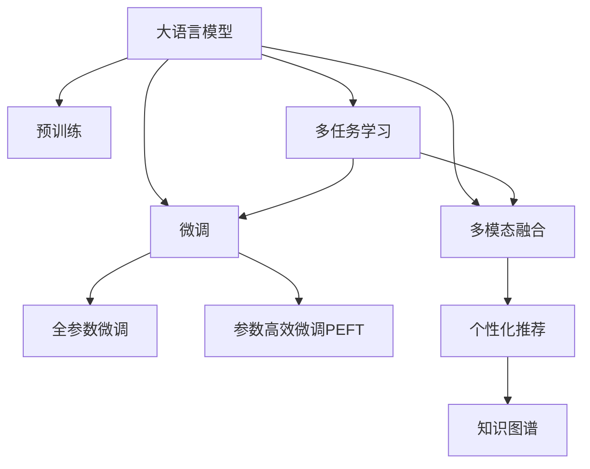

                 

# 电商平台中的自然语言查询理解：大模型的创新应用

> 关键词：电商平台,自然语言查询,大模型,Transformer,BERT,预训练,微调,多模态融合,个性化推荐

## 1. 背景介绍

随着电商平台的迅猛发展，自然语言查询理解(Natural Language Query Understanding)成为了平台提供精准服务的关键技术之一。用户通过搜索、问答等方式，以自然语言表达需求，电商平台需要准确解析其意图，从海量商品中匹配到合适的商品信息，并提供个性化推荐，提升用户体验，增加交易转化率。传统的关键词匹配技术已难以满足这一需求，亟需引入更强大的自然语言处理技术。

大语言模型通过在大规模无标签文本数据上预训练，学习到了丰富的语言知识和常识，具备强大的语言理解和生成能力。将其应用于电商平台自然语言查询理解，可以显著提升查询意图解析的准确性和商品推荐的个性化水平。在实际应用中，大语言模型可以通过微调或提示学习等方式，优化模型对特定电商场景的理解和推理能力，实现从数据到决策的全链路智能化。

## 2. 核心概念与联系

### 2.1 核心概念概述

为更好地理解大语言模型在电商平台自然语言查询理解中的应用，本节将介绍几个关键概念：

- 大语言模型(Large Language Model, LLM)：以自回归(如GPT)或自编码(如BERT)模型为代表的大规模预训练语言模型。通过在大规模无标签文本语料上进行预训练，学习通用的语言表示，具备强大的语言理解和生成能力。

- 预训练(Pre-training)：指在大规模无标签文本语料上，通过自监督学习任务训练通用语言模型的过程。常见的预训练任务包括言语建模、遮挡语言模型等。预训练使得模型学习到语言的通用表示。

- 微调(Fine-tuning)：指在预训练模型的基础上，使用下游任务的少量标注数据，通过有监督学习优化模型在特定任务上的性能。通常只需要调整顶层分类器或解码器，并以较小的学习率更新全部或部分的模型参数。

- 多模态融合(Multimodal Fusion)：指将文本、图像、语音等多种模态的信息进行融合，提升对用户查询意图的全面理解。

- 个性化推荐(Personalized Recommendation)：根据用户的历史行为、兴趣偏好等数据，为用户推荐合适的商品或服务。

- 知识图谱(Knowledge Graph)：由实体、关系、属性等组成的图结构，用于刻画实体之间的语义关系，辅助模型进行更准确的推理。

这些核心概念之间的逻辑关系可以通过以下Mermaid流程图来展示：



这个流程图展示了大语言模型的核心概念及其之间的关系：

1. 大语言模型通过预训练获得基础能力。
2. 微调是对预训练模型进行任务特定的优化，可以分为全参数微调和参数高效微调（PEFT）。
3. 多模态融合可以帮助模型更好地理解查询背后的背景信息。
4. 个性化推荐可以根据用户行为进行精准推荐。
5. 知识图谱可以提供额外的知识储备，辅助模型推理。
6. 多任务学习可以将多个相关任务同时优化，提升模型效果。

这些概念共同构成了大语言模型在电商平台应用的基础，使其能够更好地理解用户意图，提升查询解析和推荐精度。

## 3. 核心算法原理 & 具体操作步骤
### 3.1 算法原理概述

基于大语言模型在电商平台自然语言查询理解中的应用，其核心算法原理可以概述为以下几个步骤：

1. **预训练模型加载**：加载预训练的大语言模型，如BERT、GPT等，作为初始化参数。
2. **任务适配**：根据电商平台自然语言查询的特点，设计相应的任务适配层，如查询意图分类、实体关系抽取、情感分析等。
3. **微调训练**：利用电商平台中的查询数据，在适配层上对模型进行有监督微调，优化模型在特定任务上的性能。
4. **多模态融合**：将查询中的文本、图像、语音等信息进行融合，提升对用户意图的全面理解。
5. **个性化推荐**：根据用户历史行为、兴趣等数据，利用微调后的模型进行个性化商品推荐。

### 3.2 算法步骤详解

以下是基于大语言模型在电商平台自然语言查询理解中的详细操作步骤：

**Step 1: 准备预训练模型和数据集**
- 选择合适的预训练语言模型 $M_{\theta}$ 作为初始化参数，如 BERT、GPT 等。
- 准备电商平台自然语言查询数据集 $D$，包括用户查询、商品描述等文本数据。
- 对数据进行预处理，如分词、去除停用词、构建词典等。

**Step 2: 添加任务适配层**
- 根据任务类型，在预训练模型顶层设计合适的输出层和损失函数。
- 对于意图分类任务，通常在顶层添加线性分类器和交叉熵损失函数。
- 对于实体关系抽取任务，通常使用序列标注模型，以标签序列为输出。

**Step 3: 设置微调超参数**
- 选择合适的优化算法及其参数，如 AdamW、SGD 等，设置学习率、批大小、迭代轮数等。
- 设置正则化技术及强度，包括权重衰减、Dropout、Early Stopping等。
- 确定冻结预训练参数的策略，如仅微调顶层，或全部参数都参与微调。

**Step 4: 执行梯度训练**
- 将训练集数据分批次输入模型，前向传播计算损失函数。
- 反向传播计算参数梯度，根据设定的优化算法和学习率更新模型参数。
- 周期性在验证集上评估模型性能，根据性能指标决定是否触发 Early Stopping。
- 重复上述步骤直到满足预设的迭代轮数或 Early Stopping 条件。

**Step 5: 测试和部署**
- 在测试集上评估微调后模型 $M_{\hat{\theta}}$ 的性能，对比微调前后的精度提升。
- 使用微调后的模型对新查询进行推理预测，集成到电商平台查询解析和推荐系统中。
- 持续收集新的数据，定期重新微调模型，以适应数据分布的变化。

### 3.3 算法优缺点

大语言模型在电商平台自然语言查询理解中的应用，具有以下优点：

1. **通用性强**：预训练语言模型具备通用的语言理解和生成能力，适用于多种自然语言查询任务。
2. **效果显著**：通过微调，模型能够适应电商平台的特定需求，提升查询解析和推荐精度。
3. **可扩展性高**：预训练模型可以在需要时，针对新的电商场景进行快速微调，拓展应用范围。

同时，该方法也存在一定的局限性：

1. **计算资源要求高**：预训练和微调需要大量的计算资源，适合大规模电商平台的部署。
2. **数据质量要求高**：微调的效果很大程度上取决于电商平台数据的质量和多样性。
3. **泛化能力有限**：当电商平台的查询需求与预训练数据的分布差异较大时，微调的效果可能不佳。
4. **对抗性攻击风险**：恶意用户可能通过构造特定查询欺骗模型，影响推荐结果，需要加强对抗性防御。

尽管存在这些局限性，但就目前而言，基于大语言模型的微调方法仍然是电商平台自然语言查询理解的主要技术范式。未来相关研究的重点在于如何进一步降低计算资源消耗，提升数据质量，提高模型的泛化能力，并增强对抗性防御能力。

### 3.4 算法应用领域

大语言模型在电商平台自然语言查询理解中的应用，已经广泛应用于多个领域：

- 查询意图分类：将用户查询解析为特定意图，如搜索、咨询、投诉等。通过微调模型学习查询-意图映射，提升意图分类的准确性。
- 实体关系抽取：从用户查询中抽取商品名称、品牌、类别等实体，并识别其关系。通过微调模型学习实体-关系三元组，提升关系抽取的准确性。
- 情感分析：分析用户查询的情感倾向，判断是积极、中立还是消极情绪。通过微调模型学习情感分类，提升情感分析的准确性。
- 推荐系统：根据用户历史行为、兴趣偏好等数据，利用微调后的模型进行个性化商品推荐。
- 客户服务：解析用户咨询问题，生成合适的回答或解决方案。通过微调模型学习对话生成，提升客户服务质量。

除了上述这些核心应用外，大语言模型还可以应用于电商平台的图像识别、语音识别、语义搜索等场景中，为电商平台的智能化转型提供强大技术支持。

## 4. 数学模型和公式 & 详细讲解 & 举例说明
### 4.1 数学模型构建

在电商平台自然语言查询理解中，大语言模型的数学模型构建可以形式化为以下步骤：

1. **输入表示**：将用户查询 $x$ 表示为向量 $X$，商品描述 $y$ 表示为向量 $Y$。
2. **模型输入**：将输入向量 $X$ 和 $Y$ 输入到大语言模型 $M_{\theta}$ 中，得到模型输出 $Z$。
3. **任务适配**：根据具体任务类型，设计相应的任务适配层，将模型输出 $Z$ 转化为任务相关的输出 $Z'$。
4. **损失函数**：定义损失函数 $\mathcal{L}$，衡量模型输出 $Z'$ 与真实标签 $y$ 之间的差异。

假设任务为查询意图分类，模型输出 $Z$ 为 $n$ 维向量，真实意图标签为 $y \in \{1,2,...,n\}$，则交叉熵损失函数定义为：

$$
\mathcal{L}(X,Y)=-\sum_{i=1}^n y_i\log P_{M_{\theta}}(Z_i)
$$

其中 $P_{M_{\theta}}(Z_i)$ 表示模型对第 $i$ 个类别的概率输出。

### 4.2 公式推导过程

以查询意图分类任务为例，推导交叉熵损失函数及其梯度的计算公式。

设模型输出 $Z$ 为 $n$ 维向量，真实意图标签为 $y \in \{1,2,...,n\}$，则交叉熵损失函数定义为：

$$
\mathcal{L}(X,Y)=-\sum_{i=1}^n y_i\log P_{M_{\theta}}(Z_i)
$$

将其代入经验风险公式，得：

$$
\mathcal{L}(\theta) = \frac{1}{N}\sum_{i=1}^N \mathcal{L}(X_i,Y_i)
$$

根据链式法则，损失函数对参数 $\theta_k$ 的梯度为：

$$
\frac{\partial \mathcal{L}(\theta)}{\partial \theta_k} = -\frac{1}{N}\sum_{i=1}^N \frac{\partial \mathcal{L}(X_i,Y_i)}{\partial Z_i} \frac{\partial Z_i}{\partial \theta_k}
$$

其中 $\frac{\partial Z_i}{\partial \theta_k}$ 可以通过自动微分技术高效计算。

在得到损失函数的梯度后，即可带入参数更新公式，完成模型的迭代优化。重复上述过程直至收敛，最终得到适应电商平台自然语言查询理解的最优模型参数 $\theta^*$。

### 4.3 案例分析与讲解

假设电商平台中的查询数据集 $D$ 包含 $N$ 条查询记录，每条查询包含一个商品 $X_i$ 和对应的意图标签 $Y_i$。任务为查询意图分类，目标是将查询意图分类为 $n$ 个预定义的类别，如搜索、咨询、投诉等。

**Step 1: 数据预处理**
- 对查询记录 $D$ 进行分词，去除停用词，构建词典。
- 将查询 $X_i$ 表示为向量 $X_i \in \mathbb{R}^d$。

**Step 2: 模型加载**
- 加载预训练的BERT模型，作为初始化参数。
- 在模型顶层添加线性分类器和交叉熵损失函数。

**Step 3: 微调训练**
- 设置AdamW优化器，学习率为 $10^{-5}$，批大小为32。
- 在训练集上执行梯度训练，周期性在验证集上评估模型性能，迭代轮数为10。

**Step 4: 测试和部署**
- 在测试集上评估微调后模型的精度，对比微调前后的性能。
- 使用微调后的模型对新查询进行推理预测，集成到电商平台查询解析和推荐系统中。

## 5. 项目实践：代码实例和详细解释说明
### 5.1 开发环境搭建

在进行电商平台的自然语言查询理解开发前，我们需要准备好开发环境。以下是使用Python进行PyTorch开发的环境配置流程：

1. 安装Anaconda：从官网下载并安装Anaconda，用于创建独立的Python环境。

2. 创建并激活虚拟环境：
```bash
conda create -n pytorch-env python=3.8 
conda activate pytorch-env
```

3. 安装PyTorch：根据CUDA版本，从官网获取对应的安装命令。例如：
```bash
conda install pytorch torchvision torchaudio cudatoolkit=11.1 -c pytorch -c conda-forge
```

4. 安装Transformers库：
```bash
pip install transformers
```

5. 安装各类工具包：
```bash
pip install numpy pandas scikit-learn matplotlib tqdm jupyter notebook ipython
```

完成上述步骤后，即可在`pytorch-env`环境中开始开发实践。

### 5.2 源代码详细实现

这里我们以查询意图分类任务为例，给出使用Transformers库对BERT模型进行电商场景微调的PyTorch代码实现。

首先，定义查询意图分类的任务适配层：

```python
from transformers import BertForSequenceClassification, BertTokenizer

class IntentClassifier(BertForSequenceClassification):
    def __init__(self, num_labels, hidden_size):
        super().__init__(num_labels=num_labels, hidden_size=hidden_size)
```

然后，定义模型和优化器：

```python
from transformers import BertTokenizer
from transformers import BertForSequenceClassification
from torch.utils.data import DataLoader
import torch
from sklearn.metrics import accuracy_score

tokenizer = BertTokenizer.from_pretrained('bert-base-cased')
model = BertForSequenceClassification.from_pretrained('bert-base-cased', num_labels=3)
optimizer = torch.optim.AdamW(model.parameters(), lr=2e-5)
```

接着，定义训练和评估函数：

```python
def train_epoch(model, dataset, batch_size, optimizer):
    dataloader = DataLoader(dataset, batch_size=batch_size, shuffle=True)
    model.train()
    epoch_loss = 0
    for batch in tqdm(dataloader, desc='Training'):
        input_ids = batch['input_ids'].to(device)
        attention_mask = batch['attention_mask'].to(device)
        labels = batch['labels'].to(device)
        model.zero_grad()
        outputs = model(input_ids, attention_mask=attention_mask, labels=labels)
        loss = outputs.loss
        epoch_loss += loss.item()
        loss.backward()
        optimizer.step()
    return epoch_loss / len(dataloader)

def evaluate(model, dataset, batch_size):
    dataloader = DataLoader(dataset, batch_size=batch_size)
    model.eval()
    preds, labels = [], []
    with torch.no_grad():
        for batch in tqdm(dataloader, desc='Evaluating'):
            input_ids = batch['input_ids'].to(device)
            attention_mask = batch['attention_mask'].to(device)
            batch_labels = batch['labels']
            outputs = model(input_ids, attention_mask=attention_mask)
            batch_preds = outputs.logits.argmax(dim=2).to('cpu').tolist()
            batch_labels = batch_labels.to('cpu').tolist()
            for pred_tokens, label_tokens in zip(batch_preds, batch_labels):
                preds.append(pred_tokens[:len(label_tokens)])
                labels.append(label_tokens)
    print('Intent Classification Accuracy:', accuracy_score(labels, preds))
```

最后，启动训练流程并在测试集上评估：

```python
epochs = 5
batch_size = 16

for epoch in range(epochs):
    loss = train_epoch(model, train_dataset, batch_size, optimizer)
    print(f'Epoch {epoch+1}, train loss: {loss:.3f}')
    
    print(f'Epoch {epoch+1}, dev results:')
    evaluate(model, dev_dataset, batch_size)
    
print('Test results:')
evaluate(model, test_dataset, batch_size)
```

以上就是使用PyTorch对BERT进行电商平台查询意图分类任务微调的完整代码实现。可以看到，得益于Transformers库的强大封装，我们可以用相对简洁的代码完成BERT模型的加载和微调。

### 5.3 代码解读与分析

让我们再详细解读一下关键代码的实现细节：

**IntentClassifier类**：
- `__init__`方法：初始化模型，添加任务适配层。
- `__call__`方法：将输入数据通过适配层进行转换，得到模型可以处理的格式。

**模型加载与训练**：
- 使用BertForSequenceClassification类，添加线性分类器和交叉熵损失函数。
- 设置AdamW优化器，调整学习率和批大小。
- 在训练集上执行梯度训练，周期性在验证集上评估模型性能，迭代轮数为5。

**评估函数**：
- 使用DataLoader对数据集进行批次化加载。
- 在测试集上评估模型精度，使用sklearn的accuracy_score计算准确率。

**训练流程**：
- 定义总的epoch数和批大小，开始循环迭代。
- 每个epoch内，先在训练集上训练，输出平均loss。
- 在验证集上评估，输出准确率。
- 所有epoch结束后，在测试集上评估，给出最终测试结果。

可以看到，PyTorch配合Transformers库使得BERT微调的代码实现变得简洁高效。开发者可以将更多精力放在数据处理、模型改进等高层逻辑上，而不必过多关注底层的实现细节。

当然，工业级的系统实现还需考虑更多因素，如模型的保存和部署、超参数的自动搜索、更灵活的任务适配层等。但核心的微调范式基本与此类似。

## 6. 实际应用场景
### 6.1 电商平台个性化推荐

基于大语言模型微调的电商平台自然语言查询理解，可以广泛应用于个性化推荐系统。传统推荐系统往往只依赖用户的历史行为数据进行推荐，难以挖掘用户深层次的需求。而使用微调后的自然语言查询理解模型，可以更好地理解用户的查询意图，从而进行更精准、多样化的推荐。

在实际应用中，可以通过对用户查询进行意图分类、实体关系抽取、情感分析等，提取用户意图和兴趣点，结合商品属性信息，构建推荐模型。微调后的模型能够从用户查询中提取更多信息，提升推荐的个性化程度。例如，对于“我想买一部新电影”这样的查询，模型能够理解“新电影”这一具体需求，推荐相关的新电影、电影票等信息。

### 6.2 客户服务智能应答

基于大语言模型微调的电商平台客户服务系统，可以大幅度提升客户咨询体验。传统客服往往需要配备大量人力，高峰期响应缓慢，且一致性和专业性难以保证。而使用微调后的对话模型，可以7x24小时不间断服务，快速响应客户咨询，用自然流畅的语言解答各类常见问题。

在实际应用中，可以收集企业内部的历史客服对话记录，将问题-回答对作为监督数据，在此基础上对预训练对话模型进行微调。微调后的对话模型能够自动理解用户意图，匹配最合适的回答。对于客户提出的新问题，还可以接入检索系统实时搜索相关内容，动态组织生成回答。如此构建的智能客服系统，能大幅提升客户咨询体验和问题解决效率。

### 6.3 知识图谱辅助推荐

知识图谱是由实体、关系、属性等组成的图结构，用于刻画实体之间的语义关系，辅助模型进行更准确的推理。在电商平台推荐系统中，知识图谱可以提供额外的知识储备，辅助模型推理，提升推荐精度。

在实际应用中，可以构建电商平台商品的知识图谱，将商品名称、品牌、类别等实体及其关系映射到图谱中。将用户查询输入到微调后的自然语言查询理解模型中，通过实体关系抽取和意图分类，从知识图谱中提取相关信息，进行推荐。例如，对于“我想买一部手机”这样的查询，模型能够理解“手机”这一具体需求，从知识图谱中提取手机品牌、类别等信息，推荐相应的商品。

### 6.4 未来应用展望

随着大语言模型微调技术的发展，电商平台自然语言查询理解将在更多领域得到应用，为平台智能化转型提供新的动力。

在智能搜索中，基于大语言模型的查询理解技术可以提升搜索引擎的智能度，帮助用户更快速地找到所需商品。例如，对于“我想找一件蓝色的衣服”这样的查询，模型能够理解“蓝色”这一颜色属性，返回符合条件的商品。

在智能客服中，基于大语言模型的对话生成技术可以提升客服系统的智能化水平，提供更优质的客户服务。例如，对于“我的快递到哪里了”这样的咨询，模型能够自动回复快递状态、预计送达时间等信息。

在电商平台的物流跟踪中，基于大语言模型的自然语言理解技术可以提升物流信息查询的智能化水平。例如，对于“我的快递状态”这样的查询，模型能够自动回复快递的最新状态、配送时间等信息。

此外，在电商平台的广告投放、内容推荐、情感分析等场景中，基于大语言模型的自然语言理解技术也将发挥重要作用，为平台智能化转型提供坚实基础。

## 7. 工具和资源推荐
### 7.1 学习资源推荐

为了帮助开发者系统掌握大语言模型在电商平台应用的技术基础和实践技巧，这里推荐一些优质的学习资源：

1. 《Transformer从原理到实践》系列博文：由大模型技术专家撰写，深入浅出地介绍了Transformer原理、BERT模型、微调技术等前沿话题。

2. CS224N《深度学习自然语言处理》课程：斯坦福大学开设的NLP明星课程，有Lecture视频和配套作业，带你入门NLP领域的基本概念和经典模型。

3. 《Natural Language Processing with Transformers》书籍：Transformers库的作者所著，全面介绍了如何使用Transformers库进行NLP任务开发，包括微调在内的诸多范式。

4. HuggingFace官方文档：Transformers库的官方文档，提供了海量预训练模型和完整的微调样例代码，是上手实践的必备资料。

5. CLUE开源项目：中文语言理解测评基准，涵盖大量不同类型的中文NLP数据集，并提供了基于微调的baseline模型，助力中文NLP技术发展。

通过对这些资源的学习实践，相信你一定能够快速掌握大语言模型在电商平台应用的技术精髓，并用于解决实际的NLP问题。
###  7.2 开发工具推荐

高效的开发离不开优秀的工具支持。以下是几款用于电商平台自然语言查询理解开发的常用工具：

1. PyTorch：基于Python的开源深度学习框架，灵活动态的计算图，适合快速迭代研究。大部分预训练语言模型都有PyTorch版本的实现。

2. TensorFlow：由Google主导开发的开源深度学习框架，生产部署方便，适合大规模工程应用。同样有丰富的预训练语言模型资源。

3. Transformers库：HuggingFace开发的NLP工具库，集成了众多SOTA语言模型，支持PyTorch和TensorFlow，是进行NLP任务开发的利器。

4. Weights & Biases：模型训练的实验跟踪工具，可以记录和可视化模型训练过程中的各项指标，方便对比和调优。与主流深度学习框架无缝集成。

5. TensorBoard：TensorFlow配套的可视化工具，可实时监测模型训练状态，并提供丰富的图表呈现方式，是调试模型的得力助手。

6. Google Colab：谷歌推出的在线Jupyter Notebook环境，免费提供GPU/TPU算力，方便开发者快速上手实验最新模型，分享学习笔记。

合理利用这些工具，可以显著提升电商平台自然语言查询理解的开发效率，加快创新迭代的步伐。

### 7.3 相关论文推荐

大语言模型和微调技术的发展源于学界的持续研究。以下是几篇奠基性的相关论文，推荐阅读：

1. Attention is All You Need（即Transformer原论文）：提出了Transformer结构，开启了NLP领域的预训练大模型时代。

2. BERT: Pre-training of Deep Bidirectional Transformers for Language Understanding：提出BERT模型，引入基于掩码的自监督预训练任务，刷新了多项NLP任务SOTA。

3. Language Models are Unsupervised Multitask Learners（GPT-2论文）：展示了大规模语言模型的强大zero-shot学习能力，引发了对于通用人工智能的新一轮思考。

4. Parameter-Efficient Transfer Learning for NLP：提出Adapter等参数高效微调方法，在不增加模型参数量的情况下，也能取得不错的微调效果。

5. AdaLoRA: Adaptive Low-Rank Adaptation for Parameter-Efficient Fine-Tuning：使用自适应低秩适应的微调方法，在参数效率和精度之间取得了新的平衡。

6. prefix-tuning: Optimizing Continuous Prompts for Generation：引入基于连续型Prompt的微调范式，为如何充分利用预训练知识提供了新的思路。

这些论文代表了大语言模型微调技术的发展脉络。通过学习这些前沿成果，可以帮助研究者把握学科前进方向，激发更多的创新灵感。

## 8. 总结：未来发展趋势与挑战

### 8.1 总结

本文对基于大语言模型的电商平台自然语言查询理解方法进行了全面系统的介绍。首先阐述了电商平台自然语言查询理解的技术背景和需求，明确了大语言模型在提升查询解析和推荐精度方面的独特价值。其次，从原理到实践，详细讲解了大语言模型在电商平台自然语言查询理解中的数学原理和关键步骤，给出了电商场景中微调任务开发的完整代码实例。同时，本文还广泛探讨了电商平台的实际应用场景，展示了微调方法在电商平台智能化转型中的巨大潜力。此外，本文精选了微调技术的各类学习资源，力求为读者提供全方位的技术指引。

通过本文的系统梳理，可以看到，基于大语言模型的微调方法正在成为电商平台自然语言查询理解的主要技术范式，极大地提升了查询解析和推荐精度，为电商平台的智能化转型提供了坚实基础。未来，伴随预训练语言模型和微调方法的不断演进，相信电商平台自然语言查询理解技术也将不断进步，为电商平台的持续发展注入新的动力。

### 8.2 未来发展趋势

展望未来，大语言模型在电商平台自然语言查询理解中的应用将呈现以下几个发展趋势：

1. **多模态融合的广泛应用**：电商平台的多模态数据（如文本、图像、语音）将进一步融合，提升对用户意图的全面理解。多模态融合技术将增强模型对用户行为的深度理解，提升推荐的个性化程度。

2. **参数高效微调技术的普及**：未来的微调方法将更加注重参数效率，通过引入Adapter等技术，在保持微调效果的同时，减少对计算资源的消耗，提高模型的部署灵活性。

3. **因果学习与多任务学习的结合**：因果学习和多任务学习的技术将进一步融合，提升模型的推理能力和泛化能力，增强推荐的稳定性和准确性。

4. **个性化推荐系统的智能化**：基于大语言模型的推荐系统将进一步智能化，利用多模态信息、知识图谱等辅助技术，构建更加精细化的推荐模型，提升用户体验。

5. **实时性要求的提升**：电商平台对推荐系统的实时性要求越来越高，未来的推荐系统需要进一步优化模型结构，提高推理速度，满足用户即时反馈的需求。

6. **安全性与隐私保护**：电商平台需要考虑用户数据隐私保护和模型安全性，未来的推荐系统将引入更严格的隐私保护措施，确保用户数据的安全。

以上趋势凸显了大语言模型在电商平台自然语言查询理解应用的广阔前景。这些方向的探索发展，必将进一步提升电商平台智能化的水平，为用户带来更优质的服务体验。

### 8.3 面临的挑战

尽管大语言模型在电商平台自然语言查询理解中的应用取得了显著进展，但在迈向更加智能化、普适化应用的过程中，它仍面临诸多挑战：

1. **计算资源消耗高**：大规模语言模型的训练和微调需要大量的计算资源，对于多数电商平台来说，是一个不小的负担。

2. **数据质量与多样性**：电商平台的数据质量与多样性对微调效果有很大影响。电商平台的数据往往存在噪声、不平衡等问题，需要进一步清洗和处理。

3. **泛化能力受限**：当电商平台的查询需求与预训练数据的分布差异较大时，微调的效果可能不佳，需要更强的泛化能力。

4. **对抗性攻击风险**：恶意用户可能通过构造特定查询欺骗模型，影响推荐结果，需要加强对抗性防御。

5. **用户隐私与数据安全**：电商平台需要对用户数据进行隐私保护，避免数据泄露，保障用户隐私。

6. **模型公平性与透明性**：电商平台需要对推荐结果进行公平性评估，确保推荐模型的透明性，避免偏见和歧视。

这些挑战需要我们不断优化模型和算法，提升数据质量，增强模型的泛化能力和鲁棒性，同时注重隐私保护和公平性，才能真正实现电商平台自然语言查询理解的智能化应用。

### 8.4 研究展望

面对大语言模型在电商平台自然语言查询理解所面临的挑战，未来的研究需要在以下几个方面寻求新的突破：

1. **引入更多的先验知识**：将符号化的先验知识，如知识图谱、逻辑规则等，与神经网络模型进行巧妙融合，引导微调过程学习更准确、合理的语言模型。

2. **提升模型的多模态融合能力**：进一步增强模型对多模态数据的处理能力，利用图像、语音等多模态信息提升对用户意图的理解。

3. **优化模型的推理速度和效率**：通过优化模型结构、引入压缩技术、分布式计算等手段，提升模型的推理速度和计算效率，满足电商平台的实时性要求。

4. **加强对抗性防御**：引入对抗性训练等技术，提升模型对恶意输入的鲁棒性，保障推荐系统的安全性。

5. **注重隐私保护和公平性**：在模型训练和应用过程中，注重用户隐私保护和公平性，确保推荐系统的透明性和公正性。

这些研究方向的发展，将进一步推动大语言模型在电商平台自然语言查询理解中的应用，为电商平台智能化转型提供坚实的技术保障。

## 9. 附录：常见问题与解答

**Q1：大语言模型在电商平台的应用，是否需要依赖大规模标注数据？**

A: 大语言模型在电商平台自然语言查询理解的应用，通常不需要依赖大规模标注数据。通过微调或提示学习，模型可以从小规模查询数据中学习到用户意图和商品属性的映射关系，从而实现精准的查询解析和个性化推荐。

**Q2：电商平台中大语言模型微调的效果，是否与数据质量有关？**

A: 是的，电商平台大语言模型微调的效果与数据质量密切相关。高质量、多样性的数据是模型学习的基础，电商平台需要持续收集用户查询数据，并对数据进行清洗、标注，以保证微调的效果。

**Q3：电商平台中大语言模型微调时，如何处理用户隐私问题？**

A: 电商平台在大语言模型微调中需要注重用户隐私保护，避免用户数据泄露。可以采用数据脱敏、加密、访问控制等技术，确保用户数据的安全。同时，需要对模型输出进行公平性评估，避免推荐结果的偏见和歧视。

**Q4：电商平台中大语言模型微调时，如何提升模型的泛化能力？**

A: 提升模型泛化能力的方法包括引入更多先验知识、使用多任务学习、增强模型对多模态数据的处理能力等。电商平台可以构建知识图谱、引入语音、图像等多模态信息，进一步提升模型的泛化能力。

**Q5：电商平台中大语言模型微调时，如何优化模型的实时性？**

A: 优化模型实时性的方法包括优化模型结构、引入压缩技术、分布式计算等。电商平台可以采用知识蒸馏、参数剪枝、模型压缩等技术，减少模型大小，提高推理速度。同时，可以利用分布式计算技术，提高模型的并行处理能力。

这些问题的解答，可以帮助开发者更好地理解电商平台中大语言模型微调的应用，进一步提升电商平台智能化的水平。

