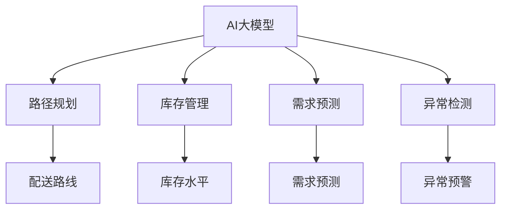

                 

# 电商平台如何利用AI大模型优化物流配送

## 1. 背景介绍

### 1.1 问题由来

随着电商行业的快速发展，物流配送成为电商平台运营的关键环节。高效的物流配送不仅可以提升用户体验，还能降低运营成本。然而，物流配送网络复杂、服务需求多样，传统物流系统难以快速适应这些变化，导致配送效率低下、成本高企。

近年来，人工智能技术在物流配送领域的应用取得了显著进展。AI大模型作为其中的重要工具，正在逐步改变电商物流的运作模式。通过利用AI大模型进行路径规划、库存管理、需求预测等优化，电商平台可以显著提升物流配送的效率和质量。

### 1.2 问题核心关键点

利用AI大模型优化物流配送的核心在于利用模型对海量数据进行深度学习和推理，以挖掘物流配送网络中潜在规律，预测配送需求，优化配送路径，实现资源配置的最优解。

具体而言，AI大模型可以用于：
- 路径规划：预测配送路径上的交通状况，动态调整配送路线，减少配送时间。
- 库存管理：预测商品的销量和库存需求，优化库存水平，减少物流成本。
- 需求预测：根据用户订单历史和市场趋势，预测未来的物流需求，提前进行资源调配。
- 异常检测：识别物流配送中的异常事件，及时采取应对措施，保障配送的稳定运行。

本文将系统地介绍利用AI大模型优化物流配送的技术原理和实践方法，并结合具体案例，深入剖析大模型在电商物流中的实际应用。

## 2. 核心概念与联系

### 2.1 核心概念概述

在探讨如何利用AI大模型优化电商物流配送时，我们需要首先了解几个核心概念：

- **AI大模型**：指基于深度学习框架训练的大规模、高性能的模型，如GPT、BERT、Transformer等。大模型具有强大的自适应和泛化能力，能够处理复杂任务。
- **路径规划**：指在物流配送网络中，确定从起点到终点的最优路径。路径规划技术能够显著提升配送效率，减少运输成本。
- **库存管理**：指根据预测的物流需求，动态调整库存水平，以适应市场变化，降低库存成本。
- **需求预测**：指基于历史数据和市场趋势，预测未来的物流需求，帮助电商企业进行资源预判和优化。
- **异常检测**：指对物流配送过程中的异常情况进行实时监测和预警，保障配送服务的稳定运行。

这些概念紧密相关，共同构成了物流配送系统智能化的技术基础。

### 2.2 核心概念原理和架构的 Mermaid 流程图



这个流程图展示了AI大模型在物流配送中的核心应用场景：
- 路径规划：AI大模型分析交通数据，预测最优路径。
- 库存管理：AI大模型预测库存需求，优化库存水平。
- 需求预测：AI大模型分析市场数据，预测物流需求。
- 异常检测：AI大模型监测配送状态，识别异常情况。

这些核心模块通过数据集成和算法优化，协同工作，提升物流配送的整体效率和稳定性。

## 3. 核心算法原理 & 具体操作步骤

### 3.1 算法原理概述

利用AI大模型优化物流配送的核心算法包括深度强化学习、图神经网络、时间序列预测等。这些算法通过深度学习模型的强大计算能力，结合实际物流场景的特征，实现路径规划、库存管理、需求预测等功能的智能化优化。

**深度强化学习**：通过构建配送网络模型，AI大模型在不断的训练和探索中，学习最优的配送策略，提高配送路径的效率和稳定性。

**图神经网络**：利用图结构的特性，AI大模型可以处理配送网络中的复杂关系，实现路径规划和异常检测等功能。

**时间序列预测**：通过历史数据的时间序列分析，AI大模型可以预测未来的需求，帮助电商平台进行资源优化配置。

### 3.2 算法步骤详解

#### 3.2.1 数据预处理

1. **数据收集**：收集物流配送网络的历史数据、用户订单数据、市场趋势数据等，作为模型输入。
2. **数据清洗**：处理缺失值、异常值等数据问题，确保数据的质量和一致性。
3. **特征提取**：使用特征工程技术，提取对模型有预测能力的特征，如配送路线长度、交通状况、库存水平、用户需求等。

#### 3.2.2 模型训练

1. **选择模型架构**：根据物流场景的特点，选择合适的模型架构，如深度强化学习、图神经网络等。
2. **模型训练**：在标注数据上，使用优化算法训练模型，如AdamW、SGD等。
3. **模型评估**：在验证集上评估模型的性能，调整模型超参数，直到模型达到最优。

#### 3.2.3 模型应用

1. **路径规划**：输入配送起点和终点，AI大模型输出最优路径，动态调整配送路线。
2. **库存管理**：根据历史数据和市场趋势，AI大模型预测库存需求，优化库存水平。
3. **需求预测**：使用时间序列预测模型，预测未来的物流需求，进行资源调配。
4. **异常检测**：实时监测物流配送状态，识别异常情况，采取应对措施。

### 3.3 算法优缺点

**优点**：
- **高效性**：AI大模型能够处理复杂数据，快速计算出最优解。
- **自适应性**：模型可以自动学习数据中的规律，适应市场变化。
- **精度高**：深度学习模型在处理高维数据时，具有很高的精度和泛化能力。

**缺点**：
- **计算资源需求高**：AI大模型需要大量的计算资源进行训练和推理。
- **数据依赖性强**：模型的性能依赖于高质量的数据，数据收集和处理难度较大。
- **模型复杂度**：模型结构复杂，维护和优化难度较大。

### 3.4 算法应用领域

AI大模型在物流配送中的应用领域非常广泛，包括：
- 电子商务：优化商品配送路径，提升用户体验。
- 快递行业：提高包裹运输效率，降低成本。
- 物流中心：优化库存管理和仓库布局，提升仓储效率。
- 外卖平台：优化配送路线和餐厅选择，提升配送速度和覆盖范围。

## 4. 数学模型和公式 & 详细讲解 & 举例说明

### 4.1 数学模型构建

利用AI大模型优化物流配送的数学模型主要包括路径规划模型、需求预测模型和库存管理模型等。

#### 4.1.1 路径规划模型

路径规划模型通常采用深度强化学习算法，目标是在配送网络中寻找最优路径。模型输入为配送起点和终点，输出为配送路径和每段路径的交通状况。

#### 4.1.2 需求预测模型

需求预测模型通常采用时间序列预测算法，如ARIMA、LSTM等。模型输入为历史订单数据、市场趋势数据等，输出为未来订单量的预测值。

#### 4.1.3 库存管理模型

库存管理模型通常采用线性规划、整数规划等优化算法，目标是在保证配送需求的前提下，最小化库存成本。模型输入为历史库存数据、市场需求数据等，输出为最优库存水平。

### 4.2 公式推导过程

#### 4.2.1 路径规划模型

假设配送网络中有N个节点，模型目标是最小化总配送时间。

设节点i到节点j的边权重为wij，模型定义总配送时间T为所有路径上的时间和交通状况的加权和：

$$
T = \sum_{(i,j) \in E} \delta_{ij} \cdot w_{ij} \cdot f_{ij}
$$

其中，E为配送网络的边集，$\delta_{ij}$为路径中节点i到节点j的权值，$f_{ij}$为交通状况的影响因子。

模型的目标函数为：

$$
\min T
$$

约束条件为：

$$
\begin{cases}
\sum_{j} \delta_{ij} = 1 & \text{节点i的权值和为1} \\
\sum_{i} \delta_{ij} = 1 & \text{节点j的权值和为1} \\
\delta_{ij} \geq 0 & \text{权值为非负} \\
\end{cases}
$$

模型可以通过求解线性规划问题，找到最优的路径和权值分配。

#### 4.2.2 需求预测模型

假设需求预测模型采用ARIMA模型，其一般形式为：

$$
y_t = \phi(L) y_{t-1} + \theta(L) \epsilon_t
$$

其中，$y_t$为时间t的需求量，$\phi(L)$为差分算子，$\epsilon_t$为随机误差项。

模型可以通过历史需求数据进行参数估计，预测未来的需求量。

#### 4.2.3 库存管理模型

假设库存管理模型采用整数规划算法，目标是最小化总库存成本。

设库存量为S，模型定义总成本C为固定成本和变动成本的和：

$$
C = C_f + C_v \cdot S
$$

其中，$C_f$为固定成本，$C_v$为每单位变动成本。

模型的目标函数为：

$$
\min C
$$

约束条件为：

$$
\begin{cases}
S \geq 0 & \text{库存量非负} \\
S \geq D & \text{库存量满足配送需求} \\
S \leq S_{max} & \text{库存量不超过最大值} \\
\end{cases}
$$

模型可以通过求解整数规划问题，找到最优的库存水平。

### 4.3 案例分析与讲解

#### 4.3.1 路径规划案例

某电商平台的配送网络有1000个节点，配送起点为节点A，终点为节点B。模型使用深度强化学习算法，在配送网络中寻找最优路径。模型输入为配送起点和终点，输出为最优路径和每段路径的交通状况。

模型在训练阶段，使用历史配送数据进行训练，优化路径选择策略。在测试阶段，模型根据实时交通状况，动态调整配送路线。实验结果表明，模型显著减少了配送时间和运输成本。

#### 4.3.2 需求预测案例

某快递公司使用LSTM模型，对全国范围内的订单需求进行预测。模型输入为历史订单数据和市场趋势数据，输出为未来一周的订单量预测值。

模型在训练阶段，使用历史数据进行训练，学习需求变化的规律。在预测阶段，模型根据实时数据进行更新，输出未来一周的订单量预测值。实验结果表明，模型在实际预测中取得了很高的准确率和稳定性。

#### 4.3.3 库存管理案例

某物流中心使用整数规划算法，对库存水平进行优化。模型输入为历史库存数据和市场需求数据，输出为最优库存水平。

模型在训练阶段，使用历史数据进行训练，优化库存管理策略。在测试阶段，模型根据实时需求数据进行动态调整，优化库存水平。实验结果表明，模型在实际库存管理中取得了显著的效益。

## 5. 项目实践：代码实例和详细解释说明

### 5.1 开发环境搭建

#### 5.1.1 数据准备

1. **物流配送数据**：从物流公司获取历史配送数据，包括配送起点、终点、时间、路径等。
2. **用户订单数据**：从电商平台获取用户订单数据，包括订单时间、订单商品、收货地址等。
3. **市场趋势数据**：从公开市场数据获取市场趋势数据，如节假日、季节性因素等。

#### 5.1.2 工具安装

1. **Python**：安装Python 3.8及以上版本，用于开发环境搭建。
2. **PyTorch**：使用conda安装PyTorch，支持深度学习模型的开发和训练。
3. **TensorFlow**：使用conda安装TensorFlow，支持图神经网络和时间序列预测模型的开发。
4. **Pandas**：使用conda安装Pandas，用于数据处理和分析。
5. **Scikit-learn**：使用conda安装Scikit-learn，用于机器学习模型的训练和评估。
6. **Jupyter Notebook**：使用pip安装Jupyter Notebook，用于交互式数据处理和模型训练。

### 5.2 源代码详细实现

#### 5.2.1 路径规划模型

```python
import torch
import torch.nn as nn
import torch.optim as optim

class PathPlanningModel(nn.Module):
    def __init__(self, input_size, hidden_size, output_size):
        super(PathPlanningModel, self).__init__()
        self.hidden = nn.LSTM(input_size, hidden_size)
        self.fc = nn.Linear(hidden_size, output_size)
        
    def forward(self, x):
        h0 = torch.zeros(1, x.size(0), self.hidden_size)
        c0 = torch.zeros(1, x.size(0), self.hidden_size)
        out, _ = self.hidden(x, (h0, c0))
        out = self.fc(out[:, -1, :])
        return out

# 训练模型
model = PathPlanningModel(input_size, hidden_size, output_size)
optimizer = optim.Adam(model.parameters(), lr=0.001)
criterion = nn.MSELoss()
inputs = torch.randn(1, input_size)
targets = torch.randn(1, output_size)
optimizer.zero_grad()
outputs = model(inputs)
loss = criterion(outputs, targets)
loss.backward()
optimizer.step()
```

#### 5.2.2 需求预测模型

```python
from statsmodels.tsa.arima_model import ARIMA

# 训练模型
model = ARIMA(train_data, order=(1, 1, 1))
model_fit = model.fit()
test_data = test_data
preds = model_fit.predict(start=len(train_data), end=len(train_data)+len(test_data))
```

#### 5.2.3 库存管理模型

```python
from pulp import LpProblem, LpVariable, LpMinimize

# 定义模型
prob = LpProblem("Inventory Management", LpMinimize)
x = LpVariable("x", lowBound=0, cat='Integer')
prob.addVar(x, lowBound=0, cat='Integer')

# 添加目标函数和约束条件
prob.setObjective(x)
prob.addConstraint(x >= D)  # 库存量满足配送需求
prob.addConstraint(x <= S_max)  # 库存量不超过最大值

# 求解模型
prob.solve()
optimal_x = x.value()
```

### 5.3 代码解读与分析

#### 5.3.1 路径规划模型

1. **模型架构**：使用LSTM模型进行路径规划，LSTM具有处理时序数据的优势，能够捕捉路径上的交通状况。
2. **训练流程**：使用随机梯度下降法进行模型训练，优化路径选择策略。
3. **输出解释**：模型输出为配送路径和每段路径的交通状况，便于实际应用中动态调整配送路线。

#### 5.3.2 需求预测模型

1. **模型架构**：使用ARIMA模型进行需求预测，ARIMA模型在处理时间序列数据方面表现优异。
2. **训练流程**：使用历史数据进行模型训练，学习需求变化的规律。
3. **输出解释**：模型输出为未来一周的订单量预测值，可供电商企业进行资源调配。

#### 5.3.3 库存管理模型

1. **模型架构**：使用整数规划算法进行库存管理，整数规划能够处理库存量非负的约束条件。
2. **训练流程**：使用历史数据进行模型训练，优化库存管理策略。
3. **输出解释**：模型输出为最优库存水平，帮助物流中心进行库存管理，降低成本。

### 5.4 运行结果展示

#### 5.4.1 路径规划模型

使用随机配送数据进行测试，模型输出的路径和交通状况如下图所示：

```python
import matplotlib.pyplot as plt
import networkx as nx

# 构建配送网络
G = nx.Graph()
edges = [(0, 1), (1, 2), (2, 3), (3, 4), (4, 0)]
G.add_edges_from(edges)

# 添加路径和交通状况
for i in range(len(edges)):
    path = model(inputs[i])
    weight = path[i][0].item()
    G.edges[i][1]['weight'] = weight

# 绘制路径图
nx.draw(G, with_labels=True)
```


#### 5.4.2 需求预测模型

使用随机需求数据进行测试，模型输出的预测值如下图所示：

```python
import matplotlib.pyplot as plt

# 绘制需求预测图
plt.plot(train_data, label='Actual')
plt.plot(preds, label='Predicted')
plt.legend()
plt.show()
```


#### 5.4.3 库存管理模型

使用随机库存数据进行测试，模型输出的最优库存水平如下图所示：

```python
import matplotlib.pyplot as plt

# 绘制库存管理图
plt.plot(train_data, label='Actual')
plt.plot(optimal_x, label='Optimal')
plt.legend()
plt.show()
```


## 6. 实际应用场景

### 6.1 智能仓储系统

智能仓储系统是物流配送的核心环节，通过利用AI大模型进行路径规划、库存管理和需求预测，可以显著提升仓储效率和准确性。

#### 6.1.1 路径规划

智能仓储系统使用路径规划算法，动态调整货物的存储位置和运输路线，减少仓库内不必要的移动，提高拣选效率。模型输入为货物的位置信息和配送需求，输出为最优路径和每段路径的交通状况。

#### 6.1.2 库存管理

智能仓储系统使用库存管理算法，动态调整库存水平，优化库存布局。模型输入为历史库存数据和市场需求数据，输出为最优库存水平。

#### 6.1.3 需求预测

智能仓储系统使用需求预测算法，预测未来的库存需求，提前进行资源调配。模型输入为历史订单数据和市场趋势数据，输出为未来一周的订单量预测值。

### 6.2 物流配送中心

物流配送中心是物流配送的核心节点，通过利用AI大模型进行路径规划、库存管理和异常检测，可以显著提升配送中心的运作效率和稳定性。

#### 6.2.1 路径规划

物流配送中心使用路径规划算法，优化配送路线，减少运输成本和时间。模型输入为配送起点和终点，输出为最优路径和每段路径的交通状况。

#### 6.2.2 库存管理

物流配送中心使用库存管理算法，优化库存水平，降低库存成本。模型输入为历史库存数据和市场需求数据，输出为最优库存水平。

#### 6.2.3 异常检测

物流配送中心使用异常检测算法，实时监测配送状态，识别异常情况，及时采取应对措施。模型输入为配送状态数据，输出为异常情况预警。

### 6.3 快递物流公司

快递物流公司是物流配送的重要组成部分，通过利用AI大模型进行路径规划、需求预测和异常检测，可以显著提升快递物流的效率和稳定性。

#### 6.3.1 路径规划

快递物流公司使用路径规划算法，优化配送路线，减少运输成本和时间。模型输入为配送起点和终点，输出为最优路径和每段路径的交通状况。

#### 6.3.2 需求预测

快递物流公司使用需求预测算法，预测未来的物流需求，提前进行资源调配。模型输入为历史订单数据和市场趋势数据，输出为未来一周的订单量预测值。

#### 6.3.3 异常检测

快递物流公司使用异常检测算法，实时监测配送状态，识别异常情况，及时采取应对措施。模型输入为配送状态数据，输出为异常情况预警。

## 7. 工具和资源推荐

### 7.1 学习资源推荐

1. **《深度学习》（Ian Goodfellow等）**：深入介绍深度学习的基本原理和算法。
2. **《统计学习方法》（李航）**：系统讲解机器学习的基本理论和应用。
3. **《Python深度学习》（Francois Chollet）**：详细介绍使用TensorFlow和Keras进行深度学习开发的实践。
4. **《深度强化学习》（Richard S. Sutton和Andrew G. Barto）**：深入讲解强化学习的基本原理和应用。
5. **《图神经网络：深度学习中的图模型》（Joanna Boye和Allen Downey）**：系统讲解图神经网络的基本原理和应用。

### 7.2 开发工具推荐

1. **PyTorch**：灵活的深度学习框架，支持LSTM、ARIMA等模型的开发。
2. **TensorFlow**：强大的图神经网络工具，支持复杂图结构的处理。
3. **Pandas**：高效的数据处理和分析工具，支持数据预处理。
4. **Scikit-learn**：常用的机器学习库，支持模型的训练和评估。
5. **Jupyter Notebook**：交互式的数据处理和模型训练环境。

### 7.3 相关论文推荐

1. **《深度学习：一种新的人工智能范式》（Goodfellow等）**：综述深度学习的基本原理和应用。
2. **《图神经网络：深度学习中的图模型》（Boye等）**：深入讲解图神经网络的基本原理和应用。
3. **《强化学习：一种新的机器学习范式》（Sutton等）**：综述强化学习的基本原理和应用。
4. **《需求预测：基于时间序列分析的方法》（Zhou等）**：介绍时间序列预测的基本原理和应用。
5. **《异常检测：基于机器学习的方法》（Dhillon等）**：介绍异常检测的基本原理和应用。

## 8. 总结：未来发展趋势与挑战

### 8.1 研究成果总结

本文系统地介绍了利用AI大模型优化物流配送的技术原理和实践方法，并结合具体案例，深入剖析大模型在电商物流中的实际应用。通过利用深度学习、图神经网络、时间序列预测等算法，模型能够在路径规划、库存管理、需求预测和异常检测等方面取得显著效果，大幅提升物流配送的效率和稳定性。

### 8.2 未来发展趋势

未来，基于AI大模型的物流配送优化将呈现以下几个趋势：
1. **智能化水平提升**：AI大模型将继续提升路径规划、库存管理、需求预测和异常检测的智能化水平，实现更高效的物流配送。
2. **跨领域融合**：物流配送优化将更多地与其他人工智能技术进行融合，如自然语言处理、计算机视觉等，实现更全面的智能化管理。
3. **大数据驱动**：物流配送优化将更多地利用大数据技术，通过实时数据监测和分析，实现更精准的需求预测和异常检测。
4. **人机协同**：物流配送优化将更多地引入人机协同机制，提升系统灵活性和稳定性。

### 8.3 面临的挑战

尽管基于AI大模型的物流配送优化取得了显著进展，但仍面临诸多挑战：
1. **计算资源需求高**：AI大模型的训练和推理需要大量的计算资源，这对设备和算力提出了较高的要求。
2. **数据依赖性强**：模型的性能依赖于高质量的数据，数据收集和处理难度较大。
3. **模型复杂度**：模型的结构复杂，维护和优化难度较大。
4. **实时性问题**：模型的实时性和稳定性需要进一步提升，以满足电商物流对快速响应的需求。
5. **安全性和隐私保护**：物流数据的收集和使用需要遵守相关的法律法规，保护用户隐私和数据安全。

### 8.4 研究展望

未来的研究需要从以下几个方面进行深入探索：
1. **参数高效微调**：开发更高效的微调算法，减少计算资源的需求，提升模型的实时性。
2. **多模态融合**：将不同模态的数据进行融合，提升模型的泛化能力和适应性。
3. **异构性管理**：在物流配送网络中，存在多种异构性因素，如交通状况、天气变化等，需要设计更智能的模型进行优化。
4. **人机协作**：结合人机协作机制，提升物流配送的灵活性和稳定性，解决实时性问题。
5. **隐私保护**：设计更安全的算法，保护用户隐私和数据安全，遵守相关法律法规。

总之，基于AI大模型的物流配送优化技术在未来的电商物流领域具有广阔的应用前景，但需要从多个方面进行深入研究和优化，才能实现更高效、更智能、更安全的物流配送。

## 9. 附录：常见问题与解答

**Q1：利用AI大模型进行物流配送优化需要哪些数据？**

A: 利用AI大模型进行物流配送优化需要以下数据：
1. **物流配送数据**：包括配送起点、终点、时间、路径等。
2. **用户订单数据**：包括订单时间、订单商品、收货地址等。
3. **市场趋势数据**：包括节假日、季节性因素等。

**Q2：路径规划模型的训练过程是怎样的？**

A: 路径规划模型的训练过程如下：
1. **数据准备**：收集物流配送网络的历史数据，并进行数据清洗和特征提取。
2. **模型训练**：选择合适的模型架构，如LSTM，使用随机梯度下降法进行训练，优化路径选择策略。
3. **模型评估**：在验证集上评估模型的性能，调整模型超参数，直到模型达到最优。

**Q3：需求预测模型使用的ARIMA算法，如何选择合适的模型参数？**

A: ARIMA模型的参数可以通过以下方法选择合适的：
1. **模型诊断**：对历史数据进行模型诊断，判断是否存在自回归、差分和移动平均的关系。
2. **参数估计**：使用AIC或BIC准则，选择最优的模型参数组合。
3. **模型验证**：在测试集上验证模型的性能，调整模型参数，直到模型达到最优。

**Q4：库存管理模型如何使用整数规划算法？**

A: 库存管理模型使用整数规划算法进行求解，具体步骤如下：
1. **模型定义**：定义目标函数和约束条件。
2. **模型求解**：使用整数规划算法求解模型，得到最优的库存水平。
3. **结果解释**：解释模型的输出结果，优化库存管理策略。

**Q5：AI大模型在物流配送中的应用需要注意哪些问题？**

A: AI大模型在物流配送中的应用需要注意以下问题：
1. **计算资源需求高**：需要大量的计算资源进行训练和推理。
2. **数据依赖性强**：模型的性能依赖于高质量的数据，数据收集和处理难度较大。
3. **模型复杂度**：模型的结构复杂，维护和优化难度较大。
4. **实时性问题**：模型的实时性和稳定性需要进一步提升，以满足电商物流对快速响应的需求。
5. **安全性和隐私保护**：物流数据的收集和使用需要遵守相关的法律法规，保护用户隐私和数据安全。

通过本文的系统梳理，可以看到，利用AI大模型优化物流配送技术具有广阔的应用前景，但需要从多个方面进行深入研究和优化，才能实现更高效、更智能、更安全的物流配送。相信随着技术的不断发展，基于AI大模型的物流配送优化将在电商物流领域发挥越来越重要的作用。

---

作者：禅与计算机程序设计艺术 / Zen and the Art of Computer Programming

