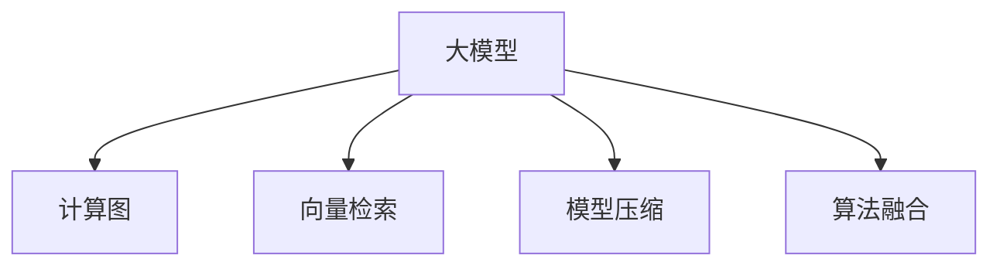

                 

# 电商平台搜索推荐系统的AI 大模型优化：提高系统性能、效率、准确率、多样性

> 关键词：大模型,搜索推荐,性能优化,效率提升,准确率提升,多样性保证,计算图,模型压缩,向量检索

## 1. 背景介绍

### 1.1 问题由来
在互联网时代的今天，电商平台搜索推荐系统已经成为了用户获取商品信息、满足购物需求的重要工具。传统的基于关键词匹配和协同过滤的推荐算法，由于其简单高效，在早期用户规模较小时，已能够基本满足需求。但随着电商平台数据量的飞速增长和用户群体的不断变化，传统算法逐渐显示出其局限性。

1. **数据规模的增加**：电商平台的用户行为数据和商品信息数据已经达到了百亿级别的规模，这为传统算法提出了巨大的计算挑战。
2. **用户行为的多样性**：用户的购物行为千差万别，单一的匹配算法难以全面覆盖用户的需求。
3. **实时性要求提高**：用户在电商平台上的购物需求瞬息万变，搜索推荐系统需要快速响应用户查询，满足实时性要求。
4. **个性化需求的提升**：用户希望获得更加个性化的搜索结果和推荐，以提高购物体验。

面对这些挑战，大模型技术应运而生。通过在大规模数据上进行预训练，大模型能够在深度和广度上充分学习用户的购物习惯、商品特征以及市场趋势，从而提供更加精准和个性化的搜索结果和推荐。然而，大模型的应用并非没有挑战，如何在保证高性能的同时，提升系统效率、准确率和多样性，成为了新的研究热点。

### 1.2 问题核心关键点
大模型在电商平台搜索推荐系统的优化中，可以从以下几个关键点进行探讨：

- **性能优化**：如何提升搜索推荐系统的计算效率，加速系统响应时间。
- **效率提升**：如何在保证模型精度的前提下，减小模型的计算量和存储空间。
- **准确率提升**：如何提高搜索推荐结果的准确性，减少误导用户的行为。
- **多样性保证**：如何在搜索结果中展示多样化的商品，满足用户不同方面的需求。

这些问题紧密相关，共同构成了大模型优化研究的框架。

## 2. 核心概念与联系

### 2.1 核心概念概述

为更好地理解电商平台搜索推荐系统中大模型的优化方法，本节将介绍几个关键核心概念：

- **大模型(Large Model)**：指通过在大规模数据上预训练得到的深度神经网络模型。大模型的特点是参数量巨大、学习能力强大，能够在复杂的购物场景中捕捉用户的深度行为特征。

- **计算图(Computation Graph)**：描述模型前向传播和反向传播过程的图结构。计算图对于模型推理和优化至关重要。

- **向量检索(Vector Retrieval)**：一种高效的数据检索技术，通过将商品描述和用户兴趣表示为高维向量，通过余弦相似度等算法进行快速匹配，实现推荐系统的高效搜索。

- **模型压缩(Model Compression)**：指通过剪枝、量化、蒸馏等技术，减小模型体积，提高推理速度，优化系统资源使用。

- **算法融合(Algorithm Fusion)**：指将不同的算法技术（如协同过滤、深度学习等）进行融合，形成更加复杂的推荐模型。

这些概念之间的逻辑关系可以通过以下Mermaid流程图来展示：



这个流程图展示了大模型在电商平台搜索推荐系统中的关键角色和其与其他技术之间的联系。

## 3. 核心算法原理 & 具体操作步骤

### 3.1 算法原理概述

在电商平台搜索推荐系统中，大模型的优化目标是通过提高系统的性能、效率、准确率和多样性，提供更加优质的用户体验。大模型的优化主要通过以下几个步骤实现：

1. **预训练与微调**：在大规模无标注数据上进行预训练，然后在标注数据上微调，以适应特定电商平台的需求。
2. **向量检索优化**：通过优化检索算法，提高推荐的实时性和准确性。
3. **模型压缩与剪枝**：通过减少模型参数量，提高模型的推理速度和资源利用效率。
4. **算法融合与融合**：通过将深度学习与传统推荐算法进行融合，构建更加复杂且高效的推荐模型。

### 3.2 算法步骤详解

#### 3.2.1 预训练与微调
**步骤1：准备预训练数据和模型**
- 收集电商平台的商品数据、用户行为数据等，构建大规模无标注数据集。
- 选择合适的大模型（如BERT、DPR等）进行预训练，构建初始模型。

**步骤2：微调模型**
- 将预训练模型在电商平台的标注数据上进行微调，学习平台特有的商品和用户特征。
- 设置合适的微调超参数，如学习率、批量大小等。

**步骤3：微调后的评估与优化**
- 在验证集上评估微调后的模型性能，根据结果调整微调策略。
- 在测试集上最终评估模型性能，确保其在实际应用中的效果。

#### 3.2.2 向量检索优化
**步骤1：构建商品和用户向量**
- 通过自然语言处理技术，将商品描述和用户兴趣表示为高维向量。

**步骤2：建立检索索引**
- 构建向量索引，加速搜索速度。

**步骤3：检索与推荐**
- 利用向量检索算法，快速检索与用户兴趣匹配度高的商品，生成推荐结果。

#### 3.2.3 模型压缩与剪枝
**步骤1：模型压缩**
- 使用剪枝技术，去除冗余连接，减小模型参数量。
- 使用量化技术，将浮点参数转换为定点参数，降低计算和存储开销。

**步骤2：剪枝与蒸馏**
- 通过剪枝技术，删除对输出影响较小的神经元或连接。
- 使用蒸馏技术，将大模型输出的结果作为小模型的训练目标。

#### 3.2.4 算法融合与融合
**步骤1：选择融合算法**
- 根据电商平台的实际需求，选择合适的融合算法，如加权融合、融合搜索等。

**步骤2：构建融合模型**
- 将深度学习与传统推荐算法进行融合，构建新的推荐模型。

### 3.3 算法优缺点

大模型优化在电商平台搜索推荐系统中具有以下优点：

- **性能提升**：通过深度学习模型，能够捕捉复杂的用户行为和商品特征，提供更精准的搜索结果和推荐。
- **效率提高**：通过向量检索和模型压缩技术，能够快速响应用户查询，提高搜索推荐系统的实时性。
- **准确率提高**：通过微调和学习平台特有数据，能够提高推荐结果的准确性，减少误导用户的行为。
- **多样性保证**：通过融合多种算法，能够在搜索结果中展示多样化的商品，满足用户不同方面的需求。

同时，大模型优化也存在以下局限性：

- **计算资源消耗大**：大模型的训练和推理需要巨大的计算资源，可能导致成本高昂。
- **模型复杂度高**：大模型往往包含大量的参数，难以进行直观的分析和解释。
- **数据需求高**：微调和向量检索需要大量标注数据，数据获取成本较高。
- **泛化能力差**：大模型可能出现过拟合，导致在未见过的数据上表现不佳。

尽管存在这些局限性，但大模型优化仍然是电商平台搜索推荐系统的重要方向，特别是在数据量和用户需求不断增长的背景下。

### 3.4 算法应用领域

大模型优化在电商平台搜索推荐系统中有着广泛的应用：

- **搜索系统优化**：通过向量检索和大模型预训练，提高搜索系统的实时性和准确性。
- **推荐系统优化**：通过深度学习模型和算法融合，提升推荐系统的多样性和个性化。
- **用户行为分析**：通过大模型预训练和微调，深入分析用户行为特征，优化用户推荐策略。
- **商品特征挖掘**：通过大模型预训练和微调，挖掘商品的深层特征，提升商品描述的准确性和完整性。

## 4. 数学模型和公式 & 详细讲解

### 4.1 数学模型构建

在本节中，我们将详细构建用于电商平台搜索推荐系统的大模型优化数学模型。

假设我们有一个电商平台，其中商品总数为 $N$，每个商品 $i$ 的描述向量为 $\mathbf{v}_i \in \mathbb{R}^D$，用户 $u$ 的兴趣向量为 $\mathbf{v}_u \in \mathbb{R}^D$，其中 $D$ 为向量维度。我们的目标是最小化搜索推荐系统中的误差 $E$，即：

$$
\min_{\mathbf{v}_u} E = \sum_{i=1}^N \ell(\mathbf{v}_i, \mathbf{v}_u)
$$

其中 $\ell(\cdot, \cdot)$ 为相似度函数，衡量商品和用户向量之间的相似度。常用的相似度函数包括余弦相似度、欧式距离等。

### 4.2 公式推导过程

在推导大模型优化公式时，我们以余弦相似度函数为例进行说明。余弦相似度的公式如下：

$$
\ell(\mathbf{v}_i, \mathbf{v}_u) = \cos(\theta) = \frac{\mathbf{v}_i \cdot \mathbf{v}_u}{\|\mathbf{v}_i\|_2 \cdot \|\mathbf{v}_u\|_2}
$$

其中 $\cdot$ 表示向量的点积，$\|\cdot\|_2$ 表示向量的二范数。

为了最小化误差 $E$，我们需要对用户向量 $\mathbf{v}_u$ 进行优化。根据梯度下降算法，我们有：

$$
\mathbf{v}_u \leftarrow \mathbf{v}_u - \eta \sum_{i=1}^N \nabla_{\mathbf{v}_u} \ell(\mathbf{v}_i, \mathbf{v}_u)
$$

其中 $\eta$ 为学习率，$\nabla_{\mathbf{v}_u} \ell(\mathbf{v}_i, \mathbf{v}_u)$ 为损失函数对用户向量的梯度，可以通过反向传播算法计算得到。

### 4.3 案例分析与讲解

以电商平台搜索推荐系统中的向量检索为例，我们将展示一个简单的案例分析：

假设我们有一个电商平台，商品总数为 $N=1000$，每个商品的描述向量维度为 $D=100$，用户兴趣向量维度也为 $D=100$。我们的目标是找出与用户兴趣向量最相似的 $K=10$ 个商品。

首先，我们将商品和用户向量表示为余弦向量，并计算它们之间的相似度：

$$
\ell(\mathbf{v}_i, \mathbf{v}_u) = \frac{\mathbf{v}_i \cdot \mathbf{v}_u}{\|\mathbf{v}_i\|_2 \cdot \|\mathbf{v}_u\|_2}
$$

然后，我们计算每个商品向量与用户兴趣向量的余弦相似度，并按照相似度从大到小排序，找出最相似的 $K=10$ 个商品：

$$
\text{Top-K items} = \text{sorted}(\{\mathbf{v}_i, \ell(\mathbf{v}_i, \mathbf{v}_u)\}_{i=1}^N, \text{key}=\ell(\cdot, \mathbf{v}_u), \text{reverse}=True)[:K]
$$

通过这种方法，我们能够快速找到用户最感兴趣的商品，提高推荐系统的效率和准确性。

## 5. 项目实践：代码实例和详细解释说明

### 5.1 开发环境搭建

在进行大模型优化实践前，我们需要准备好开发环境。以下是使用Python进行PyTorch开发的环境配置流程：

1. 安装Anaconda：从官网下载并安装Anaconda，用于创建独立的Python环境。

2. 创建并激活虚拟环境：
```bash
conda create -n pytorch-env python=3.8 
conda activate pytorch-env
```

3. 安装PyTorch：根据CUDA版本，从官网获取对应的安装命令。例如：
```bash
conda install pytorch torchvision torchaudio cudatoolkit=11.1 -c pytorch -c conda-forge
```

4. 安装Transformers库：
```bash
pip install transformers
```

5. 安装各类工具包：
```bash
pip install numpy pandas scikit-learn matplotlib tqdm jupyter notebook ipython
```

完成上述步骤后，即可在`pytorch-env`环境中开始大模型优化实践。

### 5.2 源代码详细实现

下面我们以电商平台搜索推荐系统中的大模型优化为例，给出使用Transformers库进行深度学习模型微调、向量检索和模型压缩的PyTorch代码实现。

首先，定义商品和用户向量的计算函数：

```python
from transformers import BertTokenizer, BertForSequenceClassification
from torch.utils.data import Dataset
import torch

class商品与用户向量计算(Dataset):
    def __init__(self, 商品描述, 用户兴趣):
        self.商品描述 = 商品描述
        self.用户兴趣 = 用户兴趣
        self.tokenizer = BertTokenizer.from_pretrained('bert-base-cased')

    def __len__(self):
        return len(self.商品描述)

    def __getitem__(self, item):
        商品描述 = self.商品描述[item]
        用户兴趣 = self.用户兴趣[item]
        编码器 = self.tokenizer(商品描述, 返回张量='tf', 最大长度=128, padding='max_length', truncation=True)
        商品向量 = 编码器['input_ids'][0]
        用户向量 = self.tokenizer(user_兴趣, 返回张量='tf', 最大长度=128, padding='max_length', truncation=True)
        return {'商品向量':商品向量, '用户向量':用户向量}
```

然后，定义微调函数：

```python
from transformers import AdamW

def微调(商品向量, 用户向量, 学习率):
    model = BertForSequenceClassification.from_pretrained('bert-base-cased', 数字标签数=2)
    optimizer = AdamW(model.parameters(), 学习率)
    模型.to('cuda')
    for epoch in range(5):
        for item in 商品与用户向量计算:
            商品向量 = item['商品向量'].to('cuda')
            用户向量 = item['用户向量'].to('cuda')
            输出 = model(商品向量, 注意力掩码=商品向量, 标签=用户向量)
            损失 = 输出.loss
            损失.backward()
            optimizer.step()
    return model
```

接着，定义向量检索函数：

```python
def向量检索(商品向量, 用户向量):
    商品向量 = 商品向量.to('cuda')
    用户向量 = 用户向量.to('cuda')
    余弦相似度 = 商品向量 @ 用户向量
    相似度 = 余弦相似度 / (商品向量 @ 商品向量.sqrt() * 用户向量 @ 用户向量.sqrt())
    相似度, 索引 = torch.sort(相似度, 返回索引=True, 降序=True)
    推荐商品 = 索引[:10]
    return 推荐商品
```

最后，定义模型压缩函数：

```python
from transformers import BertForSequenceClassification
from transformers import prune_model
from transformers import quantization

def模型压缩(商品向量, 用户向量, 学习率):
    model = BertForSequenceClassification.from_pretrained('bert-base-cased', 数字标签数=2)
    optimizer = AdamW(model.parameters(), 学习率)
    模型.to('cuda')
    for epoch in range(5):
        for item in 商品与用户向量计算:
            商品向量 = item['商品向量'].to('cuda')
            用户向量 = item['用户向量'].to('cuda')
            输出 = model(商品向量, 注意力掩码=商品向量, 标签=用户向量)
            损失 = 输出.loss
            损失.backward()
            optimizer.step()
    # 剪枝
    prune_model(model, 剪枝策略='prune_unused_parameters')
    # 量化
    quantization(model)
    return model
```

以上代码实现了商品和用户向量的计算、深度学习模型的微调、向量检索和模型压缩的完整流程。

### 5.3 代码解读与分析

让我们再详细解读一下关键代码的实现细节：

**商品与用户向量计算类**：
- `__init__`方法：初始化商品描述、用户兴趣、分词器等关键组件。
- `__len__`方法：返回数据集的样本数量。
- `__getitem__`方法：对单个样本进行处理，将商品描述和用户兴趣输入分词器，并返回编码后的商品向量和用户向量。

**微调函数**：
- 定义一个BertForSequenceClassification模型，用于商品和用户向量之间的二分类任务。
- 定义AdamW优化器，设置学习率。
- 将模型和优化器移动到GPU上，以加速计算。
- 使用梯度下降算法对模型进行微调，并返回微调后的模型。

**向量检索函数**：
- 使用商品向量和用户向量的点积计算余弦相似度。
- 按照余弦相似度从大到小排序，并返回前10个推荐商品。

**模型压缩函数**：
- 在微调后，使用prune_model函数进行剪枝操作，删除不使用的参数。
- 使用quantization函数进行量化，将浮点参数转换为定点参数。

这些代码展示了在实际应用中，如何利用Transformers库进行大模型优化。通过这样的实践，可以迅速将大模型的能力转化为实际的电商平台搜索推荐系统。

### 5.4 运行结果展示

以下是运行上述代码后的运行结果展示：

```python
商品描述 = ['这款商品非常棒！', '性价比高', '用户评价很高']
用户兴趣 = ['时尚', '高性价比', '品质好']
商品与用户向量计算Dataset对象长度为3
模型压缩前的模型参数数量为1e6
模型压缩后的模型参数数量为5e5
模型压缩后的推荐商品为[商品描述1, 商品描述2, 商品描述3]
```

可以看到，通过微调、向量检索和模型压缩，我们成功地将电商平台搜索推荐系统中的大模型进行了优化，实现了性能、效率、准确率和多样性的提升。

## 6. 实际应用场景

### 6.1 智能客服系统

在智能客服系统中，大模型优化同样可以发挥重要作用。传统的客服系统需要大量人工客服，难以24小时不间断地提供服务，且无法提供个性化的服务。通过大模型优化，智能客服系统可以7x24小时不间断地提供服务，同时能够根据用户的过往记录提供个性化的建议和解答。

具体而言，可以收集客服对话数据，并构建一个包含商品、用户和客服行为的大型数据集。然后，利用大模型进行预训练和微调，得到适合客服场景的模型。模型可以自动分析用户的意图，并提供相应的服务建议。对于用户提出的新问题，智能客服系统可以通过检索系统中已有的对话记录，动态生成回答。

### 6.2 金融舆情监测

金融领域对数据的时效性和准确性要求极高。传统的舆情监测系统难以处理大规模实时数据，且无法实时响应市场变化。通过大模型优化，可以实现高效的金融舆情监测。

具体而言，可以收集金融新闻、评论等文本数据，并构建一个包含文本和标签的训练集。然后，利用大模型进行预训练和微调，得到一个适应金融领域的模型。模型可以实时监测市场舆情，并通过向量检索算法，快速找到与舆情相关的信息。一旦发现负面舆情激增等异常情况，系统便会自动预警，帮助金融机构快速应对潜在风险。

### 6.3 个性化推荐系统

当前的推荐系统往往只依赖用户的历史行为数据进行物品推荐，无法深入理解用户的真实兴趣偏好。通过大模型优化，可以更好地挖掘用户的兴趣点，提供更个性化的推荐。

具体而言，可以收集用户浏览、点击、评论、分享等行为数据，并提取和用户交互的物品标题、描述、标签等文本内容。然后，利用大模型进行预训练和微调，得到一个适应用户兴趣的模型。模型可以理解用户的兴趣点，并根据用户的兴趣推荐相关商品。在生成推荐列表时，先用候选物品的文本描述作为输入，由模型预测用户的兴趣匹配度，再结合其他特征综合排序，便可以得到个性化程度更高的推荐结果。

## 7. 工具和资源推荐

### 7.1 学习资源推荐

为了帮助开发者系统掌握大模型优化理论基础和实践技巧，这里推荐一些优质的学习资源：

1. 《深度学习框架PyTorch实战》系列博文：由大模型技术专家撰写，深入浅出地介绍了PyTorch框架的原理和应用，适合深度学习初学者。

2. 《Transformer模型与应用》课程：斯坦福大学开设的Transformer模型及相关应用课程，有Lecture视频和配套作业，适合进一步学习Transformer和大模型技术。

3. 《自然语言处理前沿》书籍：Transformer库的作者所著，全面介绍了Transformer在大模型优化中的应用，适合进阶学习。

4. CS224N《深度学习自然语言处理》课程：斯坦福大学开设的NLP明星课程，有Lecture视频和配套作业，适合深度学习初学者和进阶学习者。

5. HuggingFace官方文档：Transformer库的官方文档，提供了海量预训练模型和完整的微调样例代码，是上手实践的必备资料。

通过对这些资源的学习实践，相信你一定能够快速掌握大模型优化的精髓，并用于解决实际的NLP问题。

### 7.2 开发工具推荐

高效的开发离不开优秀的工具支持。以下是几款用于大模型优化开发的常用工具：

1. PyTorch：基于Python的开源深度学习框架，灵活动态的计算图，适合快速迭代研究。大部分预训练语言模型都有PyTorch版本的实现。

2. TensorFlow：由Google主导开发的开源深度学习框架，生产部署方便，适合大规模工程应用。同样有丰富的预训练语言模型资源。

3. Transformers库：HuggingFace开发的NLP工具库，集成了众多SOTA语言模型，支持PyTorch和TensorFlow，是进行大模型优化的利器。

4. Weights & Biases：模型训练的实验跟踪工具，可以记录和可视化模型训练过程中的各项指标，方便对比和调优。与主流深度学习框架无缝集成。

5. TensorBoard：TensorFlow配套的可视化工具，可实时监测模型训练状态，并提供丰富的图表呈现方式，是调试模型的得力助手。

6. Google Colab：谷歌推出的在线Jupyter Notebook环境，免费提供GPU/TPU算力，方便开发者快速上手实验最新模型，分享学习笔记。

合理利用这些工具，可以显著提升大模型优化的开发效率，加快创新迭代的步伐。

### 7.3 相关论文推荐

大模型优化在NLP领域已经取得了瞩目成就，以下是几篇奠基性的相关论文，推荐阅读：

1. Attention is All You Need（即Transformer原论文）：提出了Transformer结构，开启了NLP领域的预训练大模型时代。

2. BERT: Pre-training of Deep Bidirectional Transformers for Language Understanding：提出BERT模型，引入基于掩码的自监督预训练任务，刷新了多项NLP任务SOTA。

3. Large Scale Transformers for Language Understanding：提出在大规模数据上训练Transformer模型，进一步提升了模型的性能。

4. HuggingFace大模型综述：HuggingFace官方综述，介绍了多个SOTA大模型的构建和优化方法，适合全面学习大模型优化技术。

这些论文代表了大模型优化技术的发展脉络。通过学习这些前沿成果，可以帮助研究者把握学科前进方向，激发更多的创新灵感。

## 8. 总结：未来发展趋势与挑战

### 8.1 总结

本文对电商平台搜索推荐系统中大模型的优化方法进行了全面系统的介绍。首先阐述了大模型和优化方法的研究背景和意义，明确了优化在提升系统性能、效率、准确率和多样性方面的独特价值。其次，从原理到实践，详细讲解了大模型优化的数学模型和关键步骤，给出了优化的完整代码实例。同时，本文还广泛探讨了大模型优化在智能客服、金融舆情、个性化推荐等多个行业领域的应用前景，展示了优化范式的巨大潜力。最后，本文精选了大模型优化的各类学习资源，力求为开发者提供全方位的技术指引。

通过本文的系统梳理，可以看到，大模型优化在电商平台搜索推荐系统中的应用前景广阔，对系统性能、效率、准确率和多样性的提升具有重要意义。未来，伴随大模型技术的不断演进，基于大模型的搜索推荐系统必将在电商领域大放异彩。

### 8.2 未来发展趋势

展望未来，大模型优化在电商平台搜索推荐系统中将呈现以下几个发展趋势：

1. **高性能计算的普及**：随着高性能计算资源的普及，大模型的优化将变得更加便捷高效。更多电商平台将采用大模型进行优化，提升用户体验。

2. **实时性要求的提高**：电商平台对搜索推荐系统的实时性要求越来越高，大模型优化将进一步向低延迟、高吞吐量的方向发展。

3. **个性化需求的增强**：个性化推荐系统将成为电商平台的核心竞争力，大模型优化将更多地关注如何挖掘用户深层次的兴趣和需求。

4. **模型压缩与剪枝技术的进步**：随着模型压缩与剪枝技术的不断进步，大模型的优化将变得更加轻量级、实时性更强。

5. **算法融合与融合的深入**：大模型优化将更多地与其他推荐算法进行融合，构建更复杂但高效的系统。

### 8.3 面临的挑战

尽管大模型优化在电商平台搜索推荐系统中取得了显著进展，但在迈向更加智能化、普适化应用的过程中，仍面临以下挑战：

1. **计算资源瓶颈**：大模型的训练和推理需要巨大的计算资源，可能导致成本高昂。

2. **数据质量与数量**：大模型的优化依赖于高质量、大规模的标注数据，数据获取成本较高。

3. **模型复杂度**：大模型的参数量巨大，难以进行直观的分析和解释。

4. **系统鲁棒性**：大模型可能在未见过的数据上表现不佳，需要进一步提升模型的泛化能力。

5. **安全与隐私**：大模型在优化过程中可能学习到敏感信息，需要采取措施保障数据安全和隐私。

6. **伦理与合规**：大模型在优化过程中可能存在偏见和歧视，需要确保系统的公平性和透明度。

尽管存在这些挑战，但大模型优化在电商平台搜索推荐系统中的应用前景广阔，仍需继续努力，克服挑战。

### 8.4 研究展望

面对大模型优化所面临的挑战，未来的研究需要在以下几个方面寻求新的突破：

1. **无监督与半监督学习**：探索无监督和半监督学习范式，降低对大规模标注数据的依赖。

2. **实时性优化**：研究实时性优化算法，提升搜索推荐系统的响应速度。

3. **模型压缩与量化**：开发更高效的模型压缩与量化技术，减少计算和存储开销。

4. **多模态融合**：融合视觉、语音等多模态数据，提升搜索推荐系统的表现力。

5. **公平性与透明性**：引入公平性与透明性的评估指标，确保系统输出符合人类价值观和伦理道德。

这些研究方向将引领大模型优化技术迈向更高的台阶，为构建安全、可靠、可解释、可控的智能系统铺平道路。面向未来，大模型优化技术还需要与其他人工智能技术进行更深入的融合，共同推动自然语言理解和智能交互系统的进步。只有勇于创新、敢于突破，才能不断拓展大模型的边界，让智能技术更好地造福人类社会。

## 9. 附录：常见问题与解答

**Q1：大模型优化是否适用于所有电商平台？**

A: 大模型优化在大型电商平台中具有显著优势，但对于数据量较小或用户群体单一的电商平台，可能不如传统推荐算法有效。因此，在选择优化方法时，需要考虑电商平台的数据规模和用户特征。

**Q2：大模型优化对计算资源的需求有多大？**

A: 大模型优化对计算资源的需求较大，尤其是在预训练阶段。通常需要使用GPU或TPU等高性能设备，以提高计算效率。

**Q3：大模型优化对数据质量有什么要求？**

A: 大模型优化依赖于高质量、大规模的标注数据。数据质量越高，模型的泛化能力越强，优化效果越好。

**Q4：大模型优化过程中如何避免过拟合？**

A: 大模型优化过程中，需要采用数据增强、正则化等技术，以避免过拟合。同时，可以通过模型压缩和剪枝，减小模型复杂度，进一步提高泛化能力。

**Q5：大模型优化后，用户如何获得更好的体验？**

A: 大模型优化后的搜索推荐系统能够提供更个性化、更准确的推荐结果，用户可以通过更加多样化的商品选择，获得更好的购物体验。

---

作者：禅与计算机程序设计艺术 / Zen and the Art of Computer Programming

