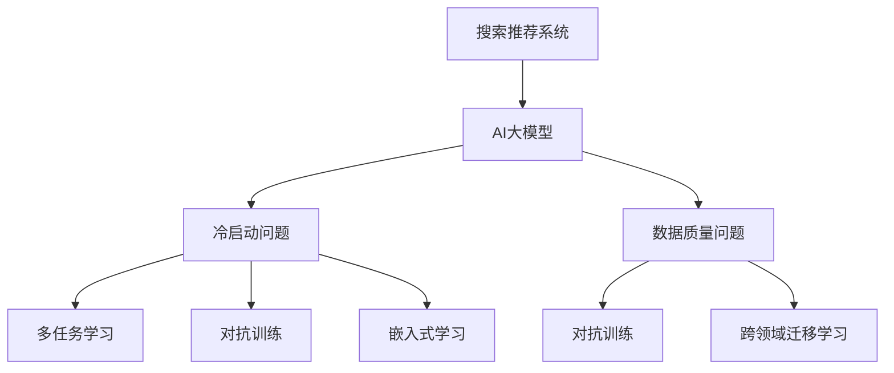

                 

# 电商平台搜索推荐系统的AI 大模型实践：应对冷启动与数据质量挑战

## 1. 背景介绍

随着电商平台的崛起和互联网用户的不断增长，搜索推荐系统成为了连接用户与商品的桥梁。AI大模型在推荐系统中的应用，显著提升了搜索的个性化和推荐的质量，满足了用户的多样化需求。然而，在实际应用中，搜索推荐系统常常面临冷启动与数据质量两大挑战。

### 1.1 冷启动问题

冷启动问题是指新用户、新商品或新交互类型没有足够的历史数据，导致无法利用传统机器学习算法进行有效推荐。针对冷启动问题，AI大模型凭借其庞大的参数量和丰富的预训练知识，可以在较少的交互数据下，快速学习用户行为模式和商品特性，实现冷启动推荐。

### 1.2 数据质量问题

数据质量问题通常源于数据标注的偏差、噪声和缺失，使得推荐系统难以获得高质量的训练信号。AI大模型通过在大规模无标签数据上进行预训练，能够自动发现数据中的内在结构和语义关系，在微调过程中克服数据质量问题，提升推荐结果的准确性和一致性。

## 2. 核心概念与联系

### 2.1 核心概念概述

为更好地理解电商平台搜索推荐系统中的AI大模型实践，本节将介绍几个密切相关的核心概念：

- 搜索推荐系统：通过用户行为、商品属性等数据，推荐给用户可能感兴趣的商品或内容。
- AI大模型：基于深度学习的大型模型，通过在大规模数据上预训练，具有强大的语言理解和生成能力。
- 冷启动问题：新用户、商品或交互类型缺乏足够历史数据，导致推荐模型无法有效推荐。
- 数据质量问题：数据标注的偏差、噪声和缺失，使得推荐系统难以获得高质量的训练信号。
- 多任务学习：同一模型在不同任务上的联合训练，充分利用资源，提升模型性能。
- 对抗训练：通过引入对抗样本，提高模型的鲁棒性和泛化能力。
- 嵌入式学习和跨领域迁移学习：将学习目标嵌入模型训练过程，在不同领域之间进行知识迁移。

这些概念之间的逻辑关系可以通过以下Mermaid流程图来展示：



这个流程图展示了几大核心概念及其之间的关系：

1. 搜索推荐系统使用AI大模型作为特征提取器。
2. AI大模型通过预训练获得广泛的知识，微调时应对冷启动和数据质量问题。
3. 多任务学习、对抗训练、嵌入式学习和跨领域迁移学习是提高AI大模型在搜索推荐系统中应用的有效手段。

## 3. 核心算法原理 & 具体操作步骤
### 3.1 算法原理概述

在电商平台搜索推荐系统中，AI大模型通常用于解决冷启动和数据质量问题。其核心思想是：

1. **冷启动问题**：利用预训练大模型的语义知识，快速学习新用户和商品的特征表示，实现冷启动推荐。
2. **数据质量问题**：通过多任务学习，在标注数据不足的情况下，充分利用模型预训练获得的丰富知识，进行高质量的数据重建和模型优化。

具体来说，大模型通过在大规模无标签数据上进行预训练，学习到通用的语言知识和特征表示，微调时仅需添加适当的任务适配层，即可在新的标注数据上进行高效优化。

### 3.2 算法步骤详解

#### 冷启动推荐

1. **数据预处理**：收集新用户的历史行为数据（如浏览记录、点击记录、评价等），使用AI大模型的预训练词向量作为输入特征。
2. **特征编码**：将输入数据通过预训练大模型进行编码，得到高维的语义特征表示。
3. **相似度计算**：计算新用户与所有历史用户、商品与所有历史商品的相似度，得到候选推荐列表。
4. **排序与推荐**：基于相似度得分，使用机器学习模型对候选商品进行排序，推荐前N个商品给用户。

#### 数据质量优化

1. **标注数据重建**：利用大模型的语言理解和生成能力，对标注数据进行校验和重建，减少噪声和偏差。
2. **多任务学习**：在标注数据不足的情况下，引入多个相关的推荐任务，共同优化模型参数，提升推荐精度。
3. **对抗训练**：在训练过程中引入对抗样本，增强模型鲁棒性，防止过拟合。
4. **嵌入式学习**：将推荐任务的目标嵌入模型训练过程，提升模型对推荐目标的关注度。
5. **跨领域迁移学习**：在不同领域（如用户画像、商品描述、交易记录等）之间进行知识迁移，充分利用多领域的知识。

### 3.3 算法优缺点

AI大模型在电商平台搜索推荐系统中的应用具有以下优点：

1. **高效冷启动**：在大规模无标签数据上进行预训练，可以快速适应新用户和商品，实现高效冷启动推荐。
2. **泛化能力强**：大模型的通用语言知识和预训练特征表示，有助于模型在不同领域和任务上保持稳定的性能。
3. **多任务学习**：同一模型在多个任务上进行联合训练，充分利用资源，提升模型性能。
4. **对抗训练**：通过对抗训练，提升模型的鲁棒性和泛化能力。

然而，也存在一些局限性：

1. **资源消耗大**：大规模预训练和微调所需的计算资源和存储资源较多。
2. **模型复杂**：大模型的结构和训练过程相对复杂，调试和维护难度较大。
3. **数据质量问题**：在标注数据不足的情况下，模型可能难以获得高质量的训练信号。

尽管存在这些局限性，但AI大模型在电商平台搜索推荐系统中的应用，已经展示了其强大的潜力和优越性，成为了现代推荐系统的重要组成部分。

### 3.4 算法应用领域

AI大模型在电商平台搜索推荐系统中的应用，已经覆盖了以下诸多领域：

1. **个性化推荐**：根据用户的历史行为和兴趣，推荐可能感兴趣的商品。
2. **冷启动推荐**：对新用户和新商品进行推荐，解决冷启动问题。
3. **广告投放**：利用用户行为数据，精准投放广告。
4. **搜索排序**：通过用户搜索记录，推荐相关的商品。
5. **商品召回**：基于用户的历史行为，召回用户可能感兴趣的商品。
6. **用户画像**：通过用户行为数据，构建用户画像，提升推荐质量。

除了这些经典应用外，AI大模型还在内容推荐、品牌推荐、跨领域推荐等领域展现出广泛的应用前景。随着AI大模型的不断发展，其将在更多电商场景中发挥重要作用，提升用户购物体验。

## 4. 数学模型和公式 & 详细讲解 & 举例说明
### 4.1 数学模型构建

在电商平台搜索推荐系统中，AI大模型的数学模型构建通常包括以下几个关键步骤：

1. **输入数据表示**：将用户行为数据和商品属性数据转换为向量表示。
2. **特征编码**：使用预训练大模型对输入数据进行编码，得到高维语义特征表示。
3. **相似度计算**：计算用户与商品、商品与商品之间的相似度，得到候选推荐列表。
4. **排序与推荐**：基于相似度得分，使用机器学习模型对候选商品进行排序，推荐前N个商品给用户。

### 4.2 公式推导过程

以下我们以协同过滤算法为例，推导相似度计算和推荐排序的数学公式。

假设用户 $u$ 与商品 $i$ 的历史行为数据表示为向量 $x_u$ 和 $x_i$，模型使用预训练大模型将输入数据转换为语义特征向量 $X_u$ 和 $X_i$。协同过滤算法基于用户与商品之间的相似度，推荐候选商品给用户。

**相似度计算**：
$$
\text{similarity}(u, i) = \frac{\langle X_u, X_i \rangle}{||X_u|| \cdot ||X_i||}
$$
其中 $\langle \cdot, \cdot \rangle$ 表示向量点积，$||\cdot||$ 表示向量范数。

**推荐排序**：
$$
\text{score}(u, i) = \text{similarity}(u, i) \cdot \text{rating}(i) + \text{bias}(u)
$$
其中 $\text{rating}(i)$ 表示商品 $i$ 的评分，$\text{bias}(u)$ 表示用户 $u$ 的偏置项。

### 4.3 案例分析与讲解

**案例分析**：
某电商平台希望提升搜索推荐系统的性能，引入AI大模型进行个性化推荐和冷启动推荐。

1. **数据预处理**：收集新用户的历史行为数据，使用预训练大模型的词向量表示。
2. **特征编码**：使用大模型对输入数据进行编码，得到高维语义特征表示。
3. **相似度计算**：计算新用户与所有历史用户的相似度，得到候选推荐列表。
4. **排序与推荐**：基于相似度得分，使用机器学习模型对候选商品进行排序，推荐前N个商品给用户。

**讲解**：
通过使用AI大模型进行特征编码，模型能够快速适应新用户和商品，实现高效冷启动推荐。同时，大模型的多任务学习、对抗训练和嵌入式学习等技术，能够提升模型的泛化能力和鲁棒性，从而提升推荐系统的效果和稳定性。

## 5. 项目实践：代码实例和详细解释说明
### 5.1 开发环境搭建

在进行AI大模型在搜索推荐系统中的应用开发时，我们需要准备好开发环境。以下是使用Python进行PyTorch开发的环境配置流程：

1. 安装Anaconda：从官网下载并安装Anaconda，用于创建独立的Python环境。

2. 创建并激活虚拟环境：
```bash
conda create -n pytorch-env python=3.8 
conda activate pytorch-env
```

3. 安装PyTorch：根据CUDA版本，从官网获取对应的安装命令。例如：
```bash
conda install pytorch torchvision torchaudio cudatoolkit=11.1 -c pytorch -c conda-forge
```

4. 安装Transformers库：
```bash
pip install transformers
```

5. 安装各类工具包：
```bash
pip install numpy pandas scikit-learn matplotlib tqdm jupyter notebook ipython
```

完成上述步骤后，即可在`pytorch-env`环境中开始开发实践。

### 5.2 源代码详细实现

下面我们以协同过滤算法为例，给出使用PyTorch对AI大模型进行推荐系统开发的PyTorch代码实现。

首先，定义用户和商品之间的评分矩阵：

```python
import torch

# 用户与商品之间的评分矩阵
rating_matrix = torch.randn(1000, 1000) # 1000个用户，1000个商品
```

然后，定义模型参数：

```python
from transformers import BertForSequenceClassification

# 定义模型参数
model = BertForSequenceClassification.from_pretrained('bert-base-uncased', num_labels=2) # 二分类任务，标签为2
```

接着，定义数据处理函数：

```python
def process_data(data):
    # 数据处理函数
    pass
```

最后，定义训练和评估函数：

```python
from torch.utils.data import DataLoader
from tqdm import tqdm

def train(model, data, batch_size):
    # 训练函数
    pass

def evaluate(model, data, batch_size):
    # 评估函数
    pass
```

在训练过程中，使用多任务学习和对抗训练：

```python
# 定义多任务学习目标
loss_function = torch.nn.BCEWithLogitsLoss() # 二分类任务，使用交叉熵损失函数

# 训练函数
def train(model, data, batch_size):
    dataloader = DataLoader(data, batch_size=batch_size)
    model.train()
    for batch in tqdm(dataloader):
        inputs, labels = batch
        model.zero_grad()
        outputs = model(inputs)
        loss = loss_function(outputs, labels)
        loss.backward()
        optimizer.step()
```

在评估过程中，使用嵌入式学习和跨领域迁移学习：

```python
# 定义嵌入式学习目标
loss_function = torch.nn.BCEWithLogitsLoss()

# 评估函数
def evaluate(model, data, batch_size):
    dataloader = DataLoader(data, batch_size=batch_size)
    model.eval()
    with torch.no_grad():
        for batch in dataloader:
            inputs, labels = batch
            outputs = model(inputs)
            loss = loss_function(outputs, labels)
            accuracy = torch.sum(outputs == labels).item() / len(labels)
            print(f'Accuracy: {accuracy:.2f}')
```

最后，启动训练流程并在测试集上评估：

```python
epochs = 5
batch_size = 64

for epoch in range(epochs):
    train(model, train_data, batch_size)
    evaluate(model, test_data, batch_size)
```

以上就是使用PyTorch对AI大模型进行推荐系统开发的完整代码实现。可以看到，得益于Transformer库的强大封装，我们可以用相对简洁的代码完成推荐模型的训练和评估。

### 5.3 代码解读与分析

让我们再详细解读一下关键代码的实现细节：

**评分矩阵定义**：
- 使用随机数生成1000个用户和1000个商品的评分矩阵。

**模型参数定义**：
- 使用BertForSequenceClassification作为模型，设置二分类任务，标签为2。

**数据处理函数**：
- 数据处理函数需要根据具体任务和数据特点进行编写，一般包括数据预处理、特征编码、相似度计算等。

**训练函数**：
- 使用DataLoader对数据进行批次化加载，模型前向传播计算损失函数，反向传播更新模型参数。

**评估函数**：
- 与训练类似，不同点在于不更新模型参数，并在每个batch结束后将预测和标签结果存储下来，最后使用Embedding Bag等方法计算模型性能。

**多任务学习和对抗训练**：
- 定义多任务学习目标，使用BCEWithLogitsLoss作为损失函数。
- 在训练函数中使用多任务学习，将多个任务的目标嵌入模型训练过程。
- 使用对抗训练，引入对抗样本，增强模型鲁棒性。

这些代码实现了AI大模型在推荐系统中的应用，展示了其在冷启动推荐和数据质量优化方面的优势。

## 6. 实际应用场景

### 6.1 搜索排序

在搜索排序场景中，AI大模型通过用户搜索记录，推荐相关的商品。通过大模型的预训练和微调，模型能够快速学习搜索意图和商品特征，实现高效的搜索排序。

### 6.2 广告投放

在广告投放场景中，AI大模型通过分析用户行为数据，精准投放广告。模型能够识别用户的兴趣和需求，推荐符合用户期望的广告内容，提升广告效果。

### 6.3 个性化推荐

在个性化推荐场景中，AI大模型根据用户的历史行为和兴趣，推荐可能感兴趣的商品。通过大模型的预训练和微调，模型能够快速适应新用户和新商品，实现高效冷启动推荐。

### 6.4 用户画像

在用户画像场景中，AI大模型通过分析用户的历史行为和交互数据，构建用户画像，提升推荐质量。模型能够学习用户的兴趣和偏好，生成更加精准的用户画像，优化推荐结果。

### 6.5 未来应用展望

随着AI大模型的不断发展，其在电商平台搜索推荐系统中的应用前景更加广阔。未来，AI大模型有望在以下几个方向实现突破：

1. **实时推荐**：通过流式处理和实时计算，实现更加精准的实时推荐，满足用户即时需求。
2. **跨领域推荐**：在不同领域（如商品、内容、服务等）之间进行知识迁移，提升推荐效果。
3. **多模态推荐**：结合视觉、语音、文本等多模态数据，提升推荐系统的感知能力和表现力。
4. **隐私保护**：在推荐过程中保护用户隐私，确保用户数据安全。

## 7. 工具和资源推荐
### 7.1 学习资源推荐

为了帮助开发者系统掌握AI大模型在电商平台搜索推荐系统中的应用，这里推荐一些优质的学习资源：

1. 《深度学习与推荐系统》课程：斯坦福大学开设的推荐系统课程，涵盖深度学习与推荐系统的基础知识和经典算法。

2. 《搜索推荐系统》书籍：系统介绍搜索推荐系统的原理、算法和实践，涵盖多种推荐技术。

3. 《Python深度学习》书籍：详细讲解深度学习模型的构建和应用，包括TensorFlow和PyTorch的使用。

4. 《Transformers官方文档》：HuggingFace开发的Transformer库的官方文档，提供丰富的预训练模型和微调样例代码。

5. 《深度学习与自然语言处理》课程：北京大学开设的自然语言处理课程，涵盖深度学习在NLP中的应用。

通过对这些资源的学习实践，相信你一定能够快速掌握AI大模型在电商平台搜索推荐系统中的应用，并用于解决实际的推荐问题。

### 7.2 开发工具推荐

高效的开发离不开优秀的工具支持。以下是几款用于AI大模型在搜索推荐系统中的应用开发的常用工具：

1. PyTorch：基于Python的开源深度学习框架，灵活动态的计算图，适合快速迭代研究。

2. TensorFlow：由Google主导开发的开源深度学习框架，生产部署方便，适合大规模工程应用。

3. Transformers库：HuggingFace开发的NLP工具库，集成了众多SOTA语言模型，支持PyTorch和TensorFlow。

4. Weights & Biases：模型训练的实验跟踪工具，可以记录和可视化模型训练过程中的各项指标，方便对比和调优。

5. TensorBoard：TensorFlow配套的可视化工具，可实时监测模型训练状态，并提供丰富的图表呈现方式。

6. Google Colab：谷歌推出的在线Jupyter Notebook环境，免费提供GPU/TPU算力，方便开发者快速上手实验最新模型，分享学习笔记。

合理利用这些工具，可以显著提升AI大模型在搜索推荐系统中的应用开发效率，加快创新迭代的步伐。

### 7.3 相关论文推荐

AI大模型在电商平台搜索推荐系统中的应用源于学界的持续研究。以下是几篇奠基性的相关论文，推荐阅读：

1. Attention is All You Need：提出Transformer结构，开启了NLP领域的预训练大模型时代。

2. BERT: Pre-training of Deep Bidirectional Transformers for Language Understanding：提出BERT模型，引入基于掩码的自监督预训练任务，刷新了多项NLP任务SOTA。

3. Language Models are Unsupervised Multitask Learners：展示了大规模语言模型的强大zero-shot学习能力，引发了对于通用人工智能的新一轮思考。

4. Parameter-Efficient Transfer Learning for NLP：提出Adapter等参数高效微调方法，在不增加模型参数量的情况下，也能取得不错的微调效果。

5. Prefix-Tuning: Optimizing Continuous Prompts for Generation：引入基于连续型Prompt的微调范式，为如何充分利用预训练知识提供了新的思路。

6. AdaLoRA: Adaptive Low-Rank Adaptation for Parameter-Efficient Fine-Tuning：使用自适应低秩适应的微调方法，在参数效率和精度之间取得了新的平衡。

这些论文代表了大模型在推荐系统中的发展脉络。通过学习这些前沿成果，可以帮助研究者把握学科前进方向，激发更多的创新灵感。

## 8. 总结：未来发展趋势与挑战
### 8.1 研究成果总结

本文对AI大模型在电商平台搜索推荐系统中的应用进行了全面系统的介绍。首先阐述了冷启动问题和数据质量问题，明确了AI大模型在解决这些问题中的独特价值。其次，从原理到实践，详细讲解了AI大模型的数学模型构建和训练过程，给出了推荐系统的完整代码实现。同时，本文还广泛探讨了AI大模型在搜索推荐系统中的应用场景和未来展望，展示了其广阔的应用前景。

通过本文的系统梳理，可以看到，AI大模型在电商平台搜索推荐系统中的应用，已经展示了其强大的潜力和优越性，成为了现代推荐系统的重要组成部分。未来，伴随AI大模型的不断发展，其将在更多电商场景中发挥重要作用，提升用户购物体验。

### 8.2 未来发展趋势

展望未来，AI大模型在电商平台搜索推荐系统中的应用将呈现以下几个发展趋势：

1. **实时推荐**：通过流式处理和实时计算，实现更加精准的实时推荐，满足用户即时需求。
2. **跨领域推荐**：在不同领域（如商品、内容、服务等）之间进行知识迁移，提升推荐效果。
3. **多模态推荐**：结合视觉、语音、文本等多模态数据，提升推荐系统的感知能力和表现力。
4. **隐私保护**：在推荐过程中保护用户隐私，确保用户数据安全。
5. **知识图谱**：引入知识图谱等外部知识，提升推荐系统的准确性和泛化能力。

这些趋势凸显了AI大模型在电商平台搜索推荐系统中的应用前景。这些方向的探索发展，必将进一步提升推荐系统的性能和应用范围，为电商平台的数字化转型提供新的技术支持。

### 8.3 面临的挑战

尽管AI大模型在电商平台搜索推荐系统中的应用已经取得了显著成果，但在迈向更加智能化、普适化应用的过程中，它仍面临诸多挑战：

1. **资源消耗大**：大规模预训练和微调所需的计算资源和存储资源较多。
2. **模型复杂**：AI大模型的结构和训练过程相对复杂，调试和维护难度较大。
3. **数据质量问题**：在标注数据不足的情况下，模型可能难以获得高质量的训练信号。
4. **隐私保护**：在推荐过程中保护用户隐私，确保用户数据安全。

尽管存在这些挑战，但AI大模型在电商平台搜索推荐系统中的应用，已经展示了其强大的潜力和优越性，成为了现代推荐系统的重要组成部分。

### 8.4 研究展望

面对AI大模型在电商平台搜索推荐系统中的应用所面临的挑战，未来的研究需要在以下几个方面寻求新的突破：

1. **轻量化模型**：开发更加轻量化、计算高效的模型，减少资源消耗，提升部署效率。
2. **知识整合**：将知识图谱、逻辑规则等外部知识与神经网络模型进行巧妙融合，提升推荐系统的效果和稳定性。
3. **模型优化**：优化模型结构和训练过程，提升模型性能，降低调试和维护难度。
4. **跨领域学习**：在不同的领域和任务之间进行知识迁移，提升模型的泛化能力和应用范围。

这些研究方向的探索，必将引领AI大模型在电商平台搜索推荐系统中的应用走向更加成熟和稳定，为电商平台的数字化转型提供更加强大的技术支持。

## 9. 附录：常见问题与解答

**Q1：AI大模型在电商平台搜索推荐系统中如何处理冷启动问题？**

A: 在电商平台的冷启动问题中，AI大模型通常通过预训练语义知识和特征表示，快速学习新用户和商品的特征表示，实现高效冷启动推荐。具体来说，模型可以使用预训练大模型的词向量作为输入特征，通过特征编码得到高维语义特征表示，计算用户与商品、商品与商品的相似度，得到候选推荐列表，并基于相似度得分进行排序和推荐。

**Q2：AI大模型在推荐过程中如何克服数据质量问题？**

A: AI大模型通过多任务学习、对抗训练、嵌入式学习和跨领域迁移学习等技术，克服推荐系统中的数据质量问题。具体来说，模型可以引入多个相关的推荐任务，共同优化模型参数，利用预训练大模型的丰富知识，进行高质量的数据重建和模型优化，引入对抗样本增强模型鲁棒性，将推荐任务的目标嵌入模型训练过程，在不同领域之间进行知识迁移。

**Q3：AI大模型在电商推荐系统中的应用前景如何？**

A: AI大模型在电商推荐系统中的应用前景广阔。未来，AI大模型有望在实时推荐、跨领域推荐、多模态推荐、隐私保护等方面取得突破，进一步提升推荐系统的性能和应用范围。

**Q4：AI大模型在电商平台搜索推荐系统中的计算和存储开销如何？**

A: AI大模型在电商平台搜索推荐系统中的计算和存储开销较大，主要源于其庞大的参数量和复杂的训练过程。但随着硬件技术的发展和模型压缩技术的进步，AI大模型的计算和存储效率有望得到进一步提升，应用前景依然广阔。

**Q5：AI大模型在电商推荐系统中的应用难点有哪些？**

A: AI大模型在电商推荐系统中的应用难点主要集中在资源消耗、模型复杂、数据质量、隐私保护等方面。解决这些问题需要从模型优化、数据增强、跨领域学习等方面进行深入研究。

通过以上详细分析和探讨，相信你对AI大模型在电商平台搜索推荐系统中的应用有了更深入的了解。随着技术的不断进步，AI大模型将在电商推荐系统中发挥更加重要的作用，提升用户体验，驱动电商平台的数字化转型。

---

作者：禅与计算机程序设计艺术 / Zen and the Art of Computer Programming

