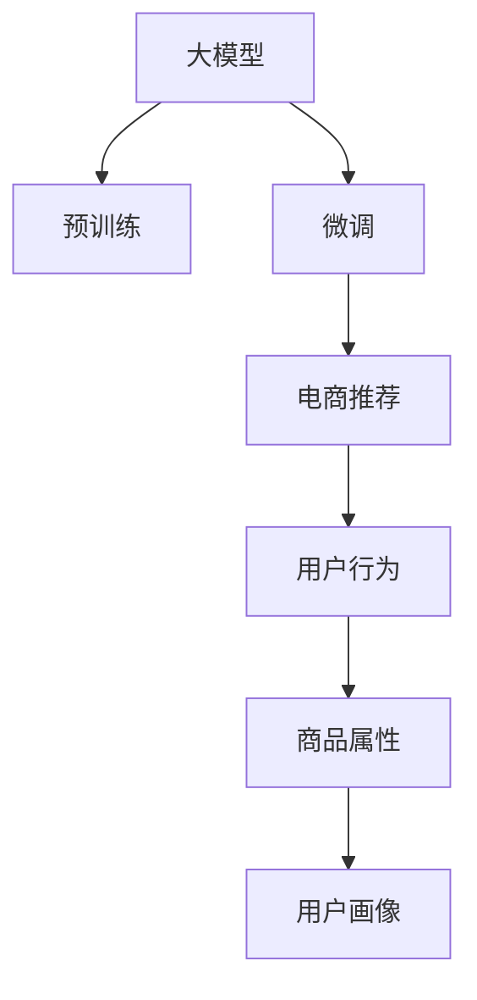

                 

# 电商平台搜索推荐系统的AI 大模型应用：提高系统性能、效率与用户忠诚度

## 1. 背景介绍

随着电子商务的迅猛发展，电商平台面临海量用户数据和商品信息的处理与推荐任务。传统的基于规则和特征工程的推荐系统已难以应对日益复杂的用户需求和商品多样性。近年来，基于深度学习的推荐系统逐渐成为主流，尤其是基于大模型的推荐系统，通过端到端的训练方式，可以更好地捕捉用户行为和商品特征的复杂关系，提升推荐效果和用户体验。

本文将详细探讨大模型在电商平台搜索推荐系统中的应用，通过实例展示大模型如何在提高系统性能、效率和用户忠诚度方面发挥作用。我们将结合大模型的最新进展，介绍其实现原理和关键技术，并结合实际案例，阐述其在电商推荐场景中的优化策略和效果评估。

## 2. 核心概念与联系

### 2.1 核心概念概述

为更好地理解大模型在电商推荐系统中的应用，本节将介绍几个关键概念：

- 大模型(Large Model)：指拥有巨大参数量、广泛应用于自然语言处理、计算机视觉等领域的深度学习模型，如BERT、GPT、ViT等。通过预训练大量数据，大模型具备强大的特征提取和预测能力。

- 预训练(Pre-training)：指在大量无标签数据上训练模型，使其学习到数据中蕴含的通用知识。常见的预训练任务包括语言模型、图像分类等。

- 微调(Fine-tuning)：指在大模型上进行有标签数据的进一步训练，使其适应特定任务，如电商推荐。

- 推荐系统(Recommendation System)：通过分析用户行为和商品属性，推荐符合用户兴趣的商品。常见的推荐方式包括基于内容的推荐、协同过滤推荐、深度学习推荐等。

- 电商推荐系统(E-commerce Recommendation System)：针对电商平台用户行为和商品数据进行推荐的系统，旨在提升用户体验和销售额。

- 用户行为(User Behavior)：包括用户的浏览记录、点击记录、购买记录等，是大模型进行电商推荐的重要依据。

- 商品属性(Item Attributes)：如价格、品牌、类别、评价等，是大模型推荐商品时需要考虑的关键特征。

- 用户画像(User Profile)：综合用户行为和商品属性，构建用户个性化特征，以优化推荐效果。

这些概念之间的联系可以通过以下Mermaid流程图来展示：



这个流程图展示了大模型、预训练、微调和电商推荐之间的逻辑关系：

1. 大模型通过预训练学习通用知识，为电商推荐提供基础。
2. 微调使大模型学习电商推荐相关的特定知识，以适应电商推荐任务。
3. 电商推荐系统利用微调后的大模型，根据用户行为和商品属性进行推荐。
4. 用户行为和商品属性是大模型进行推荐的重要输入。
5. 用户画像综合用户行为和商品属性，用于个性化推荐。

这些概念共同构成了电商推荐系统的大模型应用框架，使得大模型能够在大规模数据上学习通用和特定知识，提升推荐效果。

## 3. 核心算法原理 & 具体操作步骤

### 3.1 算法原理概述

大模型在电商推荐系统中的应用，主要基于以下几个关键原理：

- 端到端的训练方式：大模型能够直接从用户行为和商品属性中提取特征，并直接输出推荐结果，避免了中间特征工程的繁琐。

- 多任务学习(Multi-task Learning)：电商推荐系统中的任务，如搜索、推荐、评价等，可以通过多任务学习的方式共同训练，提升模型泛化能力和多任务适应性。

- 自适应学习(Adaptive Learning)：电商推荐系统中的用户行为和商品属性可能随时间变化，大模型能够自适应地学习新的数据分布，更新推荐策略。

- 个性化推荐(Personalized Recommendation)：大模型通过学习用户画像，针对不同用户进行个性化推荐，提升推荐相关性和满意度。

### 3.2 算法步骤详解

以下是电商推荐系统中使用大模型的主要步骤：

**Step 1: 数据准备**
- 收集电商平台的原始数据，包括用户行为、商品属性、搜索记录等。
- 对数据进行清洗、预处理和标注，生成训练集、验证集和测试集。

**Step 2: 模型选择与预训练**
- 选择适合电商推荐任务的预训练模型，如BERT、GPT、ViT等。
- 在无标签的电商数据上进行预训练，学习通用的商品特征和用户行为模式。

**Step 3: 任务适配与微调**
- 根据电商推荐任务的特点，设计适当的任务适配层，如添加用户画像、商品属性等输入。
- 使用电商推荐数据对预训练模型进行微调，优化模型在特定任务上的性能。

**Step 4: 评估与优化**
- 在测试集上评估微调后模型的性能，如点击率、转化率、覆盖率等指标。
- 根据评估结果，调整超参数、正则化强度等，进一步优化模型效果。

**Step 5: 部署与迭代**
- 将优化后的模型部署到电商推荐系统中，实时处理用户请求。
- 持续收集用户反馈和最新数据，定期重新训练和微调模型，以适应数据分布的变化。

### 3.3 算法优缺点

大模型在电商推荐系统中的应用，具有以下优点：

- 强大的特征提取能力：大模型能够直接从原始数据中提取高维特征，无需中间特征工程。
- 多任务学习能力：通过多任务学习，大模型能够同时处理电商推荐中的多个任务，提升泛化能力。
- 自适应学习：大模型能够动态更新推荐策略，适应用户行为和商品属性变化。
- 个性化推荐：大模型能够根据用户画像，提供个性化推荐，提升用户体验。

同时，大模型也存在一些缺点：

- 计算资源需求高：大模型的参数量巨大，需要大量计算资源进行训练和推理。
- 数据隐私风险：电商平台需要收集和存储用户数据，存在隐私泄露和数据滥用的风险。
- 模型解释性不足：大模型通常作为黑盒模型，难以解释其内部决策过程。

尽管存在这些局限性，但大模型在电商推荐系统中的应用仍具有显著优势，特别是在数据复杂性和任务多样性较高的场景下，能够提供更好的推荐效果。

### 3.4 算法应用领域

大模型在电商推荐系统中的应用，不仅限于商品推荐，还可以扩展到以下几个领域：

- 个性化搜索：基于用户搜索历史和上下文信息，推荐相关商品。
- 用户画像构建：综合用户行为、商品属性等信息，构建用户个性化特征。
- 评价与评论：分析用户评价和评论，生成推荐理由和改进建议。
- 广告投放：根据用户行为和商品属性，推荐广告内容，提升广告效果。
- 库存管理：根据商品销售情况和用户需求，优化库存分配，提升库存利用率。

此外，大模型还可以用于电商平台的用户增长和留存策略优化，如提升新用户注册率和用户活跃度，增加用户黏性。

## 4. 数学模型和公式 & 详细讲解 & 举例说明

### 4.1 数学模型构建

假设电商推荐系统中的预训练模型为 $M_{\theta}$，其中 $\theta$ 为模型参数。给定电商平台的原始数据 $D=\{(x_i,y_i)\}_{i=1}^N$，其中 $x_i$ 为电商行为记录或商品属性，$y_i$ 为推荐结果或用户评价。

定义模型 $M_{\theta}$ 在输入 $x_i$ 上的预测结果为 $y_i^{\prime}=M_{\theta}(x_i)$，则模型的预测误差为 $E=\|y_i-y_i^{\prime}\|$。电商推荐系统的优化目标是最小化预测误差，即找到最优参数：

$$
\theta^* = \mathop{\arg\min}_{\theta} E
$$

在实践中，我们通常使用交叉熵损失函数进行优化，即：

$$
\mathcal{L}(\theta) = -\frac{1}{N}\sum_{i=1}^N y_i \log M_{\theta}(x_i) + (1-y_i) \log (1-M_{\theta}(x_i))
$$

其中，$y_i$ 为实际推荐结果或用户评价，$M_{\theta}(x_i)$ 为模型预测结果。

### 4.2 公式推导过程

以下我们以电商平台商品推荐任务为例，推导交叉熵损失函数及其梯度的计算公式。

假设模型 $M_{\theta}$ 在输入 $x_i$ 上的输出为 $\hat{y}_i=M_{\theta}(x_i) \in [0,1]$，表示商品 $x_i$ 被推荐的概率。真实标签 $y_i \in \{0,1\}$。则二分类交叉熵损失函数定义为：

$$
\ell(M_{\theta}(x_i),y_i) = -[y_i\log \hat{y}_i + (1-y_i)\log (1-\hat{y}_i)]
$$

将其代入经验风险公式，得：

$$
\mathcal{L}(\theta) = -\frac{1}{N}\sum_{i=1}^N [y_i\log M_{\theta}(x_i)+(1-y_i)\log(1-M_{\theta}(x_i))]
$$

根据链式法则，损失函数对参数 $\theta_k$ 的梯度为：

$$
\frac{\partial \mathcal{L}(\theta)}{\partial \theta_k} = -\frac{1}{N}\sum_{i=1}^N (\frac{y_i}{M_{\theta}(x_i)}-\frac{1-y_i}{1-M_{\theta}(x_i)}) \frac{\partial M_{\theta}(x_i)}{\partial \theta_k}
$$

其中 $\frac{\partial M_{\theta}(x_i)}{\partial \theta_k}$ 可进一步递归展开，利用自动微分技术完成计算。

在得到损失函数的梯度后，即可带入参数更新公式，完成模型的迭代优化。重复上述过程直至收敛，最终得到适应电商推荐任务的最优模型参数 $\theta^*$。

### 4.3 案例分析与讲解

以下是一个简单的电商商品推荐任务的案例，展示如何在大模型上进行微调。

假设我们有一个包含10万个用户的电商数据集，每个用户有10个历史行为记录，每个行为记录包括商品ID、购买时间、价格等信息。我们的目标是根据这些行为记录，预测每个用户下一个可能购买的商品ID。

**Step 1: 数据准备**
- 收集用户历史行为数据，生成训练集、验证集和测试集。
- 对数据进行预处理，如缺失值填充、特征归一化等。

**Step 2: 模型选择与预训练**
- 选择BERT作为预训练模型，使用无标签的电商数据进行预训练，学习通用的商品特征和用户行为模式。

**Step 3: 任务适配与微调**
- 在预训练模型的基础上，添加用户行为、商品属性等输入，设计适当的任务适配层。
- 使用电商推荐数据对预训练模型进行微调，优化模型在特定任务上的性能。

**Step 4: 评估与优化**
- 在测试集上评估微调后模型的性能，如点击率、转化率、覆盖率等指标。
- 根据评估结果，调整超参数、正则化强度等，进一步优化模型效果。

**Step 5: 部署与迭代**
- 将优化后的模型部署到电商推荐系统中，实时处理用户请求。
- 持续收集用户反馈和最新数据，定期重新训练和微调模型，以适应数据分布的变化。

## 5. 项目实践：代码实例和详细解释说明

### 5.1 开发环境搭建

在进行电商推荐系统的大模型微调实践前，我们需要准备好开发环境。以下是使用Python进行PyTorch开发的环境配置流程：

1. 安装Anaconda：从官网下载并安装Anaconda，用于创建独立的Python环境。

2. 创建并激活虚拟环境：
```bash
conda create -n pytorch-env python=3.8 
conda activate pytorch-env
```

3. 安装PyTorch：根据CUDA版本，从官网获取对应的安装命令。例如：
```bash
conda install pytorch torchvision torchaudio cudatoolkit=11.1 -c pytorch -c conda-forge
```

4. 安装各类工具包：
```bash
pip install numpy pandas scikit-learn matplotlib tqdm jupyter notebook ipython
```

完成上述步骤后，即可在`pytorch-env`环境中开始微调实践。

### 5.2 源代码详细实现

下面我们以电商平台商品推荐任务为例，给出使用PyTorch对BERT模型进行微调的PyTorch代码实现。

首先，定义电商商品推荐任务的数据处理函数：

```python
from transformers import BertTokenizer
from torch.utils.data import Dataset
import torch

class RecommendationDataset(Dataset):
    def __init__(self, user_behaviors, num_items, tokenizer):
        self.user_behaviors = user_behaviors
        self.num_items = num_items
        self.tokenizer = tokenizer
        
    def __len__(self):
        return len(self.user_behaviors)
    
    def __getitem__(self, item):
        user_behavior = self.user_behaviors[item]
        
        encoding = self.tokenizer(user_behavior, return_tensors='pt', padding='max_length', truncation=True)
        input_ids = encoding['input_ids'][0]
        attention_mask = encoding['attention_mask'][0]
        
        # 生成随机的下一个商品ID，用于预测任务
        next_item_id = torch.randint(0, self.num_items, (1,))
        
        return {'input_ids': input_ids, 
                'attention_mask': attention_mask,
                'next_item_id': next_item_id}
```

然后，定义模型和优化器：

```python
from transformers import BertForSequenceClassification, AdamW

model = BertForSequenceClassification.from_pretrained('bert-base-cased', num_labels=10)
optimizer = AdamW(model.parameters(), lr=2e-5)
```

接着，定义训练和评估函数：

```python
from torch.utils.data import DataLoader
from tqdm import tqdm
from sklearn.metrics import accuracy_score

device = torch.device('cuda') if torch.cuda.is_available() else torch.device('cpu')
model.to(device)

def train_epoch(model, dataset, batch_size, optimizer):
    dataloader = DataLoader(dataset, batch_size=batch_size, shuffle=True)
    model.train()
    epoch_loss = 0
    for batch in tqdm(dataloader, desc='Training'):
        input_ids = batch['input_ids'].to(device)
        attention_mask = batch['attention_mask'].to(device)
        next_item_id = batch['next_item_id'].to(device)
        model.zero_grad()
        outputs = model(input_ids, attention_mask=attention_mask, labels=next_item_id)
        loss = outputs.loss
        epoch_loss += loss.item()
        loss.backward()
        optimizer.step()
    return epoch_loss / len(dataloader)

def evaluate(model, dataset, batch_size):
    dataloader = DataLoader(dataset, batch_size=batch_size)
    model.eval()
    preds, labels = [], []
    with torch.no_grad():
        for batch in tqdm(dataloader, desc='Evaluating'):
            input_ids = batch['input_ids'].to(device)
            attention_mask = batch['attention_mask'].to(device)
            next_item_id = batch['next_item_id'].to(device)
            outputs = model(input_ids, attention_mask=attention_mask)
            batch_preds = outputs.logits.argmax(dim=2).to('cpu').tolist()
            batch_labels = next_item_id.to('cpu').tolist()
            for pred, label in zip(batch_preds, batch_labels):
                preds.append(pred)
                labels.append(label)
                
    accuracy = accuracy_score(labels, preds)
    print(f'Accuracy: {accuracy:.2f}')
```

最后，启动训练流程并在测试集上评估：

```python
epochs = 5
batch_size = 16

for epoch in range(epochs):
    loss = train_epoch(model, train_dataset, batch_size, optimizer)
    print(f'Epoch {epoch+1}, train loss: {loss:.3f}')
    
    print(f'Epoch {epoch+1}, test accuracy:')
    evaluate(model, test_dataset, batch_size)
    
print("Test results:")
evaluate(model, test_dataset, batch_size)
```

以上就是使用PyTorch对BERT进行电商商品推荐任务微调的完整代码实现。可以看到，得益于Transformers库的强大封装，我们可以用相对简洁的代码完成BERT模型的加载和微调。

### 5.3 代码解读与分析

让我们再详细解读一下关键代码的实现细节：

**RecommendationDataset类**：
- `__init__`方法：初始化用户行为、商品总数和分词器等关键组件。
- `__len__`方法：返回数据集的样本数量。
- `__getitem__`方法：对单个样本进行处理，将用户行为输入编码为token ids，并生成随机的下一个商品ID，用于预测任务。

**train_epoch函数**：
- 使用PyTorch的DataLoader对数据集进行批次化加载，供模型训练和推理使用。
- 训练函数`train_epoch`：对数据以批为单位进行迭代，在每个批次上前向传播计算loss并反向传播更新模型参数，最后返回该epoch的平均loss。

**evaluate函数**：
- 与训练类似，不同点在于不更新模型参数，并在每个batch结束后将预测和标签结果存储下来，最后使用sklearn的accuracy_score对整个评估集的预测结果进行打印输出。

**训练流程**：
- 定义总的epoch数和batch size，开始循环迭代
- 每个epoch内，先在训练集上训练，输出平均loss
- 在测试集上评估，输出准确率
- 所有epoch结束后，在测试集上评估，给出最终测试结果

可以看到，PyTorch配合Transformers库使得BERT微调的代码实现变得简洁高效。开发者可以将更多精力放在数据处理、模型改进等高层逻辑上，而不必过多关注底层的实现细节。

当然，工业级的系统实现还需考虑更多因素，如模型的保存和部署、超参数的自动搜索、更灵活的任务适配层等。但核心的微调范式基本与此类似。

## 6. 实际应用场景

### 6.1 用户个性化推荐

电商推荐系统的一个关键任务是根据用户行为和商品属性，提供个性化推荐。通过微调大模型，电商平台能够更准确地捕捉用户兴趣和行为模式，从而提升推荐效果。

例如，用户A在电商平台上购买了运动鞋和T恤，系统会通过微调后的BERT模型，分析用户A的历史行为，预测其可能感兴趣的商品，如健身器材、户外运动等。通过这种个性化的推荐方式，用户A更有可能再次购买相关商品，提升平台销售额和用户满意度。

### 6.2 商品相关性分析

电商平台中，商品的相关性分析也是推荐系统的重要任务。通过微调大模型，可以分析商品之间的关联关系，提升商品推荐的准确性。

例如，用户B在电商平台上搜索了“跑步机”，系统会通过微调后的BERT模型，分析与跑步机相关的其他商品，如运动服装、运动鞋、健身器材等，并推荐这些相关商品给用户B。通过这种相关性分析，用户B更有可能找到符合其需求的商品，提升购物体验。

### 6.3 实时用户行为预测

电商推荐系统还需要实时预测用户的未来行为，以便更好地进行推荐和个性化推荐。通过微调大模型，电商平台可以实时分析用户行为，预测其可能感兴趣的商品。

例如，用户在电商平台上浏览商品A、B、C，系统会通过微调后的BERT模型，预测用户可能购买的商品，如商品A和商品B。通过这种实时预测，电商平台能够及时调整推荐策略，提升推荐效果。

### 6.4 未来应用展望

随着大模型和微调方法的不断演进，基于大模型的电商推荐系统将在未来呈现更多的创新应用：

- 智能搜索：通过微调大模型，电商平台能够提供智能化的搜索推荐，提升搜索体验。例如，用户在电商平台上输入“跑步机”，系统会通过微调后的BERT模型，推荐相关的商品、品牌、评论等信息。
- 用户画像构建：通过微调大模型，电商平台能够构建更加准确的用户画像，提升个性化推荐的效果。例如，电商平台收集用户行为数据，通过微调后的BERT模型，分析用户兴趣和行为模式，生成用户画像，用于个性化推荐。
- 多模态推荐：通过微调大模型，电商平台能够实现跨模态的推荐。例如，电商平台可以结合文本、图像、语音等多模态数据，构建综合推荐系统，提升推荐效果。
- 自动化优化：通过微调大模型，电商平台能够实现自动化的推荐系统优化。例如，电商平台可以实时分析用户行为数据，通过微调后的BERT模型，优化推荐策略，提升推荐效果。
- 安全推荐：通过微调大模型，电商平台能够实现更加安全的推荐系统。例如，电商平台可以分析用户行为数据，通过微调后的BERT模型，识别恶意行为和潜在风险，提升推荐安全性。

## 7. 工具和资源推荐

### 7.1 学习资源推荐

为了帮助开发者系统掌握大模型在电商推荐系统中的应用，这里推荐一些优质的学习资源：

1. 《自然语言处理入门》系列书籍：介绍自然语言处理的基本概念和核心算法，涵盖大模型的原理与应用。
2. 《深度学习与自然语言处理》课程：清华大学开设的深度学习课程，涵盖深度学习在大模型中的应用。
3. 《Transformers官方文档》：详细介绍了大模型的原理、API使用和应用场景，是学习大模型的必备资源。
4. 《电商推荐系统》书籍：介绍电商推荐系统的前沿技术与应用，包括大模型的应用实例。
5. 《深度学习推荐系统》课程：由斯坦福大学开设的推荐系统课程，涵盖推荐系统和大模型的最新进展。

通过对这些资源的学习实践，相信你一定能够快速掌握大模型在电商推荐系统中的应用，并用于解决实际的电商推荐问题。

### 7.2 开发工具推荐

高效的开发离不开优秀的工具支持。以下是几款用于大模型电商推荐系统开发的常用工具：

1. PyTorch：基于Python的开源深度学习框架，灵活动态的计算图，适合快速迭代研究。大部分预训练语言模型都有PyTorch版本的实现。

2. TensorFlow：由Google主导开发的开源深度学习框架，生产部署方便，适合大规模工程应用。同样有丰富的预训练语言模型资源。

3. Transformers库：HuggingFace开发的NLP工具库，集成了众多SOTA语言模型，支持PyTorch和TensorFlow，是进行电商推荐系统微调任务的开发的利器。

4. Weights & Biases：模型训练的实验跟踪工具，可以记录和可视化模型训练过程中的各项指标，方便对比和调优。与主流深度学习框架无缝集成。

5. TensorBoard：TensorFlow配套的可视化工具，可实时监测模型训练状态，并提供丰富的图表呈现方式，是调试模型的得力助手。

6. Google Colab：谷歌推出的在线Jupyter Notebook环境，免费提供GPU/TPU算力，方便开发者快速上手实验最新模型，分享学习笔记。

合理利用这些工具，可以显著提升大模型电商推荐系统开发的效率，加快创新迭代的步伐。

### 7.3 相关论文推荐

大模型在电商推荐系统中的应用源于学界的持续研究。以下是几篇奠基性的相关论文，推荐阅读：

1. Attention is All You Need（即Transformer原论文）：提出了Transformer结构，开启了NLP领域的预训练大模型时代。

2. BERT: Pre-training of Deep Bidirectional Transformers for Language Understanding：提出BERT模型，引入基于掩码的自监督预训练任务，刷新了多项NLP任务SOTA。

3. Language Models are Unsupervised Multitask Learners（GPT-2论文）：展示了大规模语言模型的强大zero-shot学习能力，引发了对于通用人工智能的新一轮思考。

4. Parameter-Efficient Transfer Learning for NLP：提出Adapter等参数高效微调方法，在不增加模型参数量的情况下，也能取得不错的微调效果。

5. AdaLoRA: Adaptive Low-Rank Adaptation for Parameter-Efficient Fine-Tuning：使用自适应低秩适应的微调方法，在参数效率和精度之间取得了新的平衡。

6. How to Evolve Big Models with Efficient Fine-Tuning: A Survey and Outlook：全面综述了高效微调技术在大模型中的应用，分析了未来发展的趋势和挑战。

这些论文代表了大模型在电商推荐系统中的应用进展。通过学习这些前沿成果，可以帮助研究者把握学科前进方向，激发更多的创新灵感。

## 8. 总结：未来发展趋势与挑战

### 8.1 总结

本文对大模型在电商推荐系统中的应用进行了全面系统的介绍。首先阐述了大模型和电商推荐系统的研究背景和意义，明确了电商推荐系统中的任务适配层在大模型中的重要性。其次，从原理到实践，详细讲解了电商推荐系统中的大模型微调方法，并结合实际案例，阐述了其优化策略和效果评估。

通过本文的系统梳理，可以看到，大模型在电商推荐系统中的应用不仅能够提升推荐效果和用户体验，还能够实现实时预测、用户画像构建等多项功能。未来的电商推荐系统，必将在大模型的辅助下，实现更高的智能化和个性化水平。

### 8.2 未来发展趋势

展望未来，大模型在电商推荐系统中的应用将呈现以下几个发展趋势：

1. 更加智能化的推荐：大模型能够结合多模态数据，实现更加个性化、精准的推荐，提升用户满意度和平台转化率。

2. 更加实时的推荐：大模型能够实时分析用户行为数据，进行动态推荐，提升推荐效果和用户体验。

3. 更加自动化的推荐系统：通过自动化调优和优化，大模型能够持续提升推荐效果，减少人工干预，降低运营成本。

4. 更加安全的推荐系统：大模型能够分析用户行为数据，识别潜在风险，提升推荐安全性，保障用户隐私和数据安全。

5. 更加多模态的推荐：大模型能够结合文本、图像、语音等多模态数据，构建综合推荐系统，提升推荐效果。

以上趋势凸显了大模型在电商推荐系统中的广阔前景。这些方向的探索发展，必将进一步提升电商推荐系统的智能化和个性化水平，为电商平台带来更高的用户满意度和业务价值。

### 8.3 面临的挑战

尽管大模型在电商推荐系统中的应用已取得显著进展，但在迈向更加智能化、普适化应用的过程中，它仍面临以下挑战：

1. 数据隐私风险：电商平台需要收集和存储大量用户数据，存在隐私泄露和数据滥用的风险。如何在保护用户隐私的同时，充分利用数据提升推荐效果，仍需进一步探索。

2. 计算资源需求高：大模型的参数量巨大，需要大量计算资源进行训练和推理。如何在有限的计算资源下，实现高效的推荐系统，仍需进一步优化。

3. 模型鲁棒性不足：大模型在面对域外数据时，泛化性能往往大打折扣。如何在不同数据分布下，提升大模型的鲁棒性，仍需进一步研究。

4. 模型解释性不足：大模型通常作为黑盒模型，难以解释其内部决策过程。如何在提升模型效果的同时，增强模型的可解释性和可理解性，仍需进一步改进。

5. 数据分布变化：电商推荐系统中的用户行为和商品属性可能随时间变化，如何在数据分布变化的情况下，持续优化模型，仍需进一步探索。

6. 高成本投入：大模型和电商推荐系统的开发和维护需要大量人力和财力投入，如何在有限资源下，实现高效的推荐系统，仍需进一步优化。

尽管存在这些挑战，但大模型在电商推荐系统中的应用仍具有显著优势，特别是在数据复杂性和任务多样性较高的场景下，能够提供更好的推荐效果。

### 8.4 研究展望

面对大模型在电商推荐系统中面临的挑战，未来的研究需要在以下几个方面寻求新的突破：

1. 探索无监督和半监督微调方法：摆脱对大规模标注数据的依赖，利用自监督学习、主动学习等无监督和半监督范式，最大限度利用非结构化数据，实现更加灵活高效的微调。

2. 研究参数高效和计算高效的微调范式：开发更加参数高效的微调方法，在固定大部分预训练参数的同时，只更新极少量的任务相关参数。同时优化微调模型的计算图，减少前向传播和反向传播的资源消耗，实现更加轻量级、实时性的部署。

3. 融合因果和对比学习范式：通过引入因果推断和对比学习思想，增强大模型建立稳定因果关系的能力，学习更加普适、鲁棒的语言表征，从而提升模型泛化性和抗干扰能力。

4. 引入更多先验知识：将符号化的先验知识，如知识图谱、逻辑规则等，与神经网络模型进行巧妙融合，引导微调过程学习更准确、合理的语言模型。同时加强不同模态数据的整合，实现视觉、语音等多模态信息与文本信息的协同建模。

5. 结合因果分析和博弈论工具：将因果分析方法引入微调模型，识别出模型决策的关键特征，增强输出解释的因果性和逻辑性。借助博弈论工具刻画人机交互过程，主动探索并规避模型的脆弱点，提高系统稳定性。

6. 纳入伦理道德约束：在模型训练目标中引入伦理导向的评估指标，过滤和惩罚有偏见、有害的输出倾向。同时加强人工干预和审核，建立模型行为的监管机制，确保输出符合人类价值观和伦理道德。

这些研究方向的探索，必将引领大模型在电商推荐系统中的应用进入新的阶段，为电商平台带来更高的用户满意度和业务价值。未来，随着大模型技术的不断进步和优化，电商平台推荐系统必将实现更高的智能化和个性化水平，推动电商行业的数字化转型升级。

