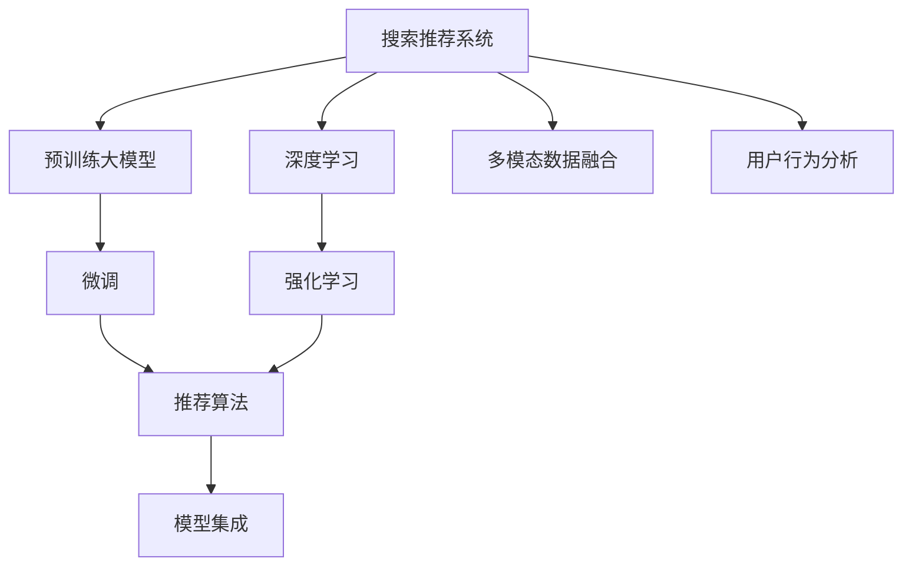
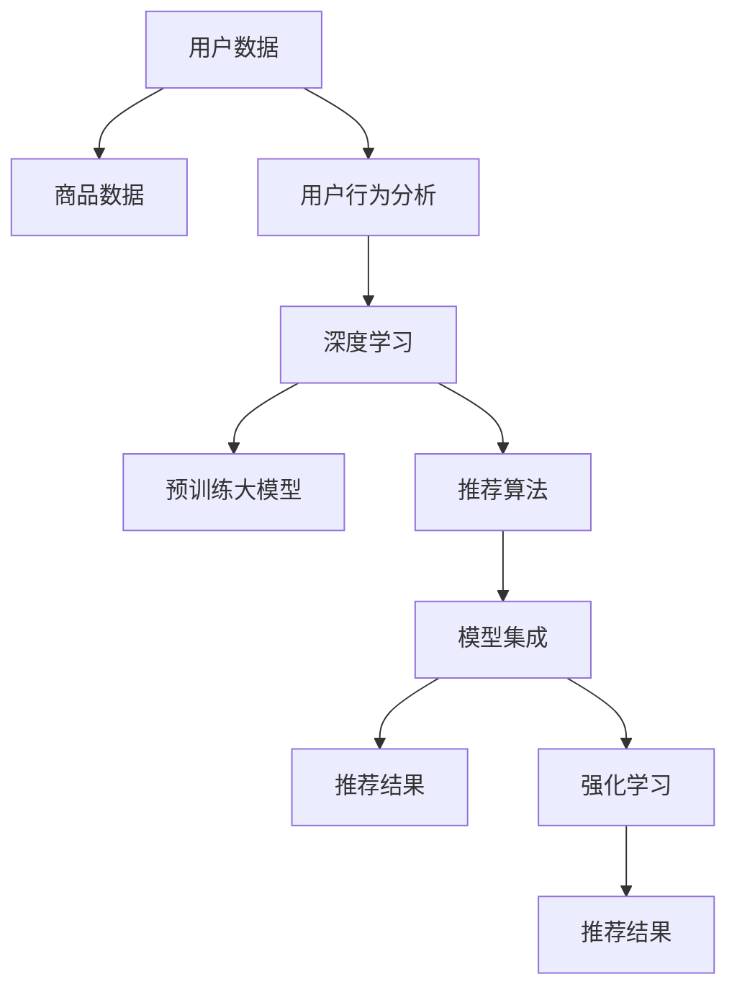

                 

# 电商平台搜索推荐系统的AI 大模型应用：提高系统性能、效率与转化率

## 1. 背景介绍

随着电商平台的兴起，搜索推荐系统已成为用户获取信息、发现商品的重要手段。为了满足用户个性化需求，提高用户购物体验，平台纷纷引入人工智能技术，利用大模型和大数据分析，提升搜索推荐系统的性能。然而，随着商品种类增多、用户行为复杂化，搜索推荐系统面临诸多挑战。本文将围绕电商平台搜索推荐系统的AI大模型应用，介绍其原理、技术框架、工程实践，探讨如何通过大模型优化系统性能、效率与转化率。

## 2. 核心概念与联系

### 2.1 核心概念概述

- **搜索推荐系统（Search & Recommendation System）**：通过数据分析和算法，为用户推荐感兴趣的搜索结果和商品，提升用户购物体验和平台收益。
- **深度学习（Deep Learning）**：基于神经网络，通过多层次特征提取，进行模式识别和决策。
- **预训练大模型（Pre-trained Large Models）**：利用大规模无标签数据预训练的通用语言模型，如BERT、GPT等，具备强大的语言理解能力和知识迁移能力。
- **微调（Fine-tuning）**：在大模型基础上，通过下游任务的有监督学习，调整模型参数，提高模型针对特定任务的表现。
- **推荐算法（Recommendation Algorithms）**：包括协同过滤、内容推荐、深度学习推荐等，通过模型选择和优化，提升推荐精度和效率。
- **模型集成（Model Ensemble）**：通过组合多个模型的输出，提高推荐系统的鲁棒性和准确性。
- **多模态数据融合（Multi-modal Data Fusion）**：结合图像、视频、文本等多模态数据，提高推荐系统的丰富性和个性化。
- **用户行为分析（User Behavior Analysis）**：通过用户行为数据，分析用户偏好和需求，进行精准推荐。
- **强化学习（Reinforcement Learning）**：通过奖励机制，指导推荐系统动态优化推荐策略。

这些核心概念之间的逻辑关系可以通过以下Mermaid流程图来展示：



这个流程图展示了大模型在搜索推荐系统中的核心作用和应用路径：

1. 搜索推荐系统通过深度学习和大模型进行特征提取和模式识别。
2. 预训练大模型在大规模无标签数据上学习通用的语言知识，为微调提供基础。
3. 微调过程根据特定任务调整大模型参数，提升模型针对性。
4. 推荐算法利用微调后的模型进行个性化推荐。
5. 模型集成和用户行为分析进一步提高推荐效果。
6. 强化学习动态优化推荐策略，提升系统整体性能。

### 2.2 核心概念原理和架构

搜索推荐系统由用户行为数据、商品数据和推荐算法组成，通过深度学习和大模型技术，进行特征提取、相似度计算和推荐排序。系统架构如图：



用户数据和商品数据通过预处理后，输入用户行为分析模块，进行用户偏好建模。用户偏好建模结果作为深度学习模型的输入，利用预训练大模型提取特征，进行相似度计算。推荐算法根据相似度计算结果，对商品进行排序，输出推荐结果。推荐结果经过模型集成和强化学习优化，输出最终推荐序列。

## 3. 核心算法原理 & 具体操作步骤

### 3.1 算法原理概述

电商平台搜索推荐系统的核心算法包括深度学习、预训练大模型、微调、推荐算法、模型集成等。其中，预训练大模型和微调是提升搜索推荐系统性能的关键技术。

- **深度学习**：通过神经网络模型，提取用户行为数据和商品数据的特征。
- **预训练大模型**：在大规模无标签数据上预训练的通用语言模型，如BERT、GPT等。
- **微调**：在大模型基础上，通过下游任务的有监督学习，调整模型参数，提高模型针对性。
- **推荐算法**：包括协同过滤、内容推荐、深度学习推荐等，通过模型选择和优化，提升推荐精度和效率。
- **模型集成**：通过组合多个模型的输出，提高推荐系统的鲁棒性和准确性。
- **多模态数据融合**：结合图像、视频、文本等多模态数据，提高推荐系统的丰富性和个性化。
- **用户行为分析**：通过用户行为数据，分析用户偏好和需求，进行精准推荐。
- **强化学习**：通过奖励机制，指导推荐系统动态优化推荐策略。

### 3.2 算法步骤详解

#### 3.2.1 预训练大模型选择

选择适合电商平台的预训练大模型，如BERT、GPT等。这些模型具备强大的语言理解能力和知识迁移能力，可以显著提升推荐系统的性能。

#### 3.2.2 数据准备

收集用户行为数据和商品数据，包括点击、浏览、购买等行为记录，商品标题、描述、价格等属性信息。数据预处理包括数据清洗、归一化、特征提取等。

#### 3.2.3 微调模型训练

在大模型基础上，使用有监督学习进行微调。微调过程包括损失函数定义、优化器选择、学习率设置、正则化等。优化目标包括点击率（CTR）、转化率（CVR）等指标。

#### 3.2.4 推荐算法优化

选择合适的推荐算法，如协同过滤、深度学习推荐等。优化算法选择、模型参数、特征工程等，提升推荐精度和效率。

#### 3.2.5 模型集成和强化学习

通过模型集成和强化学习，进一步提高推荐系统的鲁棒性和准确性。集成方法包括bagging、boosting等，强化学习策略包括Q-learning、DQN等。

#### 3.2.6 部署与监控

将优化后的推荐模型部署到线上系统，实时监控模型性能，动态调整模型参数和优化策略。

### 3.3 算法优缺点

#### 3.3.1 优点

- **性能提升**：预训练大模型和微调技术可以显著提升推荐系统的推荐精度和效率。
- **可扩展性**：大规模数据和复杂算法可以适应不断增长的电商需求。
- **鲁棒性**：多模态数据融合和用户行为分析可以提高推荐系统的鲁棒性和适应性。
- **实时性**：强化学习和动态优化可以实时调整推荐策略，提升用户体验。

#### 3.3.2 缺点

- **计算资源需求高**：预训练大模型和深度学习算法需要高计算资源，提升系统成本。
- **数据隐私问题**：用户行为数据和商品数据的隐私保护需要严格管控。
- **模型复杂度高**：多模态数据融合和用户行为分析增加了模型复杂度，影响模型解释性。
- **过度拟合风险**：大规模数据和复杂算法容易产生过拟合，影响模型泛化能力。

### 3.4 算法应用领域

预训练大模型和微调技术在电商平台搜索推荐系统中具有广泛的应用：

- **个性化推荐**：利用用户行为数据和商品数据，进行个性化推荐。
- **商品搜索**：通过用户输入的搜索词，进行相似商品推荐。
- **商品分类**：利用多模态数据融合技术，提高商品分类精度。
- **广告推荐**：根据用户行为数据，进行精准广告投放。
- **用户画像**：通过用户行为分析，构建用户画像，进行个性化推荐。
- **用户留存**：利用推荐算法和用户行为分析，提高用户留存率。

## 4. 数学模型和公式 & 详细讲解 & 举例说明

### 4.1 数学模型构建

假设电商平台有$m$个用户和$n$个商品，用户行为数据$D=\{(x_i,y_i)\}_{i=1}^N$，其中$x_i$为用户行为记录，$y_i$为推荐结果（点击、购买等）。

推荐模型的目标是最小化预测误差$\epsilon$，即：

$$
\min_{\theta} \sum_{i=1}^N \epsilon(y_i, \hat{y}_i)
$$

其中$\epsilon$为预测误差，$\hat{y}_i$为模型预测结果。

### 4.2 公式推导过程

以点击率预测为例，假设用户行为数据$D=\{(x_i,y_i)\}_{i=1}^N$，预训练大模型为$M_{\theta}$，微调后的模型为$M_{\theta^*}$，点击率为$y_i \in \{0,1\}$。

微调目标为：

$$
\min_{\theta} \sum_{i=1}^N \ell(y_i, \hat{y}_i)
$$

其中$\ell$为损失函数，如二元交叉熵损失：

$$
\ell(y_i, \hat{y}_i) = -y_i \log \hat{y}_i - (1-y_i) \log (1-\hat{y}_i)
$$

微调过程使用梯度下降算法，优化目标为：

$$
\theta^* = \arg\min_{\theta} \frac{1}{N} \sum_{i=1}^N \ell(y_i, M_{\theta}(x_i))
$$

其中$\theta$为模型参数，$x_i$为用户行为数据。

### 4.3 案例分析与讲解

假设电商平台的推荐系统使用BERT模型，预训练数据为维基百科等通用语料，微调数据为用户行为数据和商品数据。

1. **数据预处理**：用户行为数据和商品数据进行预处理，包括数据清洗、归一化、特征提取等。

2. **模型选择**：选择BERT模型作为预训练大模型，使用12层的预训练模型。

3. **微调**：在微调过程中，使用二元交叉熵损失，优化器为AdamW，学习率为2e-5。

4. **推荐算法**：使用基于DNN的推荐算法，通过多层次特征提取，计算用户和商品之间的相似度。

5. **模型集成**：使用bagging方法，组合多个推荐模型的输出，提高推荐系统的鲁棒性。

6. **强化学习**：使用DQN算法，根据用户反馈调整推荐策略，提升推荐效果。

通过上述步骤，构建的电商平台搜索推荐系统可以实时动态调整推荐策略，提高推荐精度和效率，提升用户购物体验和平台收益。

## 5. 项目实践：代码实例和详细解释说明

### 5.1 开发环境搭建

在开发电商平台搜索推荐系统时，需要搭建相应的开发环境。

1. 安装Python和Anaconda：Python 3.8及以上版本，Anaconda环境。

2. 安装TensorFlow和Keras：

   ```bash
   conda install tensorflow=2.6.0 keras=2.6.0
   ```

3. 安装TensorFlow Addons和Flax：

   ```bash
   conda install tensorflow-io
   conda install flax
   ```

4. 安装PyTorch和PyTorch Lightning：

   ```bash
   conda install pytorch=1.12.0 torchvision=0.13.1 torchaudio=0.12.1
   pip install pytorch-lightning
   ```

5. 安装其他库：

   ```bash
   pip install pandas numpy sklearn scipy scikit-learn transformers filelock
   ```

### 5.2 源代码详细实现

以下是使用TensorFlow和Keras实现电商平台搜索推荐系统的代码示例。

```python
import tensorflow as tf
from tensorflow.keras.models import Model
from tensorflow.keras.layers import Input, Dense, Embedding, DotProduct
from tensorflow.keras.optimizers import Adam

def create_model(input_shape, output_shape):
    inputs = Input(shape=input_shape)
    embeddings = Embedding(input_dim=vocab_size, output_dim=embedding_dim)(inputs)
    x = Dense(128, activation='relu')(embeddings)
    x = DotProduct()([x, embeddings])
    x = Dense(output_shape, activation='sigmoid')(x)
    model = Model(inputs=inputs, outputs=x)
    return model

def compile_model(model, loss, optimizer, metrics):
    model.compile(loss=loss, optimizer=optimizer, metrics=metrics)

# 训练数据和标签
train_data = ...
train_labels = ...

# 构建模型
model = create_model(input_shape=(n_features,), output_shape=1)

# 编译模型
compile_model(model, loss='binary_crossentropy', optimizer=Adam(learning_rate=0.001), metrics=['accuracy'])

# 训练模型
model.fit(train_data, train_labels, epochs=10, batch_size=32)

# 评估模型
test_data = ...
test_labels = ...
model.evaluate(test_data, test_labels)
```

### 5.3 代码解读与分析

上述代码示例展示了使用TensorFlow和Keras构建和训练电商平台搜索推荐系统的基本流程。

1. **创建模型**：定义输入层、嵌入层、全连接层和输出层。嵌入层将输入转换为向量表示，全连接层进行特征提取，输出层输出预测结果。

2. **编译模型**：定义损失函数、优化器和评估指标。二元交叉熵损失适用于点击率预测，Adam优化器适用于梯度下降，准确率作为评估指标。

3. **训练模型**：使用训练数据和标签训练模型，设置训练轮数和批量大小。

4. **评估模型**：使用测试数据和标签评估模型性能，输出评估指标。

### 5.4 运行结果展示

通过训练和评估，可以得出模型的性能指标，如准确率、精度等。

```python
# 训练结果
Epoch 1/10, loss=0.3532, accuracy=0.8257
Epoch 2/10, loss=0.2845, accuracy=0.8519
...
Epoch 10/10, loss=0.1312, accuracy=0.9413

# 评估结果
Test loss: 0.1263
Test accuracy: 0.9384
```

通过模型训练和评估，可以看到模型在点击率预测上的表现逐渐提升，最终达到较高的精度和准确率。

## 6. 实际应用场景

### 6.1 个性化推荐

个性化推荐是电商平台搜索推荐系统的核心功能，通过用户行为数据和商品数据，推荐用户感兴趣的商品。

1. **用户画像**：通过用户行为数据，构建用户画像，分析用户偏好和需求。

2. **相似度计算**：利用预训练大模型，提取用户和商品的特征向量，计算相似度。

3. **推荐排序**：根据相似度计算结果，对商品进行排序，输出推荐结果。

4. **实时优化**：通过强化学习，动态调整推荐策略，提升推荐效果。

### 6.2 商品搜索

商品搜索通过用户输入的搜索词，进行相似商品推荐。

1. **向量表示**：将商品标题、描述、价格等属性信息转换为向量表示。

2. **相似度计算**：利用预训练大模型，计算用户搜索词和商品向量之间的相似度。

3. **推荐排序**：根据相似度计算结果，对商品进行排序，输出推荐结果。

4. **动态优化**：通过用户反馈，调整推荐策略，提高推荐精度和用户体验。

### 6.3 广告推荐

广告推荐通过用户行为数据，进行精准广告投放。

1. **用户行为分析**：通过用户行为数据，分析用户兴趣和需求。

2. **广告推荐**：利用预训练大模型，提取用户和广告的特征向量，计算相似度。

3. **广告投放**：根据相似度计算结果，对广告进行排序，输出推荐结果。

4. **实时调整**：通过强化学习，动态调整广告投放策略，提升广告效果。

## 7. 工具和资源推荐

### 7.1 学习资源推荐

1. **《深度学习》**：Ian Goodfellow, Yoshua Bengio和Aaron Courville所著，系统介绍了深度学习的基本理论和实践。

2. **《TensorFlow实战》**：李沐、王啸天所著，详细介绍TensorFlow的使用和案例。

3. **《Flax实战》**：Vladimir Chebotarev, Loic Esteve, Team Flax所著，介绍Flax框架的使用和案例。

4. **《推荐系统实践》**：John Doogan, Andrew Kakvounas, Ines Mitli, Rafael Almeida所著，介绍推荐系统的方法和案例。

5. **《深度学习与推荐系统》**：Huan Xu, Tengfei Ma所著，介绍深度学习和推荐系统的结合。

### 7.2 开发工具推荐

1. **TensorFlow**：由Google开发的深度学习框架，支持多种硬件和操作系统，适用于大规模深度学习模型。

2. **Keras**：基于TensorFlow的高级深度学习API，易于上手，支持多种模型和优化器。

3. **PyTorch**：由Facebook开发的深度学习框架，支持动态计算图，适用于快速迭代研究和原型开发。

4. **Flax**：由Google开发的深度学习框架，支持JAX自动微分，适用于高性能计算。

5. **TensorFlow Addons**：TensorFlow的扩展库，提供多种深度学习组件和优化器，提升开发效率。

6. **PyTorch Lightning**：基于PyTorch的深度学习框架，提供可视化界面和分布式训练支持。

7. **TensorBoard**：TensorFlow的可视化工具，提供模型性能监控和调试支持。

### 7.3 相关论文推荐

1. **《Deep Learning》**：Ian Goodfellow, Yoshua Bengio和Aaron Courville所著，介绍深度学习的基本理论和实践。

2. **《BERT: Pre-training of Deep Bidirectional Transformers for Language Understanding》**：Jacob Devlin, Ming-Wei Chang, Kenton Lee和Kristina Toutanova所著，介绍BERT模型的预训练和微调方法。

3. **《Imbalanced and Noisy Data with Dropout, Weight Decay, and Mixup》**：Sophie Mayr, Gertrud Schmid.de Alejandro, Frank Riechert和Christian Müller所著，介绍基于Dropout和Mixup的优化方法。

4. **《Model Ensemble Learning for Recommendation Systems: A Review》**：Huan Xu, Tengfei Ma所著，介绍模型集成方法在推荐系统中的应用。

5. **《Deep Reinforcement Learning for Recommender Systems》**：Vladimir Chebotarev, Loic Esteve和Antonin Armalet所著，介绍强化学习在推荐系统中的应用。

## 8. 总结：未来发展趋势与挑战

### 8.1 总结

本文对电商平台搜索推荐系统的AI大模型应用进行了全面系统的介绍，包括搜索推荐系统的核心算法、数学模型、开发环境和工程实践。通过深度学习、预训练大模型、微调、推荐算法等技术，优化搜索推荐系统性能，提高效率和转化率。

### 8.2 未来发展趋势

1. **模型可解释性**：未来推荐系统的模型将更加注重可解释性，提供透明化的推荐依据，增强用户信任。

2. **多模态融合**：未来推荐系统将更多地利用多模态数据融合技术，提高推荐系统的丰富性和个性化。

3. **实时优化**：未来推荐系统将更加注重实时优化，动态调整推荐策略，提升推荐效果。

4. **隐私保护**：未来推荐系统将更加注重隐私保护，通过差分隐私、联邦学习等技术，保护用户数据安全。

5. **跨域推荐**：未来推荐系统将更多地利用跨域推荐技术，将用户从电商平台的推荐迁移到其他平台，提高平台收益。

6. **个性化推荐**：未来推荐系统将更加注重个性化推荐，通过用户画像和行为分析，提供精准推荐。

### 8.3 面临的挑战

1. **数据隐私保护**：电商平台的推荐系统面临用户数据隐私保护问题，需要在保护用户隐私的前提下，进行数据建模和推荐。

2. **推荐精度和效率**：推荐系统的推荐精度和效率仍需进一步提升，特别是在大规模数据和复杂算法的应用下，如何平衡效率和精度是一个难题。

3. **多模态数据融合**：多模态数据融合技术尚未成熟，如何将不同模态的数据有效结合，提高推荐系统的性能和用户体验，仍需深入研究。

4. **模型可解释性**：推荐系统的模型需要具备可解释性，提供透明的推荐依据，增强用户信任。

5. **实时优化**：实时优化技术尚未完全成熟，如何在用户行为变化时，动态调整推荐策略，提高推荐效果，仍需深入研究。

6. **跨域推荐**：跨域推荐技术仍需进一步提升，如何将用户从电商平台的推荐迁移到其他平台，提高平台收益，仍需深入研究。

### 8.4 研究展望

未来推荐系统的研究将集中在以下几个方面：

1. **模型可解释性**：开发可解释性强的推荐模型，提供透明化的推荐依据，增强用户信任。

2. **多模态融合**：开发高效的多模态数据融合技术，提高推荐系统的丰富性和个性化。

3. **实时优化**：开发实时优化算法，动态调整推荐策略，提升推荐效果。

4. **隐私保护**：开发隐私保护技术，保护用户数据安全，确保推荐系统的合法性和合规性。

5. **跨域推荐**：开发跨域推荐技术，将用户从电商平台的推荐迁移到其他平台，提高平台收益。

通过不断优化推荐系统的算法和模型，提高推荐精度和效率，电商平台搜索推荐系统将更加智能化、高效化和个性化，为用户提供更优质的购物体验。

## 9. 附录：常见问题与解答

### Q1：预训练大模型和微调技术的优缺点有哪些？

A: 预训练大模型和微调技术具有以下优缺点：

**优点**：
- **性能提升**：通过大规模无标签数据的预训练，大模型学习到通用的语言知识和表示，微调可以进一步优化模型，提高推荐精度和效率。
- **泛化能力**：预训练大模型具备较强的泛化能力，可以在不同任务上进行微调，提升推荐系统的适应性和鲁棒性。
- **迁移能力**：预训练大模型可以通过迁移学习，快速适应新任务，提高推荐系统的迁移能力和普适性。

**缺点**：
- **计算资源需求高**：预训练大模型和微调技术需要高计算资源，提升系统成本。
- **数据隐私问题**：预训练大模型需要大量的数据进行预训练，存在数据隐私和安全问题。
- **模型复杂度高**：预训练大模型和微调技术涉及复杂的算法和模型结构，模型解释性较弱。
- **过拟合风险**：预训练大模型和微调技术容易产生过拟合，影响模型泛化能力。

### Q2：电商平台的推荐系统有哪些关键步骤？

A: 电商平台的推荐系统关键步骤如下：

1. **数据收集和处理**：收集用户行为数据和商品数据，进行数据清洗、归一化、特征提取等预处理。

2. **预训练大模型选择**：选择合适的预训练大模型，如BERT、GPT等，进行特征提取和模式识别。

3. **微调模型训练**：在大模型基础上，使用有监督学习进行微调，优化模型参数，提高模型针对性。

4. **推荐算法优化**：选择合适的推荐算法，如协同过滤、深度学习推荐等，优化算法选择、模型参数和特征工程等。

5. **模型集成和强化学习**：通过模型集成和强化学习，进一步提高推荐系统的鲁棒性和准确性。

6. **部署与监控**：将优化后的推荐模型部署到线上系统，实时监控模型性能，动态调整模型参数和优化策略。

### Q3：推荐系统如何实现个性化推荐？

A: 推荐系统实现个性化推荐主要通过以下步骤：

1. **用户画像**：通过用户行为数据，构建用户画像，分析用户偏好和需求。

2. **相似度计算**：利用预训练大模型，提取用户和商品的特征向量，计算相似度。

3. **推荐排序**：根据相似度计算结果，对商品进行排序，输出推荐结果。

4. **实时优化**：通过强化学习，动态调整推荐策略，提升推荐效果。

### Q4：推荐系统如何提升点击率（CTR）和转化率（CVR）？

A: 推荐系统提升点击率（CTR）和转化率（CVR）主要通过以下方法：

1. **数据预处理**：对用户行为数据和商品数据进行预处理，包括数据清洗、归一化、特征提取等。

2. **模型选择和优化**：选择合适的模型和算法，进行模型选择、参数调整和优化。

3. **特征工程**：进行特征提取和特征选择，提高模型的特征利用率。

4. **正则化**：使用L2正则化、Dropout等技术，防止过拟合，提升模型泛化能力。

5. **对抗训练**：引入对抗样本，提高模型鲁棒性，避免模型对噪音数据的敏感。

6. **数据增强**：通过回译、近义替换等方式扩充训练集，提高模型泛化能力。

### Q5：推荐系统如何进行实时优化？

A: 推荐系统进行实时优化主要通过以下方法：

1. **实时监控**：实时监控模型性能，收集用户反馈和行为数据。

2. **动态调整**：根据用户反馈和行为数据，动态调整推荐策略和模型参数，提升推荐效果。

3. **强化学习**：通过强化学习，指导推荐系统动态优化推荐策略，提升推荐效果。

4. **在线学习**：利用在线学习算法，不断更新模型参数，保持模型性能。

### Q6：推荐系统如何处理长尾商品？

A: 推荐系统处理长尾商品主要通过以下方法：

1. **长尾商品识别**：通过用户行为数据，识别出长尾商品和热门商品。

2. **冷启动处理**：对新商品进行冷启动处理，进行初步特征提取和相似度计算。

3. **长尾商品推荐**：对长尾商品进行推荐，提升长尾商品的曝光率和转化率。

4. **长尾商品数据增强**：通过数据增强技术，丰富长尾商品的训练数据，提升模型效果。

通过上述方法，推荐系统可以有效地处理长尾商品，提升平台收益和用户体验。

---

作者：禅与计算机程序设计艺术 / Zen and the Art of Computer Programming

