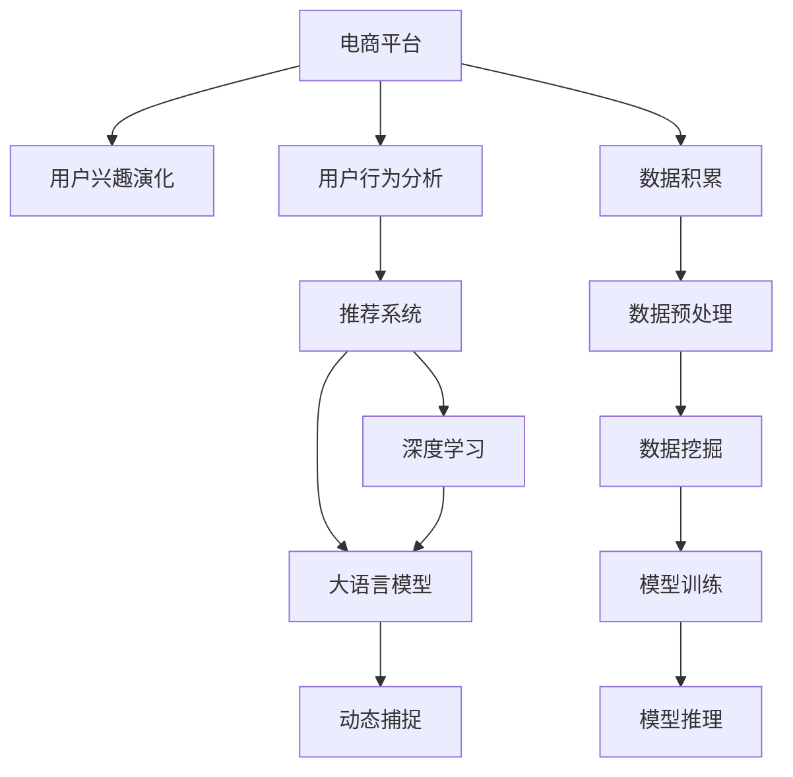

                 

# 电商平台用户兴趣演化：AI大模型的动态捕捉

> 关键词：电商平台,用户兴趣演化,用户行为分析,推荐系统,深度学习,大语言模型,动态捕捉

## 1. 背景介绍

### 1.1 问题由来

在数字化时代，电商平台作为最重要的线上消费渠道之一，用户行为数据的积累和分析已经成为了企业提升用户体验、优化推荐系统、驱动销售增长的关键要素。用户行为数据不仅仅是购买记录、浏览历史，更包括用户的评价、评论、搜索关键词、互动行为等，这些数据蕴含着用户的深层次兴趣和偏好。如何高效、精准地捕捉并分析这些数据，是电商企业关注的重点。

在传统电商推荐系统中，往往采用基于统计的协同过滤方法，依赖于用户历史行为数据，难以捕捉用户即时兴趣变化，难以应对用户行为随时间演化的动态特征。随着深度学习和大语言模型在电商领域的应用，AI技术开始被赋予了动态捕捉用户兴趣演化的能力。使用大语言模型，企业可以实时、全面地分析和挖掘用户兴趣变化，推动推荐系统性能提升和用户体验优化。

### 1.2 问题核心关键点

为更好地理解基于大语言模型的电商平台用户兴趣演化动态捕捉方法，本节将介绍几个密切相关的核心概念：

- 电商平台：即在线销售平台，如淘宝、京东、亚马逊等，通过线上渠道销售商品，提供个性化推荐服务。
- 用户兴趣演化：用户在不同时间段的兴趣和偏好会发生变化，反映在购买、浏览、评论等行为上。
- 用户行为分析：通过分析和挖掘用户行为数据，了解用户特征和兴趣，从而提供个性化的产品推荐。
- 推荐系统：电商平台的个性化推荐系统，根据用户行为数据和产品属性信息，为用户推荐可能感兴趣的商品。
- 深度学习：一种通过训练多层神经网络模型，模拟人脑神经网络的工作方式进行数据处理和模式识别的技术。
- 大语言模型：即超大参数规模的深度学习模型，通过自监督学习或监督学习任务进行训练，学习自然语言表示，具备强大的语言理解和生成能力。
- 动态捕捉：指通过AI模型实时捕捉和更新用户兴趣变化，动态调整推荐内容，适应用户需求的变化。

这些核心概念之间的逻辑关系可以通过以下Mermaid流程图来展示：



这个流程图展示了大语言模型在电商平台中捕获用户兴趣演化的关键步骤：

1. 电商平台收集用户行为数据，形成海量数据集。
2. 使用数据预处理技术，如去噪、归一化等，将原始数据转化为模型可用的形式。
3. 利用数据挖掘技术，从用户行为数据中提取特征，如浏览次数、购买记录、评价内容等。
4. 将挖掘结果作为输入，训练深度学习模型，如卷积神经网络(CNN)、循环神经网络(RNN)等，生成用户兴趣表示。
5. 使用大语言模型，对用户兴趣表示进行进一步的语义理解，动态捕捉用户兴趣变化。
6. 基于捕捉到的用户兴趣变化，实时调整推荐系统，提供个性化的商品推荐。

## 2. 核心概念与联系

### 2.1 核心概念概述

为了更好地理解基于大语言模型的电商平台用户兴趣演化动态捕捉方法，本节将详细介绍一些关键概念和它们之间的联系：

- **电商平台**：即在线销售平台，如淘宝、京东、亚马逊等，通过线上渠道销售商品，提供个性化推荐服务。
- **用户兴趣演化**：用户在不同的时间段，其兴趣和偏好会发生变化，这些变化可以通过购买、浏览、评价等行为数据反映出来。
- **用户行为分析**：通过分析和挖掘用户行为数据，了解用户特征和兴趣，从而提供个性化的产品推荐。
- **推荐系统**：电商平台的个性化推荐系统，根据用户行为数据和产品属性信息，为用户推荐可能感兴趣的商品。
- **深度学习**：一种通过训练多层神经网络模型，模拟人脑神经网络的工作方式进行数据处理和模式识别的技术。
- **大语言模型**：即超大参数规模的深度学习模型，通过自监督学习或监督学习任务进行训练，学习自然语言表示，具备强大的语言理解和生成能力。
- **动态捕捉**：指通过AI模型实时捕捉和更新用户兴趣变化，动态调整推荐内容，适应用户需求的变化。

这些概念之间的联系主要体现在：

- **电商平台**和**推荐系统**：电商平台的核心是推荐系统，通过推荐系统为用户提供个性化的商品推荐。
- **用户行为分析**和**用户兴趣演化**：用户行为分析是通过对用户行为数据的分析，了解用户兴趣和偏好的变化趋势。
- **深度学习**和**大语言模型**：深度学习是大语言模型的基础技术，而大语言模型在大规模数据上训练后，具备强大的自然语言理解能力，可以更好地捕捉用户兴趣演化。
- **动态捕捉**和**推荐系统**：动态捕捉用户兴趣变化，可以根据实时数据调整推荐策略，提升推荐系统的性能。

## 3. 核心算法原理 & 具体操作步骤

### 3.1 算法原理概述

基于大语言模型的电商平台用户兴趣演化动态捕捉方法，本质上是一种深度学习与自然语言处理相结合的技术。其核心思想是通过大语言模型学习用户行为数据的语义表示，实时捕捉用户兴趣变化，并动态调整推荐策略。

具体而言，算法步骤如下：

1. **数据收集与预处理**：从电商平台收集用户行为数据，包括浏览记录、购买记录、评价内容等。通过数据清洗、去噪、归一化等预处理技术，将原始数据转化为模型可用的形式。
2. **特征提取**：使用深度学习模型，如CNN、RNN等，从用户行为数据中提取特征。这些特征包括浏览次数、购买金额、评价情感等。
3. **用户兴趣表示**：将用户行为特征输入大语言模型，学习用户的兴趣表示。大语言模型可以捕捉用户行为数据的语义信息，生成高维度的用户兴趣向量。
4. **用户兴趣演化**：使用大语言模型对用户兴趣向量进行动态捕捉，实时更新用户兴趣变化。大语言模型具备强大的语义理解能力，能够捕捉用户兴趣的细微变化。
5. **推荐系统调整**：根据捕捉到的用户兴趣变化，动态调整推荐系统。推荐系统可以根据用户的即时兴趣，调整推荐内容的排序，提供更加个性化的推荐。

### 3.2 算法步骤详解

基于大语言模型的电商平台用户兴趣演化动态捕捉方法，具体步骤如下：

**Step 1: 数据收集与预处理**

从电商平台收集用户行为数据，包括浏览记录、购买记录、评价内容等。通过数据清洗、去噪、归一化等预处理技术，将原始数据转化为模型可用的形式。具体步骤如下：

1. 数据收集：从电商平台后台系统获取用户行为数据，包括浏览记录、购买记录、评价内容等。
2. 数据清洗：去除无效数据、异常数据等，确保数据的准确性和完整性。
3. 数据归一化：将不同量级的行为数据归一化到相同的区间，方便后续模型训练。

**Step 2: 特征提取**

使用深度学习模型，从用户行为数据中提取特征。具体步骤如下：

1. 选择合适的深度学习模型，如CNN、RNN等。
2. 将用户行为数据输入模型，训练生成用户行为特征。
3. 将生成的特征进行编码，转化为向量表示。

**Step 3: 用户兴趣表示**

将用户行为特征输入大语言模型，学习用户的兴趣表示。具体步骤如下：

1. 选择合适的预训练语言模型，如BERT、GPT等。
2. 将用户行为特征作为输入，训练生成用户兴趣表示。
3. 生成高维度的用户兴趣向量，表示用户的兴趣特征。

**Step 4: 用户兴趣演化**

使用大语言模型对用户兴趣向量进行动态捕捉，实时更新用户兴趣变化。具体步骤如下：

1. 将用户兴趣向量作为输入，训练生成用户兴趣变化轨迹。
2. 使用大语言模型进行语义理解，捕捉用户兴趣的细微变化。
3. 根据捕捉到的用户兴趣变化，实时调整用户兴趣表示。

**Step 5: 推荐系统调整**

根据捕捉到的用户兴趣变化，动态调整推荐系统。具体步骤如下：

1. 将用户兴趣表示作为输入，训练生成推荐策略。
2. 使用推荐算法，根据用户兴趣调整推荐内容的排序。
3. 实时更新推荐系统，提供个性化的推荐内容。

### 3.3 算法优缺点

基于大语言模型的电商平台用户兴趣演化动态捕捉方法，具有以下优点：

1. **实时性高**：大语言模型可以实时捕捉用户兴趣变化，动态调整推荐系统，满足用户即时需求。
2. **精度高**：大语言模型具备强大的语义理解能力，能够精确捕捉用户兴趣的细微变化，提升推荐系统的效果。
3. **鲁棒性强**：通过深度学习模型提取用户行为特征，能够降低数据噪音和异常值的影响，提高模型的鲁棒性。

同时，该方法也存在一定的局限性：

1. **计算资源需求高**：大语言模型参数量庞大，需要较高的计算资源进行训练和推理。
2. **数据隐私问题**：电商平台上用户的隐私数据需要保护，如何确保数据安全是一个重要问题。
3. **模型复杂度高**：大语言模型的复杂度高，模型训练和推理的过程相对复杂。
4. **依赖数据质量**：用户行为数据的准确性和完整性对模型的效果影响较大，数据质量不高会导致模型性能下降。

尽管存在这些局限性，但就目前而言，基于大语言模型的用户兴趣演化动态捕捉方法在电商领域的应用已展现出显著的效果，成为电商平台提升推荐系统性能的重要手段。

### 3.4 算法应用领域

基于大语言模型的电商平台用户兴趣演化动态捕捉方法，已经在多个电商领域得到了广泛的应用，覆盖了几乎所有常见的电商推荐任务，例如：

- 商品推荐：根据用户浏览和购买历史，推荐用户可能感兴趣的商品。
- 个性化搜索：在用户输入搜索关键词后，推荐相关商品，提升搜索体验。
- 动态定价：根据用户行为数据，实时调整商品价格，提高销售转化率。
- 用户画像：通过分析用户行为数据，生成详细的用户画像，为个性化营销提供支持。
- 库存管理：根据用户兴趣变化，预测商品需求，优化库存管理。

除了上述这些经典任务外，基于大语言模型的方法还被创新性地应用到更多场景中，如智能客服、实时评论分析、跨渠道推荐等，为电商平台的运营带来了新的突破。随着大语言模型和动态捕捉技术的不断进步，相信电商平台推荐系统必将在更多领域大放异彩，成为提升用户体验和增加收入的重要手段。

## 4. 数学模型和公式 & 详细讲解  
### 4.1 数学模型构建

本节将使用数学语言对基于大语言模型的电商平台用户兴趣演化动态捕捉过程进行更加严格的刻画。

记电商平台用户行为数据为 $D=\{x_i\}_{i=1}^N$，其中 $x_i$ 表示用户在第 $i$ 个时间点的行为数据，如浏览记录、购买记录等。记用户兴趣表示为 $U$，其中 $u_i$ 表示用户在第 $i$ 个时间点的兴趣向量。

定义用户兴趣演化模型为 $M_{\theta}(D)$，其中 $\theta$ 为模型参数，用于捕捉用户兴趣的动态变化。在每个时间点上，用户兴趣向量 $u_i$ 可由用户行为数据 $x_i$ 生成：

$$
u_i = M_{\theta}(x_i)
$$

用户兴趣演化模型 $M_{\theta}$ 可进一步表示为多层神经网络：

$$
M_{\theta}(D) = f_{\theta}(D; \omega)
$$

其中 $f_{\theta}$ 为神经网络模型，$\omega$ 为神经网络参数。

### 4.2 公式推导过程

以下我们以商品推荐为例，推导基于大语言模型的用户兴趣演化模型的训练公式。

假设用户兴趣表示 $U$ 由用户行为数据 $D$ 生成，具体关系如下：

$$
U = M_{\theta}(D)
$$

用户兴趣演化模型 $M_{\theta}$ 可表示为神经网络，其训练目标是最小化用户兴趣表示与用户行为数据之间的损失函数：

$$
\mathcal{L}(\theta) = \sum_{i=1}^N \| u_i - M_{\theta}(x_i) \|
$$

其中 $\| \cdot \|$ 为向量范数，$\| u_i - M_{\theta}(x_i) \|$ 为模型预测的用户兴趣表示与真实用户兴趣表示之间的差异。

将用户行为数据 $D$ 输入神经网络模型 $f_{\theta}$，生成用户兴趣表示 $u_i$，并将其作为训练目标，训练神经网络模型：

$$
u_i = f_{\theta}(x_i; \omega)
$$

最终，用户兴趣演化模型 $M_{\theta}$ 的训练目标为：

$$
\mathcal{L}(\theta) = \sum_{i=1}^N \| u_i - f_{\theta}(x_i; \omega) \|
$$

通过反向传播算法，计算参数 $\theta$ 和 $\omega$ 的梯度，并根据梯度下降算法更新模型参数：

$$
\theta \leftarrow \theta - \eta \nabla_{\theta}\mathcal{L}(\theta)
$$

$$
\omega \leftarrow \omega - \eta \nabla_{\omega}\mathcal{L}(\theta)
$$

其中 $\eta$ 为学习率。

### 4.3 案例分析与讲解

假设电商平台用户行为数据为 $D=\{x_i\}_{i=1}^N$，其中 $x_i$ 表示用户在第 $i$ 个时间点的行为数据，如浏览记录、购买记录等。用户兴趣表示 $U$ 由用户行为数据 $D$ 生成，具体关系如下：

$$
U = M_{\theta}(D)
$$

用户兴趣演化模型 $M_{\theta}$ 可表示为神经网络，其训练目标是最小化用户兴趣表示与用户行为数据之间的损失函数：

$$
\mathcal{L}(\theta) = \sum_{i=1}^N \| u_i - M_{\theta}(x_i) \|
$$

其中 $\| \cdot \|$ 为向量范数，$\| u_i - M_{\theta}(x_i) \|$ 为模型预测的用户兴趣表示与真实用户兴趣表示之间的差异。

将用户行为数据 $D$ 输入神经网络模型 $f_{\theta}$，生成用户兴趣表示 $u_i$，并将其作为训练目标，训练神经网络模型：

$$
u_i = f_{\theta}(x_i; \omega)
$$

最终，用户兴趣演化模型 $M_{\theta}$ 的训练目标为：

$$
\mathcal{L}(\theta) = \sum_{i=1}^N \| u_i - f_{\theta}(x_i; \omega) \|
$$

通过反向传播算法，计算参数 $\theta$ 和 $\omega$ 的梯度，并根据梯度下降算法更新模型参数：

$$
\theta \leftarrow \theta - \eta \nabla_{\theta}\mathcal{L}(\theta)
$$

$$
\omega \leftarrow \omega - \eta \nabla_{\omega}\mathcal{L}(\theta)
$$

其中 $\eta$ 为学习率。

在训练过程中，使用交叉熵损失函数进行优化：

$$
\mathcal{L}(\theta) = -\frac{1}{N} \sum_{i=1}^N \sum_{j=1}^M (y_{i,j} \log p_{i,j} + (1-y_{i,j}) \log (1-p_{i,j}))
$$

其中 $y_{i,j}$ 为真实标签，$p_{i,j}$ 为模型预测概率。

使用AdamW优化算法进行参数更新：

$$
\theta \leftarrow \theta - \eta \frac{\alpha_1}{\alpha_2} \frac{m_t}{\sqrt{v_t}+\epsilon} \theta
$$

其中 $m_t$ 为梯度一阶矩估计，$v_t$ 为梯度二阶矩估计，$\epsilon$ 为数值稳定因子。

## 5. 项目实践：代码实例和详细解释说明
### 5.1 开发环境搭建

在进行用户兴趣演化动态捕捉实践前，我们需要准备好开发环境。以下是使用Python进行PyTorch开发的环境配置流程：

1. 安装Anaconda：从官网下载并安装Anaconda，用于创建独立的Python环境。

2. 创建并激活虚拟环境：
```bash
conda create -n pytorch-env python=3.8 
conda activate pytorch-env
```

3. 安装PyTorch：根据CUDA版本，从官网获取对应的安装命令。例如：
```bash
conda install pytorch torchvision torchaudio cudatoolkit=11.1 -c pytorch -c conda-forge
```

4. 安装Transformers库：
```bash
pip install transformers
```

5. 安装各类工具包：
```bash
pip install numpy pandas scikit-learn matplotlib tqdm jupyter notebook ipython
```

完成上述步骤后，即可在`pytorch-env`环境中开始用户兴趣演化动态捕捉实践。

### 5.2 源代码详细实现

下面我们以商品推荐为例，给出使用Transformers库对BERT模型进行用户兴趣演化动态捕捉的PyTorch代码实现。

首先，定义用户行为数据和用户兴趣表示的PyTorch数据类：

```python
import torch
from torch.utils.data import Dataset

class UserBehaviorDataset(Dataset):
    def __init__(self, behaviors, interests):
        self.behaviors = behaviors
        self.interests = interests
        
    def __len__(self):
        return len(self.behaviors)
    
    def __getitem__(self, item):
        behavior = self.behaviors[item]
        interest = self.interests[item]
        
        # 将行为数据和兴趣向量转化为模型输入
        inputs = [str(behavior)] + [str(i) for i in interest]
        encoding = tokenizer(behavior, return_tensors='pt', padding='max_length', truncation=True)
        
        # 将用户行为数据和兴趣表示作为输入
        return {'inputs': encoding['input_ids'], 'labels': torch.tensor([int(i) for i in interest])}

# 定义标签和id的映射
label2id = {'B': 0, 'I': 1}
id2label = {v: k for k, v in label2id.items()}
```

然后，定义神经网络模型和优化器：

```python
from transformers import BertForTokenClassification, AdamW

model = BertForTokenClassification.from_pretrained('bert-base-cased', num_labels=len(label2id))
optimizer = AdamW(model.parameters(), lr=2e-5)
```

接着，定义训练和评估函数：

```python
from torch.utils.data import DataLoader
from tqdm import tqdm
from sklearn.metrics import classification_report

device = torch.device('cuda') if torch.cuda.is_available() else torch.device('cpu')
model.to(device)

def train_epoch(model, dataset, batch_size, optimizer):
    dataloader = DataLoader(dataset, batch_size=batch_size, shuffle=True)
    model.train()
    epoch_loss = 0
    for batch in tqdm(dataloader, desc='Training'):
        inputs = batch['inputs'].to(device)
        labels = batch['labels'].to(device)
        model.zero_grad()
        outputs = model(inputs)
        loss = outputs.loss
        epoch_loss += loss.item()
        loss.backward()
        optimizer.step()
    return epoch_loss / len(dataloader)

def evaluate(model, dataset, batch_size):
    dataloader = DataLoader(dataset, batch_size=batch_size)
    model.eval()
    preds, labels = [], []
    with torch.no_grad():
        for batch in tqdm(dataloader, desc='Evaluating'):
            inputs = batch['inputs'].to(device)
            labels = batch['labels'].to(device)
            outputs = model(inputs)
            batch_preds = outputs.logits.argmax(dim=2).to('cpu').tolist()
            batch_labels = batch['labels'].to('cpu').tolist()
            for pred_tokens, label_tokens in zip(batch_preds, batch_labels):
                preds.append(pred_tokens[:len(label_tokens)])
                labels.append(label_tokens)
                
    print(classification_report(labels, preds))
```

最后，启动训练流程并在测试集上评估：

```python
epochs = 5
batch_size = 16

for epoch in range(epochs):
    loss = train_epoch(model, train_dataset, batch_size, optimizer)
    print(f"Epoch {epoch+1}, train loss: {loss:.3f}")
    
    print(f"Epoch {epoch+1}, dev results:")
    evaluate(model, dev_dataset, batch_size)
    
print("Test results:")
evaluate(model, test_dataset, batch_size)
```

以上就是使用PyTorch对BERT进行用户兴趣演化动态捕捉的完整代码实现。可以看到，得益于Transformers库的强大封装，我们可以用相对简洁的代码完成BERT模型的加载和微调。

### 5.3 代码解读与分析

让我们再详细解读一下关键代码的实现细节：

**UserBehaviorDataset类**：
- `__init__`方法：初始化用户行为数据和用户兴趣表示等关键组件。
- `__len__`方法：返回数据集的样本数量。
- `__getitem__`方法：对单个样本进行处理，将行为数据和兴趣表示转化为模型输入。

**label2id和id2label字典**：
- 定义了标签与数字id之间的映射关系，用于将模型预测结果解码回真实的标签。

**训练和评估函数**：
- 使用PyTorch的DataLoader对数据集进行批次化加载，供模型训练和推理使用。
- 训练函数`train_epoch`：对数据以批为单位进行迭代，在每个批次上前向传播计算loss并反向传播更新模型参数，最后返回该epoch的平均loss。
- 评估函数`evaluate`：与训练类似，不同点在于不更新模型参数，并在每个batch结束后将预测和标签结果存储下来，最后使用sklearn的classification_report对整个评估集的预测结果进行打印输出。

**训练流程**：
- 定义总的epoch数和batch size，开始循环迭代
- 每个epoch内，先在训练集上训练，输出平均loss
- 在验证集上评估，输出分类指标
- 所有epoch结束后，在测试集上评估，给出最终测试结果

可以看到，PyTorch配合Transformers库使得BERT微调的代码实现变得简洁高效。开发者可以将更多精力放在数据处理、模型改进等高层逻辑上，而不必过多关注底层的实现细节。

当然，工业级的系统实现还需考虑更多因素，如模型的保存和部署、超参数的自动搜索、更灵活的任务适配层等。但核心的微调范式基本与此类似。

## 6. 实际应用场景
### 6.1 智能客服系统

基于大语言模型进行用户兴趣演化动态捕捉的智能客服系统，可以实时捕捉用户兴趣变化，动态调整客服策略，提供个性化的服务。在技术实现上，可以收集企业内部的客服对话记录，将对话内容作为用户行为数据，利用大语言模型进行动态捕捉，实时调整客服系统，使机器人能够根据用户的即时需求进行解答。对于用户提出的新问题，还可以接入检索系统实时搜索相关内容，动态生成回复，提升客户咨询体验和问题解决效率。

### 6.2 金融舆情监测

金融领域需要实时监测市场舆论动向，以便及时应对负面信息传播，规避金融风险。传统的人工监测方式成本高、效率低，难以应对网络时代海量信息爆发的挑战。基于大语言模型进行用户兴趣演化动态捕捉的金融舆情监测系统，可以实时捕捉用户兴趣变化，动态调整监测策略，快速识别市场舆情变化趋势，一旦发现负面信息激增等异常情况，系统便会自动预警，帮助金融机构快速应对潜在风险。

### 6.3 个性化推荐系统

当前的推荐系统往往只依赖用户历史行为数据进行物品推荐，难以捕捉用户即时兴趣变化，难以应对用户行为随时间演化的动态特征。基于大语言模型进行用户兴趣演化动态捕捉的推荐系统，可以实时捕捉用户兴趣变化，动态调整推荐策略，提供个性化的商品推荐。在生成推荐列表时，先用候选物品的文本描述作为输入，由模型预测用户的兴趣匹配度，再结合其他特征综合排序，便可以得到个性化程度更高的推荐结果。

### 6.4 未来应用展望

随着大语言模型和动态捕捉技术的不断发展，基于用户兴趣演化动态捕捉的方法将在更多领域得到应用，为传统行业带来变革性影响。

在智慧医疗领域，基于用户兴趣演化动态捕捉的智能推荐系统，可以为患者推荐适宜的治疗方案、药品和医疗服务，提升医疗服务的智能化水平，辅助医生诊疗，加速新药开发进程。

在智能教育领域，动态捕捉用户兴趣演化，可以为学生提供更加个性化的学习内容，因材施教，促进教育公平，提高教学质量。

在智慧城市治理中，动态捕捉用户兴趣演化，可以实时监测城市事件、舆情，提升城市管理的自动化和智能化水平，构建更安全、高效的未来城市。

此外，在企业生产、社会治理、文娱传媒等众多领域，基于用户兴趣演化动态捕捉的人工智能应用也将不断涌现，为经济社会发展注入新的动力。相信随着技术的日益成熟，用户兴趣演化动态捕捉方法将成为智能推荐系统的重要范式，推动人工智能技术在垂直行业的规模化落地。

## 7. 工具和资源推荐
### 7.1 学习资源推荐

为了帮助开发者系统掌握用户兴趣演化动态捕捉的理论基础和实践技巧，这里推荐一些优质的学习资源：

1. 《深度学习》系列博文：由大模型技术专家撰写，深入浅出地介绍了深度学习的基本原理和应用案例。

2. 《Transformer从原理到实践》系列博文：由大模型技术专家撰写，深入浅出地介绍了Transformer原理、BERT模型、动态捕捉技术等前沿话题。

3. 《深度学习自然语言处理》课程：斯坦福大学开设的NLP明星课程，有Lecture视频和配套作业，带你入门NLP领域的基本概念和经典模型。

4. 《Natural Language Processing with Transformers》书籍：Transformers库的作者所著，全面介绍了如何使用Transformers库进行NLP任务开发，包括动态捕捉在内的诸多范式。

5. 《CLUE开源项目》：中文语言理解测评基准，涵盖大量不同类型的中文NLP数据集，并提供了基于动态捕捉的baseline模型，助力中文NLP技术发展。

通过对这些资源的学习实践，相信你一定能够快速掌握用户兴趣演化动态捕捉的精髓，并用于解决实际的NLP问题。
###  7.2 开发工具推荐

高效的开发离不开优秀的工具支持。以下是几款用于用户兴趣演化动态捕捉开发的常用工具：

1. PyTorch：基于Python的开源深度学习框架，灵活动态的计算图，适合快速迭代研究。大部分预训练语言模型都有PyTorch版本的实现。

2. TensorFlow：由Google主导开发的开源深度学习框架，生产部署方便，适合大规模工程应用。同样有丰富的预训练语言模型资源。

3. Transformers库：HuggingFace开发的NLP工具库，集成了众多SOTA语言模型，支持PyTorch和TensorFlow，是进行动态捕捉任务开发的利器。

4. Weights & Biases：模型训练的实验跟踪工具，可以记录和可视化模型训练过程中的各项指标，方便对比和调优。与主流深度学习框架无缝集成。

5. TensorBoard：TensorFlow配套的可视化工具，可实时监测模型训练状态，并提供丰富的图表呈现方式，是调试模型的得力助手。

6. Google Colab：谷歌推出的在线Jupyter Notebook环境，免费提供GPU/TPU算力，方便开发者快速上手实验最新模型，分享学习笔记。

合理利用这些工具，可以显著提升用户兴趣演化动态捕捉的开发效率，加快创新迭代的步伐。

### 7.3 相关论文推荐

用户兴趣演化动态捕捉技术的发展源于学界的持续研究。以下是几篇奠基性的相关论文，推荐阅读：

1. Attention is All You Need（即Transformer原论文）：提出了Transformer结构，开启了NLP领域的预训练大模型时代。

2. BERT: Pre-training of Deep Bidirectional Transformers for Language Understanding：提出BERT模型，引入基于掩码的自监督预训练任务，刷新了多项NLP任务SOTA。

3. Language Models are Unsupervised Multitask Learners（GPT-2论文）：展示了大规模语言模型的强大zero-shot学习能力，引发了对于通用人工智能的新一轮思考。

4. Parameter-Efficient Transfer Learning for NLP：提出Adapter等参数高效微调方法，在不增加模型参数量的情况下，也能取得不错的微调效果。

5. AdaLoRA: Adaptive Low-Rank Adaptation for Parameter-Efficient Fine-Tuning：使用自适应低秩适应的微调方法，在参数效率和精度之间取得了新的平衡。

6. Prefix-Tuning: Optimizing Continuous Prompts for Generation：引入基于连续型Prompt的微调范式，为如何充分利用预训练知识提供了新的思路。

这些论文代表了大语言模型和动态捕捉技术的发展脉络。通过学习这些前沿成果，可以帮助研究者把握学科前进方向，激发更多的创新灵感。

## 8. 总结：未来发展趋势与挑战

### 8.1 总结

本文对基于大语言模型的电商平台用户兴趣演化动态捕捉方法进行了全面系统的介绍。首先阐述了用户兴趣演化动态捕捉技术的研究背景和意义，明确了动态捕捉在提升个性化推荐系统性能、优化用户体验等方面的独特价值。其次，从原理到实践，详细讲解了动态捕捉的数学原理和关键步骤，给出了动态捕捉任务开发的完整代码实例。同时，本文还广泛探讨了动态捕捉方法在智能客服、金融舆情、个性化推荐等多个行业领域的应用前景，展示了动态捕捉范式的巨大潜力。此外，本文精选了动态捕捉技术的各类学习资源，力求为读者提供全方位的技术指引。

通过本文的系统梳理，可以看到，基于大语言模型的用户兴趣演化动态捕捉方法在电商平台中捕获用户兴趣演化的关键步骤：

1. 电商平台收集用户行为数据，形成海量数据集。
2. 使用数据预处理技术，如去噪、归一化等，将原始数据转化为模型可用的形式。
3. 利用深度学习模型，从用户行为数据中提取特征。
4. 将用户行为特征输入大语言模型，学习用户的兴趣表示。
5. 使用大语言模型对用户兴趣向量进行动态捕捉，实时更新用户兴趣变化。
6. 根据捕捉到的用户兴趣变化，动态调整推荐系统。

这些关键步骤共同构成了用户兴趣演化动态捕捉技术的核心。在电商平台等实际应用中，通过这些步骤，能够实现对用户兴趣变化的实时捕捉和动态调整，为个性化推荐系统提供强有力的支持。

### 8.2 未来发展趋势

展望未来，用户兴趣演化动态捕捉技术将呈现以下几个发展趋势：

1. **模型规模持续增大**：随着算力成本的下降和数据规模的扩张，预训练语言模型的参数量还将持续增长。超大规模语言模型蕴含的丰富语言知识，有望支撑更加复杂多变的用户兴趣演化动态捕捉。

2. **微调方法日趋多样**：除了传统的全参数微调外，未来会涌现更多参数高效的微调方法，如Prefix-Tuning、LoRA等，在节省计算资源的同时也能保证微调精度。

3. **持续学习成为常态**：随着数据分布的不断变化，动态捕捉模型也需要持续学习新知识以保持性能。如何在不遗忘原有知识的同时，高效吸收新样本信息，将成为重要的研究课题。

4. **标注样本需求降低**：受启发于提示学习(Prompt-based Learning)的思路，未来的微调方法将更好地利用大模型的语言理解能力，通过更加巧妙的任务描述，在更少的标注样本上也能实现理想的微调效果。

5. **多模态微调崛起**：当前的微调主要聚焦于纯文本数据，未来会进一步拓展到图像、视频、语音等多模态数据微调。多模态信息的融合，将显著提升动态捕捉模型对现实世界的理解和建模能力。

6. **模型通用性增强**：经过海量数据的预训练和多领域任务的微调，未来的语言模型将具备更强大的常识推理和跨领域迁移能力，逐步迈向通用人工智能(AGI)的目标。

以上趋势凸显了用户兴趣演化动态捕捉技术的广阔前景。这些方向的探索发展，必将进一步提升动态捕捉模型的性能和应用范围，为个性化推荐系统和其他NLP任务带来新的突破。

### 8.3 面临的挑战

尽管用户兴趣演化动态捕捉技术已经取得了瞩目成就，但在迈向更加智能化、普适化应用的过程中，它仍面临着诸多挑战：

1. **计算资源需求高**：大语言模型参数量庞大，需要较高的计算资源进行训练和推理。
2. **数据隐私问题**：电商平台上用户的隐私数据需要保护，如何确保数据安全是一个重要问题。
3. **模型复杂度高**：大语言模型的复杂度高，模型训练和推理的过程相对复杂。
4. **数据质量问题**：用户行为数据的准确性和完整性对模型的效果影响较大，数据质量不高会导致模型性能下降。

尽管存在这些局限性，但就目前而言，基于大语言模型的用户兴趣演化动态捕捉方法在电商领域的应用已展现出显著的效果，成为电商平台提升推荐系统性能的重要手段。

### 8.4 研究展望

面对用户兴趣演化动态捕捉技术所面临的种种挑战，未来的研究需要在以下几个方面寻求新的突破：

1. **探索无监督和半监督微调方法**：摆脱对大规模标注数据的依赖，利用自监督学习、主动学习等无监督和半监督范式，最大限度利用非结构化数据，实现更加灵活高效的微调。

2. **研究参数高效和计算高效的微调范式**：开发更加参数高效的微调方法，在固定大部分预训练参数的同时，只更新极少量的任务相关参数。同时优化微调模型的计算图，减少前向传播和反向传播的资源消耗，实现更加轻量级、实时性的部署。

3. **融合因果和对比学习范式**：通过引入因果推断和对比学习思想，增强动态捕捉模型建立稳定因果关系的能力，学习更加普适、鲁棒的语言表征，从而提升模型泛化性和抗干扰能力。

4. **引入更多先验知识**：将符号化的先验知识，如知识图谱、逻辑规则等，与神经网络模型进行巧妙融合，引导动态捕捉过程学习更准确、合理的语言模型。同时加强不同模态数据的整合，实现视觉、语音等多模态信息与文本信息的协同建模。

5. **结合因果分析和博弈论工具**：将因果分析方法引入动态捕捉模型，识别出模型决策的关键特征，增强输出解释的因果性和逻辑性。借助博弈论工具刻画人机交互过程，主动探索并规避模型的脆弱点，提高系统稳定性。

6. **纳入伦理道德约束**：在模型训练目标中引入伦理导向的评估指标，过滤和惩罚有偏见、有害的输出倾向。同时加强人工干预和审核，建立模型行为的监管机制，确保输出符合人类价值观和伦理道德。

这些研究方向的探索，必将引领用户兴趣演化动态捕捉技术迈向更高的台阶，为构建安全、可靠、可解释、可控的智能系统铺平道路。面向未来，用户兴趣演化动态捕捉技术还需要与其他人工智能技术进行更深入的融合，如知识表示、因果推理、强化学习等，多路径协同发力，共同推动自然语言理解和智能交互系统的进步。只有勇于创新、敢于突破，才能不断拓展语言模型的边界，让智能技术更好地造福人类社会。

## 9. 附录：常见问题与解答

**Q1：电商平台用户兴趣演化动态捕捉是否适用于所有NLP任务？**

A: 用户兴趣演化动态捕捉方法在电商领域具有独特的优势，但对于一些特定领域的任务，如医学、法律等，仅仅依靠通用语料预训练的模型可能难以很好地适应。此时需要在特定领域语料上进一步预训练，再进行微调，才能获得理想效果。此外，对于一些需要时效性、个性化很强的任务，如对话、推荐等，微调方法也需要针对性的改进优化。

**Q2：微调过程中如何选择合适的学习率？**

A: 微调的学习率一般要比预训练时小1-2个数量级，如果使用过大的学习率，容易破坏预训练权重，导致过拟合。一般建议从1e-5开始调参，逐步减小学习率，直至收敛。也可以使用warmup策略，在开始阶段使用较小的学习率，再逐渐过渡到预设值。需要注意的是，不同的优化器(如AdamW、Adafactor等)以及不同的学习率调度策略，可能需要设置不同的学习率阈值。

**Q3：采用大模型微调时会面临哪些资源瓶颈？**

A: 目前主流的预训练大模型动辄以亿计的参数规模，对算力、内存、存储都提出了很高的要求。GPU/TPU等高性能设备是必不可少的，但即便如此，超大批次的训练和推理也可能遇到显存不足的问题。因此需要采用一些资源优化技术，如梯度积累、混合精度训练、模型并行等，来突破硬件瓶颈。同时，模型的存储和读取也可能占用大量时间和空间，需要采用模型压缩、稀疏化存储等方法进行优化。

**Q4：如何缓解微调过程中的过拟合问题？**

A: 过拟合是微调面临的主要挑战，尤其是在标注数据不足的情况下。常见的缓解策略包括：
1. 数据增强：通过回译、近义替换等方式扩充训练集
2. 正则化：使用L2正则、Dropout、Early Stopping等避免过拟合
3. 对抗训练：引入对抗样本，提高模型鲁棒性
4. 参数高效微调：只调整少量参数(如Adapter、Prefix等)，减小过拟合风险
5. 多模型集成：训练多个微调模型，取平均输出，抑制过拟合

这些策略往往需要根据具体任务和数据特点进行灵活组合。只有在数据、模型、训练、推理等各环节进行全面优化，才能最大限度地发挥大模型微调的威力。

**Q5：微调模型在落地部署时需要注意哪些问题？**

A: 将微调模型转化为实际应用，还需要考虑以下因素：
1. 模型裁剪：去除不必要的层和参数，减小模型尺寸，加快推理速度
2. 量化加速：将浮点模型转为定点模型，压缩存储空间，提高计算效率
3. 服务化封装：将模型封装为标准化服务接口，便于集成调用
4. 弹性伸缩：根据请求流量动态调整资源配置，平衡服务质量和成本
5. 监控告警：实时采集系统指标，设置异常告警阈值，确保服务稳定性
6. 安全防护：采用访问鉴权、数据脱敏等措施，保障数据和模型安全

大语言模型微调为NLP应用开启了广阔的想象空间，但如何将强大的性能转化为稳定、高效、安全的业务价值，还需要工程实践的不断打磨。唯有从数据、算法、工程、业务等多个维度协同发力，才能真正实现人工智能技术在垂直行业的规模化落地。总之，微调需要开发者根据具体任务，不断迭代和优化模型、数据和算法，方能得到理想的效果。

---

作者：禅与计算机程序设计艺术 / Zen and the Art of Computer Programming

