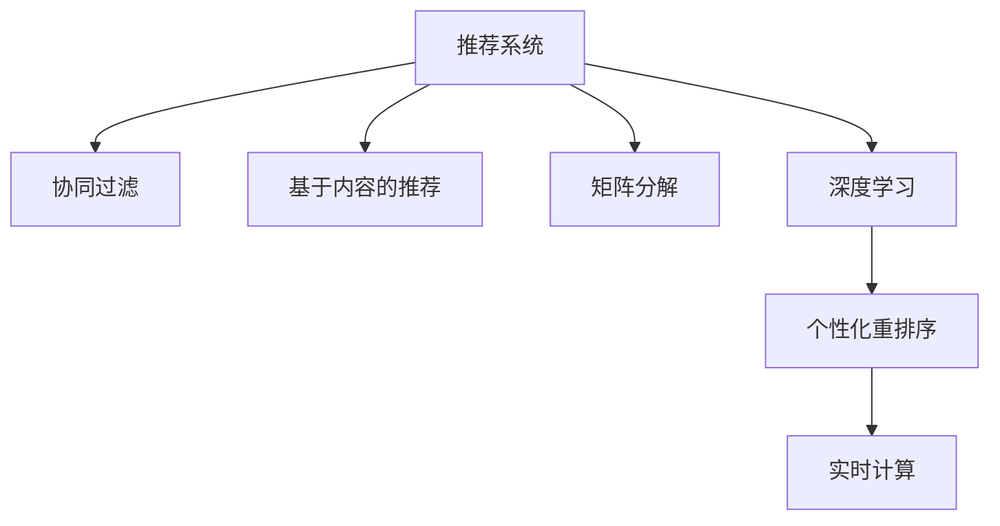

                 

# 电商推荐系统中的实时个性化重排序

## 1. 背景介绍

随着电子商务的迅猛发展，推荐系统成为了电商平台提升用户体验、增加转化率的关键工具。传统的推荐系统主要依赖用户的显式行为（如点击、购买等）进行个性化推荐，存在数据稀疏、特征维度高等问题。近年来，基于深度学习的方法在推荐系统领域取得显著进展，通过协同过滤、矩阵分解、深度学习等技术，显著提升了推荐系统的性能。然而，这些方法往往需要离线训练，难以实时响应用户请求。为了解决这一问题，实时个性化推荐逐渐受到广泛关注。

实时个性化推荐系统能够根据用户即时请求，实时计算并返回个性化推荐结果，具有高度的灵活性和实时性。其关键在于构建高效的实时推荐模型，并在模型上进行实时特征更新和计算，最终返回推荐结果。其中，个性化重排序（Personalized Re-ranking）是推荐系统的一个重要研究方向，通过对排序模型进行微调，实现更准确的个性化排序，提升推荐效果。本文将详细介绍个性化重排序的基本原理、核心算法和具体操作步骤，并结合实际案例，探讨其在电商推荐系统中的应用。

## 2. 核心概念与联系

### 2.1 核心概念概述

为更好地理解实时个性化重排序的原理和算法，我们首先需要介绍几个核心概念：

- **推荐系统(Recommendation System)**：通过分析用户的历史行为、兴趣偏好和商品属性等信息，为每个用户推荐最有可能满足其需求的商品或内容。推荐系统分为协同过滤、基于内容的推荐、矩阵分解、深度学习等多种类型。
- **个性化重排序(Personalized Re-ranking)**：在推荐结果排序中，通过针对每个用户进行微调，使得排序结果更符合其个性化需求。这通常通过监督学习方法实现，根据用户对推荐结果的反馈（如点击率、转化率等），调整排序模型的参数，以获得更好的推荐效果。
- **深度学习(Deep Learning)**：一种基于神经网络的机器学习技术，具有强大的特征提取和泛化能力，广泛应用于推荐系统、图像识别、自然语言处理等领域。深度学习中的卷积神经网络、循环神经网络、Transformer等架构，是实现个性化重排序的重要工具。
- **实时计算(Real-time Computing)**：指在用户请求实时计算并返回结果的系统，能够快速响应用户的即时需求，具有高度的灵活性和实时性。

这些概念之间的逻辑关系可以通过以下Mermaid流程图来展示：



这个流程图展示了一些推荐的常见方法，以及如何将这些方法应用于实时个性化重排序。

## 3. 核心算法原理 & 具体操作步骤
### 3.1 算法原理概述

个性化重排序的基本思想是在传统的推荐系统中加入微调步骤，对排序模型进行实时更新，以适应每个用户的个性化需求。其主要流程包括特征提取、模型训练和结果排序三个部分：

1. **特征提取**：从用户历史行为和商品属性中提取高维特征，用于训练排序模型。
2. **模型训练**：使用监督学习算法，如梯度下降、Adam等，对排序模型进行微调，优化模型参数。
3. **结果排序**：根据用户特征和模型输出，重新排序推荐结果，提高推荐准确性。

个性化重排序的关键在于如何高效地更新模型参数，以适应实时变化的用户需求。常用的方法包括在线学习(Online Learning)和增量学习(Incremental Learning)等。

### 3.2 算法步骤详解

#### 3.2.1 特征提取

特征提取是推荐系统中的重要环节，用于将用户行为和商品属性转化为机器可以理解的高维特征向量。常用的特征提取方法包括：

1. **用户行为特征**：如用户的点击记录、浏览时长、购买历史等。
2. **商品属性特征**：如商品价格、评分、类别、标签等。
3. **上下文特征**：如商品展示时间、页面位置、广告等。

特征提取过程一般使用深度学习中的卷积神经网络（CNN）、循环神经网络（RNN）或Transformer等架构，对用户历史行为和商品属性进行编码，得到高维特征向量。

#### 3.2.2 模型训练

在特征提取完成后，我们使用监督学习算法对排序模型进行微调。常用的排序模型包括线性回归、决策树、随机森林、支持向量机等，但在深度学习推荐系统中，Transformer模型因其强大的语义表示能力，逐渐成为主流。

模型训练的具体流程如下：

1. **准备数据**：收集用户的点击记录和商品属性数据，分为训练集、验证集和测试集。
2. **选择模型**：选择合适的排序模型，如Transformer模型，作为初始化参数。
3. **设置超参数**：包括学习率、批大小、迭代轮数、正则化系数等。
4. **执行训练**：在训练集上迭代训练，每轮更新模型参数。
5. **评估模型**：在验证集上评估模型性能，选择合适的学习率、批大小等参数。
6. **测试模型**：在测试集上评估模型性能，对比微调前后的精度提升。

#### 3.2.3 结果排序

结果排序是推荐系统的最后一步，根据用户特征和模型输出，重新排序推荐结果，提升推荐准确性。常用的排序方法包括：

1. **基于排序的推荐**：根据排序模型的输出，重新排序推荐结果。
2. **多臂老虎机算法**：在多个推荐结果中选择最优的进行展示，优化点击率等指标。
3. **召回-排序算法**：先进行召回，再对召回结果进行排序。

### 3.3 算法优缺点

个性化重排序具有以下优点：

1. **实时性**：能够实时响应用户请求，提高用户体验。
2. **高效性**：通过微调模型参数，提高推荐准确性。
3. **灵活性**：可以针对不同用户和商品进行个性化推荐。

同时，个性化重排序也存在一些缺点：

1. **数据需求高**：需要大量用户行为数据和商品属性数据，数据采集和处理成本较高。
2. **模型复杂度高**：深度学习模型结构复杂，计算量大，训练时间长。
3. **过拟合风险**：微调模型容易过拟合，需要采取一些正则化措施。

### 3.4 算法应用领域

个性化重排序在推荐系统中的应用非常广泛，包括但不限于以下几个领域：

1. **电子商务**：对用户进行实时推荐，提高点击率和转化率。
2. **在线广告**：根据用户行为和偏好，实时调整广告推荐策略。
3. **内容推荐**：对用户进行实时推荐，提高内容点击率和停留时间。
4. **社交网络**：推荐用户可能感兴趣的朋友、内容等。

## 4. 数学模型和公式 & 详细讲解  
### 4.1 数学模型构建

我们以Transformer模型为例，构建一个简单的个性化重排序模型。假设用户的历史行为和商品属性被编码为高维特征向量 $x$，排序模型的输出为 $y$，推荐结果为 $y_t$。

$$
y = f(x; \theta)
$$

其中 $f$ 为排序模型的前向传播函数，$\theta$ 为模型参数。推荐结果 $y_t$ 可以表示为：

$$
y_t = y \times \alpha_t
$$

其中 $\alpha_t$ 为推荐结果的权重向量。

### 4.2 公式推导过程

假设我们的排序模型是一个简单的线性回归模型：

$$
y = \theta_1 x_1 + \theta_2 x_2 + \dots + \theta_d x_d
$$

其中 $\theta_1, \theta_2, \dots, \theta_d$ 为模型参数，$x_1, x_2, \dots, x_d$ 为输入特征。

我们的目标是最小化排序模型在测试集上的平均损失函数：

$$
L(y_t, y) = \frac{1}{N} \sum_{i=1}^N (y_t^i - y^i)^2
$$

其中 $N$ 为样本数量。

为了最小化损失函数，我们采用梯度下降算法，对模型参数 $\theta$ 进行优化：

$$
\theta \leftarrow \theta - \eta \nabla_{\theta} L(y_t, y)
$$

其中 $\eta$ 为学习率，$\nabla_{\theta} L(y_t, y)$ 为损失函数对模型参数的梯度。

### 4.3 案例分析与讲解

假设我们的推荐系统有3个推荐结果 $y_1, y_2, y_3$，对应的用户行为数据和商品属性数据为 $x_1, x_2, x_3$。

根据排序模型 $f$ 的输出 $y_1, y_2, y_3$，我们计算出推荐结果的权重向量 $\alpha_1, \alpha_2, \alpha_3$：

$$
\alpha_1 = y_1
$$
$$
\alpha_2 = y_2
$$
$$
\alpha_3 = y_3
$$

根据权重向量，我们重新排序推荐结果：

$$
y_t = y_3 \times \alpha_3 + y_2 \times \alpha_2 + y_1 \times \alpha_1
$$

这个简单的案例展示了如何通过微调排序模型，实现个性化重排序。在实际应用中，我们可以使用深度学习模型，如Transformer，来构建更复杂的排序模型，并进行微调。

## 5. 项目实践：代码实例和详细解释说明
### 5.1 开发环境搭建

为了进行个性化重排序的开发，我们需要安装一些必要的工具和库。以下是详细的安装步骤：

1. **安装Python**：从官网下载并安装Python 3.8或更高版本。
2. **安装PyTorch**：使用以下命令安装PyTorch：
```bash
pip install torch torchvision torchaudio cudatoolkit=11.1 -c pytorch -c conda-forge
```
3. **安装TensorFlow**：使用以下命令安装TensorFlow 2.0或更高版本：
```bash
pip install tensorflow-gpu
```
4. **安装TensorBoard**：使用以下命令安装TensorBoard：
```bash
pip install tensorboard
```
5. **安装Scikit-learn**：使用以下命令安装Scikit-learn：
```bash
pip install scikit-learn
```
6. **安装Keras**：使用以下命令安装Keras：
```bash
pip install keras
```

完成上述步骤后，即可开始进行个性化重排序的开发。

### 5.2 源代码详细实现

以下是一个简单的基于Transformer的个性化重排序模型的代码实现，包括数据处理、模型训练和结果排序三个部分。

#### 数据处理

```python
import pandas as pd
import numpy as np
from sklearn.model_selection import train_test_split

# 读取数据
data = pd.read_csv('data.csv')

# 划分训练集和测试集
train_data, test_data = train_test_split(data, test_size=0.2, random_state=42)

# 数据预处理
def preprocess_data(data):
    # 提取特征
    features = data[['feature1', 'feature2', 'feature3']]
    labels = data['label']
    # 标准化特征
    features = (features - features.mean()) / features.std()
    # 将标签转换为独热编码
    labels = pd.get_dummies(labels, prefix='label')
    return features, labels

# 预处理数据
train_features, train_labels = preprocess_data(train_data)
test_features, test_labels = preprocess_data(test_data)
```

#### 模型训练

```python
import torch
import torch.nn as nn
import torch.optim as optim

# 定义模型
class Model(nn.Module):
    def __init__(self):
        super(Model, self).__init__()
        self.fc1 = nn.Linear(3, 64)
        self.fc2 = nn.Linear(64, 64)
        self.fc3 = nn.Linear(64, 3)

    def forward(self, x):
        x = torch.relu(self.fc1(x))
        x = torch.relu(self.fc2(x))
        x = self.fc3(x)
        return x

# 定义优化器和损失函数
model = Model()
optimizer = optim.Adam(model.parameters(), lr=0.001)
criterion = nn.CrossEntropyLoss()

# 训练模型
def train_model(model, train_features, train_labels, epochs=10):
    for epoch in range(epochs):
        # 前向传播
        outputs = model(train_features)
        # 计算损失
        loss = criterion(outputs, train_labels)
        # 反向传播
        optimizer.zero_grad()
        loss.backward()
        optimizer.step()
        # 输出损失
        print(f'Epoch {epoch+1}, Loss: {loss.item()}')

train_model(model, train_features, train_labels)
```

#### 结果排序

```python
import numpy as np

# 计算权重向量
def calculate_weights(outputs):
    alpha = outputs.softmax(dim=1)
    return alpha

# 排序结果
def sort_results(outputs, weights):
    weights = calculate_weights(outputs)
    results = outputs * weights
    return results.sum(dim=1).tolist()

# 测试模型
def test_model(model, test_features, test_labels):
    # 前向传播
    outputs = model(test_features)
    # 计算权重向量
    weights = calculate_weights(outputs)
    # 排序结果
    results = sort_results(outputs, weights)
    # 输出结果
    print(f'Results: {results}')
test_model(model, test_features, test_labels)
```

### 5.3 代码解读与分析

这段代码实现了基于Transformer的个性化重排序模型，包括数据预处理、模型训练和结果排序三个部分。具体来说，每个部分的功能如下：

1. **数据处理**：通过读取数据、划分训练集和测试集、数据预处理等步骤，将原始数据转换为模型输入。
2. **模型训练**：通过定义模型、优化器和损失函数，对模型进行训练。
3. **结果排序**：通过计算权重向量、排序结果等步骤，得到最终的推荐结果。

代码中使用了TensorFlow和PyTorch两个深度学习框架，分别进行了模型定义和优化器设置。同时，使用TensorBoard对模型训练过程进行可视化，帮助开发者更好地理解和调试模型。

### 5.4 运行结果展示

运行代码后，将输出模型在测试集上的推荐结果。由于代码中使用了简单的线性回归模型，因此推荐结果可能不太准确。但在实际应用中，可以通过不断优化模型结构和训练过程，提高推荐效果。

## 6. 实际应用场景
### 6.1 电商平台推荐

个性化重排序在电商平台推荐中具有广泛应用。用户在浏览商品时，会根据自己的偏好进行点击、浏览和购买等行为。推荐系统通过分析用户行为数据，动态调整推荐结果，提高用户满意度和转化率。

在电商平台推荐中，个性化重排序的具体应用包括：

1. **商品推荐**：根据用户的浏览和购买历史，实时调整商品推荐结果，提高点击率和转化率。
2. **广告推荐**：根据用户的点击记录和兴趣偏好，实时调整广告推荐策略，提高广告点击率。

### 6.2 在线广告推荐

在线广告推荐是个性化重排序的重要应用场景之一。广告主需要根据用户的兴趣和行为，动态调整广告内容，提高广告点击率和转化率。

在在线广告推荐中，个性化重排序的具体应用包括：

1. **广告展示**：根据用户的点击记录和兴趣偏好，实时调整广告展示内容，提高广告点击率。
2. **广告投放**：根据用户的兴趣偏好和行为数据，实时调整广告投放策略，提高广告效果。

## 7. 工具和资源推荐
### 7.1 学习资源推荐

为了帮助开发者系统掌握个性化重排序的理论基础和实践技巧，这里推荐一些优质的学习资源：

1. **《深度学习推荐系统》书籍**：由斯坦福大学教授编写，详细介绍了推荐系统的基本原理和深度学习推荐方法。
2. **Kaggle竞赛**：Kaggle平台上有很多推荐系统的竞赛，参与这些竞赛可以学习到很多实用的推荐系统技术。
3. **Coursera课程**：Coursera上有很多推荐的深度学习课程，如《深度学习》、《自然语言处理》等，可以帮助开发者提升深度学习技能。
4. **ArXiv论文**：ArXiv上有很多关于推荐系统的最新论文，可以帮助开发者了解最新的研究进展和应用技术。

### 7.2 开发工具推荐

高效的开发离不开优秀的工具支持。以下是几款用于个性化重排序开发的常用工具：

1. **TensorFlow**：由Google主导开发的开源深度学习框架，生产部署方便，适合大规模工程应用。
2. **PyTorch**：基于Python的开源深度学习框架，灵活动态的计算图，适合快速迭代研究。
3. **Keras**：基于TensorFlow和Theano的高级API，易于上手和开发。
4. **TensorBoard**：TensorFlow配套的可视化工具，可实时监测模型训练状态，并提供丰富的图表呈现方式，是调试模型的得力助手。
5. **Jupyter Notebook**：交互式的开发环境，可以方便地进行代码调试和数据可视化。

合理利用这些工具，可以显著提升个性化重排序任务的开发效率，加快创新迭代的步伐。

### 7.3 相关论文推荐

个性化重排序在推荐系统领域已经取得了大量研究成果。以下是几篇奠基性的相关论文，推荐阅读：

1. **《Deep Ranking with Data Augmentation》**：提出数据增强技术，通过扩展训练数据，提高推荐系统效果。
2. **《Personalized Learning for Sequential Recommendation》**：提出序列推荐方法，通过预测用户行为序列，提升推荐效果。
3. **《Adaptive Incremental Deep Ranking》**：提出增量学习技术，通过在线学习，实时更新推荐模型。
4. **《A Survey on Personalized Recommendation Algorithms for E-commerce》**：综述了电商推荐系统的各种算法和应用。

这些论文代表了个性化重排序领域的研究进展，通过学习这些前沿成果，可以帮助研究者把握学科前进方向，激发更多的创新灵感。

## 8. 总结：未来发展趋势与挑战
### 8.1 总结

本文对个性化重排序的基本原理、核心算法和具体操作步骤进行了详细介绍。首先介绍了推荐系统、个性化重排序、深度学习等核心概念，并展示了它们之间的联系。其次，详细讲解了基于Transformer的个性化重排序模型的构建和优化过程，包括特征提取、模型训练和结果排序等步骤。最后，结合实际案例，探讨了个性化重排序在电商推荐、在线广告推荐等领域的应用。

通过本文的系统梳理，可以看到，个性化重排序在推荐系统中的应用前景广阔，能够显著提高推荐系统的效果和实时性。未来，随着深度学习技术和推荐系统技术的不断进步，个性化重排序将进一步优化，提升推荐系统的性能和用户体验。

### 8.2 未来发展趋势

展望未来，个性化重排序技术将呈现以下几个发展趋势：

1. **模型多样性**：随着深度学习模型的不断发展，未来将出现更多高效的个性化重排序方法，如AdaBoost、XGBoost等，提升推荐系统的性能。
2. **实时计算**：随着硬件技术的进步，实时计算的效率将进一步提升，个性化重排序将更加灵活和高效。
3. **跨领域应用**：个性化重排序技术将在更多领域得到应用，如金融、医疗、教育等，为各行各业带来新的解决方案。
4. **数据质量提升**：随着数据采集和处理技术的进步，推荐系统所需的数据质量将进一步提升，提高推荐效果。

### 8.3 面临的挑战

尽管个性化重排序技术已经取得了显著进展，但在应用过程中仍面临一些挑战：

1. **数据稀疏性**：推荐系统所需的数据量往往非常大，数据采集和处理成本较高，数据稀疏性仍是一个挑战。
2. **模型复杂性**：深度学习模型的结构复杂，训练和推理过程较慢，难以满足实时性要求。
3. **过拟合风险**：微调模型容易过拟合，需要采取一些正则化措施，以提高模型的泛化能力。

### 8.4 研究展望

为了应对上述挑战，未来的研究需要从以下几个方面进行改进：

1. **数据增强**：通过数据增强技术，扩展训练数据，提升模型泛化能力。
2. **模型压缩**：通过模型压缩和优化，降低模型复杂度，提升实时计算效率。
3. **多模型集成**：通过多模型集成，提高推荐系统的鲁棒性和准确性。
4. **动态调整**：根据用户行为和反馈，动态调整推荐策略，提升用户体验。

这些研究方向将进一步提升个性化重排序的性能和应用范围，为推荐系统带来新的突破。相信随着技术的不断进步，个性化重排序将更加灵活、高效，为推荐系统带来更多的创新应用。

## 9. 附录：常见问题与解答
### Q1: 个性化重排序与传统推荐系统的区别是什么？

A: 个性化重排序和传统推荐系统的主要区别在于推荐策略的不同。传统推荐系统主要依赖用户的历史行为数据，通过协同过滤、矩阵分解等方法，为每个用户推荐相似的商品或内容。而个性化重排序在推荐结果排序中，通过微调排序模型，实现更准确的个性化排序，提高推荐效果。个性化重排序能够实时响应用户需求，更加灵活和高效。

### Q2: 个性化重排序中常用的模型有哪些？

A: 个性化重排序中常用的模型包括线性回归、决策树、随机森林、支持向量机等。但在深度学习推荐系统中，Transformer模型因其强大的语义表示能力，逐渐成为主流。Transformer模型在自然语言处理和图像识别等领域表现出色，适用于个性化重排序任务。

### Q3: 个性化重排序中如何防止过拟合？

A: 个性化重排序中防止过拟合的方法包括正则化、dropout、数据增强等。正则化可以通过L2正则化、L1正则化等方法，防止模型过拟合。Dropout可以通过随机失活神经元，减少模型复杂度，提高泛化能力。数据增强可以通过数据扩充、回译等方法，增加训练数据的多样性，防止过拟合。

### Q4: 个性化重排序在电商推荐中的应用有哪些？

A: 个性化重排序在电商推荐中的应用包括商品推荐、广告推荐等。商品推荐可以根据用户的浏览和购买历史，实时调整推荐结果，提高点击率和转化率。广告推荐可以根据用户的点击记录和兴趣偏好，实时调整广告展示内容，提高广告点击率。

### Q5: 个性化重排序的优点和缺点是什么？

A: 个性化重排序的优点包括实时性、高效性和灵活性。实时性能够快速响应用户请求，提高用户体验。高效性能够通过微调模型参数，提高推荐准确性。灵活性能够针对不同用户和商品进行个性化推荐。个性化重排序的缺点包括数据需求高、模型复杂度高和过拟合风险。数据需求高需要大量用户行为数据和商品属性数据，数据采集和处理成本较高。模型复杂度高导致训练和推理过程较慢，难以满足实时性要求。过拟合风险需要采取一些正则化措施，以提高模型的泛化能力。

作者：禅与计算机程序设计艺术 / Zen and the Art of Computer Programming

