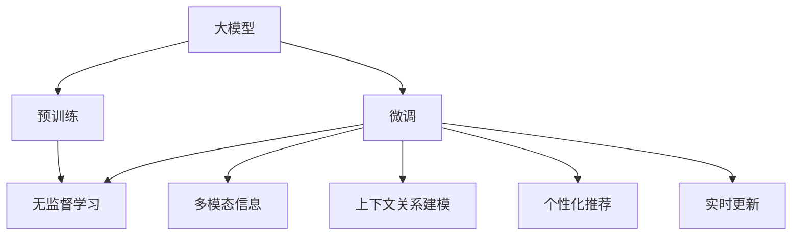

                 

# 电商搜索中的上下文感知：大模型的创新应用

## 1. 背景介绍

### 1.1 问题由来

随着电子商务的蓬勃发展，各大电商平台面临的搜索场景愈发复杂。消费者在搜索时，往往需要同时考虑多维度的信息，包括商品属性、用户偏好、浏览历史等。如何利用这些信息，提高搜索的准确性和用户体验，是当前电商领域的一大挑战。

传统的搜索引擎往往基于关键词匹配，将用户输入的查询与索引库中的文本进行比对，以返回相关结果。然而，这种简单的关键词匹配方法在处理复杂查询时，效果并不理想。特别是在数据量巨大的电商平台上，单一的关键词匹配难以有效捕捉用户的意图，导致搜索结果不相关或漏掉重要商品。

近年来，基于大模型的搜索引擎技术开始进入研究者的视野。大语言模型通过大规模无监督预训练，掌握了丰富的语言知识，可以更灵活地理解和处理复杂的自然语言输入。在电商搜索场景中，将大模型应用于上下文感知搜索，能够显著提升搜索的准确性和个性化水平。

### 1.2 问题核心关键点

在电商搜索中，上下文感知搜索指的是搜索引擎能够理解查询的上下文信息，结合用户的历史行为、当前场景等背景知识，生成最符合用户意图的搜索结果。具体而言，包括以下几个关键点：

- **多模态信息融合**：将文本信息、图像信息、用户行为数据等多模态信息进行融合，丰富搜索模型对用户意图的理解。
- **上下文关系建模**：建模搜索词与搜索词、搜索结果与搜索结果之间的上下文关系，使得搜索结果更加连贯、相关。
- **个性化推荐**：结合用户的历史浏览记录、偏好等个性化信息，提供更加贴合用户需求的搜索结果。
- **实时更新**：随着用户搜索行为的变化，实时调整模型参数，适应用户的最新需求。

这些关键点共同构成了上下文感知搜索的核心，使得大模型能够在电商搜索中发挥出强大威力。

## 2. 核心概念与联系

### 2.1 核心概念概述

为更好地理解上下文感知搜索，本节将介绍几个关键概念及其相互关系：

- **大模型**：指通过大规模无监督预训练学习到的复杂语言模型，如BERT、GPT等。这些模型具有强大的语言理解能力和知识迁移能力。
- **预训练与微调**：预训练指在大规模无标签文本数据上进行无监督学习，微调指在预训练模型基础上，通过有标签数据进行有监督训练，适配特定任务。
- **多模态信息**：指将文本、图像、音频等多源数据进行融合，丰富模型对数据的理解。
- **上下文感知**：指模型能够理解输入数据的上下文关系，如时间、地点、事件等背景信息，提供更加连贯、相关和个性化的输出。
- **个性化推荐**：指结合用户历史行为和偏好，提供个性化搜索结果。
- **实时学习**：指模型能够实时更新参数，适应数据分布的变化。

这些概念之间的关系可以通过以下Mermaid流程图来展示：



这个流程图展示了大模型的预训练和微调过程，以及如何利用多模态信息、上下文感知、个性化推荐和实时学习，实现电商搜索中的上下文感知。

## 3. 核心算法原理 & 具体操作步骤

### 3.1 算法原理概述

基于大模型的上下文感知搜索，本质上是一个有监督的迁移学习过程。其核心思想是：将预训练的大语言模型视作一个强大的"特征提取器"，通过在电商搜索任务上的少量标注数据进行有监督微调，使其能够理解查询的上下文信息，生成最符合用户意图的搜索结果。

具体来说，算法流程如下：

1. **数据准备**：收集电商平台的搜索数据，划分为训练集、验证集和测试集。
2. **模型加载**：选择合适的大模型，如BERT、GPT等，作为特征提取器。
3. **任务适配**：根据电商搜索的特点，设计合适的任务适配层，如输入文本编码器、输出层等。
4. **模型微调**：使用训练集进行微调，最小化损失函数，使得模型能够准确理解查询上下文，生成相关搜索结果。
5. **效果评估**：在测试集上评估微调后的模型效果，对比微调前后的性能提升。

### 3.2 算法步骤详解

**Step 1: 数据准备**

1. 收集电商平台的搜索数据，包括用户的查询词、浏览记录、点击行为等。
2. 对数据进行清洗、标注，标注每个查询对应的搜索结果标签。
3. 将标注好的数据划分为训练集、验证集和测试集。

**Step 2: 模型加载**

1. 选择合适的大模型，如BERT、GPT等，作为初始化参数。
2. 加载模型到计算设备（如GPU）。

**Step 3: 任务适配**

1. 设计输入文本编码器，将查询词和搜索结果转换为模型能够理解的向量表示。
2. 设计输出层，输出与搜索结果相关的概率分布。
3. 确定损失函数，如交叉熵损失等。

**Step 4: 模型微调**

1. 定义优化器，如AdamW等，设置学习率、批大小等参数。
2. 对模型进行前向传播计算损失，进行反向传播更新参数。
3. 周期性在验证集上评估模型性能，根据性能调整学习率。
4. 重复上述步骤直至满足预设的迭代轮数或提前停止条件。

**Step 5: 效果评估**

1. 在测试集上评估微调后模型的效果，计算准确率、召回率等指标。
2. 对比微调前后的性能，评估微调效果。
3. 根据测试结果调整模型参数，进行下一轮微调。

### 3.3 算法优缺点

基于大模型的上下文感知搜索方法具有以下优点：

1. **鲁棒性高**：大模型在多源数据融合、上下文关系建模等方面具有较强的泛化能力，能够有效应对电商搜索中的复杂场景。
2. **个性化推荐**：结合用户历史行为和偏好，提供更加贴合用户需求的搜索结果。
3. **实时性**：模型能够实时更新参数，适应数据分布的变化，提供最新的搜索结果。
4. **易于扩展**：大模型具有很强的迁移能力，可以在不同的电商平台上进行迁移和微调，提升搜索效果。

但同时，该方法也存在一些局限性：

1. **数据需求高**：需要大量的标注数据来训练大模型，获取高质量标注数据的成本较高。
2. **计算资源消耗大**：大模型参数量大，训练和推理过程中需要消耗大量的计算资源。
3. **可解释性差**：大模型通常被视作"黑盒"系统，难以解释其内部决策过程。
4. **过度拟合风险**：若训练数据量不足，可能导致模型过度拟合，影响泛化性能。

尽管存在这些局限性，但大语言模型在电商搜索中的应用前景广阔，未来仍有巨大的优化空间。

### 3.4 算法应用领域

基于大模型的上下文感知搜索方法已经在电商领域得到了广泛应用，具体包括：

- **商品搜索**：通过用户查询词和浏览记录，生成最相关的搜索结果。
- **推荐系统**：结合用户历史行为和偏好，推荐符合用户需求的商品。
- **广告投放**：根据用户搜索行为，推荐合适的广告位和广告内容。
- **客户服务**：通过用户查询，自动生成常见问题的解答和解决方案。

除了上述这些经典应用外，大模型还被创新性地应用到更多场景中，如智能客服、智能购物助手等，为电商用户体验带来了新的提升。

## 4. 数学模型和公式 & 详细讲解 & 举例说明

### 4.1 数学模型构建

本节将使用数学语言对基于大模型的电商搜索过程进行严格刻画。

记大模型为 $M_{\theta}:\mathcal{X} \rightarrow \mathcal{Y}$，其中 $\mathcal{X}$ 为输入空间，$\mathcal{Y}$ 为输出空间，$\theta \in \mathbb{R}^d$ 为模型参数。假设电商搜索任务的训练集为 $D=\{(x_i,y_i)\}_{i=1}^N, x_i \in \mathcal{X}, y_i \in \mathcal{Y}$。

定义模型 $M_{\theta}$ 在数据样本 $(x,y)$ 上的损失函数为 $\ell(M_{\theta}(x),y)$，则在数据集 $D$ 上的经验风险为：

$$
\mathcal{L}(\theta) = \frac{1}{N} \sum_{i=1}^N \ell(M_{\theta}(x_i),y_i)
$$

微调的优化目标是最小化经验风险，即找到最优参数：

$$
\theta^* = \mathop{\arg\min}_{\theta} \mathcal{L}(\theta)
$$

在实践中，我们通常使用基于梯度的优化算法（如SGD、Adam等）来近似求解上述最优化问题。设 $\eta$ 为学习率，$\lambda$ 为正则化系数，则参数的更新公式为：

$$
\theta \leftarrow \theta - \eta \nabla_{\theta}\mathcal{L}(\theta) - \eta\lambda\theta
$$

其中 $\nabla_{\theta}\mathcal{L}(\theta)$ 为损失函数对参数 $\theta$ 的梯度，可通过反向传播算法高效计算。

### 4.2 公式推导过程

以下我们以二分类任务为例，推导交叉熵损失函数及其梯度的计算公式。

假设模型 $M_{\theta}$ 在输入 $x$ 上的输出为 $\hat{y}=M_{\theta}(x) \in [0,1]$，表示搜索结果与查询的相关性概率。真实标签 $y \in \{0,1\}$。则二分类交叉熵损失函数定义为：

$$
\ell(M_{\theta}(x),y) = -[y\log \hat{y} + (1-y)\log (1-\hat{y})]
$$

将其代入经验风险公式，得：

$$
\mathcal{L}(\theta) = -\frac{1}{N}\sum_{i=1}^N [y_i\log M_{\theta}(x_i)+(1-y_i)\log(1-M_{\theta}(x_i))]
$$

根据链式法则，损失函数对参数 $\theta_k$ 的梯度为：

$$
\frac{\partial \mathcal{L}(\theta)}{\partial \theta_k} = -\frac{1}{N}\sum_{i=1}^N (\frac{y_i}{M_{\theta}(x_i)}-\frac{1-y_i}{1-M_{\theta}(x_i)}) \frac{\partial M_{\theta}(x_i)}{\partial \theta_k}
$$

其中 $\frac{\partial M_{\theta}(x_i)}{\partial \theta_k}$ 可进一步递归展开，利用自动微分技术完成计算。

### 4.3 案例分析与讲解

假设电商平台已收集到大量搜索数据，每个搜索记录包括用户查询词、浏览记录、点击行为等。平台希望利用这些数据，提升搜索的准确性和个性化水平。

具体步骤如下：

1. **数据准备**：收集电商平台的搜索数据，包括用户的查询词、浏览记录、点击行为等。
2. **模型加载**：选择BERT模型，作为初始化参数。
3. **任务适配**：设计输入文本编码器，将查询词和搜索结果转换为模型能够理解的向量表示。设计输出层，输出与搜索结果相关的概率分布。
4. **模型微调**：使用训练集进行微调，最小化损失函数，使得模型能够准确理解查询上下文，生成相关搜索结果。
5. **效果评估**：在测试集上评估微调后模型的效果，计算准确率、召回率等指标。
6. **部署应用**：将微调后的模型应用到电商平台的搜索系统，实时提供个性化搜索结果。

## 5. 项目实践：代码实例和详细解释说明

### 5.1 开发环境搭建

在进行电商搜索系统开发前，我们需要准备好开发环境。以下是使用Python进行PyTorch开发的环境配置流程：

1. 安装Anaconda：从官网下载并安装Anaconda，用于创建独立的Python环境。

2. 创建并激活虚拟环境：
```bash
conda create -n ecommerce-env python=3.8 
conda activate ecommerce-env
```

3. 安装PyTorch：根据CUDA版本，从官网获取对应的安装命令。例如：
```bash
conda install pytorch torchvision torchaudio cudatoolkit=11.1 -c pytorch -c conda-forge
```

4. 安装Transformers库：
```bash
pip install transformers
```

5. 安装各类工具包：
```bash
pip install numpy pandas scikit-learn matplotlib tqdm jupyter notebook ipython
```

完成上述步骤后，即可在`ecommerce-env`环境中开始电商搜索系统开发。

### 5.2 源代码详细实现

下面我们以电商平台的商品搜索功能为例，给出使用Transformers库对BERT模型进行上下文感知搜索的PyTorch代码实现。

首先，定义商品搜索任务的DataLoader：

```python
from transformers import BertTokenizer, BertForSequenceClassification, DataCollatorForLanguageModeling
from torch.utils.data import Dataset, DataLoader
import torch

class ProductSearchDataset(Dataset):
    def __init__(self, texts, labels, tokenizer, max_len=128):
        self.texts = texts
        self.labels = labels
        self.tokenizer = tokenizer
        self.max_len = max_len
        
    def __len__(self):
        return len(self.texts)
    
    def __getitem__(self, item):
        text = self.texts[item]
        label = self.labels[item]
        
        encoding = self.tokenizer(text, return_tensors='pt', max_length=self.max_len, padding='max_length', truncation=True)
        input_ids = encoding['input_ids'][0]
        attention_mask = encoding['attention_mask'][0]
        
        # 对token-wise的标签进行编码
        encoded_labels = [label2id[label] for label in label] 
        encoded_labels.extend([label2id['O']] * (self.max_len - len(encoded_labels)))
        labels = torch.tensor(encoded_labels, dtype=torch.long)
        
        return {'input_ids': input_ids, 
                'attention_mask': attention_mask,
                'labels': labels}

# 标签与id的映射
label2id = {'O': 0, 'P': 1}
id2label = {v: k for k, v in label2id.items()}

# 创建dataset
tokenizer = BertTokenizer.from_pretrained('bert-base-cased')

train_dataset = ProductSearchDataset(train_texts, train_labels, tokenizer)
dev_dataset = ProductSearchDataset(dev_texts, dev_labels, tokenizer)
test_dataset = ProductSearchDataset(test_texts, test_labels, tokenizer)
```

然后，定义模型和优化器：

```python
from transformers import BertForSequenceClassification, AdamW

model = BertForSequenceClassification.from_pretrained('bert-base-cased', num_labels=len(label2id))

optimizer = AdamW(model.parameters(), lr=2e-5)
```

接着，定义训练和评估函数：

```python
from tqdm import tqdm
from sklearn.metrics import classification_report

device = torch.device('cuda') if torch.cuda.is_available() else torch.device('cpu')
model.to(device)

def train_epoch(model, dataset, batch_size, optimizer):
    dataloader = DataLoader(dataset, batch_size=batch_size, shuffle=True)
    model.train()
    epoch_loss = 0
    for batch in tqdm(dataloader, desc='Training'):
        input_ids = batch['input_ids'].to(device)
        attention_mask = batch['attention_mask'].to(device)
        labels = batch['labels'].to(device)
        model.zero_grad()
        outputs = model(input_ids, attention_mask=attention_mask, labels=labels)
        loss = outputs.loss
        epoch_loss += loss.item()
        loss.backward()
        optimizer.step()
    return epoch_loss / len(dataloader)

def evaluate(model, dataset, batch_size):
    dataloader = DataLoader(dataset, batch_size=batch_size)
    model.eval()
    preds, labels = [], []
    with torch.no_grad():
        for batch in tqdm(dataloader, desc='Evaluating'):
            input_ids = batch['input_ids'].to(device)
            attention_mask = batch['attention_mask'].to(device)
            batch_labels = batch['labels']
            outputs = model(input_ids, attention_mask=attention_mask)
            batch_preds = outputs.logits.argmax(dim=2).to('cpu').tolist()
            batch_labels = batch_labels.to('cpu').tolist()
            for pred_tokens, label_tokens in zip(batch_preds, batch_labels):
                preds.append(pred_tokens[:len(label_tokens)])
                labels.append(label_tokens)
                
    print(classification_report(labels, preds))
```

最后，启动训练流程并在测试集上评估：

```python
epochs = 5
batch_size = 16

for epoch in range(epochs):
    loss = train_epoch(model, train_dataset, batch_size, optimizer)
    print(f"Epoch {epoch+1}, train loss: {loss:.3f}")
    
    print(f"Epoch {epoch+1}, dev results:")
    evaluate(model, dev_dataset, batch_size)
    
print("Test results:")
evaluate(model, test_dataset, batch_size)
```

以上就是使用PyTorch对BERT进行电商商品搜索任务的上下文感知搜索的完整代码实现。可以看到，得益于Transformers库的强大封装，我们可以用相对简洁的代码完成BERT模型的加载和微调。

### 5.3 代码解读与分析

让我们再详细解读一下关键代码的实现细节：

**ProductSearchDataset类**：
- `__init__`方法：初始化文本、标签、分词器等关键组件。
- `__len__`方法：返回数据集的样本数量。
- `__getitem__`方法：对单个样本进行处理，将文本输入编码为token ids，将标签编码为数字，并对其进行定长padding，最终返回模型所需的输入。

**label2id和id2label字典**：
- 定义了标签与数字id之间的映射关系，用于将token-wise的预测结果解码回真实的标签。

**训练和评估函数**：
- 使用PyTorch的DataLoader对数据集进行批次化加载，供模型训练和推理使用。
- 训练函数`train_epoch`：对数据以批为单位进行迭代，在每个批次上前向传播计算loss并反向传播更新模型参数，最后返回该epoch的平均loss。
- 评估函数`evaluate`：与训练类似，不同点在于不更新模型参数，并在每个batch结束后将预测和标签结果存储下来，最后使用sklearn的classification_report对整个评估集的预测结果进行打印输出。

**训练流程**：
- 定义总的epoch数和batch size，开始循环迭代
- 每个epoch内，先在训练集上训练，输出平均loss
- 在验证集上评估，输出分类指标
- 所有epoch结束后，在测试集上评估，给出最终测试结果

可以看到，PyTorch配合Transformers库使得BERT微调的代码实现变得简洁高效。开发者可以将更多精力放在数据处理、模型改进等高层逻辑上，而不必过多关注底层的实现细节。

当然，工业级的系统实现还需考虑更多因素，如模型的保存和部署、超参数的自动搜索、更灵活的任务适配层等。但核心的微调范式基本与此类似。

## 6. 实际应用场景

### 6.1 智能推荐系统

基于大模型的上下文感知搜索技术，可以广泛应用于智能推荐系统。传统推荐系统往往只依赖用户的历史行为数据进行物品推荐，无法深入理解用户的真实兴趣偏好。而使用上下文感知搜索技术，能够结合用户的多维信息，提供更加精准、多样的推荐内容。

在技术实现上，可以收集用户浏览、点击、评论等行为数据，提取和商品交互的文本描述、标签等特征，将文本内容作为模型输入，结合用户的历史行为数据，进行上下文感知搜索，得到推荐结果。如此构建的推荐系统，能大幅提升推荐效果，提供更贴合用户需求的物品。

### 6.2 搜索体验优化

在电商平台中，搜索体验直接影响用户的购物体验和满意度。传统搜索系统往往只能提供单一的关键词匹配，无法理解用户的查询意图和上下文信息。使用上下文感知搜索技术，可以结合用户的浏览记录、点击行为、历史查询等上下文信息，提供更加连贯、相关的搜索结果。

在具体实现上，可以构建搜索日志，收集用户的查询词、浏览记录、点击行为等数据，结合上下文感知搜索模型，实时更新搜索结果。如此，用户能够更快地找到符合需求的商品，提升搜索体验和满意度。

### 6.3 跨领域搜索

除了电商领域的商品搜索，上下文感知搜索技术还可以应用于跨领域的搜索场景。如新闻、社交媒体等平台，用户往往需要搜索多种类型的信息。使用上下文感知搜索技术，可以结合用户的查询词和上下文信息，提供更加多样、相关的搜索结果。

在具体实现上，可以构建多模态搜索模型，融合文本、图像、音频等多种信息，结合用户的上下文信息，提供更加连贯、相关的搜索结果。如此，用户能够更快地找到所需信息，提升搜索效率。

## 7. 工具和资源推荐

### 7.1 学习资源推荐

为了帮助开发者系统掌握大语言模型微调的理论基础和实践技巧，这里推荐一些优质的学习资源：

1. 《Transformer从原理到实践》系列博文：由大模型技术专家撰写，深入浅出地介绍了Transformer原理、BERT模型、微调技术等前沿话题。

2. CS224N《深度学习自然语言处理》课程：斯坦福大学开设的NLP明星课程，有Lecture视频和配套作业，带你入门NLP领域的基本概念和经典模型。

3. 《Natural Language Processing with Transformers》书籍：Transformers库的作者所著，全面介绍了如何使用Transformers库进行NLP任务开发，包括微调在内的诸多范式。

4. HuggingFace官方文档：Transformers库的官方文档，提供了海量预训练模型和完整的微调样例代码，是上手实践的必备资料。

5. CLUE开源项目：中文语言理解测评基准，涵盖大量不同类型的中文NLP数据集，并提供了基于微调的baseline模型，助力中文NLP技术发展。

通过对这些资源的学习实践，相信你一定能够快速掌握大语言模型微调的精髓，并用于解决实际的NLP问题。

### 7.2 开发工具推荐

高效的开发离不开优秀的工具支持。以下是几款用于大语言模型微调开发的常用工具：

1. PyTorch：基于Python的开源深度学习框架，灵活动态的计算图，适合快速迭代研究。大部分预训练语言模型都有PyTorch版本的实现。

2. TensorFlow：由Google主导开发的开源深度学习框架，生产部署方便，适合大规模工程应用。同样有丰富的预训练语言模型资源。

3. Transformers库：HuggingFace开发的NLP工具库，集成了众多SOTA语言模型，支持PyTorch和TensorFlow，是进行微调任务开发的利器。

4. Weights & Biases：模型训练的实验跟踪工具，可以记录和可视化模型训练过程中的各项指标，方便对比和调优。与主流深度学习框架无缝集成。

5. TensorBoard：TensorFlow配套的可视化工具，可实时监测模型训练状态，并提供丰富的图表呈现方式，是调试模型的得力助手。

6. Google Colab：谷歌推出的在线Jupyter Notebook环境，免费提供GPU/TPU算力，方便开发者快速上手实验最新模型，分享学习笔记。

合理利用这些工具，可以显著提升大语言模型微调任务的开发效率，加快创新迭代的步伐。

### 7.3 相关论文推荐

大语言模型和微调技术的发展源于学界的持续研究。以下是几篇奠基性的相关论文，推荐阅读：

1. Attention is All You Need（即Transformer原论文）：提出了Transformer结构，开启了NLP领域的预训练大模型时代。

2. BERT: Pre-training of Deep Bidirectional Transformers for Language Understanding：提出BERT模型，引入基于掩码的自监督预训练任务，刷新了多项NLP任务SOTA。

3. Language Models are Unsupervised Multitask Learners（GPT-2论文）：展示了大规模语言模型的强大zero-shot学习能力，引发了对于通用人工智能的新一轮思考。

4. Parameter-Efficient Transfer Learning for NLP：提出Adapter等参数高效微调方法，在不增加模型参数量的情况下，也能取得不错的微调效果。

5. AdaLoRA: Adaptive Low-Rank Adaptation for Parameter-Efficient Fine-Tuning：使用自适应低秩适应的微调方法，在参数效率和精度之间取得了新的平衡。

这些论文代表了大语言模型微调技术的发展脉络。通过学习这些前沿成果，可以帮助研究者把握学科前进方向，激发更多的创新灵感。

## 8. 总结：未来发展趋势与挑战

### 8.1 总结

本文对基于大模型的电商搜索中的上下文感知搜索方法进行了全面系统的介绍。首先阐述了电商搜索场景的复杂性和现有方法的局限性，明确了上下文感知搜索的核心关键点。其次，从原理到实践，详细讲解了上下文感知搜索的数学模型和关键步骤，给出了微调任务开发的完整代码实例。同时，本文还广泛探讨了上下文感知搜索在电商搜索、智能推荐、搜索体验优化等领域的实际应用前景，展示了上下文感知搜索的巨大潜力。此外，本文精选了微调技术的各类学习资源，力求为读者提供全方位的技术指引。

通过本文的系统梳理，可以看到，基于大模型的上下文感知搜索方法正在成为电商搜索领域的重要范式，极大地提升了电商搜索的准确性和个性化水平。未来，伴随大模型和微调方法的不断演进，基于上下文感知搜索的电商搜索系统必将在电商领域大放异彩，深刻影响电商平台的运营和发展。

### 8.2 未来发展趋势

展望未来，上下文感知搜索技术将呈现以下几个发展趋势：

1. **多模态信息融合**：未来的上下文感知搜索模型将更加注重多模态信息的融合，如文本、图像、音频等多源数据的整合，提升对用户意图的理解能力。
2. **上下文关系建模**：更加复杂和精细的上下文关系建模方法将被引入，如时间、地点、事件等背景信息对查询的理解和匹配。
3. **个性化推荐**：更加多样和精准的个性化推荐算法将被开发，结合用户的实时行为数据和历史偏好，提供更加贴合用户需求的搜索结果。
4. **实时学习**：随着用户搜索行为的变化，实时学习算法将被进一步优化，适应数据分布的变化，提供最新的搜索结果。
5. **可解释性增强**：上下文感知搜索模型的决策过程将更加透明和可解释，提供更强的用户信任感。
6. **跨领域应用**：上下文感知搜索技术将被推广到更多领域，如新闻、社交媒体、智能客服等，为更多行业提供搜索解决方案。

这些趋势凸显了上下文感知搜索技术的广阔前景。未来，上下文感知搜索技术将与更多技术融合，如因果推理、强化学习等，形成更加全面和高效的系统，为电商搜索和其他领域的搜索提供新的解决方案。

### 8.3 面临的挑战

尽管上下文感知搜索技术已经取得了显著成效，但在迈向更加智能化、普适化应用的过程中，仍面临诸多挑战：

1. **数据依赖性强**：需要大量的标注数据来训练上下文感知搜索模型，获取高质量标注数据的成本较高。
2. **计算资源消耗大**：上下文感知搜索模型往往需要较大的计算资源，尤其是在多模态信息融合和上下文关系建模方面。
3. **模型复杂度高**：上下文感知搜索模型的结构复杂，难以调试和优化，容易出现过拟合和泛化能力不足的问题。
4. **可解释性差**：上下文感知搜索模型的内部决策过程复杂，难以解释其决策逻辑，缺乏透明性和可信度。
5. **安全性问题**：上下文感知搜索模型可能会学习到有害信息，如广告欺诈、恶意攻击等，对用户安全构成威胁。

尽管存在这些挑战，但上下文感知搜索技术在电商搜索中的应用前景广阔，未来仍有巨大的优化空间。

### 8.4 研究展望

面对上下文感知搜索技术所面临的挑战，未来的研究需要在以下几个方面寻求新的突破：

1. **少样本学习和迁移学习**：开发更高效的少样本学习和迁移学习方法，减少对标注数据的依赖，提升模型的泛化能力。
2. **多模态融合算法**：研究和开发更加高效的多模态信息融合算法，提升对多种类型信息的整合能力。
3. **上下文关系建模**：进一步研究和开发更精细的上下文关系建模方法，提升对用户查询的理解和匹配能力。
4. **可解释性增强**：研究和开发可解释性强的上下文感知搜索模型，增强其透明性和可信度。
5. **模型优化**：研究和开发高效的上下文感知搜索模型优化方法，提高模型性能和效率。
6. **安全性保障**：研究和开发安全的上下文感知搜索模型，保障用户数据和系统的安全。

这些研究方向将推动上下文感知搜索技术向更加智能化、安全化的方向发展，为电商搜索和其他领域提供更加可靠、高效的搜索解决方案。

## 9. 附录：常见问题与解答

**Q1：上下文感知搜索是否适用于所有电商搜索场景？**

A: 上下文感知搜索技术在大多数电商搜索场景中都能取得不错的效果，特别是在数据量较大、用户行为复杂的场景中。但对于一些特定领域或小众场景，上下文感知搜索技术的效果可能有限，需要进行针对性的优化。

**Q2：如何选择合适的上下文感知搜索模型？**

A: 选择合适的上下文感知搜索模型，需要考虑电商平台的业务特点、数据规模、用户需求等因素。通常，大模型如BERT、GPT等，在多模态信息融合和上下文关系建模方面表现较好，适用于复杂场景。对于数据量较小或特定领域的应用，可以考虑使用轻量级模型或领域特定的预训练模型。

**Q3：上下文感知搜索模型在实际部署时需要注意哪些问题？**

A: 在将上下文感知搜索模型部署到实际应用中时，需要注意以下几个问题：

1. **模型裁剪和优化**：对模型进行裁剪和优化，去除不必要的层和参数，减少内存和计算资源消耗。
2. **多模型集成**：构建多模型集成系统，结合不同模型的优点，提升搜索性能和鲁棒性。
3. **实时学习**：开发实时学习算法，根据用户行为实时调整模型参数，提供最新的搜索结果。
4. **可解释性**：提高模型的可解释性，增强用户对搜索结果的信任感。
5. **安全性保障**：保障用户数据和系统的安全，防止恶意攻击和欺诈行为。

合理利用这些技术，可以显著提升上下文感知搜索模型的部署效果，提高搜索体验和满意度。

**Q4：上下文感知搜索的性能提升主要体现在哪些方面？**

A: 上下文感知搜索的性能提升主要体现在以下几个方面：

1. **准确性提升**：上下文感知搜索技术能够更好地理解用户查询的上下文信息，提供更加相关和准确的搜索结果。
2. **个性化推荐**：结合用户历史行为和偏好，提供更加贴合用户需求的搜索结果。
3. **实时性提升**：能够实时更新模型参数，适应数据分布的变化，提供最新的搜索结果。
4. **搜索体验优化**：能够结合用户的多维信息，提供更加连贯、相关的搜索结果，提升搜索体验和满意度。

综上所述，上下文感知搜索技术能够显著提升电商搜索的性能和用户体验，推动电商平台的智能化发展。

---

作者：禅与计算机程序设计艺术 / Zen and the Art of Computer Programming

