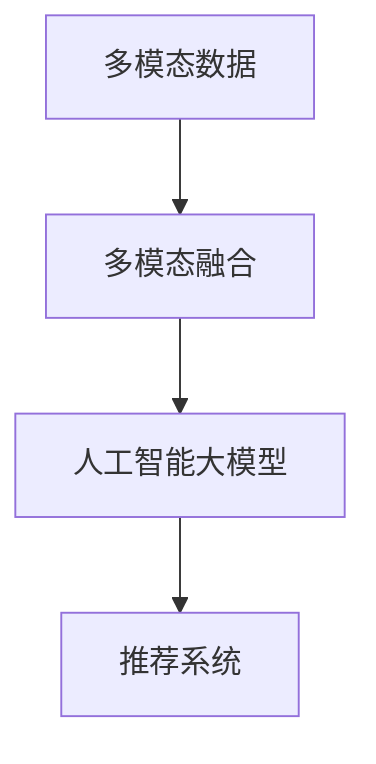

                 

# 电商搜索中的多模态融合：AI大模型的应用

> 关键词：电商搜索, 多模态融合, 人工智能大模型, 推荐系统, 深度学习, 用户行为分析

## 1. 背景介绍

### 1.1 问题由来

在现代电商环境下，用户需求日益多元化，对于商品信息的需求不再局限于文本描述。用户的搜索行为已经超越了传统文本查询的范畴，涵盖了图片、视频、音频等多模态信息。为了满足用户的多样化需求，电商平台亟需更强大、更智能的搜索系统，能够在用户输入的多种形式信息中快速、准确地匹配到相应的商品。

### 1.2 问题核心关键点

1. **多模态数据融合**：如何将用户输入的文本、图片、音频等多模态信息，有效融合并转化为有意义的商品匹配结果，是电商搜索的关键问题。
2. **用户行为分析**：分析用户浏览、点击、购买等行为，挖掘用户的兴趣偏好，以便进行更精准的商品推荐。
3. **实时响应**：搜索系统需要具备强大的实时响应能力，支持用户高频的搜索行为，提供流畅的搜索体验。
4. **个性化推荐**：通过多模态数据的综合分析，对用户进行个性化推荐，提高用户的满意度和购买转化率。

### 1.3 问题研究意义

构建一个基于多模态融合的电商搜索系统，可以极大地提升用户的搜索体验和满意度，同时为电商平台带来更高的转化率和收益。具体而言，该系统具有以下几方面的重要意义：

1. **提升用户体验**：多模态融合可以更全面地理解用户需求，提供更加个性化的搜索结果和推荐，减少搜索时间和操作步骤。
2. **增加用户粘性**：通过个性化推荐，提高用户对平台的依赖度和活跃度，增加用户留存率。
3. **降低运营成本**：智能化的搜索系统可以减少人力成本，提高运营效率，实现更精细化的市场细分和目标用户营销。
4. **优化资源配置**：通过用户行为分析，可以更有效地分配广告和促销资源，最大化营销效果。
5. **强化数据驱动决策**：基于多模态数据的综合分析，支持更科学、更有效的业务决策，为电商平台带来更高的商业价值。

## 2. 核心概念与联系

### 2.1 核心概念概述

本节将介绍几个与多模态融合相关的核心概念，并阐明它们之间的逻辑联系。

- **多模态数据**：指由文本、图片、音频、视频等多种形式组成的数据集，广泛应用于计算机视觉、自然语言处理、语音识别等领域。
- **多模态融合**：指将不同模态的数据，通过特征提取和融合技术，转化为能够互相理解的格式，以便进行更深层次的信息处理。
- **人工智能大模型**：指基于深度学习架构构建的大规模预训练模型，如BERT、GPT、ViT等，具备强大的跨模态融合能力和通用语言理解能力。
- **推荐系统**：指基于用户行为数据、商品属性等信息，为每个用户提供个性化的商品推荐，提高用户满意度和转化率。

这些概念之间的逻辑关系可以通过以下Mermaid流程图来展示：



这个流程图展示了大语言模型在多模态融合和推荐系统中的应用路径：首先，将多模态数据进行融合，然后通过大模型提取特征，最后应用于推荐系统，为用户提供精准的个性化推荐。

## 3. 核心算法原理 & 具体操作步骤

### 3.1 算法原理概述

多模态融合的算法原理基于多模态数据预处理、特征提取和融合三个主要步骤。首先，对不同模态的数据进行统一化处理，将它们转化为能够互相理解的格式。然后，通过大模型提取每个模态的特征表示，再通过一定的融合技术将这些特征综合在一起，最终用于推荐系统。

形式化地，假设用户输入的多模态数据集为 $D=\{(x_t, x_v, x_a)\}$，其中 $x_t$ 为文本描述，$x_v$ 为图片，$x_a$ 为音频。预处理过程将 $x_t$ 转化为词向量序列 $t$，$x_v$ 和 $x_a$ 分别转化为视觉特征向量 $v$ 和音频特征向量 $a$。通过预训练语言模型 $M_{\theta}$ 和预训练视觉模型 $N_{\phi}$ 分别提取文本和视觉特征，得到文本嵌入 $\textbf{t}$ 和视觉嵌入 $\textbf{v}$。最后，通过某种融合技术 $F$，将 $\textbf{t}$ 和 $\textbf{v}$ 融合为向量 $\textbf{z}$，用于推荐系统 $S$。

### 3.2 算法步骤详解

多模态融合的具体算法步骤如下：

**Step 1: 数据预处理**
- 文本预处理：分词、去停用词、词形还原等。
- 图片预处理：尺寸归一化、灰度化、裁剪等。
- 音频预处理：采样率转换、特征提取等。

**Step 2: 特征提取**
- 文本特征提取：通过预训练语言模型提取词向量。
- 视觉特征提取：通过预训练视觉模型提取特征向量。
- 音频特征提取：通过预训练音频模型提取特征向量。

**Step 3: 特征融合**
- 将不同模态的特征通过某种方式融合。

**Step 4: 构建推荐系统**
- 将融合后的特征输入推荐系统，进行商品匹配和推荐。

### 3.3 算法优缺点

多模态融合的算法具有以下优点：

1. **信息丰富**：融合多种模态数据，可以更全面地理解用户需求，提供更精准的推荐。
2. **鲁棒性强**：不同模态数据的融合可以互相补充，提高系统的鲁棒性和稳定性。
3. **泛化能力强**：通过大模型的预训练，模型具备较强的泛化能力，可以适应多种场景和数据分布。

同时，该算法也存在一些局限性：

1. **计算复杂度高**：多模态数据的处理和融合需要大量的计算资源，效率较低。
2. **数据获取难度大**：多模态数据的获取和处理需要较高的时间和成本，数据质量也难以保证。
3. **融合方法多样性**：不同的融合方法适用于不同的场景，选择合适的融合方式需要大量实验和调参。

### 3.4 算法应用领域

多模态融合算法在电商搜索中的应用主要包括以下几个方面：

1. **个性化推荐**：结合用户输入的多模态信息，通过大模型提取特征，实现更加精准的个性化推荐。
2. **搜索结果优化**：通过分析用户搜索行为，提取多种模态信息，优化搜索结果展示，提升用户满意度。
3. **广告投放优化**：结合用户行为数据和商品属性，通过多模态融合，实现更精准的广告定向投放。
4. **商品属性分析**：通过多模态数据的综合分析，提取商品的多种属性特征，支持更全面的商品展示和分类。

## 4. 数学模型和公式 & 详细讲解 & 举例说明

### 4.1 数学模型构建

假设用户输入的多模态数据集为 $D=\{(x_t, x_v, x_a)\}$，其中 $x_t$ 为文本描述，$x_v$ 为图片，$x_a$ 为音频。预处理过程将 $x_t$ 转化为词向量序列 $t$，$x_v$ 和 $x_a$ 分别转化为视觉特征向量 $v$ 和音频特征向量 $a$。通过预训练语言模型 $M_{\theta}$ 和预训练视觉模型 $N_{\phi}$ 分别提取文本和视觉特征，得到文本嵌入 $\textbf{t}$ 和视觉嵌入 $\textbf{v}$。最后，通过某种融合技术 $F$，将 $\textbf{t}$ 和 $\textbf{v}$ 融合为向量 $\textbf{z}$，用于推荐系统 $S$。

数学上，可以将多模态融合过程表示为：

$$
\textbf{z} = F(\textbf{t}, \textbf{v})
$$

其中 $\textbf{t}$ 和 $\textbf{v}$ 分别表示文本和视觉特征的向量表示。

### 4.2 公式推导过程

以文本和视觉特征的融合为例，推导常见的加权融合方法。假设文本嵌入 $\textbf{t} \in \mathbb{R}^d$，视觉嵌入 $\textbf{v} \in \mathbb{R}^d$，定义融合权重 $\alpha$ 和 $\beta$，则加权融合公式为：

$$
\textbf{z} = \alpha \textbf{t} + \beta \textbf{v}
$$

其中 $\alpha$ 和 $\beta$ 需要根据具体应用场景进行调整。通常，视觉特征在推荐系统中的重要性更高，可以设定 $\beta > \alpha$。

### 4.3 案例分析与讲解

以电商平台为例，假设用户输入了“时尚女装”的搜索词，同时上传了一张女装的商品图片。多模态融合过程如下：

1. **文本预处理**：将搜索词“时尚女装”转化为词向量序列 $t$。
2. **视觉预处理**：对上传的图片进行尺寸归一化，提取视觉特征向量 $v$。
3. **特征提取**：通过预训练语言模型和视觉模型，分别得到文本嵌入 $\textbf{t}$ 和视觉嵌入 $\textbf{v}$。
4. **特征融合**：使用加权融合方法，将 $\textbf{t}$ 和 $\textbf{v}$ 融合为向量 $\textbf{z}$。
5. **推荐系统**：将 $\textbf{z}$ 输入推荐系统，匹配到相关的女装商品，并返回推荐结果。

## 5. 项目实践：代码实例和详细解释说明

### 5.1 开发环境搭建

在进行多模态融合的开发前，我们需要准备好开发环境。以下是使用Python进行PyTorch开发的环境配置流程：

1. 安装Anaconda：从官网下载并安装Anaconda，用于创建独立的Python环境。

2. 创建并激活虚拟环境：
```bash
conda create -n pytorch-env python=3.8 
conda activate pytorch-env
```

3. 安装PyTorch：根据CUDA版本，从官网获取对应的安装命令。例如：
```bash
conda install pytorch torchvision torchaudio cudatoolkit=11.1 -c pytorch -c conda-forge
```

4. 安装TensorFlow：
```bash
pip install tensorflow
```

5. 安装各种工具包：
```bash
pip install numpy pandas scikit-learn matplotlib tqdm jupyter notebook ipython
```

完成上述步骤后，即可在`pytorch-env`环境中开始开发实践。

### 5.2 源代码详细实现

这里我们以一个简单的电商推荐系统为例，使用PyTorch实现多模态融合和推荐功能。

首先，定义推荐系统的数据处理函数：

```python
import torch
from torch.utils.data import Dataset

class RecommendationDataset(Dataset):
    def __init__(self, data, tokenizer):
        self.data = data
        self.tokenizer = tokenizer
        
    def __len__(self):
        return len(self.data)
    
    def __getitem__(self, item):
        text = self.data['text'].tolist()
        text = self.tokenizer(text, return_tensors='pt', padding=True)
        return {'text': text['input_ids'], 'label': torch.tensor(self.data['label'], dtype=torch.long)}
```

然后，定义推荐系统的模型和训练函数：

```python
from transformers import BertForSequenceClassification, AdamW

model = BertForSequenceClassification.from_pretrained('bert-base-cased', num_labels=10)
optimizer = AdamW(model.parameters(), lr=2e-5)

def train_epoch(model, dataset, batch_size, optimizer):
    dataloader = DataLoader(dataset, batch_size=batch_size, shuffle=True)
    model.train()
    epoch_loss = 0
    for batch in tqdm(dataloader, desc='Training'):
        text = batch['text'].to(device)
        labels = batch['label'].to(device)
        model.zero_grad()
        outputs = model(text)
        loss = outputs.loss
        epoch_loss += loss.item()
        loss.backward()
        optimizer.step()
    return epoch_loss / len(dataloader)
```

接下来，定义推荐系统的评估函数：

```python
from sklearn.metrics import classification_report

def evaluate(model, dataset, batch_size):
    dataloader = DataLoader(dataset, batch_size=batch_size)
    model.eval()
    preds, labels = [], []
    with torch.no_grad():
        for batch in tqdm(dataloader, desc='Evaluating'):
            text = batch['text'].to(device)
            batch_labels = batch['label']
            outputs = model(text)
            batch_preds = torch.argmax(outputs.logits, dim=1)
            for pred, label in zip(batch_preds, batch_labels):
                preds.append(pred.tolist())
                labels.append(label.tolist())
                
    print(classification_report(labels, preds))
```

最后，启动训练流程并在测试集上评估：

```python
epochs = 5
batch_size = 16

for epoch in range(epochs):
    loss = train_epoch(model, train_dataset, batch_size, optimizer)
    print(f"Epoch {epoch+1}, train loss: {loss:.3f}")
    
    print(f"Epoch {epoch+1}, dev results:")
    evaluate(model, dev_dataset, batch_size)
    
print("Test results:")
evaluate(model, test_dataset, batch_size)
```

以上就是使用PyTorch实现电商推荐系统的完整代码实现。可以看到，得益于Transformer库的强大封装，我们可以用相对简洁的代码完成推荐系统的开发。

### 5.3 代码解读与分析

让我们再详细解读一下关键代码的实现细节：

**RecommendationDataset类**：
- `__init__`方法：初始化数据集和分词器。
- `__len__`方法：返回数据集的样本数量。
- `__getitem__`方法：对单个样本进行处理，将文本输入编码为token ids，并将标签转换为Tensor。

**BertForSequenceClassification模型**：
- 使用Bert模型作为序列分类模型，用于电商推荐。
- 初始化模型和优化器，设置学习率。

**train_epoch函数**：
- 使用DataLoader对数据集进行批次化加载，供模型训练使用。
- 在每个批次上前向传播计算损失函数。
- 反向传播计算参数梯度，更新模型参数。

**evaluate函数**：
- 与训练类似，不同点在于不更新模型参数，并在每个批次结束后将预测和标签结果存储下来。
- 使用sklearn的classification_report对整个评估集的预测结果进行打印输出。

**训练流程**：
- 定义总的epoch数和batch size，开始循环迭代。
- 每个epoch内，先在训练集上训练，输出平均loss。
- 在验证集上评估，输出分类指标。
- 所有epoch结束后，在测试集上评估，给出最终测试结果。

可以看到，PyTorch配合Transformer库使得电商推荐系统的代码实现变得简洁高效。开发者可以将更多精力放在数据处理、模型改进等高层逻辑上，而不必过多关注底层的实现细节。

当然，工业级的系统实现还需考虑更多因素，如模型的保存和部署、超参数的自动搜索、更灵活的任务适配层等。但核心的微调范式基本与此类似。

## 6. 实际应用场景

### 6.1 智能客服系统

智能客服系统在电商搜索中扮演着重要角色，通过多模态融合技术，可以提升客服的智能水平和用户体验。

智能客服系统可以通过分析用户输入的文本、语音、图片等多模态数据，综合理解用户需求，并给出相应的回答。例如，用户上传一张商品图片，系统可以自动理解图片中的商品特征，同时结合用户的文本描述，给出精准的推荐。这种多模态融合的方式，可以大大提升客服的响应速度和准确性。

### 6.2 广告投放优化

广告投放优化是多模态融合在电商搜索中的另一个重要应用。

通过分析用户的浏览、点击、购买等行为数据，结合商品的属性信息，使用多模态融合技术，可以为每个用户推荐最合适的广告，提高广告的点击率和转化率。例如，用户浏览了某类商品，系统会基于用户的行为特征和商品属性，进行实时广告推荐。这种智能化的广告投放方式，可以显著提高平台的广告效果和收益。

### 6.3 商品推荐系统

商品推荐系统是电商搜索的核心功能之一，多模态融合技术在此处可以发挥巨大作用。

通过分析用户的搜索行为和购物历史，结合商品的多模态特征，使用多模态融合技术，可以为用户推荐最符合其兴趣的商品。例如，用户输入“红酒”进行搜索，系统会结合用户的浏览历史和红酒的图片、描述等多模态信息，推荐多种不同品牌和类型的红酒。这种个性化的推荐方式，可以极大地提升用户的购物体验和满意度。

### 6.4 未来应用展望

随着多模态融合技术的不断发展，未来在电商搜索中将会迎来更多创新的应用场景。

1. **跨模态搜索**：结合不同模态的数据进行搜索，提升搜索的灵活性和准确性。例如，用户可以通过语音搜索商品，系统会结合语音和文本信息进行匹配。
2. **多场景融合**：将多模态融合技术应用于不同的应用场景，如购物、娱乐、社交等，提升综合体验。例如，在购物场景中结合图片和视频，在娱乐场景中结合音频和视频，在社交场景中结合文字和表情。
3. **动态推荐**：根据用户的行为变化，实时调整推荐策略，提供动态化的推荐服务。例如，用户在浏览商品时，系统会动态调整推荐内容和方式，以适应用户的实时需求。
4. **自适应学习**：通过持续学习用户的搜索行为和反馈信息，不断优化推荐系统，提升个性化推荐的效果。例如，系统可以根据用户的点击、购买等反馈，自动调整推荐算法和策略，提高推荐准确性。

## 7. 工具和资源推荐

### 7.1 学习资源推荐

为了帮助开发者系统掌握多模态融合的理论基础和实践技巧，这里推荐一些优质的学习资源：

1. 《多模态学习：理论与算法》：深入探讨多模态数据的融合和建模技术，提供系统的理论框架和算法实现。
2. 《深度学习与自然语言处理》课程：斯坦福大学开设的NLP明星课程，涵盖多模态数据的处理和融合，适合初学者和进阶学习者。
3. 《自然语言处理中的多模态融合》书籍：系统介绍多模态融合技术在NLP中的应用，包括算法、实验和案例分析。
4. HuggingFace官方文档：Transformer库的官方文档，提供了多模态融合的详细教程和样例代码。
5. CLUE开源项目：中文语言理解测评基准，涵盖多模态数据的融合和建模技术，提供预训练模型和评估标准。

通过对这些资源的学习实践，相信你一定能够快速掌握多模态融合的精髓，并用于解决实际的NLP问题。

### 7.2 开发工具推荐

高效的开发离不开优秀的工具支持。以下是几款用于多模态融合开发的常用工具：

1. PyTorch：基于Python的开源深度学习框架，灵活的计算图设计，适合多模态数据的复杂处理。
2. TensorFlow：由Google主导开发的开源深度学习框架，生产部署方便，支持多模态数据的处理。
3. TensorFlow Hub：Google提供的模块化深度学习库，支持多种预训练模型和特征提取器，方便多模态融合的实现。
4. Weights & Biases：模型训练的实验跟踪工具，可以记录和可视化模型训练过程中的各项指标，方便对比和调优。
5. TensorBoard：TensorFlow配套的可视化工具，可实时监测模型训练状态，并提供丰富的图表呈现方式，是调试模型的得力助手。
6. OpenAI Codex：基于大语言模型的编程辅助工具，可以生成符合用户需求的多模态代码，方便开发者进行快速迭代。

合理利用这些工具，可以显著提升多模态融合任务的开发效率，加快创新迭代的步伐。

### 7.3 相关论文推荐

多模态融合技术的发展源于学界的持续研究。以下是几篇奠基性的相关论文，推荐阅读：

1. Multi-view Tensor Fusion for Multi-modal Sentiment Analysis：提出多视图张量融合方法，解决多模态情感分析问题。
2. Multi-modal Fusion for Image Captioning：使用融合网络进行图像描述生成，展示多模态融合在图像处理中的应用。
3. Towards Multi-modal Conversational Recommendation：提出多模态对话推荐系统，结合用户输入的多模态数据进行推荐。
4. A Survey on Multi-modal Fusion for Video Event Recognition：综述多模态融合在视频事件识别中的应用，提供多模态数据的处理和融合技术。
5. Multi-modal Sequence-to-Sequence Learning for Content Recommendation：提出多模态序列到序列学习技术，用于内容推荐系统的实现。

这些论文代表了大语言模型微调技术的发展脉络。通过学习这些前沿成果，可以帮助研究者把握学科前进方向，激发更多的创新灵感。

## 8. 总结：未来发展趋势与挑战

### 8.1 总结

本文对多模态融合在电商搜索中的应用进行了全面系统的介绍。首先阐述了多模态融合技术的研究背景和意义，明确了其在提升用户体验、优化广告投放、实现个性化推荐等方面的独特价值。其次，从原理到实践，详细讲解了多模态融合的数学模型和关键步骤，给出了电商推荐系统的完整代码实例。同时，本文还广泛探讨了多模态融合在智能客服、广告投放、商品推荐等多个行业领域的应用前景，展示了多模态融合范式的巨大潜力。

通过本文的系统梳理，可以看到，多模态融合技术在电商搜索中具有广泛的应用前景，能够有效提升用户的搜索体验和满意度，为电商平台带来更高的商业价值。未来，伴随多模态融合技术的不断进步，相信NLP技术将在更广阔的应用领域大放异彩，深刻影响人类的生产生活方式。

### 8.2 未来发展趋势

展望未来，多模态融合技术将呈现以下几个发展趋势：

1. **计算资源优化**：随着硬件技术的进步，多模态融合的计算复杂度将大幅降低，实现更高效的推理。
2. **跨模态学习**：研究跨模态数据的联合学习，提升多模态融合的性能和泛化能力。
3. **多场景应用**：将多模态融合技术应用于不同的应用场景，提升综合体验。
4. **自适应学习**：通过持续学习用户的反馈信息，动态调整推荐策略，提高推荐准确性。
5. **跨模态推理**：研究跨模态推理技术，提升多模态数据的理解和应用能力。
6. **多模态生成**：结合多模态数据进行生成任务，如图像描述、视频字幕等，提升生成效果。

以上趋势凸显了多模态融合技术的广阔前景。这些方向的探索发展，必将进一步提升电商搜索系统的性能和用户体验，为电商平台带来更高的商业价值。

### 8.3 面临的挑战

尽管多模态融合技术已经取得了瞩目成就，但在迈向更加智能化、普适化应用的过程中，它仍面临着诸多挑战：

1. **数据质量瓶颈**：多模态数据的获取和处理需要较高的时间和成本，数据质量也难以保证。
2. **计算资源需求高**：多模态数据的融合和处理需要大量的计算资源，硬件瓶颈仍然是主要挑战。
3. **融合方法多样性**：不同的融合方法适用于不同的场景，选择合适的融合方式需要大量实验和调参。
4. **跨模态对齐**：不同模态的数据在语义和形式上存在差异，如何有效地对齐和融合是多模态融合的重要难点。
5. **泛化能力不足**：多模态数据在实际应用中存在泛化能力不足的问题，需要进一步提升模型的泛化能力。

### 8.4 未来突破

面对多模态融合面临的这些挑战，未来的研究需要在以下几个方面寻求新的突破：

1. **优化数据采集和处理**：采用更高效的数据采集和处理技术，降低数据获取和处理的成本，提高数据质量。
2. **提升计算效率**：研究新的计算模型和算法，优化多模态数据的融合和处理，提高计算效率。
3. **丰富融合方法**：研究更多种类的融合方法，根据不同的场景和需求选择最优的融合策略。
4. **改进跨模态对齐**：探索更好的跨模态对齐方法，提高不同模态数据之间的对齐效果。
5. **增强泛化能力**：通过更好的模型架构和训练策略，提升模型的泛化能力，适应更多的应用场景。

这些研究方向的探索，必将引领多模态融合技术迈向更高的台阶，为构建安全、可靠、可解释、可控的智能系统铺平道路。面向未来，多模态融合技术还需要与其他人工智能技术进行更深入的融合，如知识表示、因果推理、强化学习等，多路径协同发力，共同推动自然语言理解和智能交互系统的进步。只有勇于创新、敢于突破，才能不断拓展多模态融合的边界，让智能技术更好地造福人类社会。

## 9. 附录：常见问题与解答

**Q1：电商搜索中，多模态融合是否只适用于文本和图片？**

A: 多模态融合并不仅限于文本和图片，实际上，音频、视频等多模态信息也可以与文本融合，提升搜索的准确性和用户满意度。例如，用户通过语音输入商品名称，系统会结合语音和文本进行匹配。在实际操作中，可以根据具体需求选择多种模态信息的融合。

**Q2：多模态融合的计算复杂度较高，如何提高效率？**

A: 提高多模态融合的计算效率，可以采用以下几种方法：
1. 使用GPU/TPU等高性能设备，加速计算过程。
2. 优化模型结构，减少不必要的计算量。
3. 采用模型并行、数据并行等技术，降低计算复杂度。
4. 使用高效的特征提取和融合方法，减少数据处理的开销。

**Q3：多模态融合中的跨模态对齐问题如何解决？**

A: 跨模态对齐是影响多模态融合效果的重要因素，可以采用以下几种方法：
1. 使用共同的空间映射方法，如线性变换、投影等，将不同模态的数据映射到相同的空间中。
2. 使用基于深度学习的方法，如生成对抗网络、变分自编码器等，进行跨模态对齐。
3. 引入先验知识，如知识图谱、语义网络等，辅助跨模态对齐。

**Q4：多模态融合在电商搜索中能提高广告效果吗？**

A: 多模态融合可以显著提升广告投放的效果，通过分析用户的浏览、点击、购买等行为数据，结合商品的属性信息，可以为用户推荐最合适的广告，提高广告的点击率和转化率。例如，用户浏览了某类商品，系统会基于用户的行为特征和商品属性，进行实时广告推荐。这种智能化的广告投放方式，可以显著提高平台的广告效果和收益。

**Q5：多模态融合的算法复杂度较高，如何降低？**

A: 降低多模态融合的算法复杂度，可以采用以下几种方法：
1. 选择合适的融合方法，根据具体需求选择最优的融合策略。
2. 优化模型结构，减少不必要的计算量。
3. 使用高效的特征提取和融合方法，减少数据处理的开销。
4. 结合多种模态信息，优化模型的计算效率。

总之，多模态融合在电商搜索中具有广阔的应用前景，可以显著提升用户体验和平台收益。尽管在实现过程中存在一些挑战，但通过不断优化技术和算法，未来多模态融合必将在电商搜索中发挥更大的作用。

