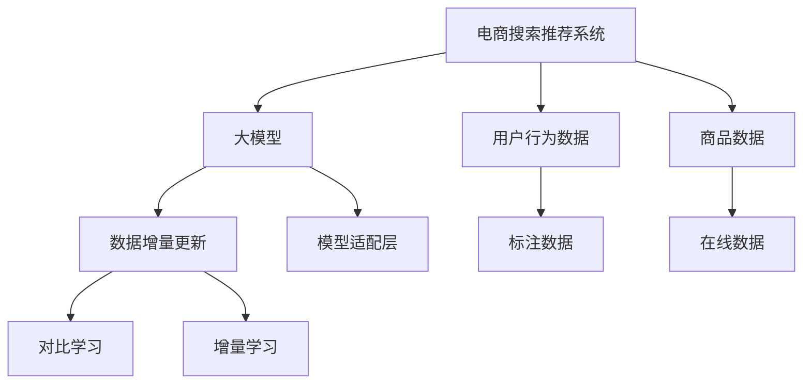

                 

# 电商搜索推荐中的AI大模型数据增量更新机制优化方案

> 关键词：电商搜索推荐, 数据增量更新, 大模型, AI技术, 优化方案

## 1. 背景介绍

随着电子商务平台的快速发展，电商搜索推荐系统成为提升用户体验、促进用户转化的关键引擎。传统搜索推荐系统依赖于基于规则、统计和机器学习的方法，难以满足不断变化的个性化需求。近年来，基于深度学习的大模型在电商搜索推荐中得到了广泛应用，大幅提升了系统的个性化能力。然而，随着数据量的不断增加，如何高效、实时地更新大模型的参数，成为一个迫切需要解决的问题。

## 2. 核心概念与联系

### 2.1 核心概念概述

为了更好地理解电商搜索推荐中大模型数据增量更新机制，本节将介绍几个关键概念：

- 电商搜索推荐系统：基于电商平台用户行为数据，利用AI技术，为用户提供个性化的搜索结果和商品推荐。
- 大模型：指以深度神经网络为代表的、具有亿级参数规模的模型，如BERT、GPT-3等。通过在大规模无标签数据上进行预训练，具备强大的数据建模和泛化能力。
- 数据增量更新：指在大模型预训练完成并投入使用后，通过新增的标注数据和在线数据，对模型参数进行动态更新，以保持其性能和时效性。
- 模型适配层：在大模型顶部添加的任务适配层，用于实现特定任务的数据处理和输出计算。
- 对比学习：通过对比样本的相似度优化模型参数，提升模型对新数据的适应能力。
- 增量学习：指模型在运行过程中，不断学习新数据，更新模型参数以应对数据分布的变化。

这些概念之间的逻辑关系可以通过以下Mermaid流程图来展示：



这个流程图展示了大模型在电商搜索推荐系统中的核心概念及其之间的关系：

1. 电商搜索推荐系统通过大模型进行个性化推荐。
2. 大模型通过在线数据和标注数据的增量更新，实时适应数据分布变化。
3. 对比学习和大模型增量学习共同优化模型，提升推荐效果。
4. 模型适配层实现任务特定的数据处理和输出计算。

## 3. 核心算法原理 & 具体操作步骤
### 3.1 算法原理概述

电商搜索推荐中的大模型数据增量更新机制，本质上是一种在线学习过程。其核心思想是：在大模型预训练完成后，通过实时收集和增量化的用户行为数据，动态更新模型参数，以提升模型的个性化推荐能力。

假设电商平台有用户行为数据流 $\{D_t\}$，其中 $D_t$ 表示第 $t$ 时间点的用户行为数据。设大模型为 $M_{\theta}$，其中 $\theta$ 为大模型的参数。增量更新的目标是通过不断学习 $D_t$，更新模型参数 $\theta$，使得 $M_{\theta}$ 能够更好地拟合新数据，提升推荐效果。

形式化地，假设模型在 $t-1$ 时间点的参数为 $\theta_{t-1}$，在 $t$ 时间点的新增数据为 $D_t$，增量更新的目标是找到新的参数 $\theta_t$，使得：

$$
\theta_t=\mathop{\arg\min}_{\theta} \mathcal{L}(M_{\theta},D_t)
$$

其中 $\mathcal{L}$ 为模型在 $D_t$ 上的损失函数，用于衡量推荐效果。常见的损失函数包括交叉熵损失、均方误差损失等。

### 3.2 算法步骤详解

电商搜索推荐中大模型数据增量更新的主要步骤包括：

**Step 1: 准备预训练模型和数据流**

- 选择合适的预训练大模型 $M_{\theta_{t-1}}$，将其作为初始化参数。
- 收集电商平台的实时用户行为数据流 $\{D_t\}$，划分为训练集和验证集。

**Step 2: 设计任务适配层**

- 根据电商搜索推荐系统的需求，在预训练模型顶部设计任务适配层，用于处理用户行为数据并输出推荐结果。
- 例如，对于点击率预测任务，可以在模型顶部添加一个全连接层，输出点击概率。

**Step 3: 设置增量更新超参数**

- 选择合适的优化算法及其参数，如 Adam、SGD 等，设置学习率、批大小、迭代轮数等。
- 设置正则化技术及强度，包括权重衰减、Dropout、Early Stopping 等。
- 确定保留预训练的部分层，如底层，只增量更新顶层，减少需优化的参数。

**Step 4: 增量训练**

- 将实时用户行为数据流 $\{D_t\}$ 分批次输入模型，前向传播计算损失函数。
- 反向传播计算参数梯度，根据设定的优化算法和学习率更新模型参数。
- 周期性在验证集上评估模型性能，根据性能指标决定是否触发 Early Stopping。
- 重复上述步骤直到满足预设的迭代轮数或 Early Stopping 条件。

**Step 5: 运行时预测**

- 在新的用户行为数据上，利用增量更新后的模型 $M_{\theta_t}$ 进行预测，返回推荐结果。

以上就是电商搜索推荐中大模型数据增量更新的主要流程。在实际应用中，还需要根据具体任务的特点，对增量更新过程的各个环节进行优化设计，如改进训练目标函数，引入更多的正则化技术，搜索最优的超参数组合等，以进一步提升模型性能。

### 3.3 算法优缺点

电商搜索推荐中大模型数据增量更新方法具有以下优点：

1. 实时适应数据分布：通过不断学习新数据，模型能够实时适应数据分布的变化，提升推荐效果。
2. 参数效率高：采用增量学习方式，避免了从头训练大模型的计算和内存开销。
3. 提升个性化推荐：增量更新能够及时捕捉用户的最新行为，提升个性化推荐能力。
4. 应用广泛：适用于各种电商搜索推荐任务，如点击率预测、转化率优化、召回率提升等。

同时，该方法也存在一定的局限性：

1. 过拟合风险：若数据分布差异较大，模型可能过拟合于历史数据，导致在新数据上性能下降。
2. 计算复杂度高：增量更新需要频繁计算梯度和更新参数，计算复杂度较高。
3. 数据质量要求高：增量更新的效果很大程度上依赖于数据质量，如标注数据、在线数据等。
4. 部署成本高：需要在线上部署大模型，并实时更新参数，部署成本较高。

尽管存在这些局限性，但就目前而言，基于增量学习的大模型方法仍是大规模推荐系统中的主流范式。未来相关研究的重点在于如何进一步降低增量更新的计算复杂度，提高模型的鲁棒性和泛化能力，同时兼顾可解释性和伦理安全性等因素。

### 3.4 算法应用领域

基于大模型增量学习的方法在电商搜索推荐系统中已经得到了广泛的应用，适用于以下典型场景：

- 点击率预测：利用用户点击历史数据，训练模型预测用户点击概率。
- 转化率优化：通过分析用户购买行为，训练模型预测用户购买概率。
- 召回率提升：根据用户搜索记录，训练模型预测用户感兴趣的商品。
- 商品排序：对搜索结果进行排序，提升用户体验和转化率。
- 个性化推荐：结合用户行为数据和商品属性，训练模型进行个性化推荐。

除了上述这些经典任务外，大模型增量学习还被创新性地应用于更多场景中，如购物车推荐、商品搭配推荐、广告投放优化等，为电商推荐系统带来了全新的突破。随着增量学习方法的不断进步，相信电商推荐系统将在更广阔的应用领域大放异彩。

## 4. 数学模型和公式 & 详细讲解  
### 4.1 数学模型构建

本节将使用数学语言对电商搜索推荐中大模型增量更新过程进行更加严格的刻画。

设电商平台用户行为数据流 $\{D_t\}$ 中的样本为 $(x_i,y_i)$，其中 $x_i$ 为输入，$y_i$ 为标签。增量更新模型的目标是最小化经验风险：

$$
\mathcal{L}(\theta) = \frac{1}{N}\sum_{t=1}^T \sum_{i=1}^{N_t} \ell(M_{\theta}(x_i),y_i)
$$

其中 $N_t$ 表示时间 $t$ 的样本数量，$\ell$ 为损失函数。假设模型在 $t-1$ 时间点的参数为 $\theta_{t-1}$，在 $t$ 时间点的增量更新为 $\Delta\theta_t$，则更新后的参数为 $\theta_t=\theta_{t-1}+\Delta\theta_t$。增量更新的目标是最小化经验风险：

$$
\Delta\theta_t = \mathop{\arg\min}_{\Delta\theta} \mathcal{L}(\theta_{t-1}+\Delta\theta,D_t)
$$

在实践中，我们通常使用基于梯度的优化算法（如SGD、Adam等）来近似求解上述最优化问题。设 $\eta$ 为学习率，$\lambda$ 为正则化系数，则参数的更新公式为：

$$
\Delta\theta_t = -\eta\nabla_{\theta}\mathcal{L}(\theta_{t-1}+\Delta\theta,D_t) - \eta\lambda\Delta\theta_t
$$

其中 $\nabla_{\theta}\mathcal{L}(\theta_{t-1}+\Delta\theta,D_t)$ 为损失函数对参数 $\theta$ 的梯度，可通过反向传播算法高效计算。

### 4.2 公式推导过程

以下我们以点击率预测任务为例，推导交叉熵损失函数及其梯度的计算公式。

假设模型 $M_{\theta}$ 在输入 $x$ 上的输出为 $\hat{y}=M_{\theta}(x) \in [0,1]$，表示用户点击的概率。真实标签 $y \in \{0,1\}$。则二分类交叉熵损失函数定义为：

$$
\ell(M_{\theta}(x),y) = -[y\log \hat{y} + (1-y)\log (1-\hat{y})]
$$

将其代入经验风险公式，得：

$$
\mathcal{L}(\theta) = -\frac{1}{N}\sum_{t=1}^T \sum_{i=1}^{N_t} [y_i\log M_{\theta}(x_i)+(1-y_i)\log(1-M_{\theta}(x_i))]
$$

根据链式法则，损失函数对参数 $\theta_k$ 的梯度为：

$$
\frac{\partial \mathcal{L}(\theta)}{\partial \theta_k} = -\frac{1}{N}\sum_{t=1}^T \sum_{i=1}^{N_t} (\frac{y_i}{M_{\theta}(x_i)}-\frac{1-y_i}{1-M_{\theta}(x_i)}) \frac{\partial M_{\theta}(x_i)}{\partial \theta_k}
$$

其中 $\frac{\partial M_{\theta}(x_i)}{\partial \theta_k}$ 可进一步递归展开，利用自动微分技术完成计算。

在得到损失函数的梯度后，即可带入参数更新公式，完成模型的迭代优化。重复上述过程直至收敛，最终得到适应电商数据流的最优模型参数 $\theta_t$。

## 5. 项目实践：代码实例和详细解释说明
### 5.1 开发环境搭建

在进行增量学习实践前，我们需要准备好开发环境。以下是使用Python进行PyTorch开发的环境配置流程：

1. 安装Anaconda：从官网下载并安装Anaconda，用于创建独立的Python环境。

2. 创建并激活虚拟环境：
```bash
conda create -n pytorch-env python=3.8 
conda activate pytorch-env
```

3. 安装PyTorch：根据CUDA版本，从官网获取对应的安装命令。例如：
```bash
conda install pytorch torchvision torchaudio cudatoolkit=11.1 -c pytorch -c conda-forge
```

4. 安装Transformers库：
```bash
pip install transformers
```

5. 安装各类工具包：
```bash
pip install numpy pandas scikit-learn matplotlib tqdm jupyter notebook ipython
```

完成上述步骤后，即可在`pytorch-env`环境中开始增量学习实践。

### 5.2 源代码详细实现

这里我们以电商点击率预测任务为例，给出使用Transformers库对BERT模型进行增量学习的PyTorch代码实现。

首先，定义点击率预测任务的数据处理函数：

```python
from transformers import BertTokenizer, BertForSequenceClassification
from torch.utils.data import Dataset
import torch

class ClickRateDataset(Dataset):
    def __init__(self, texts, labels, tokenizer, max_len=128):
        self.texts = texts
        self.labels = labels
        self.tokenizer = tokenizer
        self.max_len = max_len
        
    def __len__(self):
        return len(self.texts)
    
    def __getitem__(self, item):
        text = self.texts[item]
        label = self.labels[item]
        
        encoding = self.tokenizer(text, return_tensors='pt', max_length=self.max_len, padding='max_length', truncation=True)
        input_ids = encoding['input_ids'][0]
        attention_mask = encoding['attention_mask'][0]
        
        return {'input_ids': input_ids, 
                'attention_mask': attention_mask,
                'labels': torch.tensor(label, dtype=torch.long)}
```

然后，定义模型和优化器：

```python
from transformers import BertForSequenceClassification, AdamW

model = BertForSequenceClassification.from_pretrained('bert-base-cased', num_labels=2)

optimizer = AdamW(model.parameters(), lr=2e-5)
```

接着，定义训练和评估函数：

```python
from torch.utils.data import DataLoader
from tqdm import tqdm

device = torch.device('cuda') if torch.cuda.is_available() else torch.device('cpu')
model.to(device)

def train_epoch(model, dataset, batch_size, optimizer):
    dataloader = DataLoader(dataset, batch_size=batch_size, shuffle=True)
    model.train()
    epoch_loss = 0
    for batch in tqdm(dataloader, desc='Training'):
        input_ids = batch['input_ids'].to(device)
        attention_mask = batch['attention_mask'].to(device)
        labels = batch['labels'].to(device)
        model.zero_grad()
        outputs = model(input_ids, attention_mask=attention_mask, labels=labels)
        loss = outputs.loss
        epoch_loss += loss.item()
        loss.backward()
        optimizer.step()
    return epoch_loss / len(dataloader)

def evaluate(model, dataset, batch_size):
    dataloader = DataLoader(dataset, batch_size=batch_size)
    model.eval()
    preds, labels = [], []
    with torch.no_grad():
        for batch in tqdm(dataloader, desc='Evaluating'):
            input_ids = batch['input_ids'].to(device)
            attention_mask = batch['attention_mask'].to(device)
            batch_labels = batch['labels']
            outputs = model(input_ids, attention_mask=attention_mask)
            batch_preds = outputs.logits.argmax(dim=2).to('cpu').tolist()
            batch_labels = batch_labels.to('cpu').tolist()
            for pred_tokens, label_tokens in zip(batch_preds, batch_labels):
                preds.append(pred_tokens)
                labels.append(label_tokens)
                
    print(classification_report(labels, preds))
```

最后，启动训练流程并在验证集上评估：

```python
epochs = 5
batch_size = 16

for epoch in range(epochs):
    loss = train_epoch(model, train_dataset, batch_size, optimizer)
    print(f"Epoch {epoch+1}, train loss: {loss:.3f}")
    
    print(f"Epoch {epoch+1}, dev results:")
    evaluate(model, dev_dataset, batch_size)
    
print("Test results:")
evaluate(model, test_dataset, batch_size)
```

以上就是使用PyTorch对BERT进行点击率预测任务增量学习的完整代码实现。可以看到，得益于Transformers库的强大封装，我们可以用相对简洁的代码完成BERT模型的加载和增量学习。

### 5.3 代码解读与分析

让我们再详细解读一下关键代码的实现细节：

**ClickRateDataset类**：
- `__init__`方法：初始化文本、标签、分词器等关键组件。
- `__len__`方法：返回数据集的样本数量。
- `__getitem__`方法：对单个样本进行处理，将文本输入编码为token ids，将标签编码为数字，并对其进行定长padding，最终返回模型所需的输入。

**模型和优化器**：
- 使用BertForSequenceClassification从预训练模型加载，设置标签数为2。
- 定义AdamW优化器，并设置学习率为2e-5。

**训练和评估函数**：
- 使用PyTorch的DataLoader对数据集进行批次化加载，供模型训练和推理使用。
- 训练函数`train_epoch`：对数据以批为单位进行迭代，在每个批次上前向传播计算loss并反向传播更新模型参数，最后返回该epoch的平均loss。
- 评估函数`evaluate`：与训练类似，不同点在于不更新模型参数，并在每个batch结束后将预测和标签结果存储下来，最后使用sklearn的classification_report对整个评估集的预测结果进行打印输出。

**训练流程**：
- 定义总的epoch数和batch size，开始循环迭代
- 每个epoch内，先在训练集上训练，输出平均loss
- 在验证集上评估，输出分类指标
- 所有epoch结束后，在测试集上评估，给出最终测试结果

可以看到，PyTorch配合Transformers库使得BERT增量学习的代码实现变得简洁高效。开发者可以将更多精力放在数据处理、模型改进等高层逻辑上，而不必过多关注底层的实现细节。

当然，工业级的系统实现还需考虑更多因素，如模型的保存和部署、超参数的自动搜索、更灵活的任务适配层等。但核心的增量学习范式基本与此类似。

## 6. 实际应用场景
### 6.1 电商搜索推荐系统

基于大模型增量学习的电商搜索推荐系统，能够实时捕捉用户行为变化，动态更新推荐结果，提升用户体验和转化率。

在技术实现上，可以收集电商平台的历史用户行为数据，将用户行为数据流作为输入，对预训练模型进行增量学习。增量学习后的模型能够实时预测用户的点击概率，并进行个性化推荐。对于实时访问电商平台的用户行为，还可以接入增量学习模型，动态生成推荐结果。如此构建的电商推荐系统，能大幅提升推荐效果，降低推荐成本。

### 6.2 金融舆情监测

金融领域的数据实时性要求高，用户行为数据可能瞬间变化。基于大模型增量学习的方法，可以在新数据到达时，快速更新模型，实时监测金融舆情，及时预警风险。

具体而言，可以收集金融市场的历史交易数据和实时交易数据，对预训练模型进行增量更新。增量学习后的模型能够实时分析市场数据，预测市场趋势，并提供风险预警。对于实时市场数据，增量更新模型能够动态调整预测结果，及时响应市场变化。

### 6.3 医疗推荐系统

医疗推荐系统需要实时获取用户健康数据，为用户提供个性化的健康建议和治疗方案。基于大模型增量学习的方法，能够快速学习新数据，提升推荐效果。

在实现上，可以收集用户的健康数据，包括历史就诊记录、体检数据、运动数据等。对预训练模型进行增量更新，提升其对用户健康数据的理解能力。增量学习后的模型能够实时分析用户健康数据，提供个性化的健康建议和治疗方案。

### 6.4 未来应用展望

随着大模型和增量学习方法的不断发展，基于增量学习范式将在更多领域得到应用，为传统行业数字化转型升级提供新的技术路径。

在智慧医疗领域，基于增量学习的医疗推荐系统能够实时更新推荐结果，提升诊疗效果和用户体验。

在智能教育领域，增量学习技术可应用于作业批改、学情分析、知识推荐等方面，因材施教，促进教育公平，提高教学质量。

在智慧城市治理中，增量学习技术可应用于城市事件监测、舆情分析、应急指挥等环节，提高城市管理的自动化和智能化水平，构建更安全、高效的未来城市。

此外，在企业生产、社会治理、文娱传媒等众多领域，基于大模型增量学习的人工智能应用也将不断涌现，为经济社会发展注入新的动力。相信随着技术的日益成熟，增量学习范式将成为人工智能落地应用的重要范式，推动人工智能技术向更广阔的领域加速渗透。

## 7. 工具和资源推荐
### 7.1 学习资源推荐

为了帮助开发者系统掌握大模型增量学习的理论基础和实践技巧，这里推荐一些优质的学习资源：

1. 《深度学习：从基础到实践》系列博文：由大模型技术专家撰写，深入浅出地介绍了深度学习的基本概念和前沿技术，包括增量学习。

2. Coursera《深度学习专项课程》：由斯坦福大学和DeepMind合作开设的深度学习课程，涵盖从基础到高级的深度学习内容，包括增量学习。

3. 《深度学习》书籍：Ian Goodfellow等著，全面介绍了深度学习的原理和算法，包括增量学习。

4. arXiv上的相关论文：如《Few-shot Adversarial Learning》等，提供了大量增量学习的研究成果和最新进展。

5. GitHub上的开源项目：如PyTorch-Lightning、DeepSpeed等，提供了增量学习技术的实现示例。

通过对这些资源的学习实践，相信你一定能够快速掌握大模型增量学习的精髓，并用于解决实际的AI问题。
###  7.2 开发工具推荐

高效的开发离不开优秀的工具支持。以下是几款用于大模型增量学习开发的常用工具：

1. PyTorch：基于Python的开源深度学习框架，灵活动态的计算图，适合快速迭代研究。大部分预训练语言模型都有PyTorch版本的实现。

2. TensorFlow：由Google主导开发的开源深度学习框架，生产部署方便，适合大规模工程应用。同样有丰富的预训练语言模型资源。

3. Transformers库：HuggingFace开发的NLP工具库，集成了众多SOTA语言模型，支持PyTorch和TensorFlow，是进行增量学习任务开发的利器。

4. Weights & Biases：模型训练的实验跟踪工具，可以记录和可视化模型训练过程中的各项指标，方便对比和调优。与主流深度学习框架无缝集成。

5. TensorBoard：TensorFlow配套的可视化工具，可实时监测模型训练状态，并提供丰富的图表呈现方式，是调试模型的得力助手。

6. Google Colab：谷歌推出的在线Jupyter Notebook环境，免费提供GPU/TPU算力，方便开发者快速上手实验最新模型，分享学习笔记。

合理利用这些工具，可以显著提升大模型增量学习的开发效率，加快创新迭代的步伐。

### 7.3 相关论文推荐

大模型增量学习的发展源于学界的持续研究。以下是几篇奠基性的相关论文，推荐阅读：

1. A Few-shot Learning Framework: A Survey and Taxonomy：该论文对Few-shot学习进行了全面的综述，介绍了各种少样本学习算法及其应用。

2. Online Learning with Stochastic Block Diagonal Initialization：该论文提出了一种增量学习算法，通过在模型初始化时添加随机块对角矩阵，提升了模型的泛化能力。

3. Online Gradient Descent and Dual Subgradient Methods with Constant Step Size：该论文探讨了在线学习中的梯度下降算法，并证明了其在增量学习中的应用效果。

4. Incremental Learning with Generalization Error Bounds：该论文分析了增量学习中的泛化误差，提出了多种在线学习算法及其收敛性证明。

5. Online Passive-Aggressive Algorithms: A Tutorial：该论文介绍了在线被动-积极学习算法，用于增量学习中的梯度下降优化。

这些论文代表了大模型增量学习的发展脉络。通过学习这些前沿成果，可以帮助研究者把握学科前进方向，激发更多的创新灵感。

## 8. 总结：未来发展趋势与挑战

### 8.1 研究成果总结

本文对电商搜索推荐中大模型增量更新机制进行了全面系统的介绍。首先阐述了电商搜索推荐系统和大模型增量学习的研究背景和意义，明确了增量更新在提升个性化推荐能力方面的独特价值。其次，从原理到实践，详细讲解了增量学习的数学原理和关键步骤，给出了增量学习任务开发的完整代码实例。同时，本文还广泛探讨了增量学习方法在电商搜索推荐、金融舆情、医疗推荐等多个领域的应用前景，展示了增量学习范式的巨大潜力。此外，本文精选了增量学习的各类学习资源，力求为读者提供全方位的技术指引。

通过本文的系统梳理，可以看到，基于增量学习的大模型增量更新机制在电商搜索推荐系统中已经得到了广泛的应用，能够实时适应数据分布变化，提升推荐效果。未来，伴随增量学习方法的不断进步，基于增量学习范式将在更多领域得到应用，为传统行业数字化转型升级提供新的技术路径。

### 8.2 未来发展趋势

展望未来，大模型增量学习技术将呈现以下几个发展趋势：

1. 实时性进一步提升。增量学习的计算和存储成本将进一步降低，使得大规模在线数据实时增量更新成为可能，进一步提升推荐系统响应速度和用户体验。

2. 参数高效增量学习。未来将出现更多参数高效的增量学习算法，如AdaLoRA、GNN等，在保持高推荐效果的同时，大幅减小计算资源消耗。

3. 在线学习和多任务学习结合。增量学习将与在线学习和多任务学习相结合，实现更广泛的数据融合和任务迁移。

4. 增量学习与因果推理结合。利用因果推断方法，增强增量学习的稳定性和可解释性，提升推荐系统的信任度。

5. 增量学习与多模态学习结合。增量学习将与多模态学习相结合，实现视觉、语音等多模态信息的协同建模，提升推荐系统的全面性和准确性。

6. 增量学习与联邦学习结合。利用联邦学习，在多用户、多设备之间分布式训练增量学习模型，提升模型泛化能力和隐私保护水平。

这些趋势凸显了大模型增量学习技术的广阔前景。这些方向的探索发展，必将进一步提升推荐系统的性能和应用范围，为人工智能技术在垂直行业的落地应用提供新的动力。

### 8.3 面临的挑战

尽管大模型增量学习技术已经取得了瞩目成就，但在迈向更加智能化、普适化应用的过程中，它仍面临诸多挑战：

1. 数据分布漂移问题。增量学习模型需要实时学习新数据，但数据分布可能会发生变化，导致模型性能下降。

2. 计算资源消耗高。增量学习需要频繁计算梯度和更新参数，计算复杂度高，对硬件资源消耗大。

3. 数据质量和标注成本。增量学习的效果很大程度上依赖于数据质量和标注样本，获取高质量标注数据的成本较高。

4. 模型泛化能力不足。增量学习模型在历史数据上的泛化能力有限，新数据可能带来模型过拟合风险。

5. 系统复杂度增加。增量学习系统需要实时更新模型，部署和管理复杂度增加，对系统架构和运维要求更高。

尽管存在这些挑战，但就目前而言，基于增量学习的大模型方法仍是大规模推荐系统中的主流范式。未来相关研究的重点在于如何进一步降低增量更新的计算复杂度，提高模型的鲁棒性和泛化能力，同时兼顾可解释性和伦理安全性等因素。

### 8.4 研究展望

面对大模型增量学习所面临的挑战，未来的研究需要在以下几个方面寻求新的突破：

1. 探索无监督和半监督增量学习。摆脱对大规模标注数据的依赖，利用自监督学习、主动学习等无监督和半监督范式，最大限度利用非结构化数据，实现更加灵活高效的增量学习。

2. 研究参数高效增量学习算法。开发更加参数高效的增量学习算法，在固定大部分预训练参数的情况下，只更新极少量的任务相关参数。

3. 融合因果学习和增量学习。利用因果推理方法，增强增量学习的稳定性和可解释性，提升推荐系统的信任度。

4. 引入更多先验知识。将符号化的先验知识，如知识图谱、逻辑规则等，与神经网络模型进行巧妙融合，引导增量学习过程学习更准确、合理的语言模型。

5. 结合联邦学习。利用联邦学习，在多用户、多设备之间分布式训练增量学习模型，提升模型泛化能力和隐私保护水平。

这些研究方向的探索，必将引领大模型增量学习技术迈向更高的台阶，为构建安全、可靠、可解释、可控的智能系统铺平道路。面向未来，大模型增量学习技术还需要与其他人工智能技术进行更深入的融合，如知识表示、因果推理、强化学习等，多路径协同发力，共同推动自然语言理解和智能交互系统的进步。只有勇于创新、敢于突破，才能不断拓展大模型的边界，让智能技术更好地造福人类社会。

## 9. 附录：常见问题与解答

**Q1：增量学习是否适用于所有NLP任务？**

A: 增量学习在大多数NLP任务上都能取得不错的效果，特别是对于数据量较小的任务。但对于一些特定领域的任务，如医学、法律等，仅仅依靠通用语料预训练的模型可能难以很好地适应。此时需要在特定领域语料上进一步预训练，再进行增量学习，才能获得理想效果。此外，对于一些需要时效性、个性化很强的任务，如对话、推荐等，增量学习方法也需要针对性的改进优化。

**Q2：增量学习过程中如何缓解过拟合问题？**

A: 增量学习的过拟合问题主要来自于历史数据和实时数据的分布差异。常见的缓解策略包括：
1. 数据增强：通过回译、近义替换等方式扩充训练集
2. 正则化：使用L2正则、Dropout、Early Stopping 等避免过拟合
3. 对抗训练：引入对抗样本，提高模型鲁棒性
4. 参数高效增量学习：只调整少量参数，减小过拟合风险
5. 多模型集成：训练多个增量学习模型，取平均输出，抑制过拟合

这些策略往往需要根据具体任务和数据特点进行灵活组合。只有在数据、模型、训练、推理等各环节进行全面优化，才能最大限度地发挥增量学习的效果。

**Q3：增量学习模型在部署时需要注意哪些问题？**

A: 将增量学习模型转化为实际应用，还需要考虑以下因素：
1. 模型裁剪：去除不必要的层和参数，减小模型尺寸，加快推理速度
2. 量化加速：将浮点模型转为定点模型，压缩存储空间，提高计算效率
3. 服务化封装：将模型封装为标准化服务接口，便于集成调用
4. 弹性伸缩：根据请求流量动态调整资源配置，平衡服务质量和成本
5. 监控告警：实时采集系统指标，设置异常告警阈值，确保服务稳定性
6. 安全防护：采用访问鉴权、数据脱敏等措施，保障数据和模型安全

增量学习模型需要在线上部署，并实时更新参数，部署成本较高。合理利用这些工具，可以显著提升增量学习模型的开发效率，加快创新迭代的步伐。

---

作者：禅与计算机程序设计艺术 / Zen and the Art of Computer Programming

