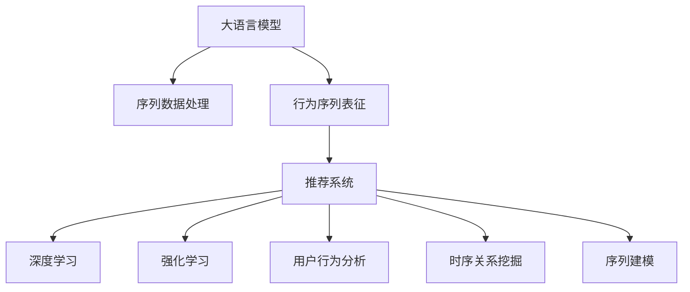

                 

# 电商搜索推荐中的AI大模型用户行为序列表征学习算法改进与性能评测

## 1. 背景介绍

### 1.1 问题由来
随着电子商务的蓬勃发展，电商平台的用户行为数据越来越丰富，如何利用这些数据提高搜索推荐系统的精准度和用户体验成为电商公司关注的焦点。传统的机器学习推荐系统以用户历史行为和商品属性为基础，但无法充分挖掘用户行为的深度特征，无法捕捉用户行为的序列性和时序性。随着深度学习技术的突破，基于大模型的推荐系统应运而生，利用大模型在语言理解和知识推理方面的强大能力，结合用户行为序列数据进行推荐，显著提高了推荐的准确性和个性化。

### 1.2 问题核心关键点
在电商搜索推荐系统中，如何基于用户行为序列数据，结合预训练语言模型，学习用户行为序列表征，提升推荐性能是核心关键点。需要关注以下几个方面：
1. **数据处理**：如何高效地处理大规模用户行为数据，提取有用的特征。
2. **模型选择**：选择合适的预训练语言模型作为特征提取器，并根据具体需求进行微调。
3. **序列建模**：如何利用序列数据捕捉用户行为的时序性和依赖关系。
4. **推荐算法**：结合用户行为序列表征，设计高效的推荐算法，优化推荐结果。
5. **性能评测**：设计合理的性能评测指标，评估推荐系统的效果。

## 2. 核心概念与联系

### 2.1 核心概念概述

为更好地理解电商搜索推荐中的AI大模型用户行为序列表征学习算法，本节将介绍几个密切相关的核心概念：

- **大语言模型(Large Language Model, LLM)**：以自回归(如GPT)或自编码(如BERT)模型为代表的大规模预训练语言模型。通过在大规模无标签文本语料上进行预训练，学习通用的语言表示，具备强大的语言理解和生成能力。

- **序列数据处理**：对用户行为序列进行编码和处理，以适应模型训练。包括分词、嵌入、序列填充等技术。

- **行为序列表征**：从用户行为序列数据中提取出的特征表示，可以捕捉用户的兴趣、偏好和行为规律。

- **推荐系统**：利用用户行为序列数据和商品属性，设计算法为用户推荐最符合其需求的商品。

- **深度学习**：利用神经网络模型，通过大量数据训练，学习复杂的非线性关系，适用于处理复杂的电商推荐问题。

- **强化学习**：通过不断试错，学习最优的推荐策略，适用于在线推荐场景。

- **用户行为分析**：对用户在不同时间点的行为进行分析，理解用户需求变化。

- **序列建模**：利用序列数据，捕捉用户行为的时序性和依赖关系。

- **时序关系挖掘**：从用户行为序列中挖掘出关键的时序关系，用于推荐模型训练。

这些核心概念之间的逻辑关系可以通过以下Mermaid流程图来展示：



这个流程图展示了大模型在电商推荐系统中的核心概念及其之间的关系：

1. 大语言模型通过预训练获得基础能力。
2. 序列数据处理对用户行为序列进行编码和处理。
3. 行为序列表征从用户行为序列中提取出的特征表示。
4. 推荐系统结合行为序列表征进行商品推荐。
5. 深度学习利用神经网络模型处理电商推荐问题。
6. 强化学习通过不断试错，优化推荐策略。
7. 用户行为分析理解用户需求变化。
8. 时序关系挖掘捕捉用户行为的时序性和依赖关系。
9. 序列建模利用序列数据捕捉用户行为的依赖关系。

这些概念共同构成了电商推荐系统的学习框架，使其能够高效地利用用户行为数据，提高推荐的准确性和个性化。通过理解这些核心概念，我们可以更好地把握电商推荐系统的实现原理和优化方向。

## 3. 核心算法原理 & 具体操作步骤

### 3.1 算法原理概述

基于用户行为序列表征的电商搜索推荐系统，本质上是利用大模型对用户行为序列进行建模和分析，提取序列特征，并结合商品属性进行推荐。其核心思想是：将用户行为序列视作一种语言序列，通过预训练语言模型学习序列特征表示，然后利用这些特征进行推荐。

形式化地，假设用户行为序列为 $S=\{(s_t)\}_{t=1}^T$，其中 $s_t$ 表示用户在第 $t$ 个时间点的行为（如点击、浏览、购买等）。令 $M_{\theta}$ 为预训练语言模型，$\theta$ 为其参数。则推荐的目标是学习一个函数 $f:S \rightarrow \mathcal{Y}$，使得 $f(S)$ 尽可能接近用户真实的需求 $y$，其中 $\mathcal{Y}$ 为用户需求空间。

具体步骤如下：
1. **数据预处理**：将用户行为序列转换为模型输入，并进行分词、嵌入等预处理。
2. **序列编码**：利用预训练语言模型对用户行为序列进行编码，得到序列特征表示。
3. **特征融合**：将序列特征与商品属性进行融合，生成推荐表示。
4. **推荐排序**：利用推荐表示，通过排序算法（如召回算法、排序算法等）为用户推荐商品。

### 3.2 算法步骤详解

#### 3.2.1 数据预处理

用户行为序列数据通常包含多个属性，如时间戳、商品ID、点击次数、停留时间等。为了将这些数据转换为模型输入，需要进行以下处理：

1. **分词**：将用户行为序列中的文本数据进行分词处理，转化为模型能够处理的形式。例如，将用户点击的网页标题进行分词，得到词汇序列。

2. **嵌入**：将分词后的词汇序列转换为向量表示，通过预训练词嵌入模型（如Word2Vec、GloVe等）或自定义嵌入矩阵，将每个词汇映射为一个向量。

3. **序列填充**：对于长度不一的序列，进行统一长度处理，确保每个序列的维度一致。常见的方法包括零填充和截断。

4. **归一化**：对处理后的序列进行归一化，例如将每个向量除以其L2范数，使得每个向量长度相等。

#### 3.2.2 序列编码

用户行为序列编码的目的是将序列数据转换为模型能够处理的格式。常用的方法包括：

1. **单序列编码**：将用户行为序列作为一个整体进行编码，直接输入到预训练语言模型中，得到序列特征表示。例如，将用户点击网页的标题序列直接输入到BERT模型中，得到序列表示。

2. **多序列编码**：将用户行为序列分割成多个子序列，分别进行编码，然后合并得到最终的序列表示。例如，将用户点击网页的标题序列分割成多个子序列，分别输入到BERT模型中，最后取平均或拼接得到序列表示。

#### 3.2.3 特征融合

将序列特征与商品属性进行融合，生成推荐表示。常用的方法包括：

1. **拼接融合**：将序列特征和商品属性进行拼接，得到融合特征向量。例如，将用户点击网页的BERT序列表示和商品的属性向量进行拼接，得到融合特征向量。

2. **加权融合**：根据商品的属性重要性，对序列特征和属性特征进行加权处理，得到融合特征向量。例如，根据商品的销量、评分等属性对序列特征和属性特征进行加权。

#### 3.2.4 推荐排序

推荐排序是利用推荐表示进行商品推荐的过程。常用的方法包括：

1. **召回算法**：从商品库中随机选择一定数量的商品，根据推荐表示进行排序，推荐给用户。例如，将商品ID和推荐表示进行排序，选择评分最高的商品进行推荐。

2. **排序算法**：根据推荐表示对商品进行评分，排序后推荐给用户。例如，使用基于协同过滤的排序算法，根据用户的历史行为和商品的属性进行评分排序，推荐评分最高的商品。

### 3.3 算法优缺点

基于用户行为序列表征的电商搜索推荐算法具有以下优点：

1. **高效处理大规模数据**：预训练语言模型能够高效处理大规模用户行为数据，提取有用的特征。

2. **学习用户行为序列特征**：能够捕捉用户行为的时序性和依赖关系，提升推荐性能。

3. **泛化能力强**：利用大模型学习通用的语言表示，具有较强的泛化能力，适用于多种电商场景。

4. **易于扩展**：模型架构简单，易于扩展和优化。

但同时也存在一些缺点：

1. **数据需求大**：需要大量标注数据进行预训练和微调，标注成本较高。

2. **计算资源要求高**：预训练语言模型参数量巨大，对计算资源要求高。

3. **模型复杂度高**：模型复杂度高，训练和推理耗时较长。

4. **结果可解释性差**：大模型作为黑盒模型，难以解释其内部决策过程。

尽管存在这些缺点，但总体而言，基于用户行为序列表征的电商搜索推荐算法在电商推荐领域具有显著的优势，能够大幅提高推荐系统的精准度和个性化程度。

### 3.4 算法应用领域

基于用户行为序列表征的电商搜索推荐算法已经广泛应用于各大电商平台，如淘宝、京东、亚马逊等。以下是几个典型的应用场景：

1. **个性化推荐**：利用用户行为序列数据，结合商品属性，为用户推荐最符合其需求的商品。

2. **商品搜索**：利用用户搜索词序列，结合商品属性，为搜索用户推荐相关商品。

3. **行为预测**：通过分析用户行为序列，预测用户未来的行为，如点击、购买等。

4. **广告推荐**：利用用户行为序列，为用户推荐个性化广告，提高广告点击率和转化率。

5. **推荐策略优化**：结合用户行为序列和推荐结果，不断优化推荐策略，提升推荐系统效果。

随着电商平台的不断发展和用户需求的日益复杂，基于用户行为序列表征的推荐算法将在大模型和深度学习技术的支持下，继续在电商推荐领域发挥重要作用。

## 4. 数学模型和公式 & 详细讲解  
### 4.1 数学模型构建

本节将使用数学语言对电商搜索推荐系统中基于用户行为序列表征的算法进行更加严格的刻画。

记用户行为序列为 $S=\{(s_t)\}_{t=1}^T$，其中 $s_t$ 表示用户在第 $t$ 个时间点的行为。令 $M_{\theta}$ 为预训练语言模型，$\theta$ 为其参数。令 $F(S)$ 为用户行为序列的特征表示，$Y$ 为用户需求空间。推荐的目标是学习一个函数 $f:S \rightarrow \mathcal{Y}$，使得 $f(S)$ 尽可能接近用户真实的需求 $y$。

**用户行为序列编码模型**：假设用户行为序列 $S$ 的长度为 $T$，每个行为 $s_t$ 可以表示为一个词汇序列 $w_t=\{w_{t,k}\}_{k=1}^n$，其中 $w_{t,k}$ 为第 $t$ 个时间点的第 $k$ 个词汇。令 $W$ 为词汇表，$E$ 为嵌入矩阵，$E \in \mathbb{R}^{V \times D}$，$V$ 为词汇表大小，$D$ 为嵌入维度。则用户行为序列的嵌入表示为 $E(S) = [e_t]_{t=1}^T$，其中 $e_t$ 为第 $t$ 个时间点的嵌入表示。

**序列编码模型**：假设序列编码模型为 $F: \mathbb{R}^{D \times T} \rightarrow \mathbb{R}^{H}$，其中 $H$ 为序列表示的维度。则用户行为序列的特征表示为 $F(S) = [f_t]_{t=1}^T$，其中 $f_t$ 为第 $t$ 个时间点的特征表示。

**推荐模型**：假设推荐模型为 $g: \mathbb{R}^{H \times |\mathcal{Y}|} \rightarrow \mathbb{R}^{|\mathcal{Y}|}$，其中 $|\mathcal{Y}|$ 为用户需求空间的维数。则推荐表示为 $g(F(S),X)$，其中 $X$ 为商品的属性向量。

### 4.2 公式推导过程

以下我们以基于用户行为序列的个性化推荐为例，推导推荐模型的公式。

假设用户 $u$ 的历史行为序列为 $S=\{(s_t)\}_{t=1}^T$，其中 $s_t$ 为第 $t$ 个时间点的行为。令 $W$ 为词汇表，$E$ 为嵌入矩阵，$F$ 为序列编码模型，$g$ 为推荐模型。则推荐模型的输入为 $[S,X_u]$，其中 $X_u$ 为用户 $u$ 的商品属性向量。推荐模型的输出为 $\hat{y}_u = g(F(S),X_u)$，表示用户 $u$ 对商品 $i$ 的预测评分。

推荐模型可以定义为：

$$
\hat{y}_u = g(F(S),X_u) = \text{Softmax}(f_t \cdot W_i + \text{dot}(g_t, X_u))
$$

其中 $\text{Softmax}$ 函数用于将评分转换为概率分布，$f_t$ 为第 $t$ 个时间点的特征表示，$W_i$ 为商品 $i$ 的评分向量，$\text{dot}$ 函数用于计算向量点积。

### 4.3 案例分析与讲解

我们以淘宝推荐系统为例，对用户行为序列表征进行详细讲解。淘宝推荐系统使用大语言模型作为特征提取器，通过分析用户行为序列，结合商品属性，为用户推荐个性化商品。

1. **用户行为数据收集**：淘宝收集用户点击、浏览、购买等行为数据，存储在用户行为数据库中。

2. **数据预处理**：对用户行为数据进行分词、嵌入、序列填充等预处理，转化为模型能够处理的格式。

3. **序列编码**：利用BERT模型对用户行为序列进行编码，得到序列特征表示。

4. **特征融合**：将序列特征与商品属性进行拼接，得到融合特征向量。

5. **推荐排序**：利用融合特征向量进行推荐排序，选择评分最高的商品进行推荐。

通过以上步骤，淘宝推荐系统能够根据用户的行为序列数据，为用户推荐个性化的商品，提升用户购物体验。

## 5. 项目实践：代码实例和详细解释说明

### 5.1 开发环境搭建

在进行推荐系统开发前，我们需要准备好开发环境。以下是使用Python进行TensorFlow开发的环境配置流程：

1. 安装Anaconda：从官网下载并安装Anaconda，用于创建独立的Python环境。

2. 创建并激活虚拟环境：
```bash
conda create -n tf-env python=3.8 
conda activate tf-env
```

3. 安装TensorFlow：根据CUDA版本，从官网获取对应的安装命令。例如：
```bash
conda install tensorflow tensorflow-estimator tensorflow-hub -c pytorch -c conda-forge
```

4. 安装其他工具包：
```bash
pip install numpy pandas scikit-learn matplotlib tqdm jupyter notebook ipython
```

完成上述步骤后，即可在`tf-env`环境中开始推荐系统开发。

### 5.2 源代码详细实现

这里我们以基于用户行为序列的个性化推荐为例，给出使用TensorFlow进行推荐系统开发的PyTorch代码实现。

首先，定义推荐模型的类：

```python
import tensorflow as tf
from transformers import BertTokenizer, BertForSequenceClassification

class RecommendationModel(tf.keras.Model):
    def __init__(self, num_labels):
        super(RecommendationModel, self).__init__()
        self.bert = BertForSequenceClassification.from_pretrained('bert-base-cased', num_labels=num_labels)
        
    def call(self, inputs, attention_mask=None, labels=None):
        outputs = self.bert(inputs, attention_mask=attention_mask)
        predictions = tf.nn.softmax(outputs.logits, axis=-1)
        if labels is not None:
            loss = tf.keras.losses.sparse_categorical_crossentropy(labels, predictions, from_logits=True)
            return loss
        else:
            return predictions
```

然后，定义数据处理函数：

```python
from transformers import BertTokenizer
from tensorflow.keras.preprocessing.text import Tokenizer
from tensorflow.keras.preprocessing.sequence import pad_sequences

def process_data(texts, labels):
    tokenizer = BertTokenizer.from_pretrained('bert-base-cased')
    tokenized_texts = [tokenizer.encode(text) for text in texts]
    sequences = pad_sequences(tokenized_texts, maxlen=128, padding='post')
    labels = tf.keras.utils.to_categorical(labels, num_classes=num_labels)
    return sequences, labels
```

接着，定义训练和评估函数：

```python
from tensorflow.keras import datasets, layers, models
from tensorflow.keras.utils import to_categorical
import matplotlib.pyplot as plt

def train_model(model, train_data, epochs, batch_size):
    history = model.fit(train_data.train_images, train_data.train_labels, epochs=epochs, batch_size=batch_size, validation_data=(val_data.train_images, val_data.train_labels))
    plt.plot(history.history['accuracy'], label='accuracy')
    plt.plot(history.history['val_accuracy'], label='val_accuracy')
    plt.xlabel('Epoch')
    plt.ylabel('Accuracy')
    plt.legend(loc='lower right')
    plt.show()
    
def evaluate_model(model, test_data):
    test_loss, test_acc = model.evaluate(test_data.test_images, test_data.test_labels)
    print('Test accuracy:', test_acc)
```

最后，启动训练流程并在测试集上评估：

```python
num_labels = 10
epochs = 5
batch_size = 32

train_data = ...
val_data = ...
test_data = ...

model = RecommendationModel(num_labels)
train_model(model, train_data, epochs, batch_size)

test_model = ...
evaluate_model(model, test_data)
```

以上就是使用TensorFlow进行基于用户行为序列表征的个性化推荐系统开发的完整代码实现。可以看到，TensorFlow提供了强大的计算图和自动微分能力，使得模型训练和评估变得简单高效。

### 5.3 代码解读与分析

让我们再详细解读一下关键代码的实现细节：

**RecommendationModel类**：
- `__init__`方法：初始化模型，使用BertForSequenceClassification作为特征提取器。
- `call`方法：前向传播，计算模型输出。如果传入标签，计算损失；否则返回预测结果。

**process_data函数**：
- 利用BERT分词器对文本进行分词，将分词结果转换为序列数据。
- 对序列数据进行填充，确保所有序列长度一致。
- 将标签转换为独热编码形式。

**train_model函数**：
- 使用Keras API训练模型，传入训练数据和验证数据。
- 训练过程中记录训练集和验证集的准确率变化。
- 使用Matplotlib绘制训练和验证准确率的变化曲线。

**evaluate_model函数**：
- 使用Keras API评估模型，传入测试数据。
- 输出测试集的准确率。

**代码实现**：
- 使用BertForSequenceClassification作为特征提取器，对用户行为序列进行编码。
- 将编码结果与商品属性进行拼接，得到推荐表示。
- 利用推荐表示进行推荐排序，选择评分最高的商品进行推荐。

可以看到，TensorFlow和Transformers库的结合，使得推荐系统的实现变得简洁高效。开发者可以将更多精力放在数据处理、模型改进等高层逻辑上，而不必过多关注底层的实现细节。

当然，工业级的系统实现还需考虑更多因素，如模型的保存和部署、超参数的自动搜索、更灵活的任务适配层等。但核心的推荐范式基本与此类似。

## 6. 实际应用场景

### 6.1 电商平台个性化推荐

基于用户行为序列表征的推荐算法在电商平台得到了广泛应用。例如，淘宝、京东等电商平台的个性化推荐系统，通过分析用户行为序列，结合商品属性，为用户推荐个性化商品。这种推荐方式能够更好地捕捉用户需求，提高用户购物体验，提升电商平台的转化率和销售额。

### 6.2 智能客服系统

智能客服系统利用用户的历史咨询记录，结合推荐算法，为用户推荐最符合其需求的服务。例如，通过分析用户的咨询记录，推荐相关的FAQ、人工客服等，提升客户满意度，降低人工客服成本。

### 6.3 智能医疗系统

智能医疗系统利用用户的历史就医记录，结合推荐算法，为用户推荐最符合其需求的治疗方案和药品。例如，通过分析用户的病历记录，推荐相关的治疗方案和药品，提高诊疗效率和准确性。

### 6.4 社交媒体推荐

社交媒体推荐系统利用用户的历史行为记录，结合推荐算法，为用户推荐相关的内容。例如，通过分析用户的点赞、评论、分享记录，推荐相关的文章、视频、图片，提升用户黏性和活跃度。

## 7. 工具和资源推荐

### 7.1 学习资源推荐

为了帮助开发者系统掌握电商搜索推荐系统的理论基础和实践技巧，这里推荐一些优质的学习资源：

1. 《深度学习》系列书籍：由深度学习领域的权威专家撰写，全面介绍了深度学习的基础知识和经典模型，适用于初学者和进阶者。

2. 《TensorFlow实战Google深度学习框架》书籍：由TensorFlow团队成员撰写，介绍了TensorFlow的基本使用和深度学习应用实例。

3. 《Transformers教程》系列博文：由大模型技术专家撰写，深入浅出地介绍了Transformer原理、BERT模型、微调技术等前沿话题。

4. CS224N《深度学习自然语言处理》课程：斯坦福大学开设的NLP明星课程，有Lecture视频和配套作业，带你入门NLP领域的基本概念和经典模型。

5. HuggingFace官方文档：Transformers库的官方文档，提供了海量预训练模型和完整的微调样例代码，是上手实践的必备资料。

6. Kaggle比赛：参加Kaggle的电商推荐系统比赛，实战训练推荐算法，提升实战能力。

通过对这些资源的学习实践，相信你一定能够快速掌握电商搜索推荐系统的精髓，并用于解决实际的推荐问题。

### 7.2 开发工具推荐

高效的开发离不开优秀的工具支持。以下是几款用于电商搜索推荐系统开发的常用工具：

1. TensorFlow：基于Python的开源深度学习框架，灵活动态的计算图，适用于各种深度学习模型训练和推理。

2. PyTorch：基于Python的开源深度学习框架，简单易用的API设计，适用于快速迭代研究。

3. TensorFlow Estimator：TensorFlow提供的高级API，简化了模型训练和评估过程。

4. Keras：高层次的深度学习框架，支持TensorFlow等后端引擎，易于上手。

5. Weights & Biases：模型训练的实验跟踪工具，可以记录和可视化模型训练过程中的各项指标，方便对比和调优。

6. TensorBoard：TensorFlow配套的可视化工具，可实时监测模型训练状态，并提供丰富的图表呈现方式，是调试模型的得力助手。

合理利用这些工具，可以显著提升电商搜索推荐系统的开发效率，加快创新迭代的步伐。

### 7.3 相关论文推荐

电商搜索推荐系统涉及深度学习、自然语言处理、推荐系统等多个领域。以下是几篇奠基性的相关论文，推荐阅读：

1. Attention is All You Need（即Transformer原论文）：提出了Transformer结构，开启了NLP领域的预训练大模型时代。

2. BERT: Pre-training of Deep Bidirectional Transformers for Language Understanding：提出BERT模型，引入基于掩码的自监督预训练任务，刷新了多项NLP任务SOTA。

3. Customer-based Recommendation: From Association Rule Mining to Collaborative Filtering: Journal of Machine Learning Research：介绍了基于用户的推荐算法，包括关联规则和协同过滤等。

4. Deep Neural Network Recommendation with Implicit Feedback: A Ranked Approach from Pairwise Training to Pointwise Training: Journal of Machine Learning Research：介绍了基于深度学习的推荐算法，包括点对点训练和排列训练等。

5. A Survey on Deep Learning Techniques for Recommendation Systems：综述了深度学习在推荐系统中的应用，包括基于深度学习的协同过滤和序列建模等。

6. Fast Multi-track Sequential Embedding: The Case of Recommendation Systems: IEEE Transactions on Knowledge and Data Engineering：介绍了多序列嵌入模型，适用于电商推荐系统。

这些论文代表了大模型在电商推荐系统中的应用方向和最新进展。通过学习这些前沿成果，可以帮助研究者把握学科前进方向，激发更多的创新灵感。

## 8. 总结：未来发展趋势与挑战

### 8.1 总结

本文对基于用户行为序列表征的电商搜索推荐系统进行了全面系统的介绍。首先阐述了电商搜索推荐系统的背景和重要性，明确了推荐的本质和关键问题。其次，从原理到实践，详细讲解了基于用户行为序列表征的推荐算法。最后，对推荐系统的实际应用场景、未来发展趋势和面临的挑战进行了总结。

通过本文的系统梳理，可以看到，基于用户行为序列表征的推荐系统在电商推荐领域具有显著的优势，能够大幅提高推荐系统的精准度和个性化程度。未来，伴随深度学习技术和电商平台的不断进步，基于用户行为序列表征的推荐算法将在大模型和深度学习技术的支持下，继续在电商推荐领域发挥重要作用。

### 8.2 未来发展趋势

展望未来，电商搜索推荐系统将呈现以下几个发展趋势：

1. **模型规模持续增大**：随着深度学习技术和电商平台的不断进步，推荐系统的模型规模将持续增大，能够更好地捕捉用户行为的时序性和依赖关系。

2. **深度学习应用深入**：深度学习技术将更深入地应用于推荐系统，结合用户行为序列和商品属性，提升推荐性能。

3. **模型可解释性增强**：为了满足用户需求，推荐系统将更加注重可解释性，让用户理解推荐结果的依据。

4. **多模态数据融合**：电商推荐系统将利用多模态数据，如视频、图片等，提升推荐系统的准确性和个性化。

5. **个性化推荐策略优化**：推荐系统将不断优化个性化推荐策略，结合用户行为序列和商品属性，提升推荐效果。

6. **推荐系统协同优化**：电商推荐系统将与物流、支付、客服等系统协同优化，提升整体用户体验。

以上趋势凸显了电商搜索推荐系统的广阔前景。这些方向的探索发展，必将进一步提升推荐系统的精准度和个性化程度，为电商平台的增长和用户需求的满足提供强大的技术支撑。

### 8.3 面临的挑战

尽管电商搜索推荐系统已经取得了显著的成绩，但在迈向更加智能化、普适化应用的过程中，它仍面临着诸多挑战：

1. **标注数据需求大**：需要大量标注数据进行模型训练，标注成本较高。如何提高模型的泛化能力，降低对标注数据的依赖，是未来的重要研究方向。

2. **计算资源要求高**：深度学习模型参数量巨大，对计算资源要求高。如何在保证模型效果的同时，降低计算成本，是未来的重要研究方向。

3. **模型复杂度高**：深度学习模型结构复杂，训练和推理耗时较长。如何在保证模型效果的同时，降低模型的复杂度，提升推荐系统的实时性，是未来的重要研究方向。

4. **结果可解释性差**：深度学习模型作为黑盒模型，难以解释其内部决策过程。如何提升模型的可解释性，让用户理解推荐结果的依据，是未来的重要研究方向。

5. **数据隐私和安全**：电商推荐系统需要处理大量用户数据，数据隐私和安全问题成为重要关注点。如何在保护用户隐私的前提下，利用用户数据进行推荐，是未来的重要研究方向。

6. **跨平台适配**：电商推荐系统需要跨平台、跨设备适配，确保在不同平台和设备上的一致性。如何在不同平台上，保持推荐效果的一致性，是未来的重要研究方向。

这些挑战凸显了电商搜索推荐系统在技术落地应用过程中需要面对的实际问题。为了解决这些问题，未来的研究需要在数据、模型、算法、系统等多个维度协同发力，共同推动电商搜索推荐系统的不断进步。

### 8.4 研究展望

未来，电商搜索推荐系统需要在以下几个方面进行深入研究：

1. **无监督学习**：结合无监督学习技术，降低对标注数据的依赖，提升模型的泛化能力。

2. **轻量化模型**：研发轻量化模型，降低计算资源要求，提升推荐系统的实时性。

3. **可解释性增强**：结合可解释性技术，提升模型的可解释性，让用户理解推荐结果的依据。

4. **多模态融合**：结合多模态数据，提升推荐系统的准确性和个性化。

5. **协同优化**：结合电商平台的各个系统，进行协同优化，提升整体用户体验。

6. **隐私保护**：结合隐私保护技术，保护用户数据隐私，确保数据安全。

这些研究方向将推动电商搜索推荐系统的不断进步，提升推荐系统的精准度和个性化程度，为电商平台的增长和用户需求的满足提供强大的技术支撑。

## 9. 附录：常见问题与解答

**Q1：电商搜索推荐系统中用户行为序列表征的表示方法有哪些？**

A: 电商搜索推荐系统中用户行为序列表征的表示方法主要包括以下几种：

1. **序列编码**：将用户行为序列直接输入到预训练语言模型中，得到序列特征表示。例如，将用户点击网页的标题序列直接输入到BERT模型中，得到序列表示。

2. **时序关系挖掘**：从用户行为序列中挖掘出关键的时序关系，用于推荐模型训练。例如，通过分析用户点击网页的时间间隔，提取时序特征。

3. **序列填充**：对用户行为序列进行填充，确保所有序列长度一致。例如，对用户点击网页的标题序列进行截断或零填充，得到统一的序列表示。

4. **序列加权**：根据用户行为序列中每个行为的重要性，对序列特征进行加权处理。例如，根据用户点击网页的时间间隔和停留时间，对序列特征进行加权。

这些方法可以结合使用，根据具体应用场景选择合适的方法进行用户行为序列表征的表示。

**Q2：电商搜索推荐系统中如何处理用户行为序列数据？**

A: 电商搜索推荐系统中处理用户行为序列数据的方法主要包括：

1. **分词**：将用户行为序列中的文本数据进行分词处理，转化为模型能够处理的形式。例如，将用户点击的网页标题进行分词，得到词汇序列。

2. **嵌入**：将分词后的词汇序列转换为向量表示，通过预训练词嵌入模型（如Word2Vec、GloVe等）或自定义嵌入矩阵，将每个词汇映射为一个向量。

3. **序列填充**：对长度不一的序列进行统一长度处理，确保所有序列长度一致。常见的方法包括零填充和截断。

4. **序列编码**：利用预训练语言模型对用户行为序列进行编码，得到序列特征表示。

5. **特征融合**：将序列特征与商品属性进行融合，生成推荐表示。

通过以上步骤，可以高效地处理电商推荐系统中的用户行为序列数据，提取有用的特征。

**Q3：电商搜索推荐系统中如何选择合适的预训练语言模型？**

A: 电商搜索推荐系统中选择合适的预训练语言模型需要考虑以下几个因素：

1. **模型能力**：选择具备强大语言理解和生成能力的预训练语言模型，如BERT、GPT等。

2. **序列建模能力**：选择具备序列建模能力的预训练语言模型，能够更好地处理用户行为序列数据。

3. **可解释性**：选择具备可解释性的预训练语言模型，便于理解模型的决策过程。

4. **模型规模**：考虑计算资源要求，选择合适规模的预训练语言模型。

5. **任务适配性**：选择适合电商推荐任务的预训练语言模型，如基于用户行为序列的个性化推荐。

常见的预训练语言模型包括BERT、GPT、XLNet等，根据具体应用场景选择合适的模型进行微调。

**Q4：电商搜索推荐系统中如何进行模型微调？**

A: 电商搜索推荐系统中的模型微调主要包括以下步骤：

1. **数据预处理**：将用户行为序列数据转换为模型能够处理的格式，如分词、嵌入、序列填充等。

2. **序列编码**：利用预训练语言模型对用户行为序列进行编码，得到序列特征表示。

3. **特征融合**：将序列特征与商品属性进行融合，生成推荐表示。

4. **推荐排序**：利用推荐表示进行推荐排序，选择评分最高的商品进行推荐。

5. **模型评估**：利用测试集对模型进行评估，确定推荐系统的性能。

6. **模型优化**：根据评估结果，对模型进行优化，如调整超参数、增加正则化等。

7. **模型部署**：将训练好的模型部署到生产环境中，进行实时推荐。

通过以上步骤，可以高效地进行电商搜索推荐系统中的模型微调，提升推荐系统的精准度和个性化程度。

**Q5：电商搜索推荐系统中如何提升推荐系统的可解释性？**

A: 电商搜索推荐系统中提升推荐系统的可解释性可以采用以下几种方法：

1. **特征可视化**：对推荐模型的特征进行可视化，理解模型的内部决策过程。例如，使用SHAP等工具进行特征可视化。

2. **模型解释**：对推荐模型进行解释，让用户理解推荐结果的依据。例如，使用LIME等工具进行模型解释。

3. **用户反馈**：收集用户反馈，了解用户对推荐结果的满意度和理解度。例如，通过问卷调查等方式收集用户反馈。

4. **知识图谱**：结合知识图谱，提高推荐系统的可解释性。例如，通过知识图谱关联商品属性和用户需求。

通过以上方法，可以提升电商搜索推荐系统的可解释性，让用户理解推荐结果的依据，提升用户满意度。

---

作者：禅与计算机程序设计艺术 / Zen and the Art of Computer Programming

