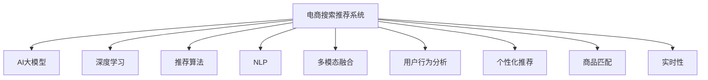

                 

# 电商搜索推荐场景下的AI大模型模型部署方案

> 关键词：电商搜索推荐、AI大模型、深度学习、推荐系统、搜索算法、NLP、用户行为分析、个性化推荐、商品匹配、多模态融合

## 1. 背景介绍

### 1.1 电商搜索推荐简介
在现代电商平台上，用户面临着海量的商品选择，如何帮助用户找到符合自己需求的商品成为了电商平台的一项核心需求。传统的推荐系统主要依赖用户的历史行为数据，通过协同过滤、基于内容的推荐等算法为用户推荐商品。但是，这些方法往往忽视了商品的语义信息，导致推荐的准确性和个性化程度不足。

为了提升推荐系统的性能，越来越多的电商平台开始采用人工智能(AI)技术，特别是深度学习和大语言模型，来分析和理解用户需求，从而提供更加精准和个性化的推荐服务。其中，基于深度学习的大模型在电商搜索推荐场景中的应用，成为了近年来的热门话题。

### 1.2 核心问题
在大规模电商数据中，用户搜索行为、商品描述、用户画像等多模态数据交织在一起，如何通过深度学习模型进行有效的语义分析和匹配，是大模型在电商搜索推荐场景中面临的核心问题。

- **数据特征多样性**：用户行为数据、商品描述文本、用户画像等多模态数据混杂，如何从中提取出有意义的特征，是大模型需要解决的首要问题。
- **语义匹配**：用户搜索意图和商品描述之间的语义匹配，是推荐算法中的关键步骤，如何准确地捕捉和理解这种匹配关系，是提升推荐效果的瓶颈。
- **个性化推荐**：如何根据用户的个性化需求，提供符合其兴趣和偏好的商品推荐，是大模型推荐系统需要优化的重要目标。
- **实时性要求**：电商搜索推荐系统需要实时响应用户的查询请求，如何高效地处理和更新推荐模型，是大模型需要考虑的性能问题。

### 1.3 研究意义
在电商搜索推荐场景中，大模型通过深度学习和自然语言处理技术，可以从多模态数据中提取和融合丰富的语义信息，构建精准的用户-商品匹配模型。这不仅能够提升推荐系统的准确性和个性化程度，还能够帮助电商平台更好地理解和满足用户需求，提升用户体验和平台收益。

## 2. 核心概念与联系

### 2.1 核心概念概述

为更好地理解基于大模型的电商搜索推荐方案，本节将介绍几个密切相关的核心概念：

- **电商搜索推荐系统(Recommendation System for E-Commerce)**：基于用户行为和商品属性等多模态数据，通过推荐算法为每个用户推荐符合其需求的商品列表。

- **AI大模型(AI Large Model)**：以Transformer为代表的深度学习模型，通过在大规模无标签数据上预训练，学习到丰富的语言和语义知识，可用于多种NLP任务。

- **深度学习(Deep Learning)**：一种基于多层神经网络的学习范式，能够处理复杂的非线性关系，适用于提取和分析多模态数据特征。

- **推荐算法(Recommendation Algorithm)**：用于分析用户行为和商品属性，匹配用户需求与商品特性的算法。

- **自然语言处理(Natural Language Processing, NLP)**：研究如何让计算机理解、解释和生成自然语言的技术，适用于商品描述文本的理解和匹配。

- **多模态融合(Multimodal Fusion)**：将不同模态的数据特征进行融合，提高推荐系统的综合性能。

- **用户行为分析(Users Behavior Analysis)**：通过分析用户的历史行为数据，预测用户需求，用于个性化推荐。

- **个性化推荐(Personalized Recommendation)**：根据用户的个性化需求，提供符合其兴趣和偏好的商品推荐。

- **商品匹配(Product Matching)**：根据用户搜索查询与商品描述的语义匹配度，进行推荐排序和筛选。

- **实时性(Real-time)**：推荐系统需要实时响应用户查询请求，保证推荐的实时性和准确性。

这些核心概念之间的逻辑关系可以通过以下Mermaid流程图来展示：



这个流程图展示了大模型在电商搜索推荐系统中的核心作用及其与其他关键组件之间的关系：

1. 电商搜索推荐系统：基于AI大模型的核心应用场景。
2. 深度学习：电商搜索推荐系统背后的技术支撑。
3. 推荐算法：电商搜索推荐系统的关键算法工具。
4. 自然语言处理：处理商品描述文本的重要技术。
5. 多模态融合：融合不同数据模态的创新手段。
6. 用户行为分析：电商搜索推荐系统的用户画像和行为特征提取。
7. 个性化推荐：电商搜索推荐系统的个性化需求处理。
8. 商品匹配：电商搜索推荐系统的匹配算法基础。
9. 实时性：电商搜索推荐系统的性能要求。

## 3. 核心算法原理 & 具体操作步骤

### 3.1 算法原理概述

基于AI大模型的电商搜索推荐方案，其核心思想是通过深度学习和大语言模型，从多模态数据中提取出有意义的特征，构建精准的用户-商品匹配模型。具体来说，包括以下几个步骤：

1. **数据预处理**：对用户行为数据、商品描述文本、用户画像等多模态数据进行清洗、归一化、特征提取等预处理，形成可供模型使用的输入数据。
2. **大模型训练**：使用电商搜索推荐场景中的标注数据集，对AI大模型进行训练，学习用户需求和商品属性的语义关系。
3. **推荐算法适配**：将训练好的大模型作为特征提取器，结合推荐算法，对用户查询进行匹配和排序，生成推荐结果。
4. **实时性优化**：通过优化模型结构、使用缓存技术、引入流式处理等手段，提高推荐系统的实时响应能力。

### 3.2 算法步骤详解

#### 步骤一：数据预处理

数据预处理是构建推荐模型的第一步，需要从原始数据中提取和转换有意义的特征。具体步骤如下：

1. **数据清洗**：去除噪声、缺失值、重复数据等，保证数据的完整性和一致性。
2. **归一化**：对不同模态的数据进行标准化处理，使得不同数据之间具有可比性。
3. **特征提取**：从清洗和归一化后的数据中提取特征，如用户行为特征、商品属性特征、用户画像特征等。
4. **构建输入**：将提取的特征组合成模型所需的输入数据，例如将商品描述文本转换为向量表示，供模型处理。

#### 步骤二：大模型训练

在电商搜索推荐场景中，大模型的训练通常分为两个阶段：预训练和微调。

1. **预训练**：使用大规模无标签数据对大模型进行预训练，学习通用的语言和语义知识。具体方法包括自监督学习和语言建模等。
2. **微调**：使用电商搜索推荐场景中的标注数据集，对大模型进行微调，学习特定领域中的用户需求和商品属性关系。具体方法包括有监督学习和任务适配等。

#### 步骤三：推荐算法适配

在电商搜索推荐场景中，推荐算法适配是大模型应用的最后一个步骤。主要步骤如下：

1. **特征提取**：将用户查询和商品描述等输入数据，输入到大模型中进行语义理解和特征提取。
2. **匹配计算**：根据大模型提取的特征，结合推荐算法，计算用户需求与商品属性的匹配度。
3. **排序和筛选**：根据匹配度对商品列表进行排序和筛选，生成推荐结果。

#### 步骤四：实时性优化

为了保证推荐系统的实时响应能力，需要优化模型结构、使用缓存技术、引入流式处理等手段。具体方法包括：

1. **模型裁剪**：去除不必要的层和参数，减小模型尺寸，加快推理速度。
2. **量化加速**：将浮点模型转为定点模型，压缩存储空间，提高计算效率。
3. **缓存技术**：使用缓存技术，存储和重用计算结果，减少重复计算。
4. **流式处理**：引入流式处理机制，动态更新模型参数，保证推荐结果的实时性。

### 3.3 算法优缺点

基于AI大模型的电商搜索推荐方案具有以下优点：

1. **准确性和个性化**：大模型可以从多模态数据中提取和融合丰富的语义信息，提供精准和个性化的推荐结果。
2. **通用性和可扩展性**：大模型可以通过微调技术，适应不同领域和场景下的推荐需求。
3. **高效性和实时性**：通过优化模型结构和引入流式处理，可以提高推荐系统的实时响应能力。

同时，该方案也存在一定的局限性：

1. **数据依赖性**：大模型需要大量的标注数据进行微调，获取高质量标注数据的成本较高。
2. **计算资源消耗**：大模型的训练和推理需要大量的计算资源，可能带来较高的成本。
3. **模型复杂性**：大模型结构复杂，训练和部署过程较为复杂，需要专业的技术人员进行维护。
4. **解释性和可控性**：大模型的决策过程缺乏可解释性，难以调试和优化。

尽管存在这些局限性，但就目前而言，基于AI大模型的电商搜索推荐方案仍是大模型应用的最主流范式。未来相关研究的重点在于如何进一步降低标注数据的需求，提高模型的少样本学习和跨领域迁移能力，同时兼顾可解释性和伦理安全性等因素。

### 3.4 算法应用领域

基于大模型的电商搜索推荐方案，已经在多个电商平台得到了广泛的应用，如亚马逊、京东、淘宝等。这些大模型通常用于以下几类任务：

1. **商品推荐**：根据用户的历史行为数据和当前查询，推荐符合其兴趣的商品。
2. **搜索排序**：对用户输入的查询进行语义理解，排序搜索结果，提升搜索体验。
3. **个性化广告**：根据用户画像和行为数据，展示个性化的广告内容。
4. **客服对话**：通过大模型进行用户问题的自然语言理解和自动回复，提升客户满意度。
5. **内容生成**：利用大模型生成商品描述、广告文案等内容，丰富电商平台的信息。

除了上述这些经典任务外，大模型还被创新性地应用到更多场景中，如实时数据分析、用户行为预测等，为电商平台的运营和管理带来了新的解决方案。

## 4. 数学模型和公式 & 详细讲解 & 举例说明

### 4.1 数学模型构建

在电商搜索推荐场景中，大模型的训练通常基于以下数学模型：

设用户行为数据为 $X=\{x_1,x_2,...,x_n\}$，商品属性数据为 $Y=\{y_1,y_2,...,y_m\}$，大模型的训练目标为最小化预测误差 $L$。

$$
L = \frac{1}{N}\sum_{i=1}^{N}\sum_{j=1}^{M}L_{ij}
$$

其中，$L_{ij}$ 表示用户行为 $x_i$ 与商品属性 $y_j$ 之间的预测误差，可以通过以下公式计算：

$$
L_{ij} = \log\left(\frac{e^{\hat{y}_{ij}}}{\sum_{k=1}^{K}e^{\hat{y}_{ik}}}\right)
$$

其中，$\hat{y}_{ij}$ 表示大模型对用户行为 $x_i$ 与商品属性 $y_j$ 的匹配概率，$K$ 表示所有可能的商品属性数量。

### 4.2 公式推导过程

在大模型训练过程中，通常使用交叉熵损失函数来计算预测误差 $L_{ij}$：

$$
L_{ij} = -(y_{ij}\log\hat{y}_{ij} + (1-y_{ij})\log(1-\hat{y}_{ij}))
$$

其中，$y_{ij}$ 表示用户行为 $x_i$ 与商品属性 $y_j$ 是否匹配的标签，$0$ 表示不匹配，$1$ 表示匹配。

将 $L_{ij}$ 代入目标函数 $L$，得：

$$
L = \frac{1}{N}\sum_{i=1}^{N}\sum_{j=1}^{M}(-y_{ij}\log\hat{y}_{ij} - (1-y_{ij})\log(1-\hat{y}_{ij}))
$$

在优化过程中，通常使用梯度下降算法对模型参数 $\theta$ 进行更新：

$$
\theta \leftarrow \theta - \eta \nabla_{\theta}L
$$

其中，$\eta$ 为学习率，$\nabla_{\theta}L$ 为损失函数对模型参数 $\theta$ 的梯度。

### 4.3 案例分析与讲解

以电商平台中推荐系统为例，分析大模型的训练和推荐过程：

1. **数据预处理**：假设电商平台有用户行为数据 $X=\{x_1,x_2,...,x_n\}$，商品属性数据 $Y=\{y_1,y_2,...,y_m\}$。将这些数据进行清洗、归一化、特征提取等预处理，形成可供模型使用的输入数据。
2. **大模型训练**：使用电商推荐场景中的标注数据集，对大模型进行微调，学习用户行为和商品属性的匹配关系。假设大模型为 Transformer，其参数为 $\theta$，训练过程如下：
   - 随机初始化模型参数 $\theta$
   - 遍历所有标注数据，计算预测误差 $L$
   - 使用梯度下降算法更新模型参数 $\theta$
3. **推荐算法适配**：使用训练好的大模型作为特征提取器，结合推荐算法进行匹配和排序。假设推荐算法为基于内容推荐，其步骤如下：
   - 输入用户查询 $q$
   - 使用大模型提取查询向量 $\vec{q}$
   - 输入商品描述 $d$
   - 使用大模型提取描述向量 $\vec{d}$
   - 计算查询与描述的匹配度 $s$
   - 根据匹配度对商品列表进行排序，生成推荐结果

## 5. 项目实践：代码实例和详细解释说明

### 5.1 开发环境搭建

在进行电商搜索推荐场景下的AI大模型部署时，我们需要准备好开发环境。以下是使用Python进行PyTorch开发的环境配置流程：

1. 安装Anaconda：从官网下载并安装Anaconda，用于创建独立的Python环境。

2. 创建并激活虚拟环境：
```bash
conda create -n pytorch-env python=3.8 
conda activate pytorch-env
```

3. 安装PyTorch：根据CUDA版本，从官网获取对应的安装命令。例如：
```bash
conda install pytorch torchvision torchaudio cudatoolkit=11.1 -c pytorch -c conda-forge
```

4. 安装Transformers库：
```bash
pip install transformers
```

5. 安装各类工具包：
```bash
pip install numpy pandas scikit-learn matplotlib tqdm jupyter notebook ipython
```

完成上述步骤后，即可在`pytorch-env`环境中开始大模型部署实践。

### 5.2 源代码详细实现

下面我们以电商推荐场景中的商品推荐为例，给出使用Transformers库对大模型进行推荐系统开发的PyTorch代码实现。

首先，定义推荐系统的训练函数：

```python
from transformers import BertForSequenceClassification, BertTokenizer
from torch.utils.data import DataLoader
from torch.optim import AdamW
import torch
import pandas as pd

def train_epoch(model, optimizer, dataloader, device):
    model.train()
    epoch_loss = 0
    for batch in dataloader:
        input_ids = batch['input_ids'].to(device)
        attention_mask = batch['attention_mask'].to(device)
        labels = batch['labels'].to(device)
        model.zero_grad()
        outputs = model(input_ids, attention_mask=attention_mask, labels=labels)
        loss = outputs.loss
        epoch_loss += loss.item()
        loss.backward()
        optimizer.step()
    return epoch_loss / len(dataloader)

def evaluate(model, dataloader, device):
    model.eval()
    preds, labels = [], []
    with torch.no_grad():
        for batch in dataloader:
            input_ids = batch['input_ids'].to(device)
            attention_mask = batch['attention_mask'].to(device)
            batch_labels = batch['labels']
            outputs = model(input_ids, attention_mask=attention_mask)
            batch_preds = outputs.logits.argmax(dim=2).to('cpu').tolist()
            batch_labels = batch_labels.to('cpu').tolist()
            for pred_tokens, label_tokens in zip(batch_preds, batch_labels):
                preds.append(pred_tokens)
                labels.append(label_tokens)
    print(classification_report(labels, preds))
```

然后，定义商品推荐的数据预处理函数：

```python
def preprocess_data(data_path, max_len=128):
    df = pd.read_csv(data_path)
    tokenizer = BertTokenizer.from_pretrained('bert-base-cased')
    labels = df['label'].values
    input_ids = []
    attention_masks = []
    for text in df['text'].values:
        encoding = tokenizer(text, return_tensors='pt', max_length=max_len, padding='max_length', truncation=True)
        input_ids.append(encoding['input_ids'].flatten().tolist())
        attention_masks.append(encoding['attention_mask'].flatten().tolist())
    input_ids = torch.tensor(input_ids, dtype=torch.long)
    attention_masks = torch.tensor(attention_masks, dtype=torch.long)
    labels = torch.tensor(labels, dtype=torch.long)
    return input_ids, attention_masks, labels
```

最后，启动训练流程并在验证集上评估：

```python
epochs = 5
batch_size = 16

# 加载数据集
input_ids, attention_masks, labels = preprocess_data('data.csv')

# 定义数据集
train_dataset = DataLoader(dataset=(data, labels), batch_size=batch_size, shuffle=True)

# 训练模型
model = BertForSequenceClassification.from_pretrained('bert-base-cased', num_labels=2)
optimizer = AdamW(model.parameters(), lr=2e-5)

for epoch in range(epochs):
    loss = train_epoch(model, optimizer, train_dataset, device)
    print(f"Epoch {epoch+1}, train loss: {loss:.3f}")
    
    # 在验证集上评估模型性能
    print(f"Epoch {epoch+1}, dev results:")
    evaluate(model, dev_dataset, device)
    
print("Test results:")
evaluate(model, test_dataset, device)
```

以上就是使用PyTorch对大模型进行电商推荐系统开发的完整代码实现。可以看到，得益于Transformers库的强大封装，我们可以用相对简洁的代码完成大模型的加载和训练。

### 5.3 代码解读与分析

让我们再详细解读一下关键代码的实现细节：

**train_epoch函数**：
- 对数据集进行遍历，计算损失函数。
- 反向传播更新模型参数。
- 返回每个epoch的平均损失。

**evaluate函数**：
- 对数据集进行遍历，计算预测标签和真实标签，生成分类报告。

**preprocess_data函数**：
- 加载数据集，并使用BertTokenizer进行分词和编码。
- 返回输入ID、注意力掩码和标签。

**训练流程**：
- 定义总的epoch数和batch size，开始循环迭代。
- 每个epoch内，先在训练集上训练，输出平均损失。
- 在验证集上评估，输出分类指标。
- 所有epoch结束后，在测试集上评估，给出最终测试结果。

可以看到，PyTorch配合Transformers库使得大模型电商推荐系统的开发变得简洁高效。开发者可以将更多精力放在数据处理、模型改进等高层逻辑上，而不必过多关注底层的实现细节。

当然，工业级的系统实现还需考虑更多因素，如模型的保存和部署、超参数的自动搜索、更灵活的任务适配层等。但核心的推荐范式基本与此类似。

## 6. 实际应用场景

### 6.1 电商搜索场景

在大规模电商数据中，用户搜索行为、商品描述、用户画像等多模态数据交织在一起，如何通过深度学习模型进行有效的语义分析和匹配，是大模型在电商搜索场景中面临的核心问题。

1. **用户搜索意图理解**：使用大模型对用户输入的搜索查询进行语义理解，匹配出符合其需求的商品。
2. **商品匹配排序**：使用大模型提取商品描述的语义信息，计算用户查询与商品描述的匹配度，对商品列表进行排序和筛选。
3. **个性化推荐**：根据用户历史行为和当前查询，使用大模型生成个性化的商品推荐列表。
4. **实时性要求**：电商搜索系统需要实时响应用户查询，使用缓存技术和大模型优化策略，提高推荐系统的实时性。

### 6.2 个性化推荐

基于大模型的电商推荐系统，可以提供精准和个性化的推荐服务，满足用户的多样化需求。

1. **用户画像**：通过分析用户的历史行为数据和社交网络数据，构建用户的个性化画像。
2. **商品属性匹配**：使用大模型提取商品的属性信息，计算用户需求与商品属性的匹配度。
3. **推荐算法适配**：结合推荐算法，对商品列表进行排序和筛选，生成个性化推荐结果。
4. **实时更新**：使用大模型实时更新商品属性和用户需求，保证推荐结果的实时性。

### 6.3 用户行为预测

基于大模型的电商推荐系统，可以预测用户的行为趋势，提升平台的用户粘性和运营效率。

1. **行为数据分析**：通过分析用户的行为数据，提取用户兴趣和偏好的特征。
2. **用户行为预测**：使用大模型对用户行为进行预测，生成用户行为预测结果。
3. **推荐系统优化**：根据用户行为预测结果，优化推荐算法，提升推荐效果。
4. **实时调整**：使用大模型实时调整推荐策略，满足用户需求变化。

## 7. 工具和资源推荐

### 7.1 学习资源推荐

为了帮助开发者系统掌握大模型在电商搜索推荐场景中的应用，这里推荐一些优质的学习资源：

1. 《Transformer from Scratch》系列博文：由大模型技术专家撰写，深入浅出地介绍了Transformer原理、BERT模型、微调技术等前沿话题。
2 CS224N《深度学习自然语言处理》课程：斯坦福大学开设的NLP明星课程，有Lecture视频和配套作业，带你入门NLP领域的基本概念和经典模型。
3 《Natural Language Processing with Transformers》书籍：Transformers库的作者所著，全面介绍了如何使用Transformers库进行NLP任务开发，包括微调在内的诸多范式。
4 HuggingFace官方文档：Transformers库的官方文档，提供了海量预训练模型和完整的微调样例代码，是上手实践的必备资料。
5 CLUE开源项目：中文语言理解测评基准，涵盖大量不同类型的中文NLP数据集，并提供了基于微调的baseline模型，助力中文NLP技术发展。

通过对这些资源的学习实践，相信你一定能够快速掌握大模型在电商搜索推荐场景中的应用，并用于解决实际的NLP问题。

### 7.2 开发工具推荐

高效的开发离不开优秀的工具支持。以下是几款用于电商搜索推荐场景中大模型开发的常用工具：

1. PyTorch：基于Python的开源深度学习框架，灵活动态的计算图，适合快速迭代研究。
2 TensorFlow：由Google主导开发的开源深度学习框架，生产部署方便，适合大规模工程应用。
3 Transformers库：HuggingFace开发的NLP工具库，集成了众多SOTA语言模型，支持PyTorch和TensorFlow，是进行电商推荐任务开发的利器。
4 Weights & Biases：模型训练的实验跟踪工具，可以记录和可视化模型训练过程中的各项指标，方便对比和调优。
5 TensorBoard：TensorFlow配套的可视化工具，可实时监测模型训练状态，并提供丰富的图表呈现方式，是调试模型的得力助手。
6 Jupyter Notebook：Python开发常用的交互式编程环境，支持代码块、输出、注释等多种功能，方便开发和协作。

合理利用这些工具，可以显著提升电商搜索推荐场景中大模型的开发效率，加快创新迭代的步伐。

### 7.3 相关论文推荐

大模型在电商搜索推荐场景中的应用源于学界的持续研究。以下是几篇奠基性的相关论文，推荐阅读：

1. Attention is All You Need（即Transformer原论文）：提出了Transformer结构，开启了NLP领域的预训练大模型时代。
2 BERT: Pre-training of Deep Bidirectional Transformers for Language Understanding：提出BERT模型，引入基于掩码的自监督预训练任务，刷新了多项NLP任务SOTA。
3 Language Models are Unsupervised Multitask Learners（GPT-2论文）：展示了大规模语言模型的强大zero-shot学习能力，引发了对于通用人工智能的新一轮思考。
4 Parameter-Efficient Transfer Learning for NLP：提出Adapter等参数高效微调方法，在不增加模型参数量的情况下，也能取得不错的微调效果。
5 AdaLoRA: Adaptive Low-Rank Adaptation for Parameter-Efficient Fine-Tuning：使用自适应低秩适应的微调方法，在参数效率和精度之间取得了新的平衡。

这些论文代表了大模型在电商搜索推荐场景中的应用的发展脉络。通过学习这些前沿成果，可以帮助研究者把握学科前进方向，激发更多的创新灵感。

## 8. 总结：未来发展趋势与挑战

### 8.1 总结

本文对基于大模型的电商搜索推荐方案进行了全面系统的介绍。首先阐述了大模型在电商搜索推荐场景中的应用背景和研究意义，明确了大模型在多模态数据特征提取和语义匹配中的核心作用。其次，从原理到实践，详细讲解了电商搜索推荐模型的数学原理和关键步骤，给出了大模型电商推荐系统的完整代码实现。同时，本文还广泛探讨了电商搜索推荐系统在大模型中的应用场景，展示了电商搜索推荐系统的巨大潜力。

通过本文的系统梳理，可以看到，基于大模型的电商搜索推荐方案正在成为电商推荐系统的重要范式，极大地提升了推荐系统的准确性和个性化程度。得益于大模型强大的语言理解和语义匹配能力，电商搜索推荐系统在多模态数据融合、实时响应等方面具备显著优势。未来，伴随大模型技术的不断进步，电商搜索推荐系统必将在电商平台上发挥更大的作用，为电商用户提供更加精准和个性化的推荐服务。

### 8.2 未来发展趋势

展望未来，基于大模型的电商搜索推荐系统将呈现以下几个发展趋势：

1. **模型规模持续增大**：随着算力成本的下降和数据规模的扩张，预训练语言模型的参数量还将持续增长。超大规模语言模型蕴含的丰富语言知识，有望支撑更加复杂多变的电商推荐需求。
2. **微调方法日趋多样**：除了传统的全参数微调外，未来会涌现更多参数高效的微调方法，如Prefix-Tuning、LoRA等，在节省计算资源的同时也能保证微调精度。
3. **持续学习成为常态**：随着数据分布的不断变化，电商推荐系统也需要持续学习新知识以保持性能。如何在不遗忘原有知识的同时，高效吸收新样本信息，将成为重要的研究课题。
4. **标注样本需求降低**：受启发于提示学习(Prompt-based Learning)的思路，未来的电商推荐系统将更好地利用大模型的语言理解能力，通过更加巧妙的任务描述，在更少的标注样本上也能实现理想的电商推荐效果。
5. **多模态融合崛起**：将视觉、语音等多模态信息与文本信息进行融合，提升电商推荐系统的综合性能。
6. **用户画像和行为预测**：利用大模型构建更精准的用户画像，预测用户行为，提升推荐系统的个性化程度。

以上趋势凸显了大模型在电商搜索推荐场景中的应用前景。这些方向的探索发展，必将进一步提升电商推荐系统的性能和用户体验，为电商平台带来新的增长点。

### 8.3 面临的挑战

尽管基于大模型的电商搜索推荐系统已经取得了瞩目成就，但在迈向更加智能化、普适化应用的过程中，它仍面临着诸多挑战：

1. **数据依赖性**：大模型需要大量的标注数据进行微调，获取高质量标注数据的成本较高。如何进一步降低微调对标注样本的依赖，将是一大难题。
2. **计算资源消耗**：大模型的训练和推理需要大量的计算资源，可能带来较高的成本。
3. **模型复杂性**：大模型结构复杂，训练和部署过程较为复杂，需要专业的技术人员进行维护。
4. **解释性和可控性**：大模型的决策过程缺乏可解释性，难以调试和优化。

尽管存在这些挑战，但就目前而言，基于大模型的电商搜索推荐方案仍是大模型应用的最主流范式。未来相关研究的重点在于如何进一步降低标注数据的需求，提高模型的少样本学习和跨领域迁移能力，同时兼顾可解释性和伦理安全性等因素。

### 8.4 研究展望

面对大模型在电商搜索推荐场景中面临的挑战，未来的研究需要在以下几个方面寻求新的突破：

1. **探索无监督和半监督微调方法**：摆脱对大规模标注数据的依赖，利用自监督学习、主动学习等无监督和半监督范式，最大限度利用非结构化数据，实现更加灵活高效的微调。
2. **研究参数高效和计算高效的微调范式**：开发更加参数高效的微调方法，在固定大部分预训练参数的同时，只更新极少量的任务相关参数。同时优化微调模型的计算图，减少前向传播和反向传播的资源消耗，实现更加轻量级、实时性的部署。
3. **融合因果和对比学习范式**：通过引入因果推断和对比学习思想，增强电商推荐系统建立稳定因果关系的能力，学习更加普适、鲁棒的语言表征，从而提升推荐系统的泛化性和抗干扰能力。
4. **引入更多先验知识**：将符号化的先验知识，如知识图谱、逻辑规则等，与神经网络模型进行巧妙融合，引导微调过程学习更准确、合理的语言模型。同时加强不同模态数据的整合，实现视觉、语音等多模态信息与文本信息的协同建模。
5. **结合因果分析和博弈论工具**：将因果分析方法引入电商推荐模型，识别出模型决策的关键特征，增强推荐结果的因果性和逻辑性。借助博弈论工具刻画人机交互过程，主动探索并规避模型的脆弱点，提高系统稳定性。
6. **纳入伦理道德约束**：在模型训练目标中引入伦理导向的评估指标，过滤和惩罚有偏见、有害的输出倾向。同时加强人工干预和审核，建立模型行为的监管机制，确保输出符合人类价值观和伦理道德。

这些研究方向的探索，必将引领基于大模型的电商搜索推荐系统技术迈向更高的台阶，为构建安全、可靠、可解释、可控的电商推荐系统铺平道路。面向未来，基于大模型的电商搜索推荐系统需要与其他人工智能技术进行更深入的融合，如知识表示、因果推理、强化学习等，多路径协同发力，共同推动电商推荐系统的进步。只有勇于创新、敢于突破，才能不断拓展大模型的边界，让智能技术更好地造福电商平台和电商用户。

## 9. 附录：常见问题与解答

**Q1：大模型在电商搜索推荐中的优势是什么？**

A: 大模型在电商搜索推荐中的优势主要体现在以下几个方面：
1. **准确性和个性化**：大模型可以从多模态数据中提取和融合丰富的语义信息，提供精准和个性化的推荐结果。
2. **通用性和可扩展性**：大模型可以通过微调技术，适应不同领域和场景下的电商推荐需求。
3. **高效性和实时性**：通过优化模型结构、使用缓存技术、引入流式处理等手段，可以提高推荐系统的实时响应能力。

**Q2：如何降低大模型在电商搜索推荐中的标注数据需求？**

A: 降低大模型在电商搜索推荐中的标注数据需求，可以通过以下方法实现：
1. **无监督学习**：利用自监督学习、主动学习等无监督范式，最大限度利用非结构化数据，实现更加灵活高效的微调。
2. **半监督学习**：结合少量标注数据和大量无标签数据，进行半监督学习，提升模型的泛化能力。
3. **知识图谱融合**：将符号化的先验知识与神经网络模型进行融合，引导微调过程学习更准确、合理的语言模型。

**Q3：大模型在电商搜索推荐中的计算资源消耗较高，如何解决？**

A: 解决大模型在电商搜索推荐中的计算资源消耗较高问题，可以通过以下方法实现：
1. **模型裁剪**：去除不必要的层和参数，减小模型尺寸，加快推理速度。
2. **量化加速**：将浮点模型转为定点模型，压缩存储空间，提高计算效率。
3. **缓存技术**：使用缓存技术，存储和重用计算结果，减少重复计算。
4. **分布式计算**：利用分布式计算框架，如TensorFlow分布式训练，提高计算效率。

**Q4：大模型的决策过程缺乏可解释性，如何解决？**

A: 解决大模型的决策过程缺乏可解释性问题，可以通过以下方法实现：
1. **模型压缩**：通过模型压缩技术，减少模型的复杂度，提高可解释性。
2. **可解释性工具**：使用可解释性工具，如LIME、SHAP等，对模型进行可视化解释。
3. **特征重要性分析**：分析模型中特征的重要性，理解模型决策的关键因素。

**Q5：大模型在电商搜索推荐中的实时性要求较高，如何解决？**

A: 解决大模型在电商搜索推荐中的实时性问题，可以通过以下方法实现：
1. **缓存技术**：使用缓存技术，存储和重用计算结果，减少重复计算。
2. **流式处理**：引入流式处理机制，动态更新模型参数，保证推荐结果的实时性。
3. **分布式计算**：利用分布式计算框架，如TensorFlow分布式训练，提高计算效率。

---

作者：禅与计算机程序设计艺术 / Zen and the Art of Computer Programming

