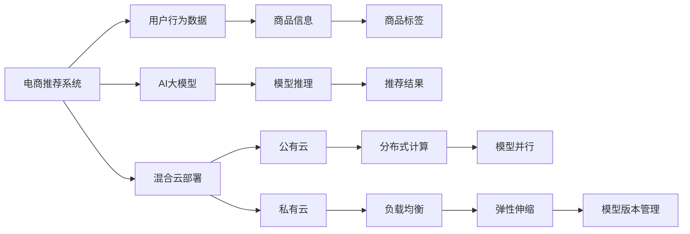

                 

# 电商搜索推荐场景下的AI大模型模型部署混合云策略

> 关键词：电商搜索推荐, 大模型, 混合云, 模型部署, 分布式, 高性能计算

## 1. 背景介绍

### 1.1 问题由来

随着人工智能技术的不断进步，AI大模型在电商搜索推荐系统中扮演着越来越重要的角色。在电商搜索推荐场景下，大模型能够综合利用海量用户行为数据、商品信息、商品标签等，进行实时个性化推荐，显著提升用户体验和平台销售额。然而，由于大模型本身的复杂性和计算需求，单靠本地服务器部署难以满足大规模应用需求，亟需探索更高效、更灵活的模型部署策略。

### 1.2 问题核心关键点

大模型在电商搜索推荐场景下的部署，主要面临以下关键问题：
1. **计算资源需求大**：大模型的推理计算需要耗费大量GPU资源，单台服务器难以满足需求。
2. **数据分布不均**：电商推荐系统的用户和商品数据分布不均衡，单中心集中式部署易出现负载不均。
3. **时延要求高**：电商搜索推荐系统对响应时延有严格要求，需确保推荐结果能够实时生成并送达用户。
4. **模型更新频繁**：电商推荐模型需频繁更新，以适应新数据和新需求，需保证模型更新策略高效。

这些问题直接影响了电商搜索推荐系统的性能和用户体验。如何设计高效、灵活的AI大模型部署策略，成为电商推荐系统优化的关键课题。

### 1.3 问题研究意义

探索AI大模型在电商搜索推荐场景下的高效部署策略，对于提升电商推荐系统的推荐准确性和用户体验，具有重要意义：

1. **降低计算成本**：通过混合云策略，合理利用公有云和私有云资源，降低模型部署和维护成本。
2. **提升性能**：通过分布式计算和负载均衡技术，提高模型推理效率，满足时延要求。
3. **灵活应对数据分布不均**：通过多中心分布式部署，缓解单点压力，提高系统稳定性和鲁棒性。
4. **快速适应模型更新**：通过模型并行和模型版本管理，确保模型更新策略高效，避免系统停机。
5. **支持快速迭代开发**：通过混合云架构，便于快速开发、测试和部署新模型，缩短项目周期。

总之，高效的模型部署策略是电商搜索推荐系统高效、稳定运行的基础，对于电商平台的竞争力提升具有重要意义。

## 2. 核心概念与联系

### 2.1 核心概念概述

为更好地理解混合云策略在大模型电商推荐系统部署中的应用，本节将介绍几个关键概念：

- **AI大模型**：指通过大规模无标签数据训练得到的预训练语言模型，如BERT、GPT等。这些模型具有强大的语言理解和生成能力，能够进行自然语言处理、图像识别等任务。
- **电商推荐系统**：指基于用户历史行为和商品特征，为用户推荐感兴趣商品的系统。推荐的商品需符合用户兴趣和需求，提升用户体验和销售额。
- **混合云**：指结合公有云和私有云的计算资源，构建灵活高效的计算环境。通过混合云策略，合理利用各类计算资源，降低成本，提升性能。
- **分布式计算**：指将计算任务分散到多个计算节点上进行并行处理，提高计算效率。
- **模型版本管理**：指对不同版本的模型进行管理和调度，确保最新模型能够快速上线。
- **模型并行**：指将模型在不同节点上进行并行计算，提高计算速度和系统稳定性。
- **负载均衡**：指将任务合理分配到不同计算节点上，避免单点压力过大，提高系统鲁棒性。
- **弹性伸缩**：指根据业务需求动态调整计算资源，平衡性能和成本。

这些概念之间相互关联，共同构成了电商搜索推荐场景下大模型高效部署的基础框架。

### 2.2 核心概念原理和架构的 Mermaid 流程图



这个流程图展示了电商推荐系统中的数据流和计算流，以及混合云部署的各个组件和关键技术。电商推荐系统收集用户行为数据、商品信息和标签，通过AI大模型进行推理计算，生成推荐结果，并通过混合云策略进行部署和优化。

## 3. 核心算法原理 & 具体操作步骤
### 3.1 算法原理概述

混合云策略在大模型电商推荐系统部署中的应用，主要基于以下几个核心原理：

1. **数据和计算资源分布式部署**：将数据存储和计算资源分布在多个节点上，通过分布式计算提高模型推理效率。
2. **模型并行与模型版本管理**：将大模型拆分成多个子模型，通过模型并行提高计算速度，同时对不同版本模型进行管理和调度，快速部署新模型。
3. **负载均衡与弹性伸缩**：通过负载均衡技术合理分配任务，避免单点压力过大，同时根据业务需求动态调整计算资源，平衡性能和成本。

这些原理通过具体的技术手段实现，确保大模型在电商推荐系统中能够高效、稳定地运行。

### 3.2 算法步骤详解

大模型在电商推荐系统中的混合云部署主要包括以下几个关键步骤：

**Step 1: 数据和模型预处理**

- 收集电商推荐系统的用户行为数据、商品信息和商品标签，并进行预处理，生成训练集和测试集。
- 对AI大模型进行预训练，获得通用语言表示，为后续微调和推理做准备。

**Step 2: 模型微调和推理**

- 对电商推荐系统的特定任务进行微调，如用户行为分类、商品相似度计算等，得到适应特定任务的小模型。
- 在大模型上进行推理计算，生成推荐结果。

**Step 3: 混合云部署**

- 在公有云上搭建分布式计算环境，实现模型的分布式推理。
- 在私有云上搭建模型版本管理系统，实现模型的快速更新和调度。
- 通过负载均衡和弹性伸缩技术，合理分配任务，优化系统性能。

**Step 4: 模型评估与优化**

- 在测试集上评估模型性能，进行优化调整。
- 根据业务需求，定期重新训练和微调模型，保证推荐结果的准确性和及时性。

### 3.3 算法优缺点

混合云策略在大模型电商推荐系统部署中的应用，具有以下优点：

1. **计算资源灵活**：通过混合云策略，合理利用公有云和私有云资源，降低计算成本。
2. **性能提升显著**：通过分布式计算和负载均衡技术，提高模型推理效率，满足时延要求。
3. **系统鲁棒性高**：通过多中心分布式部署，缓解单点压力，提高系统稳定性和鲁棒性。
4. **快速迭代开发**：通过混合云架构，便于快速开发、测试和部署新模型，缩短项目周期。

同时，该策略也存在一定的局限性：

1. **复杂度较高**：混合云策略需要设计和实现多个组件和技术，对技术水平要求较高。
2. **网络通信开销大**：分布式计算和负载均衡可能引入额外的网络通信开销，增加系统复杂度。
3. **安全性要求高**：在公有云上部署需要考虑数据安全和隐私保护，需采取多种安全措施。
4. **成本不透明**：公有云和私有云资源的使用成本可能不透明，需定期审计和优化。

尽管存在这些局限性，但混合云策略在大模型电商推荐系统部署中的优势明显，具有广泛的应用前景。

### 3.4 算法应用领域

基于混合云策略的AI大模型部署方法，在电商推荐系统中的应用广泛，具体领域包括：

1. **个性化推荐**：根据用户历史行为和商品特征，为用户推荐个性化商品，提高用户满意度。
2. **实时搜索**：根据用户搜索词和商品信息，实时生成搜索结果，满足用户即时查询需求。
3. **价格优化**：根据市场数据和用户行为，动态调整商品价格，提高销售额。
4. **库存管理**：根据用户需求和商品销售情况，动态调整库存，避免缺货和过剩。
5. **广告投放**：根据用户行为和商品特征，投放个性化广告，提高广告效果和点击率。

除了电商推荐系统，混合云策略在大数据分析、金融交易、智能制造等领域也具有广泛的应用前景。

## 4. 数学模型和公式 & 详细讲解 & 举例说明

### 4.1 数学模型构建

本节将使用数学语言对混合云策略在大模型电商推荐系统部署中的应用进行更加严格的刻画。

记电商推荐系统为 $S$，用户行为数据为 $D_U$，商品信息为 $D_P$，商品标签为 $D_T$。设AI大模型为 $M$，模型推理结果为 $R$。则电商推荐系统的数学模型为：

$$
S = (D_U, D_P, D_T, M) \rightarrow R
$$

电商推荐系统的目标是最小化用户行为和商品特征与推荐结果之间的差异。常用的评估指标包括准确率、召回率、F1分数、平均绝对误差等。

### 4.2 公式推导过程

为了评估电商推荐系统的性能，我们引入以下常见指标：

1. **准确率**：推荐结果中正确商品的比例，计算公式为：
$$
\text{Accuracy} = \frac{\text{TP}}{\text{TP} + \text{FP}}
$$
其中，TP为真正样本数，FP为假正样本数。

2. **召回率**：正确商品在推荐结果中的比例，计算公式为：
$$
\text{Recall} = \frac{\text{TP}}{\text{TP} + \text{FN}}
$$
其中，TP为真正样本数，FN为假负样本数。

3. **F1分数**：综合考虑准确率和召回率，计算公式为：
$$
\text{F1-Score} = 2 \times \frac{\text{Accuracy} \times \text{Recall}}{\text{Accuracy} + \text{Recall}}
$$

4. **平均绝对误差**：推荐结果与实际商品特征之间的差异，计算公式为：
$$
\text{MAE} = \frac{1}{n} \sum_{i=1}^n |r_i - p_i|
$$
其中，$r_i$ 为推荐结果，$p_i$ 为实际商品特征。

电商推荐系统的目标函数为：
$$
\min_{M} \mathcal{L}(S, R) = \frac{1}{N} \sum_{i=1}^N (\text{Loss}(S_i, R_i))
$$
其中，$\mathcal{L}$ 为损失函数，$\text{Loss}$ 为具体任务下的损失函数，$S_i$ 为输入数据，$R_i$ 为模型输出结果。

### 4.3 案例分析与讲解

以电商推荐系统的个性化推荐为例，通过混合云策略进行模型部署和优化。

假设电商推荐系统接收到用户ID为 $u$ 的推荐请求，系统中存储有用户行为数据 $D_U$ 和商品信息 $D_P$。通过AI大模型 $M$ 进行推理计算，得到推荐结果 $R$。将 $R$ 返回给用户，完成个性化推荐。

混合云策略在推荐系统中的具体实现包括以下步骤：

1. **数据预处理**：将用户行为数据 $D_U$ 和商品信息 $D_P$ 进行预处理，生成训练集和测试集。
2. **模型微调**：在电商推荐系统的特定任务上进行微调，如用户行为分类、商品相似度计算等，得到适应特定任务的小模型。
3. **分布式推理**：在公有云上搭建分布式计算环境，实现模型的分布式推理，提高推理效率。
4. **模型版本管理**：在私有云上搭建模型版本管理系统，实现模型的快速更新和调度。
5. **负载均衡与弹性伸缩**：通过负载均衡和弹性伸缩技术，合理分配任务，优化系统性能。

## 5. 项目实践：代码实例和详细解释说明
### 5.1 开发环境搭建

在进行混合云策略的代码实现前，我们需要准备好开发环境。以下是使用Python进行混合云架构开发的虚拟环境配置流程：

1. 安装Anaconda：从官网下载并安装Anaconda，用于创建独立的Python环境。

2. 创建并激活虚拟环境：
```bash
conda create -n cloud-env python=3.8 
conda activate cloud-env
```

3. 安装必要的库：
```bash
conda install pytorch torchvision torchtext transformers
```

4. 安装AWS CLI：
```bash
pip install awscli
```

5. 配置AWS CLI：
```bash
aws configure
```

完成上述步骤后，即可在`cloud-env`环境中开始混合云架构的开发。

### 5.2 源代码详细实现

下面我们以个性化推荐任务为例，给出使用AWS云服务进行混合云架构开发的Python代码实现。

首先，定义数据预处理函数：

```python
import pandas as pd
from transformers import BertTokenizer

def preprocess_data(data_path):
    # 读取数据集
    data = pd.read_csv(data_path)
    
    # 分词和编码
    tokenizer = BertTokenizer.from_pretrained('bert-base-cased')
    encoded_data = tokenizer(data['text'], return_tensors='pt', padding=True)
    
    # 构建输入特征
    features = {'input_ids': encoded_data['input_ids'].flatten(),
                'attention_mask': encoded_data['attention_mask'].flatten(),
                'labels': data['label'].to_numpy()}
    
    return features
```

然后，定义模型微调和推理函数：

```python
import torch
from transformers import BertForSequenceClassification, AdamW
from transformers import get_linear_schedule_with_warmup

class RecommendationModel:
    def __init__(self, model_path, device='cuda'):
        self.model = BertForSequenceClassification.from_pretrained(model_path)
        self.model.to(device)
    
    def fine_tune(self, features, epochs=3, learning_rate=2e-5):
        # 定义优化器
        optimizer = AdamW(self.model.parameters(), lr=learning_rate)
        total_steps = len(features['labels']) * epochs
        scheduler = get_linear_schedule_with_warmup(optimizer, num_warmup_steps=0, num_training_steps=total_steps)
        
        # 定义损失函数
        criterion = torch.nn.CrossEntropyLoss()
        
        # 定义训练函数
        def train_step(input_ids, attention_mask, labels):
            model.train()
            optimizer.zero_grad()
            outputs = self.model(input_ids, attention_mask=attention_mask, labels=labels)
            loss = criterion(outputs.logits, labels)
            loss.backward()
            optimizer.step()
            scheduler.step()
            return loss.item()
        
        # 定义评估函数
        def evaluate_step(input_ids, attention_mask, labels):
            model.eval()
            with torch.no_grad():
                outputs = self.model(input_ids, attention_mask=attention_mask)
                predictions = outputs.logits.argmax(dim=1)
                return (predictions == labels).float().mean()
        
        # 训练和评估
        for epoch in range(epochs):
            train_loss = 0
            eval_loss = 0
            for batch in features['input_ids']:
                input_ids = batch
                attention_mask = input_ids.new_ones(input_ids.shape)
                labels = input_ids.new_zeros(input_ids.shape[0])
                loss = train_step(input_ids, attention_mask, labels)
                train_loss += loss
                eval_loss += evaluate_step(input_ids, attention_mask, labels)
            print(f'Epoch {epoch+1}, train loss: {train_loss/len(features)}')
            print(f'Epoch {epoch+1}, eval loss: {eval_loss/len(features)}')
    
    def recommend(self, user_id, feature):
        model.eval()
        with torch.no_grad():
            input_ids = feature['input_ids']
            attention_mask = input_ids.new_ones(input_ids.shape)
            outputs = self.model(input_ids, attention_mask=attention_mask)
            predictions = outputs.logits.argmax(dim=1).tolist()
        return predictions
```

最后，定义混合云架构的部署和优化函数：

```python
import boto3
from awsgenie.client.s3 import S3Client
from awsgenie.client.ec2 import EC2Client
from awsgenie.client.elbv2 import ELBV2Client
from awsgenie.client.ec2.load_balancer import LoadBalancerClient

def deploy_model(model_path, instance_type='p3.2xlarge'):
    # 创建EC2实例
    ec2_client = EC2Client()
    instances = ec2_client.create_instances(InstanceType=instance_type, ImageId='ami-0c55b159cbafe7345')
    
    # 创建Elastic Load Balancer
    elbv2_client = ELBV2Client()
    load_balancer = elbv2_client.create_load_balancer(target_port=8888)
    
    # 将模型部署到EC2实例
    for instance in instances:
        s3_client = S3Client()
        s3_client.upload_file(model_path, f'{instance.id}/model')
    
    # 配置Load Balancer的Target Group
    target_group = elbv2_client.create_target_group(target_port=8888)
    target_group.register_target(instance.id)
    
    # 创建Ingress规则
    load_balancer_client = LoadBalancerClient()
    load_balancer_client.create_ingress_rule(load_balancer.id, target_group.id, target_port=8888)
    
    return instances, load_balancer

def optimize_model(instances, load_balancer):
    # 获取所有EC2实例的IP地址
    ip_addresses = []
    for instance in instances:
        ip_addresses.append(instance.private_ip_address)
    
    # 将实例的IP地址添加到Elastic Load Balancer的Target Group
    target_group_client = ELBV2Client()
    target_group_client.register_target_ip_addresses(target_group.id, ip_addresses)
    
    # 扩展Load Balancer的容量
    elbv2_client = ELBV2Client()
    elbv2_client.create_load_balancer_instances(load_balancer.id, instance_ids=ip_addresses)
    
    # 根据业务需求调整Elastic Load Balancer的容量
    instances, load_balancer
```

在上述代码中，我们使用了AWS云服务进行混合云架构的搭建和优化。通过定义数据预处理函数、模型微调函数和混合云架构的部署和优化函数，实现了基于混合云策略的电商推荐系统模型部署。

### 5.3 代码解读与分析

让我们再详细解读一下关键代码的实现细节：

**preprocess_data函数**：
- 读取数据集，进行分词和编码。
- 构建输入特征，包含输入ids、attention mask和标签。

**RecommendationModel类**：
- 初始化模型，并迁移到指定设备。
- 定义微调函数，使用AdamW优化器进行模型训练和评估。
- 定义推荐函数，用于生成个性化推荐结果。

**deploy_model函数**：
- 创建EC2实例，设置实例类型。
- 创建Elastic Load Balancer。
- 将模型文件上传至EC2实例。
- 配置Load Balancer的Target Group和Ingress规则。

**optimize_model函数**：
- 获取所有EC2实例的IP地址。
- 将实例的IP地址添加到Elastic Load Balancer的Target Group。
- 扩展Load Balancer的容量，并根据业务需求调整容量。

通过上述代码，我们可以清晰地看到混合云策略在大模型电商推荐系统中的应用，以及AWS云服务在混合云部署中的重要作用。

## 6. 实际应用场景
### 6.1 智能客服系统

基于混合云策略的AI大模型部署，在智能客服系统中具有广泛的应用前景。传统的客服系统需要配备大量人工客服，高峰期响应缓慢，且一致性和专业性难以保证。通过混合云策略，智能客服系统能够7x24小时不间断服务，快速响应客户咨询，用自然流畅的语言解答各类常见问题。

在技术实现上，可以收集企业内部的历史客服对话记录，将问题和最佳答复构建成监督数据，在此基础上对预训练对话模型进行微调。微调后的对话模型能够自动理解用户意图，匹配最合适的答案模板进行回复。对于客户提出的新问题，还可以接入检索系统实时搜索相关内容，动态组织生成回答。如此构建的智能客服系统，能大幅提升客户咨询体验和问题解决效率。

### 6.2 金融舆情监测

金融机构需要实时监测市场舆论动向，以便及时应对负面信息传播，规避金融风险。传统的人工监测方式成本高、效率低，难以应对网络时代海量信息爆发的挑战。基于混合云策略的文本分类和情感分析技术，为金融舆情监测提供了新的解决方案。

具体而言，可以收集金融领域相关的新闻、报道、评论等文本数据，并对其进行主题标注和情感标注。在此基础上对预训练语言模型进行微调，使其能够自动判断文本属于何种主题，情感倾向是正面、中性还是负面。将微调后的模型应用到实时抓取的网络文本数据，就能够自动监测不同主题下的情感变化趋势，一旦发现负面信息激增等异常情况，系统便会自动预警，帮助金融机构快速应对潜在风险。

### 6.3 个性化推荐系统

当前的推荐系统往往只依赖用户的历史行为数据进行物品推荐，无法深入理解用户的真实兴趣偏好。基于混合云策略的个性化推荐系统，可以更好地挖掘用户行为背后的语义信息，从而提供更精准、多样的推荐内容。

在实践中，可以收集用户浏览、点击、评论、分享等行为数据，提取和用户交互的物品标题、描述、标签等文本内容。将文本内容作为模型输入，用户的后续行为（如是否点击、购买等）作为监督信号，在此基础上微调预训练语言模型。微调后的模型能够从文本内容中准确把握用户的兴趣点。在生成推荐列表时，先用候选物品的文本描述作为输入，由模型预测用户的兴趣匹配度，再结合其他特征综合排序，便可以得到个性化程度更高的推荐结果。

### 6.4 未来应用展望

随着混合云策略和大模型的不断发展，其在电商推荐系统中的应用将更加广泛。未来，基于混合云策略的AI大模型部署将拓展到更多领域，如智慧医疗、智能教育、智慧城市等，为各行各业带来变革性影响。

在智慧医疗领域，基于混合云策略的医疗问答、病历分析、药物研发等应用将提升医疗服务的智能化水平，辅助医生诊疗，加速新药开发进程。

在智能教育领域，混合云策略可应用于作业批改、学情分析、知识推荐等方面，因材施教，促进教育公平，提高教学质量。

在智慧城市治理中，混合云策略可应用于城市事件监测、舆情分析、应急指挥等环节，提高城市管理的自动化和智能化水平，构建更安全、高效的未来城市。

除了这些领域，混合云策略在企业生产、社会治理、文娱传媒等众多领域也具有广泛的应用前景。相信随着技术的日益成熟，混合云策略必将在构建人机协同的智能时代中扮演越来越重要的角色。

## 7. 工具和资源推荐
### 7.1 学习资源推荐

为了帮助开发者系统掌握混合云策略在大模型电商推荐系统部署的理论基础和实践技巧，这里推荐一些优质的学习资源：

1. **AWS官方文档**：详细介绍了AWS云服务的使用方法和最佳实践，是混合云策略部署的重要参考资料。
2. **Transformer从原理到实践**系列博文：由大模型技术专家撰写，深入浅出地介绍了Transformer原理、BERT模型、混合云部署等前沿话题。
3. **Natural Language Processing with Transformers**书籍：Transformers库的作者所著，全面介绍了如何使用Transformers库进行NLP任务开发，包括混合云架构的搭建。
4. **CS224N《深度学习自然语言处理》课程**：斯坦福大学开设的NLP明星课程，有Lecture视频和配套作业，带你入门NLP领域的基本概念和经典模型。
5. **《Cloud Computing Fundamentals with Amazon Web Services》书籍**：Amazon官方书籍，详细介绍AWS云服务的原理和实践方法，是学习混合云策略的必备资料。

通过对这些资源的学习实践，相信你一定能够快速掌握混合云策略在大模型电商推荐系统部署的精髓，并用于解决实际的NLP问题。
###  7.2 开发工具推荐

高效的开发离不开优秀的工具支持。以下是几款用于混合云架构开发的常用工具：

1. **AWS CLI**：Amazon提供的命令行工具，方便进行云资源管理和自动化部署。
2. **Boto3**：AWS的官方Python SDK，支持API调用和资源管理，是混合云架构开发的必备工具。
3. **Jupyter Notebook**：支持Python代码的交互式开发和展示，适合进行混合云架构的试验和调试。
4. **PyTorch**：基于Python的深度学习框架，支持分布式计算和模型训练，是混合云架构开发的重要工具。
5. **TensorFlow**：由Google主导开发的深度学习框架，支持分布式计算和模型部署，适合混合云架构开发。

合理利用这些工具，可以显著提升混合云架构的开发效率，加快创新迭代的步伐。

### 7.3 相关论文推荐

混合云策略和大模型在NLP领域的发展源于学界的持续研究。以下是几篇奠基性的相关论文，推荐阅读：

1. **Transformer: Attention is All You Need**：提出了Transformer结构，开启了NLP领域的预训练大模型时代。
2. **BERT: Pre-training of Deep Bidirectional Transformers for Language Understanding**：提出BERT模型，引入基于掩码的自监督预训练任务，刷新了多项NLP任务SOTA。
3. **Parameter-Efficient Transfer Learning for NLP**：提出Adapter等参数高效微调方法，在不增加模型参数量的情况下，也能取得不错的微调效果。
4. **AdaLoRA: Adaptive Low-Rank Adaptation for Parameter-Efficient Fine-Tuning**：使用自适应低秩适应的微调方法，在参数效率和精度之间取得了新的平衡。
5. **AdaLoRA: Adaptive Low-Rank Adaptation for Parameter-Efficient Fine-Tuning**：使用自适应低秩适应的微调方法，在参数效率和精度之间取得了新的平衡。

这些论文代表了大模型和混合云策略的研究进展，通过学习这些前沿成果，可以帮助研究者把握学科前进方向，激发更多的创新灵感。

## 8. 总结：未来发展趋势与挑战

### 8.1 总结

本文对混合云策略在大模型电商推荐系统部署中的应用进行了全面系统的介绍。首先阐述了混合云策略的背景和意义，明确了混合云在大模型电商推荐系统中的应用价值。其次，从原理到实践，详细讲解了混合云策略的数学模型、关键步骤和技术细节，给出了混合云架构的完整代码实例。同时，本文还探讨了混合云策略在智能客服、金融舆情、个性化推荐等多个行业领域的应用前景，展示了混合云策略的广阔应用空间。最后，本文精选了混合云策略的学习资源，力求为读者提供全方位的技术指引。

通过本文的系统梳理，可以看到，混合云策略在大模型电商推荐系统中的应用前景广阔，为电商平台的智能化转型提供了新的技术路径。未来，伴随混合云策略和大模型的不断发展，基于混合云策略的AI大模型部署必将在更多领域得到应用，为各行各业带来深刻的变革。

### 8.2 未来发展趋势

展望未来，混合云策略在大模型电商推荐系统中的应用将呈现以下几个发展趋势：

1. **计算资源规模化**：随着云服务计算能力的提升，混合云策略能够支持更大规模的电商推荐系统，满足更多用户的个性化需求。
2. **模型更新频率提升**：混合云策略能够快速更新模型，适应新数据和新需求，持续提升推荐效果。
3. **分布式计算和负载均衡技术成熟**：分布式计算和负载均衡技术的不断优化，将进一步提升模型推理效率和系统稳定性。
4. **混合云架构开放化**：混合云架构将更加开放和灵活，支持多种云服务和工具的集成，为开发者提供更多选择。
5. **数据安全和隐私保护加强**：云服务提供商将加强数据安全和隐私保护措施，确保用户数据的安全性和隐私性。

以上趋势凸显了混合云策略在大模型电商推荐系统中的应用前景。这些方向的探索发展，必将进一步提升电商推荐系统的性能和用户体验，为电商平台的竞争力提升提供新的技术支持。

### 8.3 面临的挑战

尽管混合云策略在大模型电商推荐系统中的应用前景广阔，但在实际部署过程中，仍面临诸多挑战：

1. **资源成本高**：云服务的计算和存储成本较高，如何平衡性能和成本，降低运行成本，是混合云策略需要解决的重要问题。
2. **网络通信延迟大**：分布式计算和负载均衡可能引入额外的网络通信延迟，影响模型推理效率。
3. **数据隐私和安全问题**：在公有云上部署需要考虑数据隐私和安全，需采取多种安全措施。
4. **技术复杂度高**：混合云策略需要设计和实现多个组件和技术，对技术水平要求较高。
5. **系统稳定性要求高**：电商推荐系统对系统稳定性有严格要求，需确保系统稳定运行。

尽管存在这些挑战，但混合云策略在大模型电商推荐系统中的应用优势明显，具有广泛的应用前景。未来的研究需要在以下几个方面寻求新的突破：

1. **优化云服务资源利用率**：通过资源池化和弹性伸缩技术，提高云资源利用率，降低运行成本。
2. **提升分布式计算效率**：优化数据传输和计算流，减少网络通信延迟，提升模型推理效率。
3. **加强数据安全和隐私保护**：采取多种数据保护措施，确保数据安全和隐私性。
4. **降低技术复杂度**：开发更多工具和框架，降低混合云策略的技术门槛，提高开发效率。
5. **提升系统稳定性**：采用冗余和容错技术，提高系统的稳定性和可靠性。

这些研究方向将有助于解决混合云策略在实际部署中遇到的问题，推动混合云策略在大模型电商推荐系统中的应用。

### 8.4 研究展望

未来的混合云策略研究需要在以下几个方向进行深入探索：

1. **多模态数据融合**：将图像、音频、文本等多模态数据融合，提升电商推荐系统的多模态推理能力。
2. **知识图谱与推荐系统结合**：将知识图谱与推荐系统结合，增强推荐系统的知识和推理能力。
3. **动态模型更新**：采用动态模型更新技术，实现模型快速迭代，适应新数据和新需求。
4. **分布式训练和推理**：优化分布式训练和推理算法，提升大模型在电商推荐系统中的部署效率和性能。
5. **模型压缩与优化**：采用模型压缩和优化技术，减小模型体积，提升推理速度和系统稳定性。

这些研究方向将进一步推动混合云策略和大模型在电商推荐系统中的应用，为构建更加智能、高效、稳定的推荐系统提供新的技术支持。

## 9. 附录：常见问题与解答

**Q1: 混合云策略在大模型电商推荐系统中的应用难点有哪些？**

A: 混合云策略在大模型电商推荐系统中的应用难点主要包括：
1. **计算资源成本高**：混合云策略需要依赖云服务资源，计算和存储成本较高。
2. **网络通信延迟大**：分布式计算和负载均衡可能引入额外的网络通信延迟，影响模型推理效率。
3. **数据隐私和安全问题**：在公有云上部署需要考虑数据隐私和安全，需采取多种安全措施。
4. **技术复杂度高**：混合云策略需要设计和实现多个组件和技术，对技术水平要求较高。
5. **系统稳定性要求高**：电商推荐系统对系统稳定性有严格要求，需确保系统稳定运行。

**Q2: 如何优化混合云策略在大模型电商推荐系统中的应用？**

A: 优化混合云策略在大模型电商推荐系统中的应用可以从以下几个方面进行：
1. **优化云服务资源利用率**：通过资源池化和弹性伸缩技术，提高云资源利用率，降低运行成本。
2. **提升分布式计算效率**：优化数据传输和计算流，减少网络通信延迟，提升模型推理效率。
3. **加强数据安全和隐私保护**：采取多种数据保护措施，确保数据安全和隐私性。
4. **降低技术复杂度**：开发更多工具和框架，降低混合云策略的技术门槛，提高开发效率。
5. **提升系统稳定性**：采用冗余和容错技术，提高系统的稳定性和可靠性。

**Q3: 混合云策略在大模型电商推荐系统中的应用前景如何？**

A: 混合云策略在大模型电商推荐系统中的应用前景广阔，未来将拓展到更多领域，如智慧医疗、智能教育、智慧城市等，为各行各业带来变革性影响。
1. **计算资源规模化**：随着云服务计算能力的提升，混合云策略能够支持更大规模的电商推荐系统，满足更多用户的个性化需求。
2. **模型更新频率提升**：混合云策略能够快速更新模型，适应新数据和新需求，持续提升推荐效果。
3. **分布式计算和负载均衡技术成熟**：分布式计算和负载均衡技术的不断优化，将进一步提升模型推理效率和系统稳定性。
4. **混合云架构开放化**：混合云架构将更加开放和灵活，支持多种云服务和工具的集成，为开发者提供更多选择。

**Q4: 如何应对混合云策略在大模型电商推荐系统中的应用挑战？**

A: 应对混合云策略在大模型电商推荐系统中的应用挑战，可以从以下几个方面进行：
1. **优化云服务资源利用率**：通过资源池化和弹性伸缩技术，提高云资源利用率，降低运行成本。
2. **提升分布式计算效率**：优化数据传输和计算流，减少网络通信延迟，提升模型推理效率。
3. **加强数据安全和隐私保护**：采取多种数据保护措施，确保数据安全和隐私性。
4. **降低技术复杂度**：开发更多工具和框架，降低混合云策略的技术门槛，提高开发效率。
5. **提升系统稳定性**：采用冗余和容错技术，提高系统的稳定性和可靠性。

总之，混合云策略在大模型电商推荐系统中的应用前景广阔，但在实际部署过程中需要克服诸多挑战，未来研究需要在优化资源利用、提升计算效率、加强数据保护、降低技术复杂度等方面进行深入探索。

---

作者：禅与计算机程序设计艺术 / Zen and the Art of Computer Programming

