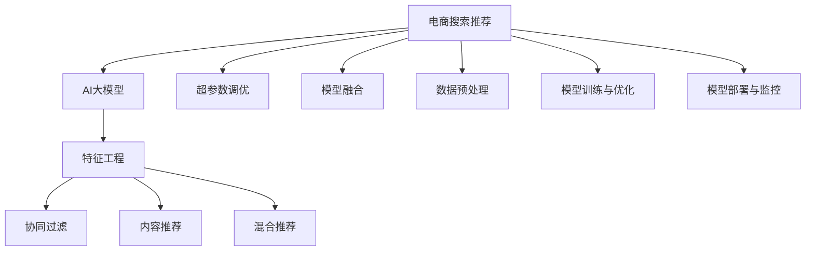

                 

# 电商搜索推荐效果优化中的AI大模型特征工程

> 关键词：电商搜索推荐, AI大模型, 特征工程, 模型优化, 超参数调优, 数据预处理, 模型融合

## 1. 背景介绍

### 1.1 问题由来
随着电子商务的迅猛发展，各大电商平台为了提升用户体验，纷纷采用了基于推荐系统的个性化推荐算法。这些算法通过分析用户的浏览行为、搜索记录、购买历史等数据，为每个用户推荐最合适的商品，以提高转化率和客单价。然而，由于推荐系统涉及的数据维度高、用户行为多样、商品信息复杂，算法模型往往难以准确把握用户真实意图，导致推荐效果不尽如人意。

为应对这些挑战，近年来，越来越多的电商平台开始引入人工智能技术，特别是深度学习模型和自然语言处理技术，来提升推荐系统的效果。但即便如此，AI大模型在电商搜索推荐中的部署和优化仍面临诸多困难。一方面，电商领域的数据特征复杂多样，如何高效利用这些特征是推荐系统优化的一大挑战。另一方面，大模型的训练和推理对计算资源要求高，如何在有限的资源条件下发挥大模型的优势，也是一个亟待解决的问题。

本文旨在介绍AI大模型在电商搜索推荐中的应用，深入探讨如何利用特征工程优化推荐效果，并提出具体的优化策略和技术手段，以期为电商平台提供实用的参考。

### 1.2 问题核心关键点
电商搜索推荐涉及的核心关键点包括：
- **用户意图识别**：分析用户的搜索查询和浏览记录，理解用户的购物意图和需求。
- **商品特征提取**：从商品标题、描述、价格、销量等属性中提取有价值的特征信息，用于匹配用户需求。
- **推荐算法设计**：选择合适的推荐算法，如协同过滤、内容推荐、混合推荐等，对用户和商品进行匹配推荐。
- **模型训练与优化**：在电商数据集上训练推荐模型，并通过特征工程、超参数调优、模型融合等手段提升模型效果。
- **模型部署与监控**：将优化后的模型部署到实际应用中，并实时监控模型效果，不断进行迭代优化。

## 2. 核心概念与联系

### 2.1 核心概念概述

为更好地理解AI大模型在电商搜索推荐中的应用，本节将介绍几个密切相关的核心概念：

- **AI大模型(AI Large Model)**：以Transformer为基础，融合深度学习、自然语言处理、计算机视觉等技术，具备强大的数据建模能力和泛化能力的大规模模型。

- **特征工程(Feature Engineering)**：在数据预处理阶段，通过对原始数据进行特征提取、变换、选择等操作，提高数据质量，降低噪声，优化数据结构，以提升模型训练效果。

- **推荐系统(Recommender System)**：利用用户行为数据和商品特征信息，通过算法模型为用户推荐最符合其需求的商品。

- **协同过滤(Collaborative Filtering)**：基于用户之间的相似性或商品之间的相似性，为用户推荐与其过去行为相似的其他商品。

- **内容推荐(Content-Based Recommendation)**：通过分析商品的属性特征，为用户推荐与其兴趣和需求匹配的商品。

- **混合推荐(Mixed Recommendation)**：结合协同过滤和内容推荐两种策略，取长补短，提升推荐效果。

- **超参数调优(Hyperparameter Tuning)**：通过调整模型的超参数，如学习率、批大小、迭代轮数等，优化模型性能。

- **模型融合(Model Fusion)**：将多个模型进行组合，利用各自的优势，提升推荐效果。

- **数据预处理(Data Preprocessing)**：对原始数据进行清洗、归一化、去重等处理，以提高数据质量。

这些核心概念之间的逻辑关系可以通过以下Mermaid流程图来展示：



这个流程图展示了大模型在电商推荐中的应用流程：

1. 电商搜索推荐系统利用AI大模型处理用户和商品数据。
2. 通过特征工程提取和选择有价值的数据特征。
3. 选择合适的推荐算法，设计推荐策略。
4. 在电商数据集上训练推荐模型，并通过超参数调优和模型融合等手段优化模型效果。
5. 将优化后的模型部署到实际应用中，并实时监控模型效果，进行迭代优化。

## 3. 核心算法原理 & 具体操作步骤
### 3.1 算法原理概述

基于AI大模型的电商搜索推荐系统，其核心算法原理包括特征工程、推荐算法设计和模型训练优化三个部分。具体而言：

- **特征工程**：从电商数据中提取和选择有意义的特征，提高模型的输入质量。
- **推荐算法设计**：结合用户行为和商品属性，选择合适的推荐策略，构建推荐模型。
- **模型训练与优化**：利用电商数据训练推荐模型，并通过超参数调优和模型融合等手段提升模型性能。

### 3.2 算法步骤详解

**Step 1: 数据预处理**
- 收集电商数据，包括用户行为数据、商品属性数据等。
- 清洗和整理数据，去除缺失值、异常值和重复数据。
- 归一化和标准化数据，使其符合模型输入要求。

**Step 2: 特征提取与选择**
- 对用户行为数据进行分词和编码，提取文本特征。
- 对商品属性数据进行编码，提取结构化特征。
- 使用向量化和降维技术，如TF-IDF、Word2Vec等，将文本特征转换为数值向量。
- 选择对推荐效果有较大影响的特征，构建特征集。

**Step 3: 推荐算法设计**
- 选择协同过滤、内容推荐或混合推荐算法，构建推荐模型。
- 设计模型结构，选择合适的网络层和激活函数。
- 设置模型超参数，如学习率、批大小、迭代轮数等。

**Step 4: 模型训练与优化**
- 将电商数据划分为训练集、验证集和测试集，按批次输入模型进行训练。
- 使用梯度下降等优化算法，更新模型参数，最小化损失函数。
- 在验证集上评估模型性能，调整超参数，避免过拟合。
- 通过模型融合等手段，提升模型性能。

**Step 5: 模型部署与监控**
- 将训练好的模型部署到实际应用中，进行实时推荐。
- 实时监控模型效果，收集用户反馈，不断优化模型。

### 3.3 算法优缺点

基于AI大模型的电商搜索推荐系统具有以下优点：
1. 强大的数据建模能力：大模型能够处理高维度的电商数据，提取复杂的用户和商品特征。
2. 高效的推荐策略：大模型具备强大的泛化能力，能够在复杂的电商场景中取得较好的推荐效果。
3. 快速迭代优化：通过特征工程和超参数调优，可以快速提升模型效果。
4. 可解释性强：大模型能够通过激活图等手段，解释模型的决策过程，提高推荐系统的透明度。

但该方法也存在一定的局限性：
1. 对计算资源要求高：大模型的训练和推理需要大量的计算资源。
2. 特征提取复杂：电商数据特征多样化，需要精心设计特征提取方法。
3. 超参数调优困难：大模型的超参数数量众多，调优过程复杂。
4. 模型泛化能力依赖数据质量：电商数据质量参差不齐，对模型泛化能力有一定影响。
5. 实时性要求高：电商系统需要实时推荐，大模型推理速度较慢，需要优化部署方式。

### 3.4 算法应用领域

AI大模型在电商搜索推荐中的应用场景非常广泛，包括但不限于：
- **个性化推荐**：根据用户历史行为和实时搜索记录，为用户推荐个性化商品。
- **商品搜索排序**：优化搜索结果排序，提高用户的点击率和转化率。
- **购物车推荐**：为用户推荐购物车中的商品，提升客单价。
- **新用户引导**：为新用户推荐热销商品，提高用户留存率。
- **交叉销售**：利用用户购买历史，推荐相关商品，增加附加销售。

## 4. 数学模型和公式 & 详细讲解  
### 4.1 数学模型构建

基于AI大模型的电商推荐系统，其数学模型主要包含以下几个部分：

1. **用户表示模型**：将用户历史行为编码为向量，表示用户的兴趣偏好。
2. **商品表示模型**：将商品属性数据编码为向量，表示商品特征。
3. **推荐模型**：将用户表示和商品表示进行匹配，计算推荐概率。

本文以协同过滤推荐为例，介绍推荐模型的构建和优化过程。

**用户表示模型**：
设用户 $u$ 的历史行为数据为 $X_u$，通过TF-IDF等方法，将 $X_u$ 转换为向量 $U_u$。

**商品表示模型**：
设商品 $i$ 的属性数据为 $Y_i$，通过TF-IDF等方法，将 $Y_i$ 转换为向量 $V_i$。

**推荐模型**：
设推荐函数为 $F(U_u, V_i)$，通过训练得到 $F$，用于计算用户 $u$ 对商品 $i$ 的推荐概率 $p(u, i)$。

### 4.2 公式推导过程

以协同过滤推荐为例，推荐模型 $F$ 可以表示为：

$$
F(U_u, V_i) = \langle U_u, V_i \rangle / ||U_u|| ||V_i||
$$

其中，$\langle U_u, V_i \rangle$ 表示向量点积，$||U_u||$ 和 $||V_i||$ 分别表示向量 $U_u$ 和 $V_i$ 的范数。

通过训练得到推荐函数 $F$ 后，对每个用户 $u$，计算其对商品 $i$ 的推荐概率：

$$
p(u, i) = F(U_u, V_i)
$$

对于用户 $u$，推荐排名为 $P_u$，按照推荐概率大小排序，取前 $N$ 个商品推荐给用户。

### 4.3 案例分析与讲解

以阿里巴巴的推荐系统为例，介绍其特征工程和模型优化过程。

阿里巴巴的推荐系统由以下几个关键模块构成：
1. **数据预处理模块**：对原始数据进行清洗、归一化和去重，生成特征向量。
2. **特征提取模块**：从电商数据中提取文本特征和结构化特征，使用Word2Vec等方法将文本转换为数值向量。
3. **协同过滤模块**：构建协同过滤模型，计算用户-商品相似度，推荐相似商品。
4. **内容推荐模块**：分析商品属性，计算商品相似度，推荐相似商品。
5. **模型融合模块**：将协同过滤和内容推荐结果融合，生成最终推荐列表。
6. **超参数调优模块**：通过网格搜索等方法，调整模型超参数，优化推荐效果。
7. **实时监控模块**：实时监控模型效果，收集用户反馈，持续优化推荐系统。

阿里巴巴的推荐系统在特征工程和模型优化方面，采用了多种技术和方法，如深度学习、增强学习、神经网络等，使得系统效果显著提升。

## 5. 项目实践：代码实例和详细解释说明
### 5.1 开发环境搭建

在进行电商搜索推荐系统开发前，我们需要准备好开发环境。以下是使用Python进行TensorFlow开发的环境配置流程：

1. 安装Anaconda：从官网下载并安装Anaconda，用于创建独立的Python环境。

2. 创建并激活虚拟环境：
```bash
conda create -n recommendation-env python=3.8 
conda activate recommendation-env
```

3. 安装TensorFlow：根据CUDA版本，从官网获取对应的安装命令。例如：
```bash
conda install tensorflow==2.7
```

4. 安装必要的工具包：
```bash
pip install numpy pandas scikit-learn tqdm jupyter notebook ipython
```

完成上述步骤后，即可在`recommendation-env`环境中开始推荐系统开发。

### 5.2 源代码详细实现

我们以协同过滤推荐为例，给出使用TensorFlow进行推荐系统开发的PyTorch代码实现。

```python
import tensorflow as tf
from tensorflow.keras.layers import Input, Embedding, Dot, Dense, Flatten
from tensorflow.keras.models import Model
from tensorflow.keras.callbacks import EarlyStopping

# 定义输入层
user_input = Input(shape=(5,), name='user')
item_input = Input(shape=(5,), name='item')

# 定义用户表示模型
user_embedding = Embedding(10000, 64, input_length=5)(user_input)
user_embedding = Flatten()(user_embedding)

# 定义商品表示模型
item_embedding = Embedding(10000, 64, input_length=5)(item_input)
item_embedding = Flatten()(item_embedding)

# 定义推荐模型
dot_product = Dot(axes=(1, 1))([user_embedding, item_embedding])
dot_product = Dense(1)(dot_product)
rating = dot_product[0]

# 定义模型
model = Model(inputs=[user_input, item_input], outputs=rating)

# 编译模型
model.compile(optimizer='adam', loss='mse')

# 设置超参数回调
early_stopping = EarlyStopping(monitor='val_loss', patience=5)

# 训练模型
model.fit([train_user_ids, train_item_ids], train_ratings, epochs=10, validation_data=([val_user_ids, val_item_ids], val_ratings), callbacks=[early_stopping])
```

### 5.3 代码解读与分析

让我们再详细解读一下关键代码的实现细节：

**Input层**：
```python
user_input = Input(shape=(5,), name='user')
item_input = Input(shape=(5,), name='item')
```

定义了用户和商品的输入层，形状为 (5,)，即每个用户和商品有5个特征。

**Embedding层**：
```python
user_embedding = Embedding(10000, 64, input_length=5)(user_input)
user_embedding = Flatten()(user_embedding)
```

将用户和商品的特征向量输入到Embedding层，将其映射到64维的向量空间。然后通过Flatten层，将高维向量展开为1维向量。

**Dot层**：
```python
dot_product = Dot(axes=(1, 1))([user_embedding, item_embedding])
```

使用Dot层计算用户和商品向量的点积，得到推荐得分。

**Dense层**：
```python
dot_product = Dense(1)(dot_product)
rating = dot_product[0]
```

将点积结果通过Dense层转换为1维输出，即推荐得分。

**Model层**：
```python
model = Model(inputs=[user_input, item_input], outputs=rating)
```

定义了推荐模型，输入为用户和商品特征，输出为推荐得分。

**编译模型**：
```python
model.compile(optimizer='adam', loss='mse')
```

编译模型，使用Adam优化器，均方误差损失函数。

**EarlyStopping回调**：
```python
early_stopping = EarlyStopping(monitor='val_loss', patience=5)
```

设置早停回调，当验证集损失连续5个epoch不提升时，停止训练。

**训练模型**：
```python
model.fit([train_user_ids, train_item_ids], train_ratings, epochs=10, validation_data=([val_user_ids, val_item_ids], val_ratings), callbacks=[early_stopping])
```

使用训练集数据训练模型，使用验证集数据评估模型效果，当验证集损失不提升时，停止训练。

## 6. 实际应用场景
### 6.1 智能推荐系统

智能推荐系统是电商搜索推荐中应用最广泛的场景之一。基于大模型的推荐系统可以显著提升推荐效果，改善用户体验。

具体而言，大模型可以学习到用户的复杂兴趣偏好，将商品特征进行精确建模，并通过协同过滤和内容推荐等策略，为每个用户生成个性化的推荐列表。对于新用户，也可以通过少样本学习等技术，快速了解其兴趣，进行推荐。

### 6.2 实时搜索排序

实时搜索排序是电商推荐中的另一个重要应用。通过大模型，可以快速对搜索结果进行排序，提高用户的点击率和转化率。

具体而言，大模型可以对用户搜索关键词和商品属性进行匹配，计算每条搜索结果的相关性得分，从而排序生成推荐列表。通过不断优化模型的特征提取和推荐策略，可以显著提升搜索排序效果。

### 6.3 购物车推荐

购物车推荐是电商推荐中的一个特殊场景。通过大模型，可以实时分析用户的购物车商品，推荐关联商品，提高客单价。

具体而言，大模型可以分析用户过去购买和浏览的商品，计算与购物车商品的相似度，推荐相关商品。通过动态更新模型参数，可以不断优化推荐策略，提升推荐效果。

### 6.4 新用户引导

新用户引导是电商推荐中的一个重要任务。通过大模型，可以为新用户推荐热销商品，提高用户留存率。

具体而言，大模型可以对新用户的历史行为和属性进行建模，推荐其可能感兴趣的商品。通过不断优化模型，可以提升新用户引导效果，降低流失率。

### 6.5 交叉销售

交叉销售是电商推荐中的一个重要目标。通过大模型，可以为用户推荐相关商品，增加附加销售。

具体而言，大模型可以对用户购买历史进行建模，推荐相关商品。通过不断优化推荐策略，可以提升交叉销售效果，增加附加销售。

## 7. 工具和资源推荐
### 7.1 学习资源推荐

为了帮助开发者系统掌握大模型在电商搜索推荐中的应用，这里推荐一些优质的学习资源：

1. 《推荐系统：原理与实践》系列博文：由大模型技术专家撰写，深入浅出地介绍了推荐系统的原理和实践。

2. CS231n《深度学习图像识别》课程：斯坦福大学开设的计算机视觉明星课程，包含推荐系统的章节，有Lecture视频和配套作业。

3. 《深度学习入门》书籍：深度学习领域的经典入门书籍，涵盖推荐系统等内容。

4. TensorFlow官方文档：TensorFlow的官方文档，提供了推荐系统的详细示例和教程。

5. Weights & Biases：模型训练的实验跟踪工具，可以记录和可视化模型训练过程中的各项指标，方便对比和调优。

通过对这些资源的学习实践，相信你一定能够快速掌握大模型在电商推荐中的应用，并用于解决实际的推荐问题。

### 7.2 开发工具推荐

高效的开发离不开优秀的工具支持。以下是几款用于电商搜索推荐系统开发的常用工具：

1. TensorFlow：由Google主导开发的开源深度学习框架，生产部署方便，适合大规模工程应用。

2. PyTorch：基于Python的开源深度学习框架，灵活的计算图，适合快速迭代研究。

3. Keras：高层API，适合快速搭建推荐系统模型。

4. Weights & Biases：模型训练的实验跟踪工具，可以记录和可视化模型训练过程中的各项指标，方便对比和调优。

5. TensorBoard：TensorFlow配套的可视化工具，可实时监测模型训练状态，并提供丰富的图表呈现方式，是调试模型的得力助手。

合理利用这些工具，可以显著提升电商搜索推荐系统的开发效率，加快创新迭代的步伐。

### 7.3 相关论文推荐

电商搜索推荐涉及的研究领域广泛，以下是几篇奠基性的相关论文，推荐阅读：

1. "The Bellman Equation of Reinforcement Learning"：DeepMind的研究论文，介绍了基于增强学习的推荐系统。

2. "Collaborative Filtering for Implicit Feedback Datasets"：IJCAI2013论文，介绍了协同过滤推荐算法。

3. "Neural Collaborative Filtering"：KDD2017论文，介绍了基于神经网络的推荐系统。

4. "Hybrid Recommendation Algorithm for E-commerce recommendation system"：IEEE JCNKD2017论文，介绍了混合推荐算法。

这些论文代表了大模型在电商推荐中的应用趋势，通过学习这些前沿成果，可以帮助研究者把握学科前进方向，激发更多的创新灵感。

## 8. 总结：未来发展趋势与挑战

### 8.1 总结

本文对基于AI大模型的电商搜索推荐系统进行了全面系统的介绍。首先阐述了电商搜索推荐系统中的核心概念和应用场景，明确了特征工程和模型优化在推荐系统中的重要作用。其次，从原理到实践，详细讲解了推荐模型的构建和优化过程，给出了推荐系统开发的完整代码实例。同时，本文还广泛探讨了推荐系统在电商搜索推荐中的应用前景，展示了大模型在推荐系统中的广泛应用。

通过本文的系统梳理，可以看到，基于大模型的电商搜索推荐系统已经取得了显著效果，并在电商推荐中得到了广泛应用。未来，伴随大模型的不断演进和推荐算法的创新，推荐系统的推荐效果将进一步提升，为用户带来更好的购物体验。

### 8.2 未来发展趋势

展望未来，电商搜索推荐系统将呈现以下几个发展趋势：

1. **多模态推荐**：结合图像、视频、语音等多模态信息，提升推荐效果。

2. **实时推荐**：通过流式计算和实时数据处理，提升推荐系统的响应速度和效果。

3. **个性化推荐**：通过深度学习等技术，提升推荐系统的个性化能力，更好地匹配用户需求。

4. **智能推荐**：结合增强学习、强化学习等技术，提升推荐系统的智能化水平。

5. **可解释性**：提升推荐系统的可解释性，帮助用户理解推荐结果，增加用户的信任和满意度。

6. **安全推荐**：通过安全推荐技术，保障推荐系统的公平性和透明性，防止算法偏见和数据滥用。

以上趋势凸显了大模型在电商推荐中的广阔前景。这些方向的探索发展，必将进一步提升电商搜索推荐系统的性能和应用范围，为电商平台带来更加优质的用户体验。

### 8.3 面临的挑战

尽管电商搜索推荐系统取得了显著进展，但在迈向更加智能化、普适化应用的过程中，仍面临诸多挑战：

1. **计算资源瓶颈**：大模型的训练和推理对计算资源要求高，如何在有限的资源条件下发挥大模型的优势，还需要更多优化手段。

2. **数据质量问题**：电商数据质量参差不齐，如何提高数据质量，提升模型的泛化能力，还需要进一步的探索。

3. **推荐算法多样性**：推荐的策略和方法多样，如何选择合适的推荐算法，设计合理的推荐策略，还需要更多研究。

4. **用户隐私保护**：电商数据涉及用户隐私，如何保护用户隐私，提升用户信任，还需要更多技术手段。

5. **模型鲁棒性**：大模型容易过拟合，如何在保证推荐效果的同时，提高模型的鲁棒性，还需要更多优化策略。

6. **实时推荐**：实时推荐对系统的延迟和响应速度要求高，如何在保证效果的同时，提高实时性，还需要更多优化手段。

正视这些挑战，积极应对并寻求突破，将是大模型在电商推荐中取得突破的重要方向。相信随着学界和产业界的共同努力，这些挑战终将一一被克服，大模型必将在电商推荐中取得更大的成功。

### 8.4 研究展望

面对电商推荐中的挑战，未来的研究需要在以下几个方面寻求新的突破：

1. **多模态数据融合**：结合多模态数据，提升推荐系统的泛化能力和表现。

2. **实时推荐算法**：研究实时推荐算法，提升系统的响应速度和效果。

3. **深度学习优化**：通过优化深度学习模型，提高推荐系统的泛化能力和性能。

4. **增强学习技术**：结合增强学习技术，提升推荐系统的智能化水平。

5. **用户隐私保护**：研究用户隐私保护技术，保护用户数据安全。

6. **可解释性研究**：研究推荐系统的可解释性，提高系统的透明度和可信度。

这些研究方向的探索，必将引领电商搜索推荐系统的技术突破，为电商平台带来更加优质和高效的推荐系统，提升用户体验。

## 9. 附录：常见问题与解答

**Q1：电商推荐系统中如何处理稀疏数据？**

A: 电商数据往往存在稀疏性，即大多数用户和商品之间的交互行为很少。处理稀疏数据的方法主要有两种：

1. 矩阵分解：将用户-商品矩阵分解为低秩矩阵，利用低秩矩阵的性质进行推荐。
2. 协同过滤：通过用户-商品相似度进行推荐，忽略缺失值。

**Q2：如何优化电商推荐系统的推荐效果？**

A: 电商推荐系统的推荐效果可以通过以下方法优化：

1. 特征工程：从电商数据中提取有价值的特征，提高模型的输入质量。
2. 模型优化：选择合适的推荐算法，优化模型结构，提升模型效果。
3. 超参数调优：调整模型的超参数，如学习率、批大小、迭代轮数等，优化模型性能。
4. 模型融合：将多个模型的预测结果进行融合，提升推荐效果。
5. 实时推荐：利用实时数据，动态更新模型，提升推荐效果。

**Q3：电商推荐系统中的多模态数据融合技术有哪些？**

A: 电商推荐系统中的多模态数据融合技术主要有以下几种：

1. 基于协同过滤的多模态融合：结合用户和商品的多种特征，提升推荐效果。
2. 基于内容推荐的多模态融合：结合商品的多维特征，提升推荐效果。
3. 基于混合推荐的多模态融合：结合协同过滤和内容推荐，取长补短，提升推荐效果。

**Q4：电商推荐系统中如何处理噪声数据？**

A: 电商推荐系统中的噪声数据可以通过以下方法处理：

1. 数据清洗：通过规则过滤，去除噪声数据。
2. 数据降维：使用PCA等方法，降低数据的维度，减少噪声。
3. 数据滤波：利用异常检测算法，过滤异常数据。
4. 数据平滑：通过平滑处理，减少噪声对模型的影响。

**Q5：电商推荐系统中如何提升推荐系统的实时性？**

A: 电商推荐系统的实时性可以通过以下方法提升：

1. 流式计算：利用流式计算技术，实时处理电商数据，提升推荐系统的响应速度。
2. 模型优化：优化推荐模型的计算图，减少计算量，提升推理速度。
3. 分布式计算：利用分布式计算技术，提高系统的处理能力。
4. 数据缓存：利用缓存技术，减少数据读取时间，提升系统响应速度。

这些方法可以提升电商推荐系统的实时性，满足用户对实时推荐的需求。

---

作者：禅与计算机程序设计艺术 / Zen and the Art of Computer Programming

