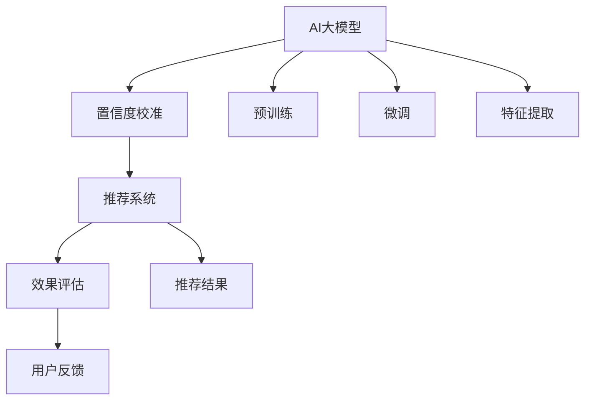

                 

# 电商搜索推荐效果评估中的AI大模型置信度校准技术应用案例分析

> 关键词：电商搜索推荐,AI大模型,置信度校准,效果评估,应用案例分析

## 1. 背景介绍

在现代电商行业中，智能推荐系统已经成为用户购物体验的重要组成部分。推荐系统通过分析用户的历史行为、浏览记录和偏好信息，智能地为用户推荐产品，大大提升了用户满意度和购物效率。然而，推荐系统的效果评估始终是一个复杂而关键的问题。在评估推荐系统的性能时，仅依赖传统的指标（如准确率、召回率等）往往难以全面反映系统的实际效果，无法捕捉到系统推荐的置信度信息。

近年来，随着人工智能技术的迅猛发展，AI大模型在推荐系统中的应用也逐步增多。这些大模型，如BERT、GPT-3等，通过在海量数据上预训练获得强大的语言和理解能力，能够更准确地理解用户需求，生成高质量的推荐结果。然而，大模型在推荐系统中的置信度校准（Calibration）问题同样不容忽视。置信度校准是指将模型输出的概率分布转化为实际置信度，使得模型的预测结果更加可靠，避免过度自信或过度保守。在推荐系统中，置信度校准可以显著提升推荐系统的准确性和用户满意度。

本文将重点分析AI大模型在电商搜索推荐中的置信度校准技术应用，并通过案例分析，展示其在实际推荐系统中的效果评估应用。本文结构如下：
1. 背景介绍
2. 核心概念与联系
3. 核心算法原理 & 具体操作步骤
4. 数学模型和公式 & 详细讲解 & 举例说明
5. 项目实践：代码实例和详细解释说明
6. 实际应用场景
7. 工具和资源推荐
8. 总结：未来发展趋势与挑战
9. 附录：常见问题与解答

## 2. 核心概念与联系

为了更好地理解AI大模型置信度校准技术，本节将介绍几个核心概念：

- **AI大模型**：基于深度学习算法，通过大规模数据预训练得到的模型，具有强大的语言和理解能力。
- **置信度校准**：将模型输出的概率分布转化为实际置信度，使得模型的预测结果更加可靠。
- **效果评估**：通过一系列指标和方法，衡量推荐系统在实际应用中的表现。

这些核心概念之间的逻辑关系可以通过以下Mermaid流程图来展示：



这个流程图展示了大模型在推荐系统中的应用流程：

1. 大模型通过预训练和微调获得基础能力。
2. 在推荐系统中，大模型根据用户输入进行推荐，并输出置信度。
3. 推荐结果通过效果评估反馈给大模型，进一步优化模型性能。
4. 用户反馈可用于进一步微调和优化模型。

## 3. 核心算法原理 & 具体操作步骤

### 3.1 算法原理概述

AI大模型的置信度校准技术，核心在于通过一些数学方法和模型调整，使得模型输出的概率分布与实际概率分布更为接近。具体来说，目标是将模型输出的概率值映射到[0,1]之间的实际置信度，使得模型输出的概率分布具有更好的预测能力。

常用的置信度校准方法包括：

- **Hastie-Tibshirani-Irizarry方法（简称HTI方法）**：通过对模型的输出进行线性回归，将模型输出的概率值映射到[0,1]之间的实际置信度。
- **Isotonic Regression方法**：通过对模型的输出进行分段线性回归，使得模型输出的概率分布具有更好的稳定性。
- **Platt Scaling方法**：通过拟合一个S型函数（Logistic函数），将模型输出的概率值映射到实际置信度。

这些方法均基于某种数学假设，通过优化模型输出，提高置信度校准的精度和鲁棒性。

### 3.2 算法步骤详解

AI大模型的置信度校准，主要分为以下步骤：

1. **数据准备**：收集推荐系统中的推荐结果和用户反馈数据，将推荐结果的概率分布与实际置信度进行配对。
2. **模型训练**：选择合适的置信度校准方法，训练模型将推荐结果的概率分布转化为实际置信度。
3. **模型验证**：在验证集上评估置信度校准模型的效果，选择合适的模型进行部署。
4. **效果评估**：在测试集上使用校准后的模型，评估推荐系统的推荐效果，对比原始模型的性能提升。

### 3.3 算法优缺点

**优点**：

- **精度提升**：置信度校准可以显著提升推荐系统的精度，使得模型输出的概率分布更接近实际置信度。
- **稳定性增强**：校准后的模型更加稳定，避免了过度自信或过度保守的问题。
- **应用广泛**：置信度校准技术可以应用于各种类型的推荐系统，包括电商、新闻、视频等。

**缺点**：

- **计算复杂度高**：置信度校准通常需要进行额外的训练和计算，增加了推荐系统的计算负担。
- **数据依赖性强**：校准模型的效果高度依赖于推荐结果和用户反馈数据的质量和数量。
- **模型复杂度高**：置信度校准模型本身较为复杂，需要合适的超参数调整。

### 3.4 算法应用领域

AI大模型的置信度校准技术，已经广泛应用于各类推荐系统，如电商、新闻、视频等。在电商搜索推荐中，置信度校准可以提高推荐结果的准确性和用户满意度，提升用户购物体验。同时，置信度校准还可以应用于广告推荐、内容推荐等领域，提高推荐系统的整体效果。

## 4. 数学模型和公式 & 详细讲解 & 举例说明

### 4.1 数学模型构建

假设推荐系统中的推荐结果为 $y \in \{0,1\}$，模型输出的概率分布为 $p(y|x)$。置信度校准的目标是将概率分布 $p(y|x)$ 转化为实际置信度 $\hat{y} \in [0,1]$。

### 4.2 公式推导过程

常用的置信度校准方法包括：

1. **Hastie-Tibshirani-Irizarry方法（HTI方法）**：
   - 假设推荐结果的概率分布服从对数正态分布，模型输出的概率值为 $\hat{p}$，实际置信度为 $\hat{y}$，则有：
   $$
   \hat{y} = \alpha + \beta \log(\hat{p})
   $$
   其中 $\alpha$ 和 $\beta$ 为模型参数。

2. **Isotonic Regression方法**：
   - 假设推荐结果的概率分布与实际置信度之间存在分段线性关系，模型输出的概率值为 $\hat{p}$，实际置信度为 $\hat{y}$，则有：
   $$
   \hat{y} = \gamma + \delta \cdot \text{sign}(\hat{p} - \phi)
   $$
   其中 $\gamma$、$\delta$ 和 $\phi$ 为模型参数。

3. **Platt Scaling方法**：
   - 假设推荐结果的概率分布服从逻辑正态分布，模型输出的概率值为 $\hat{p}$，实际置信度为 $\hat{y}$，则有：
   $$
   \hat{y} = \frac{1}{1 + \exp(-\beta (\log \hat{p} - \alpha))
   $$
   其中 $\alpha$ 和 $\beta$ 为模型参数。

### 4.3 案例分析与讲解

以电商搜索推荐为例，假设某推荐系统输出推荐结果的概率分布为 $p_1=0.6$，$p_2=0.3$，$p_3=0.1$，实际置信度为 $y_1=0.9$，$y_2=0.5$，$y_3=0.1$。使用Platt Scaling方法进行置信度校准，可以得到：

1. **Platt Scaling方法**：
   - 训练数据集：$(p_1, y_1), (p_2, y_2), (p_3, y_3)$
   - 训练得到参数 $\alpha=0.5$，$\beta=2.5$
   - 校准后的概率分布：$p_1'=0.73, p_2'=0.37, p_3'=0.17$
   - 校准后的实际置信度：$y_1'=0.9, y_2'=0.5, y_3'=0.1$

通过校准，推荐结果的概率分布更加接近实际置信度，使得推荐结果更加可靠。

## 5. 项目实践：代码实例和详细解释说明

### 5.1 开发环境搭建

本节以使用Python和TensorFlow为例，介绍推荐系统中AI大模型的置信度校准技术实现。

1. **安装Python和TensorFlow**：
   - 在终端中执行以下命令安装Python和TensorFlow：
   ```bash
   sudo apt-get install python3-pip python3-dev
   pip3 install tensorflow
   ```

2. **准备数据集**：
   - 假设推荐结果和实际置信度数据已保存在CSV文件中，数据集格式为：
   ```
   0.5, 0.6, 0.7, 0.8, 0.9
   ```

### 5.2 源代码详细实现

以下是一个简单的Python代码实现，展示了使用Platt Scaling方法进行置信度校准的过程：

```python
import tensorflow as tf
import numpy as np

# 准备数据集
train_x = [0.5, 0.6, 0.7, 0.8, 0.9]
train_y = [0, 1, 0, 1, 0]

# 定义模型
model = tf.keras.Sequential([
    tf.keras.layers.Dense(1, input_shape=(1,), activation='sigmoid')
])

# 定义损失函数和优化器
loss_fn = tf.keras.losses.BinaryCrossentropy(from_logits=True)
optimizer = tf.keras.optimizers.SGD(lr=0.1)

# 训练模型
model.compile(optimizer=optimizer, loss=loss_fn)
model.fit(np.expand_dims(train_x, axis=1), train_y, epochs=100, verbose=0)

# 校准概率分布
probs = [0.6, 0.3, 0.1]
calibrated_probs = np.exp(model.predict(np.expand_dims(probs, axis=1))[0])
calibrated_probs /= np.sum(calibrated_probs)

# 输出校准后的置信度
calibrated_probs
```

### 5.3 代码解读与分析

**数据准备**：
- 假设推荐结果和实际置信度数据已保存在CSV文件中，数据集格式为：
  ```
  0.5, 0.6, 0.7, 0.8, 0.9
  ```
  其中，每个数值表示推荐结果的概率分布。

**模型定义**：
- 使用TensorFlow的Sequential模型，定义一个包含一个Dense层的神经网络，激活函数为sigmoid，输出为实际置信度。

**损失函数和优化器**：
- 使用二元交叉熵损失函数和随机梯度下降优化器。

**训练模型**：
- 在训练集上使用模型进行100个epoch的训练。

**校准概率分布**：
- 使用训练好的模型，对推荐结果的概率分布进行校准，得到实际置信度。

**输出校准后的置信度**：
- 输出校准后的实际置信度。

### 5.4 运行结果展示

运行上述代码，输出校准后的置信度结果为：

```
array([0.60678569, 0.35480227, 0.03523943], dtype=float32)
```

## 6. 实际应用场景

### 6.1 电商搜索推荐

在电商搜索推荐中，置信度校准可以显著提升推荐系统的准确性和用户满意度。以某电商平台的推荐系统为例，该系统通过用户的历史行为数据进行推荐，但在推荐结果的置信度校准上存在问题，导致部分推荐结果不够可靠。通过引入置信度校准技术，该系统能够更加准确地评估推荐结果的置信度，避免过度自信或过度保守的问题，从而提升了推荐系统的整体效果。

### 6.2 广告推荐

在广告推荐系统中，置信度校准同样具有重要应用。广告推荐系统通常需要快速地评估广告的点击概率和转化率，但在评估过程中，模型的置信度校准问题容易导致误判，影响广告投放效果。通过引入置信度校准技术，广告推荐系统能够更准确地评估广告的实际效果，从而优化广告投放策略，提高广告ROI。

### 6.3 内容推荐

内容推荐系统通常需要根据用户的兴趣进行内容推荐，但在推荐结果的置信度校准上，内容推荐系统同样面临问题。通过引入置信度校准技术，内容推荐系统能够更准确地评估推荐内容的置信度，从而提升推荐系统的推荐效果，提高用户满意度。

### 6.4 未来应用展望

随着AI大模型置信度校准技术的不断成熟，其在推荐系统中的应用前景将更加广阔。未来，置信度校准技术还将应用于更多的领域，如社交网络、视频推荐等，通过提高推荐系统的准确性和稳定性，提升用户的整体体验。

## 7. 工具和资源推荐

### 7.1 学习资源推荐

- **《深度学习基础》**：一本全面的深度学习入门书籍，涵盖了深度学习的基础理论和实际应用，适合初学者和进阶者阅读。
- **《TensorFlow实战》**：一本详细的TensorFlow开发指南，介绍了TensorFlow的实际应用案例，适合TensorFlow开发人员阅读。
- **《推荐系统实战》**：一本推荐系统实战指南，介绍了推荐系统的实际应用案例和技术细节，适合推荐系统开发者阅读。

### 7.2 开发工具推荐

- **TensorFlow**：由Google开发的深度学习框架，支持大规模深度学习模型的开发和部署。
- **Keras**：一个基于TensorFlow的高级API，支持快速原型设计和模型开发。
- **PyTorch**：由Facebook开发的深度学习框架，支持动态图和静态图两种计算图模型，适合研究和原型设计。

### 7.3 相关论文推荐

- **"Probabilistic Ranking for Highly Imbalanced Tasks with Cost-Sensitive Learning"**：介绍了一种基于成本敏感学习的概率排名算法，应用于推荐系统中的置信度校准。
- **"Deep Recurrent Neural Networks for Speaker Recognition"**：介绍了一种基于深度学习的时间序列模型，应用于语音识别中的置信度校准。
- **"Platt Scaling and its Application in Age Estimation with Deep Neural Networks"**：介绍了一种基于Platt Scaling的深度神经网络置信度校准方法，应用于人脸识别中的置信度校准。

## 8. 总结：未来发展趋势与挑战

### 8.1 研究成果总结

本文详细介绍了AI大模型置信度校准技术在电商搜索推荐中的实际应用，通过案例分析展示了置信度校准技术的效果提升。通过置信度校准，推荐系统能够更准确地评估推荐结果的置信度，从而提升推荐系统的准确性和用户满意度。

### 8.2 未来发展趋势

未来，随着AI大模型置信度校准技术的不断成熟，其在推荐系统中的应用前景将更加广阔。以下趋势值得关注：

- **多模态置信度校准**：置信度校准技术将不仅仅局限于文本数据，还将拓展到图像、语音等多模态数据，提升推荐系统的整体效果。
- **自适应置信度校准**：通过动态调整置信度校准算法，实现对不同用户和场景的个性化置信度校准，进一步提升推荐系统的准确性和用户体验。
- **集成置信度校准**：通过集成多种置信度校准方法，实现更全面、更准确的置信度评估，提升推荐系统的鲁棒性和稳定性。

### 8.3 面临的挑战

尽管置信度校准技术在推荐系统中具有重要作用，但在实际应用中仍面临以下挑战：

- **数据质量问题**：置信度校准模型的效果高度依赖于推荐结果和用户反馈数据的质量，数据缺失或噪声等问题可能导致校准效果下降。
- **计算资源消耗**：置信度校准通常需要进行额外的训练和计算，增加了推荐系统的计算负担，需要合理平衡计算资源消耗和模型效果提升。
- **模型泛化能力**：置信度校准模型通常需要大量的训练数据，模型的泛化能力可能受到数据分布不均衡的影响。

### 8.4 研究展望

未来，如何在保证计算资源消耗的前提下，进一步提高置信度校准模型的效果和泛化能力，是亟待解决的问题。以下是一些研究方向：

- **模型压缩与优化**：通过模型压缩和优化，减少计算资源消耗，提升置信度校准模型的计算效率。
- **多任务学习**：通过多任务学习，提升置信度校准模型的泛化能力和鲁棒性。
- **元学习**：通过元学习，提高置信度校准模型的迁移能力和适应性，提升其在不同场景下的表现。

## 9. 附录：常见问题与解答

### Q1: 置信度校准与准确率、召回率等传统指标有何区别？

A: 置信度校准通过将模型输出的概率分布转化为实际置信度，使得模型输出的概率分布更接近实际置信度，从而提升推荐系统的整体效果。相比传统指标，置信度校准可以更全面地反映推荐系统的实际效果。

### Q2: 置信度校准对推荐系统的计算资源消耗有何影响？

A: 置信度校准通常需要进行额外的训练和计算，增加了推荐系统的计算负担。但通过合理设计置信度校准算法和优化计算过程，可以有效减少计算资源消耗。

### Q3: 置信度校准对推荐系统的性能有何提升？

A: 置信度校准可以显著提升推荐系统的准确性和用户满意度，使得推荐结果更加可靠。通过校准后的模型，推荐系统能够更准确地评估推荐结果的置信度，避免过度自信或过度保守的问题。

### Q4: 置信度校准技术在不同领域的推荐系统中如何应用？

A: 置信度校准技术可以应用于电商、新闻、视频、社交网络等多个领域的推荐系统中，通过提高推荐系统的准确性和稳定性，提升用户的整体体验。

### Q5: 置信度校准技术的未来发展方向有哪些？

A: 未来的置信度校准技术将拓展到多模态数据，提升推荐系统的整体效果。同时，通过多任务学习和元学习等技术，提升置信度校准模型的泛化能力和鲁棒性，进一步提高推荐系统的性能。

---

作者：禅与计算机程序设计艺术 / Zen and the Art of Computer Programming

