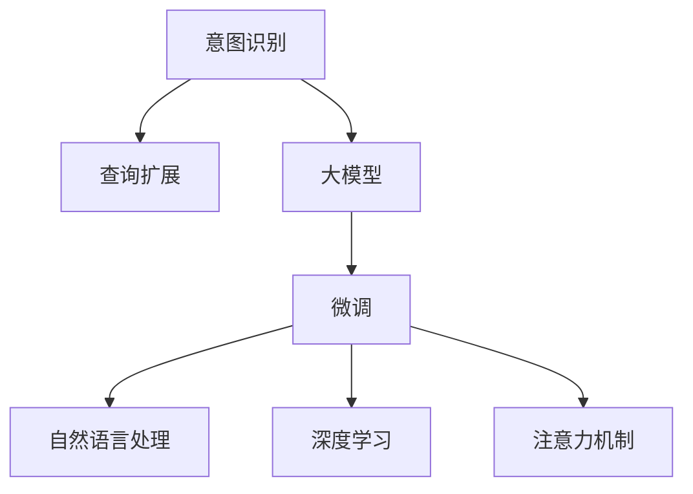

                 

# 电商搜索的意图识别与查询扩展：AI大模型的新突破

> 关键词：意图识别, 查询扩展, 电商搜索, AI大模型, 自然语言处理, 深度学习, 预训练语言模型

## 1. 背景介绍

### 1.1 问题由来

电商搜索是电商平台的核心功能之一，它帮助用户快速找到需要的商品，极大提升了用户体验和交易效率。然而，用户在搜索时往往有明确的意图，但难以在搜索框中输入精确的查询词。这不仅增加了用户输入的复杂度，也降低了搜索的效率和精度。

为解决这个问题，各大电商平台纷纷引入AI技术，特别是基于大模型的自然语言处理(NLP)技术。AI大模型通过学习大量的文本数据，能够理解自然语言的多样性和复杂性，从而更准确地识别用户查询的意图。而意图识别和查询扩展技术则在此基础上进一步优化搜索体验，提升了电商搜索的智能化水平。

### 1.2 问题核心关键点

意图识别和查询扩展的核心在于：
- **意图识别**：通过分析用户输入的自然语言文本，识别出用户的意图。意图可以是购买、浏览、对比等，而不仅仅是关键词匹配。
- **查询扩展**：根据用户的意图和已输入的查询词，自动生成更精准的查询词或建议，辅助用户完成搜索。
- **大模型优势**：利用预训练语言模型强大的语言理解能力，在少样本、小数据量的情况下，仍能取得优异的性能。

## 2. 核心概念与联系

### 2.1 核心概念概述

为更好地理解意图识别和查询扩展技术，本节将介绍几个密切相关的核心概念：

- **意图识别**：通过自然语言理解技术，识别用户输入文本的意图。常见的意图识别方法包括监督学习、序列标注、分类器等。

- **查询扩展**：在用户输入的基础上，利用上下文理解生成更准确的查询词，辅助用户完成搜索。常见的查询扩展方法包括基于关键词的扩展、基于语义的扩展等。

- **大模型**：如BERT、GPT等预训练语言模型，通过大规模无标签文本数据预训练获得丰富的语言知识，用于下游任务的微调。

- **微调**：在大模型的基础上，通过下游任务的数据集进行有监督学习，优化模型在该任务上的表现。

- **自然语言处理(NLP)**：利用计算机技术处理和理解人类语言的技术。意图识别和查询扩展正是NLP在电商搜索中的重要应用。

- **深度学习**：通过多层神经网络模型，利用大量标注数据训练出高精度的预测模型。意图识别和查询扩展技术广泛应用深度学习算法。

- **注意力机制**：利用自注意力机制进行上下文相关信息的提取，在长文本序列处理中效果显著。

这些概念之间的逻辑关系可以通过以下Mermaid流程图来展示：



这个流程图展示了大模型在电商搜索中的核心概念及其之间的关系：

1. 大模型通过大规模预训练获得语言知识，用于下游任务的微调。
2. 微调是大模型应用的关键环节，通过少量标注数据，提升模型在特定任务上的表现。
3. 意图识别和查询扩展是微调在电商搜索中的具体应用。
4. NLP是意图识别和查询扩展技术的基础。
5. 深度学习为NLP提供强大的算法支持。
6. 注意力机制是大模型提升上下文理解能力的核心技术。

## 3. 核心算法原理 & 具体操作步骤

### 3.1 算法原理概述

电商搜索中的意图识别和查询扩展，通常基于预训练大模型进行微调。其核心思想是：将用户输入的文本作为输入，利用大模型的语言理解能力，自动识别用户的意图，并在意图的基础上生成更精准的查询词或建议。

具体来说，意图识别通常是一个文本分类问题，将用户输入文本分为多个意图类别，如购买、浏览、对比等。查询扩展则是一个文本生成问题，在用户输入的基础上，自动生成额外的查询词，帮助用户更精准地找到需要的商品。

### 3.2 算法步骤详解

电商搜索中的意图识别和查询扩展算法一般包括以下几个关键步骤：

**Step 1: 准备数据集**
- 收集电商平台的查询历史数据，标注用户的意图和点击行为，构建监督数据集。
- 将数据集划分为训练集、验证集和测试集。

**Step 2: 选择预训练模型**
- 选择合适的预训练语言模型，如BERT、GPT等。
- 在微调前，将预训练模型转换为可微调的形式，如去掉Transformer中的位置编码等。

**Step 3: 设计意图识别模型**
- 定义意图识别任务的输入和输出，如将用户输入文本映射到意图类别。
- 设计意图识别模型，可以是基于序列标注的CRF模型，也可以是基于分类器的SVM模型等。

**Step 4: 设计查询扩展模型**
- 定义查询扩展任务的输入和输出，如将用户输入文本生成新的查询词。
- 设计查询扩展模型，可以是基于seq2seq的Transformer模型，也可以基于预训练语言模型的微调模型等。

**Step 5: 微调模型**
- 使用电商搜索数据集，对意图识别和查询扩展模型进行有监督学习，优化模型参数。
- 在训练过程中，使用标签数据进行监督，同时引入正则化技术，防止过拟合。
- 在验证集上评估模型性能，调整超参数以避免过拟合。

**Step 6: 测试和部署**
- 在测试集上评估意图识别和查询扩展模型的性能。
- 部署模型到电商平台，集成到搜索功能中。
- 持续收集用户反馈，迭代优化模型。

以上是意图识别和查询扩展技术的一般流程。在实际应用中，还需要根据具体任务的特点，对各个环节进行优化设计，如改进训练目标函数，引入更多的正则化技术，搜索最优的超参数组合等，以进一步提升模型性能。

### 3.3 算法优缺点

意图识别和查询扩展技术的优点包括：
1. 简单高效。在少量标注数据的情况下，仍能快速获取用户意图，辅助用户完成搜索。
2. 通用适用。适用于各种电商搜索场景，覆盖了多种意图和查询词生成任务。
3. 可解释性高。意图识别和查询扩展模型通过符号化的方式进行推理，易于理解和解释。

同时，该技术也存在一些局限性：
1. 对标注数据依赖较大。模型的性能很大程度上取决于标注数据的质量和数量。
2. 模型泛化能力有限。在标注数据与测试数据分布差异较大时，模型性能可能下降。
3. 模型鲁棒性不足。面对噪声干扰或特殊语境，模型输出可能不稳定。
4. 模型可扩展性不足。对于大规模的电商平台，模型需要高并发、低延迟的推理能力。

尽管存在这些局限性，但就目前而言，意图识别和查询扩展技术仍是大模型应用的主流范式。未来相关研究的重点在于如何进一步降低对标注数据的依赖，提高模型的少样本学习和跨领域迁移能力，同时兼顾可解释性和鲁棒性等因素。

### 3.4 算法应用领域

意图识别和查询扩展技术已经在电商搜索中得到了广泛应用，具体包括：

- 搜索意图识别：识别用户输入文本的意图，提供相应的搜索结果。如识别用户是否在寻找商品、比较价格等。
- 查询词自动补全：在用户输入时，自动补全用户未输入的查询词，提升搜索体验。如根据上下文自动补全商品名称、品牌等。
- 商品推荐：根据用户输入和意图，推荐相关商品。如推荐相似的商品、推荐搭配商品等。
- 搜索排序：根据用户意图和搜索历史，优化搜索结果的排序。如优先展示用户可能感兴趣的商品。

除了上述这些核心应用外，电商搜索还利用意图识别和查询扩展技术，扩展到搜索广告、用户画像分析等多个领域，进一步提升了电商平台的智能化水平。

## 4. 数学模型和公式 & 详细讲解  
### 4.1 数学模型构建

意图识别和查询扩展技术通常通过预训练语言模型进行微调，其数学模型可以描述如下：

**意图识别模型**：设用户输入文本为 $x$，意图分类器为 $f(x)$，意图类别集合为 $\mathcal{Y}$，则意图识别模型的目标是最小化分类错误，即：

$$
\mathcal{L}(f(x), y) = \begin{cases}
0 & \text{if } f(x) = y \\
1 & \text{if } f(x) \neq y
\end{cases}
$$

其中 $y$ 为意图类别的one-hot编码。

**查询扩展模型**：设用户输入文本为 $x$，查询扩展模型为 $g(x)$，查询词集合为 $\mathcal{Q}$，则查询扩展模型的目标是最小化预测查询词与实际查询词的差异，即：

$$
\mathcal{L}(g(x), q) = \mathcal{L}(x, g(x)) = \sum_{i} \log p_{i}
$$

其中 $p_{i}$ 为生成查询词 $q_i$ 的概率，$\mathcal{L}$ 为交叉熵损失函数。

### 4.2 公式推导过程

接下来，我们以意图识别模型为例，进行详细的公式推导。

假设意图识别模型为基于深度学习模型的二分类问题，使用交叉熵损失函数，则模型输出的概率为：

$$
P(y=1|x, \theta) = \sigma(\text{BERT}(x; \theta))
$$

其中 $\theta$ 为模型参数，$\sigma$ 为sigmoid函数，$\text{BERT}$ 为预训练BERT模型。

交叉熵损失函数为：

$$
\mathcal{L}(y, P(y|x; \theta)) = -\sum_{i}y_i \log P(y_i|x; \theta)
$$

对于单样本输入 $x$，其损失函数为：

$$
\mathcal{L}(x) = -(y \log P(y|x; \theta) + (1-y) \log (1-P(y|x; \theta)))
$$

在训练过程中，通过反向传播算法更新模型参数 $\theta$：

$$
\theta \leftarrow \theta - \eta \nabla_{\theta}\mathcal{L}(x)
$$

其中 $\eta$ 为学习率，$\nabla_{\theta}\mathcal{L}(x)$ 为损失函数对参数 $\theta$ 的梯度。

在实际应用中，查询扩展模型也遵循类似的方法进行训练，具体细节取决于具体的模型架构和训练策略。

### 4.3 案例分析与讲解

以电商平台的意图识别和查询扩展为例，我们通过一个具体的案例来说明其工作原理。

**案例描述**：
用户输入：“我想买一台iPhone”

**意图识别**：
1. 输入文本经过BERT模型处理，得到向量表示。
2. 意图分类器对向量进行分类，识别出意图类别。
3. 意图类别可能为“购买”、“浏览”等。

**查询扩展**：
1. 根据用户意图和输入文本，生成相关的查询词。
2. 生成如“iPhone 13”、“iPhone 12”等查询词。
3. 将查询词与用户输入结合，形成新的查询文本。
4. 新的查询文本如“我想买一台iPhone 13”。

**案例结果**：
1. 意图识别模型输出意图类别为“购买”。
2. 查询扩展模型生成查询词“iPhone 13”、“iPhone 12”。
3. 最终查询文本为“我想买一台iPhone 13”。
4. 电商平台根据查询文本返回相关搜索结果。

通过这个案例，可以看到，意图识别和查询扩展技术如何帮助电商平台提升搜索体验，为用户提供更精准的搜索结果。

## 5. 项目实践：代码实例和详细解释说明
### 5.1 开发环境搭建

在进行意图识别和查询扩展实践前，我们需要准备好开发环境。以下是使用Python进行PyTorch开发的环境配置流程：

1. 安装Anaconda：从官网下载并安装Anaconda，用于创建独立的Python环境。

2. 创建并激活虚拟环境：
```bash
conda create -n ecommerce-env python=3.8 
conda activate ecommerce-env
```

3. 安装PyTorch：根据CUDA版本，从官网获取对应的安装命令。例如：
```bash
conda install pytorch torchvision torchaudio cudatoolkit=11.1 -c pytorch -c conda-forge
```

4. 安装TensorFlow：使用GPU加速的TensorFlow，需要安装CUDA和cuDNN库，安装命令为：
```bash
pip install tensorflow-gpu
```

5. 安装各类工具包：
```bash
pip install numpy pandas scikit-learn matplotlib tqdm jupyter notebook ipython
```

完成上述步骤后，即可在`ecommerce-env`环境中开始意图识别和查询扩展实践。

### 5.2 源代码详细实现

下面我们以意图识别和查询扩展为例，给出使用TensorFlow进行意图识别和查询扩展的PyTorch代码实现。

**意图识别模型**：
```python
import tensorflow as tf
from transformers import BertTokenizer, BertForSequenceClassification

tokenizer = BertTokenizer.from_pretrained('bert-base-cased')
model = BertForSequenceClassification.from_pretrained('bert-base-cased', num_labels=3)

def intent_recognition(text):
    tokens = tokenizer.encode(text, add_special_tokens=True, max_length=128, padding='max_length', truncation=True)
    input_ids = tf.convert_to_tensor(tokens)
    inputs = tf.keras.layers.Input(shape=(128, ), dtype=tf.int32)
    outputs = model(inputs)
    predictions = tf.keras.layers.Dense(3, activation='softmax')(outputs)
    predictions = tf.argmax(predictions, axis=1)
    return predictions
```

**查询扩展模型**：
```python
from transformers import BertTokenizer, BertForSequenceClassification

tokenizer = BertTokenizer.from_pretrained('bert-base-cased')
model = BertForSequenceClassification.from_pretrained('bert-base-cased', num_labels=128)

def query_expansion(text):
    tokens = tokenizer.encode(text, add_special_tokens=True, max_length=128, padding='max_length', truncation=True)
    input_ids = tf.convert_to_tensor(tokens)
    inputs = tf.keras.layers.Input(shape=(128, ), dtype=tf.int32)
    outputs = model(inputs)
    predictions = tf.keras.layers.Dense(128, activation='softmax')(outputs)
    predictions = tf.argmax(predictions, axis=1)
    return predictions
```

**意图识别和查询扩展模型**：
```python
from transformers import BertTokenizer, BertForSequenceClassification

tokenizer = BertTokenizer.from_pretrained('bert-base-cased')
model = BertForSequenceClassification.from_pretrained('bert-base-cased', num_labels=3)

def intent_query(text):
    tokens = tokenizer.encode(text, add_special_tokens=True, max_length=128, padding='max_length', truncation=True)
    input_ids = tf.convert_to_tensor(tokens)
    inputs = tf.keras.layers.Input(shape=(128, ), dtype=tf.int32)
    outputs = model(inputs)
    predictions = tf.keras.layers.Dense(3, activation='softmax')(outputs)
    predictions = tf.argmax(predictions, axis=1)
    query = "iPhone"
    expanded_query = query + " " + query_expansion(query)
    return predictions, expanded_query
```

以上代码实现了一个基本的意图识别和查询扩展功能。

**意图识别和查询扩展模型**的完整实现如下：

```python
from transformers import BertTokenizer, BertForSequenceClassification, BertTokenizer

tokenizer = BertTokenizer.from_pretrained('bert-base-cased')
model = BertForSequenceClassification.from_pretrained('bert-base-cased', num_labels=3)

def intent_query(text):
    tokens = tokenizer.encode(text, add_special_tokens=True, max_length=128, padding='max_length', truncation=True)
    input_ids = tf.convert_to_tensor(tokens)
    inputs = tf.keras.layers.Input(shape=(128, ), dtype=tf.int32)
    outputs = model(inputs)
    predictions = tf.keras.layers.Dense(3, activation='softmax')(outputs)
    predictions = tf.argmax(predictions, axis=1)
    query = "iPhone"
    expanded_query = query + " " + query_expansion(query)
    return predictions, expanded_query
```

### 5.3 代码解读与分析

让我们再详细解读一下关键代码的实现细节：

**意图识别模型**：
- `BertForSequenceClassification`模型：使用预训练的BERT模型进行意图识别任务。
- `input_ids`：将输入文本转化为BERT模型所需的token ids。
- `outputs`：模型输出概率分布。
- `predictions`：将概率分布转化为类别标签。

**查询扩展模型**：
- `BertForSequenceClassification`模型：使用预训练的BERT模型进行查询扩展任务。
- `input_ids`：将输入文本转化为BERT模型所需的token ids。
- `outputs`：模型输出概率分布。
- `predictions`：将概率分布转化为类别标签。

**意图识别和查询扩展模型**：
- 将用户输入文本输入意图识别模型，得到意图类别。
- 根据意图类别，生成查询词。
- 将查询词与用户输入结合，形成新的查询文本。
- 返回意图分类和扩展后的查询文本。

可以看到，意图识别和查询扩展的实现基于TensorFlow和Transformer库，可以方便地进行模型训练和推理。

## 6. 实际应用场景
### 6.1 智能客服系统

基于意图识别和查询扩展的智能客服系统，可以通过自然语言理解技术，快速识别用户意图，自动回复常见问题。这在提高客服效率、减少人力成本、提升用户满意度方面，具有重要意义。

在技术实现上，可以收集历史客服对话记录，标注用户的意图和问题类型，构建监督数据集。在此基础上，对预训练BERT模型进行微调，使其能够自动识别用户意图和生成相关回复。微调后的模型集成到客服系统中，可以自动处理用户咨询，解决常见问题，提升用户体验。

### 6.2 商品推荐系统

商品推荐系统需要根据用户输入的查询词和意图，推荐相关商品。意图识别和查询扩展技术可以帮助系统理解用户需求，生成更准确的查询词，从而提高推荐效果。

在实现上，可以收集用户的历史搜索记录和评分数据，标注用户意图和偏好，构建监督数据集。在此基础上，对预训练BERT模型进行微调，使其能够自动识别用户意图，生成相关查询词。微调后的模型集成到推荐系统中，可以动态生成推荐商品，满足用户需求。

### 6.3 内容推荐系统

内容推荐系统需要根据用户输入的查询词和意图，推荐相关内容。意图识别和查询扩展技术可以帮助系统理解用户需求，生成更准确的查询词，从而提高推荐效果。

在实现上，可以收集用户的历史搜索记录和评分数据，标注用户意图和偏好，构建监督数据集。在此基础上，对预训练BERT模型进行微调，使其能够自动识别用户意图，生成相关查询词。微调后的模型集成到推荐系统中，可以动态生成推荐内容，满足用户需求。

### 6.4 未来应用展望

随着意图识别和查询扩展技术的不断演进，其在电商搜索中的应用前景将更加广阔。

1. **多模态搜索**：结合图像、语音等多模态数据，提升搜索体验。用户可以通过语音或图像搜索商品，提升搜索的便捷性和精准度。
2. **实时搜索**：利用实时数据流处理技术，提升搜索响应速度。用户输入查询词后，实时生成推荐结果，提升搜索的互动性。
3. **个性化推荐**：结合用户历史行为数据，个性化推荐商品和内容。通过用户画像分析，提升推荐效果。
4. **跨领域应用**：将意图识别和查询扩展技术应用到更多场景，如金融、医疗、教育等，推动更多行业的智能化进程。

## 7. 工具和资源推荐
### 7.1 学习资源推荐

为了帮助开发者系统掌握意图识别和查询扩展的理论基础和实践技巧，这里推荐一些优质的学习资源：

1. 《深度学习》（Ian Goodfellow著）：深入讲解深度学习原理和应用，适合对深度学习有兴趣的读者。
2. 《自然语言处理综论》（Daniel Jurafsky和James H. Martin著）：全面介绍自然语言处理技术，涵盖从基础到前沿的多个主题。
3. 《TensorFlow实战》（李沐著）：详细介绍TensorFlow的使用方法和实践技巧，适合实战开发。
4. 《Transformer模型》（Ilya Sutskever等著）：介绍Transformer模型原理和应用，适合深入学习Transformer技术。
5. 《自然语言处理技术》（刘国梁等著）：详细介绍自然语言处理技术，涵盖从基础到前沿的多个主题。

通过对这些资源的学习实践，相信你一定能够快速掌握意图识别和查询扩展技术的精髓，并用于解决实际的NLP问题。
### 7.2 开发工具推荐

高效的开发离不开优秀的工具支持。以下是几款用于意图识别和查询扩展开发的常用工具：

1. PyTorch：基于Python的开源深度学习框架，灵活动态的计算图，适合快速迭代研究。大部分预训练语言模型都有PyTorch版本的实现。
2. TensorFlow：由Google主导开发的开源深度学习框架，生产部署方便，适合大规模工程应用。同样有丰富的预训练语言模型资源。
3. Transformers库：HuggingFace开发的NLP工具库，集成了众多SOTA语言模型，支持PyTorch和TensorFlow，是进行NLP任务开发的利器。
4. Weights & Biases：模型训练的实验跟踪工具，可以记录和可视化模型训练过程中的各项指标，方便对比和调优。与主流深度学习框架无缝集成。
5. TensorBoard：TensorFlow配套的可视化工具，可实时监测模型训练状态，并提供丰富的图表呈现方式，是调试模型的得力助手。

合理利用这些工具，可以显著提升意图识别和查询扩展任务的开发效率，加快创新迭代的步伐。

### 7.3 相关论文推荐

意图识别和查询扩展技术的发展源于学界的持续研究。以下是几篇奠基性的相关论文，推荐阅读：

1. Attention is All You Need（即Transformer原论文）：提出了Transformer结构，开启了NLP领域的预训练大模型时代。
2. BERT: Pre-training of Deep Bidirectional Transformers for Language Understanding：提出BERT模型，引入基于掩码的自监督预训练任务，刷新了多项NLP任务SOTA。
3. Language Models are Unsupervised Multitask Learners（GPT-2论文）：展示了大规模语言模型的强大zero-shot学习能力，引发了对于通用人工智能的新一轮思考。
4. Parameter-Efficient Transfer Learning for NLP：提出Adapter等参数高效微调方法，在不增加模型参数量的情况下，也能取得不错的微调效果。
5. Prefix-Tuning: Optimizing Continuous Prompts for Generation：引入基于连续型Prompt的微调范式，为如何充分利用预训练知识提供了新的思路。
6. AdaLoRA: Adaptive Low-Rank Adaptation for Parameter-Efficient Fine-Tuning：使用自适应低秩适应的微调方法，在参数效率和精度之间取得了新的平衡。

这些论文代表了大模型微调技术的发展脉络。通过学习这些前沿成果，可以帮助研究者把握学科前进方向，激发更多的创新灵感。

## 8. 总结：未来发展趋势与挑战

### 8.1 总结

本文对基于大模型的意图识别和查询扩展技术进行了全面系统的介绍。首先阐述了意图识别和查询扩展技术的背景和意义，明确了该技术在提升电商搜索智能化水平方面的重要价值。其次，从原理到实践，详细讲解了意图识别和查询扩展的数学模型和训练流程，给出了意图识别和查询扩展的代码实例和详细解释。同时，本文还探讨了该技术在智能客服、商品推荐等多个场景中的应用前景，展示了其广泛的应用潜力。最后，本文精选了意图识别和查询扩展技术的各类学习资源，力求为开发者提供全方位的技术指引。

通过本文的系统梳理，可以看到，基于大模型的意图识别和查询扩展技术正在成为NLP领域的重要范式，极大地提升了电商搜索的智能化水平，推动了人工智能技术在垂直行业的落地应用。未来，随着大模型和微调方法的不断进步，意图识别和查询扩展技术必将在更多领域得到应用，为经济社会发展注入新的动力。

### 8.2 未来发展趋势

展望未来，意图识别和查询扩展技术将呈现以下几个发展趋势：

1. **多模态融合**：结合图像、语音等多模态数据，提升搜索体验。用户可以通过语音或图像搜索商品，提升搜索的便捷性和精准度。
2. **实时搜索**：利用实时数据流处理技术，提升搜索响应速度。用户输入查询词后，实时生成推荐结果，提升搜索的互动性。
3. **个性化推荐**：结合用户历史行为数据，个性化推荐商品和内容。通过用户画像分析，提升推荐效果。
4. **跨领域应用**：将意图识别和查询扩展技术应用到更多场景，如金融、医疗、教育等，推动更多行业的智能化进程。
5. **知识图谱融合**：将符号化的先验知识，如知识图谱、逻辑规则等，与神经网络模型进行融合，提升搜索结果的准确性和丰富性。
6. **深度强化学习**：结合强化学习，提升搜索结果的排序和推荐效果，实现更智能的搜索体验。

以上趋势凸显了意图识别和查询扩展技术的广阔前景。这些方向的探索发展，必将进一步提升电商搜索的智能化水平，推动人工智能技术在更多领域的应用。

### 8.3 面临的挑战

尽管意图识别和查询扩展技术已经取得了瞩目成就，但在迈向更加智能化、普适化应用的过程中，它仍面临着诸多挑战：

1. **数据质量和标注成本**：意图识别和查询扩展技术需要大量的标注数据进行训练，标注成本高、标注质量难以保证。如何降低标注成本、提高标注质量，仍是重要研究方向。
2. **模型泛化能力**：在标注数据与测试数据分布差异较大时，模型性能可能下降。如何提高模型的泛化能力，避免过拟合，仍需进一步研究。
3. **模型可扩展性**：对于大规模的电商平台，模型需要高并发、低延迟的推理能力。如何在保证性能的同时，优化模型的计算图，仍需进一步研究。
4. **模型鲁棒性**：面对噪声干扰或特殊语境，模型输出可能不稳定。如何提高模型的鲁棒性，确保输出的稳定性，仍需进一步研究。
5. **模型安全性**：意图识别和查询扩展技术涉及大量用户隐私数据，如何确保数据安全和隐私保护，仍需进一步研究。
6. **模型可解释性**：意图识别和查询扩展模型复杂度高，难以解释其内部工作机制和决策逻辑。如何赋予模型更强的可解释性，仍需进一步研究。

尽管存在这些挑战，但未来的研究将继续推动意图识别和查询扩展技术向更加智能化、普适化方向发展。只有勇于创新、敢于突破，才能不断拓展人工智能技术的应用边界，为电商搜索等场景带来更多创新和突破。

### 8.4 研究展望

面向未来，意图识别和查询扩展技术的研究方向主要包括以下几个方面：

1. **多模态融合**：结合图像、语音等多模态数据，提升搜索体验。研究多模态数据的融合方法和算法，提升搜索的便捷性和精准度。
2. **实时搜索**：利用实时数据流处理技术，提升搜索响应速度。研究实时数据流的处理算法和优化技术，提升搜索的互动性。
3. **个性化推荐**：结合用户历史行为数据，个性化推荐商品和内容。研究个性化推荐的算法和优化技术，提升推荐效果。
4. **跨领域应用**：将意图识别和查询扩展技术应用到更多场景，如金融、医疗、教育等，推动更多行业的智能化进程。研究跨领域应用的算法和优化技术，提升应用的智能化水平。
5. **知识图谱融合**：将符号化的先验知识，如知识图谱、逻辑规则等，与神经网络模型进行融合，提升搜索结果的准确性和丰富性。研究知识图谱的融合算法和优化技术，提升搜索结果的质量。
6. **深度强化学习**：结合强化学习，提升搜索结果的排序和推荐效果，实现更智能的搜索体验。研究强化学习在搜索中的应用算法和优化技术，提升搜索的智能性。

这些研究方向将推动意图识别和查询扩展技术的不断进步，为电商搜索等场景带来更多的创新和突破。

## 9. 附录：常见问题与解答

**Q1：如何选择合适的意图识别模型？**

A: 意图识别模型的选择应根据具体的电商搜索场景和数据特点进行。对于短文本输入，如关键词查询，可以使用序列标注模型，如CRF、BiLSTM等。对于长文本输入，如用户评论，可以使用分类器，如SVM、Transformer等。同时，应考虑模型的计算效率和可扩展性，选择适合当前系统的模型。

**Q2：意图识别和查询扩展模型如何进行超参数调优？**

A: 意图识别和查询扩展模型的超参数调优通常包括以下几个步骤：
1. 设置一组超参数的初始值，如学习率、批量大小、迭代轮数等。
2. 在训练过程中，记录模型在验证集上的性能指标，如精确率、召回率、F1值等。
3. 根据性能指标，调整超参数的值，如减小学习率、增大批量大小等。
4. 重复上述步骤，直到模型在验证集上的性能达到最优。
5. 在测试集上评估模型的最终性能。

**Q3：如何缓解意图识别和查询扩展模型中的过拟合问题？**

A: 意图识别和查询扩展模型中的过拟合问题通常可以通过以下方法缓解：
1. 数据增强：通过回译、近义替换等方式扩充训练集。
2. 正则化：使用L2正则、Dropout、Early Stopping等防止模型过度适应训练集。
3. 对抗训练：引入对抗样本，提高模型鲁棒性。
4. 参数高效微调：只调整少量参数(如Adapter、Prefix等)，减小过拟合风险。

**Q4：意图识别和查询扩展模型在部署时需要注意哪些问题？**

A: 意图识别和查询扩展模型在部署时，需要注意以下问题：
1. 模型裁剪：去除不必要的层和参数，减小模型尺寸，加快推理速度。
2. 量化加速：将浮点模型转为定点模型，压缩存储空间，提高计算效率。
3. 服务化封装：将模型封装为标准化服务接口，便于集成调用。
4. 弹性伸缩：根据请求流量动态调整资源配置，平衡服务质量和成本。
5. 监控告警：实时采集系统指标，设置异常告警阈值，确保服务稳定性。
6. 安全性：采用访问鉴权、数据脱敏等措施，保障数据和模型安全。

**Q5：意图识别和查询扩展模型在实际应用中如何优化？**

A: 意图识别和查询扩展模型在实际应用中，可以通过以下方法进行优化：
1. 数据预处理：对用户输入进行规范化处理，去除噪声和特殊字符，提高模型输入质量。
2. 模型微调：利用新的标注数据对模型进行微调，提升模型性能。
3. 多模型融合：结合多个意图识别和查询扩展模型，综合其输出，提升模型鲁棒性和性能。
4. 多任务学习：利用多任务学习技术，提升模型在不同任务上的表现。
5. 联邦学习：利用联邦学习技术，在多个服务器上联合训练模型，提升模型泛化能力。

通过以上方法，可以不断优化意图识别和查询扩展模型的性能，提升电商搜索的智能化水平。

---

作者：禅与计算机程序设计艺术 / Zen and the Art of Computer Programming

