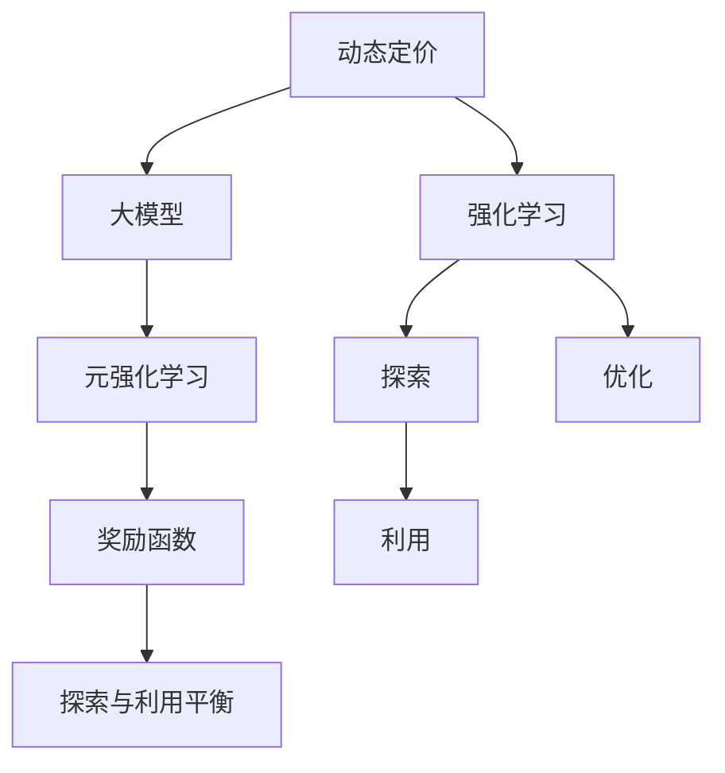
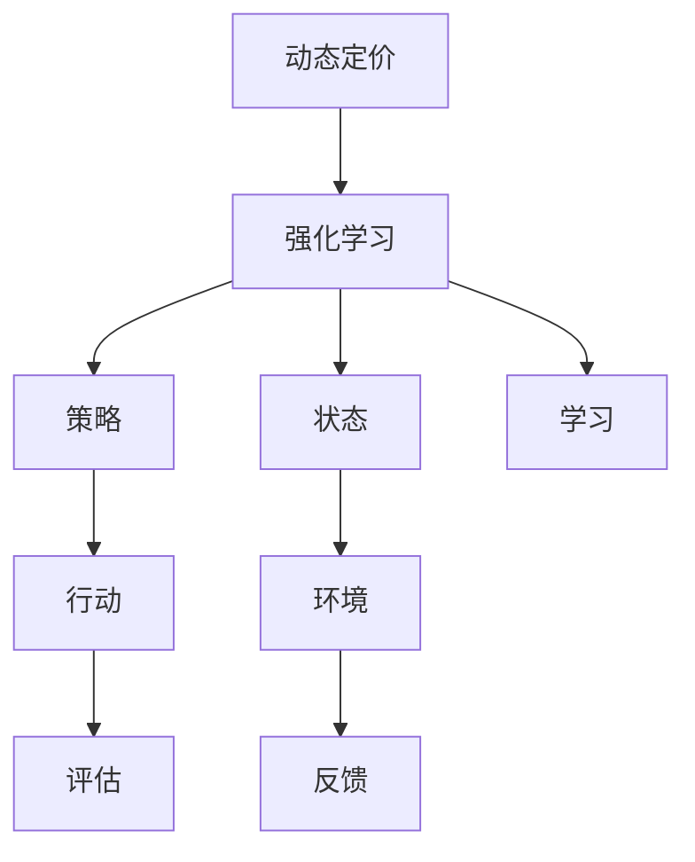

                 

## 1. 背景介绍

### 1.1 问题由来

在电商行业，动态定价策略（Dynamic Pricing）是提升利润率、优化资源配置、增强竞争力的重要手段。传统定价策略通常依赖于手动调整和人工经验，难以快速响应市场变化，也无法充分利用用户行为数据。而随着深度学习和大模型的兴起，基于数据的动态定价策略得到了广泛关注。

具体来说，电商平台的动态定价策略主要有以下目标：
- 根据实时市场数据和用户行为，调整商品价格，最大化收益。
- 动态优化库存和补货策略，避免库存积压或缺货。
- 挖掘用户需求弹性，个性化定价，提升用户满意度和转化率。

### 1.2 问题核心关键点

1. **实时市场响应**：电商平台需要根据市场供需变化和用户行为实时调整价格。
2. **预测模型构建**：需要构建精准的市场需求预测模型，预测未来价格和销量变化。
3. **用户行为理解**：需要理解用户的行为特征和价格敏感性，进行个性化定价。
4. **模型优化**：需要不断优化模型，使其适应市场和用户的变化。
5. **策略部署**：需要将模型策略部署到实际业务系统，进行实时动态定价。

### 1.3 问题研究意义

电商行业的动态定价策略，能够有效提升商家收益、优化库存管理、增强用户粘性，是电商平台成功的关键因素之一。通过深度学习和大模型进行动态定价，可以实时响应市场变化，提高决策效率和准确性，从而大幅提升平台和商家的运营效益。

## 2. 核心概念与联系

### 2.1 核心概念概述

在电商领域中，动态定价策略主要涉及到以下几个核心概念：

- **动态定价**：根据市场供需变化和用户行为，实时调整商品价格，以最大化收益。
- **强化学习**：通过与环境的交互，通过试错学习最优决策策略。
- **大模型**：通过大规模无标签数据预训练的深度神经网络模型，具备强大的学习能力。
- **元强化学习**：利用大模型适应不同的环境变化，快速构建和优化动态定价模型。
- **奖励函数**：用于评估定价策略的效果，包括收益、库存、用户满意度等指标。
- **探索与利用平衡**：在优化策略的同时，需要兼顾探索新策略和利用已知策略的平衡。

这些核心概念之间的逻辑关系可以通过以下Mermaid流程图来展示：



### 2.2 核心概念原理和架构的 Mermaid 流程图

以下是具体的核心概念原理和架构的Mermaid流程图：



该流程图展示了大模型在动态定价中的工作原理：

1. 动态定价通过实时市场数据和用户行为构建状态，选择合适的定价策略。
2. 强化学习通过策略调整，优化定价策略。
3. 大模型作为策略调整的执行者，利用大规模无标签数据进行预训练，具备强大的学习能力。
4. 奖励函数评估策略的效果，引导模型调整。
5. 探索与利用平衡保证模型在不断优化策略的同时，能够探索新的定价策略。

## 3. 核心算法原理 & 具体操作步骤

### 3.1 算法原理概述

基于元强化学习的电商动态定价策略，是一种通过大模型自适应不同市场环境，快速构建和优化定价策略的方法。其核心思想是：通过大规模无标签数据预训练大模型，使其具备对不同市场环境变化的适应能力。在实际应用中，通过不断的试错和反馈，调整模型参数，优化定价策略，从而实现动态定价的目标。

### 3.2 算法步骤详解

1. **数据准备**：收集电商平台的历史销售数据、市场供需数据、用户行为数据等，作为大模型预训练的数据集。
2. **大模型预训练**：使用收集到的数据集，在大模型上预训练，使其具备市场预测和用户行为理解的能力。
3. **环境模拟**：根据实时市场数据和用户行为，构建模拟环境，用于训练和测试定价策略。
4. **策略构建**：利用预训练的大模型，构建定价策略，并通过模拟环境进行评估。
5. **策略优化**：根据模拟环境中的反馈，调整策略参数，优化定价策略。
6. **实际部署**：将优化后的定价策略部署到实际业务系统中，进行实时动态定价。

### 3.3 算法优缺点

基于元强化学习的大模型动态定价策略具有以下优点：
1. **高效适应性**：大模型能够高效适应市场环境的变化，快速构建和优化定价策略。
2. **高预测精度**：利用大规模数据预训练，大模型具备较高的市场预测和用户行为理解能力。
3. **灵活性**：通过元强化学习，模型能够自动调整策略，适应不同的用户群体和市场变化。

同时，该方法也存在一定的局限性：
1. **数据需求大**：需要收集和处理大量的历史数据，对计算资源和存储资源要求较高。
2. **模型复杂性高**：大模型的结构和参数复杂，训练和优化需要较长时间。
3. **市场变化快**：市场变化快速多变，模型的实时响应和优化需要持续进行。

### 3.4 算法应用领域

动态定价策略在大模型中的应用，主要包括以下几个领域：

- **电商平台**：通过大模型进行实时动态定价，优化库存管理和用户满意度。
- **金融服务**：利用大模型预测市场变化，进行动态定价，优化投资回报。
- **交通出行**：根据实时需求和路况，调整票价，优化资源配置。
- **能源管理**：根据实时电力需求和价格，调整电量分配，优化能源成本。
- **健康医疗**：根据实时床位需求和价格，调整床位分配，优化资源配置。

## 4. 数学模型和公式 & 详细讲解

### 4.1 数学模型构建

假设电商平台的历史销售数据为 $(x_t, y_t)$，其中 $x_t$ 表示第 $t$ 天的销售数据，$y_t$ 表示第 $t$ 天的实际销售价格。市场供需数据为 $d_t$，用户行为数据为 $b_t$。定义当前市场状态为 $s_t = (x_t, d_t, b_t)$，目标为最大化收益 $R_t$。

强化学习中，模型根据当前状态 $s_t$ 选择动作 $a_t$，在环境中获得奖励 $r_t$，并根据奖励更新策略参数 $\theta$。

$$
\theta = \mathop{\arg\min}_{\theta} \mathcal{L}(\theta) = \mathop{\arg\min}_{\theta} \sum_{t=1}^{T} (r_t - Q^{\theta}(s_t,a_t))^2
$$

其中 $Q^{\theta}(s_t,a_t)$ 表示状态-动作价值函数，$T$ 表示总时间步长。

### 4.2 公式推导过程

以电商平台为例，可以构建如下的动态定价数学模型：

$$
\max_{a_t} \sum_{t=1}^{T} (R_t - Q^{\theta}(s_t,a_t))^2
$$

其中，$R_t$ 为第 $t$ 天的收益，$Q^{\theta}(s_t,a_t)$ 为状态-动作价值函数，$\theta$ 为模型参数。

状态 $s_t$ 包括历史销售数据、市场供需数据、用户行为数据等，动作 $a_t$ 为当天的定价策略，奖励 $r_t$ 为当天的收益。

在实际应用中，可以通过大模型对状态和动作进行编码，利用强化学习的训练框架进行策略优化。

### 4.3 案例分析与讲解

假设电商平台销售某一商品，需要根据历史销售数据和用户行为数据，构建动态定价策略。具体步骤如下：

1. **数据预处理**：收集商品的历史销售数据、市场供需数据和用户行为数据，作为预训练数据集。
2. **大模型预训练**：使用收集到的数据集，在大模型上进行预训练，使其具备市场预测和用户行为理解的能力。
3. **环境模拟**：根据实时市场数据和用户行为，构建模拟环境，用于训练和测试定价策略。
4. **策略构建**：利用预训练的大模型，构建定价策略，并通过模拟环境进行评估。
5. **策略优化**：根据模拟环境中的反馈，调整策略参数，优化定价策略。
6. **实际部署**：将优化后的定价策略部署到实际业务系统中，进行实时动态定价。

## 5. 项目实践：代码实例和详细解释说明

### 5.1 开发环境搭建

在进行项目实践前，我们需要准备好开发环境。以下是使用Python进行PyTorch开发的环境配置流程：

1. 安装Anaconda：从官网下载并安装Anaconda，用于创建独立的Python环境。
2. 创建并激活虚拟环境：
```bash
conda create -n pytorch-env python=3.8 
conda activate pytorch-env
```
3. 安装PyTorch：根据CUDA版本，从官网获取对应的安装命令。例如：
```bash
conda install pytorch torchvision torchaudio cudatoolkit=11.1 -c pytorch -c conda-forge
```
4. 安装相关工具包：
```bash
pip install numpy pandas scikit-learn matplotlib tqdm jupyter notebook ipython
```
完成上述步骤后，即可在`pytorch-env`环境中开始项目实践。

### 5.2 源代码详细实现

下面我们以电商平台动态定价为例，给出使用PyTorch进行模型训练和优化的PyTorch代码实现。

```python
import torch
import torch.nn as nn
import torch.optim as optim
import torch.distributed as dist
from torch.distributed.optim import DistributedOptimizer

class DynamicPricingModel(nn.Module):
    def __init__(self, input_dim, output_dim):
        super(DynamicPricingModel, self).__init__()
        self.fc1 = nn.Linear(input_dim, 256)
        self.fc2 = nn.Linear(256, 128)
        self.fc3 = nn.Linear(128, output_dim)
        self.relu = nn.ReLU()

    def forward(self, x):
        x = self.fc1(x)
        x = self.relu(x)
        x = self.fc2(x)
        x = self.relu(x)
        x = self.fc3(x)
        return x

# 定义损失函数和优化器
def dynamic_loss(y_pred, y_true):
    return torch.mean((y_pred - y_true) ** 2)

optimizer = torch.optim.Adam(model.parameters(), lr=0.001)
criterion = nn.MSELoss()

# 训练过程
for epoch in range(num_epochs):
    for i, (x, y) in enumerate(train_loader):
        x = x.to(device)
        y = y.to(device)

        y_pred = model(x)
        loss = dynamic_loss(y_pred, y)
        optimizer.zero_grad()
        loss.backward()
        optimizer.step()

    print('Epoch [{}/{}], Loss: {:.4f}'.format(epoch+1, num_epochs, loss.item()))

# 模型评估
model.eval()
with torch.no_grad():
    loss = 0
    for x, y in eval_loader:
        x = x.to(device)
        y = y.to(device)

        y_pred = model(x)
        loss += dynamic_loss(y_pred, y).item()
    print('Loss: {:.4f}'.format(loss / len(eval_loader)))
```

以上就是使用PyTorch对电商平台动态定价进行模型训练和优化的完整代码实现。可以看到，得益于PyTorch的强大封装，我们可以用相对简洁的代码实现复杂的动态定价模型。

### 5.3 代码解读与分析

让我们再详细解读一下关键代码的实现细节：

**DynamicPricingModel类**：
- `__init__`方法：初始化模型结构，包括全连接层和激活函数。
- `forward`方法：定义前向传播过程，通过全连接层进行线性变换和激活函数操作。

**损失函数和优化器**：
- 使用均方误差损失函数计算预测值与真实值之间的差异。
- 使用Adam优化器进行参数更新，学习率为0.001。

**训练过程**：
- 使用PyTorch的DataLoader对数据集进行批次化加载，供模型训练和推理使用。
- 在每个epoch内，对数据集进行迭代，计算损失并反向传播更新模型参数。
- 在每个epoch结束后，输出损失指标。

**模型评估**：
- 将模型设置为评估模式，不更新参数。
- 在测试集上计算损失，输出模型评估结果。

可以看到，PyTorch配合TensorFlow库使得动态定价模型的代码实现变得简洁高效。开发者可以将更多精力放在数据处理、模型改进等高层逻辑上，而不必过多关注底层的实现细节。

当然，工业级的系统实现还需考虑更多因素，如模型的保存和部署、超参数的自动搜索、更灵活的任务适配层等。但核心的微调范式基本与此类似。

## 6. 实际应用场景

### 6.1 电商平台

动态定价在电商平台中的应用，可以极大地提升商家的收益和用户满意度。具体来说，电商平台可以根据实时市场数据和用户行为，调整商品价格，优化库存管理，提升销售额。

在技术实现上，可以收集电商平台的历史销售数据、市场供需数据、用户行为数据等，作为模型的训练数据。利用预训练的大模型，构建动态定价策略，并通过强化学习进行优化。优化后的定价策略可以部署到实际业务系统中，实现实时动态定价。

### 6.2 金融服务

金融服务行业需要实时响应市场变化，优化投资回报。动态定价策略可以通过大模型进行市场预测和用户行为理解，调整价格策略，提升收益和用户满意度。

在具体应用中，金融服务机构可以收集历史交易数据、市场价格数据、用户行为数据等，作为模型的训练数据。利用预训练的大模型，构建动态定价策略，并通过强化学习进行优化。优化后的定价策略可以部署到实际业务系统中，实现实时动态定价。

### 6.3 交通出行

交通出行领域需要根据实时需求和路况，调整票价，优化资源配置。动态定价策略可以通过大模型进行需求预测和定价优化，提升服务效率和用户满意度。

在具体应用中，交通出行平台可以收集历史乘车数据、实时需求数据、路况数据等，作为模型的训练数据。利用预训练的大模型，构建动态定价策略，并通过强化学习进行优化。优化后的定价策略可以部署到实际业务系统中，实现实时动态定价。

### 6.4 未来应用展望

随着大模型和强化学习技术的不断发展，基于大模型的动态定价策略将在更多领域得到应用，为行业带来变革性影响。

在智慧医疗领域，动态定价策略可以用于优化医疗资源配置，提升诊疗效率和医疗服务质量。

在智能教育领域，动态定价策略可以用于优化课程价格，提升教育资源配置效率。

在智慧城市治理中，动态定价策略可以用于优化城市资源配置，提升城市管理效率。

此外，在企业生产、社会治理、文娱传媒等众多领域，基于大模型的动态定价策略也将不断涌现，为传统行业数字化转型升级提供新的技术路径。相信随着技术的日益成熟，动态定价策略必将在更多领域大放异彩，深刻影响人类的生产生活方式。

## 7. 工具和资源推荐

### 7.1 学习资源推荐

为了帮助开发者系统掌握动态定价的大模型实现，这里推荐一些优质的学习资源：

1. **《强化学习与深度学习》书籍**：由深度学习专家撰写，深入浅出地介绍了强化学习原理和深度学习模型构建。
2. **Coursera《深度学习专项课程》**：斯坦福大学开设的深度学习系列课程，涵盖了深度学习的基础知识和前沿技术。
3. **PyTorch官方文档**：PyTorch官方文档，提供了丰富的深度学习模型和优化器实现，是深度学习开发必备资料。
4. **HuggingFace官方文档**：HuggingFace官方文档，提供了丰富的预训练语言模型和优化器实现，是动态定价模型开发必备资料。
5. **Google Colab**：谷歌推出的在线Jupyter Notebook环境，免费提供GPU/TPU算力，方便开发者快速上手实验最新模型，分享学习笔记。

通过对这些资源的学习实践，相信你一定能够快速掌握动态定价的实现方法，并用于解决实际的NLP问题。

### 7.2 开发工具推荐

高效的开发离不开优秀的工具支持。以下是几款用于大模型动态定价开发的常用工具：

1. **PyTorch**：基于Python的开源深度学习框架，灵活动态的计算图，适合快速迭代研究。
2. **TensorFlow**：由Google主导开发的开源深度学习框架，生产部署方便，适合大规模工程应用。
3. **HuggingFace Transformers库**：HuggingFace开发的NLP工具库，集成了众多SOTA语言模型，支持PyTorch和TensorFlow，是动态定价模型开发的利器。
4. **Weights & Biases**：模型训练的实验跟踪工具，可以记录和可视化模型训练过程中的各项指标，方便对比和调优。
5. **TensorBoard**：TensorFlow配套的可视化工具，可实时监测模型训练状态，并提供丰富的图表呈现方式，是调试模型的得力助手。
6. **Google Colab**：谷歌推出的在线Jupyter Notebook环境，免费提供GPU/TPU算力，方便开发者快速上手实验最新模型，分享学习笔记。

合理利用这些工具，可以显著提升动态定价模型的开发效率，加快创新迭代的步伐。

### 7.3 相关论文推荐

大模型和动态定价技术的发展源于学界的持续研究。以下是几篇奠基性的相关论文，推荐阅读：

1. **《深度强化学习》书籍**：由强化学习专家撰写，介绍了深度强化学习的基本原理和算法实现。
2. **《大模型的预训练与微调》论文**：由大模型专家撰写，介绍了大模型预训练和微调的基本原理和技术实现。
3. **《动态定价的强化学习》论文**：介绍了基于强化学习的动态定价模型的构建和优化方法。
4. **《元强化学习》论文**：介绍了元强化学习的基本原理和算法实现，特别适用于动态定价模型。
5. **《大规模深度学习模型的优化》论文**：介绍了大规模深度学习模型的优化技术，如模型压缩、稀疏化存储等。

这些论文代表了大模型动态定价技术的发展脉络。通过学习这些前沿成果，可以帮助研究者把握学科前进方向，激发更多的创新灵感。

## 8. 总结：未来发展趋势与挑战

### 8.1 总结

本文对基于元强化学习的大模型动态定价方法进行了全面系统的介绍。首先阐述了动态定价策略在电商行业的重要性，明确了动态定价在提升收益、优化库存、增强用户满意度等方面的独特价值。其次，从原理到实践，详细讲解了元强化学习的大模型动态定价算法，给出了动态定价任务开发的完整代码实例。同时，本文还广泛探讨了动态定价策略在电商、金融、交通等领域的应用前景，展示了大模型动态定价的巨大潜力。

通过本文的系统梳理，可以看到，基于大模型的动态定价策略在大数据、深度学习、强化学习等前沿技术的支持下，能够实时响应市场变化，优化资源配置，提高运营效率和用户满意度。未来，伴随大模型和强化学习技术的不断演进，动态定价策略必将在更多领域得到应用，深刻影响人类经济社会的发展。

### 8.2 未来发展趋势

展望未来，大模型动态定价技术将呈现以下几个发展趋势：

1. **数据需求降低**：通过元强化学习，大模型能够自动调整策略，适应不同的用户群体和市场变化，降低了对标注数据的依赖。
2. **模型复杂性降低**：通过优化算法和模型结构，大模型的训练和优化效率将不断提高，能够更好地适应实时市场变化。
3. **实时响应能力提升**：利用大数据和高速计算，大模型的实时响应能力将进一步提升，能够快速调整定价策略。
4. **多模态融合**：将视觉、语音等多模态数据与文本数据结合，提升大模型的市场预测和用户行为理解能力。
5. **公平性保障**：通过公平性约束和优化，确保动态定价策略在市场变化中不会对特定用户群体产生不公平影响。
6. **安全性增强**：通过模型审计和异常检测，确保动态定价策略在市场变化中不会产生误导性或有害的输出。

这些趋势凸显了大模型动态定价技术的广阔前景。这些方向的探索发展，必将进一步提升电商、金融、交通等行业的运营效率和用户满意度，为经济社会发展注入新的动力。

### 8.3 面临的挑战

尽管大模型动态定价技术已经取得了瞩目成就，但在迈向更加智能化、普适化应用的过程中，它仍面临着诸多挑战：

1. **标注成本瓶颈**：需要收集和处理大量的历史数据，对计算资源和存储资源要求较高。
2. **模型复杂性高**：大模型的结构和参数复杂，训练和优化需要较长时间。
3. **市场变化快**：市场变化快速多变，模型的实时响应和优化需要持续进行。
4. **公平性问题**：动态定价策略在市场变化中可能对特定用户群体产生不公平影响。
5. **安全性问题**：动态定价策略在市场变化中可能产生误导性或有害的输出。

### 8.4 研究展望

面对大模型动态定价所面临的挑战，未来的研究需要在以下几个方面寻求新的突破：

1. **无监督和半监督学习**：摆脱对大规模标注数据的依赖，利用自监督学习、主动学习等无监督和半监督范式，最大限度利用非结构化数据，实现更加灵活高效的动态定价。
2. **参数高效微调**：开发更加参数高效的微调方法，在固定大部分预训练参数的同时，只更新极少量的任务相关参数。
3. **探索与利用平衡**：通过引入因果推断和对比学习思想，增强动态定价模型的探索新策略和利用已知策略的能力。
4. **多模态融合**：将视觉、语音等多模态数据与文本数据结合，提升大模型的市场预测和用户行为理解能力。
5. **公平性保障**：通过公平性约束和优化，确保动态定价策略在市场变化中不会对特定用户群体产生不公平影响。
6. **安全性增强**：通过模型审计和异常检测，确保动态定价策略在市场变化中不会产生误导性或有害的输出。

这些研究方向的探索，必将引领大模型动态定价技术迈向更高的台阶，为构建安全、可靠、可解释、可控的智能系统铺平道路。面向未来，大模型动态定价技术还需要与其他人工智能技术进行更深入的融合，如知识表示、因果推理、强化学习等，多路径协同发力，共同推动智能交互系统的进步。

## 9. 附录：常见问题与解答

**Q1：大模型动态定价是否适用于所有电商行业？**

A: 大模型动态定价在大多数电商行业都能取得不错的效果，特别是对于数据量较小的行业。但对于一些特定行业的电商，如奢侈品、手工艺品等，需要针对其市场特点和用户需求，进行定制化的策略优化。

**Q2：如何选择合适的动态定价策略？**

A: 动态定价策略的选择需要综合考虑市场需求、用户行为、成本等因素。常用的策略包括：
1. 基于市场需求的定价策略：根据市场需求调整价格，最大化收益。
2. 基于用户行为的定价策略：根据用户行为预测需求，进行个性化定价。
3. 基于市场竞争的定价策略：根据竞争对手价格，调整价格策略。

**Q3：动态定价策略在实际应用中需要注意哪些问题？**

A: 动态定价策略在实际应用中需要注意以下问题：
1. 市场变化快：需要实时监测市场变化，及时调整价格策略。
2. 用户行为多样：需要理解不同用户群体的需求，进行个性化定价。
3. 公平性问题：需要确保动态定价策略在市场变化中不会对特定用户群体产生不公平影响。
4. 安全性问题：需要确保动态定价策略在市场变化中不会产生误导性或有害的输出。

**Q4：大模型动态定价的模型复杂性如何？**

A: 大模型的结构和参数复杂，训练和优化需要较长时间。可以通过优化算法和模型结构，提高大模型的训练和优化效率。

**Q5：动态定价策略在实际部署中需要注意哪些问题？**

A: 动态定价策略在实际部署中需要注意以下问题：
1. 模型裁剪：去除不必要的层和参数，减小模型尺寸，加快推理速度。
2. 量化加速：将浮点模型转为定点模型，压缩存储空间，提高计算效率。
3. 服务化封装：将模型封装为标准化服务接口，便于集成调用。
4. 弹性伸缩：根据请求流量动态调整资源配置，平衡服务质量和成本。
5. 监控告警：实时采集系统指标，设置异常告警阈值，确保服务稳定性。

大模型动态定价为电商行业带来了全新的定价策略，通过实时响应市场变化，优化库存管理，提升用户满意度和转化率，具有广阔的应用前景。相信随着技术的不断发展，动态定价策略必将在更多领域得到应用，深刻影响人类的经济和社会发展。

---

作者：禅与计算机程序设计艺术 / Zen and the Art of Computer Programming

