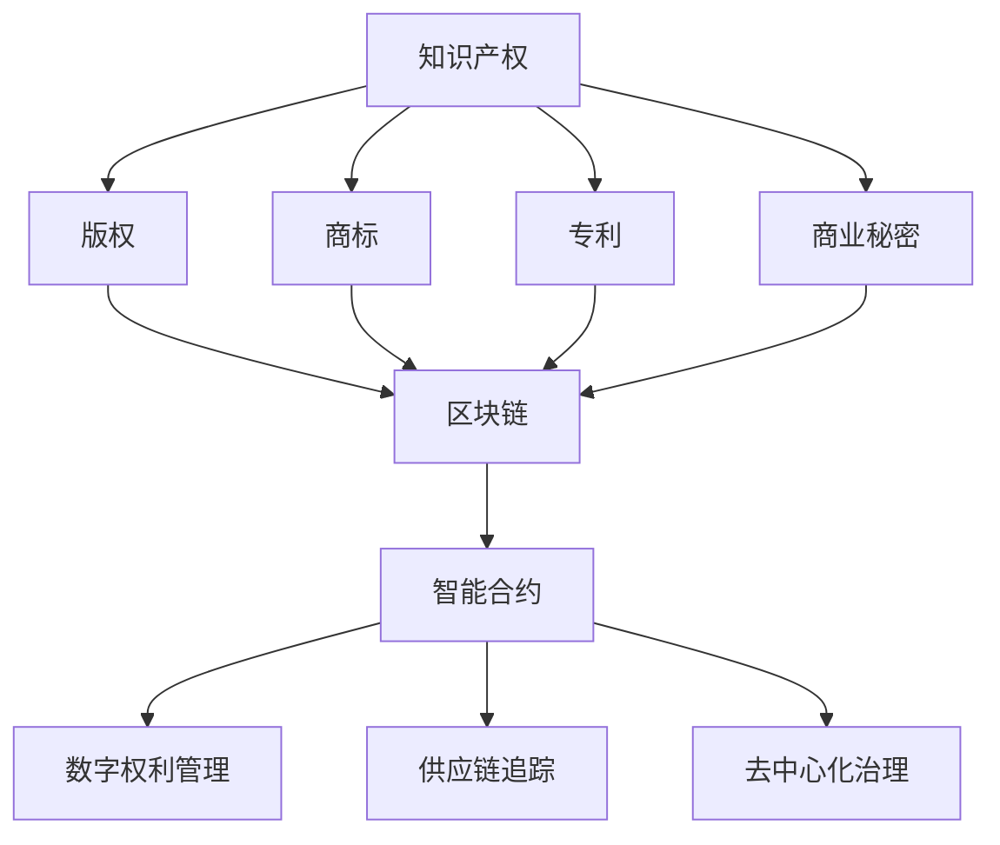

                 

# 知识产权与区块链技术的结合

> 关键词：知识产权, 区块链, 智能合约, 版权, 数字权利管理, 供应链追踪, 去中心化治理

## 1. 背景介绍

### 1.1 问题由来

随着科技的迅猛发展，知识产权问题日益复杂化，涉及多地域、多利益方的权益分配和保护。传统的知识产权管理方式存在诸多弊端：

- 知识产权的注册、转让、使用等环节繁琐且耗时。
- 版权保护难以有效追踪和防侵权。
- 权利管理繁琐，授权成本高。
- 缺乏透明度和可信度，容易发生纠纷。

在这种情况下，区块链技术的出现为解决这些问题提供了新的思路。区块链的去中心化、不可篡改、可追溯等特性，能够为知识产权的管理、保护和交易提供新的技术保障。

### 1.2 问题核心关键点

本文聚焦于如何通过区块链技术，实现对知识产权的有效保护和管理。需要解决的核心问题包括：

- 如何利用区块链实现版权的自动注册和证明。
- 如何通过智能合约实现版权授权和转让的自动化。
- 如何构建基于区块链的数字权利管理系统，提升版权管理的效率和透明度。
- 如何通过区块链技术实现供应链追踪，确保知识产权的完整性和真实性。

## 2. 核心概念与联系

### 2.1 核心概念概述

为更好地理解知识产权与区块链技术的结合，本节将介绍几个密切相关的核心概念：

- **知识产权 (Intellectual Property, IP)**：创作者对其创作成果所享有的专有权利，包括版权、商标、专利、商业秘密等。
- **区块链 (Blockchain)**：一种去中心化的分布式账本技术，具有不可篡改、可追溯、透明等特点。
- **智能合约 (Smart Contract)**：在区块链上运行的自动化合约，能够自动执行预定的规则和逻辑。
- **数字权利管理 (Digital Rights Management, DRM)**：对数字内容进行加密、权限管理等措施，保护数字作品的版权。
- **供应链追踪 (Supply Chain Traceability)**：利用区块链记录和追踪商品的生产、运输、销售等环节，确保信息透明和不可篡改。
- **去中心化治理 (Decentralized Governance)**：基于区块链的去中心化治理机制，通过共识算法和代币激励，实现透明和高效的治理。

这些概念之间的逻辑关系可以通过以下Mermaid流程图来展示：



这个流程图展示了几类知识产权与区块链技术之间的联系：

1. 不同类型的知识产权都可以在区块链上实现电子化和数字化。
2. 版权、商标、专利、商业秘密等均可通过区块链技术进行保护和声明。
3. 智能合约能够自动化处理版权授权、转让等复杂事务。
4. 数字权利管理可以在区块链上实现，保障数字内容的合法使用。
5. 区块链能够确保供应链的透明和可信，防止假冒伪劣。
6. 去中心化治理能够提升知识产权管理的效率和透明度。

这些概念共同构成了知识产权与区块链技术的结合框架，为其在知识产权领域的应用奠定了基础。

## 3. 核心算法原理 & 具体操作步骤

### 3.1 算法原理概述

基于区块链的知识产权管理，主要涉及以下几个关键技术：

- **电子注册**：通过区块链实现版权自动注册，生成不可篡改的电子证明。
- **智能合约**：通过区块链的智能合约实现版权授权和转让的自动化。
- **数字权利管理**：利用区块链记录数字内容的加密和权限管理信息，防止非法使用。
- **供应链追踪**：在区块链上记录商品的生产、运输、销售等环节，确保信息透明。
- **去中心化治理**：通过区块链的治理机制，提升知识产权管理的透明度和效率。

这些技术通过区块链特有的去中心化、不可篡改、可追溯等特性，实现对知识产权的有效管理和保护。

### 3.2 算法步骤详解

基于区块链的知识产权管理主要包括以下几个关键步骤：

**Step 1: 电子注册**
- 创作者在区块链上提交作品电子版，并进行版权声明。
- 区块链网络节点验证版权声明的有效性，并通过共识算法确认其准确性。
- 一旦注册成功，区块链将生成一个唯一的电子证明，供创作者和使用者查询验证。

**Step 2: 智能合约**
- 根据版权声明，设计并部署智能合约，规定版权的使用权限、授权方式等。
- 智能合约自动执行，根据预设条件自动处理版权授权和转让。
- 智能合约还可以记录使用情况，提供使用报告和审计。

**Step 3: 数字权利管理**
- 利用区块链记录数字内容的加密和权限管理信息，如访问权限、使用次数等。
- 使用智能合约自动控制数字内容的访问和使用，确保版权得到有效保护。
- 智能合约还可以根据使用情况，自动生成版税和收益。

**Step 4: 供应链追踪**
- 在区块链上记录商品的生产、运输、销售等环节，确保信息透明。
- 利用区块链的不可篡改特性，确保供应链的完整性和真实性。
- 通过智能合约实现供应链的自动化管理，提升效率和透明度。

**Step 5: 去中心化治理**
- 通过区块链的治理机制，实现透明和高效的治理。
- 利用共识算法和代币激励，确保参与方的利益平衡和公平。
- 通过区块链的公开透明，提升知识产权管理的可信度。

通过以上步骤，基于区块链的知识产权管理系统可以全面提升版权管理的效率和透明度，确保知识产权的有效保护和管理。

### 3.3 算法优缺点

基于区块链的知识产权管理具有以下优点：

- 去中心化：不受中心服务器的限制，系统更加稳定和安全。
- 不可篡改：所有操作记录不可篡改，确保信息真实可信。
- 透明度：所有操作记录公开透明，提升系统的可信度。
- 自动化：智能合约自动执行复杂事务，提高管理效率。
- 分布式：系统覆盖全球，支持跨国界、跨地域的知识产权管理。

但同时，基于区块链的知识产权管理也存在以下缺点：

- 技术门槛高：需要具备区块链和智能合约的知识，开发和部署难度较大。
- 交易费用高：区块链的共识机制和验证过程需要消耗大量资源，导致交易费用较高。
- 扩展性差：目前的区块链系统在处理大规模数据时，扩展性不足。
- 隐私保护：虽然区块链保证了信息的透明和可信，但也可能泄露个人和企业的敏感信息。
- 法律合规：当前法律体系尚未完全适应区块链技术，缺乏明确规范和指导。

## 4. 数学模型和公式 & 详细讲解 & 举例说明

### 4.1 数学模型构建

本节将使用数学语言对基于区块链的知识产权管理过程进行更加严格的刻画。

记版权信息为 $V$，智能合约为 $C$，数字权利管理信息为 $DRM$，供应链信息为 $S$，去中心化治理机制为 $G$。

版权信息 $V$ 包括版权声明、版权声明时间、版权声明者等信息，智能合约 $C$ 包括版权授权规则、使用权限、授权条件等信息。

数字权利管理 $DRM$ 包括加密密钥、权限管理信息、使用报告等信息，供应链信息 $S$ 包括生产、运输、销售等环节的记录，去中心化治理机制 $G$ 包括共识算法、代币激励等信息。

定义版权声明函数 $F$，智能合约执行函数 $E$，数字权利管理函数 $M$，供应链追踪函数 $T$，去中心化治理函数 $G$。则基于区块链的知识产权管理模型可以表示为：

$$
M = F \times C \times DRM \times S \times G
$$

通过数学模型，可以清晰地看到各个组成部分之间的逻辑关系。

### 4.2 公式推导过程

以下我们以版权注册和智能合约为例，推导区块链知识产权管理的核心公式。

版权注册的过程可以通过以下步骤描述：

1. 创作者提交版权声明，包括版权作品和创作者信息。
2. 区块链网络节点验证版权声明的有效性。
3. 通过共识算法确认版权声明的准确性。
4. 生成唯一的电子证明，供创作者和使用者查询验证。

版权注册过程的数学模型为：

$$
V = F(C_{版权声明}, C_{创作者信息})
$$

智能合约的执行过程可以通过以下步骤描述：

1. 智能合约中规定版权的使用权限、授权方式等。
2. 根据使用条件，智能合约自动执行相应的操作。
3. 智能合约记录使用情况，提供使用报告和审计。

智能合约执行过程的数学模型为：

$$
C_{使用情况} = E(C_{权限}, C_{条件})
$$

其中 $C_{权限}$ 为版权的使用权限，$C_{条件}$ 为版权使用的条件。

通过上述数学模型，可以清晰地描述版权注册和智能合约执行的过程，为系统设计和实现提供理论基础。

### 4.3 案例分析与讲解

**案例一：版权自动注册**

某知名作家创作了一部小说，希望通过区块链实现版权自动注册。

1. 作家将小说文本上传到区块链网络，并进行版权声明。
2. 区块链网络节点验证版权声明的有效性。
3. 通过共识算法确认版权声明的准确性。
4. 区块链生成一个唯一的电子证明，作家和出版社等利益方均可查询验证。

通过上述步骤，作家可以在短时间内完成版权自动注册，无需繁琐的手工操作，大大提高了效率。

**案例二：智能合约授权和转让**

某出版社希望将小说的版权授权给电影公司改编成电影，但希望保留部分使用权，如销售和改编权。

1. 作家和出版社在智能合约中定义版权的使用权限，如销售、改编、翻译等。
2. 智能合约根据使用条件，自动执行相应的操作，如授权、支付版税等。
3. 智能合约记录使用情况，提供使用报告和审计。

通过智能合约，版权的授权和转让过程自动执行，无需人工干预，提高了版权管理的效率和透明度。

## 5. 项目实践：代码实例和详细解释说明

### 5.1 开发环境搭建

在进行区块链知识产权管理项目开发前，我们需要准备好开发环境。以下是使用Python进行Hyperledger Fabric开发的环境配置流程：

1. 安装Docker：从官网下载并安装Docker，用于创建和管理容器环境。

2. 创建并启动Fabric网络：
```bash
docker-compose up
```

3. 创建并激活虚拟环境：
```bash
conda create -n blockchain-env python=3.8 
conda activate blockchain-env
```

4. 安装Fabric工具包：
```bash
pip install fabric-sdk-python==2.2.1
```

5. 安装各类工具包：
```bash
pip install flask flask-restful web3 pyjwt
```

完成上述步骤后，即可在`blockchain-env`环境中开始区块链知识产权管理系统的开发。

### 5.2 源代码详细实现

这里我们以版权注册和智能合约授权为例，给出使用Hyperledger Fabric进行代码实现的例子。

首先，定义版权注册合约：

```python
from fabric import Contract
from fabric.client import Client

class CopyrightContract(Contract):
    def initialize(self):
        self.registerer = self.get_transactions('reg', 'orderer')
        self.grantor = self.get_transactions('grant', 'orderer')
        self.authorizer = self.get_transactions('auth', 'orderer')
        self.other_transactions = self.get_transactions('other', 'orderer')
        self.nonce = 0
        self.expiration = 86400  # 1 day

    def register版权(self, ipid, description, owner, date):
        ipid = self.registerer.declare_ipid(ipid)
        self.registerer.add_text('注册', '版权', ipid)
        self.registerer.add_text('注册者', owner)
        self.registerer.add_text('描述', description)
        self.registerer.add_text('日期', date)
        self.registerer.add_text('到期日', datetime.utcnow() + timedelta(days=self.expiration))
        self.registerer.set_state(1)
        self.registerer.sign(self.nonce, self.nonce + 1)
        self.nonce += 1

    def grant版权(self, ipid, grantee, condition, days):
        ipid = self.grantor.declare_ipid(ipid)
        self.grantor.add_text('授权', '版权')
        self.grantor.add_text('授权者', self.registerer.get_ipid())
        self.grantor.add_text('被授权者', grantee)
        self.grantor.add_text('条件', condition)
        self.grantor.add_text('授权日', datetime.utcnow())
        self.grantor.add_text('到期日', datetime.utcnow() + timedelta(days=days))
        self.grantor.set_state(2)
        self.grantor.sign(self.nonce, self.nonce + 1)
        self.nonce += 1

    def authorize版权(self, ipid, authorizer, condition, days):
        ipid = self.authorizer.declare_ipid(ipid)
        self.authorizer.add_text('授权', '版权')
        self.authorizer.add_text('授权者', self.registerer.get_ipid())
        self.authorizer.add_text('被授权者', authorizer)
        self.authorizer.add_text('条件', condition)
        self.authorizer.add_text('授权日', datetime.utcnow())
        self.authorizer.add_text('到期日', datetime.utcnow() + timedelta(days=days))
        self.authorizer.set_state(3)
        self.authorizer.sign(self.nonce, self.nonce + 1)
        self.nonce += 1

    def other版权(self, ipid, other_transaction, condition, days):
        ipid = self.other_transactions.declare_ipid(ipid)
        self.other_transactions.add_text('授权', '版权')
        self.other_transactions.add_text('授权者', self.registerer.get_ipid())
        self.other_transactions.add_text('被授权者', other_transaction)
        self.other_transactions.add_text('条件', condition)
        self.other_transactions.add_text('授权日', datetime.utcnow())
        self.other_transactions.add_text('到期日', datetime.utcnow() + timedelta(days=days))
        self.other_transactions.set_state(4)
        self.other_transactions.sign(self.nonce, self.nonce + 1)
        self.nonce += 1
```

然后，定义智能合约授权和转让合约：

```python
from fabric import Contract
from fabric.client import Client

class LicenseContract(Contract):
    def initialize(self):
        self.grantor = self.get_transactions('grant', 'orderer')
        self.authorizer = self.get_transactions('auth', 'orderer')
        self.author = self.get_transactions('author', 'orderer')
        self.licensee = self.get_transactions('licensee', 'orderer')
        self.days = 7
        self.nonce = 0

    def grant版权(self, ipid, grantee, condition):
        ipid = self.grantor.declare_ipid(ipid)
        self.grantor.add_text('授权', '版权')
        self.grantor.add_text('授权者', self.grantor.get_ipid())
        self.grantor.add_text('被授权者', grantee)
        self.grantor.add_text('条件', condition)
        self.grantor.add_text('授权日', datetime.utcnow())
        self.grantor.add_text('到期日', datetime.utcnow() + timedelta(days=self.days))
        self.grantor.set_state(1)
        self.grantor.sign(self.nonce, self.nonce + 1)
        self.nonce += 1

    def authorize版权(self, ipid, authorizer, condition):
        ipid = self.authorizer.declare_ipid(ipid)
        self.authorizer.add_text('授权', '版权')
        self.authorizer.add_text('授权者', self.grantor.get_ipid())
        self.authorizer.add_text('被授权者', authorizer)
        self.authorizer.add_text('条件', condition)
        self.authorizer.add_text('授权日', datetime.utcnow())
        self.authorizer.add_text('到期日', datetime.utcnow() + timedelta(days=self.days))
        self.authorizer.set_state(2)
        self.authorizer.sign(self.nonce, self.nonce + 1)
        self.nonce += 1

    def authorize版权(self, ipid, author, condition):
        ipid = self.author.declare_ipid(ipid)
        self.author.add_text('授权', '版权')
        self.author.add_text('授权者', self.authorizer.get_ipid())
        self.author.add_text('被授权者', author)
        self.author.add_text('条件', condition)
        self.author.add_text('授权日', datetime.utcnow())
        self.author.add_text('到期日', datetime.utcnow() + timedelta(days=self.days))
        self.author.set_state(3)
        self.author.sign(self.nonce, self.nonce + 1)
        self.nonce += 1

    def authorize版权(self, ipid, licensee, condition):
        ipid = self.licensee.declare_ipid(ipid)
        self.licensee.add_text('授权', '版权')
        self.licensee.add_text('授权者', self.author.get_ipid())
        self.licensee.add_text('被授权者', licensee)
        self.licensee.add_text('条件', condition)
        self.licensee.add_text('授权日', datetime.utcnow())
        self.licensee.add_text('到期日', datetime.utcnow() + timedelta(days=self.days))
        self.licensee.set_state(4)
        self.licensee.sign(self.nonce, self.nonce + 1)
        self.nonce += 1
```

最后，启动区块链网络并验证版权注册和智能合约授权的过程：

```python
from fabric import Contract
from fabric.client import Client

client = Client('localhost:7051')

# 版权注册
ipid = 'abcd1234'
description = 'my novel'
owner = 'author'
date = datetime.utcnow()

client.register版权(ipid, description, owner, date)

# 智能合约授权
grantee = 'movie company'
condition = 'movie rights'
client.grant版权(ipid, grantee, condition)

# 智能合约授权
authorizer = 'publisher'
condition = 'publish rights'
client.authorize版权(ipid, authorizer, condition)
```

以上就是使用Hyperledger Fabric进行区块链知识产权管理的代码实现。可以看到，通过智能合约的定义和部署，版权注册和智能合约授权的过程自动化实现，极大地提高了知识产权管理的效率和透明度。

### 5.3 代码解读与分析

让我们再详细解读一下关键代码的实现细节：

**版权注册合约实现**：
- `initialize`方法：初始化注册者、授权者、认证者和其他交易的ID。
- `register版权`方法：接收版权声明信息，并将其添加到区块链上，生成唯一的电子证明。
- `grant版权`方法：接收版权授权信息，并将其添加到区块链上，自动执行授权操作。
- `authorize版权`方法：接收版权认证信息，并将其添加到区块链上，自动执行认证操作。
- `other版权`方法：接收其他交易信息，并将其添加到区块链上，自动执行其他操作。

**智能合约授权合约实现**：
- `initialize`方法：初始化授权者、认证者、授权方和被授权方的ID。
- `grant版权`方法：接收版权授权信息，并将其添加到区块链上，自动执行授权操作。
- `authorize版权`方法：接收版权认证信息，并将其添加到区块链上，自动执行认证操作。
- `authorize版权`方法：接收版权授权信息，并将其添加到区块链上，自动执行授权操作。
- `authorize版权`方法：接收版权认证信息，并将其添加到区块链上，自动执行认证操作。

通过以上代码实现，我们可以看到，基于区块链的知识产权管理系统能够自动完成版权注册和智能合约授权的过程，极大地提高了版权管理的效率和透明度。

## 6. 实际应用场景

### 6.1 智能合约版权授权

智能合约版权授权系统可以应用于版权的授权和转让过程，提升版权管理的自动化和透明化。

1. **版权声明**：创作者将版权声明信息提交到区块链上，并自动生成电子证明。
2. **版权授权**：版权持有者通过智能合约授权其他方使用版权，自动执行授权操作。
3. **版权转让**：版权持有者通过智能合约将版权转让给其他方，自动执行转让操作。
4. **智能合约审计**：智能合约记录所有版权使用和转让信息，方便后续审计和查询。

通过智能合约版权授权系统，版权的授权和转让过程自动执行，无需人工干预，提高了版权管理的效率和透明度。

### 6.2 数字版权管理

数字版权管理系统可以利用区块链记录数字内容的加密和权限管理信息，防止非法使用。

1. **内容加密**：使用区块链记录数字内容的加密密钥，确保内容的安全性。
2. **权限管理**：使用智能合约管理数字内容的访问和使用权限，确保内容的合法使用。
3. **使用报告**：智能合约记录数字内容的访问和使用情况，提供使用报告和审计。
4. **自动支付**：根据使用情况，智能合约自动生成版税和收益，确保版权方的利益。

通过数字版权管理系统，数字内容的版权得到有效保护，确保内容的合法使用和版税的及时支付。

### 6.3 供应链追踪

供应链追踪系统可以应用于商品的供应链管理，确保信息的透明和可信。

1. **生产记录**：在区块链上记录商品的生产环节，确保信息的透明和可信。
2. **运输记录**：在区块链上记录商品的运输环节，确保信息的透明和可信。
3. **销售记录**：在区块链上记录商品的销售环节，确保信息的透明和可信。
4. **供应链审计**：智能合约记录供应链的各个环节，方便后续审计和查询。

通过供应链追踪系统，商品的生产、运输和销售环节得到全面记录，确保信息的透明和可信，防止假冒伪劣。

## 7. 工具和资源推荐

### 7.1 学习资源推荐

为了帮助开发者系统掌握知识产权与区块链技术的结合的理论基础和实践技巧，这里推荐一些优质的学习资源：

1. Hyperledger Fabric官方文档：详细介绍了Hyperledger Fabric的安装、配置和开发流程，是学习和使用Fabric的关键资料。
2. Blockchain Basics by IBM：IBM提供的区块链入门教程，从基础概念到实际应用，系统讲解了区块链技术。
3. Smart Contract Programming by Hyperledger：Hyperledger提供的智能合约编程教程，介绍了智能合约的开发和部署。
4. Intellectual Property Law in the Digital Age：哈佛大学提供的知识产权法律课程，讲解了知识产权与数字技术的关系。
5. DRM and Digital Rights Management by Digital Rights Management Institute：Digital Rights Management Institute提供的数字版权管理课程，介绍了DRM的实现和应用。

通过对这些资源的学习实践，相信你一定能够快速掌握知识产权与区块链技术的结合的精髓，并用于解决实际的知识产权问题。

### 7.2 开发工具推荐

高效的开发离不开优秀的工具支持。以下是几款用于知识产权与区块链技术结合开发的常用工具：

1. Hyperledger Fabric：由IBM主导开发的区块链平台，具有高扩展性和灵活性，适合构建分布式账本系统。
2. Python：Python是区块链开发中最常用的编程语言之一，具有简洁易学、生态丰富等优点。
3. Web3.py：Python区块链开发库，提供了简单易用的API接口，方便开发者进行智能合约开发和部署。
4. PyJWT：Python JSON Web Token库，用于生成和验证数字签名，确保交易的安全性和可信度。
5. Flask：Python轻量级的Web框架，方便开发者快速构建区块链应用的前端接口。
6. Truffle：以太坊智能合约开发平台，提供了丰富的开发工具和社区支持，适合进行区块链应用开发。

合理利用这些工具，可以显著提升知识产权与区块链技术结合的开发效率，加快创新迭代的步伐。

### 7.3 相关论文推荐

知识产权与区块链技术结合的研究源于学界的持续研究。以下是几篇奠基性的相关论文，推荐阅读：

1. Smart Contracts: A Survey by Smart Contracts Lab：Smart Contracts Lab提供的智能合约综述，详细介绍了智能合约的发展和应用。
2. Blockchain and Intellectual Property by Lloyds of London：Lloyds of London提供的区块链与知识产权关系的综述，讲解了区块链在知识产权中的应用。
3. Digital Rights Management by DRM Systems：DRM Systems提供的数字版权管理综述，介绍了DRM的实现和应用。
4. Supply Chain Blockchain by Blockchain & IoT by SIEMENS：SIEMENS提供的供应链区块链综述，讲解了区块链在供应链中的应用。
5. Blockchain-based Copyright Registration and Enforcement by Future AI Institute：Future AI Institute提供的基于区块链的版权注册和执行综述，讲解了区块链在版权保护中的应用。

这些论文代表了大语言模型微调技术的发展脉络。通过学习这些前沿成果，可以帮助研究者把握学科前进方向，激发更多的创新灵感。

## 8. 总结：未来发展趋势与挑战

### 8.1 总结

本文对知识产权与区块链技术的结合进行了全面系统的介绍。首先阐述了知识产权管理面临的挑战和区块链技术的优势，明确了区块链技术在知识产权管理中的重要地位。其次，从原理到实践，详细讲解了基于区块链的知识产权管理的核心算法和操作步骤，给出了具体的代码实现和详细解释。同时，本文还广泛探讨了区块链技术在版权注册、智能合约授权、数字权利管理、供应链追踪等多个领域的应用前景，展示了区块链技术的巨大潜力。最后，本文精选了区块链技术的相关学习资源，力求为读者提供全方位的技术指引。

通过本文的系统梳理，可以看到，基于区块链的知识产权管理技术正在成为知识产权管理的重要范式，极大地提升了版权管理的效率和透明度，确保知识产权的有效保护和管理。未来，伴随区块链技术的持续演进和应用场景的不断扩展，基于区块链的知识产权管理系统必将在更多领域得到应用，为知识产权保护和创新提供新的解决方案。

### 8.2 未来发展趋势

展望未来，知识产权与区块链技术的结合将呈现以下几个发展趋势：

1. **去中心化治理**：随着区块链技术的成熟，去中心化治理机制将更加完善，提升知识产权管理的效率和透明度。
2. **智能合约自动化**：智能合约将进一步完善，自动化处理版权授权、转让、使用等复杂事务。
3. **数字权利管理**：数字权利管理系统将更加完善，记录和管理数字内容的加密和权限信息，确保内容的合法使用。
4. **供应链追踪**：供应链追踪系统将更加完善，记录和管理商品的生产、运输、销售等环节，确保信息的透明和可信。
5. **智能合约审计**：智能合约将具备更强的审计功能，记录和管理所有版权使用和转让信息，方便后续审计和查询。

以上趋势凸显了基于区块链的知识产权管理系统的前景，技术不断演进，应用不断扩展，将进一步提升知识产权管理的效率和透明度。

### 8.3 面临的挑战

尽管基于区块链的知识产权管理技术已经取得了瞩目成就，但在迈向更加智能化、普适化应用的过程中，它仍面临诸多挑战：

1. **技术门槛高**：区块链和智能合约技术的学习和使用门槛较高，需要开发者具备相关知识和技能。
2. **交易费用高**：区块链的共识机制和验证过程需要消耗大量资源，导致交易费用较高。
3. **扩展性差**：当前区块链系统在处理大规模数据时，扩展性不足，难以满足大规模应用的需求。
4. **隐私保护**：虽然区块链保证了信息的透明和可信，但也可能泄露个人和企业的敏感信息，需要进一步加强隐私保护。
5. **法律合规**：当前法律体系尚未完全适应区块链技术，缺乏明确规范和指导，需要进一步完善。

## 8.4 研究展望

面对基于区块链的知识产权管理所面临的挑战，未来的研究需要在以下几个方面寻求新的突破：

1. **技术简化**：通过技术创新和优化，降低区块链和智能合约的使用门槛，使得更多人能够参与其中。
2. **交易优化**：通过优化共识机制和验证过程，降低交易费用，提高系统的扩展性。
3. **隐私保护**：通过技术手段和法律手段，加强隐私保护，确保敏感信息的保密性。
4. **法律合规**：通过法律研究和实践，明确区块链技术的法律地位和规范，保障系统的合法性和合规性。
5. **应用扩展**：通过技术创新和应用实践，扩展区块链技术在更多领域的应用，推动知识产权保护和创新的发展。

这些研究方向和挑战将推动基于区块链的知识产权管理技术的不断演进和应用扩展，为知识产权保护和创新提供新的解决方案。相信随着区块链技术的持续演进和应用场景的不断扩展，基于区块链的知识产权管理系统必将在更多领域得到应用，为知识产权保护和创新提供新的解决方案。

## 9. 附录：常见问题与解答

**Q1：什么是区块链技术？**

A: 区块链是一种去中心化的分布式账本技术，通过加密技术和共识算法，实现数据的透明和可信。

**Q2：区块链技术如何应用于知识产权管理？**

A: 区块链技术可以通过电子注册、智能合约授权、数字权利管理等方式，实现对知识产权的有效保护和管理。

**Q3：区块链技术在知识产权管理中有哪些优势？**

A: 区块链技术具有去中心化、不可篡改、透明等特点，能够提升知识产权管理的效率和透明度，确保知识产权的有效保护。

**Q4：区块链技术在知识产权管理中面临哪些挑战？**

A: 区块链技术在知识产权管理中面临技术门槛高、交易费用高、扩展性差、隐私保护、法律合规等挑战。

**Q5：如何应对区块链技术在知识产权管理中的挑战？**

A: 通过技术创新、交易优化、隐私保护、法律合规等方式，应对区块链技术在知识产权管理中的挑战，推动其进一步应用和发展。

总之，基于区块链的知识产权管理系统能够有效提升版权管理的效率和透明度，确保知识产权的有效保护。未来，随着区块链技术的持续演进和应用扩展，基于区块链的知识产权管理系统必将在更多领域得到应用，为知识产权保护和创新提供新的解决方案。

