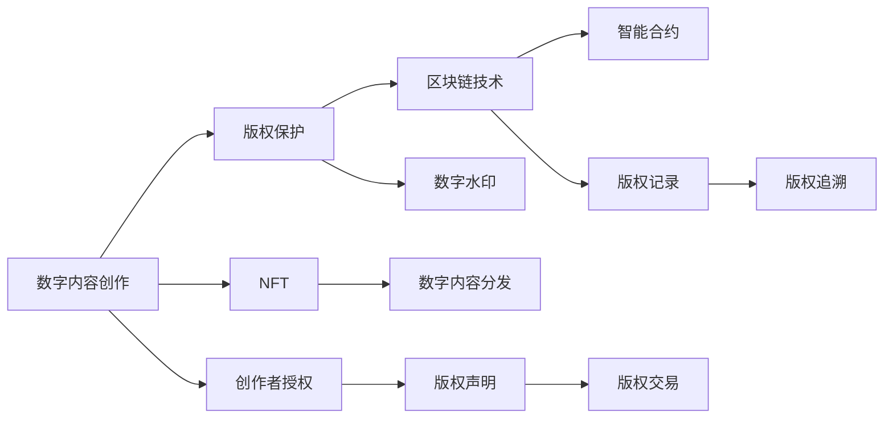

                 

## 1. 背景介绍

在数字化浪潮的推动下，数字内容创作和版权保护已逐渐成为全球关注的焦点。传统的内容生产方式正面临颠覆性变革，数字版权技术的快速发展为版权保护提供了新的手段，但同时也带来了诸多挑战。本文将探讨知识产权与数字内容创作的新范式，从技术角度分析其在版权保护、内容创作、商业模式等方面的应用和影响。

## 2. 核心概念与联系

### 2.1 核心概念概述

- **数字内容创作**：指通过数字化技术进行文本、图像、音频、视频等多媒体内容的创作。
- **知识产权**：指著作权、专利权、商标权等权利的总称，是创作者对其创作成果的法律保护。
- **版权保护**：指通过法律、技术手段保护内容创作者对其作品的专有权利，防止未经授权的复制、分发和使用。
- **区块链技术**：一种去中心化的分布式账本技术，可以用于记录版权信息，确保不可篡改性和透明性。
- **数字水印**：嵌入在数字内容中的不可见标识，用于版权识别和追踪。
- **NFT（非同质化代币）**：基于区块链技术创建的一种独特数字资产，具有不可复制、独一无二的特点。
- **智能合约**：运行在区块链上的自动化合约，能够根据预设条件自动执行并转移版权。

### 2.2 核心概念原理和架构的 Mermaid 流程图



此图展示了数字内容创作到版权保护的全过程，各个环节相互关联，共同构成了数字版权保护的新范式。

## 3. 核心算法原理 & 具体操作步骤

### 3.1 算法原理概述

数字内容创作和版权保护的新范式主要基于区块链技术，通过数字水印和智能合约等技术手段实现。这些技术可以确保内容的原创性、版权的唯一性和交易的透明性，从而有效地保护数字内容的知识产权。

### 3.2 算法步骤详解

**Step 1: 内容创作**
创作者使用数字化工具创作作品，可以是文字、图片、音频、视频等，并通过网络平台分发。

**Step 2: 数字水印嵌入**
在创作过程中或作品发布前，将数字水印嵌入到数字内容中。数字水印可以是唯一标识符、创作者信息等，用于版权识别和追踪。

**Step 3: 版权声明与授权**
创作者在创作完成或数字内容发布后，通过区块链平台进行版权声明，并授权其他方使用其作品。

**Step 4: 版权记录与追溯**
数字水印和智能合约等技术将版权信息记录在区块链上，确保其不可篡改性，并提供追溯机制。

**Step 5: 版权交易与利益分配**
通过智能合约自动执行版权交易，包括版权授权、付费、版权转移等，并确保利益分配的透明性和公平性。

### 3.3 算法优缺点

**优点**：
- **透明性**：区块链技术提供了透明的版权记录和追溯机制，保证了版权信息的公开性和可信度。
- **安全性**：数字水印和智能合约等技术可以防止内容被篡改和盗用，保障内容的原创性和完整性。
- **自动化**：智能合约可以自动执行版权交易和利益分配，提高了效率和公正性。

**缺点**：
- **技术复杂性**：需要掌握区块链和智能合约等先进技术，对创作者的门槛较高。
- **性能问题**：区块链交易的延时和费用较高，可能影响版权交易的速度和成本。
- **法律和标准问题**：版权保护的法律法规和行业标准尚未完全统一，存在不确定性。

### 3.4 算法应用领域

数字内容创作和版权保护的新范式适用于多种领域，包括但不限于：

- **文学作品**：小说、诗歌、散文等文学作品可以通过数字水印和智能合约进行版权保护和授权。
- **艺术作品**：绘画、摄影、雕塑等艺术作品，可以借助区块链和NFT技术进行唯一标识和交易。
- **音乐作品**：歌曲、MIDI文件等音乐作品，可以通过数字水印和智能合约进行版权管理和收益分配。
- **视频内容**：视频短片、纪录片等视频内容，可以通过数字水印和智能合约确保版权信息的安全和透明。
- **软件和游戏**：开放源代码的软件和游戏可以通过区块链和智能合约进行开放授权和利益分配。

## 4. 数学模型和公式 & 详细讲解 & 举例说明

### 4.1 数学模型构建

数字内容创作和版权保护的数学模型可以基于区块链技术构建。假设版权信息记录在区块链上，版权交易过程可以表示为智能合约的自动执行。

### 4.2 公式推导过程

1. **版权声明模型**：
   - 版权声明智能合约的输入包括创作者信息、作品类型、版权期限等，输出为版权声明的哈希值。
   - 版权声明模型：$$H_{\text{版权}} = f_{\text{声明}}(创作者, 作品类型, 版权期限)$$

2. **版权记录模型**：
   - 版权记录智能合约的输入包括版权声明的哈希值和区块链上的交易信息，输出为版权记录的哈希值。
   - 版权记录模型：$$H_{\text{记录}} = f_{\text{记录}}(H_{\text{版权}}, 交易信息)$$

3. **版权追溯模型**：
   - 版权追溯智能合约的输入为版权声明的哈希值和目标版权信息，输出为版权流转的完整路径。
   - 版权追溯模型：$$P_{\text{追溯}} = f_{\text{追溯}}(H_{\text{版权}}, 目标版权信息)$$

### 4.3 案例分析与讲解

**案例**：一名艺术家通过区块链平台发布其作品，并声明版权。观众A希望购买该作品并进行再创作。

1. **版权声明**：艺术家在区块链上发布作品，并声明版权，生成版权声明哈希值$H_{\text{版权}}$。
2. **版权记录**：艺术家将作品上传至区块链平台，智能合约自动记录版权信息，生成版权记录哈希值$H_{\text{记录}}$。
3. **版权授权**：艺术家授权观众A购买该作品，观众A通过智能合约支付版权费用，版权授权智能合约生成授权记录。
4. **版权追溯**：观众A再创作该作品并上传至区块链平台，智能合约自动记录再创作版权信息，并根据原始版权记录生成完整的版权追溯路径。

## 5. 项目实践：代码实例和详细解释说明

### 5.1 开发环境搭建

1. **环境配置**：
   - 安装Node.js和npm，用于区块链开发。
   - 安装Blockchain开发框架，如Hyperledger Fabric或Ethereum。
   - 安装数字水印工具，如Imprint、CompressWatermark等。

2. **开发环境搭建**：
   - 搭建本地区块链网络，包括区块链节点和智能合约编译器。
   - 创建数字内容创作和版权声明的智能合约。

### 5.2 源代码详细实现

以下是一个基于Hyperledger Fabric的版权声明智能合约的示例代码：

```javascript
// 版权声明智能合约
class CopyrightContract {
    constructor() {
        // 创作者的公钥
        this.creatorPubKey = null;
        // 作品类型
        this.contentType = null;
        // 版权期限
        this.duration = null;
        // 版权声明哈希值
        this.copyrightHash = null;
    }

    // 声明版权
    async declareCopyright(creator, contentType, duration) {
        this.creatorPubKey = creator.pubKey;
        this.contentType = contentType;
        this.duration = duration;
        // 生成版权声明哈希值
        this.copyrightHash = await this.generateCopyrightHash();
        // 记录版权声明
        await this.recordCopyright(this.copyrightHash);
    }

    // 生成版权声明哈希值
    async generateCopyrightHash() {
        // 将创作者、作品类型、版权期限等转换为字符串
        const data = this.creatorPubKey + this.contentType + this.duration;
        // 使用SHA256算法生成哈希值
        const hash = await this.hashFunction(data);
        return hash;
    }

    // 记录版权声明
    async recordCopyright(copyrightHash) {
        // 将版权声明哈希值记录在区块链上
        await this.blockchain.record(copyrightHash);
    }

    // 验证版权声明
    async verifyCopyright(copyrightHash) {
        // 从区块链上获取版权声明哈希值
        const blockchainHash = await this.blockchain.hash(copyrightHash);
        // 验证版权声明哈希值是否与记录一致
        return blockchainHash === copyrightHash;
    }
}
```

### 5.3 代码解读与分析

**代码解读**：
- 版权声明智能合约包含了版权声明的必要信息，如创作者、作品类型、版权期限等。
- 声明版权方法将创作者公钥、作品类型、版权期限等输入转换为字符串，并使用SHA256算法生成版权声明哈希值。
- 记录版权声明方法将版权声明哈希值记录在区块链上。
- 验证版权声明方法用于验证区块链上的版权声明哈希值是否与记录一致。

**代码分析**：
- 代码简洁，易于理解，实现了版权声明、记录和验证的基本功能。
- 使用SHA256算法生成哈希值，确保了版权声明的不可篡改性。
- 通过区块链记录版权声明，确保了版权信息的透明性和可追溯性。
- 验证版权声明方法确保了版权声明的真实性和完整性。

### 5.4 运行结果展示

以下是一个版权声明智能合约的运行示例：

```javascript
const creator = { pubKey: 'pubKey1' };
const contentType = '绘画';
const duration = 10; // 版权期限为10年

const copyrightContract = new CopyrightContract();
await copyrightContract.declareCopyright(creator, contentType, duration);

// 验证版权声明
const copyrightHash = copyrightContract.copyrightHash;
const isValid = await copyrightContract.verifyCopyright(copyrightHash);
console.log(`版权声明哈希值: ${copyrightHash}`);
console.log(`验证结果: ${isValid ? '有效' : '无效'}`);
```

## 6. 实际应用场景

### 6.1 数字版权交易平台

数字版权交易平台可以基于区块链和智能合约技术，提供数字内容的版权声明、授权、交易和收益分配等一站式服务。平台上的创作者可以方便地声明版权，发布作品，并进行版权授权和交易。

### 6.2 版权管理与保护系统

版权管理与保护系统可以用于企业内部的版权管理，记录和管理所有作品的版权信息，包括作品类型、版权期限、授权信息等。系统可以自动生成版权声明和记录，并进行版权追溯和保护。

### 6.3 版权追踪与鉴定系统

版权追踪与鉴定系统可以利用数字水印和区块链技术，追踪数字内容的使用情况，识别和鉴定版权侵犯行为。系统可以通过数字水印的嵌入和解密，识别作品的版权信息和创作者，从而进行版权追溯和维权。

### 6.4 未来应用展望

未来，数字内容创作和版权保护的新范式将进一步发展，实现以下目标：

1. **自动化版权管理**：通过智能合约和区块链技术，实现版权声明、授权、交易和收益分配的自动化，提高效率和公正性。
2. **全球版权保护**：利用区块链的全球分布特性，实现全球范围的版权保护和追踪，打破地域限制。
3. **版权信息共享**：通过区块链和智能合约，实现版权信息的公开共享，促进版权交易和资源整合。
4. **智能合约进化**：进一步研究和优化智能合约的设计和执行，提高合约的灵活性和可靠性。
5. **跨链协同**：实现不同区块链平台之间的协同和互操作，提供更全面的版权保护和交易服务。

## 7. 工具和资源推荐

### 7.1 学习资源推荐

1. **《区块链技术概论》**：这本书详细介绍了区块链的基本概念、技术原理和应用场景。
2. **《数字版权保护与区块链应用》**：介绍了区块链在数字版权保护中的应用和实践。
3. **《智能合约编程与开发》**：讲解了智能合约的编程语言和开发工具。
4. **《数字水印技术与实践》**：介绍了数字水印的基本原理和应用案例。

### 7.2 开发工具推荐

1. **Hyperledger Fabric**：开源区块链开发框架，提供了完整的区块链开发工具链。
2. **Ethereum**：全球领先的区块链平台，提供了丰富的智能合约开发资源和工具。
3. **Imprint**：一款基于JavaScript的数字水印工具。
4. **CompressWatermark**：一款开源的数字水印库，支持多种格式和算法。

### 7.3 相关论文推荐

1. **《区块链技术在数字版权保护中的应用》**：介绍了区块链在数字版权保护中的基本原理和应用实例。
2. **《数字水印技术在版权保护中的应用》**：探讨了数字水印技术在版权保护中的关键技术和实际应用。
3. **《智能合约在版权交易中的应用》**：研究了智能合约在版权交易中的基本框架和优化策略。

## 8. 总结：未来发展趋势与挑战

### 8.1 研究成果总结

本文探讨了基于区块链技术的数字内容创作和版权保护的新范式，从技术角度分析了其在版权保护、内容创作和商业模式等方面的应用和影响。通过案例分析，展示了数字水印、智能合约等技术在版权声明、记录和追溯中的应用。

### 8.2 未来发展趋势

未来，数字内容创作和版权保护的新范式将进一步发展，实现以下目标：

1. **自动化版权管理**：通过智能合约和区块链技术，实现版权声明、授权、交易和收益分配的自动化。
2. **全球版权保护**：利用区块链的全球分布特性，实现全球范围的版权保护和追踪。
3. **版权信息共享**：通过区块链和智能合约，实现版权信息的公开共享，促进版权交易和资源整合。
4. **智能合约进化**：进一步研究和优化智能合约的设计和执行，提高合约的灵活性和可靠性。
5. **跨链协同**：实现不同区块链平台之间的协同和互操作，提供更全面的版权保护和交易服务。

### 8.3 面临的挑战

尽管数字内容创作和版权保护的新范式具备诸多优势，但仍面临以下挑战：

1. **技术复杂性**：需要掌握区块链和智能合约等先进技术，对创作者的门槛较高。
2. **性能问题**：区块链交易的延时和费用较高，可能影响版权交易的速度和成本。
3. **法律和标准问题**：版权保护的法律法规和行业标准尚未完全统一，存在不确定性。
4. **用户接受度**：部分创作者和用户对新技术的接受度较低，需进一步推广和普及。
5. **安全性和隐私**：区块链和智能合约等技术的安全性和隐私保护仍需进一步加强。

### 8.4 研究展望

未来，数字内容创作和版权保护的新范式将在以下几个方面进行进一步研究：

1. **区块链和智能合约优化**：研究和优化区块链和智能合约的技术实现，提高性能和可靠性。
2. **数字水印技术创新**：开发更加高效和隐蔽的数字水印算法，提高版权保护的难度和安全性。
3. **跨链协同技术**：研究不同区块链平台之间的协同机制和互操作性，实现跨链版权管理。
4. **智能合约与传统法律结合**：研究智能合约与传统法律制度的结合，提供更全面的版权保护方案。
5. **社会接受度提升**：通过教育和宣传，提升创作者和用户对新技术的接受度和信任度。

## 9. 附录：常见问题与解答

### Q1: 数字版权保护的新范式如何实现版权声明和授权？

A: 通过智能合约和区块链技术，创作者可以在区块链上声明版权，并授权其他方使用其作品。智能合约将自动记录版权声明和授权信息，并确保其不可篡改性和透明性。

### Q2: 数字水印和智能合约技术如何确保版权信息的安全和透明性？

A: 数字水印和智能合约技术可以确保版权信息的安全性和透明性。数字水印被嵌入到数字内容中，只有经过授权的用户才能解码和识别。智能合约自动记录版权声明和授权信息，并确保其不可篡改性和可追溯性。

### Q3: 数字版权保护的新范式有哪些潜在风险？

A: 数字版权保护的新范式可能面临技术复杂性高、性能问题、法律和标准不确定性、用户接受度低等风险。需要进一步研究和优化技术实现，并加强法律法规和行业标准的完善。

### Q4: 数字内容创作和版权保护的新范式在实际应用中面临哪些挑战？

A: 数字内容创作和版权保护的新范式在实际应用中面临技术复杂性高、性能问题、法律和标准不确定性、用户接受度低等挑战。需要进一步研究和优化技术实现，并加强法律法规和行业标准的完善。

