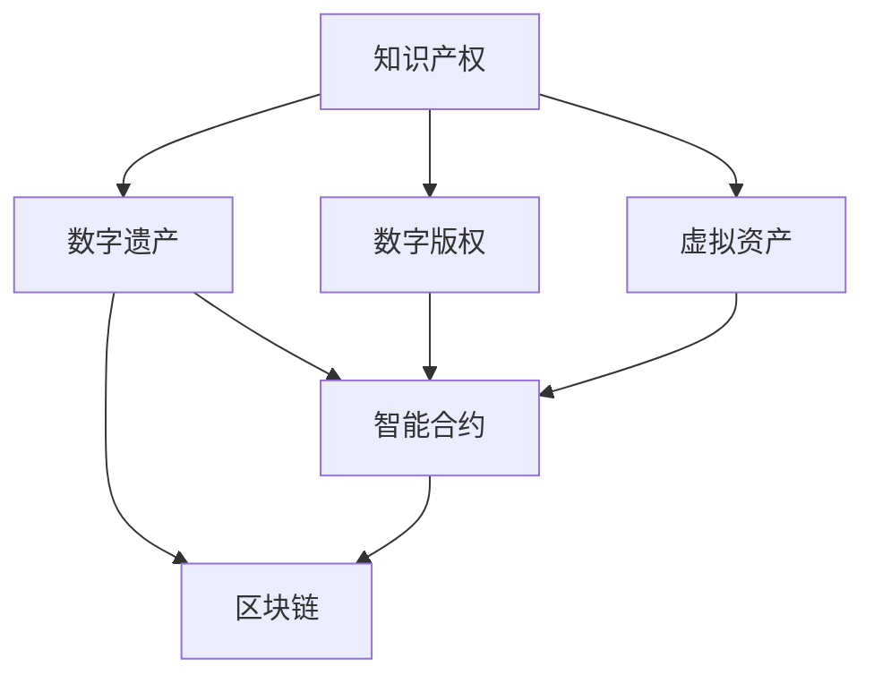

                 

# 知识产权与数字遗产的继承

> 关键词：知识产权,数字遗产,数字版权,虚拟资产,智能合约,区块链

## 1. 背景介绍

### 1.1 问题由来
随着数字时代的到来，大量的知识产权（IP）如代码、文档、视频、音乐等数字化，并存放在各种数字平台上，如GitHub、Google Drive、Dropbox等。这些数字资产的价值日益凸显，成为人们经济活动的重要组成部分。然而，这些数字资产往往缺乏有效的继承机制，导致其所有权、使用权、收益权等无法顺利转让，给继承人带来诸多不便。

### 1.2 问题核心关键点
这些问题主要体现在以下几个方面：

- 数字资产所有权的法律界定不明确。传统法律体系对数字资产的归属权、使用权等权利缺乏明确规定。
- 数字资产的继承方式较为繁琐。传统继承方式如遗嘱、公证等，繁琐且成本高昂，不能适应快速流转的数字资产。
- 数字资产的受益分配不够灵活。传统继承方式无法有效解决多人共享、条件继承等问题。
- 数字资产的受益人管理困难。传统继承方式无法实时管理资产的状态和使用情况。

### 1.3 问题研究意义
知识产权与数字遗产的继承问题直接关系到数字资产的保护和传承，对于促进数字经济的发展具有重要意义。解决好这一问题，有助于保障知识产权的合法权益，促进数字资产的合理流转和使用，推动数字经济的繁荣发展。

## 2. 核心概念与联系

### 2.1 核心概念概述

为更好地理解知识产权与数字遗产的继承，本节将介绍几个关键概念：

- 知识产权：包括著作权、专利权、商标权、版权等，是创作者对其智力成果的法定权利。
- 数字遗产：通过数字方式存储的资产，如代码、文档、图片、音频、视频等。
- 数字版权：对数字作品（如软件、音乐、视频等）的版权。
- 虚拟资产：数字化形式存在，可以在虚拟环境中使用或交换的资产。
- 智能合约：在区块链上运行的自动执行、无需中介的合同。
- 区块链：去中心化的分布式账本技术，可以实现去信任、透明、不可篡改的记录。

这些概念之间的关系可以通过以下Mermaid流程图来展示：



这个流程图展示了一些核心概念之间的逻辑关系：

- 知识产权是数字遗产和数字版权的基础。
- 数字遗产包括代码、文档、图片、音频、视频等数字化形式存在的内容。
- 数字版权是对数字作品（如软件、音乐、视频等）的版权。
- 虚拟资产是数字化形式的资产，可以在虚拟环境中使用或交换。
- 智能合约是在区块链上运行的自动执行、无需中介的合同。
- 区块链是实现智能合约的去中心化分布式账本技术。

这些核心概念共同构成了知识产权与数字遗产继承的基础框架，使得继承过程更加高效、透明和可控。

## 3. 核心算法原理 & 具体操作步骤
### 3.1 算法原理概述

知识产权与数字遗产的继承问题可以通过智能合约来解决。智能合约是一种基于区块链技术的自动化合约，可以自动执行、无需中介、透明可追踪，从而保障数字资产的继承和流转。

具体来说，智能合约通过以下步骤实现知识产权与数字遗产的继承：

1. 创建智能合约：在区块链上创建继承智能合约，定义继承条件、受益人、时间等关键要素。
2. 添加资产：将需要继承的数字资产（如代码、文档、图片、音频、视频等）添加到智能合约中。
3. 设定继承条件：设置继承的具体条件，如时间、受益人、继承方式等。
4. 触发继承：当继承条件满足时，智能合约自动执行，将数字资产转移到指定的受益人。
5. 管理资产：受益人可以在智能合约上查看、管理和使用数字资产，确保数字资产的安全和流转。

### 3.2 算法步骤详解

以下是实现知识产权与数字遗产继承的智能合约的基本操作步骤：

**Step 1: 创建智能合约**
- 选择一个支持智能合约的区块链平台，如Ethereum、Polkadot等。
- 编写智能合约代码，定义继承条件、受益人、时间等关键要素。
- 将智能合约代码部署到区块链上。

**Step 2: 添加资产**
- 将需要继承的数字资产上传到智能合约指定的存储平台，如IPFS、Amazon S3等。
- 在智能合约中记录资产的哈希值（Hash）和存储位置。

**Step 3: 设定继承条件**
- 定义继承的具体条件，如时间、受益人、继承方式等。
- 将继承条件保存到区块链上。

**Step 4: 触发继承**
- 当继承条件满足时，智能合约自动执行，将数字资产转移到指定的受益人。
- 智能合约会记录转移的时间和受益人，确保继承过程的可追溯性。

**Step 5: 管理资产**
- 受益人可以在智能合约上查看、管理和使用数字资产。
- 智能合约可以自动更新资产的状态，确保数字资产的安全和流转。

### 3.3 算法优缺点

智能合约的优点：
1. 透明可追溯：所有继承过程和资产转移记录都可以在区块链上查看，保证了继承过程的透明和可追溯性。
2. 自动化执行：智能合约可以自动执行，无需中介，提高了继承效率。
3. 去信任：智能合约基于区块链技术，无需信任第三方，保障了继承过程的公平和公正。
4. 灵活性：智能合约可以定义多种继承条件，灵活适应不同的继承需求。

智能合约的缺点：
1. 成本高：智能合约的部署和维护需要一定的费用，不适合小规模的继承需求。
2. 技术门槛高：智能合约需要一定的技术背景和编程能力，普通用户难以操作。
3. 安全问题：智能合约可能存在漏洞，攻击者可能利用漏洞进行非法操作。

### 3.4 算法应用领域

智能合约技术可以广泛应用于以下领域：

- 版权转让：通过智能合约实现数字版权的自动转让。
- 音乐、视频版权管理：通过智能合约管理音乐、视频的版权和使用权。
- 数字货币：通过智能合约实现数字货币的自动化管理。
- 金融资产：通过智能合约实现金融资产的自动转让和分割。
- 游戏资产：通过智能合约实现游戏资产的自动管理和流转。

除了上述这些领域，智能合约还可以应用于更多的场景，如房地产、物流、供应链等，推动各行业的数字化转型。

## 4. 数学模型和公式 & 详细讲解  
### 4.1 数学模型构建

本节将使用数学语言对智能合约实现知识产权与数字遗产继承的过程进行更加严格的刻画。

记数字资产为 $A$，继承条件为 $C$，受益人为 $B$。智能合约通过以下数学模型来描述继承过程：

- 创建智能合约：$M(A, C, B)$
- 添加资产：$Add(A, M)$
- 设定继承条件：$SetC(C, M)$
- 触发继承：$Inherit(C, M)$
- 管理资产：$Manage(A, B, M)$

其中：

- $M$ 表示智能合约的状态，包括数字资产、继承条件、受益人等。
- $A$ 表示数字资产。
- $C$ 表示继承条件。
- $B$ 表示受益人。

### 4.2 公式推导过程

以下我们以版权转让为例，推导智能合约实现继承的过程。

假设版权所有人 $A$ 将版权转让给受益人 $B$，需要满足以下继承条件：

- 时间：$T$，如版权到期日。
- 受益人：$B$，如指定的版权受益人。

版权转让的智能合约可以定义为：

$$
M(A, C, B) = \begin{cases}
A, & \text{if } C(T, B) \\
\text{Error}, & \text{otherwise}
\end{cases}
$$

其中，$C(T, B)$ 表示版权时间 $T$ 和受益人 $B$ 是否满足继承条件。

对于添加资产：

$$
Add(A, M) = M \cup \{A\}
$$

表示将资产 $A$ 添加到智能合约 $M$ 中。

对于设定继承条件：

$$
SetC(C, M) = M \cup \{C\}
$$

表示将继承条件 $C$ 添加到智能合约 $M$ 中。

对于触发继承：

$$
Inherit(C, M) = \begin{cases}
M \setminus \{A\}, & \text{if } C(T, B) \\
M, & \text{otherwise}
\end{cases}
$$

表示当继承条件满足时，智能合约将版权资产 $A$ 转移到受益人 $B$。

对于管理资产：

$$
Manage(A, B, M) = M \setminus \{A\} \cup \{A\}
$$

表示受益人 $B$ 可以在智能合约上查看、管理和使用版权资产 $A$。

### 4.3 案例分析与讲解

以下是一个简单的版权转让案例：

- 版权所有人 $A$ 需要将其持有的音乐版权转让给受益人 $B$。
- 继承条件为版权到期日 $T$。
- 智能合约 $M$ 包括音乐版权 $A$、继承条件 $C$ 和受益人 $B$。

按照上述数学模型，智能合约的实现步骤如下：

1. 创建智能合约：$M(A, C, B) = (A, C, B)$
2. 添加资产：$Add(A, M) = (A, C, B)$
3. 设定继承条件：$SetC(C, M) = (A, C, B)$
4. 触发继承：$Inherit(C, M) = \begin{cases}
(A, C, B) \setminus \{A\}, & \text{if } C(T, B) \\
(A, C, B), & \text{otherwise}
\end{cases}$
5. 管理资产：$Manage(A, B, M) = (A, C, B)$

当版权到期日 $T$ 和受益人 $B$ 满足继承条件时，智能合约自动执行，将音乐版权 $A$ 转移到受益人 $B$。

## 5. 项目实践：代码实例和详细解释说明
### 5.1 开发环境搭建

在进行智能合约实践前，我们需要准备好开发环境。以下是使用Solidity编写智能合约的开发环境配置流程：

1. 安装Node.js和npm：从官网下载并安装Node.js和npm，用于开发和测试智能合约。
2. 安装Truffle套件：从官网下载并安装Truffle套件，提供开发和部署智能合约的框架。
3. 安装Web3.js库：使用npm安装Web3.js库，用于与以太坊等区块链平台进行交互。

完成上述步骤后，即可在本地搭建智能合约开发环境。

### 5.2 源代码详细实现

以下是一个简单的版权转让智能合约的Solidity代码实现。

```solidity
pragma solidity ^0.8.0;

contract CopyrightTransfer {
    address public owner;
    address public beneficiary;
    uint256 public expires;
    uint256[] public tokenIds;

    mapping(uint256 => bool) public isClaimed;

    event Transfer(uint256 indexed tokenId, address indexed beneficiary);

    constructor() public {
        owner = msg.sender;
    }

    function addToken(uint256 tokenId) public {
        tokenIds.push(tokenId);
        isClaimed[tokenId] = false;
    }

    function setCondition(uint256 expires) public {
        this.expires = expires;
    }

    function claim(uint256 tokenId) public {
        require(!isClaimed[tokenId], "Token already claimed");
        isClaimed[tokenId] = true;
        emit Transfer(tokenId, beneficiary);
    }

    function transfer(address _beneficiary) public {
        require(owner.send(msg.value), "Insufficient balance");
        owner = _beneficiary;
    }

    function ownerChanged(address newOwner) public {
        owner = newOwner;
    }
}
```

**代码解释**：
- 定义智能合约的基本状态和事件：所有者、受益人、到期日、代币ID、已领取标记、转账事件等。
- 构造函数：将所有者设置为合约部署者。
- 添加代币：将代币ID添加到合约中。
- 设定条件：设定代币的到期日。
- 领取代币：当所有者领取代币时，将代币ID添加到已领取标记中。
- 转账：当所有者转账时，将所有者更改为受益人。
- 所有者变更：当所有者变更时，将新所有者设置为合约的所有者。

### 5.3 代码解读与分析

让我们再详细解读一下关键代码的实现细节：

**addToken函数**：
- 将代币ID添加到代币列表中，并初始化已领取标记为false。
- 要求所有者有权添加代币。

**setCondition函数**：
- 设定代币的到期日，更新合约的状态。
- 要求所有者有权设定条件。

**claim函数**：
- 要求已领取标记为false，表示代币未领取。
- 将已领取标记设置为true，表示代币已领取。
- 触发转账事件，通知所有者、受益人等。

**transfer函数**：
- 要求所有者转账，将所有者更改为受益人。
- 要求所有者有足够的余额。

**ownerChanged函数**：
- 要求所有者变更，将新所有者设置为合约的所有者。

这些函数通过调用区块链智能合约的API实现对应的功能。在实践中，开发者可以根据具体的继承需求，添加或修改这些函数，实现更复杂、灵活的继承过程。

## 6. 实际应用场景
### 6.1 智能版权管理

智能合约可以应用于版权的管理和流转，保障知识产权的合法权益。例如，音乐、视频等数字作品可以通过智能合约实现自动版权转让和收益分配。

具体来说，可以构建一个智能合约平台，用于存储和管理数字作品版权。当版权到期或转让时，智能合约可以自动触发转让流程，将版权资产转移到新的受益人。

### 6.2 游戏资产管理

游戏资产是玩家在游戏中获得的虚拟资产，如装备、货币等。智能合约可以用于游戏资产的管理和流转，确保资产的安全和公平。

例如，玩家可以将游戏资产作为代币存入智能合约，并通过智能合约进行交易和转移。智能合约可以自动处理交易请求，确保资产的流转透明和可追溯。

### 6.3 数字版权交易

数字版权交易是数字经济中的重要环节。智能合约可以用于版权的交易和授权，实现版权的自动转让和分割。

例如，版权所有者可以在智能合约上发布版权交易信息，设置交易条件。当交易条件满足时，智能合约可以自动执行交易，将版权资产转移到新的受益人。

### 6.4 未来应用展望

随着区块链技术的不断成熟，智能合约在知识产权与数字遗产继承中的应用前景广阔。

未来的智能合约将具备更多的功能，如条件执行、时间锁、多重签名等，可以更灵活地适应复杂的继承需求。同时，智能合约将与更多的智能工具和技术结合，如人工智能、区块链分析、物联网等，实现更高效、更智能的继承过程。

## 7. 工具和资源推荐
### 7.1 学习资源推荐

为了帮助开发者系统掌握智能合约的原理和实践，这里推荐一些优质的学习资源：

1. 《以太坊智能合约实战》：一本全面介绍以太坊智能合约开发的书籍，涵盖智能合约的基本概念、开发工具、安全性、最佳实践等。
2. Solidity官方文档：Solidity语言的官方文档，提供了丰富的教程和示例，是学习和使用Solidity的最佳资源。
3. Truffle套件文档：Truffle框架的官方文档，提供了详细的开发和部署指南，适合初学者入门。
4. Web3.js官方文档：Web3.js库的官方文档，提供了与以太坊等区块链平台交互的API和示例，方便开发者进行测试和调试。
5. CryptoZombies：一个基于以太坊的互动式学习平台，提供智能合约开发和测试的实战练习，帮助开发者快速上手。

通过对这些资源的学习实践，相信你一定能够快速掌握智能合约的精髓，并用于解决实际的IP与数字遗产继承问题。
###  7.2 开发工具推荐

高效的开发离不开优秀的工具支持。以下是几款用于智能合约开发的常用工具：

1. Visual Studio Code：一款轻量级的代码编辑器，支持智能合约的编写和调试。
2. Remix IDE：一个专为以太坊智能合约开发设计的IDE，提供可视化界面和调试工具。
3. Tenderly：一款智能合约分析工具，可以生成代码的调用图和执行日志，帮助开发者理解合约逻辑。
4. OpenZeppelin：一个智能合约库，提供了许多常用的智能合约组件和安全机制，方便开发者快速构建合约。
5. MetaMask：一个以太坊钱包和浏览器插件，可以方便地进行智能合约的部署和测试。

合理利用这些工具，可以显著提升智能合约的开发效率，加快创新迭代的步伐。

### 7.3 相关论文推荐

智能合约技术的发展源于学界的持续研究。以下是几篇奠基性的相关论文，推荐阅读：

1. "Ethereum Yellow Paper"：以太坊白皮书，介绍了以太坊智能合约和区块链的基本概念和技术架构。
2. "Solidity Annotations"：Solidity语言的官方文档，提供了详细的语法和注释规范。
3. "A Survey on Smart Contracts for Digital Copyright"：一篇关于智能合约在版权领域应用的综述论文，介绍了多种智能合约模型和技术。
4. "Smart Contracts for Copyright Enforcement"：一篇关于版权智能合约的研究论文，提出了多种智能合约模型和机制。
5. "Blockchain and Smart Contracts for Intellectual Property Management"：一篇关于知识产权智能合约的研究论文，介绍了多种智能合约技术和应用场景。

这些论文代表了大语言模型微调技术的发展脉络。通过学习这些前沿成果，可以帮助研究者把握学科前进方向，激发更多的创新灵感。

## 8. 总结：未来发展趋势与挑战
### 8.1 总结

本文对基于智能合约的知识产权与数字遗产继承问题进行了全面系统的介绍。首先阐述了知识产权与数字遗产继承问题的重要性和现有方案的局限性，明确了智能合约在解决这些问题中的独特价值。其次，从原理到实践，详细讲解了智能合约的数学模型和核心步骤，给出了智能合约任务开发的完整代码实例。同时，本文还广泛探讨了智能合约在版权管理、游戏资产管理、数字版权交易等多个领域的应用前景，展示了智能合约范式的巨大潜力。此外，本文精选了智能合约技术的各类学习资源，力求为读者提供全方位的技术指引。

通过本文的系统梳理，可以看到，基于智能合约的知识产权与数字遗产继承问题正在成为智能合约技术的重要范式，极大地拓展了数字资产的保护和传承方式，为数字经济的发展提供了新的保障。未来，伴随智能合约技术的持续演进，相信智能合约必将在更多的场景中发挥作用，为知识产权的保护和传承带来新的变革。

### 8.2 未来发展趋势

展望未来，智能合约技术将呈现以下几个发展趋势：

1. 功能丰富化：智能合约将具备更多的功能，如条件执行、时间锁、多重签名等，可以更灵活地适应复杂的继承需求。
2. 安全性提升：智能合约将引入更多安全机制，如零知识证明、多方计算等，保障数字资产的安全性和隐私性。
3. 跨链互操作：智能合约将支持跨链互操作，实现不同区块链平台之间的资产流转和协同管理。
4. 去中心化自治组织（DAO）：智能合约将与DAO结合，形成去中心化自治的组织形式，提升组织管理的透明度和公平性。
5. 标准化规范：智能合约将逐步形成统一的标准和规范，便于跨平台和跨项目的开发和合作。

以上趋势凸显了智能合约技术的广阔前景。这些方向的探索发展，必将进一步提升智能合约系统的性能和应用范围，为数字资产的保护和传承带来新的机遇。

### 8.3 面临的挑战

尽管智能合约技术已经取得了瞩目成就，但在迈向更加智能化、普适化应用的过程中，它仍面临着诸多挑战：

1. 技术门槛高：智能合约的开发和部署需要一定的技术背景和编程能力，普通用户难以操作。
2. 成本高昂：智能合约的部署和维护需要一定的费用，不适合小规模的继承需求。
3. 安全性问题：智能合约可能存在漏洞，攻击者可能利用漏洞进行非法操作。
4. 性能瓶颈：智能合约的执行效率可能较低，影响资产流转的速度。
5. 法律和监管问题：智能合约的合法性和监管机制尚未完全明确，存在法律和政策风险。

尽管存在这些挑战，但通过不断的技术创新和实践优化，智能合约技术必将克服这些难题，为数字资产的保护和传承提供新的保障。

### 8.4 研究展望

面对智能合约技术面临的诸多挑战，未来的研究需要在以下几个方面寻求新的突破：

1. 用户友好的开发工具：开发易于使用的智能合约开发工具，降低技术门槛，提高用户体验。
2. 低成本的部署方案：开发低成本的智能合约部署方案，降低使用门槛，适应小规模需求。
3. 安全性和隐私性：研究和开发更加安全、隐私保护的智能合约机制，避免漏洞和攻击。
4. 跨链互操作：研究跨链互操作技术，实现不同区块链平台之间的资产流转和协同管理。
5. 法律和监管合规：研究和制定智能合约的法律和监管机制，确保智能合约的合法性和安全性。

这些研究方向的探索，必将引领智能合约技术迈向更高的台阶，为数字资产的保护和传承带来新的突破。面向未来，智能合约技术还需要与其他人工智能技术进行更深入的融合，如区块链分析、人工智能、物联网等，多路径协同发力，共同推动数字经济的发展。

## 9. 附录：常见问题与解答

**Q1: 如何确保智能合约的安全性？**

A: 确保智能合约的安全性需要从多个方面入手：
1. 代码审计：定期对智能合约进行代码审计，发现和修复潜在的漏洞。
2. 测试用例：编写全面的测试用例，确保合约在不同场景下的正确性和稳定性。
3. 合约验证：使用第三方合约验证工具，如MythX、OpenZeppelin等，对合约进行自动化测试和验证。
4. 审计报告：公开智能合约的审计报告，便于社区和监管机构进行监督和审核。

**Q2: 如何管理智能合约中的数字资产？**

A: 管理智能合约中的数字资产需要考虑以下几个方面：
1. 存储位置：选择合适的资产存储位置，如IPFS、Amazon S3等。
2. 哈希值：记录资产的哈希值，确保资产的唯一性和不可篡改性。
3. 状态管理：使用智能合约的状态变量，记录资产的流转情况和状态。
4. 自动化执行：通过智能合约的自动化执行机制，实现资产的流转和分配。

**Q3: 智能合约在实际应用中存在哪些局限性？**

A: 智能合约在实际应用中存在以下局限性：
1. 技术门槛高：智能合约的开发和部署需要一定的技术背景和编程能力，普通用户难以操作。
2. 成本高昂：智能合约的部署和维护需要一定的费用，不适合小规模的继承需求。
3. 安全性问题：智能合约可能存在漏洞，攻击者可能利用漏洞进行非法操作。
4. 性能瓶颈：智能合约的执行效率可能较低，影响资产流转的速度。
5. 法律和监管问题：智能合约的合法性和监管机制尚未完全明确，存在法律和政策风险。

**Q4: 如何选择适合的智能合约平台？**

A: 选择适合的智能合约平台需要考虑以下几个方面：
1. 功能性：选择具备丰富功能的智能合约平台，如去中心化自治组织（DAO）、多签交易、时间锁等。
2. 安全性：选择安全性高的智能合约平台，如使用Ethereum等成熟区块链平台。
3. 易用性：选择易于使用的智能合约平台，如Truffle套件、Remix IDE等。
4. 社区支持：选择社区活跃、资源丰富的智能合约平台，如Ethereum、Polkadot等。
5. 成本效益：选择成本效益高的智能合约平台，如支持低成本部署的Binance Smart Chain等。

**Q5: 如何保障智能合约的可执行性和公平性？**

A: 保障智能合约的可执行性和公平性需要从以下几个方面入手：
1. 合约审计：定期对智能合约进行审计，发现和修复潜在的漏洞。
2. 测试用例：编写全面的测试用例，确保合约在不同场景下的正确性和稳定性。
3. 自动化执行：通过智能合约的自动化执行机制，实现资产的流转和分配。
4. 多重签名：使用多重签名机制，确保合同的执行需要多个参与方的同意。
5. 公开透明：公开智能合约的代码和执行记录，便于社区和监管机构进行监督和审核。

这些措施可以有效地保障智能合约的可执行性和公平性，提升数字资产的保护和传承效率。

---

作者：禅与计算机程序设计艺术 / Zen and the Art of Computer Programming

