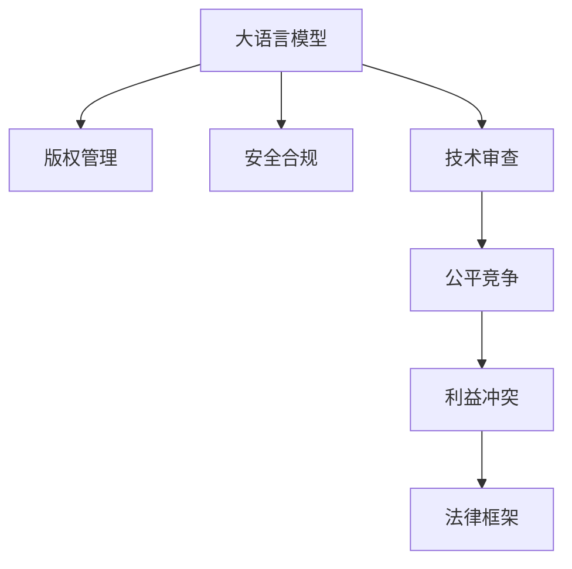

                 

# 知识产权和 LLM：保护创新和创意

> 关键词：知识产权,大语言模型,保护创新,创意保护,版权管理,安全合规,技术审查,公平竞争,利益冲突,法律框架

## 1. 背景介绍

随着人工智能技术的发展，尤其是大语言模型(Large Language Model, LLM)的出现，知识产权保护面临新的挑战和机遇。大语言模型在自然语言处理、文本生成、内容创作等方面展现了强大的能力，但这也可能导致版权风险、侵权行为和利益冲突等问题。如何在保护知识产权的同时，充分利用大语言模型的创新潜力，成为了亟待解决的问题。

### 1.1 问题由来
大语言模型可以自动生成内容，模仿人类创作，甚至能够生成高质量的学术文章、艺术作品、新闻报道等。这些内容是否属于知识产权保护范畴，如何判断其原创性、作者身份，是亟待明确的问题。此外，大语言模型的使用过程中可能涉及版权侵权、利益分配、道德责任等诸多复杂法律和伦理问题。因此，如何在创新和保护之间找到平衡点，是当前AI领域的重要课题。

### 1.2 问题核心关键点
本文将聚焦于以下几个核心问题：
- 大语言模型在知识产权保护中的角色和影响。
- 如何判断大语言模型生成的内容的版权归属和作者身份。
- 大语言模型在内容创作、版权侵权、利益分配等应用场景中的法律和伦理问题。
- 构建一个公平、透明、安全的大语言模型使用框架。

## 2. 核心概念与联系

### 2.1 核心概念概述

为更好地理解大语言模型在知识产权保护中的应用，本节将介绍几个密切相关的核心概念：

- 知识产权（Intellectual Property, IP）：指创作者对其智力劳动成果所享有的专有权利，包括版权、专利权、商标权、商业秘密等。知识产权保护旨在促进创新，维护公平竞争和消费者权益。
- 大语言模型：以自回归(如GPT)或自编码(如BERT)模型为代表的大规模预训练语言模型。通过在大规模无标签文本语料上进行预训练，学习通用的语言表示，具备强大的语言理解和生成能力。
- 版权管理（Copyright Management）：指对作品进行复制、发行、使用等权利的管理和保护，通常涉及授权、许可、版权登记等操作。
- 安全合规（Security & Compliance）：确保技术使用的合法合规，包括数据隐私保护、网络安全、法律遵从等。
- 技术审查（Technical Review）：通过技术手段检测和防止抄袭、侵权行为，保障创作内容的安全性和原创性。
- 公平竞争（Fair Competition）：在内容创作、技术使用等活动中，确保各方享有平等的机会，避免不正当竞争和垄断行为。
- 利益冲突（Conflict of Interests）：技术应用过程中可能产生的不同利益主体之间的矛盾和冲突，如版权归属、收益分配等问题。
- 法律框架（Legal Framework）：国家或国际法律体系下对知识产权保护、技术应用等的规定和约束。

这些核心概念之间的逻辑关系可以通过以下Mermaid流程图来展示：



这个流程图展示了大语言模型的核心概念及其之间的关系：

1. 大语言模型通过版权管理获得合法使用的权利。
2. 安全合规确保大语言模型使用的合法性，避免侵权风险。
3. 技术审查保障创作内容的原创性和安全性。
4. 公平竞争保障各方的平等机会，避免不正当竞争。
5. 利益冲突需要通过法律框架进行调解，确保各方利益平衡。

## 3. 核心算法原理 & 具体操作步骤
### 3.1 算法原理概述

基于大语言模型的知识产权保护，本质上是一个多目标优化问题，旨在平衡创新和保护之间的关系。其核心思想是：构建一个能够生成高质量原创内容，同时保证内容安全和合法合规的大语言模型。

形式化地，假设大语言模型 $M$ 用于内容生成，版权管理系统 $S$ 用于内容审查和管理，安全合规系统 $C$ 用于检测和防止侵权，技术审查系统 $R$ 用于保证创作内容的原创性。则目标为最大化内容创新价值，同时满足以下约束条件：

1. 内容原创性：确保生成的内容具有独特的创造性和原创性，避免抄袭和侵权。
2. 内容合法性：确保生成的内容符合版权法和相关法律法规，避免侵权行为。
3. 内容安全性：确保生成的内容不包含有害信息，不侵犯他人权益。
4. 公平竞争：确保各方在内容创作和使用中享有平等的机会，避免不正当竞争。

优化目标为：

$$
\maximize \text{内容创新价值} \quad \text{subject to} \quad \text{内容原创性约束} \quad \text{内容合法性约束} \quad \text{内容安全性约束} \quad \text{公平竞争约束}
$$

### 3.2 算法步骤详解

基于上述多目标优化问题，构建大语言模型在知识产权保护中的应用流程：

**Step 1: 准备预训练模型和数据集**
- 选择合适的预训练语言模型 $M_{\theta}$ 作为初始化参数，如 BERT、GPT 等。
- 准备版权保护、安全合规、技术审查等任务相关的训练数据集，划分为训练集、验证集和测试集。

**Step 2: 设计任务适配层**
- 根据具体任务需求，在预训练模型顶层设计合适的输出层和损失函数。
- 对于版权管理任务，设计版权归属和授权审核机制，确保生成内容的合法性。
- 对于安全合规任务，设计有害信息检测和过滤机制，保障内容安全性。
- 对于技术审查任务，设计原创性检测和审查机制，确保内容原创性。

**Step 3: 设置微调超参数**
- 选择合适的优化算法及其参数，如 AdamW、SGD 等，设置学习率、批大小、迭代轮数等。
- 设置正则化技术及强度，包括权重衰减、Dropout、Early Stopping 等。
- 确定冻结预训练参数的策略，如仅微调顶层，或全部参数都参与微调。

**Step 4: 执行梯度训练**
- 将训练集数据分批次输入模型，前向传播计算损失函数。
- 反向传播计算参数梯度，根据设定的优化算法和学习率更新模型参数。
- 周期性在验证集上评估模型性能，根据性能指标决定是否触发 Early Stopping。
- 重复上述步骤直到满足预设的迭代轮数或 Early Stopping 条件。

**Step 5: 测试和部署**
- 在测试集上评估微调后模型 $M_{\hat{\theta}}$ 的性能，对比微调前后的原创性、合法性和安全性提升。
- 使用微调后的模型对新样本进行推理预测，集成到实际的应用系统中。
- 持续收集新的数据，定期重新微调模型，以适应数据分布的变化。

以上是基于多目标优化的大语言模型在知识产权保护中的应用流程。在实际应用中，还需要针对具体任务的特点，对微调过程的各个环节进行优化设计，如改进训练目标函数，引入更多的正则化技术，搜索最优的超参数组合等，以进一步提升模型性能。

### 3.3 算法优缺点

基于多目标优化的大语言模型知识产权保护方法具有以下优点：
1. 全面兼顾创新和保护。通过优化多目标函数，能够在保护知识产权的同时，最大化内容创新价值。
2. 灵活性高。可以根据不同应用场景和任务需求，灵活调整模型训练的目标和约束。
3. 可解释性强。通过设置明确的约束条件，模型的行为和决策逻辑更加透明和可理解。

同时，该方法也存在一定的局限性：
1. 模型训练复杂度高。多目标优化问题求解复杂，需要较多的计算资源和时间。
2. 约束条件多。需要同时考虑内容原创性、合法性、安全性等多个约束条件，增加模型设计和调参难度。
3. 应用场景受限。对于特定领域或任务，可能需要针对性地设计任务适配层和约束条件，通用性有限。

尽管存在这些局限性，但就目前而言，基于多目标优化的大语言模型知识产权保护方法仍是大语言模型应用的重要方向。未来相关研究的重点在于如何进一步简化优化问题，提高模型的灵活性和应用范围，同时兼顾创新和保护。

### 3.4 算法应用领域

基于大语言模型的知识产权保护方法，已经在版权管理、内容审查、技术审查等多个领域得到应用，为内容创作和使用提供了新的解决方案。具体应用场景包括：

- 版权保护：对于创作内容，利用大语言模型生成版权声明和证明材料，确保内容的原创性和版权归属。
- 内容审查：对用户生成的内容进行自动审核，检测和过滤有害信息，避免侵权和不当行为。
- 技术审查：对作品进行自动检测，判断其原创性和合法性，保障创作内容的公平竞争。
- 利益冲突处理：在内容创作、使用、收益分配等环节，通过法律框架和公平机制，解决各方利益冲突。

除了上述这些经典应用外，大语言模型在知识产权保护领域还有创新性应用，如创意生成、知识共享等，为NLP技术带来了新的突破。

## 4. 数学模型和公式 & 详细讲解  
### 4.1 数学模型构建

本节将使用数学语言对基于多目标优化的大语言模型知识产权保护过程进行更加严格的刻画。

记大语言模型为 $M_{\theta}$，版权管理系统为 $S$，安全合规系统为 $C$，技术审查系统为 $R$。假设版权管理任务的目标函数为 $\mathcal{L}_S$，安全合规任务的目标函数为 $\mathcal{L}_C$，技术审查任务的目标函数为 $\mathcal{L}_R$。则多目标优化问题可以表示为：

$$
\maximize f(\theta) = \alpha \mathcal{L}_S(\theta) + \beta \mathcal{L}_C(\theta) + \gamma \mathcal{L}_R(\theta)
$$

其中 $\alpha, \beta, \gamma$ 为权重系数，用以平衡各个子目标的贡献。

对于每个子目标函数，我们可以进一步细化分解。例如，版权管理任务可以分解为版权归属判断和授权审核两个子任务，分别对应 $\mathcal{L}_S^{归属}$ 和 $\mathcal{L}_S^{授权}$。则版权管理任务的目标函数可以表示为：

$$
\mathcal{L}_S(\theta) = \mathcal{L}_S^{归属}(\theta) + \mathcal{L}_S^{授权}(\theta)
$$

类似地，安全合规任务和技术审查任务的目标函数也可以分解为多个子任务。

### 4.2 公式推导过程

以下我们以版权归属判断为例，推导版权管理任务的目标函数及其梯度计算公式。

假设版权管理任务的目标是判断一篇文本 $x$ 的版权归属，生成版权声明。版权声明 $y$ 可以被视为一个二元分类任务，即 $y=1$ 表示该文本属于原创，$y=0$ 表示该文本属于非原创。

令版权管理任务的目标函数为交叉熵损失函数：

$$
\mathcal{L}_S^{归属}(\theta) = -\frac{1}{N}\sum_{i=1}^N [y_i\log \hat{y}_i+(1-y_i)\log(1-\hat{y}_i)]
$$

其中 $y_i$ 为真实标签，$\hat{y}_i = M_{\theta}(x_i)$ 为模型预测输出。

根据链式法则，损失函数对参数 $\theta_k$ 的梯度为：

$$
\frac{\partial \mathcal{L}_S^{归属}(\theta)}{\partial \theta_k} = -\frac{1}{N}\sum_{i=1}^N (\frac{y_i}{\hat{y}_i}-\frac{1-y_i}{1-\hat{y}_i}) \frac{\partial M_{\theta}(x_i)}{\partial \theta_k}
$$

其中 $\frac{\partial M_{\theta}(x_i)}{\partial \theta_k}$ 为自动微分算法计算的梯度。

将版权管理任务的目标函数和梯度计算公式推广到授权审核任务，最终可以得到完整的版权管理任务的目标函数：

$$
\mathcal{L}_S(\theta) = \mathcal{L}_S^{归属}(\theta) + \mathcal{L}_S^{授权}(\theta)
$$

## 5. 项目实践：代码实例和详细解释说明
### 5.1 开发环境搭建

在进行知识产权保护实践前，我们需要准备好开发环境。以下是使用Python进行PyTorch开发的环境配置流程：

1. 安装Anaconda：从官网下载并安装Anaconda，用于创建独立的Python环境。

2. 创建并激活虚拟环境：
```bash
conda create -n pytorch-env python=3.8 
conda activate pytorch-env
```

3. 安装PyTorch：根据CUDA版本，从官网获取对应的安装命令。例如：
```bash
conda install pytorch torchvision torchaudio cudatoolkit=11.1 -c pytorch -c conda-forge
```

4. 安装Transformers库：
```bash
pip install transformers
```

5. 安装各类工具包：
```bash
pip install numpy pandas scikit-learn matplotlib tqdm jupyter notebook ipython
```

完成上述步骤后，即可在`pytorch-env`环境中开始实践。

### 5.2 源代码详细实现

下面我们以版权归属判断任务为例，给出使用Transformers库对BERT模型进行多目标优化的PyTorch代码实现。

首先，定义版权归属判断的数据处理函数：

```python
from transformers import BertTokenizer
from torch.utils.data import Dataset
import torch

class CopyrightDataset(Dataset):
    def __init__(self, texts, labels, tokenizer, max_len=128):
        self.texts = texts
        self.labels = labels
        self.tokenizer = tokenizer
        self.max_len = max_len
        
    def __len__(self):
        return len(self.texts)
    
    def __getitem__(self, item):
        text = self.texts[item]
        label = self.labels[item]
        
        encoding = self.tokenizer(text, return_tensors='pt', max_length=self.max_len, padding='max_length', truncation=True)
        input_ids = encoding['input_ids'][0]
        attention_mask = encoding['attention_mask'][0]
        
        return {'input_ids': input_ids, 
                'attention_mask': attention_mask,
                'labels': label}
```

然后，定义版权归属判断的训练和评估函数：

```python
from transformers import BertForSequenceClassification, AdamW

model = BertForSequenceClassification.from_pretrained('bert-base-cased', num_labels=2)

optimizer = AdamW(model.parameters(), lr=2e-5)

device = torch.device('cuda') if torch.cuda.is_available() else torch.device('cpu')
model.to(device)

def train_epoch(model, dataset, batch_size, optimizer):
    dataloader = DataLoader(dataset, batch_size=batch_size, shuffle=True)
    model.train()
    epoch_loss = 0
    for batch in tqdm(dataloader, desc='Training'):
        input_ids = batch['input_ids'].to(device)
        attention_mask = batch['attention_mask'].to(device)
        labels = batch['labels'].to(device)
        model.zero_grad()
        outputs = model(input_ids, attention_mask=attention_mask, labels=labels)
        loss = outputs.loss
        epoch_loss += loss.item()
        loss.backward()
        optimizer.step()
    return epoch_loss / len(dataloader)

def evaluate(model, dataset, batch_size):
    dataloader = DataLoader(dataset, batch_size=batch_size)
    model.eval()
    preds, labels = [], []
    with torch.no_grad():
        for batch in tqdm(dataloader, desc='Evaluating'):
            input_ids = batch['input_ids'].to(device)
            attention_mask = batch['attention_mask'].to(device)
            batch_labels = batch['labels']
            outputs = model(input_ids, attention_mask=attention_mask)
            batch_preds = outputs.logits.argmax(dim=2).to('cpu').tolist()
            batch_labels = batch_labels.to('cpu').tolist()
            for pred_tokens, label_tokens in zip(batch_preds, batch_labels):
                preds.append(pred_tokens[0])
                labels.append(label_tokens[0])
                
    print(classification_report(labels, preds))
```

最后，启动训练流程并在测试集上评估：

```python
epochs = 5
batch_size = 16

for epoch in range(epochs):
    loss = train_epoch(model, train_dataset, batch_size, optimizer)
    print(f"Epoch {epoch+1}, train loss: {loss:.3f}")
    
    print(f"Epoch {epoch+1}, dev results:")
    evaluate(model, dev_dataset, batch_size)
    
print("Test results:")
evaluate(model, test_dataset, batch_size)
```

以上就是使用PyTorch对BERT进行版权归属判断任务的多目标优化代码实现。可以看到，得益于Transformers库的强大封装，我们可以用相对简洁的代码完成BERT模型的加载和微调。

### 5.3 代码解读与分析

让我们再详细解读一下关键代码的实现细节：

**CopyrightDataset类**：
- `__init__`方法：初始化文本、标签、分词器等关键组件。
- `__len__`方法：返回数据集的样本数量。
- `__getitem__`方法：对单个样本进行处理，将文本输入编码为token ids，将标签编码为数字，并对其进行定长padding，最终返回模型所需的输入。

**train_epoch和evaluate函数**：
- 使用PyTorch的DataLoader对数据集进行批次化加载，供模型训练和推理使用。
- 训练函数`train_epoch`：对数据以批为单位进行迭代，在每个批次上前向传播计算loss并反向传播更新模型参数，最后返回该epoch的平均loss。
- 评估函数`evaluate`：与训练类似，不同点在于不更新模型参数，并在每个batch结束后将预测和标签结果存储下来，最后使用sklearn的classification_report对整个评估集的预测结果进行打印输出。

**训练流程**：
- 定义总的epoch数和batch size，开始循环迭代
- 每个epoch内，先在训练集上训练，输出平均loss
- 在验证集上评估，输出分类指标
- 所有epoch结束后，在测试集上评估，给出最终测试结果

可以看到，PyTorch配合Transformers库使得BERT微调的代码实现变得简洁高效。开发者可以将更多精力放在数据处理、模型改进等高层逻辑上，而不必过多关注底层的实现细节。

当然，工业级的系统实现还需考虑更多因素，如模型的保存和部署、超参数的自动搜索、更灵活的任务适配层等。但核心的微调范式基本与此类似。

## 6. 实际应用场景
### 6.1 版权管理

版权管理是大语言模型在知识产权保护中最重要的应用场景之一。传统版权管理依赖人工审核，费时费力，且易受主观偏见影响。而使用微调后的版权管理模型，能够自动判断文本的版权归属和授权情况，显著提高版权管理的效率和准确性。

在技术实现上，可以收集版权保护相关的训练数据集，如作者声明、版权声明、授权协议等，在此基础上对预训练模型进行微调。微调后的模型能够自动分析文本，判断其版权归属和授权情况，输出版权声明和授权信息。对于有争议的版权问题，还可以集成人工审核机制，确保结果的可靠性。

### 6.2 内容审查

内容审查是大语言模型在知识产权保护中的另一个重要应用场景。传统的文本过滤技术依赖人工审核，难以应对大规模数据集的实时处理需求。而使用微调后的内容审查模型，能够自动检测和过滤有害信息，提高审查效率和效果。

在实践过程中，可以收集文本数据集，标注其中的有害信息（如色情、暴力、诈骗等），对预训练模型进行微调。微调后的模型能够自动识别文本中的有害信息，输出警告或过滤结果。对于特定领域（如社交媒体、在线平台等），还可以进一步优化模型，提高对特定关键词和行为的敏感度。

### 6.3 技术审查

技术审查是大语言模型在知识产权保护中的一种新兴应用。传统的技术审查依赖人工审核，费时费力且易受主观偏见影响。而使用微调后的技术审查模型，能够自动检测作品是否抄袭、侵权，确保创作内容的原创性和合法性。

在实践中，可以收集抄袭侵权的训练数据集，标注其中的版权侵权行为，对预训练模型进行微调。微调后的模型能够自动检测文本是否存在抄袭和侵权行为，输出检测结果和提示信息。对于特定领域（如学术论文、专利申请等），还可以进一步优化模型，提高对特定抄袭形式的识别能力。

### 6.4 利益冲突处理

利益冲突处理是大语言模型在知识产权保护中的一个重要应用。传统的利益冲突处理依赖人工协商和调解，费时费力且易受主观偏见影响。而使用微调后的利益冲突处理模型，能够自动分析各方利益，提出公正合理的利益分配方案，保障各方的合法权益。

在实践中，可以收集利益冲突相关的训练数据集，标注各方的权益和利益诉求，对预训练模型进行微调。微调后的模型能够自动分析利益冲突的各方情况，提出公正合理的利益分配方案，确保各方的合法权益得到保障。对于特定领域（如学术合作、技术研发等），还可以进一步优化模型，提高对特定利益冲突的处理能力。

## 7. 工具和资源推荐
### 7.1 学习资源推荐

为了帮助开发者系统掌握大语言模型在知识产权保护中的应用，这里推荐一些优质的学习资源：

1. 《AI基础：从原理到实践》系列博文：由大模型技术专家撰写，深入浅出地介绍了人工智能原理、自然语言处理、内容创作等前沿话题。

2. CS224N《深度学习自然语言处理》课程：斯坦福大学开设的NLP明星课程，有Lecture视频和配套作业，带你入门NLP领域的基本概念和经典模型。

3. 《Natural Language Processing with Transformers》书籍：Transformers库的作者所著，全面介绍了如何使用Transformers库进行NLP任务开发，包括版权管理在内的诸多范式。

4. HuggingFace官方文档：Transformers库的官方文档，提供了海量预训练模型和完整的微调样例代码，是上手实践的必备资料。

5. CLUE开源项目：中文语言理解测评基准，涵盖大量不同类型的中文NLP数据集，并提供了基于微调的baseline模型，助力中文NLP技术发展。

通过对这些资源的学习实践，相信你一定能够快速掌握大语言模型在知识产权保护的应用，并用于解决实际的NLP问题。
###  7.2 开发工具推荐

高效的开发离不开优秀的工具支持。以下是几款用于大语言模型知识产权保护开发的常用工具：

1. PyTorch：基于Python的开源深度学习框架，灵活动态的计算图，适合快速迭代研究。大部分预训练语言模型都有PyTorch版本的实现。

2. TensorFlow：由Google主导开发的开源深度学习框架，生产部署方便，适合大规模工程应用。同样有丰富的预训练语言模型资源。

3. Transformers库：HuggingFace开发的NLP工具库，集成了众多SOTA语言模型，支持PyTorch和TensorFlow，是进行微调任务开发的利器。

4. Weights & Biases：模型训练的实验跟踪工具，可以记录和可视化模型训练过程中的各项指标，方便对比和调优。与主流深度学习框架无缝集成。

5. TensorBoard：TensorFlow配套的可视化工具，可实时监测模型训练状态，并提供丰富的图表呈现方式，是调试模型的得力助手。

6. Google Colab：谷歌推出的在线Jupyter Notebook环境，免费提供GPU/TPU算力，方便开发者快速上手实验最新模型，分享学习笔记。

合理利用这些工具，可以显著提升大语言模型在知识产权保护任务中的开发效率，加快创新迭代的步伐。

### 7.3 相关论文推荐

大语言模型在知识产权保护中的应用源于学界的持续研究。以下是几篇奠基性的相关论文，推荐阅读：

1. Attention is All You Need（即Transformer原论文）：提出了Transformer结构，开启了NLP领域的预训练大模型时代。

2. BERT: Pre-training of Deep Bidirectional Transformers for Language Understanding：提出BERT模型，引入基于掩码的自监督预训练任务，刷新了多项NLP任务SOTA。

3. Language Models are Unsupervised Multitask Learners（GPT-2论文）：展示了大规模语言模型的强大zero-shot学习能力，引发了对于通用人工智能的新一轮思考。

4. Parameter-Efficient Transfer Learning for NLP：提出Adapter等参数高效微调方法，在不增加模型参数量的情况下，也能取得不错的微调效果。

5. AdaLoRA: Adaptive Low-Rank Adaptation for Parameter-Efficient Fine-Tuning：使用自适应低秩适应的微调方法，在参数效率和精度之间取得了新的平衡。

6. Sequence to Sequence Learning with Neural Networks: Bridging NLP and Speech Processing：提出了序列到序列模型，为文本生成、机器翻译等任务提供了新的解决思路。

这些论文代表了大语言模型在知识产权保护领域的发展脉络。通过学习这些前沿成果，可以帮助研究者把握学科前进方向，激发更多的创新灵感。

## 8. 总结：未来发展趋势与挑战

### 8.1 总结

本文对基于多目标优化的大语言模型在知识产权保护中的应用进行了全面系统的介绍。首先阐述了大语言模型在知识产权保护中的角色和影响，明确了版权管理、内容审查、技术审查等关键任务。其次，从原理到实践，详细讲解了大语言模型的多目标优化方法，给出了微调任务开发的完整代码实例。同时，本文还广泛探讨了大语言模型在内容创作、版权侵权、利益冲突等应用场景中的法律和伦理问题，展示了多目标优化的潜力。此外，本文精选了知识产权保护相关的学习资源，力求为开发者提供全方位的技术指引。

通过本文的系统梳理，可以看到，基于大语言模型的知识产权保护技术正在成为NLP领域的重要范式，极大地拓展了预训练语言模型的应用边界，催生了更多的落地场景。受益于大规模语料的预训练，微调模型在版权保护、内容审查、技术审查等方面展现出了强大的潜力，为内容创作和使用提供了新的解决方案。未来，伴随预训练语言模型和微调方法的持续演进，相信NLP技术将在更广阔的应用领域大放异彩，深刻影响人类的生产生活方式。

### 8.2 未来发展趋势

展望未来，大语言模型在知识产权保护中的应用将呈现以下几个发展趋势：

1. 模型规模持续增大。随着算力成本的下降和数据规模的扩张，预训练语言模型的参数量还将持续增长。超大规模语言模型蕴含的丰富语言知识，有望支撑更加复杂多变的知识产权保护任务。

2. 多目标优化范式广泛应用。除了版权管理、内容审查、技术审查外，未来还会涌现更多多目标优化的应用场景，如利益冲突处理、版权登记等，进一步拓展知识产权保护的应用边界。

3. 数据驱动和知识驱动并重。除了基于大规模无标签文本数据进行预训练，未来的研究将更多地结合领域知识、规则库等专家知识，提升模型的可靠性和适用性。

4. 多方协作机制形成。知识产权保护涉及多方利益主体，未来的大语言模型将更多地引入多方协作机制，确保各方利益的公平性和合理性。

5. 持续学习和动态适应。伴随数据分布和业务需求的变化，微调模型需要持续学习新数据，适应新变化，保持其保护力和创新性。

以上趋势凸显了大语言模型在知识产权保护中的广阔前景。这些方向的探索发展，必将进一步提升NLP系统的性能和应用范围，为知识产权保护带来新的解决方案。

### 8.3 面临的挑战

尽管大语言模型在知识产权保护中的应用已经取得了一定进展，但在迈向更加智能化、普适化应用的过程中，它仍面临着诸多挑战：

1. 数据质量和标注成本。高质量标注数据的获取成本较高，数据集可能存在标注偏差或不一致，影响模型的公正性和可靠性。

2. 多目标优化复杂度。多目标优化问题求解复杂，需要较多的计算资源和时间，如何高效求解是一大难题。

3. 模型鲁棒性和泛化性。模型在不同数据分布下可能存在泛化性能不足的问题，如何提高模型的鲁棒性和泛化性是一大挑战。

4. 隐私保护和合规性。模型使用过程中涉及大量个人数据，如何保障数据隐私和符合法律法规是一大难题。

5. 模型安全性和道德风险。模型可能输出有害内容或侵权信息，如何保障模型安全性和避免道德风险是一大挑战。

6. 利益冲突和公平性。模型在处理利益冲突时可能存在偏差或不公平，如何确保各方利益平衡是一大挑战。

这些挑战凸显了大语言模型在知识产权保护中的复杂性和不确定性，需要在理论和实践中不断探索和优化。唯有从数据、模型、法律、伦理等多个维度协同发力，才能真正实现知识产权保护的大规模应用。

### 8.4 研究展望

面对大语言模型在知识产权保护中面临的种种挑战，未来的研究需要在以下几个方面寻求新的突破：

1. 探索高效的多目标优化算法。开发更加高效的优化算法，在保证模型性能的同时，降低计算资源和时间成本。

2. 引入领域知识和专家知识。将符号化的先验知识，如知识图谱、逻辑规则等，与神经网络模型进行巧妙融合，提升模型的可靠性和适用性。

3. 构建多方协作机制。引入多方协作机制，确保各方在知识产权保护中的利益平衡和公平性。

4. 增强模型鲁棒性和泛化性。开发更加鲁棒和泛化的模型，适应不同数据分布和应用场景。

5. 保障数据隐私和合规性。采用数据脱敏、匿名化等技术，保障数据隐私和符合法律法规。

6. 增强模型安全性和道德风险防范。引入安全检测和过滤机制，确保模型输出安全无害，避免道德风险。

这些研究方向的探索，必将引领大语言模型在知识产权保护技术迈向更高的台阶，为知识产权保护带来新的解决方案。面向未来，大语言模型在知识产权保护领域还需要与其他人工智能技术进行更深入的融合，如知识表示、因果推理、强化学习等，多路径协同发力，共同推动知识产权保护技术的进步。只有勇于创新、敢于突破，才能不断拓展语言模型的边界，让智能技术更好地造福人类社会。

## 9. 附录：常见问题与解答

**Q1：大语言模型生成内容是否具备版权归属？**

A: 大语言模型生成内容的版权归属问题较为复杂，需要具体分析。如果模型使用公开的数据和算法，生成内容通常被认为属于创作者或开发者。如果模型使用私有数据或特定算法，生成内容可能涉及版权归属问题。因此，在使用大语言模型生成内容时，需要确保数据的合法性和算法的公开性，以避免版权纠纷。

**Q2：如何判断大语言模型生成的内容的原创性？**

A: 判断大语言模型生成的内容的原创性，通常需要结合文本相似度计算、作者风格分析、知识图谱匹配等多种技术手段。目前，有多种开源工具和算法可以进行文本原创性检测，如Towel++、SimHash等。开发者可以根据具体应用场景，选择合适的检测工具和算法，进行原创性检测。

**Q3：大语言模型生成的内容如何满足版权法的规定？**

A: 大语言模型生成的内容需要符合版权法的规定，确保内容的合法性和安全性。首先，需要确保生成内容的版权归属清晰，避免侵犯他人权益。其次，需要避免生成含有淫秽、暴力、有害信息的内容，遵守法律法规的约束。最后，需要确保生成内容不进行商业滥用，如未经许可用于商业盈利等行为。

**Q4：大语言模型在内容创作中如何避免侵权行为？**

A: 大语言模型在内容创作中避免侵权行为，需要结合版权管理和技术审查等手段。首先，需要对预训练模型进行版权归属判断和授权审核，确保生成内容的合法性。其次，需要设计自动检测和过滤有害信息的技术手段，避免生成含有违法信息的内容。最后，需要对创作内容进行原创性检测，确保内容的独特性和原创性。

**Q5：大语言模型在知识产权保护中如何保护数据隐私？**

A: 大语言模型在知识产权保护中保护数据隐私，需要采取数据脱敏、匿名化等技术手段。首先，需要对数据进行去标识化处理，避免直接使用个人敏感信息。其次，需要对数据进行加密存储和传输，确保数据安全。最后，需要对数据的使用进行合规性审查，确保数据使用的合法性和透明性。

---

作者：禅与计算机程序设计艺术 / Zen and the Art of Computer Programming

