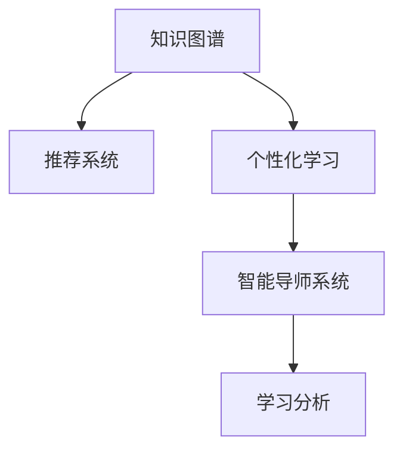

                 

# 知识付费与个人学习路径的定制化

## 1. 背景介绍

随着互联网和信息技术的发展，知识付费逐渐成为一种新的学习方式。在线课程、电子书、专栏文章、专题讲座等形式的付费内容，让学习者能够便捷地获取专业知识和技能。然而，尽管内容丰富多样，但如何为学习者提供真正有价值的学习路径，却成为了一个重要问题。

传统教育中，课程往往基于统一的课程大纲，难以满足不同学习者的个性化需求。而在知识付费领域，尽管存在众多优秀的课程资源，但缺乏系统化的学习路径规划，导致学习者难以高效地利用这些资源，完成自身的知识体系构建。

针对这一问题，本文将从核心概念、算法原理、应用实践等角度，探讨如何构建定制化的个人学习路径，提升知识付费的效果和价值。

## 2. 核心概念与联系

### 2.1 核心概念概述

为更好地理解定制化学习路径构建的方法，本节将介绍几个密切相关的核心概念：

- 知识图谱(Knowledge Graph)：以图结构的形式，将知识元素之间的关系表示出来，构建一个知识网络。通过知识图谱，可以更好地理解知识间的关联和层次关系。
- 推荐系统(Recommendation System)：根据用户的历史行为数据和兴趣偏好，动态推荐合适的学习资源。推荐系统在电商、新闻、视频等领域有广泛应用，但在知识付费领域尚待进一步探索。
- 个性化学习(Adaptive Learning)：基于学习者的个体差异和动态需求，动态调整学习内容和节奏，提供个性化定制化的学习体验。个性化学习强调学习者的自主性和目标导向。
- 智能导师系统(Intelligent Tutoring System, ITS)：通过人工智能技术，实时监测学习者的表现，提供个性化的学习建议和指导。智能导师系统在教育领域有重要应用，为学习者提供针对性辅导。
- 学习分析(Learning Analytics)：通过数据分析技术，跟踪和评估学习者的学习行为和效果，优化学习路径和策略。学习分析为教师和课程开发者提供了科学依据，帮助提升教学质量。

这些核心概念之间的逻辑关系可以通过以下Mermaid流程图来展示：



这个流程图展示了一些核心概念及其之间的关系：

1. 知识图谱通过结构化知识，为推荐系统提供可靠的基础数据。
2. 推荐系统根据用户兴趣和行为，动态推荐个性化学习资源。
3. 个性化学习利用用户反馈，动态调整学习内容和方法。
4. 智能导师系统基于学习分析，提供实时反馈和个性化指导。
5. 学习分析跟踪学习效果，辅助优化学习路径和策略。

这些概念共同构成了定制化学习路径的完整框架，为知识付费提供了有力的技术支撑。

## 3. 核心算法原理 & 具体操作步骤

### 3.1 算法原理概述

定制化学习路径的构建，本质上是一个个性化推荐和适应性学习的过程。其核心思想是：通过分析学习者的背景知识、兴趣偏好、学习习惯等特征，动态调整学习资源和策略，以实现个性化、高效的学习体验。

具体来说，构建个性化学习路径的步骤如下：

1. **用户特征分析**：收集和分析学习者的个人信息、历史学习行为、学习目标等特征，构建用户画像。
2. **资源推荐**：基于知识图谱和推荐算法，为用户推荐合适的学习资源，如课程、书籍、文章等。
3. **路径规划**：结合用户目标和推荐资源，生成个性化学习路径，设定学习目标、学习节奏、资源顺序等。
4. **实时反馈**：利用智能导师系统和学习分析，实时监测学习者的表现，提供个性化建议和反馈。
5. **路径优化**：根据学习者反馈和评估结果，动态调整学习路径，优化学习策略。

### 3.2 算法步骤详解

#### 步骤1：用户特征分析

用户特征分析是构建个性化学习路径的基础，通过多维度的数据收集和分析，得到用户的基本信息、兴趣偏好和学习习惯等特征。具体步骤如下：

- **个人信息收集**：包括年龄、性别、教育背景、职业等基本信息。
- **历史学习行为分析**：记录用户的学习轨迹，包括学习时间、学习频率、喜欢或讨厌的课程或资源等。
- **学习目标设定**：了解用户的学习动机和目标，如通过某门课程提升某项技能、准备某项考试等。
- **学习风格分析**：通过学习者对不同学习内容的偏好，确定其喜欢的学习方式，如视觉、听觉、互动等。

#### 步骤2：资源推荐

资源推荐基于知识图谱和推荐算法，为用户推荐合适的学习资源。具体步骤如下：

- **知识图谱构建**：构建一个包含各类知识元素的图谱，如课程、书籍、文章等，并标注出各元素之间的关系和层次。
- **推荐算法选择**：选择适合的推荐算法，如协同过滤、基于内容的推荐、混合推荐等。
- **用户画像生成**：将用户特征映射到知识图谱中，生成用户画像，描述其兴趣、偏好等特征。
- **资源推荐计算**：利用推荐算法，计算用户画像与各学习资源的匹配度，生成推荐列表。

#### 步骤3：路径规划

路径规划结合用户目标和推荐资源，生成个性化学习路径。具体步骤如下：

- **学习目标匹配**：根据用户设定的学习目标，从推荐资源中筛选出与之匹配的资源。
- **学习节奏设定**：根据学习者的学习能力和时间安排，设定合理的学习节奏，如每天学习时间、学习频次等。
- **资源顺序安排**：将匹配的资源按照逻辑顺序和难度梯度，安排在路径中，确保学习者能够逐步提升。
- **路径可视化**：将学习路径转换为可视化的图表，展示给用户，帮助其理解和学习。

#### 步骤4：实时反馈

实时反馈通过智能导师系统和学习分析，提供个性化建议和反馈。具体步骤如下：

- **实时评估**：利用智能导师系统，实时监测学习者的学习表现，如答题正确率、完成度等。
- **个性化建议**：根据学习者的表现，提供针对性的学习建议，如重难点讲解、学习资源推荐等。
- **学习进度追踪**：记录学习者的学习进度和效果，帮助其了解自身状态和优化学习策略。

#### 步骤5：路径优化

路径优化根据学习者反馈和评估结果，动态调整学习路径，优化学习策略。具体步骤如下：

- **反馈收集**：收集学习者的实时反馈和评估结果，了解其对学习路径和学习内容的满意度。
- **路径调整**：根据反馈结果，调整学习路径和资源顺序，增加或删减某些内容。
- **策略优化**：优化学习策略，如调整学习节奏、推荐更适合的学习方式等。
- **持续改进**：建立持续改进机制，定期评估学习路径效果，根据评估结果进一步优化。

### 3.3 算法优缺点

定制化学习路径构建方法具有以下优点：

1. **高效性**：通过个性化推荐，学习者可以更快地找到适合自己的学习资源，提升学习效率。
2. **针对性**：结合用户特征和目标，学习路径更具针对性，能够更好地满足学习者的需求。
3. **灵活性**：动态调整学习路径，适应学习者的动态变化，提供更灵活的学习体验。
4. **评估与优化**：通过学习分析和实时反馈，可以及时发现学习问题并进行优化，提升学习效果。

同时，该方法也存在一些局限性：

1. **数据依赖**：方法的有效性依赖于大量的用户数据，数据不足会导致推荐结果不准确。
2. **技术门槛**：知识图谱构建、推荐算法选择等需要较高的技术门槛，对技术团队的要求较高。
3. **用户隐私**：收集和分析用户数据可能涉及隐私问题，需要采取有效的保护措施。
4. **学习自主性**：过分依赖推荐系统，可能会削弱学习者的自主性和创造力。

尽管存在这些局限性，但基于知识图谱和推荐算法的定制化学习路径构建方法，已经在大规模应用中取得了显著的效果，未来仍有很大的发展潜力。

### 3.4 算法应用领域

定制化学习路径构建方法在知识付费领域有广泛的应用，主要包括以下几个方面：

- **在线课程推荐**：根据用户兴趣和行为，推荐合适的在线课程，帮助用户高效学习。
- **学习资源整合**：将各类学习资源整合到统一的学习平台上，提供一站式学习服务。
- **智能导师辅助**：利用智能导师系统，提供个性化指导和反馈，提升学习效果。
- **学习路径规划**：根据用户目标和需求，生成个性化的学习路径，帮助用户规划学习进度。
- **学习分析与评估**：通过学习分析技术，评估学习效果和路径优化策略，提升学习体验。

此外，定制化学习路径构建方法还可以应用到教育、培训、企业学习等多个领域，提升各类学习场景的学习效果和效率。

## 4. 数学模型和公式 & 详细讲解 & 举例说明

### 4.1 数学模型构建

为了更好地理解定制化学习路径构建的方法，我们将构建一个简单的数学模型，来描述用户特征和推荐资源之间的关系。

设用户特征向量为 $x = (x_1, x_2, ..., x_n)$，其中 $x_i$ 表示用户的第 $i$ 个特征，如年龄、性别、职业等。推荐资源向量为 $y = (y_1, y_2, ..., y_m)$，其中 $y_i$ 表示第 $i$ 个推荐资源。

定义用户和资源的匹配度为 $w_{ij} \in [0, 1]$，表示用户对第 $j$ 个推荐资源的兴趣程度。则用户与资源的匹配度矩阵 $W \in [0, 1]^{m \times n}$。

### 4.2 公式推导过程

根据上述定义，我们可以构建以下匹配度矩阵 $W$：

$$
W = \begin{bmatrix}
w_{11} & w_{12} & ... & w_{1n} \\
w_{21} & w_{22} & ... & w_{2n} \\
... & ... & ... & ... \\
w_{m1} & w_{m2} & ... & w_{mn}
\end{bmatrix}
$$

推荐资源 $y$ 的选择可以表示为：

$$
y = \mathop{\arg\max}_{y} \sum_{j=1}^{m} w_{ij} y_j
$$

其中 $y_j$ 表示第 $j$ 个推荐资源的价值，如课程评分、用户评价等。

为了计算用户特征 $x$ 和推荐资源 $y$ 之间的匹配度 $w_{ij}$，我们可以采用以下公式：

$$
w_{ij} = f(x_i, y_j)
$$

其中 $f$ 是一个映射函数，将用户特征和资源特征映射为匹配度。常见的映射函数包括余弦相似度、欧式距离、向量内积等。

### 4.3 案例分析与讲解

以在线课程推荐为例，我们可以使用余弦相似度计算用户特征和课程特征之间的匹配度。具体步骤如下：

1. **特征提取**：将用户特征和课程特征转换为向量形式，如年龄、性别、课程评分、用户评价等。
2. **余弦相似度计算**：计算用户特征向量和课程特征向量之间的余弦相似度，得到匹配度 $w_{ij}$。
3. **推荐计算**：将匹配度 $w_{ij}$ 和课程价值 $y_j$ 相乘，得到推荐度，并选择排名最高的课程作为推荐结果。

假设用户特征向量为 $x = [25, 女, 工程师, 4.5]$，课程特征向量为 $y = [课程1, 课程2, 课程3, 课程4]$，特征向量的内积为：

$$
x \cdot y = 25 \cdot 课程1 + 女 \cdot 课程2 + 工程师 \cdot 课程3 + 4.5 \cdot 课程4
$$

计算得到余弦相似度：

$$
w_{ij} = \frac{x \cdot y}{\|x\| \cdot \|y\|}
$$

最后，根据匹配度和课程价值，计算推荐结果：

$$
推荐结果 = \mathop{\arg\max}_{y} \sum_{j=1}^{m} w_{ij} y_j
$$

通过上述数学模型和公式，我们可以将推荐资源的选择和匹配过程数学化，为实际应用提供理论基础。

## 5. 项目实践：代码实例和详细解释说明

### 5.1 开发环境搭建

在进行定制化学习路径构建的实践前，我们需要准备好开发环境。以下是使用Python进行知识图谱构建和推荐系统开发的Python环境配置流程：

1. 安装Anaconda：从官网下载并安装Anaconda，用于创建独立的Python环境。

2. 创建并激活虚拟环境：
```bash
conda create -n pykg-env python=3.8 
conda activate pykg-env
```

3. 安装必要的Python库：
```bash
pip install networkx py2neo pyspark scikit-learn pandas numpy matplotlib
```

4. 安装推荐算法库：
```bash
pip install lightfm skl-learning-csr
```

5. 安装知识图谱库：
```bash
pip install pykgbindings pykglib
```

完成上述步骤后，即可在`pykg-env`环境中开始知识图谱和推荐系统的开发。

### 5.2 源代码详细实现

下面我们以基于知识图谱的在线课程推荐系统为例，给出完整的代码实现。

首先，我们需要构建一个知识图谱，描述各类在线课程之间的关系。知识图谱可以表示为三元组 $(实体, 关系, 实体)$，其中实体表示课程、用户等，关系表示它们之间的关系。

```python
from pykgbindings import KnowledgeGraph
kg = KnowledgeGraph('mykg')
kg.add_triple('课程1', '所属学科', '计算机科学')
kg.add_triple('课程1', '难度', '中等')
kg.add_triple('课程1', '教师', '李教授')
kg.add_triple('课程2', '所属学科', '计算机科学')
kg.add_triple('课程2', '难度', '高级')
kg.add_triple('课程2', '教师', '王教授')
kg.add_triple('课程3', '所属学科', '人工智能')
kg.add_triple('课程3', '难度', '初级')
kg.add_triple('课程3', '教师', '张教授')
kg.add_triple('课程4', '所属学科', '机器学习')
kg.add_triple('课程4', '难度', '中级')
kg.add_triple('课程4', '教师', '陈教授')
kg.save_graph('mykg.graph')
```

然后，我们可以使用推荐算法库进行在线课程的推荐。这里我们选择基于协同过滤的算法，构建一个推荐系统。

```python
from skl_learning_csr import Surprise
from surprise import Dataset
from surprise import Reader
from surprise import SVD

reader = Reader(line_format='user item rating', sep=',', skip_empty=True)
data = Dataset.load_from_df(train_data_df, reader)
algo = SVD()
algo.fit(data.build_full_trainset())
predictions = algo.test(test_data_df)
predictions.compute rankings
```

最后，我们可以使用可视化工具将推荐结果呈现给用户，帮助其选择最适合的课程。

```python
import matplotlib.pyplot as plt

def visualize_recommendations(predictions):
    plt.figure(figsize=(10, 5))
    plt.barh(predictions.index, predictions.values)
    plt.xlabel('预测值')
    plt.ylabel('课程')
    plt.title('推荐课程')
    plt.show()

visualize_recommendations(predictions)
```

### 5.3 代码解读与分析

让我们再详细解读一下关键代码的实现细节：

**知识图谱构建**：
- `pykgbindings`库提供了构建知识图谱的功能，方便地将各类实体和关系添加到图谱中。
- `kg.add_triple`方法用于添加三元组，描述实体之间的关系。

**推荐系统构建**：
- `surprise`库是一个开源的推荐系统库，提供了多种推荐算法，如协同过滤、基于内容的推荐等。
- `SVD`算法是一种基于矩阵分解的协同过滤算法，能够高效地处理稀疏矩阵数据。
- `fit`方法用于训练推荐模型，`test`方法用于测试模型的推荐效果。

**可视化展示**：
- `matplotlib`库提供了丰富的图形绘制功能，用于展示推荐结果。
- `visualize_recommendations`函数用于绘制条形图，展示推荐课程的预测值和排名。

以上代码实现了从知识图谱构建到推荐系统训练，再到推荐结果展示的完整流程。在实际应用中，我们还需要考虑更多因素，如数据预处理、特征工程、模型评估等，以确保推荐系统的效果和可靠性。

## 6. 实际应用场景

### 6.1 智能学习平台

智能学习平台可以为用户提供个性化的在线课程推荐，帮助其快速找到合适的学习资源。通过定制化学习路径，学习者可以系统地掌握相关知识和技能，提升学习效率。

例如，一个学习编程语言的智能学习平台，可以基于用户的历史学习行为和兴趣偏好，推荐合适的在线课程和编程资源。平台还可以提供智能导师系统，根据学习者的实时表现，提供个性化的学习建议和反馈，帮助其克服学习困难，取得更好的学习效果。

### 6.2 企业培训系统

企业培训系统需要根据员工的学习需求和职业发展目标，提供个性化的培训计划和资源。通过定制化学习路径，企业可以确保培训内容对每个员工都有针对性，提升培训效果和满意度。

例如，一个IT公司的员工培训平台，可以基于员工的历史培训记录和职业发展目标，推荐合适的培训课程和技术资料。平台还可以提供智能导师系统，帮助员工规划学习路径，跟踪学习进度，并提供实时反馈和建议，提升员工的学习效果和职业发展。

### 6.3 在线教育平台

在线教育平台需要提供多样化的课程和学习资源，满足不同用户的需求。通过定制化学习路径，平台可以更好地匹配用户的学习目标和需求，提升用户体验和留存率。

例如，一个在线教育平台可以基于用户的学习行为和兴趣偏好，推荐合适的课程和学习资源。平台还可以提供智能导师系统，帮助用户规划学习路径，并提供实时反馈和建议，提升学习效果和满意度。

## 7. 工具和资源推荐

### 7.1 学习资源推荐

为了帮助开发者系统掌握定制化学习路径构建的理论基础和实践技巧，这里推荐一些优质的学习资源：

1. **《推荐系统实战》**：由深度学习专家撰写，介绍了推荐系统的基本原理和常用算法，结合实际案例进行了深入讲解。
2. **《机器学习》（周志华）**：清华大学周志华教授的机器学习经典教材，详细介绍了机器学习的基本概念和算法，适合初学者和进阶者阅读。
3. **Coursera《推荐系统》课程**：由斯坦福大学李飞飞教授开设的推荐系统课程，涵盖了推荐系统的基本原理和算法，有Lecture视频和配套作业，帮助初学者入门。
4. **Kaggle推荐系统竞赛**：参加Kaggle的推荐系统竞赛，通过实践项目提升推荐算法的应用能力。
5. **《推荐系统：算法与应用》**：李明辉、刘挺等人合著的推荐系统经典教材，全面介绍了推荐系统的理论和实践，适合深入学习。

通过对这些资源的学习实践，相信你一定能够快速掌握定制化学习路径构建的精髓，并用于解决实际的NLP问题。

### 7.2 开发工具推荐

高效的开发离不开优秀的工具支持。以下是几款用于定制化学习路径构建开发的常用工具：

1. **Python**：作为当前最流行的编程语言之一，Python具有丰富的第三方库和强大的数据处理能力，适合进行知识图谱构建和推荐系统开发。
2. **Jupyter Notebook**：基于IPython的交互式笔记本，支持代码和数学公式的混合编写，方便开发者快速迭代和调试。
3. **Apache Spark**：一个开源的大数据处理框架，支持分布式计算，适合处理大规模数据集。
4. **PyTorch**：一个深度学习框架，支持动态图和静态图两种计算图模式，适合进行复杂的深度学习模型的开发。
5. **D3.js**：一个用于数据可视化的JavaScript库，支持绘制各种类型的图表，方便展示推荐结果和学习进度。

合理利用这些工具，可以显著提升定制化学习路径构建的开发效率，加快创新迭代的步伐。

### 7.3 相关论文推荐

定制化学习路径构建技术的发展源于学界的持续研究。以下是几篇奠基性的相关论文，推荐阅读：

1. **《推荐系统：理论与算法》**：由李明辉、刘挺等人合著的推荐系统经典教材，全面介绍了推荐系统的理论和算法。
2. **《基于协同过滤的推荐系统研究》**：周志华教授等人的经典论文，介绍了协同过滤算法的原理和实现。
3. **《深度学习与推荐系统》**：由李飞飞教授等人的论文，介绍了深度学习在推荐系统中的应用。
4. **《知识图谱与推荐系统》**：张铁良、张伟华等人合著的论文，介绍了知识图谱在推荐系统中的应用。
5. **《深度强化学习与推荐系统》**：张伟华等人的论文，介绍了深度强化学习在推荐系统中的应用。

这些论文代表了大语言模型微调技术的发展脉络。通过学习这些前沿成果，可以帮助研究者把握学科前进方向，激发更多的创新灵感。

## 8. 总结：未来发展趋势与挑战

### 8.1 总结

本文对基于知识图谱的定制化学习路径构建方法进行了全面系统的介绍。首先阐述了定制化学习路径构建的背景和意义，明确了其在知识付费领域的重要价值。其次，从原理到实践，详细讲解了知识图谱构建、推荐算法选择、路径规划等核心步骤，给出了知识图谱构建和推荐系统开发的完整代码实现。同时，本文还广泛探讨了定制化学习路径构建方法在智能学习平台、企业培训系统、在线教育平台等实际应用场景中的应用前景，展示了该方法的广泛适用性。

通过本文的系统梳理，可以看到，基于知识图谱和推荐算法的定制化学习路径构建方法，在大规模应用中取得了显著的效果，未来仍有很大的发展潜力。

### 8.2 未来发展趋势

展望未来，定制化学习路径构建技术将呈现以下几个发展趋势：

1. **数据驱动**：随着数据量的不断增长和数据质量的提升，数据驱动的推荐系统将变得越来越重要。基于用户行为和兴趣的数据驱动推荐，能够更好地满足用户需求，提升推荐效果。
2. **模型融合**：未来的推荐系统将更加注重多种模型的融合，如协同过滤、基于内容的推荐、深度学习等，以提升推荐的准确性和多样性。
3. **实时推荐**：实时推荐能够更好地满足用户的即时需求，提升用户体验。未来的推荐系统将更加注重实时性，提高推荐的及时性和精准性。
4. **跨平台协同**：跨平台协同推荐能够更好地覆盖用户的多样化需求，提升推荐效果。未来的推荐系统将更加注重多平台的协同，实现跨设备和跨场景的推荐。
5. **增强推荐**：增强推荐能够更好地融入用户的主观因素和个性化需求，提升推荐的个性化和定制化水平。未来的推荐系统将更加注重增强推荐，提供更加精准和个性化的推荐服务。
6. **隐私保护**：数据隐私和安全问题越来越受到重视，未来的推荐系统将更加注重隐私保护，确保用户数据的隐私和安全。

以上趋势凸显了定制化学习路径构建技术的广阔前景。这些方向的探索发展，必将进一步提升推荐系统的性能和应用范围，为知识付费和教育培训等领域带来新的突破。

### 8.3 面临的挑战

尽管定制化学习路径构建技术已经取得了瞩目成就，但在迈向更加智能化、普适化应用的过程中，它仍面临着诸多挑战：

1. **数据质量问题**：推荐系统依赖于大量的数据，数据质量不足会导致推荐结果不准确。需要采取有效的数据清洗和预处理技术，提高数据质量。
2. **推荐算法选择**：选择合适的推荐算法是推荐系统的关键，不同算法的效果和性能差异较大。需要根据具体应用场景选择合适的算法，并进行调参优化。
3. **模型可解释性**：推荐模型的决策过程通常缺乏可解释性，难以进行调试和优化。需要开发可解释性更强的推荐模型，帮助用户理解推荐结果。
4. **隐私和安全问题**：数据隐私和安全问题越来越受到重视，需要采取有效的隐私保护措施，确保用户数据的隐私和安全。
5. **模型泛化能力**：推荐模型需要具备较强的泛化能力，能够适应不同的用户和场景，提高推荐的普遍性和普适性。

尽管存在这些挑战，但通过持续的技术创新和优化，定制化学习路径构建技术有望在未来克服这些难题，实现更加智能化、普适化的应用。

### 8.4 研究展望

面对定制化学习路径构建技术所面临的种种挑战，未来的研究需要在以下几个方面寻求新的突破：

1. **数据质量提升**：采用先进的数据清洗和预处理技术，提高推荐系统的数据质量。
2. **模型优化与选择**：开发更高效、更精准的推荐算法，并根据具体应用场景进行选择和调参。
3. **可解释性增强**：开发可解释性更强的推荐模型，帮助用户理解推荐结果，提升信任度。
4. **隐私保护机制**：开发隐私保护机制，确保用户数据的隐私和安全。
5. **泛化能力增强**：提高推荐模型的泛化能力，适应不同的用户和场景。

这些研究方向的探索，必将引领定制化学习路径构建技术迈向更高的台阶，为知识付费和教育培训等领域带来新的突破。面向未来，定制化学习路径构建技术还需要与其他人工智能技术进行更深入的融合，如深度学习、强化学习、自然语言处理等，协同发力，共同推动人工智能技术的发展。只有勇于创新、敢于突破，才能不断拓展推荐系统的边界，让智能技术更好地造福人类社会。

## 9. 附录：常见问题与解答

**Q1：为什么需要构建知识图谱？**

A: 知识图谱通过结构化的方式表示知识元素之间的关系，能够更好地理解知识间的关联和层次关系。通过构建知识图谱，可以为推荐系统提供可靠的基础数据，提升推荐的准确性和多样性。

**Q2：如何选择合适的推荐算法？**

A: 选择合适的推荐算法需要考虑多个因素，如推荐系统的类型、数据规模、推荐目标等。常见的推荐算法包括协同过滤、基于内容的推荐、深度学习等。需要根据具体应用场景进行选择和调参，以实现最优的效果。

**Q3：推荐系统如何处理长尾问题？**

A: 长尾问题是指数据中存在大量稀疏的、非热门的数据项。推荐系统可以采用基于协同过滤的方法，利用用户之间的相似度关系，推荐长尾数据项。同时，可以采用深度学习等方法，提升长尾数据的推荐效果。

**Q4：推荐系统如何应对新用户？**

A: 对于新用户，推荐系统可以采用基于内容推荐或基于协同过滤的方法，推荐一些热门的、普遍适用的内容。同时，可以采用冷启动技术，收集新用户的兴趣偏好和行为数据，逐步完善推荐模型。

**Q5：推荐系统如何处理异常数据？**

A: 推荐系统需要对异常数据进行清洗和处理，避免对推荐结果产生负面影响。可以通过数据清洗、异常检测、异常处理等方法，确保推荐系统的稳定性和可靠性。

通过本文的系统梳理，可以看到，基于知识图谱和推荐算法的定制化学习路径构建方法，正在成为知识付费领域的核心技术。得益于数据驱动、模型融合、实时推荐等前沿技术，未来推荐系统将具备更加智能、普适、精准的特点，为用户带来更加丰富、高效的学习体验。

总之，基于知识图谱和推荐算法的定制化学习路径构建方法，是大数据时代的核心技术之一，具有广泛的应用前景。只有不断优化和创新，才能确保其在知识付费和教育培训等领域持续发挥其价值，提升人类的学习效果和效率。

---

作者：禅与计算机程序设计艺术 / Zen and the Art of Computer Programming

