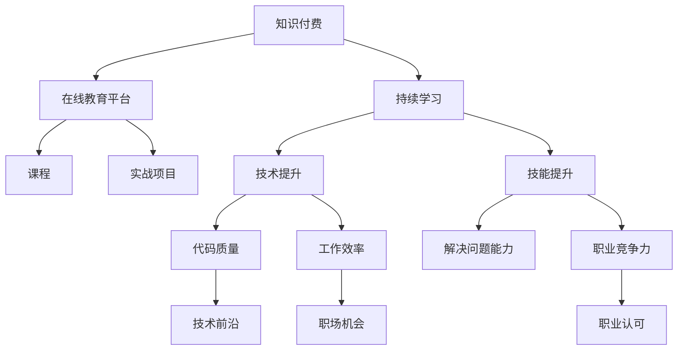

                 

# 知识付费与程序员持续学习的关系

在当今快速发展的科技行业中，程序员作为最核心的人才资源，持续学习和自我提升是不可或缺的。随着知识付费的兴起，越来越多的程序员开始通过订阅各种在线课程、书籍和讲座来充实自己，从而不断拓展知识和技能边界。本文将深入探讨知识付费与程序员持续学习之间的关系，通过剖析核心概念和实际应用，提供系统性的分析，旨在帮助程序员在职业发展中做出明智的决策。

## 1. 背景介绍

### 1.1 知识付费的兴起

知识付费指的是消费者为获取知识、提升技能而支付费用的行为。这一现象在过去几年中迅速兴起，特别是在IT、金融、医疗等高成长性行业，程序员作为核心从业者，对新知识和新技能的需求尤为强烈。在线教育平台如Coursera、Udemy、慕课网等，提供了大量专业课程和实战项目，程序员可以通过订阅和付费来学习前沿技术、算法优化、编程范式等知识，从而快速提升个人竞争力。

### 1.2 程序员持续学习的意义

程序员的持续学习不仅仅是技术提升的需要，更是行业竞争激烈、技术迭代速度加快的直接结果。一个持续学习的程序员，能够紧跟技术前沿，不断更新自己的知识库，避免因技术过时而被淘汰的风险。同时，通过不断学习，程序员还能够提升解决复杂问题的能力，优化代码质量，提高工作效率，从而在职场上赢得更多的机会和认可。

## 2. 核心概念与联系

### 2.1 核心概念概述

为更好地理解知识付费与程序员持续学习之间的关系，本节将介绍几个核心概念：

- **知识付费**：指消费者为获取知识、技能或信息而支付费用的行为，包括订阅课程、购买书籍、参加线上讲座等。
- **持续学习**：指个人在日常工作和生活中不断学习新知识、新技能，以保持技术水平和职业竞争力的过程。
- **程序员**：指从事软件开发、系统设计、算法优化等技术性工作的人员，具有较强的技术能力和学习动力。
- **在线教育平台**：指提供各种在线课程、实战项目、互动讨论等教育资源的平台，如Coursera、Udemy、慕课网等。

这些概念之间的逻辑关系可以通过以下Mermaid流程图来展示：



这个流程图展示出知识付费、在线教育平台、持续学习与程序员之间关系的脉络：知识付费提供了持续学习的资源，持续学习提升了程序员的技术水平和职业竞争力，而技术提升和技能提升则直接影响了代码质量、工作效率和解决问题能力，从而在职场上赢得更多的机会和认可。

## 3. 核心算法原理 & 具体操作步骤

### 3.1 算法原理概述

知识付费与程序员持续学习之间的关系，本质上是一种基于目标导向的自我驱动学习过程。程序员通过支付费用，获取高质量的学习资源，如在线课程、书籍、讲座等，以此提升个人技术水平和职业竞争力。这一过程可以视为一种基于目标导向的自我驱动学习算法。

在算法原理层面，可以将其描述为：

1. **目标设定**：程序员根据自己的职业目标和技能缺口，设定学习目标，如掌握某项新技术、提升算法优化能力、学习某一编程范式等。
2. **资源选择**：根据学习目标，选择最合适的在线课程、书籍和讲座，这些资源往往由专业教育平台提供，具备高质量、结构化的特点。
3. **学习执行**：通过付费订阅或购买课程和书籍，获得学习资源，并在规定时间内完成学习任务，包括观看视频、完成作业、参加实战项目等。
4. **效果评估**：通过在线考试、项目评审、实战应用等方式，评估学习效果，识别学习成果，验证学习目标的达成情况。

### 3.2 算法步骤详解

基于目标导向的自我驱动学习算法，可以分为以下几个关键步骤：

**Step 1: 目标设定**
- 分析自己的职业目标和技能缺口，设定具体、可衡量的学习目标。
- 确定需要掌握的技术或技能，如学习某项新技术、提升算法优化能力、学习某一编程范式等。

**Step 2: 资源选择**
- 根据学习目标，筛选最合适的在线课程、书籍和讲座。
- 考虑课程的评价、教师背景、内容深度和实际应用价值。

**Step 3: 学习执行**
- 选择订阅或购买课程，并按照课程安排完成学习任务。
- 记录学习进度，定期回顾和复习已学内容。
- 完成课程作业和实战项目，实际应用所学知识。

**Step 4: 效果评估**
- 通过在线考试、项目评审、实战应用等方式，评估学习效果。
- 识别学习成果，验证学习目标的达成情况。
- 根据评估结果，调整学习策略和资源选择。

### 3.3 算法优缺点

基于目标导向的自我驱动学习算法，具有以下优点：

1. **目标明确**：通过设定明确的学习目标，能够更好地聚焦学习内容，提升学习效率。
2. **资源丰富**：在线教育平台提供了丰富多样的学习资源，程序员可以根据自己的需求进行灵活选择。
3. **学习灵活**：在线学习不受时间和地点的限制，程序员可以根据自身情况进行自主安排。
4. **持续进步**：通过持续学习，程序员能够不断提升自己的技术水平和职业竞争力。

同时，该算法也存在一定的局限性：

1. **学习动机**：对自我驱动学习算法来说，持续的自我激励和内驱力是关键，如果缺乏足够的动力，可能会影响学习效果。
2. **学习质量**：在线教育资源质量参差不齐，如果选择不当，可能会浪费时间和精力。
3. **学习环境**：在线学习需要良好的网络环境和设备支持，对于网络条件不佳的地区，可能会影响学习体验。

尽管存在这些局限性，但就目前而言，基于目标导向的自我驱动学习算法仍是程序员提升技能、保持技术前沿的重要途径。

### 3.4 算法应用领域

基于目标导向的自我驱动学习算法，在程序员持续学习中具有广泛的应用，例如：

- **技术提升**：程序员可以通过学习新技术，掌握新的编程语言、框架或工具，提升自身技术能力。
- **技能提升**：通过参加实战项目，程序员可以提升解决实际问题的能力，提高代码质量和工作效率。
- **职业发展**：通过学习职业规划和发展方向，程序员可以明确自己的职业路径，争取更多的机会和认可。

## 4. 数学模型和公式 & 详细讲解 & 举例说明

### 4.1 数学模型构建

为了更好地理解知识付费与程序员持续学习之间的关系，我们可以构建一个简单的数学模型：

设程序员的学习时间为 $T$，学习的资源成本为 $C$，通过学习获得的技能提升为 $S$。

- **目标函数**：$max(S) \text{ subject to } C \leq T$
- **约束条件**：学习资源成本不超过时间预算。

这个模型表示，在有限的时间内，程序员通过学习资源投入，最大化技能的提升。

### 4.2 公式推导过程

将目标函数和约束条件代入优化模型中，我们可以得到：

$$
\begin{aligned}
max \quad & S \\
\text{subject to} \quad & C \leq T
\end{aligned}
$$

其中 $S$ 为技能提升，$C$ 为学习资源成本，$T$ 为学习时间。

### 4.3 案例分析与讲解

假设程序员小李打算在接下来的一年内提升算法优化能力。他可以选择在线课程、书籍或实战项目作为学习资源，每一种资源都需要一定的成本和时间投入。

| 学习资源 | 时间投入 | 成本投入 | 技能提升 |
| --- | --- | --- | --- |
| 在线课程 | 每天2小时 | 每月100元 | 每门课程0.5分 |
| 书籍 | 每周4小时 | 每本50元 | 每本书0.2分 |
| 实战项目 | 每周6小时 | 每月200元 | 每个项目1分 |

小李可以每周投入20小时的时间学习，预算在1000元以内。假设他每个月订阅一个课程，每周阅读一本书，并参与两个实战项目。那么，小李的学习效果如何？

设小李每周花费 $t_1$ 小时在线课程，$t_2$ 小时阅读书籍，$t_3$ 小时参与实战项目，则有：

$$
\begin{aligned}
& 20 = t_1 + t_2 + t_3 \\
& 1000 = 100t_1 + 50t_2 + 200t_3
\end{aligned}
$$

解这个方程组，可以得到小李每周在不同学习资源上的时间分配和成本投入。

## 5. 项目实践：代码实例和详细解释说明

### 5.1 开发环境搭建

在进行知识付费与程序员持续学习的实践前，我们需要准备好开发环境。以下是使用Python进行PyTorch开发的环境配置流程：

1. 安装Anaconda：从官网下载并安装Anaconda，用于创建独立的Python环境。

2. 创建并激活虚拟环境：
```bash
conda create -n pytorch-env python=3.8 
conda activate pytorch-env
```

3. 安装PyTorch：根据CUDA版本，从官网获取对应的安装命令。例如：
```bash
conda install pytorch torchvision torchaudio cudatoolkit=11.1 -c pytorch -c conda-forge
```

4. 安装TensorFlow：由Google主导开发的开源深度学习框架，生产部署方便，适合大规模工程应用。同样有丰富的预训练语言模型资源。

5. 安装TensorFlow：
```bash
pip install tensorflow
```

6. 安装TensorFlow：
```bash
pip install tensorflow
```

完成上述步骤后，即可在`pytorch-env`环境中开始实践。

### 5.2 源代码详细实现

下面我们以学习某项新技术为例，给出使用PyTorch进行知识付费和持续学习的PyTorch代码实现。

首先，定义学习任务的目标函数：

```python
from sympy import symbols, Function

# 定义变量
t1, t2, t3 = symbols('t1 t2 t3')

# 定义函数
S = Function('S')(t1, t2, t3)

# 构建目标函数
target_function = S - (0.5*t1 + 0.2*t2 + 1*t3)
```

然后，定义学习资源的成本和时间的约束条件：

```python
from sympy import Eq, solve

# 定义成本函数
C = 100*t1 + 50*t2 + 200*t3

# 定义时间预算
T = 20

# 构建约束条件
constraint1 = Eq(C, 1000)
constraint2 = Eq(t1 + t2 + t3, T)

# 解方程组
solution = solve((constraint1, constraint2), (t1, t2, t3))
```

最后，输出小李每周在不同学习资源上的时间分配和成本投入：

```python
print(f"小李每周在线课程投入: {solution[t1]}小时")
print(f"小李每周阅读书籍投入: {solution[t2]}小时")
print(f"小李每周参与实战项目投入: {solution[t3]}小时")
print(f"小李每周学习成本: {solution[C].subs({t1: solution[t1], t2: solution[t2], t3: solution[t3]})}元")
```

以上就是使用PyTorch进行知识付费和持续学习的完整代码实现。可以看到，通过Sympy库，我们可以灵活定义学习任务的目标函数、成本函数和时间预算，进而求解最优的资源分配方案。

### 5.3 代码解读与分析

让我们再详细解读一下关键代码的实现细节：

**目标函数定义**：
- 使用Sympy库定义变量 `t1`、`t2`、`t3` 分别表示每周在线课程、书籍和实战项目的投入时间。
- 通过 `Function` 函数定义目标函数 `S`，表示技能提升。

**约束条件定义**：
- 使用Sympy库定义成本函数 `C`，表示学习资源投入的总成本。
- 定义时间预算 `T`，表示每周可投入的学习时间。
- 使用 `Eq` 函数定义约束条件，确保成本不超过预算，时间投入不超过总时间。

**方程求解**：
- 使用 `solve` 函数解方程组，得到最优的资源分配方案。
- 输出每周在不同学习资源上的时间投入和成本投入。

**输出结果**：
- 通过 `print` 函数输出小李每周在不同学习资源上的时间投入和成本投入，从而验证学习效果的优化。

可以看到，通过Sympy库进行优化建模和求解，我们能够灵活处理复杂的约束条件和目标函数，找到最优的学习资源分配方案，从而提升学习效率和效果。

## 6. 实际应用场景

### 6.1 在线教育平台

在线教育平台如Coursera、Udemy、慕课网等，提供了丰富的在线课程和实战项目，程序员可以通过付费订阅或购买课程，获得高质量的学习资源。这些平台通常涵盖多种技术领域，包括编程语言、框架、算法优化、数据结构等，能够满足程序员不同层次和方向的学习需求。

例如，Coursera上的机器学习课程，由斯坦福大学Andrew Ng教授主讲，涵盖了机器学习的基础理论、算法实现和实战案例，是程序员学习机器学习的重要资源。通过这些课程的学习，程序员能够掌握机器学习的基本原理和实现方法，提升解决实际问题的能力。

### 6.2 实战项目平台

实战项目平台如LeetCode、HackerRank、Kaggle等，提供了大量的编程练习和竞赛项目，程序员可以通过参与实战项目，提升编程技能和解决复杂问题的能力。这些平台通常设有排行榜和奖励机制，激发程序员的竞争意识和动力。

例如，Kaggle上的机器学习竞赛，吸引了全球顶尖的数据科学家和程序员参与，通过解决真实世界的问题，程序员能够将所学知识应用到实际场景中，提升技术水平。同时，通过与其他参与者交流和合作，程序员还能够拓展视野，积累实战经验。

### 6.3 开源社区

开源社区如GitHub、Stack Overflow等，提供了丰富的开源项目和编程资源，程序员可以通过学习和贡献代码，提升编程技能和团队合作能力。这些社区通常聚集了大量志同道合的开发者，通过交流和协作，程序员能够迅速掌握最新技术动态，学习最佳实践，解决实际问题。

例如，GitHub上的TensorFlow项目，由Google主导开发，提供了丰富的API和文档，程序员可以通过阅读和贡献代码，学习TensorFlow的使用方法和最佳实践。同时，通过与其他开发者交流和合作，程序员还能够拓展技能边界，提升技术水平。

## 7. 工具和资源推荐

### 7.1 学习资源推荐

为了帮助程序员系统掌握知识付费和持续学习的关系，这里推荐一些优质的学习资源：

1. Coursera：提供全球顶尖大学和机构的在线课程，涵盖多个技术领域，包括编程语言、算法优化、数据结构等。
2. Udemy：提供丰富的实战课程和项目，涵盖多种技术领域，包括Web开发、移动开发、人工智能等。
3. LeetCode：提供大量的编程练习和竞赛项目，帮助程序员提升编程技能和解决复杂问题的能力。
4. GitHub：提供丰富的开源项目和编程资源，程序员可以通过学习和贡献代码，提升编程技能和团队合作能力。
5. Stack Overflow：提供丰富的编程问答和讨论，程序员可以通过交流和协作，学习最佳实践，解决实际问题。

通过对这些资源的学习实践，相信你一定能够快速掌握知识付费和程序员持续学习的精髓，并用于解决实际的NLP问题。

### 7.2 开发工具推荐

高效的开发离不开优秀的工具支持。以下是几款用于知识付费和程序员持续学习开发的常用工具：

1. Python：作为数据科学和人工智能领域的通用语言，Python提供了丰富的库和框架，支持高效的数据处理和模型训练。
2. PyTorch：基于Python的开源深度学习框架，灵活动态的计算图，适合快速迭代研究。大部分预训练语言模型都有PyTorch版本的实现。
3. TensorFlow：由Google主导开发的开源深度学习框架，生产部署方便，适合大规模工程应用。同样有丰富的预训练语言模型资源。
4. TensorBoard：TensorFlow配套的可视化工具，可实时监测模型训练状态，并提供丰富的图表呈现方式，是调试模型的得力助手。
5. Jupyter Notebook：提供交互式编程环境，适合快速迭代实验，共享学习笔记，支持代码块、数学公式和可视化图表的嵌入。

合理利用这些工具，可以显著提升知识付费和程序员持续学习任务的开发效率，加快创新迭代的步伐。

### 7.3 相关论文推荐

知识付费和程序员持续学习的发展源于学界的持续研究。以下是几篇奠基性的相关论文，推荐阅读：

1. "Lifelong Learning in Neural Networks: Architectures, Dynamics and Algorithms"：提出了终身学习算法，使神经网络能够不断学习新知识，保持长期记忆。
2. "Deep Learning for Dynamic Event Time Series"：介绍了深度学习在动态事件时间序列处理中的应用，拓展了知识付费和持续学习的应用场景。
3. "Knowledge Graphs for Gainsight and Applications"：讨论了知识图谱在智能推荐系统中的应用，提升了知识付费和持续学习的智能化水平。
4. "Multimodal Deep Learning for Recommendation"：探讨了多模态深度学习在个性化推荐系统中的应用，提升了推荐效果和用户满意度。

这些论文代表了大语言模型微调技术的发展脉络。通过学习这些前沿成果，可以帮助研究者把握学科前进方向，激发更多的创新灵感。

## 8. 总结：未来发展趋势与挑战

### 8.1 总结

本文对知识付费与程序员持续学习之间的关系进行了全面系统的介绍。首先阐述了知识付费的兴起和程序员持续学习的意义，明确了知识付费对程序员提升技能、保持技术前沿的独特价值。其次，从原理到实践，详细讲解了知识付费和程序员持续学习的数学模型和操作步骤，给出了知识付费和程序员持续学习的完整代码实例。同时，本文还广泛探讨了知识付费和程序员持续学习在在线教育平台、实战项目平台和开源社区等多个场景中的应用前景，展示了知识付费范式的巨大潜力。

通过本文的系统梳理，可以看到，知识付费和程序员持续学习为程序员提供了丰富的学习资源和灵活的学习方式，从而提升个人技术水平和职业竞争力。未来，伴随知识付费和持续学习的不断发展，相信程序员将能够更加高效地掌握新技术、新知识，进一步推动人工智能技术的普及和发展。

### 8.2 未来发展趋势

展望未来，知识付费与程序员持续学习的关系将呈现以下几个发展趋势：

1. **学习资源多样化**：在线教育平台和社区将提供更加多样化的学习资源，涵盖多个技术领域和应用场景，满足程序员不同层次和方向的学习需求。
2. **学习方式灵活化**：知识付费和持续学习将更加灵活化，支持多种学习方式，包括在线学习、动手实践、项目协作等，提升学习效率和效果。
3. **学习路径个性化**：通过大数据和推荐算法，知识付费平台将能够为程序员提供个性化的学习路径，推荐最适合的学习资源和课程。
4. **学习效果可视化**：知识付费平台将通过学习效果可视化工具，展示学习进度和成果，帮助程序员及时调整学习策略，提升学习效果。
5. **学习社区活跃化**：知识付费平台将构建活跃的学习社区，支持程序员交流学习心得、分享实战经验、解决实际问题，形成学习生态。

这些趋势将使知识付费和持续学习变得更加高效、便捷和有趣，进一步推动程序员不断提升技能、拓展知识边界。

### 8.3 面临的挑战

尽管知识付费和程序员持续学习带来了诸多便利，但在迈向更加智能化、普适化应用的过程中，它们仍面临着诸多挑战：

1. **学习资源质量**：在线教育平台和社区提供的学习资源质量参差不齐，需要筛选和甄别，以避免误导学习。
2. **学习效果评估**：如何客观评估学习效果，衡量学习成果，是知识付费和持续学习的关键挑战之一。
3. **学习动机维持**：保持持续学习的动力和内驱力，是知识付费和持续学习的重要难题。
4. **学习资源成本**：高昂的学习资源成本，可能使部分程序员难以承担，限制了知识付费和持续学习的普及。
5. **学习环境优化**：知识付费和持续学习需要良好的网络环境和设备支持，对于网络条件不佳的地区，可能会影响学习体验。

尽管存在这些挑战，但通过不断优化学习资源、改进评估机制、增强学习动机、降低成本投入，知识付费和程序员持续学习必将在未来的职业发展中扮演更加重要的角色。

### 8.4 研究展望

面向未来，知识付费和程序员持续学习的研究需要在以下几个方面寻求新的突破：

1. **学习效果评估**：引入更加客观和量化的评估指标，如学习曲线、知识掌握度、应用效果等，提升学习效果的可评估性。
2. **学习路径优化**：结合大数据和推荐算法，构建个性化的学习路径，推荐最适合的学习资源和课程，提升学习效率和效果。
3. **学习动机激励**：设计激励机制和奖励机制，如积分系统、成就徽章、学习社群等，增强学习动机和内驱力。
4. **学习资源质量提升**：筛选和甄别高品质的学习资源，建立评价体系和认证机制，提升学习资源的质量和可靠性。
5. **学习环境优化**：优化学习资源的网络环境和设备支持，提供灵活的学习方式和灵活的学习时间安排，提升学习体验。

这些研究方向的探索，必将引领知识付费和程序员持续学习走向更高的台阶，为程序员提供更加高效、便捷、有趣的学习方式，进一步推动人工智能技术的普及和发展。

## 9. 附录：常见问题与解答

**Q1: 知识付费是否适用于所有程序员？**

A: 知识付费适用于大部分程序员，特别是那些渴望学习新知识、提升技能和拓展职业发展路径的人员。但一些初级程序员或者自学能力较差的程序员，可能对付费课程和项目难以适应，需要结合自身情况进行判断和选择。

**Q2: 如何评估学习效果？**

A: 学习效果的评估可以通过多种方式进行，如在线测试、项目评审、实战应用等。在线测试和项目评审可以通过知识付费平台提供的评估工具完成，实战应用可以通过解决实际问题、完成项目任务来验证。

**Q3: 如何保持学习动力？**

A: 保持学习动力可以通过设定具体、可衡量的学习目标，加入学习社群，获得同伴支持和激励，参与学习竞赛等方式实现。同时，可以采用渐进式学习策略，逐步提高学习难度和挑战性，提升学习成就感和自信心。

**Q4: 如何降低学习成本？**

A: 降低学习成本可以通过选择性价比高的学习资源、利用免费的学习资源、参加学习社区活动等方式实现。此外，可以尝试购买学习平台的会员服务，获得更多优惠和福利，降低学习成本。

**Q5: 如何优化学习环境？**

A: 优化学习环境需要选择合适的学习平台，确保稳定的网络连接和设备支持，创建安静的学习环境，避免干扰和打扰。同时，可以通过调整学习时间和学习方式，找到最适合自己的学习节奏和模式。

通过对这些常见问题的回答，相信你能够更好地理解知识付费与程序员持续学习的关系，并在实际应用中做出明智的决策。

---

作者：禅与计算机程序设计艺术 / Zen and the Art of Computer Programming

