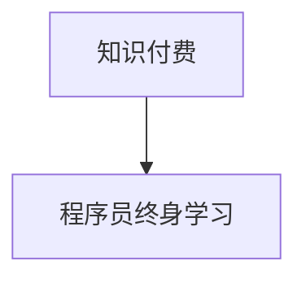

                 

# 知识付费与程序员终身学习的关系

## 1. 背景介绍

在当今这个快速发展的数字化时代，技术日新月异，新工具、新框架、新语言层出不穷。作为软件开发领域的核心力量，程序员必须时刻保持学习和适应能力，才能跟上技术变革的步伐。然而，如何在繁杂的信息中筛选出真正有价值的内容，成为每位程序员的难题。知识付费，正是在这样的背景下诞生的一种新型学习方式。

知识付费，即通过付费订阅、购买课程等方式，获取有深度、系统化的技术知识，是信息技术日益重要的趋势之一。特别地，针对程序员的学习，知识付费项目如雨后春笋般涌现，逐渐成为程序员获取最新技术资讯和深化知识技能的重要途径。本文将从核心概念、原理和实践出发，探讨知识付费与程序员终身学习之间的关系，为行业人士提供参考。

## 2. 核心概念与联系

### 2.1 核心概念概述

- **知识付费**：通过付费的方式，获取高质量、系统化、前沿的知识内容，以提升个人能力和职业发展。

- **程序员终身学习**：程序员为了适应技术变化，持续学习新知识、新技能，不断提升个人竞争力。

- **知识付费与终身学习**：知识付费为程序员提供了一种高效、系统化的终身学习方式，使其能够在有限的精力下，获取最有价值的知识。

- **核心概念联系**：知识付费与程序员终身学习相辅相成。终身学习需要高质量的内容，知识付费则提供了这种内容，同时终身学习的需求也推动了知识付费市场的发展。

### 2.2 核心概念原理和架构的 Mermaid 流程图



此图简洁明了地展示了知识付费与程序员终身学习之间的联系：知识付费是程序员终身学习的一种重要手段和方式，是连接知识源和实践者的桥梁。

## 3. 核心算法原理 & 具体操作步骤

### 3.1 算法原理概述

知识付费平台通过算法推荐系统，对用户的学习行为和偏好进行分析，向其推荐适合的内容。推荐系统通过用户互动数据，如学习时长、点击量、评分等，计算不同内容的相关性和吸引力。推荐算法的核心目标是用更少的资源向用户推荐更高质量、更相关的知识，从而提高用户的学习效率和满意度。

### 3.2 算法步骤详解

1. **数据收集与预处理**：
    - 收集用户的学习行为数据，如浏览、点击、学习时长、评分等。
    - 对数据进行预处理，如去除异常值、标准化等。

2. **特征工程**：
    - 提取与学习行为相关的特征，如课程主题、难度、用户评分等。
    - 构建特征向量，用于模型训练。

3. **模型训练**：
    - 选择合适的推荐算法，如协同过滤、基于内容的推荐、混合推荐等。
    - 使用历史学习数据训练模型，调整模型参数。

4. **推荐实践**：
    - 将新课程放入推荐系统中，由模型计算预测用户对课程的兴趣。
    - 根据预测结果，向用户推荐课程。

### 3.3 算法优缺点

**优点**：
- 个性化推荐：根据用户历史行为和学习偏好，精准推荐适合的内容。
- 高效学习：帮助用户快速获取高质量的资源，提高学习效率。

**缺点**：
- 推荐误差：推荐算法可能无法完全准确预测用户兴趣，导致内容推荐不准确。
- 过度依赖推荐系统：可能导致用户陷入"信息茧房"，失去主动探索的能力。

### 3.4 算法应用领域

推荐系统已广泛应用于知识付费平台，如Udemy、Coursera、网易云课堂等。同时，也广泛应用在社交网络、电商平台、新闻阅读等场景中。

## 4. 数学模型和公式 & 详细讲解 & 举例说明

### 4.1 数学模型构建

推荐系统的目标是用模型 $P(y|x)$ 预测用户对课程 $y$ 的兴趣，其中 $x$ 为用户的学习行为数据，如浏览时长、评分等。常见的推荐模型包括协同过滤、基于内容的推荐等。

**协同过滤模型**：
- 用户相似度：$A_{ij}$ 表示用户 $i$ 与用户 $j$ 的相似度。
- 物品相似度：$B_{ki}$ 表示课程 $k$ 与用户 $i$ 的相似度。
- 预测评分：$R_{ij}$ 表示用户 $i$ 对课程 $j$ 的预测评分。

**基于内容的推荐模型**：
- 课程特征：$F_k$ 表示课程 $k$ 的特征向量。
- 用户特征：$G_i$ 表示用户 $i$ 的特征向量。
- 预测评分：$R_{ik}$ 表示用户 $i$ 对课程 $k$ 的预测评分。

### 4.2 公式推导过程

协同过滤模型中的相似度计算公式为：
$$ A_{ij} = \frac{1}{\sqrt{sum_{k=1}^{N}(I_{ik} \cdot I_{jk})}} $$

预测评分公式为：
$$ R_{ij} = \frac{\sum_{k=1}^{M}A_{ik} \cdot B_{kj}}{\sqrt{\sum_{k=1}^{M}A_{ik}^2} \cdot \sqrt{\sum_{k=1}^{M}B_{kj}^2}} $$

基于内容的推荐模型中，用户和课程的特征向量的内积可以作为评分预测的依据：
$$ R_{ik} = \cos(\theta_i, F_k) $$

其中，$\cos(\theta_i, F_k)$ 表示用户特征 $G_i$ 和课程特征 $F_k$ 的余弦相似度。

### 4.3 案例分析与讲解

假设有一门课程 $A$，用户 $u$ 对其他课程 $B$ 的评分如表所示：

| 用户 | 课程 | 评分 |
| ---- | ---- | ---- |
| u1   | B    | 4    |
| u2   | B    | 3    |
| u3   | C    | 2    |
| u4   | C    | 1    |

对用户 $u$ 和课程 $A$ 的协同过滤推荐评分进行计算：

1. 计算用户间的相似度矩阵：
    - $A_{u1u2} = \frac{1}{\sqrt{2}}$
    - $A_{u1u3} = \frac{1}{\sqrt{2}}$
    - $A_{u1u4} = 0$
    - $A_{u2u3} = \frac{1}{\sqrt{2}}$
    - $A_{u2u4} = 0$
    - $A_{u3u4} = 1$

2. 计算课程间的相似度矩阵：
    - $B_{Au} = \frac{1}{\sqrt{2}}$
    - $B_{Bu} = \frac{1}{\sqrt{2}}$
    - $B_{Cu} = 0$
    - $B_{Du} = 0$

3. 计算预测评分：
    - $R_{uA} = \frac{\frac{1}{\sqrt{2}} \cdot \frac{1}{\sqrt{2}}}{\sqrt{\frac{1}{2} \cdot \frac{1}{2}} \cdot \sqrt{0 \cdot 0}} = 1$

因此，协同过滤推荐系统预测用户 $u$ 对课程 $A$ 的评分可能为 1。

## 5. 项目实践：代码实例和详细解释说明

### 5.1 开发环境搭建

为了实现知识付费平台的推荐系统，需要搭建以下开发环境：

1. **Python 环境**：选择 Python 3.8 及以上版本。
2. **机器学习库**：安装 scikit-learn、pandas、numpy 等机器学习库。
3. **推荐系统框架**：选择 Surprise、LightFM 等开源推荐系统框架。
4. **Web 框架**：选择 Flask、Django 等 Web 框架，用于搭建知识付费平台的后台。

### 5.2 源代码详细实现

以下是一个使用 Surprise 库实现协同过滤推荐系统的示例代码：

```python
from surprise import Dataset, Reader, KNNBasic
from surprise.model_selection import cross_validate
import pandas as pd

# 数据读取和预处理
reader = Reader(rating_scale=(1, 5))
data = Dataset.load_from_df(pd.read_csv('ratings.csv'), reader)

# 协同过滤模型训练
algo = KNNBasic()
cross_validate(algo, data, measures=['RMSE'], cv=5, verbose=True)
```

### 5.3 代码解读与分析

此代码中，`Dataset.load_from_df` 方法用于加载用户评分数据，并将其转换为 Surprise 库支持的格式。`KNNBasic` 算法是协同过滤算法的实现，`cross_validate` 方法用于模型交叉验证，评估模型性能。

## 6. 实际应用场景

### 6.1 教育平台

知识付费平台在教育领域具有广泛的应用，通过个性化推荐，帮助学生获取最适合自身需求的课程。如Coursera、Udemy等平台，提供各种语言的编程、数据科学、人工智能等课程，满足不同学习者的需求。

### 6.2 职业培训

在职场中，知识付费平台提供各类职业技能培训课程，帮助员工提升技术能力，增强职业竞争力。如Udacity的机器学习、机器视觉课程，为技术人员提供系统的知识学习。

### 6.3 个人兴趣

知识付费平台也服务于个人兴趣的学习，如编程、写作、设计等领域的自学资源，帮助用户发展个人兴趣，提升综合素质。如Codecademy、Udemy等平台提供丰富的自学课程，帮助用户实现自我提升。

### 6.4 未来应用展望

随着AI技术的不断进步，推荐系统将逐渐智能化、个性化。未来，推荐系统将能够更加准确地预测用户需求，提供更加个性化的推荐。同时，知识付费平台将与其他AI工具结合，如智能辅导、智能写作等，为用户创造更好的学习体验。

## 7. 工具和资源推荐

### 7.1 学习资源推荐

1. **推荐系统理论**：《推荐系统实战》由 Microsoft 推荐系统专家编写，涵盖推荐系统的各个方面，适合入门学习。
2. **机器学习算法**：《Python 机器学习》是机器学习领域的经典教材，适合初学者和进阶者。
3. **在线课程平台**：Coursera、Udacity、edX 等平台提供丰富的课程资源，涵盖多个技术领域。

### 7.2 开发工具推荐

1. **Python 环境**：Anaconda 提供高效的 Python 开发环境，包含大量常用库和工具。
2. **机器学习库**：scikit-learn、pandas、numpy 等是常用的机器学习库，支持数据处理和算法实现。
3. **推荐系统框架**：Surprise、LightFM 等开源推荐系统框架，提供丰富的推荐算法实现。

### 7.3 相关论文推荐

1. **协同过滤算法**：《The Bellknap++ algorithm for collaborative filtering》提出了一种改进的协同过滤算法，提高了推荐系统的准确率。
2. **基于内容的推荐**：《A survey of content-based recommendation systems: algorithms and applications》总结了内容推荐算法的各种实现方式和应用场景。

## 8. 总结：未来发展趋势与挑战

### 8.1 研究成果总结

知识付费和程序员终身学习是相辅相成的关系。知识付费为程序员提供高质量的终身学习资源，而终身学习的需求又推动了知识付费市场的发展。推荐系统作为知识付费的核心技术，通过不断优化推荐算法，提高推荐质量，帮助程序员更高效地获取知识，从而提升其竞争力。

### 8.2 未来发展趋势

1. **推荐系统智能化**：未来的推荐系统将更加智能化，通过深度学习、自然语言处理等技术，更准确地预测用户需求。
2. **个性化推荐**：个性化推荐将进一步深入，推荐系统能够根据用户的兴趣变化，动态调整推荐内容。
3. **跨平台协作**：知识付费平台将与其他AI工具和平台进行深度融合，提升整体学习体验。
4. **社交推荐**：引入社交网络关系，通过用户互动数据进行推荐，提升推荐的精准度。

### 8.3 面临的挑战

1. **数据隐私**：推荐系统需要大量用户行为数据，如何保护用户隐私，防止数据滥用是一个重要挑战。
2. **推荐算法偏见**：推荐算法可能存在系统性偏见，导致不公平推荐。需要设计公平、透明的算法，保障推荐质量。
3. **学习负担**：过多的推荐可能导致用户学习负担过重，需要合理控制推荐量，避免过度打扰。
4. **推荐系统复杂性**：推荐系统涉及多学科知识，设计复杂，需要跨领域协作。

### 8.4 研究展望

未来，知识付费和程序员终身学习的关系将更加紧密。如何构建一个高效、公平、可持续的知识付费生态系统，是未来的研究重点。同时，结合AI技术，构建智能化的推荐系统，提升学习体验，将是大数据时代的必然趋势。

## 9. 附录：常见问题与解答

**Q1：知识付费是否对程序员有益？**

A: 知识付费平台提供了高质量的课程和资源，帮助程序员快速获取前沿技术知识和技能。但需注意，知识付费并不是万能的，课程质量有高低之分，需仔细筛选。

**Q2：程序员如何选择合适的知识付费平台？**

A: 选择知识付费平台时，需考虑课程质量、平台声誉、用户评价等多方面因素。同时，关注平台的课程更新速度和推荐系统质量，选择适合自己的平台。

**Q3：知识付费如何与终身学习结合？**

A: 知识付费可以成为程序员终身学习的重要手段。通过持续订阅优质课程，建立系统的学习路径，不断提升自己的技术能力。

**Q4：如何平衡知识付费和学习成本？**

A: 合理规划学习预算，优先选择性价比高的课程。同时，利用平台的会员制度、优惠活动等，降低学习成本。

**Q5：知识付费平台是否可能被滥用？**

A: 知识付费平台具有教育价值，但需注意防范平台的不良行为，如虚假宣传、诈骗等。需选择正规平台，谨慎购买课程。

---

作者：禅与计算机程序设计艺术 / Zen and the Art of Computer Programming

