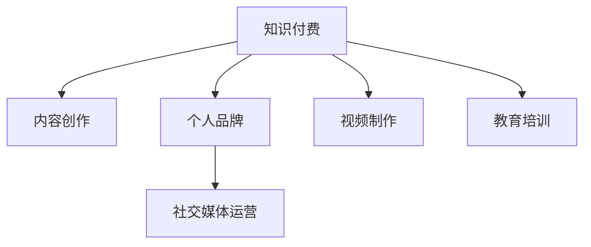

                 

# 知识付费内容创作：程序员的非代码技能培养

> 关键词：知识付费,内容创作,程序员,非代码技能,个人品牌,社交媒体,视频制作,教育培训

## 1. 背景介绍

### 1.1 问题由来

在快速变化的IT行业，掌握技术之外的非代码技能越来越成为程序员的核心竞争力。这些非代码技能不仅可以帮助程序员在职场上更好地沟通和协作，还能为他们开辟新的职业道路。特别是在当前知识付费和在线教育蓬勃发展的趋势下，具备非代码技能的程序员可以借助社交媒体和教育平台建立个人品牌，提供有价值的知识服务，从而实现收入多元化，拓展职业发展空间。

### 1.2 问题核心关键点

本文聚焦于程序员在知识付费领域的非代码技能培养，旨在探讨和指导程序员如何利用这些技能创造价值，包括但不限于内容创作、个人品牌塑造、社交媒体运营、视频制作以及教育培训等。通过系统地学习这些技能，程序员不仅可以在现有职业中脱颖而出，还可以开辟新的职业机会，为自身职业生涯增添新的维度。

### 1.3 问题研究意义

对程序员而言，掌握非代码技能并应用于知识付费领域，具有以下重要意义：

1. **提高职业竞争力**：通过培养和展示非代码技能，程序员可以在职场上获得更多认可，提升自身价值。
2. **多元化收入来源**：在知识付费时代，通过内容创作和教育培训，程序员可以开辟新的收入来源。
3. **增强个人品牌**：通过社交媒体和个人博客等渠道，程序员可以建立强大的个人品牌，扩大影响力。
4. **推动职业转型**：具备非代码技能的内容创作者和讲师，可以更顺利地从传统开发工作转型到内容创作或教育培训领域。
5. **促进知识传播**：通过知识付费平台，程序员可以将自己的专业知识以更系统、更易于理解的方式分享给更多人。

## 2. 核心概念与联系

### 2.1 核心概念概述

为更好地理解本文探讨的主题，本节将介绍几个关键概念：

- **知识付费**：指的是用户为获取知识或信息而支付费用的模式。近年来，随着知识经济的发展，知识付费成为越来越多人获取学习资源的重要方式。
- **内容创作**：指创作具有价值和吸引力的内容，包括文章、视频、音频等形式。在知识付费领域，内容创作者通过提供高质量、有深度的知识内容吸引订阅用户，并从中获得收益。
- **个人品牌**：指个人在特定领域建立起来的知名度和声誉。对于程序员而言，个人品牌不仅体现在技术实力上，还包括其在非代码技能方面的综合能力。
- **社交媒体运营**：指在社交媒体平台上进行的内容发布、互动管理等活动，通过这些活动提高个人或品牌的知名度和影响力。
- **视频制作**：指制作高质量的视频内容，包括剧本编写、剪辑、后期制作等环节。在知识付费领域，视频内容因其直观、生动等特点，受到越来越多用户的青睐。
- **教育培训**：指提供系统的教育内容，帮助用户掌握新技能或提升已有技能。教育培训课程不仅限于传统学科，还包括编程技巧、软技能等。

这些核心概念之间的逻辑关系可以通过以下Mermaid流程图来展示：



这个流程图展示了个体在知识付费领域中，通过非代码技能的不同应用，能够形成一套完整的价值链，实现从内容创作到个人品牌塑造，再到社交媒体运营和教育培训的全流程操作。

## 3. 核心算法原理 & 具体操作步骤

### 3.1 算法原理概述

本文将从非代码技能的角度，探讨程序员如何在知识付费领域进行内容创作和教育培训。核心算法原理主要涉及以下三个方面：

1. **内容创作**：通过分析用户需求，创作高质量、有价值的内容，吸引和保留订阅用户。
2. **个人品牌塑造**：通过在社交媒体上建立和维护个人品牌，提升个人知名度和影响力。
3. **教育培训**：设计和实施教育课程，帮助用户掌握新技能或提升已有技能。

### 3.2 算法步骤详解

以下详细介绍每个步骤的具体操作：

#### 3.2.1 内容创作

1. **市场调研**：通过分析目标受众的需求和兴趣，确定创作主题。
2. **内容策划**：根据市场调研结果，制定详细的内容创作计划，包括内容类型、发布频率、目标受众等。
3. **内容生产**：利用现有的技术资源（如编程、设计、数据分析等），制作高质量的内容，确保内容的原创性和可读性。
4. **内容优化**：根据用户反馈，持续改进内容质量和发布策略，提高内容的吸引力和用户的满意度。

#### 3.2.2 个人品牌塑造

1. **定位**：明确个人品牌的核心价值和目标受众。
2. **建设**：在社交媒体（如知乎、微博、LinkedIn等）上发布专业内容，建立个人形象。
3. **互动**：与粉丝互动，回应评论和私信，增强用户粘性。
4. **推广**：通过付费广告、合作推广等方式，扩大个人品牌的影响力。

#### 3.2.3 教育培训

1. **课程设计**：根据目标受众的需求，设计课程大纲和教学内容。
2. **课程开发**：利用技术工具（如视频录制软件、编程语言等）开发课程。
3. **课程营销**：通过社交媒体、邮件营销等方式，推广课程。
4. **课程反馈**：收集用户反馈，持续改进课程内容和方法。

### 3.3 算法优缺点

知识付费领域的非代码技能培养，具有以下优点和缺点：

**优点**：

- **多样化的职业道路**：掌握非代码技能，程序员可以在技术之外开辟新的职业机会。
- **提升个人价值**：非代码技能可以显著提升程序员的市场竞争力，增加就业机会。
- **实现收入多元化**：通过知识付费，程序员可以实现收入来源多样化。

**缺点**：

- **时间和精力的投入**：非代码技能的培养需要大量时间和精力的投入，可能影响技术工作。
- **市场竞争激烈**：知识付费市场竞争激烈，需要持续创新和优化内容才能获得成功。

### 3.4 算法应用领域

非代码技能在知识付费领域的应用，覆盖了内容创作、个人品牌塑造、社交媒体运营、视频制作和教育培训等多个方面。具体应用领域包括：

- **技术博客**：在个人博客上分享技术心得，建立个人品牌，吸引技术爱好者关注。
- **视频教程**：制作技术相关的视频教程，通过视频平台（如YouTube、B站）分享，扩大影响力。
- **在线课程**：通过知识付费平台（如Coursera、Udemy）开设技术课程，帮助用户提升技能。
- **知识问答**：在知识付费平台（如知乎、Quora）上回答问题，建立专业形象。
- **技术播客**：录制技术相关的播客，通过音频平台（如Spotify、Apple Podcasts）分享，吸引听众。

## 4. 数学模型和公式 & 详细讲解 & 举例说明

### 4.1 数学模型构建

在知识付费领域，非代码技能培养的效果通常通过以下几个指标来衡量：

- **用户增长率**：衡量内容或个人品牌对新用户的吸引力。
- **订阅续费率**：衡量用户对已有内容或个人品牌的忠诚度。
- **用户互动率**：衡量内容或个人品牌与用户之间的互动频率。
- **课程完成率**：衡量课程内容的质量和用户的学习效果。

### 4.2 公式推导过程

以用户增长率为例，设每月新增用户数量为 $N$，用户流失率为 $\lambda$，则用户增长率 $R$ 可以表示为：

$$
R = \frac{N}{N + K\lambda}
$$

其中 $K$ 为现有用户总数。根据此公式，可以计算出在不同用户增长率和流失率下的用户总数，以及通过用户增长率优化策略提升用户总数的路径。

### 4.3 案例分析与讲解

以技术博客为例，设每月新增读者数为 $n$，读者流失率为 $\lambda$，现有读者总数为 $k$，则博客每月读者总数 $N$ 为：

$$
N = n + k\lambda
$$

为了提升读者总数，可以通过增加每月新增读者数 $n$，或者降低读者流失率 $\lambda$。例如，通过发布高质量技术文章，优化博客内容布局，提升用户体验，可以显著增加每月新增读者数 $n$。同时，通过建立社区，加强与读者的互动，可以降低读者流失率 $\lambda$。

## 5. 项目实践：代码实例和详细解释说明

### 5.1 开发环境搭建

在进行知识付费内容创作和教育培训实践前，需要准备好开发环境。以下是使用Python进行开发的环境配置流程：

1. 安装Anaconda：从官网下载并安装Anaconda，用于创建独立的Python环境。
2. 创建并激活虚拟环境：
```bash
conda create -n myenv python=3.8 
conda activate myenv
```

3. 安装Python包：
```bash
pip install Flask Pandas Matplotlib jupyter notebook ipython
```

4. 安装在线教育平台所需的包：
```bash
pip install Flask-RESTful Flask-CORS
```

完成上述步骤后，即可在`myenv`环境中开始知识付费项目的开发。

### 5.2 源代码详细实现

以下是一个简单的Python Flask框架实现的内容创作API示例。

```python
from flask import Flask, request, jsonify

app = Flask(__name__)

@app.route('/create', methods=['POST'])
def create_content():
    data = request.get_json()
    content_id = data['content_id']
    title = data['title']
    description = data['description']
    
    # 将内容信息保存到数据库
    # ...
    
    return jsonify({'message': '内容创建成功'})

if __name__ == '__main__':
    app.run(debug=True)
```

这个代码示例中，使用Flask框架创建一个RESTful API，实现内容的创建功能。当用户通过POST请求发送包含内容ID、标题和描述的JSON数据时，API会保存这些信息到数据库，并返回一个成功创建的消息。

### 5.3 代码解读与分析

让我们再详细解读一下关键代码的实现细节：

**Flask框架**：
- `Flask`类：创建Flask应用实例。
- `@app.route`装饰器：定义API路由，用于接收请求并处理响应。
- `request.get_json()`：从请求中获取JSON数据。
- `jsonify`函数：将响应数据转换为JSON格式。

**API实现**：
- 首先通过`request.get_json()`获取请求中的内容ID、标题和描述等参数。
- 将内容信息保存到数据库。
- 返回一个JSON格式的成功消息。

这个示例展示了如何使用Python Flask框架实现一个简单的内容创作API。在实际应用中，还需要添加身份验证、权限控制、错误处理等功能，以保证API的安全性和稳定性。

## 6. 实际应用场景

### 6.1 技术博客

通过在技术博客上分享技术心得，程序员可以展示自己的专业知识，吸引技术爱好者关注，建立个人品牌。例如，GitHub上的开源项目和代码库就是一种技术博客形式，程序员可以分享项目的开发过程、遇到的问题和解决方案，吸引开发者社区的关注和讨论。

### 6.2 视频教程

视频教程可以通过视频平台（如YouTube、B站）进行分享，吸引大量用户观看和学习。程序员可以制作技术相关的视频教程，讲解编程语言、开发框架、算法等知识，帮助初学者入门，提升已有用户的技能水平。

### 6.3 在线课程

在线课程是知识付费领域的重要形式，程序员可以设计和实施技术相关的课程，通过知识付费平台（如Coursera、Udemy）进行推广和销售，获得经济回报。在线课程不仅限于编程技能，还可以包括软技能、项目管理、团队协作等。

### 6.4 知识问答

知识问答平台（如知乎、Quora）是程序员展示专业知识的好渠道。程序员可以在平台上回答技术相关的问题，通过互动建立专业形象，吸引更多关注和粉丝。

### 6.5 技术播客

技术播客是一种新兴的知识付费形式，程序员可以通过音频平台（如Spotify、Apple Podcasts）发布技术相关的播客内容，吸引听众关注。播客形式灵活，可以涵盖技术趋势、开发心得、行业动态等多个话题，丰富用户的学习体验。

## 7. 工具和资源推荐

### 7.1 学习资源推荐

为了帮助程序员系统掌握知识付费领域的非代码技能，这里推荐一些优质的学习资源：

1. **Coursera《内容创作与数字营销》课程**：介绍内容创作的策略和技巧，以及数字营销的基本知识。
2. **Udemy《视频制作基础》课程**：讲解视频制作的各个环节，包括剧本编写、剪辑、后期制作等。
3. **LinkedIn Learning《社交媒体营销》课程**：介绍社交媒体运营的策略和工具，帮助提升个人品牌影响力。
4. **Medium《如何成为一名成功的在线讲师》文章系列**：通过案例分享，介绍成为成功在线讲师的实用技巧。
5. **博客园《知识付费平台优化指南》系列文章**：通过实践经验分享，介绍如何优化知识付费内容和服务。

通过对这些资源的学习实践，相信程序员一定能够快速掌握知识付费领域的非代码技能，并将其应用于实际项目中。

### 7.2 开发工具推荐

高效的开发离不开优秀的工具支持。以下是几款用于知识付费内容创作和教育培训开发的常用工具：

1. **Flask**：基于Python的Web框架，用于开发API服务。
2. **Django**：基于Python的全栈Web框架，支持多种数据库和模板引擎，适用于开发复杂应用。
3. **PyTorch**：基于Python的深度学习框架，支持动态计算图，适用于开发深度学习相关的课程和项目。
4. **Jupyter Notebook**：基于Python的交互式开发环境，支持代码、数据和文档的一体化编写和展示。
5. **Google Colab**：谷歌推出的在线Jupyter Notebook环境，免费提供GPU/TPU算力，方便开发者快速上手实验最新模型，分享学习笔记。

合理利用这些工具，可以显著提升知识付费项目开发的效率，加快创新迭代的步伐。

### 7.3 相关论文推荐

知识付费领域的非代码技能培养涉及多方面的内容，以下是几篇奠基性的相关论文，推荐阅读：

1. **《知识付费平台用户体验研究》**：通过对知识付费平台用户的调研，探讨用户体验的设计策略和优化方法。
2. **《内容创作与品牌塑造：实践案例分析》**：通过实际案例分析，介绍内容创作和品牌塑造的实践经验。
3. **《社交媒体运营策略与工具》**：介绍社交媒体运营的策略和工具，帮助提升品牌影响力。
4. **《在线教育课程设计与评估》**：介绍在线教育课程的设计和评估方法，提升课程质量和学习效果。
5. **《技术播客的制作与推广》**：通过实践经验分享，介绍技术播客的制作和推广策略。

这些论文代表了大语言模型微调技术的发展脉络。通过学习这些前沿成果，可以帮助程序员掌握知识付费领域的非代码技能，更好地实现自我价值。

## 8. 总结：未来发展趋势与挑战

### 8.1 总结

本文对知识付费领域的非代码技能培养进行了全面系统的介绍。首先阐述了知识付费领域的背景和意义，明确了非代码技能对程序员职业发展的重要性。其次，从原理到实践，详细讲解了内容创作、个人品牌塑造、社交媒体运营、视频制作和教育培训等关键技能，并给出了代码实现示例。最后，总结了知识付费领域的未来发展趋势和面临的挑战。

通过本文的系统梳理，可以看到，掌握非代码技能并应用于知识付费领域，对程序员而言具有重要意义。这些技能不仅有助于提升市场竞争力，还可以开辟新的职业道路，实现收入多元化。未来，随着知识付费领域的进一步发展，这些非代码技能的应用将更加广泛，为程序员提供更多职业机会和发展空间。

### 8.2 未来发展趋势

展望未来，知识付费领域的非代码技能培养将呈现以下几个发展趋势：

1. **内容形式多样化**：除了传统的文章和视频，未来还会涌现更多形式的内容，如播客、音频课程、互动直播等。
2. **知识服务精细化**：知识付费内容将更加聚焦用户需求，提供更具体、更细致的知识服务。
3. **用户交互个性化**：通过大数据和AI技术，个性化推荐和互动将成为知识付费平台的核心竞争力。
4. **多平台协同运营**：知识付费内容将在多个平台（如社交媒体、视频平台、知识付费平台等）进行协同运营，提升整体影响力和用户粘性。
5. **持续学习和更新**：知识付费内容将不断更新迭代，适应技术和市场的变化，保持长期吸引力。

这些趋势凸显了知识付费领域的巨大潜力和发展空间。未来，知识付费内容将更加多样化、精细化和个性化，为程序员提供更多的展示和收入机会。

### 8.3 面临的挑战

尽管知识付费领域的非代码技能培养已经取得显著进展，但在迈向更加智能化、普适化应用的过程中，仍面临诸多挑战：

1. **用户需求多样化**：不同用户有不同的需求和兴趣，如何提供满足多样化需求的知识内容，是重要挑战。
2. **内容质量提升**：高质量的内容是知识付费的核心竞争力，如何持续提升内容质量，吸引和保留用户，是关键问题。
3. **平台竞争激烈**：知识付费平台众多，如何在激烈的市场竞争中脱颖而出，需要更多创新和优化。
4. **收益模式单一**：目前知识付费主要依赖订阅和付费购买，如何拓展更多元化的收益模式，提高收入来源的稳定性。
5. **技术门槛高**：知识付费内容制作涉及多种技术手段，对技术门槛和团队协作要求较高，如何降低技术门槛，提高内容制作的效率和质量，是重要挑战。

这些挑战需要创作者和平台方共同努力，通过持续创新和优化，才能在知识付费领域取得成功。

### 8.4 研究展望

面向未来，知识付费领域的非代码技能培养需要在以下几个方面进行深入研究：

1. **个性化推荐算法**：研究如何通过大数据和AI技术，实现内容个性化推荐，提升用户粘性和满意度。
2. **内容创作辅助工具**：开发内容创作辅助工具，降低技术门槛，提高内容制作效率和质量。
3. **内容评估与优化**：建立内容评估指标体系，持续改进内容质量和用户体验。
4. **多平台协同运营**：研究如何在多个平台协同运营，实现内容价值最大化。
5. **多元化收益模式**：探索更多元化的收益模式，提高收入来源的稳定性。

这些研究方向的探索，必将引领知识付费领域的非代码技能培养走向更高的台阶，为程序员提供更多职业机会和发展空间。总之，知识付费领域的非代码技能培养具有广阔前景，只要不断创新和优化，就能实现职业发展的多元化，为自身职业生涯增添新的维度。

## 9. 附录：常见问题与解答

**Q1：如何评估知识付费内容的效果？**

A: 知识付费内容的效果可以通过多个指标来评估，包括但不限于：

- **订阅数量**：衡量内容的吸引力和用户数量。
- **课程完成率**：衡量课程内容的实用性和用户的学习效果。
- **用户互动率**：衡量内容与用户之间的互动频率和质量。
- **收益和成本**：衡量内容的经济回报和制作成本，确保内容创作的可持续性。

通过这些指标的评估，创作者可以了解用户对内容的反馈，不断改进和优化内容，提升整体效果。

**Q2：如何选择适合的知识付费平台？**

A: 选择知识付费平台时，需要考虑以下几个因素：

- **平台的用户基础**：平台的用户规模和活跃度直接影响内容的覆盖面和传播效果。
- **平台的收益模式**：不同的平台收益模式不同，创作者需要根据自身需求选择适合的收益模式。
- **平台的开放性和技术支持**：平台的开放性和技术支持对创作者的内容制作和推广非常重要。
- **平台的运营和管理**：平台的用户服务、版权保护、内容审核等管理措施，直接影响到内容创作的顺利进行。

综合考虑这些因素，选择最适合的知识付费平台，才能最大化内容的影响力和收益。

**Q3：如何提升知识付费内容的互动率？**

A: 提升知识付费内容的互动率，可以通过以下几种方法：

- **互动设计**：在内容中设计互动环节，如问答、讨论、作业等，增加用户参与度。
- **社区建设**：建立内容相关的社区，鼓励用户分享心得和经验，增强用户粘性。
- **反馈机制**：建立用户反馈机制，及时回应用户的问题和建议，提升用户体验。
- **内容更新**：定期更新内容，保持内容的实时性和新鲜度，吸引用户持续关注。

通过这些方法，可以显著提升知识付费内容的互动率，增加用户参与度，提升整体效果。

**Q4：如何降低知识付费内容的制作成本？**

A: 降低知识付费内容的制作成本，可以通过以下几种方法：

- **团队协作**：利用团队协作，分工明确，提高内容制作的效率。
- **工具使用**：利用现有的技术工具，如视频录制软件、编辑软件等，减少制作成本。
- **内容复用**：将已有内容进行复用，减少重复劳动。
- **内容共享**：与其他创作者分享内容，利用外部资源和平台，降低制作成本。

通过这些方法，可以显著降低知识付费内容的制作成本，提升内容制作的效率和质量。

**Q5：如何进行知识付费内容的营销推广？**

A: 知识付费内容的营销推广，可以通过以下几种方法：

- **社交媒体推广**：利用社交媒体平台进行内容推广，吸引更多用户关注。
- **内容合作**：与其他创作者或平台进行内容合作，扩大内容的覆盖面。
- **付费广告**：利用付费广告，精准定位目标受众，提高内容的曝光率。
- **内容优化**：优化内容标题、摘要和推荐词，提高内容的搜索排名。

通过这些方法，可以显著提升知识付费内容的曝光率和用户关注度，增加内容的收益。

---

作者：禅与计算机程序设计艺术 / Zen and the Art of Computer Programming

