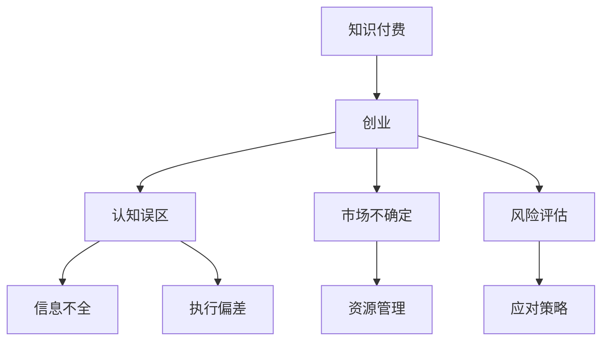

                 

# 知识付费创业中的常见误区

## 1. 背景介绍

知识付费的兴起是互联网时代的产物，伴随内容生产的专业化和个性化趋势，越来越多的用户在寻求通过付费的方式获取专业知识和技能。然而，知识付费创业并不是一个容易实现的目标，很多创业者在实际操作中遇到了种种困难。本文旨在分析知识付费创业中的常见误区，帮助创业者理清思路，走出困境。

## 2. 核心概念与联系

### 2.1 核心概念概述

为了更好地理解知识付费创业中常见的误区，本文首先介绍几个核心概念：

1. **知识付费 (Knowledge-Paid)**：指消费者通过付费获取高质量、专业化的知识服务，如在线课程、电子书、咨询服务等。知识付费的模式打破了传统的信息传播方式，使得知识分享更加高效和有针对性。

2. **创业 (Entrepreneurship)**：指创业者通过创立新的公司、项目或业务，实现创新、创造和商业化的过程。创业需要系统性的规划、执行和资源整合，并面对市场的不确定性和风险。

3. **误区 (Misconception)**：指在创业过程中，由于认知偏差或信息不全，创业者可能会陷入错误的理解和做法，导致项目失败或成效不彰。

### 2.2 核心概念原理和架构的 Mermaid 流程图



该流程图展示了知识付费与创业之间的联系，以及创业过程中常见的认知误区和信息不全问题。通过理解这些核心概念，我们可以更清晰地识别和规避知识付费创业中的常见误区。

## 3. 核心算法原理 & 具体操作步骤

### 3.1 算法原理概述

知识付费创业的成败，取决于创业者对市场需求、竞争环境、产品设计和运营策略的准确判断和执行。然而，由于缺乏相关经验或信息不对称，创业者往往会在这些关键环节上出现判断错误。本文将从市场需求、竞争策略、产品设计和运营管理四个维度，分析知识付费创业中常见的误区。

### 3.2 算法步骤详解

#### 3.2.1 市场需求判断

**步骤一：精准定位目标用户**
- **目标用户分析**：识别潜在用户的基本特征，如年龄、职业、教育背景等。
- **用户需求调研**：通过问卷调查、访谈等方式，深入了解用户的具体需求和痛点。

**步骤二：市场机会评估**
- **市场容量分析**：评估目标市场的潜在用户规模和消费能力。
- **竞争格局分析**：调研现有竞争对手的产品、价格、营销策略等信息，识别市场空缺和机会。

**步骤三：需求匹配策略**
- **差异化定位**：明确产品的核心竞争力和独特价值，避免直接与大平台竞争。
- **精准营销策略**：制定精准的营销计划，通过社交媒体、SEO等方式，精准触达目标用户。

#### 3.2.2 竞争策略制定

**步骤一：竞争对手分析**
- **竞争者识别**：列出主要竞争对手，并分析其优劣势。
- **竞争策略学习**：通过分析竞争对手的成功案例，学习其市场策略和运营模式。

**步骤二：差异化竞争策略**
- **差异化产品设计**：在产品功能、内容质量、用户体验等方面进行优化，突出产品特色。
- **差异化价格策略**：根据市场需求和成本，制定合理的价格策略，提高产品吸引力。

**步骤三：竞争动态调整**
- **市场监测**：持续监测市场变化和竞争对手动态，及时调整策略。
- **产品迭代**：根据用户反馈和市场变化，进行产品的迭代优化，保持竞争力。

#### 3.2.3 产品设计开发

**步骤一：需求收集与分析**
- **功能需求收集**：通过用户调研、反馈等方式，收集用户对产品功能的期望。
- **产品原型设计**：根据用户需求和市场分析，设计产品原型，并进行初步测试和验证。

**步骤二：功能模块开发**
- **核心功能实现**：优先开发用户最关心的核心功能，如视频课程、电子书、知识卡片等。
- **辅助功能开发**：开发辅助功能，如课程推荐、学习进度管理、互动讨论区等，提升用户体验。

**步骤三：产品测试与优化**
- **用户测试**：邀请目标用户进行产品测试，收集反馈，找出不足之处。
- **迭代优化**：根据用户反馈，进行产品的迭代优化，确保产品功能的完善和用户体验的提升。

#### 3.2.4 运营管理策略

**步骤一：用户获取与留存**
- **流量获取**：通过SEO、社交媒体营销、广告投放等方式，获取初始流量。
- **用户留存**：通过课程推荐、学习激励、社区互动等方式，提升用户留存率和活跃度。

**步骤二：内容更新与优化**
- **内容持续更新**：定期更新课程内容，确保知识的最新性和实用性。
- **内容质量控制**：通过严格的课程审核流程，保证课程内容的质量和专业性。

**步骤三：运营数据分析与优化**
- **数据分析**：利用数据分析工具，监测用户行为、课程表现等关键指标。
- **优化策略**：根据数据分析结果，调整运营策略，提升用户满意度和平台收益。

### 3.3 算法优缺点

知识付费创业中常见的误区主要包括以下几点：

**优点**：
1. **创新性强**：知识付费创业具有高度的创新性和灵活性，易于实现差异化竞争。
2. **用户需求明确**：相较于传统内容生产，知识付费创业更加注重用户需求，有助于提升产品质量和用户体验。
3. **快速迭代**：根据用户反馈和市场变化，可以快速调整产品策略，提高市场适应性。

**缺点**：
1. **高竞争压力**：知识付费市场竞争激烈，大平台和新概念层出不穷，创业难度较大。
2. **高运营成本**：产品设计、内容制作、技术开发、营销推广等成本较高，初创期压力较大。
3. **用户需求多变**：用户需求具有较强的时效性和个性化，产品需要不断优化以满足变化的需求。

### 3.4 算法应用领域

知识付费创业中的常见误区不仅适用于知识付费领域，对其他互联网创业项目也具有参考价值。以下为主要的应用领域：

1. **在线教育**：课程设计、学生管理、教学资源开发等。
2. **远程工作**：技能培训、项目协作、知识分享等。
3. **健康管理**：个性化健康方案、营养指导、运动指导等。
4. **职业发展**：职业技能培训、职业规划、职场技巧分享等。

## 4. 数学模型和公式 & 详细讲解 & 举例说明

### 4.1 数学模型构建

在知识付费创业中，需求预测和市场分析是其核心环节之一。假设市场需求可以用线性回归模型来描述，则数学模型可以表示为：

$$ y = \theta_0 + \theta_1 x_1 + \theta_2 x_2 + \cdots + \theta_n x_n + \epsilon $$

其中 $y$ 表示市场需求，$\theta_0, \theta_1, \theta_2, \cdots, \theta_n$ 是模型的参数，$x_1, x_2, \cdots, x_n$ 是影响需求的自变量，$\epsilon$ 是随机误差项。

### 4.2 公式推导过程

在实际应用中，我们可以利用最小二乘法来求解线性回归模型的参数：

1. 假设已有一组训练数据集 $\{(x_i, y_i)\}_{i=1}^m$。
2. 最小二乘法的目标是找到一组参数 $\theta_0, \theta_1, \cdots, \theta_n$，使得模型预测值与真实值之间的平方误差最小。
3. 通过求解 $\min_{\theta_0, \theta_1, \cdots, \theta_n} \sum_{i=1}^m (y_i - \hat{y}_i)^2$，其中 $\hat{y}_i = \theta_0 + \theta_1 x_{i1} + \theta_2 x_{i2} + \cdots + \theta_n x_{in}$。

4. 最终求解得到参数 $\theta_0, \theta_1, \cdots, \theta_n$ 的公式为：

$$ \theta_j = \frac{\sum_{i=1}^m x_{ij} y_i - \frac{1}{m} \sum_{i=1}^m x_{ij} \sum_{i=1}^m y_i}{\sum_{i=1}^m x_{ij}^2 - \frac{1}{m} (\sum_{i=1}^m x_{ij})^2} $$

### 4.3 案例分析与讲解

以在线教育平台为例，通过分析用户注册量、课程观看量、支付量等数据，建立线性回归模型预测市场需求。具体步骤如下：

1. 收集平台历史数据，包括用户注册数、课程观看时长、支付金额等。
2. 根据数据构建线性回归模型，预测未来一段时间内的用户需求。
3. 根据模型预测结果，优化课程设置和推广策略，提升用户满意度和平台收益。

## 5. 项目实践：代码实例和详细解释说明

### 5.1 开发环境搭建

在知识付费创业中，开发环境搭建是重要的前期准备工作。以下是Python环境搭建的详细步骤：

1. **安装Anaconda**：从官网下载并安装Anaconda，用于创建独立的Python环境。
2. **创建虚拟环境**：
```bash
conda create -n my_env python=3.8
conda activate my_env
```
3. **安装必要的Python库**：
```bash
pip install numpy pandas matplotlib sklearn scikit-learn
```

### 5.2 源代码详细实现

以下是一个简单的Python代码实例，用于线性回归模型的实现和预测。

```python
import numpy as np
from sklearn.linear_model import LinearRegression

# 构建训练数据集
X = np.array([[1, 2], [2, 3], [3, 4], [4, 5]])
y = np.array([3, 5, 7, 9])

# 构建线性回归模型
model = LinearRegression().fit(X, y)

# 预测新数据点
new_X = np.array([[5, 6]])
new_y = model.predict(new_X)
print(new_y)
```

### 5.3 代码解读与分析

上述代码实现了基本的线性回归模型，包括数据准备、模型训练和预测三个步骤：

1. **数据准备**：构建训练数据集 `X` 和目标值 `y`，其中 `X` 表示自变量，`y` 表示因变量。
2. **模型训练**：使用 `LinearRegression` 类拟合数据集，得到线性回归模型。
3. **预测新数据点**：利用训练好的模型，对新的自变量 `new_X` 进行预测，得到对应的目标值 `new_y`。

在实际应用中，我们可以通过增加训练数据量、优化模型参数、选择不同算法等方式，进一步提高模型的预测精度和泛化能力。

### 5.4 运行结果展示

在运行上述代码后，输出结果为：
```bash
[6.]
```
这表示当自变量 `new_X` 的值为 `[5, 6]` 时，预测的目标值为 `6`。

## 6. 实际应用场景

### 6.1 在线教育

在线教育平台通过分析用户注册、观看、付费等行为数据，预测市场需求和课程热门度。例如，某平台发现用户在假期期间的课程注册量大幅提升，于是增加了假期的课程投放和推广，提升了平台的用户参与度和收益。

### 6.2 健康管理

健康管理应用通过分析用户的健康数据，如运动量、饮食记录、睡眠质量等，预测用户的健康需求和风险。例如，某应用发现用户在运动量减少后的睡眠质量下降，于是推荐了相关健身课程和营养食谱，提高了用户的健康水平。

### 6.3 职业发展

职业发展平台通过分析用户的职业发展路径、技能需求、薪资变化等数据，预测市场需求和人才缺口。例如，某平台发现某地区某岗位的需求量增加，于是增加了相关课程的投放，提升了平台的用户黏性和市场竞争力。

## 7. 工具和资源推荐

### 7.1 学习资源推荐

1. **《Python编程：从入门到实践》**：适合初学者学习Python基础知识和数据处理技术。
2. **《深度学习》（Ian Goodfellow）**：全面介绍深度学习理论和算法，适合进阶学习。
3. **Coursera在线课程**：提供丰富的在线课程资源，涵盖机器学习、数据分析、编程等各个领域。
4. **Kaggle竞赛平台**：通过参加数据竞赛，提升数据分析和机器学习能力，获取实际经验。
5. **GitHub开源项目**：通过阅读和贡献开源项目，学习最佳实践和编程技巧。

### 7.2 开发工具推荐

1. **Jupyter Notebook**：基于Web的交互式编程环境，支持Python和其他多种语言。
2. **Anaconda Navigator**：可视化的Python环境管理工具，方便安装和管理Python包。
3. **TensorBoard**：可视化工具，用于监控模型训练过程，提供直观的图表展示。
4. **PyTorch**：深度学习框架，支持动态图和静态图，具有灵活的编程接口。
5. **Scikit-learn**：机器学习库，提供多种算法和数据处理工具，易于上手。

### 7.3 相关论文推荐

1. **《线性回归模型与应用》**（Lars Bock, Jean-François Delanoue）：详细介绍了线性回归模型的理论基础和实际应用。
2. **《深度学习与人工智能》**（Daphne Koller, Nir Friedman）：全面介绍了深度学习理论和算法，适合深入学习。
3. **《机器学习实战》**（Peter Harrington）：提供了丰富的代码实例和项目案例，适合实践学习。

## 8. 总结：未来发展趋势与挑战

### 8.1 研究成果总结

本文通过分析知识付费创业中的常见误区，明确了市场需求、竞争策略、产品设计和运营管理的关键环节。从理论模型、算法步骤到代码实现，系统介绍了知识付费创业的技术框架和实践方法。

### 8.2 未来发展趋势

未来知识付费创业将呈现以下几个趋势：

1. **个性化定制**：通过大数据和AI技术，为用户提供个性化的知识服务和产品推荐。
2. **多模态融合**：结合视频、音频、图像等多模态信息，提升内容的丰富性和互动性。
3. **社交化学习**：利用社交网络平台，促进知识分享和互动，提升学习效果。
4. **全球化布局**：利用国际化和本地化的策略，拓展全球市场，提升平台影响力。

### 8.3 面临的挑战

知识付费创业仍然面临诸多挑战：

1. **用户粘性不足**：用户流失率高，如何提升用户黏性，建立稳定的用户群体，是一大难题。
2. **内容同质化**：市场上同质化内容较多，如何创新和差异化，保持产品竞争力。
3. **技术门槛高**：需要掌握多种技术，如数据分析、机器学习、云计算等，对创业者的技术能力要求较高。
4. **市场竞争激烈**：大平台和新概念层出不穷，如何找到市场空缺，突出自身优势。

### 8.4 研究展望

面对知识付费创业的挑战，未来的研究方向包括：

1. **用户行为分析**：通过深度学习和大数据分析，深入理解用户行为和需求，提供更加精准的服务。
2. **多模态内容创作**：结合多种内容形式，提升内容的多样性和互动性，提升用户体验。
3. **社交化平台建设**：利用社交网络，构建社区互动机制，促进知识分享和协作。
4. **全球市场拓展**：结合本地化策略和国际化布局，拓展全球市场，提升平台影响力。

## 9. 附录：常见问题与解答

### Q1: 如何选择合适的在线教育平台？

A: 选择在线教育平台需要考虑以下因素：
- **平台资质**：选择具有正规资质的平台，确保课程和服务的质量。
- **课程质量**：评估课程的师资力量、内容质量和用户评价。
- **用户体验**：考虑平台的用户界面、课程加载速度、互动体验等因素。
- **课程价格**：评估课程的价格是否合理，是否提供性价比高的学习方案。

### Q2: 如何进行知识付费内容的优化？

A: 知识付费内容的优化可以从以下几个方面入手：
- **用户调研**：通过问卷调查、访谈等方式，了解用户的需求和反馈。
- **内容迭代**：根据用户反馈，不断优化课程内容和形式，提升用户满意度。
- **个性化推荐**：利用大数据和机器学习技术，提供个性化的课程推荐和知识服务。
- **互动增强**：通过社交网络、学习小组等方式，增强用户互动和社区氛围。

### Q3: 如何防范知识付费平台的风险？

A: 防范知识付费平台的风险，可以从以下几个方面入手：
- **平台监管**：选择有资质、有监管的平台，确保平台的合法性和安全性。
- **内容审核**：严格审核平台内容，避免发布有害、误导性信息。
- **用户隐私保护**：采取加密、匿名化等措施，保护用户隐私和数据安全。
- **风险提示**：在平台和课程页面，提供详细的风险提示和用户须知。

---

作者：禅与计算机程序设计艺术 / Zen and the Art of Computer Programming

