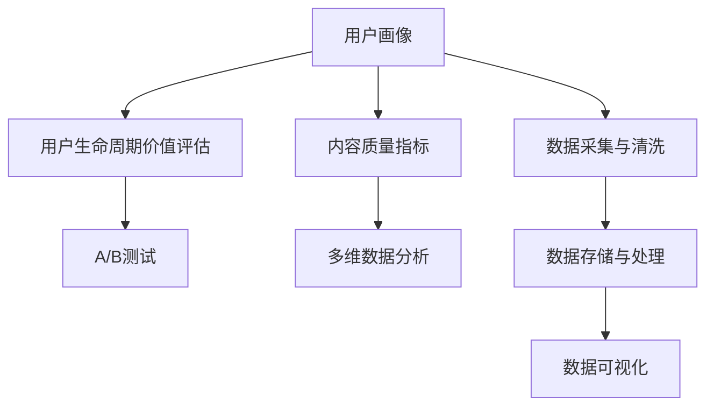

                 

# 知识付费创业中的数据分析技巧

## 1. 背景介绍

### 1.1 问题由来

随着互联网和移动设备的普及，知识付费逐渐成为一种新的商业模式。知识付费平台通过提供有价值的信息内容，满足用户的学习需求，获得用户的付费订阅。然而，知识付费创业的成功不仅仅依赖于内容的丰富度，更需要依托于精准的数据分析能力。通过对用户行为数据的深入分析，可以洞察用户需求，优化产品和服务，提升用户体验，从而实现业务增长和盈利。

### 1.2 问题核心关键点

知识付费平台的数据分析需求，核心在于以下几个方面：

1. **用户画像**：了解用户的兴趣、偏好、消费习惯等，以便推送个性化推荐内容，提升用户粘性。
2. **内容质量**：分析用户对内容的评价、反馈和互动情况，优化内容生产策略，提高内容吸引力。
3. **购买行为**：分析用户订阅、续费、消费金额等行为数据，制定精准的运营策略，提高转化率和用户留存率。
4. **营销效果**：评估营销活动的效果，如广告、促销、推荐等，提升广告投放的ROI，优化营销策略。
5. **用户流失**：分析用户流失的原因，制定用户挽回策略，减少用户流失，提高用户生命周期价值。

### 1.3 问题研究意义

数据分析在知识付费创业中的作用至关重要，它不仅能够为产品优化和内容生产提供数据支撑，还能够帮助平台制定精准的运营策略，提高营销效率，最终实现用户增长和业务盈利。通过数据驱动决策，平台能够更有效地满足用户需求，提升用户体验，构建持续增长的商业生态。

## 2. 核心概念与联系

### 2.1 核心概念概述

为了更好地理解知识付费平台中的数据分析技巧，本节将介绍几个密切相关的核心概念：

- **用户画像**：基于用户的历史行为数据、互动数据和第三方数据，构建用户兴趣、偏好、行为模式等多维度的用户画像。
- **内容质量指标**：评估内容的阅读量、点赞量、评论量、分享量等指标，了解用户对内容的反馈情况。
- **用户生命周期价值(CLI)评估**：通过分析用户的订阅周期、消费频次、单次消费金额等数据，评估用户对平台的长期价值。
- **A/B测试**：通过随机分组，对比测试两个或多个版本的产品或营销策略，找出最优方案。
- **多维数据分析**：结合时间序列、用户属性、内容属性等多个维度的数据，进行深入分析和预测。

### 2.2 核心概念原理和架构的 Mermaid 流程图



这个流程图展示了知识付费平台中数据分析的关键流程：

1. **数据采集与清洗**：从平台、第三方数据源和用户行为记录中获取数据，并对数据进行清洗和预处理。
2. **数据存储与处理**：利用数据库、数据仓库等技术，对数据进行存储和管理，同时进行数据转换和特征工程。
3. **用户画像构建**：基于用户行为数据和属性数据，构建用户的多维度画像，供后续分析使用。
4. **内容质量分析**：通过分析内容的互动指标，了解用户对内容的偏好和反馈。
5. **用户生命周期价值评估**：基于用户行为数据，计算用户的长期价值，进行精准的运营策略制定。
6. **A/B测试**：通过随机分组，对比不同版本的营销策略或产品功能，找出最优方案。
7. **多维数据分析**：结合多种数据源，进行时间序列分析、用户属性分析、内容属性分析等，进行深入的业务洞察和预测。
8. **数据可视化**：通过图表、仪表盘等形式，直观展示分析结果，辅助决策。

这些核心概念构成了知识付费平台数据分析的基本框架，帮助平台从数据中挖掘价值，实现业务增长。

## 3. 核心算法原理 & 具体操作步骤

### 3.1 算法原理概述

知识付费平台中的数据分析，通常采用以下几种算法：

- **聚类算法**：如K-Means、层次聚类等，用于将用户或内容进行分类，发现用户群体的相似性和内容的聚类特性。
- **关联规则算法**：如Apriori、FP-Growth等，用于分析用户行为数据中的关联规则，发现用户兴趣和偏好。
- **预测算法**：如线性回归、随机森林、深度学习等，用于预测用户行为，如订阅概率、消费金额等。
- **推荐算法**：如协同过滤、基于内容的推荐等，用于为用户推荐个性化内容，提高用户粘性。
- **时间序列分析**：如ARIMA、LSTM等，用于分析用户行为数据的时间序列特性，进行趋势分析和预测。

### 3.2 算法步骤详解

以协同过滤推荐算法为例，详细讲解其操作步骤：

**Step 1: 数据预处理**

1. **用户画像数据预处理**：从平台记录、第三方数据源等获取用户基本信息和行为数据，进行清洗和标准化处理。
2. **内容质量数据预处理**：收集内容阅读量、点赞量、评论量、分享量等数据，进行去重、缺失值填充和标准化处理。

**Step 2: 用户画像建模**

1. **特征提取**：提取用户的基本属性（如年龄、性别、职业等）、行为特征（如浏览内容、评论互动等）和兴趣特征（如喜欢的主题、关注的作者等）。
2. **特征编码**：将用户特征编码为数值型或二值型数据，供后续建模使用。

**Step 3: 内容质量建模**

1. **特征提取**：提取内容的阅读量、点赞量、评论量、分享量等特征，供后续建模使用。
2. **内容编码**：将内容特征编码为数值型或二值型数据，供后续建模使用。

**Step 4: 协同过滤推荐**

1. **相似度计算**：计算用户与用户之间的相似度，可以使用余弦相似度、皮尔逊相关系数等方法。
2. **内容过滤**：基于用户之间的相似度，为用户推荐其相似用户喜欢的内容，避免个性化推荐中的冷启动问题。
3. **内容排序**：根据内容的质量指标和用户画像特征，对推荐内容进行排序，提升推荐效果。

**Step 5: 效果评估**

1. **离线评估**：通过A/B测试、用户反馈等方式，评估推荐算法的效果，如点击率、购买率等。
2. **在线评估**：实时监测推荐效果，进行持续优化，提升推荐系统的效果和效率。

### 3.3 算法优缺点

协同过滤推荐算法具有以下优点：

1. **高效性**：协同过滤推荐算法不需要显式的用户反馈数据，可以基于用户历史行为数据进行推荐，具有较高的推荐效率。
2. **个性化**：协同过滤推荐算法能够捕捉用户之间的相似性，推荐用户感兴趣的内容，提升用户粘性。
3. **可解释性**：协同过滤推荐算法通过相似度计算，其推荐逻辑和过程具有较高的可解释性。

同时，该算法也存在一些局限性：

1. **数据稀疏性**：协同过滤推荐算法依赖用户和内容的交互数据，当数据稀疏时，推荐效果不佳。
2. **冷启动问题**：新用户或新内容在没有历史交互数据的情况下，推荐系统无法有效工作。
3. **协同效应**：协同过滤推荐算法可能放大噪声，推荐质量较差的内容，影响用户体验。

### 3.4 算法应用领域

协同过滤推荐算法在知识付费平台中的应用非常广泛，可以应用于以下领域：

- **个性化内容推荐**：根据用户的历史行为数据，为用户推荐个性化的内容，提高用户粘性。
- **新用户引导**：通过推荐新用户感兴趣的内容，加速新用户对平台的适应和留存。
- **热点内容发现**：通过分析热门内容的用户行为数据，发现热门内容并推荐给更多用户。
- **内容质量优化**：通过分析用户对内容的评价和反馈，优化内容质量和生产策略。
- **用户行为预测**：基于用户行为数据，预测用户的订阅概率、续费概率等，制定精准的运营策略。

## 4. 数学模型和公式 & 详细讲解 & 举例说明

### 4.1 数学模型构建

在知识付费平台中，常用的数学模型包括：

- **聚类算法**：K-Means算法，数学模型为：
  $$
  \min_{\mu_k, C_k} \sum_{i=1}^n \sum_{k=1}^K \left\| x_i - \mu_k \right\|^2, \quad \sum_{i \in C_k} x_i = \mu_k, \quad k=1,2,\ldots,K
  $$

- **关联规则算法**：Apriori算法，数学模型为：
  $$
  L \supseteq I_1 \supseteq I_2 \supseteq \ldots \supseteq I_k \supseteq \emptyset
  $$

- **预测算法**：线性回归，数学模型为：
  $$
  y = \beta_0 + \beta_1x_1 + \beta_2x_2 + \ldots + \beta_nx_n + \epsilon
  $$

- **推荐算法**：协同过滤，数学模型为：
  $$
  p(i \mid u) = \frac{c(i \mid u)}{\sum_{j=1}^N c(j \mid u)}
  $$

- **时间序列分析**：ARIMA模型，数学模型为：
  $$
  y_t = c + \sum_{i=1}^p \phi_i(y_{t-i}) + \sum_{j=1}^d \theta_j(\epsilon_t - \mu) + \epsilon_t
  $$

### 4.2 公式推导过程

以K-Means聚类算法为例，详细讲解其数学推导过程：

设数据集为 $X=\{x_1, x_2, \ldots, x_n\}$，其中 $x_i=(x_{i1}, x_{i2}, \ldots, x_{in})$ 为第 $i$ 个样本的特征向量。目标是将数据集划分为 $K$ 个簇，每个簇的质心为 $\mu_k=(\mu_{k1}, \mu_{k2}, \ldots, \mu_{kn})$。

**Step 1: 初始化簇中心**

随机初始化 $K$ 个簇中心 $\mu_k$。

**Step 2: 分配样本到簇**

对于每个样本 $x_i$，计算其与每个簇中心的距离 $d_i^k$，并将其分配到距离最近的簇 $C_k$。

**Step 3: 更新簇中心**

对于每个簇 $C_k$，计算其内所有样本的平均值 $\mu_k$，更新簇中心。

**Step 4: 迭代更新**

重复执行Step 2和Step 3，直到簇中心不再改变或达到预设迭代次数。

通过上述步骤，K-Means算法将数据集划分为 $K$ 个簇，每个簇内的样本与簇中心的距离最小。

### 4.3 案例分析与讲解

假设某知识付费平台有 $10,000$ 名用户，平台上有 $100,000$ 篇内容，每个用户对内容的阅读量、点赞量、评论量、分享量等行为数据，以及用户的年龄、性别、职业等基本信息。现在希望通过聚类算法将用户分为 $K=5$ 个群体，并为每个群体推荐其感兴趣的内容。

**Step 1: 数据预处理**

1. 从平台记录和第三方数据源获取用户基本信息和行为数据。
2. 对数据进行清洗和标准化处理，去除噪声和缺失值。

**Step 2: 用户画像建模**

1. 提取用户的年龄、性别、职业等基本属性特征。
2. 提取用户对内容的阅读量、点赞量、评论量、分享量等行为特征。
3. 对特征进行编码，供后续建模使用。

**Step 3: 聚类算法**

1. 使用K-Means算法对用户进行聚类，得到 $K=5$ 个簇。
2. 对于每个簇，分析簇内用户的共同兴趣和行为特征。

**Step 4: 内容质量建模**

1. 提取内容的阅读量、点赞量、评论量、分享量等特征。
2. 对内容特征进行编码，供后续建模使用。

**Step 5: 内容推荐**

1. 对于每个簇，基于簇内用户对内容的偏好，推荐其感兴趣的内容。
2. 根据内容的质量指标和用户画像特征，对推荐内容进行排序。

**Step 6: 效果评估**

1. 通过A/B测试和用户反馈，评估推荐效果。
2. 根据评估结果进行持续优化，提升推荐系统的效果和效率。

## 5. 项目实践：代码实例和详细解释说明

### 5.1 开发环境搭建

在知识付费平台中进行数据分析，通常需要使用Python环境。以下是搭建开发环境的步骤：

1. 安装Python：从官网下载并安装Python，建议选择3.x版本。
2. 安装Jupyter Notebook：通过pip安装，支持交互式编程和数据分析。
3. 安装Pandas：用于数据处理和分析。
4. 安装NumPy：用于数值计算和科学计算。
5. 安装Matplotlib：用于数据可视化。
6. 安装Scikit-learn：用于机器学习建模。
7. 安装TensorFlow或PyTorch：用于深度学习建模。

完成上述步骤后，即可在Jupyter Notebook中开始数据分析实践。

### 5.2 源代码详细实现

以下是一个简单的协同过滤推荐系统的代码实现：

```python
import pandas as pd
from sklearn.feature_extraction.text import TfidfVectorizer
from sklearn.metrics.pairwise import cosine_similarity
from scipy.sparse import diags
from scipy.sparse.linalg import svds

# 构建用户-内容交互矩阵
user_data = pd.read_csv('user_data.csv', index_col='user_id')
content_data = pd.read_csv('content_data.csv', index_col='content_id')
interaction_data = user_data.merge(content_data, on='content_id', how='inner')
interaction_matrix = pd.pivot_table(interaction_data, values='interaction_time', index='user_id', columns='content_id', aggfunc='sum')

# 计算相似度矩阵
similarity_matrix = cosine_similarity(interaction_matrix)

# 使用奇异值分解进行特征提取
U, S, V = svds(similarity_matrix, k=20)
S_inv = np.diag(1 / S)
S_inv_sparse = diags(S_inv)
similarity_matrix_inv = V @ S_inv @ U.T

# 推荐新用户感兴趣的内容
new_user_id = 'user_10001'
user_index = interaction_matrix.index.get_loc(new_user_id)
similar_users = np.argsort(similarity_matrix_inv[user_index, :])[::-1]
top_content_ids = interaction_matrix.columns[similar_users]
top_content_data = pd.read_csv('content_data.csv', index=top_content_ids)
top_content_data.index.name = 'content_id'

# 显示推荐内容
print(top_content_data.head(5))
```

### 5.3 代码解读与分析

以上代码实现了简单的协同过滤推荐系统的实现步骤：

**Step 1: 数据准备**

1. 读取用户数据和内容数据，构建用户-内容交互矩阵。
2. 计算用户与内容之间的相似度矩阵。

**Step 2: 特征提取**

1. 使用奇异值分解进行特征提取，降低矩阵的维度，提取关键特征。
2. 计算相似度矩阵的逆，用于后续的推荐计算。

**Step 3: 推荐内容**

1. 获取新用户的历史交互数据，计算其与平台上所有用户之间的相似度。
2. 根据相似度，推荐相似用户喜欢的内容。
3. 对推荐内容进行排序，显示推荐结果。

### 5.4 运行结果展示

运行上述代码，将得到新用户推荐的内容列表，具体内容可以根据平台的具体情况进行调整。

## 6. 实际应用场景

### 6.1 用户画像分析

通过对用户的行为数据和基本信息进行分析，可以构建详细的用户画像，为个性化推荐、营销策略制定和用户行为预测提供数据支撑。

**案例**：某知识付费平台希望分析用户的行为特征和兴趣偏好，以便制定个性化的推荐策略。通过聚类算法，将用户分为 $K=5$ 个群体，分析每个群体用户的共同兴趣和行为特征。基于用户画像，为用户推荐个性化的内容，提升用户粘性和留存率。

### 6.2 内容质量优化

通过分析用户对内容的评价和反馈，可以评估内容的质量，优化内容生产策略，提升内容的吸引力和用户满意度。

**案例**：某知识付费平台发现某些内容的阅读量和互动量较低，希望通过分析用户反馈和内容质量指标，找出问题原因，优化内容质量和生产策略。通过回归分析，预测内容的质量评分，并根据评分结果进行内容优化。

### 6.3 用户行为预测

通过分析用户的历史行为数据，可以预测用户的订阅概率、续费概率、消费金额等，制定精准的运营策略，提升用户转化率和生命周期价值。

**案例**：某知识付费平台希望预测用户的续费概率，以便提前采取措施，增加用户续订率。通过时间序列分析和回归模型，预测用户的续费概率，并根据预测结果进行个性化的营销策略制定。

### 6.4 营销活动效果评估

通过A/B测试等方法，可以评估营销活动的效果，找出最优的营销策略，提高广告投放的ROI。

**案例**：某知识付费平台推出新课程，希望评估不同广告渠道的效果，找出最优的推广渠道。通过A/B测试，比较不同广告渠道的用户点击率和转化率，选择效果最佳的渠道进行推广。

## 7. 工具和资源推荐

### 7.1 学习资源推荐

为了帮助开发者系统掌握知识付费平台的数据分析技巧，这里推荐一些优质的学习资源：

1. **《Python数据科学手册》**：涵盖Python基础、数据处理、机器学习等知识，适合初学者入门。
2. **Kaggle平台**：提供大量数据集和竞赛，帮助你提升数据分析和机器学习技能。
3. **Coursera和edX平台**：提供数据科学、机器学习、自然语言处理等领域的课程，适合进一步深造。
4. **《数据科学实战》**：介绍数据采集、数据清洗、数据建模等实战经验，适合进阶学习。
5. **K-Means算法教程**：详细的K-Means聚类算法教程，适合理解聚类算法的原理和实现。

通过对这些资源的学习实践，相信你一定能够快速掌握知识付费平台的数据分析技巧，并用于解决实际的业务问题。

### 7.2 开发工具推荐

知识付费平台的数据分析需要借助多种工具进行高效处理，以下是几款常用的开发工具：

1. **Jupyter Notebook**：支持交互式编程和数据分析，适合快速迭代和实验。
2. **Pandas**：支持数据处理、清洗和分析，是数据分析的首选工具。
3. **NumPy**：支持数值计算和科学计算，是数据分析和机器学习的基础工具。
4. **Scikit-learn**：支持机器学习建模，包括聚类、分类、回归等算法。
5. **TensorFlow和PyTorch**：支持深度学习建模，是机器学习的主流框架。
6. **Matplotlib和Seaborn**：支持数据可视化，帮助理解分析结果。
7. **Dask和Apache Spark**：支持大数据处理和并行计算，适合处理大规模数据集。

合理利用这些工具，可以显著提升知识付费平台的数据分析效率，加速业务创新和增长。

### 7.3 相关论文推荐

知识付费平台的数据分析涉及多个领域的技术，以下是几篇奠基性的相关论文，推荐阅读：

1. **《K-Means算法》**：详细介绍了K-Means聚类算法，是聚类分析的入门必读。
2. **《Apriori算法》**：介绍了Apriori关联规则算法，是关联规则分析的基础。
3. **《线性回归》**：介绍了线性回归模型的原理和实现，是预测分析的重要方法。
4. **《协同过滤推荐》**：介绍了协同过滤推荐算法，是内容推荐的核心技术。
5. **《时间序列分析》**：介绍了时间序列分析的原理和应用，是数据分析的重要工具。

这些论文代表了数据分析技术的最新进展，通过学习这些前沿成果，可以帮助研究者掌握数据分析的先进技术和方法。

## 8. 总结：未来发展趋势与挑战

### 8.1 总结

本文对知识付费平台中的数据分析技巧进行了全面系统的介绍。首先阐述了数据分析在知识付费平台中的重要性，明确了数据分析对业务优化和增长的关键作用。其次，从原理到实践，详细讲解了数据分析的关键算法和操作步骤，给出了数据分析任务开发的完整代码实例。同时，本文还广泛探讨了数据分析方法在知识付费平台中的应用场景，展示了数据分析范式的强大潜力。最后，本文精选了数据分析技术的各类学习资源，力求为读者提供全方位的技术指引。

通过本文的系统梳理，可以看到，数据分析在知识付费平台中扮演着至关重要的角色，从用户画像、内容质量、用户行为预测到营销活动效果评估，数据分析贯穿了平台的各个环节。通过数据驱动决策，平台能够更有效地满足用户需求，提升用户体验，构建持续增长的商业生态。未来，数据分析技术将在知识付费领域继续发挥重要作用，成为平台竞争力的关键要素。

### 8.2 未来发展趋势

展望未来，知识付费平台中的数据分析技术将呈现以下几个发展趋势：

1. **自动化和智能化**：数据分析将进一步自动化和智能化，通过AI技术提升数据分析的效率和准确性。
2. **实时性和动态化**：基于流计算和大数据技术，实现实时数据分析和动态优化。
3. **多模态融合**：结合文本、图像、视频等多种数据源，进行多模态数据分析，提升数据分析的全面性和深度。
4. **隐私保护和数据安全**：注重用户隐私保护和数据安全，采用差分隐私、联邦学习等技术，保障用户数据安全。
5. **可解释性和透明性**：通过可解释性模型和透明性机制，提升数据分析的信任度和可靠性。

这些趋势凸显了数据分析技术的广阔前景，为知识付费平台带来了更多的创新可能和发展机遇。

### 8.3 面临的挑战

尽管数据分析在知识付费平台中具有重要价值，但在实际应用中，仍面临以下挑战：

1. **数据质量问题**：数据分析依赖高质量的数据，平台数据存在噪声、缺失等问题，需要预处理和清洗。
2. **计算资源瓶颈**：大数据分析需要大量计算资源，现有系统可能面临资源瓶颈，需要进行优化。
3. **模型复杂性**：复杂的数据分析模型难以解释和理解，需要简化模型结构，提高模型的可解释性。
4. **用户隐私保护**：平台数据分析涉及用户隐私，需要采用隐私保护技术，保障用户数据安全。
5. **跨部门协作**：数据分析涉及多个部门和团队，需要进行跨部门协作，统一数据标准和规范。

这些挑战需要平台和开发者共同努力，通过技术创新和业务优化，不断克服困难，提升数据分析效果。

### 8.4 研究展望

面对数据分析所面临的种种挑战，未来的研究需要在以下几个方面寻求新的突破：

1. **自动化数据分析**：开发自动化数据分析工具和平台，提升数据分析的效率和准确性。
2. **可解释性模型**：开发可解释性强的数据分析模型，提升模型的信任度和可靠性。
3. **数据隐私保护**：采用差分隐私、联邦学习等技术，保护用户隐私，保障数据安全。
4. **多模态数据分析**：结合文本、图像、视频等多种数据源，进行多模态数据分析，提升数据分析的全面性和深度。
5. **实时数据分析**：采用流计算和大数据技术，实现实时数据分析和动态优化。

这些研究方向将推动知识付费平台的数据分析技术不断进步，为平台带来更多的创新机遇和业务价值。

## 9. 附录：常见问题与解答

**Q1：数据分析是否适用于所有知识付费平台？**

A: 数据分析在知识付费平台中具有重要价值，适用于大多数平台。但不同平台的用户数据和业务需求不同，需要根据具体情况进行定制化的数据分析。

**Q2：如何进行数据预处理？**

A: 数据预处理包括数据清洗、标准化、去重、缺失值填充等步骤。具体方法包括使用Pandas库进行数据清洗，使用NumPy库进行数据标准化，使用Scikit-learn库进行特征提取和编码。

**Q3：如何选择推荐算法？**

A: 推荐算法的选择应基于平台的具体情况，如用户数据量、内容类型、用户行为特征等。常见的推荐算法包括协同过滤、基于内容的推荐、基于矩阵分解的推荐等。

**Q4：如何评估推荐算法的效果？**

A: 推荐算法的效果评估可以通过点击率、转化率、用户满意度等指标进行评估。具体方法包括A/B测试、用户反馈调查、用户行为数据分析等。

**Q5：如何进行实时数据分析？**

A: 实时数据分析依赖于流计算和大数据技术，使用Spark、Flink等技术，实现数据的实时处理和分析。具体方法包括使用Apache Kafka等消息队列技术，将数据实时流传输到数据处理系统。

以上代码和解释帮助开发者更好地理解知识付费平台中的数据分析技巧，从而在实际应用中提升业务价值和用户体验。

