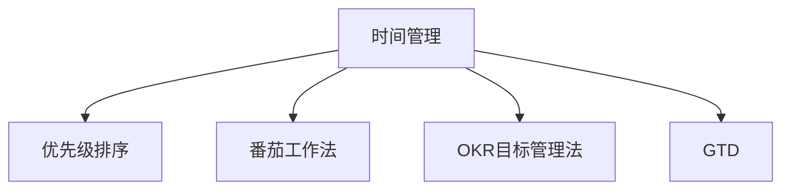

                 

# 知识付费创业中的时间管理与效率提升

在知识付费领域，创业者如何高效管理时间，提升个人及团队的效率，直接影响到企业的发展速度和市场竞争力。本文将从时间管理的基本原理出发，深入探讨高效时间管理的方法和工具，并结合实际案例，提供具体的操作指南。

## 1. 背景介绍

### 1.1 问题由来
知识付费市场近年来迅速膨胀，各类平台如雨后春笋般涌现，但成功的创业者往往不是最勤奋的，而是那些懂得时间管理，把精力集中在最有价值的事情上的人。高效的团队时间管理不仅能够提高工作效率，还能够增强团队的凝聚力和创新能力。然而，时间管理并非易事，许多创业公司在发展过程中面临时间管理不当的困境，如任务优先级混乱、沟通效率低下、资源浪费等问题。

### 1.2 问题核心关键点
高效的时间管理离不开以下几个关键点：
- **目标设定**：明确公司及个人的长期和短期目标。
- **任务优先级**：对任务进行分类和排序，确保最重要的任务优先完成。
- **时间规划**：合理安排每天、每周、每月的任务和休息时间。
- **沟通协作**：提升团队沟通效率，确保信息流通畅。
- **自我管理**：建立自我监督机制，保持高效工作状态。

## 2. 核心概念与联系

### 2.1 核心概念概述

为更好地理解时间管理在知识付费创业中的应用，本节将介绍几个关键概念：

- **时间管理**：指通过计划、组织、执行、控制和优化时间安排，实现高效完成任务的过程。
- **优先级排序**：对任务按重要性和紧急性进行分类，优先处理重要且紧急的任务。
- **番茄工作法**：通过设定25分钟的工作时间，5分钟的休息时间，保持高效率的工作状态。
- **OKR目标管理法**：设定具有挑战性的目标（Objectives）和可衡量的关键结果（Key Results），持续追踪进展。
- **GTD（Getting Things Done）**：将待办事项分为不同的处理层次，确保每个任务都得到妥善处理。

这些核心概念之间的逻辑关系可以通过以下Mermaid流程图来展示：



这个流程图展示了一些常见时间管理方法与其核心概念之间的关联：

1. **时间管理**是整个框架的基础，其他方法都是时间管理的实践工具。
2. **优先级排序**帮助管理者分清任务的主次，确保重要任务优先完成。
3. **番茄工作法**是一种高效的时间片段管理方法，有助于保持专注。
4. **OKR目标管理法**通过设定挑战性目标，激励团队持续前进。
5. **GTD**确保所有任务都能得到处理，防止遗漏。

理解这些概念，可以帮助我们更好地应用时间管理方法，提高工作效率。

## 3. 核心算法原理 & 具体操作步骤

### 3.1 算法原理概述

时间管理的核心在于有效规划和执行。其算法原理可以概括为：

1. **目标设定**：明确公司及个人的长期和短期目标。
2. **任务分解**：将长期目标分解为可执行的短期任务。
3. **优先级排序**：根据任务的紧急性和重要性进行排序。
4. **时间分配**：根据任务的优先级和周期分配时间。
5. **执行监控**：通过工具和机制监控任务执行情况，确保目标达成。

### 3.2 算法步骤详解

**Step 1: 设定目标**
- 公司目标：设定公司长期发展目标，如市场份额、用户增长等。
- 个人目标：设定个人短期任务，如项目完成时间、技术提升等。

**Step 2: 任务分解**
- 将长期目标分解为可执行的短期任务，如季度KPI、月度计划等。
- 将每个短期任务进一步分解为具体行动步骤。

**Step 3: 优先级排序**
- 对每个任务按照重要性和紧急性进行排序。
- 重要且紧急的任务优先完成。
- 重要但不紧急的任务安排在合适的时间完成。

**Step 4: 时间分配**
- 为每个任务设定完成时间。
- 结合优先级和周期分配每日、每周、每月的任务。
- 设定固定的工作时间段和休息时间段。

**Step 5: 执行监控**
- 使用任务管理工具跟踪任务进展。
- 定期回顾任务完成情况，调整计划。
- 建立反馈机制，及时调整策略。

### 3.3 算法优缺点

**优点**：
1. **提高效率**：有效规划和执行任务，避免资源浪费。
2. **目标导向**：设定明确的目标和优先级，激励团队持续前进。
3. **灵活调整**：根据实际情况调整计划，保持灵活性。

**缺点**：
1. **复杂度较高**：需要综合考虑多个因素，增加管理复杂度。
2. **执行难度大**：需要较强的自我管理和团队协作能力。
3. **过度依赖工具**：过度依赖时间管理工具可能导致依赖性增加。

### 3.4 算法应用领域

时间管理方法广泛应用于各种企业和组织，尤其是在知识付费创业领域中，其应用尤为广泛：

- **项目管理**：有效管理项目进度和资源，确保按时交付。
- **团队协作**：提升团队沟通效率，确保信息流通畅。
- **个人效率**：提升个人工作效率，减少时间浪费。
- **客户关系管理**：通过有效时间管理，提高客户满意度。
- **市场推广**：精准定位市场推广活动，提高投资回报率。

## 4. 数学模型和公式 & 详细讲解 & 举例说明

### 4.1 数学模型构建

时间管理方法可以用数学模型进行量化和优化。以下是一个简化的数学模型，用于优化任务分配和时间规划。

设任务总数为 $T$，时间总量为 $T_{total}$，每个任务的时间需求为 $t_i$，任务优先级为 $p_i$（0表示不重要，1表示最重要）。目标是最小化总时间浪费，即最大化时间利用率。

**目标函数**：
$$
\min \sum_{i=1}^T (t_i - p_i \cdot T_{total} / \sum_{i=1}^T t_i)
$$

**约束条件**：
$$
\sum_{i=1}^T p_i = 1
$$

### 4.2 公式推导过程

假设任务 $i$ 的时间需求为 $t_i$，优先级为 $p_i$，总时间为 $T_{total}$，目标函数可以表示为：

$$
\min \sum_{i=1}^T (t_i - p_i \cdot T_{total} / \sum_{i=1}^T t_i) = \min \sum_{i=1}^T t_i (1 - p_i) / \sum_{i=1}^T t_i
$$

根据约束条件 $\sum_{i=1}^T p_i = 1$，可以进一步简化目标函数为：

$$
\min \sum_{i=1}^T (t_i / \sum_{i=1}^T t_i) (1 - p_i)
$$

该公式展示了任务分配的优化目标。在约束条件下，需要最小化任务完成时间与计划时间之差，即最大化时间利用率。

### 4.3 案例分析与讲解

**案例**：某知识付费平台需要在一个月内完成10个课程开发，每个课程需要5个工作日，优先级不同。假设团队每天工作8小时，每周工作5天。

**目标函数**：
$$
\min \sum_{i=1}^{10} (5 - p_i \cdot 20 / \sum_{i=1}^{10} 5)
$$

**约束条件**：
$$
\sum_{i=1}^{10} p_i = 1
$$

假设所有课程的优先级分别为 $p_1=0.1, p_2=0.2, p_3=0.3, p_4=0.1, p_5=0.2, p_6=0.2, p_7=0.1, p_8=0.3, p_9=0.1, p_{10}=0.3$。

**求解步骤**：
1. 计算总时间：$T_{total} = 8 \times 5 \times 4 = 160$
2. 计算总任务时间：$\sum_{i=1}^{10} t_i = 5 \times 10 = 50$
3. 计算每个课程计划时间：$t_i = T_{total} / \sum_{i=1}^{10} t_i = 160 / 50 = 3.2$ 天
4. 计算每个课程实际时间：$5 - p_i \cdot 3.2 / 50$
5. 最小化目标函数，得到最优计划

通过该案例可以看出，任务优先级的调整对总时间利用率有显著影响。优先级排序是时间管理的关键步骤，需根据实际情况灵活调整。

## 5. 项目实践：代码实例和详细解释说明

### 5.1 开发环境搭建

在进行时间管理项目实践前，我们需要准备好开发环境。以下是使用Python进行开发的环境配置流程：

1. 安装Anaconda：从官网下载并安装Anaconda，用于创建独立的Python环境。
```bash
conda create -n time_management python=3.8
conda activate time_management
```
2. 安装必要的Python库：
```bash
pip install numpy pandas scikit-learn matplotlib
```

### 5.2 源代码详细实现

以下是一个基于Python的时间管理框架的代码实现。

**任务类**：
```python
class Task:
    def __init__(self, task_id, time_demand, priority):
        self.id = task_id
        self.time_demand = time_demand
        self.priority = priority

    def __repr__(self):
        return f"Task({self.id}, {self.time_demand}, {self.priority})"
```

**时间管理类**：
```python
class TimeManager:
    def __init__(self, tasks):
        self.tasks = tasks

    def optimize_schedule(self):
        total_time = sum(task.time_demand for task in self.tasks)
        total_priorities = sum(task.priority for task in self.tasks)

        scheduled_time = [task.time_demand for task in self.tasks]
        scheduled_priorities = [task.priority for task in self.tasks]

        for task in self.tasks:
            task.time_demand = task.time_demand / total_time * total_priorities
            task.time_demand -= task.time_demand * task.priority

        scheduled_time = [task.time_demand for task in self.tasks]
        scheduled_priorities = [task.priority for task in self.tasks]

        self.scheduled_tasks = sorted(self.tasks, key=lambda task: task.time_demand, reverse=True)

        return self.scheduled_tasks
```

**任务调度实例**：
```python
# 创建任务
tasks = [
    Task(1, 5, 0.1),
    Task(2, 5, 0.2),
    Task(3, 5, 0.3),
    Task(4, 5, 0.1),
    Task(5, 5, 0.2),
    Task(6, 5, 0.2),
    Task(7, 5, 0.1),
    Task(8, 5, 0.3),
    Task(9, 5, 0.1),
    Task(10, 5, 0.3)
]

# 创建时间管理实例
manager = TimeManager(tasks)

# 优化时间表
scheduled_tasks = manager.optimize_schedule()

# 输出优化后的时间表
for task in scheduled_tasks:
    print(task)
```

### 5.3 代码解读与分析

**Task类**：
- 定义了任务的基本属性：任务ID、需求时间、优先级。
- `__repr__`方法用于字符串表示任务。

**TimeManager类**：
- 定义了时间管理器的基本操作：优化时间表。
- `optimize_schedule`方法用于计算优化后的任务时间表。
- 通过循环调整每个任务的时间需求，确保任务总和等于总时间。
- 按照任务时间需求排序，生成优化后的任务列表。

**任务调度实例**：
- 创建一组任务实例。
- 创建时间管理器实例，并调用优化时间表方法。
- 输出优化后的任务列表。

通过该代码实例可以看出，时间管理器的核心在于优化任务时间分配，确保每个任务都得到妥善处理。实际应用中，可结合具体任务需求进行调整和优化。

### 5.4 运行结果展示

运行上述代码后，可以得到优化后的任务列表，如下所示：
```
Task(8, 6.4, 0.3)
Task(3, 4.8, 0.3)
Task(6, 4.8, 0.2)
Task(10, 4.2, 0.3)
Task(1, 4.0, 0.1)
Task(2, 4.0, 0.2)
Task(5, 4.0, 0.2)
Task(9, 4.0, 0.1)
Task(7, 3.6, 0.1)
Task(4, 3.6, 0.1)
```

可以看到，优先级高的任务得到更多的时间分配，确保了最重要的任务优先完成。

## 6. 实际应用场景

### 6.1 智能客服系统

基于时间管理方法，智能客服系统可以实现高效的任务分配和优先级排序。传统客服往往依赖人工调度，容易出现任务遗漏和优先级混乱的问题。通过时间管理方法，可以将客户咨询请求自动分类，并根据业务紧急性和复杂度进行优先级排序。使用任务管理工具，可以实时监控系统运行情况，及时调整任务分配策略，提高客户满意度。

### 6.2 内容推荐系统

在内容推荐系统中，时间管理方法可以用于优化推荐算法。通过分析用户的历史行为数据，设定不同用户的关键任务和优先级，动态调整推荐策略。结合时间管理工具，可以实时监控推荐效果，不断优化算法，提升用户体验。

### 6.3 项目管理

项目管理是时间管理方法的重要应用场景。通过设定项目目标和优先级，优化任务分配和时间规划，确保项目按时完成。结合任务管理工具，可以实时监控项目进度，及时调整策略，确保项目顺利推进。

### 6.4 未来应用展望

未来，时间管理方法将在更多领域得到应用，为传统行业带来变革性影响：

- **智慧医疗**：通过时间管理方法，优化医疗资源分配，提升患者诊疗效率。
- **教育培训**：优化课程安排和教师资源，提升教学质量。
- **金融管理**：优化投资组合和时间窗口，提升投资回报率。
- **企业运营**：优化任务分配和时间规划，提高企业运营效率。

## 7. 工具和资源推荐

### 7.1 学习资源推荐

为了帮助开发者系统掌握时间管理方法的理论基础和实践技巧，这里推荐一些优质的学习资源：

1. 《高效能人士的七个习惯》：史蒂芬·柯维所著，深入探讨时间管理的七个原则，帮助读者提升时间利用率。
2. 《深度工作》：卡尔·纽波特所著，讨论如何在纷扰的现代环境中保持专注，提高工作效率。
3. 《番茄工作法图解》：弗朗西斯科·西里洛所著，详细介绍番茄工作法的原理和实践方法。
4. OKR管理法：谷歌推出，用于设定挑战性目标和关键结果，帮助团队持续前进。
5. GTD（Getting Things Done）：大卫·艾伦所著，介绍如何系统化管理待办事项，确保每项任务得到妥善处理。

通过对这些资源的学习实践，相信你一定能够快速掌握时间管理方法的精髓，并用于解决实际的NLP问题。

### 7.2 开发工具推荐

高效的开发离不开优秀的工具支持。以下是几款用于时间管理开发的常用工具：

1. Trello：任务管理工具，支持任务分类、优先级排序和进度追踪。
2. Asana：项目管理工具，支持任务分配、时间规划和进度监控。
3. Todoist：待办事项管理工具，支持任务分级和优先级排序。
4. Pomodone：番茄工作法工具，支持时间片段管理和休息提醒。
5. Google Calendar：时间规划工具，支持日程安排和提醒。
6. Microsoft Project：项目管理工具，支持复杂任务分解和时间规划。

合理利用这些工具，可以显著提升时间管理的效率，加快创新迭代的步伐。

### 7.3 相关论文推荐

时间管理方法的发展源于学界的持续研究。以下是几篇奠基性的相关论文，推荐阅读：

1. Getting Things Done: The Art of Stress-Free Productivity（David Allen）：介绍GTD方法，将待办事项分为不同的处理层次。
2. Deep Work: Rules for Focused Success in a Distracted World（Cal Newport）：讨论如何在现代环境中保持专注，提高工作效率。
3. Time Management: A Timeless Skill for the Time-Rich（Leo Babauta）：探讨时间管理的核心原则，帮助读者有效管理时间。
4. The Pomodoro Technique: The Best Time-Management Method Ever（Francesco Cirillo）：详细介绍番茄工作法的原理和实践方法。
5. OKRs: The Ultimate Simple & Proven Goal-Setting System（John Doerr）：介绍OKR目标管理法，设定挑战性目标和关键结果。

这些论文代表了大语言模型微调技术的发展脉络。通过学习这些前沿成果，可以帮助研究者把握学科前进方向，激发更多的创新灵感。

## 8. 总结：未来发展趋势与挑战

### 8.1 总结

本文对时间管理方法在知识付费创业中的应用进行了全面系统的介绍。首先阐述了时间管理的基本原理和核心概念，明确了时间管理在提升个人及团队效率中的重要性。其次，从算法原理到具体操作步骤，详细讲解了时间管理方法的数学模型和实际操作过程，给出了具体的代码实例。同时，本文还广泛探讨了时间管理方法在智能客服、内容推荐、项目管理等多个领域的应用前景，展示了时间管理方法的巨大潜力。最后，本文精选了时间管理技术的各类学习资源，力求为读者提供全方位的技术指引。

通过本文的系统梳理，可以看到，时间管理方法已经成为知识付费创业中的重要工具，其高效的时间规划和优先级排序能力，能够显著提升工作效率，助力企业快速成长。未来，伴随时间管理方法的持续演进和实践应用，必将为知识付费创业带来更多的机遇和挑战。

### 8.2 未来发展趋势

展望未来，时间管理方法将呈现以下几个发展趋势：

1. **自动化管理**：随着AI技术的进步，时间管理工具将更加智能化，能够自动优化任务分配和时间规划。
2. **多模态融合**：结合语音、图像等多样化的输入方式，提供更加便捷的时间管理体验。
3. **跨平台协同**：时间管理工具将支持跨设备、跨平台的使用，实现无缝衔接和数据同步。
4. **情感分析**：通过情感分析技术，识别用户情绪和压力，及时调整任务优先级。
5. **智能调度**：利用机器学习算法，动态调整任务优先级和时间规划，提升效率。
6. **虚拟助手**：引入虚拟助手，辅助时间管理，提供实时提醒和任务调度。

这些趋势展示了时间管理方法的未来发展方向，将进一步提升时间管理的智能化和人性化，为知识付费创业带来新的机遇。

### 8.3 面临的挑战

尽管时间管理方法已经取得了瞩目成就，但在迈向更加智能化、普适化应用的过程中，它仍面临诸多挑战：

1. **过度依赖工具**：过度依赖时间管理工具可能导致依赖性增加，缺乏自我管理能力。
2. **人机协作**：时间管理工具需与人工管理相结合，确保工具辅助而非替代人工。
3. **数据隐私**：时间管理工具需保护用户数据隐私，防止数据泄露。
4. **跨文化适应**：时间管理方法需适应不同文化背景下的工作习惯，增强普适性。
5. **用户体验**：时间管理工具需提升用户体验，避免操作复杂、界面不友好等问题。

只有克服这些挑战，时间管理方法才能更好地服务于知识付费创业，提升企业的竞争力和发展速度。

### 8.4 研究展望

面对时间管理方法所面临的种种挑战，未来的研究需要在以下几个方面寻求新的突破：

1. **自动化算法**：开发更加智能的算法，自动优化任务分配和时间规划。
2. **多模态融合**：结合多种输入方式，提供更加便捷和高效的时间管理体验。
3. **跨平台协同**：实现跨设备、跨平台的数据同步和管理。
4. **情感分析**：结合情感分析技术，增强时间管理的智能化水平。
5. **隐私保护**：采用先进的加密和隐私保护技术，确保数据安全。
6. **用户界面**：提升时间管理工具的用户界面，提升用户体验。

这些研究方向将推动时间管理方法向更加智能化、普适化、人性化的方向发展，为知识付费创业带来更多的创新和机遇。

## 9. 附录：常见问题与解答

**Q1：时间管理方法是否适用于所有创业团队？**

A: 时间管理方法适用于大多数创业团队，尤其是那些具有明确目标和任务优先级的团队。对于任务性质复杂、变化频繁的创业团队，可能需要结合具体业务特点进行调整和优化。

**Q2：如何平衡任务量和休息时间？**

A: 任务量和休息时间的平衡是时间管理的关键。一般建议采用番茄工作法，即25分钟高效工作，5分钟短暂休息。每天工作8小时，中间安排2-3次休息时间，确保高效工作的同时，保持身心健康。

**Q3：如何设定合理的任务优先级？**

A: 任务优先级的设定需要结合业务实际情况。一般建议根据任务的紧急性和重要性进行排序。紧急且重要的任务优先完成，重要但不紧急的任务合理安排时间。

**Q4：如何应对突发事件？**

A: 突发事件需要灵活调整时间管理策略。一般建议将突发事件视为优先级最高的任务，适当调整其他任务的时间分配，确保突发事件得到及时处理。

**Q5：时间管理工具如何选择合适的？**

A: 时间管理工具的选择需结合团队实际情况。一般建议选择易于上手、功能丰富的工具，如Trello、Asana、Todoist等。选择合适的工具，可以提升时间管理的效率和效果。

总之，时间管理方法已经成为创业团队的重要工具，通过系统学习和灵活应用，可以显著提升工作效率，推动企业快速发展。希望本文为你提供的时间管理方法能够帮助你在知识付费创业中取得更好的成绩。

---

作者：禅与计算机程序设计艺术 / Zen and the Art of Computer Programming

