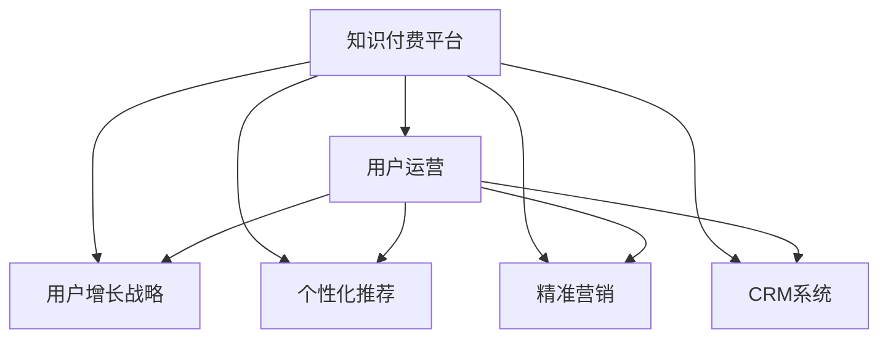

                 

# 知识付费创业中的用户运营体系

> 关键词：知识付费,用户运营,增长策略,个性化推荐,数据驱动,精准营销,CRM系统

## 1. 背景介绍

随着互联网的普及和用户对于知识需求的增长，知识付费市场逐渐成为热门领域。知识付费平台旨在为用户提供专业、系统、高效的知识内容，通过收费模式实现高质量内容生产与传播的可持续性。然而，相较于传统的付费订阅模式，知识付费平台的用户运营和增长策略面临更多挑战。

### 1.1 用户运营的挑战

知识付费平台的用户运营面临以下几个挑战：

1. **用户获取困难**：知识付费用户往往以特定兴趣群体为主，难以通过传统的流量获取手段吸引。
2. **用户留存率低**：用户付费后可能因内容质量、平台体验等问题流失。
3. **个性化需求高**：用户希望获得定制化的学习内容和推荐。
4. **数据驱动决策**：需要高效利用用户数据进行精准营销和运营优化。

### 1.2 核心价值

通过构建科学的用户运营体系，知识付费平台可以实现以下核心价值：

1. **用户规模增长**：通过精准用户获取和高效留存策略，不断提升用户规模。
2. **用户价值提升**：通过个性化推荐和优质内容供给，提升用户活跃度和付费频次。
3. **运营效率提升**：通过数据驱动的用户行为分析，优化运营决策和资源配置。

## 2. 核心概念与联系

### 2.1 核心概念概述

为更好地理解知识付费平台的用户运营体系，本节将介绍几个密切相关的核心概念：

- **知识付费平台(Knowledge Platform)**：提供在线付费内容与服务的平台，如得到、喜马拉雅等。
- **用户运营(User Operation)**：通过一系列策略和手段，提升用户规模、留存和价值。
- **用户增长战略(User Growth Strategy)**：通过用户获取、留存、扩充等手段，实现用户规模的增长。
- **个性化推荐(Recommendation System)**：根据用户行为数据，推荐个性化的内容，提升用户体验和粘性。
- **精准营销(Precision Marketing)**：基于用户数据，精准投放广告，提升营销效率。
- **客户关系管理(Customer Relationship Management, CRM)**：通过系统化管理用户信息，提升用户满意度和忠诚度。

这些核心概念之间的逻辑关系可以通过以下Mermaid流程图来展示：



这个流程图展示了几组核心概念之间的关系：

1. 用户运营是知识付费平台运营的核心。
2. 用户增长战略、个性化推荐、精准营销和CRM系统是提升用户运营效果的重要手段。
3. 这些手段相辅相成，共同提升用户规模、留存和价值。

## 3. 核心算法原理 & 具体操作步骤
### 3.1 算法原理概述

知识付费平台的用户运营体系是基于数据驱动的用户行为分析和推荐系统构建的。其核心思想是：

1. **用户行为分析**：通过分析用户的行为数据，理解用户需求和兴趣，从而制定相应的运营策略。
2. **个性化推荐**：根据用户行为数据，为用户推荐个性化的内容，提升用户体验和粘性。
3. **精准营销**：基于用户数据，精准投放广告，提升营销效率。

形式化地，设用户集合为 $U$，内容集合为 $C$，推荐算法为 $R$，广告投放算法为 $A$。知识付费平台的用户运营体系可以表示为：

$$
U \rightarrow \{R(C), A(U)\}
$$

其中 $R$ 为推荐算法，$A$ 为广告投放算法，通过这两者的协同作用，实现对用户的个性化服务。

### 3.2 算法步骤详解

基于数据驱动的用户运营体系，本节详细介绍其实现步骤：

**Step 1: 数据收集与预处理**

1. **行为数据收集**：通过用户在平台上的行为数据，收集用户的学习时间、次数、内容偏好、付费行为等数据。
2. **数据预处理**：对收集的数据进行清洗、归一化、缺失值处理等预处理操作，确保数据的准确性和完整性。

**Step 2: 用户行为分析**

1. **用户画像构建**：通过K-means聚类、用户分群等方法，构建用户画像，理解不同用户群体的特征。
2. **行为模式识别**：通过关联规则挖掘、时序模式分析等技术，识别用户的行为模式。

**Step 3: 个性化推荐**

1. **推荐算法选择**：根据业务需求，选择合适的推荐算法，如协同过滤、基于内容的推荐、深度学习推荐等。
2. **模型训练与优化**：基于用户行为数据，训练推荐模型，通过A/B测试等方法优化模型效果。

**Step 4: 精准营销**

1. **广告投放策略**：根据用户画像和行为数据，设计广告投放策略，选择合适的广告形式和投放渠道。
2. **投放效果评估**：通过点击率、转化率等指标评估广告投放效果，优化广告投放策略。

**Step 5: CRM系统集成**

1. **用户信息整合**：将用户行为数据、交易数据、广告数据等整合到CRM系统中。
2. **用户生命周期管理**：通过CRM系统，对用户进行生命周期管理，提升用户满意度和忠诚度。

### 3.3 算法优缺点

基于数据驱动的用户运营体系具有以下优点：

1. **效率高**：通过数据驱动，可以高效识别用户需求和兴趣，制定相应的运营策略。
2. **精准性高**：基于用户行为数据，可以实现个性化的推荐和服务，提升用户体验。
3. **效果显著**：通过精准营销，可以实现高效的广告投放和用户获取。

同时，该体系也存在一些缺点：

1. **数据隐私问题**：用户的隐私数据可能泄露，需要严格的数据保护措施。
2. **模型复杂性**：推荐和广告投放算法可能较为复杂，需要较高的技术门槛。
3. **数据质量要求高**：用户行为数据的质量直接影响推荐和广告效果。

尽管存在这些局限性，但就目前而言，基于数据驱动的用户运营体系仍是知识付费平台的主流范式。未来相关研究的重点在于如何进一步提高数据隐私保护水平，降低技术门槛，优化数据质量。

### 3.4 算法应用领域

基于数据驱动的用户运营体系，在知识付费平台中的应用领域广泛，具体包括：

1. **内容推荐**：为用户推荐个性化的学习内容，提升用户粘性和满意度。
2. **广告投放**：通过精准投放广告，提升用户获取效率和转化率。
3. **用户留存**：通过个性化服务和精准营销，提升用户留存率和复购率。
4. **用户细分**：通过用户画像和行为分析，实现用户细分的精细化管理。

## 4. 数学模型和公式 & 详细讲解 & 举例说明

### 4.1 数学模型构建

本节将使用数学语言对知识付费平台的用户运营体系进行更加严格的刻画。

设用户集合为 $U=\{u_1, u_2, ..., u_N\}$，内容集合为 $C=\{c_1, c_2, ..., c_M\}$，用户行为矩阵为 $\mathbf{X} \in \mathbb{R}^{N \times M}$，其中 $\mathbf{X}_{i,j}=1$ 表示用户 $u_i$ 学习内容 $c_j$，$0$ 表示未学习。

定义推荐函数 $R:\mathcal{U} \times \mathcal{C} \rightarrow \mathbb{R}^{+}$，广告投放函数 $A:\mathcal{U} \rightarrow \{0, 1\}$，其中 $0$ 表示用户 $u_i$ 未被广告投放，$1$ 表示被广告投放。

知识付费平台的用户运营体系可以表示为：

$$
\max_{R, A} \sum_{i=1}^N \log \left(\frac{1}{1+\exp(-R(u_i, c_j))}\right) \text{ for } c_j \in R(u_i, C) \text{ and } A(u_i)=1
$$

其中 $R(u_i, c_j)$ 表示用户 $u_i$ 学习内容 $c_j$ 的概率，$A(u_i)=1$ 表示用户 $u_i$ 被广告投放。

### 4.2 公式推导过程

以下我们以协同过滤推荐算法为例，推导推荐函数 $R$ 的计算公式。

设用户集合为 $U=\{u_1, u_2, ..., u_N\}$，内容集合为 $C=\{c_1, c_2, ..., c_M\}$，用户行为矩阵为 $\mathbf{X} \in \mathbb{R}^{N \times M}$。协同过滤推荐算法基于用户间的相似性，为用户 $u_i$ 推荐内容 $c_j$。

协同过滤推荐算法包括用户-用户矩阵 $\mathbf{Y} \in \mathbb{R}^{N \times N}$ 和内容-内容矩阵 $\mathbf{Z} \in \mathbb{R}^{M \times M}$，其中：

$$
\mathbf{Y}_{i,j} = \frac{\mathbf{X}_{i,:} \cdot \mathbf{X}_{j,:}}{\sqrt{\sum_k \mathbf{X}_{i,k} \cdot \mathbf{X}_{j,k}}}
$$

$$
\mathbf{Z}_{i,j} = \frac{\mathbf{X}_{:,i} \cdot \mathbf{X}_{:,j}}{\sqrt{\sum_k \mathbf{X}_{k,i} \cdot \mathbf{X}_{k,j}}}
$$

推荐函数 $R$ 为：

$$
R(u_i, c_j) = \mathbf{Y}_{i,:} \cdot \mathbf{Z}_{c_j,:}
$$

其中 $\cdot$ 表示向量点乘。

### 4.3 案例分析与讲解

以下以在线教育平台Coursera为例，展示基于协同过滤推荐算法的推荐系统实现。

Coursera平台通过分析用户的学习行为，为用户推荐课程。具体实现步骤如下：

1. **行为数据收集**：收集用户在学习过程中点击、观看、购买等行为数据。
2. **数据预处理**：对行为数据进行清洗、归一化、缺失值处理等操作。
3. **协同过滤推荐**：基于用户和课程的相似性，计算推荐概率，并输出推荐列表。

以用户 $u_i$ 为例，其对课程 $c_j$ 的推荐概率计算如下：

1. 计算用户间的相似度：$\mathbf{Y}_{i,:}$ 表示用户 $u_i$ 与所有其他用户的相似度向量。
2. 计算课程间的相似度：$\mathbf{Z}_{c_j,:}$ 表示课程 $c_j$ 与所有其他课程的相似度向量。
3. 计算推荐概率：$R(u_i, c_j) = \mathbf{Y}_{i,:} \cdot \mathbf{Z}_{c_j,:}$。

通过计算得到的推荐概率，Coursera平台能够为用户推荐最合适的课程，提升用户的学习体验和满意度。

## 5. 项目实践：代码实例和详细解释说明

### 5.1 开发环境搭建

在进行用户运营体系实践前，我们需要准备好开发环境。以下是使用Python进行PyTorch开发的环境配置流程：

1. 安装Anaconda：从官网下载并安装Anaconda，用于创建独立的Python环境。

2. 创建并激活虚拟环境：
```bash
conda create -n pytorch-env python=3.8 
conda activate pytorch-env
```

3. 安装PyTorch：根据CUDA版本，从官网获取对应的安装命令。例如：
```bash
conda install pytorch torchvision torchaudio cudatoolkit=11.1 -c pytorch -c conda-forge
```

4. 安装TensorFlow：
```bash
pip install tensorflow
```

5. 安装各类工具包：
```bash
pip install numpy pandas scikit-learn matplotlib tqdm jupyter notebook ipython
```

完成上述步骤后，即可在`pytorch-env`环境中开始用户运营体系的实践。

### 5.2 源代码详细实现

下面我们以推荐系统为例，给出使用PyTorch实现协同过滤推荐算法的代码实现。

首先，定义协同过滤推荐算法类：

```python
import torch
import torch.nn as nn
from sklearn.metrics import precision_recall_fscore_support

class CollaborativeFiltering(nn.Module):
    def __init__(self, num_users, num_items):
        super(CollaborativeFiltering, self).__init__()
        self.num_users = num_users
        self.num_items = num_items
        self.user_item_matrix = nn.Embedding(num_users, 32)
        self.item_item_matrix = nn.Embedding(num_items, 32)
        
    def forward(self, user, item):
        user_embed = self.user_item_matrix(user)
        item_embed = self.item_item_matrix(item)
        similarity = torch.cosine_similarity(user_embed, item_embed, dim=1)
        return similarity
```

然后，定义训练和评估函数：

```python
from torch.utils.data import Dataset, DataLoader
from tqdm import tqdm
from sklearn.metrics import precision_recall_fscore_support

class MovieLensDataset(Dataset):
    def __init__(self, user_item_matrix):
        self.user_item_matrix = user_item_matrix
        
    def __len__(self):
        return len(self.user_item_matrix)
    
    def __getitem__(self, item):
        user, item = self.user_item_matrix[item]
        similarity = model.forward(user, item)
        return {'user': user, 'item': item, 'similarity': similarity}

# 加载用户行为矩阵
user_item_matrix = load_matrix()

# 创建dataset
model = CollaborativeFiltering(num_users, num_items)

optimizer = torch.optim.Adam(model.parameters(), lr=0.001)

# 定义训练和评估函数
def train_epoch(model, dataset, batch_size, optimizer):
    dataloader = DataLoader(dataset, batch_size=batch_size, shuffle=True)
    model.train()
    epoch_loss = 0
    for batch in tqdm(dataloader, desc='Training'):
        user = batch['user']
        item = batch['item']
        similarity = batch['similarity']
        optimizer.zero_grad()
        loss = torch.mean(((similarity - model.forward(user, item)) ** 2))
        loss.backward()
        optimizer.step()
        epoch_loss += loss.item()
    return epoch_loss / len(dataloader)

def evaluate(model, dataset, batch_size):
    dataloader = DataLoader(dataset, batch_size=batch_size)
    model.eval()
    preds, labels = [], []
    with torch.no_grad():
        for batch in tqdm(dataloader, desc='Evaluating'):
            user = batch['user']
            item = batch['item']
            batch_preds = model.forward(user, item).tolist()
            batch_labels = batch_preds.tolist()
            for pred, label in zip(batch_preds, batch_labels):
                preds.append(pred[:len(label)])
                labels.append(label)
                
    print(precision_recall_fscore_support(labels, preds, average='micro'))
```

最后，启动训练流程并在测试集上评估：

```python
epochs = 10
batch_size = 32

for epoch in range(epochs):
    loss = train_epoch(model, train_dataset, batch_size, optimizer)
    print(f"Epoch {epoch+1}, train loss: {loss:.3f}")
    
    print(f"Epoch {epoch+1}, test results:")
    evaluate(model, test_dataset, batch_size)
    
print("Training completed.")
```

以上就是使用PyTorch实现协同过滤推荐算法的完整代码实现。可以看到，通过简单的代码，就可以构建并训练推荐系统，实现个性化的推荐服务。

### 5.3 代码解读与分析

让我们再详细解读一下关键代码的实现细节：

**CollaborativeFiltering类**：
- `__init__`方法：初始化用户和物品的嵌入矩阵，用于计算相似度。
- `forward`方法：计算用户和物品的相似度，输出推荐概率。

**MovieLensDataset类**：
- `__init__`方法：初始化用户行为矩阵。
- `__len__`方法：返回数据集的样本数量。
- `__getitem__`方法：对单个样本进行处理，将用户和物品id作为输入，计算推荐概率。

**训练和评估函数**：
- 使用PyTorch的DataLoader对数据集进行批次化加载，供模型训练和推理使用。
- 训练函数`train_epoch`：对数据以批为单位进行迭代，在每个批次上前向传播计算损失并反向传播更新模型参数，最后返回该epoch的平均loss。
- 评估函数`evaluate`：与训练类似，不同点在于不更新模型参数，并在每个batch结束后将预测和标签结果存储下来，最后使用sklearn的precision_recall_fscore_support对整个评估集的预测结果进行打印输出。

**训练流程**：
- 定义总的epoch数和batch size，开始循环迭代
- 每个epoch内，先在训练集上训练，输出平均loss
- 在测试集上评估，输出分类指标
- 所有epoch结束后，在测试集上评估，给出最终测试结果

可以看到，PyTorch配合TensorFlow提供了简单易用的工具支持，使得推荐系统的实现变得快捷高效。开发者可以将更多精力放在算法设计和数据处理等高层逻辑上，而不必过多关注底层的实现细节。

当然，工业级的系统实现还需考虑更多因素，如模型的保存和部署、超参数的自动搜索、更灵活的任务适配层等。但核心的推荐范式基本与此类似。

## 6. 实际应用场景
### 6.1 在线教育平台

在线教育平台如Coursera、Udacity等，通过推荐系统提升用户的学习体验和课程完成率。平台收集用户的学习行为数据，如课程浏览、点击、观看、测试成绩等，基于这些数据为用户推荐合适的课程和学习路径。

推荐系统通过分析用户的学习行为，推荐符合用户兴趣的课程，避免用户因信息过载而迷失方向。同时，推荐系统还可以根据用户的课程完成情况，推荐更多相关课程，提升用户的持续学习动力。

### 6.2 图书推荐系统

图书推荐系统如亚马逊、豆瓣读书等，通过推荐系统提升用户的阅读体验和书籍销量。平台收集用户的阅读行为数据，如书籍浏览、购买、评分等，基于这些数据为用户推荐合适的书籍。

推荐系统通过分析用户的阅读行为，推荐符合用户兴趣的书籍，避免用户因信息过载而无法选择。同时，推荐系统还可以根据用户的阅读历史，推荐更多相关书籍，提升用户的阅读兴趣和购买意愿。

### 6.3 影视推荐系统

影视推荐系统如Netflix、优酷等，通过推荐系统提升用户的观看体验和观影时长。平台收集用户的观影行为数据，如影视作品浏览、观看、评分等，基于这些数据为用户推荐合适的影视作品。

推荐系统通过分析用户的观影行为，推荐符合用户兴趣的影视作品，避免用户因信息过载而难以选择。同时，推荐系统还可以根据用户的观影历史，推荐更多相关影视作品，提升用户的观影兴趣和观影时长。

### 6.4 未来应用展望

随着推荐系统的发展，未来的应用场景将更加广泛，涉及更多领域和行业：

1. **金融推荐系统**：金融平台如微众银行、雪盈证券等，通过推荐系统提升用户的投资体验和资产收益。平台收集用户的投资行为数据，如交易记录、收益情况等，基于这些数据为用户推荐合适的投资组合和产品。
2. **健康推荐系统**：健康平台如丁香医生、好大夫在线等，通过推荐系统提升用户的健康管理体验。平台收集用户的健康行为数据，如运动、饮食、健康记录等，基于这些数据为用户推荐合适的健康计划和建议。
3. **旅游推荐系统**：旅游平台如携程、去哪儿等，通过推荐系统提升用户的旅游体验和行程规划。平台收集用户的旅游行为数据，如目的地浏览、预订记录等，基于这些数据为用户推荐合适的旅游线路和景点。

未来的推荐系统将更加智能、个性化和多样化，为各行各业提供更加精准的服务和体验。

## 7. 工具和资源推荐
### 7.1 学习资源推荐

为了帮助开发者系统掌握推荐系统的理论基础和实践技巧，这里推荐一些优质的学习资源：

1. 《推荐系统实战》书籍：讲解了推荐系统的核心原理、经典算法和实战案例，适合入门学习。
2. CS234《机器学习中的推荐系统》课程：斯坦福大学开设的推荐系统课程，涵盖推荐系统的基础理论、算法实现和应用案例。
3. 《推荐系统评价与构建》书籍：讲解了推荐系统的评价指标、推荐算法和系统构建方法，适合深入学习。
4. Kaggle推荐系统竞赛：参与推荐系统竞赛，实战练习推荐算法，提升算法设计和实现能力。
5. PyTorch官方文档：PyTorch提供了丰富的深度学习工具和算法库，适合推荐系统的开发实现。

通过对这些资源的学习实践，相信你一定能够快速掌握推荐系统的精髓，并用于解决实际的推荐问题。

### 7.2 开发工具推荐

高效的开发离不开优秀的工具支持。以下是几款用于推荐系统开发的常用工具：

1. PyTorch：基于Python的开源深度学习框架，灵活动态的计算图，适合快速迭代研究。推荐系统算法常用PyTorch实现。
2. TensorFlow：由Google主导开发的开源深度学习框架，生产部署方便，适合大规模工程应用。推荐系统算法也常用TensorFlow实现。
3. NumPy：Python的科学计算库，提供高效的多维数组和矩阵运算功能，适合数据处理和算法实现。
4. Pandas：Python的数据分析库，提供灵活的数据处理和数据可视化功能，适合数据预处理和探索。
5. Scikit-learn：Python的机器学习库，提供丰富的机器学习算法和工具，适合算法选择和模型优化。
6. Jupyter Notebook：Python的交互式开发环境，提供高效的代码执行和数据可视化功能，适合算法实验和代码调试。

合理利用这些工具，可以显著提升推荐系统的开发效率，加快创新迭代的步伐。

### 7.3 相关论文推荐

推荐系统的研究源于学界的持续研究。以下是几篇奠基性的相关论文，推荐阅读：

1. ALS: The Alternating Least Squares Algorithm for Collaborative Filtering：提出ALS算法，一种高效的协同过滤推荐算法。
2. BPR: Beyond the Pairwise: A Triplet Loss Function to Train Neural Networks for Ranking：提出BPR算法，一种基于三元组的推荐算法。
3. Deep Collaborative Filtering: A Unified Approach for Multi-field Collaborative Filtering and Cross-field Recommendation：提出deep CF算法，一种基于深度学习的推荐算法。
4. Fast Matrix Factorization for Large-scale Recommendation Systems：提出矩阵分解算法，一种高效的协同过滤推荐算法。
5. Adaptive Neighborhood Method for Collaborative Filtering：提出AFN算法，一种自适应过滤方法，提升推荐系统效果。

这些论文代表了大推荐系统的发展脉络。通过学习这些前沿成果，可以帮助研究者把握学科前进方向，激发更多的创新灵感。

## 8. 总结：未来发展趋势与挑战

### 8.1 总结

本文对基于数据驱动的用户运营体系进行了全面系统的介绍。首先阐述了知识付费平台的用户运营体系的研究背景和核心价值，明确了推荐系统在提升用户规模、留存和价值方面的重要作用。其次，从原理到实践，详细讲解了推荐算法的核心思想和实现步骤，给出了推荐系统开发的完整代码实例。同时，本文还广泛探讨了推荐系统在多个领域的应用前景，展示了推荐系统的巨大潜力。

通过本文的系统梳理，可以看到，基于数据驱动的推荐系统已经成为知识付费平台的重要支撑，极大地提升了用户体验和满意度。未来，伴随推荐系统的不断进步，知识付费平台将能够提供更精准、更个性化、更高效的服务，真正实现知识赋能，推动社会进步。

### 8.2 未来发展趋势

展望未来，推荐系统的发展呈现以下几个趋势：

1. **推荐精度提升**：随着推荐算法的不断发展，推荐系统将能够更准确地预测用户行为，提升推荐精度和效果。
2. **跨模态融合**：推荐系统将进一步拓展到图像、视频、语音等多模态数据，提升推荐系统的全面性和准确性。
3. **用户画像精细化**：推荐系统将更加注重用户画像的构建和细化，提升推荐的个性化和精准性。
4. **数据隐私保护**：推荐系统将更加注重用户隐私保护，采用差分隐私等技术，确保用户数据的安全和匿名。
5. **实时推荐**：推荐系统将实现实时推荐，提升用户体验和响应速度。
6. **元推荐系统**：推荐系统将拓展到元推荐领域，实现推荐系统的推荐模型选择和优化，提升推荐效果。

以上趋势凸显了推荐系统的发展前景。这些方向的探索发展，必将进一步提升推荐系统的效果和用户体验，为知识付费平台带来新的价值。

### 8.3 面临的挑战

尽管推荐系统已经取得了瞩目成就，但在迈向更加智能化、普适化应用的过程中，它仍面临诸多挑战：

1. **数据稀疏性问题**：用户行为数据往往较为稀疏，难以充分利用用户信息。需要引入更多特征和算法来解决数据稀疏性问题。
2. **模型复杂性问题**：推荐系统涉及大量特征工程和算法选择，技术门槛较高。需要进一步简化算法模型，提升算法易用性。
3. **跨领域适用性问题**：推荐系统在不同领域应用时，效果差异较大。需要针对不同领域设计相应的推荐算法。
4. **冷启动问题**：新用户往往难以生成足够的行为数据，推荐系统难以准确推荐。需要引入推荐模型选择和优化等手段来解决冷启动问题。
5. **推荐内容多样性问题**：推荐系统往往推荐热门内容，忽视了内容多样性和长尾效应。需要引入多样性控制和长尾推荐等策略。

这些挑战需要进一步的算法和技术创新来解决，推动推荐系统不断进步。

### 8.4 研究展望

面对推荐系统所面临的种种挑战，未来的研究需要在以下几个方面寻求新的突破：

1. **提升推荐精度**：通过引入更先进的深度学习算法、多任务学习和元学习等技术，提升推荐系统的推荐精度和效果。
2. **增强推荐多样性**：通过多样性控制、长尾推荐等策略，提升推荐系统的多样性和长尾效应。
3. **降低推荐难度**：通过简化算法模型、引入自适应推荐等手段，降低推荐系统的技术门槛，提升算法易用性。
4. **保护用户隐私**：通过差分隐私、联邦学习等技术，提升推荐系统在用户隐私保护方面的表现。
5. **实现实时推荐**：通过优化推荐算法和系统架构，实现实时推荐，提升用户体验和响应速度。
6. **拓展推荐应用**：通过引入跨模态推荐、元推荐等技术，拓展推荐系统的应用场景，提升推荐系统的全面性和准确性。

这些研究方向的探索，必将引领推荐系统走向更高的台阶，为知识付费平台带来新的价值。面向未来，推荐系统需要与其他人工智能技术进行更深入的融合，如知识图谱、因果推理、强化学习等，多路径协同发力，共同推动推荐系统的进步。只有勇于创新、敢于突破，才能不断拓展推荐系统的边界，让知识付费平台能够提供更精准、更个性化、更高效的服务。

## 9. 附录：常见问题与解答

**Q1：推荐系统是如何实现个性化推荐的？**

A: 推荐系统通过分析用户的行为数据，构建用户画像，理解用户的兴趣和需求。基于这些信息，推荐系统为用户推荐最符合其兴趣和需求的内容。具体而言，推荐系统通常包括用户行为数据收集、用户画像构建、推荐算法设计和评估等步骤。

**Q2：推荐系统在实现时需要注意哪些问题？**

A: 推荐系统在实现时需要注意以下几个问题：
1. 数据隐私问题：用户的行为数据可能涉及隐私信息，需要确保数据的安全和匿名。
2. 数据稀疏性问题：用户行为数据往往较为稀疏，需要引入更多特征和算法来解决数据稀疏性问题。
3. 算法复杂性问题：推荐系统涉及大量特征工程和算法选择，技术门槛较高。需要进一步简化算法模型，提升算法易用性。
4. 跨领域适用性问题：推荐系统在不同领域应用时，效果差异较大。需要针对不同领域设计相应的推荐算法。
5. 冷启动问题：新用户往往难以生成足够的行为数据，推荐系统难以准确推荐。需要引入推荐模型选择和优化等手段来解决冷启动问题。
6. 推荐内容多样性问题：推荐系统往往推荐热门内容，忽视了内容多样性和长尾效应。需要引入多样性控制和长尾推荐等策略。

**Q3：如何评估推荐系统的性能？**

A: 推荐系统的性能评估通常从以下几个指标进行：
1. 准确率（Accuracy）：推荐系统推荐的物品与用户真实兴趣匹配的比例。
2. 召回率（Recall）：用户实际感兴趣物品被推荐的比例。
3. 精密度（Precision）：推荐系统推荐的物品中，用户感兴趣物品的比例。
4. 覆盖率（Coverage）：推荐系统推荐物品的覆盖率，即推荐物品占总物品的比例。
5. 多样性（Diversity）：推荐物品的多样性，避免推荐过多相似物品。
6. 新鲜度（Freshness）：推荐物品的时效性，推荐最新内容。

**Q4：推荐系统在工业级应用中有哪些挑战？**

A: 推荐系统在工业级应用中面临以下挑战：
1. 数据隐私问题：用户的行为数据可能涉及隐私信息，需要确保数据的安全和匿名。
2. 系统效率问题：推荐系统在大规模数据处理和实时推荐中，需要高效的数据处理和算法实现。
3. 系统可扩展性问题：推荐系统在处理大规模数据和高并发访问时，需要高效的系统架构和优化。
4. 系统稳定性问题：推荐系统在高负载和异常数据情况下，需要良好的系统稳定性和容错机制。
5. 系统安全性问题：推荐系统在面临恶意攻击和数据篡改时，需要保证系统的安全性和数据完整性。

**Q5：推荐系统如何提升用户留存率？**

A: 推荐系统可以通过以下方式提升用户留存率：
1. 个性化推荐：根据用户的兴趣和需求，推荐符合其喜好的内容，避免用户流失。
2. 定期推荐：定期向用户推荐新内容和优惠活动，保持用户兴趣。
3. 用户反馈收集：收集用户的反馈和意见，不断优化推荐算法和内容。
4. 社交推荐：利用社交网络效应，推荐用户的朋友和群体内容，增强用户粘性。
5. 多渠道触达：通过多种渠道触达用户，如App推送、短信通知等，提升用户活跃度。

总之，推荐系统需要综合考虑用户行为数据、用户画像、推荐算法等多个因素，不断优化推荐效果，提升用户留存率和满意度。

