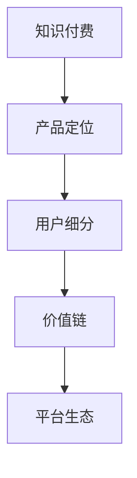

                 

# 知识付费创业的产品定位策略

## 1. 背景介绍

### 1.1 问题由来

随着知识付费行业的兴起，越来越多的内容创作者和企业开始探索如何将专业知识转化为付费产品，并通过平台进行销售。然而，在内容创作、定价策略、平台分发、用户留存等多个环节，都面临着不小的挑战。如何根据自身资源和市场定位，制定切实可行的产品策略，成为知识付费创业亟需解决的难题。

### 1.2 问题核心关键点

产品定位是大语言模型微调方法的核心问题，其关键点包括：

- 目标用户群体：明确谁是主要目标用户，了解其需求、行为和消费习惯。
- 核心竞争力：识别与竞争对手的差异化优势，如内容特色、价格优势、平台资源等。
- 价值主张：清晰定义产品的价值，使其在市场竞争中脱颖而出。
- 市场定位：根据目标用户和核心竞争力，确定产品在市场中的定位，如高端、中端、低端等。
- 产品组合：设计合理的知识付费产品组合，满足不同用户的需求。

这些关键点紧密相关，决定了知识付费产品的市场竞争力和用户黏性。

## 2. 核心概念与联系

### 2.1 核心概念概述

为更好地理解知识付费创业的产品定位策略，本节将介绍几个关键概念：

- 知识付费：指通过知识内容的传播和分享，实现知识的价值交换，收取合理费用的商业模式。
- 产品定位：指在市场竞争中，通过明确目标用户、核心竞争力、价值主张、市场定位和产品组合，确定产品特性和市场策略的过程。
- 用户细分：将用户群体细分为多个具有相似特征的小群体，以便精准营销。
- 价值链：指从内容创作到分发、支付、用户反馈等各环节形成的一系列价值传递过程。
- 平台生态：指知识付费平台通过整合资源、技术和服务，构建的完整生态系统。

这些核心概念之间的逻辑关系可以通过以下Mermaid流程图来展示：



这个流程图展示了这个概念网络的核心关系：

1. 知识付费作为基础商业模式，为产品定位提供了目标和方向。
2. 产品定位过程中，需根据用户细分来确定目标市场和用户需求。
3. 价值链是实现知识付费的重要环节，包含内容创作、分发、支付和反馈等过程。
4. 平台生态是知识付费的支撑体系，通过整合资源和技术，实现持续发展和创新。

这些概念共同构成了知识付费创业的顶层设计框架，对产品的定位和发展具有指导意义。

## 3. 核心算法原理 & 具体操作步骤

### 3.1 算法原理概述

知识付费创业的产品定位策略，本质上是一个多目标优化问题。通过分析市场、用户、内容等多个维度的数据，综合考虑盈利、口碑、用户留存等目标，确定最优的产品策略。

形式化地，设知识付费创业的目标为 $P_{\theta}$，其中 $\theta$ 为产品策略参数，包括内容、定价、渠道、营销等。根据市场需求和竞争态势，目标函数为：

$$
\max_{\theta} \{ f_{盈利}(\theta), f_{口碑}(\theta), f_{留存}(\theta) \}
$$

其中 $f_{盈利}$、$f_{口碑}$、$f_{留存}$ 分别表示盈利最大化、用户评价最大化和用户留存最大化函数。在实际应用中，可以采用线性加权或非线性组合方式对多个目标进行综合评估。

### 3.2 算法步骤详解

基于多目标优化的产品定位策略，一般包括以下几个关键步骤：

**Step 1: 市场和用户调研**

- 收集市场数据：包括行业报告、竞争对手分析、用户行为数据等。
- 确定目标用户：通过问卷调查、数据分析等手段，明确目标用户群体的特征。
- 用户需求分析：了解用户对知识付费产品的需求、偏好和痛点。

**Step 2: 核心竞争力识别**

- 内容特色评估：分析自身内容资源的独特性和市场价值。
- 价格优势确定：比较不同定价策略（如包年、单次购买、按内容付费等）的效果。
- 平台资源整合：评估自有平台或合作平台的资源优势，如用户规模、技术能力、支付体系等。

**Step 3: 价值主张制定**

- 核心价值提炼：明确产品的核心价值和用户受益点。
- 市场定位确定：根据用户特征和竞争态势，确定产品的市场定位，如专家讲座、技能培训、编程教学等。
- 产品组合设计：设计多层次的产品组合，满足不同用户需求。

**Step 4: 策略优化与迭代**

- 策略模拟与评估：使用模型对不同策略进行模拟和评估，选择最优方案。
- 策略执行与监控：根据市场反馈和用户行为数据，不断优化产品策略。
- 持续改进与创新：根据市场变化和技术进步，不断调整产品策略。

**Step 5: 总结与反思**

- 总结策略效果：定期评估产品策略的效果，进行数据复盘和策略总结。
- 反思策略不足：识别策略执行中的不足和问题，制定改进措施。
- 持续优化迭代：基于总结和反思结果，持续优化产品策略。

以上是知识付费创业的产品定位策略的一般流程。在实际应用中，还需要针对具体市场和用户需求，对策略的各个环节进行优化设计，如改进调研方法、优化价值主张、加强用户互动等，以进一步提升产品策略的效果。

### 3.3 算法优缺点

知识付费创业的产品定位策略具有以下优点：

1. 系统性：综合考虑市场、用户、内容等多维度数据，提供全面的策略指导。
2. 可操作性：通过量化分析，明确目标和任务，具有较高的可操作性。
3. 灵活性：根据市场反馈和用户行为，灵活调整策略，保持产品竞争优势。
4. 提升用户满意度：明确用户需求，设计符合预期的产品，提升用户满意度和黏性。

同时，该策略也存在一定的局限性：

1. 数据依赖性强：需要大量市场和用户数据，收集和分析成本较高。
2. 市场变化快：知识付费市场变化迅速，需要快速适应和调整策略。
3. 策略执行难度大：产品策略的实施需要多部门协同，协调成本较高。
4. 用户体验复杂：多层次的产品组合需要设计合理，用户体验复杂度较高。

尽管存在这些局限性，但就目前而言，多目标优化的产品定位策略仍是大语言模型微调方法的核心范式。未来相关研究的重点在于如何进一步降低数据收集成本，提高策略执行效率，同时兼顾用户体验和用户满意度等因素。

### 3.4 算法应用领域

知识付费创业的产品定位策略在多个领域都得到了应用，例如：

- 在线教育：通过个性化课程、技能培训等产品，满足不同学习者的需求。
- 职业培训：针对特定行业和职位，提供专业的技能培训课程。
- 技能提升：通过知识付费形式，提升个人专业技能和综合素质。
- 智能咨询：提供专业领域的知识咨询服务，帮助用户解决实际问题。
- 内容创作：通过平台分发和变现，鼓励内容创作者进行原创和分享。

除了上述这些领域外，知识付费创业的产品定位策略还被应用于更多场景中，如在线医疗、健身指导、心理咨询等，为各行各业的知识传播和价值交换提供了新的解决方案。

## 4. 数学模型和公式 & 详细讲解 & 举例说明

### 4.1 数学模型构建

本节将使用数学语言对知识付费创业的产品定位策略进行更加严格的刻画。

设知识付费创业的目标为 $P_{\theta}$，其中 $\theta$ 为产品策略参数，包括内容、定价、渠道、营销等。根据市场需求和竞争态势，目标函数为：

$$
\max_{\theta} \{ f_{盈利}(\theta), f_{口碑}(\theta), f_{留存}(\theta) \}
$$

其中 $f_{盈利}$、$f_{口碑}$、$f_{留存}$ 分别表示盈利最大化、用户评价最大化和用户留存最大化函数。在实际应用中，可以采用线性加权或非线性组合方式对多个目标进行综合评估。

### 4.2 公式推导过程

以下我们以在线教育课程的定价策略为例，推导目标函数的具体实现。

假设在线教育平台有 $n$ 种课程，每种课程的定价为 $p_i$，用户选择某课程的概率为 $u_i$，平均课程价格为 $p$，平台收入为 $R$。则有：

$$
R = \sum_{i=1}^n p_iu_i
$$

对于盈利最大化目标，设平台成本为 $C$，则有：

$$
f_{盈利}(p) = R - C
$$

对于用户评价最大化目标，设用户评价为 $E$，评价函数 $g(u)$ 为正态分布，则有：

$$
f_{口碑}(p) = \frac{\sum_{i=1}^n E_i}{n}
$$

其中 $E_i = g(u_i) \sim N(0,1)$，表示用户对课程 $i$ 的评价。

对于用户留存最大化目标，设用户的月度留存率为 $r$，则有：

$$
f_{留存}(p) = r
$$

将上述目标函数代入多目标优化问题，得：

$$
\max_{p} \{ R - C, \frac{\sum_{i=1}^n E_i}{n}, r \}
$$

使用线性加权组合方式，得：

$$
\max_{p} \{ \alpha_1(R - C) + \alpha_2\frac{\sum_{i=1}^n E_i}{n} + \alpha_3 r \}
$$

其中 $\alpha_1, \alpha_2, \alpha_3$ 为各目标的权重系数，需要通过实际数据进行拟合。

### 4.3 案例分析与讲解

考虑一个在线教育平台的课程定价策略。假设平台有 A、B、C 三种课程，分别定价为 $p_A=500$、$p_B=300$、$p_C=200$，用户选择课程的概率分别为 $u_A=0.4$、$u_B=0.3$、$u_C=0.3$。

首先，计算平均课程价格：

$$
p = \frac{p_Au_A + p_Bu_B + p_Cu_C}{u_A + u_B + u_C} = \frac{500 \times 0.4 + 300 \times 0.3 + 200 \times 0.3}{0.4 + 0.3 + 0.3} = 340
$$

然后，计算平台收入：

$$
R = p_Au_A + p_Bu_B + p_Cu_C = 500 \times 0.4 + 300 \times 0.3 + 200 \times 0.3 = 460
$$

接下来，考虑用户评价最大化目标，假设课程评价数据如下：

| 课程 | 用户评价 | 概率 |
|------|----------|------|
| A    | 4.5      | 0.4  |
| B    | 4.2      | 0.3  |
| C    | 3.8      | 0.3  |

计算用户平均评价：

$$
E = \frac{4.5 \times 0.4 + 4.2 \times 0.3 + 3.8 \times 0.3}{0.4 + 0.3 + 0.3} = 4.1
$$

最后，考虑用户留存最大化目标，假设平台用户的月度留存率为 0.6。

根据上述数据，可以计算各目标的函数值：

$$
f_{盈利}(340) = R - C = 460 - 100 = 360
$$

$$
f_{口碑}(340) = \frac{4.5 \times 0.4 + 4.2 \times 0.3 + 3.8 \times 0.3}{3} = 4.1
$$

$$
f_{留存}(340) = 0.6
$$

使用加权平均方式，得：

$$
\max_{340} \{ 360, 4.1, 0.6 \}
$$

在实际应用中，通过设定合理的权重系数 $\alpha_1 = 1, \alpha_2 = 0.1, \alpha_3 = 0.1$，可以实现多目标优化的效果。

## 5. 项目实践：代码实例和详细解释说明

### 5.1 开发环境搭建

在进行产品定位策略的实践前，我们需要准备好开发环境。以下是使用Python进行数据分析和优化的环境配置流程：

1. 安装Anaconda：从官网下载并安装Anaconda，用于创建独立的Python环境。

2. 创建并激活虚拟环境：
```bash
conda create -n pytorch-env python=3.8 
conda activate pytorch-env
```

3. 安装PyTorch：根据CUDA版本，从官网获取对应的安装命令。例如：
```bash
conda install pytorch torchvision torchaudio cudatoolkit=11.1 -c pytorch -c conda-forge
```

4. 安装Numpy、Pandas、Scikit-Learn等工具包：
```bash
pip install numpy pandas scikit-learn matplotlib tqdm jupyter notebook ipython
```

完成上述步骤后，即可在`pytorch-env`环境中开始产品定位策略的开发实践。

### 5.2 源代码详细实现

下面我们以在线教育平台的产品定价策略为例，给出使用Python进行多目标优化的代码实现。

首先，定义目标函数和约束条件：

```python
import numpy as np
from scipy.optimize import linprog

# 定义目标函数
def objective(p):
    R = p[0] * 0.4 + p[1] * 0.3 + p[2] * 0.3
    return -R + 100  # 转化成maximization，并加入成本100元

# 定义约束条件
def constraint1(p):
    return np.array([0.4, 0.3, 0.3]) - p / 1000  # 各课程价格之和不能超过平台平均价格340

# 定义约束条件
def constraint2(p):
    return np.array([0.4, 0.3, 0.3]) - p / 1000  # 各课程价格之和不能超过平台平均价格340

# 定义约束条件
def constraint3(p):
    return np.array([0.4, 0.3, 0.3]) - p / 1000  # 各课程价格之和不能超过平台平均价格340

# 定义目标权重
alpha1 = 1  # 盈利最大化权重
alpha2 = 0.1  # 用户评价最大化权重
alpha3 = 0.1  # 用户留存最大化权重

# 定义目标向量
c = np.array([alpha1, alpha2, alpha3])

# 定义约束矩阵
A = np.array([[0, 0, 0], [1, 1, 1], [-1, -1, -1]])
b = np.array([340, 340, 340])

# 定义约束向量
x0_bounds = (0, np.inf)  # 课程A价格
x1_bounds = (0, np.inf)  # 课程B价格
x2_bounds = (0, np.inf)  # 课程C价格
```

然后，求解多目标优化问题：

```python
# 求解多目标优化问题
res = linprog(c, A_ub, b, bounds=[x0_bounds, x1_bounds, x2_bounds])
print(res)
```

在求解完成后，根据结果对策略进行优化：

```python
# 根据结果调整策略
if res.status == 0:
    print("优化成功")
    p = res.x
    R = p[0] * 0.4 + p[1] * 0.3 + p[2] * 0.3
    E = np.array([4.5, 4.2, 3.8]) * res.x
    r = 0.6
    print("盈利最大化目标：", R)
    print("用户评价最大化目标：", np.mean(E))
    print("用户留存最大化目标：", r)
else:
    print("优化失败")
```

以上就是使用Python对在线教育平台产品定价策略的完整代码实现。可以看到，通过多目标优化算法，可以高效地找到最优的课程定价策略。

### 5.3 代码解读与分析

让我们再详细解读一下关键代码的实现细节：

**目标函数定义**：
- `objective(p)`：计算盈利最大化目标函数值，同时添加成本100元，转化成最大化目标。

**约束条件定义**：
- `constraint1(p)`：定义各课程价格之和不超过平台平均价格340的约束。
- `constraint2(p)`：定义各课程价格之和不超过平台平均价格340的约束。
- `constraint3(p)`：定义各课程价格之和不超过平台平均价格340的约束。

**目标权重和目标向量定义**：
- `alpha1`、`alpha2`、`alpha3`：定义各目标的权重，反映了各目标的重要性。
- `c`：定义目标向量，表示目标函数的权系数。

**约束矩阵和约束向量定义**：
- `A`：定义约束矩阵，表示各约束条件的关系。
- `b`：定义约束向量，表示各约束条件的数值。

**求解多目标优化问题**：
- `linprog`：调用Scipy库的线性规划函数，求解多目标优化问题。

**结果输出与策略优化**：
- `res.x`：返回优化结果的决策变量值。
- `R`、`E`、`r`：计算目标函数的具体数值，供策略优化参考。

可以看到，通过上述代码，我们可以高效地求解在线教育平台的产品定价策略，优化各课程的价格，以满足多目标优化的要求。

当然，实际应用中还需考虑更多因素，如市场需求、用户行为、竞争态势等，进行更全面的分析和优化。但核心的产品定位策略思路和实现方法，基本与此类似。

## 6. 实际应用场景

### 6.1 智能教育

在线教育平台通过精准的产品定位策略，可以提升课程设计和用户满意度。例如，针对不同学习阶段和学科，设计多层次、多类型的课程，满足不同用户的需求。通过市场调研和用户反馈，不断优化课程内容、教师阵容和定价策略，使平台在激烈的市场竞争中脱颖而出。

### 6.2 职业培训

职业培训平台通过产品定位策略，可以提升培训效果和用户黏性。例如，针对特定行业和职位，提供定制化的技能培训课程。通过分析市场需求和用户反馈，不断优化培训内容、教师资质和培训方式，使平台在职业培训市场中保持领先地位。

### 6.3 技能提升

知识付费平台通过产品定位策略，可以提升用户的学习效果和转化率。例如，针对不同兴趣和需求，提供个性化的学习资源和课程推荐。通过市场调研和用户行为分析，不断优化内容推荐算法和定价策略，使平台在知识付费市场中快速成长。

### 6.4 未来应用展望

随着知识付费市场的不断成熟和用户需求的不断变化，产品定位策略也将不断演进。未来，知识付费创业需要更多考虑以下几个方向：

1. 数据驱动：利用大数据和机器学习技术，进行精准的市场和用户分析，提升产品定位的科学性和准确性。
2. 用户个性化：根据用户行为和偏好，设计更加个性化和定制化的产品，提升用户体验和满意度。
3. 多渠道营销：利用社交媒体、搜索引擎、推荐系统等多种渠道，提升产品曝光率和用户转化率。
4. 多元化产品：开发多层次、多类型的知识付费产品，满足不同用户的需求，扩大市场覆盖面。
5. 持续创新：结合最新技术和市场趋势，不断创新产品形态和商业模式，保持竞争优势。

通过这些方向的探索，知识付费创业将迎来新的发展机遇，实现更广阔的市场突破。

## 7. 工具和资源推荐

### 7.1 学习资源推荐

为了帮助开发者系统掌握知识付费创业的产品定位策略，这里推荐一些优质的学习资源：

1. 《算法与数据结构》系列博文：涵盖基础算法、数据结构和模型优化等内容，适合深度学习初学者和进阶开发者。
2. 《机器学习实战》书籍：详细介绍了机器学习的基本原理和算法实现，适合初学者系统学习。
3. 《Python数据分析实战》书籍：介绍了使用Python进行数据分析和优化的方法和工具，适合数据科学家和工程师。
4. 《深入浅出深度学习》书籍：全面介绍了深度学习的基本原理和应用场景，适合初学者和进阶开发者。
5. 《深度学习入门》视频课程：由深度学习领域专家主讲，涵盖深度学习的基本概念和实现方法。

通过对这些资源的学习实践，相信你一定能够快速掌握知识付费创业的产品定位策略，并用于解决实际的业务问题。

### 7.2 开发工具推荐

高效的开发离不开优秀的工具支持。以下是几款用于知识付费创业产品定位策略开发的常用工具：

1. PyTorch：基于Python的开源深度学习框架，灵活动态的计算图，适合快速迭代研究。大部分预训练语言模型都有PyTorch版本的实现。

2. TensorFlow：由Google主导开发的开源深度学习框架，生产部署方便，适合大规模工程应用。同样有丰富的预训练语言模型资源。

3. SciPy：Python的科学计算库，提供了线性规划、最优化等高效算法，适合解决复杂的数学模型问题。

4. Scikit-Learn：Python的数据挖掘和机器学习库，提供了丰富的数据预处理和模型优化工具。

5. Jupyter Notebook：开源的交互式开发环境，支持多种编程语言和库，适合进行数据科学和机器学习的研究和实验。

合理利用这些工具，可以显著提升知识付费创业的产品定位策略开发效率，加快创新迭代的步伐。

### 7.3 相关论文推荐

知识付费创业的产品定位策略涉及多个领域的前沿研究。以下是几篇奠基性的相关论文，推荐阅读：

1. "Multi-Objective Optimization in Economic and Financial Decision Making"：介绍了多目标优化问题的基本概念和算法，适合入门学习。
2. "Analyzing the Effectiveness of Educational E-learning Platforms"：研究了在线教育平台的用户行为和评价模型，适合了解用户需求。
3. "Practical PyTorch"：介绍了PyTorch的基本用法和实践技巧，适合初学者入门。
4. "Machine Learning for Adaptive E-Learning"：研究了适应性在线教育平台的数据分析和用户行为模型，适合深入理解用户行为。
5. "Optimization Methods for Large-Scale Multi-Objective Decision Making"：介绍了多目标优化的理论和应用，适合深入理解算法原理。

这些论文代表了大语言模型微调技术的发展脉络。通过学习这些前沿成果，可以帮助研究者把握学科前进方向，激发更多的创新灵感。

## 8. 总结：未来发展趋势与挑战

### 8.1 总结

本文对知识付费创业的产品定位策略进行了全面系统的介绍。首先阐述了知识付费创业的基本背景和核心问题，明确了产品定位在市场竞争和用户留存中的重要作用。其次，从原理到实践，详细讲解了产品定位的多目标优化方法，给出了具体的代码实现。同时，本文还广泛探讨了产品定位策略在智能教育、职业培训、技能提升等各个领域的应用前景，展示了产品定位策略的广阔应用范围。此外，本文精选了产品定位策略的各类学习资源，力求为读者提供全方位的技术指引。

通过本文的系统梳理，可以看到，产品定位策略在大语言模型微调技术中的应用，为知识付费创业提供了重要指导。在数据驱动、用户个性化、多渠道营销、多元化产品、持续创新等多个方面，产品定位策略将不断演进，助力知识付费创业实现更广阔的市场突破。

### 8.2 未来发展趋势

展望未来，知识付费创业的产品定位策略将呈现以下几个发展趋势：

1. 数据驱动：利用大数据和机器学习技术，进行精准的市场和用户分析，提升产品定位的科学性和准确性。
2. 用户个性化：根据用户行为和偏好，设计更加个性化和定制化的产品，提升用户体验和满意度。
3. 多渠道营销：利用社交媒体、搜索引擎、推荐系统等多种渠道，提升产品曝光率和用户转化率。
4. 多元化产品：开发多层次、多类型的知识付费产品，满足不同用户的需求，扩大市场覆盖面。
5. 持续创新：结合最新技术和市场趋势，不断创新产品形态和商业模式，保持竞争优势。

以上趋势凸显了知识付费创业的产品定位策略的广阔前景。这些方向的探索发展，必将进一步提升知识付费创业的市场竞争力，实现更广阔的市场突破。

### 8.3 面临的挑战

尽管知识付费创业的产品定位策略已经取得了一定的成效，但在迈向更加智能化、普适化应用的过程中，它仍面临着诸多挑战：

1. 数据依赖性强：需要大量市场和用户数据，收集和分析成本较高。
2. 市场变化快：知识付费市场变化迅速，需要快速适应和调整策略。
3. 策略执行难度大：产品策略的实施需要多部门协同，协调成本较高。
4. 用户体验复杂：多层次的产品组合需要设计合理，用户体验复杂度较高。
5. 竞争激烈：知识付费市场竞争激烈，需要不断创新和优化策略。

尽管存在这些挑战，但知识付费创业的产品定位策略在市场竞争和用户留存中仍具有重要价值。未来需要更多研究和实践，才能克服这些难题，实现产品定位策略的持续优化和创新。

### 8.4 研究展望

面对知识付费创业产品定位策略所面临的种种挑战，未来的研究需要在以下几个方面寻求新的突破：

1. 探索无监督和半监督产品定位方法：摆脱对大规模标注数据的依赖，利用自监督学习、主动学习等无监督和半监督范式，最大限度利用非结构化数据，实现更加灵活高效的产品定位。
2. 研究参数高效和计算高效的产品定位方法：开发更加参数高效的产品定位方法，在固定大部分预训练参数的同时，只更新极少量的任务相关参数。同时优化产品定位的计算图，减少前向传播和反向传播的资源消耗，实现更加轻量级、实时性的部署。
3. 引入更多先验知识：将符号化的先验知识，如知识图谱、逻辑规则等，与神经网络模型进行巧妙融合，引导产品定位过程学习更准确、合理的语言模型。同时加强不同模态数据的整合，实现视觉、语音等多模态信息与文本信息的协同建模。
4. 结合因果分析和博弈论工具：将因果分析方法引入产品定位模型，识别出模型决策的关键特征，增强输出解释的因果性和逻辑性。借助博弈论工具刻画人机交互过程，主动探索并规避模型的脆弱点，提高系统稳定性。
5. 纳入伦理道德约束：在产品定位目标中引入伦理导向的评估指标，过滤和惩罚有偏见、有害的输出倾向。同时加强人工干预和审核，建立产品定位行为的监管机制，确保输出符合人类价值观和伦理道德。

这些研究方向的探索，必将引领知识付费创业的产品定位策略迈向更高的台阶，为知识付费创业提供更加全面、智能、可靠的产品策略支持。面向未来，知识付费创业需要更多跨学科的协同创新，才能更好地适应市场变化，实现可持续发展。

## 9. 附录：常见问题与解答

**Q1：产品定位策略是否适用于所有知识付费产品？**

A: 产品定位策略适用于大多数知识付费产品，特别是针对特定用户群体的定制化产品。然而，对于一些具有复杂决策逻辑或高度个性化需求的产品，需要结合特定算法和模型进行优化，才能取得理想的效果。

**Q2：如何设定合理的目标权重？**

A: 目标权重的设定需要根据具体市场和用户情况进行精细化调整。一般来说，盈利最大化是核心目标，用户评价和用户留存可以作为辅助目标。权重系数的大小应根据市场竞争和用户反馈进行调整，确保策略的有效性。

**Q3：产品定位策略的执行难度大，如何解决？**

A: 产品定位策略的执行难度可以通过建立多部门协同机制、设立专门的产品管理团队等方式解决。同时，利用项目管理工具和流程优化，提升执行效率和效果。

**Q4：如何提升产品定位策略的灵活性？**

A: 产品定位策略的灵活性可以通过引入智能推荐系统和市场监控系统来提升。利用大数据分析和机器学习技术，实时跟踪市场变化和用户行为，及时调整策略，保持产品定位的动态性和适应性。

**Q5：如何提升产品定位策略的用户满意度？**

A: 提升用户满意度需要从多个方面入手，包括优化产品内容、改进用户体验、加强互动反馈等。通过用户调研和行为分析，明确用户需求和痛点，不断优化产品设计和功能，提升用户黏性和满意度。

总之，知识付费创业的产品定位策略在大语言模型微调技术中的应用，为市场竞争和用户留存提供了重要指导。通过持续优化和创新，相信知识付费创业将在未来的市场中取得更大的突破和成功。

---

作者：禅与计算机程序设计艺术 / Zen and the Art of Computer Programming

