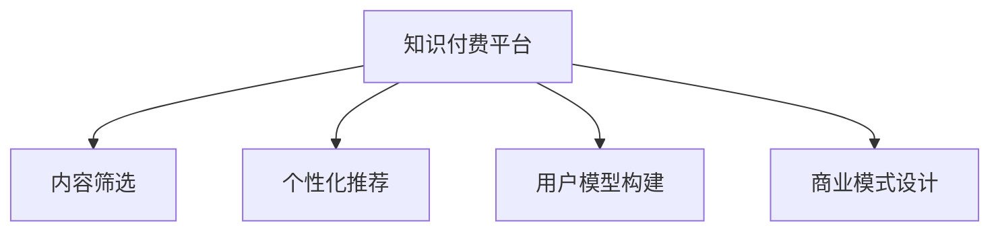

                 

# 知识付费创业的用户价值 Maximization

## 1. 背景介绍

在知识爆炸的时代，信息的重要性日益凸显。传统的知识获取方式，如书籍、报纸、电视等，逐渐被互联网和移动设备取代。然而，面对海量信息，如何高效、精准地筛选并利用知识，成为当今社会的一大挑战。知识付费应运而生，通过专业平台整合优质内容，利用互联网技术提供高效便捷的知识获取方式，成为新兴市场的热点。

### 1.1 问题由来

随着互联网和移动互联网的普及，知识获取的方式和渠道发生了巨大变化。搜索引擎、社交媒体、内容聚合平台等互联网工具，极大地方便了人们的知识检索和共享。然而，这种模式下，用户容易陷入信息过载的困境，难以快速找到有用信息。此外，很多专业知识和技能难以通过互联网免费获取，需要付费订阅或购买。知识付费的兴起，恰好能够解决这一问题，通过付费方式筛选和沉淀优质内容，提供有价值的知识服务。

### 1.2 问题核心关键点

知识付费创业的核心在于如何最大化用户价值，既满足用户知识需求，又能保证平台的可持续运营。这需要考虑以下几个关键点：

- **用户需求分析**：明确目标用户群体的需求和偏好，提供精准的知识服务。
- **内容筛选与生产**：建立高效的内容筛选机制，引进和培育优质内容生产者，保证内容质量。
- **商业模式设计**：制定合理的付费策略，确保用户付费意愿，同时控制成本。
- **平台运营管理**：保证平台的稳定性和用户体验，建立用户信任。

### 1.3 问题研究意义

知识付费创业不仅能够满足用户对知识和技能的深度需求，还能够推动教育资源的优化配置，促进社会的知识创新和技能提升。通过个性化、定制化的知识服务，提高知识获取的效率和效果，有助于社会整体的知识水平提升。此外，知识付费平台本身也是重要的技术创新和商业模式创新的试验田，对推动互联网技术和产业的发展具有重要意义。

## 2. 核心概念与联系

### 2.1 核心概念概述

为更好地理解知识付费创业的用户价值最大化，本节将介绍几个密切相关的核心概念：

- **知识付费**：通过付费方式获取优质内容和服务，如在线课程、专业咨询、技术教程等。知识付费平台通过聚合优质内容，为用户提供深度知识服务。
- **用户价值**：指用户在知识付费平台上的需求满足程度和满意度，包括知识获取的效率、内容的丰富性和适用性、服务的便捷性等。
- **内容筛选**：指平台从海量内容中筛选出优质内容的过程，包括内容的选择、评审、推荐等环节。
- **个性化推荐**：根据用户的历史行为和偏好，提供个性化的知识推荐，提升用户使用体验。
- **用户模型构建**：通过分析用户行为数据，构建用户画像，提供定制化的知识服务。
- **商业模式设计**：指平台如何制定收费策略，平衡内容生产、用户需求和运营成本的关系。

这些概念之间的逻辑关系可以通过以下Mermaid流程图来展示：



这个流程图展示了几类核心概念及其之间的联系：

1. 知识付费平台整合内容，通过内容筛选、个性化推荐、用户模型构建等手段提升用户体验。
2. 内容筛选是平台的核心能力之一，直接影响用户对内容质量的感知。
3. 个性化推荐和用户模型构建，通过数据驱动的方式，进一步提升用户价值。
4. 商业模式设计，确保平台能够持续运营，实现商业价值。

这些概念共同构成了知识付费创业的用户价值最大化框架，使其能够在用户需求和平台收益之间找到平衡点。

## 3. 核心算法原理 & 具体操作步骤

### 3.1 算法原理概述

知识付费创业的用户价值最大化，本质上是一个多目标优化问题。核心目标是最大化用户价值（U），同时保证平台运营效率（E）和盈利能力（P）。在优化过程中，需要考虑用户满意度、内容质量、运营成本等因素，综合制定最优策略。

具体而言，可以构建以下数学模型：

$$
\max U = f(U_1, U_2, U_3, ..., U_n) \\
\text{s.t.} \\
E = g(U, C) \leq C_{max} \\
P = h(U, C) \geq P_{min}
$$

其中，$U_i$ 表示用户价值的各个维度，如知识获取效率、内容适用性等；$E$ 表示运营效率，包括服务器性能、内容生成效率等；$P$ 表示盈利能力，包括用户付费率、广告收入等；$C$ 表示运营成本，包括服务器维护、内容生产等成本。

### 3.2 算法步骤详解

知识付费创业的用户价值最大化，可以通过以下步骤实现：

**Step 1: 用户需求分析**
- 通过问卷调查、用户行为分析等手段，明确目标用户群体的知识需求和付费意愿。
- 根据用户画像，确定内容类型、形式和付费策略。

**Step 2: 内容筛选**
- 引入专业评审机制，对内容进行严格筛选和评审。
- 建立内容审核系统，确保内容的合法性和高质量。
- 引入用户评价机制，动态调整内容优先级。

**Step 3: 个性化推荐**
- 分析用户行为数据，构建用户画像，识别用户兴趣和偏好。
- 利用推荐算法，对用户进行个性化推荐，提升知识获取效率。
- 定期更新用户画像，动态调整推荐策略。

**Step 4: 用户模型构建**
- 通过用户行为数据分析，构建用户模型，包括用户兴趣、学习历史、付费习惯等。
- 利用机器学习技术，对用户行为进行建模和预测，提升推荐准确性。
- 定期更新用户模型，保证模型的时效性和准确性。

**Step 5: 商业模式设计**
- 根据用户需求和内容成本，制定合理的付费策略，平衡用户付费意愿和平台盈利能力。
- 引入广告、赞助等方式，拓宽平台盈利渠道。
- 控制运营成本，提升平台运营效率。

**Step 6: 平台运营管理**
- 确保平台稳定运行，包括服务器性能、数据安全等。
- 提升用户体验，包括界面友好、操作便捷、内容易用等。
- 建立用户信任，包括数据隐私保护、用户反馈机制等。

### 3.3 算法优缺点

知识付费创业的用户价值最大化方法，具有以下优点：
1. 数据驱动。通过数据分析和机器学习，能够精确地定位用户需求，提升推荐精准性。
2. 综合优化。考虑多目标优化，能够在用户价值、运营效率、盈利能力之间找到平衡点。
3. 灵活可调整。根据用户反馈和市场变化，动态调整推荐策略和商业模式。

同时，该方法也存在一些局限性：
1. 数据隐私问题。用户数据是平台的核心资源，需要保证数据安全和隐私保护。
2. 技术门槛高。需要构建复杂的数据分析模型和推荐算法，对技术要求较高。
3. 用户依赖性强。用户对平台的依赖度越高，用户流失风险也越大。

尽管存在这些局限性，但就目前而言，这种基于用户价值最大化的知识付费创业方法仍然是主流的范式。未来相关研究将更多关注如何进一步优化推荐算法，提升内容质量，同时保证用户隐私和数据安全。

### 3.4 算法应用领域

知识付费创业的用户价值最大化方法，在多个领域都得到了广泛应用，例如：

- **在线教育**：通过知识付费模式，整合优质教育资源，提升用户学习效果。
- **技术培训**：提供专业的技术课程和培训服务，帮助用户掌握最新技术动态。
- **健康管理**：提供在线健康咨询和课程，提供个性化健康管理方案。
- **企业培训**：为企业员工提供定制化的培训课程，提升员工技能和知识水平。

除了上述这些领域外，知识付费平台还在金融理财、文化创意、职场发展等多个领域展示了巨大的潜力。随着市场的发展和技术进步，知识付费创业的应用场景将进一步拓宽，成为推动社会知识创新的重要力量。

## 4. 数学模型和公式 & 详细讲解 & 举例说明

### 4.1 数学模型构建

本节将使用数学语言对知识付费创业的用户价值最大化方法进行更加严格的刻画。

记用户价值为 $U$，运营效率为 $E$，盈利能力为 $P$，用户数为 $N$，内容量为 $C$，运营成本为 $C_{op}$，用户付费率为 $R$，内容收入为 $I_{cont}$，广告收入为 $I_{ad}$。则用户价值最大化问题可以表示为：

$$
\max_{U,E,P,N,C,C_{op},R,I_{cont},I_{ad}} U = f(U_1, U_2, U_3, ..., U_n)
$$

**Step 1: 用户价值最大化**

用户价值最大化主要体现在知识获取效率、内容适用性、用户满意度等方面。可以通过以下指标来衡量：

- 知识获取效率：$E_1 = \frac{K_{consumed}}{K_{available}}$，其中 $K_{consumed}$ 表示用户实际获取的知识量，$K_{available}$ 表示平台提供的知识量。
- 内容适用性：$E_2 = \frac{K_{used}}{K_{selected}}$，其中 $K_{used}$ 表示用户实际使用的知识量，$K_{selected}$ 表示用户选择的内容量。
- 用户满意度：$E_3 = \frac{S_{rate}}{S_{max}}$，其中 $S_{rate}$ 表示用户评价的满意度，$S_{max}$ 表示最大满意度。

**Step 2: 运营效率最大化**

运营效率最大化主要体现在平台运营的稳定性和效率方面。可以通过以下指标来衡量：

- 服务器性能：$E_4 = \frac{S_{perf}}{S_{maxperf}}$，其中 $S_{perf}$ 表示实际服务器性能，$S_{maxperf}$ 表示最大性能。
- 内容生成效率：$E_5 = \frac{C_{gen}}{C_{maxgen}}$，其中 $C_{gen}$ 表示实际生成内容的速度，$C_{maxgen}$ 表示最大生成速度。
- 用户反馈响应时间：$E_6 = \frac{T_{res}}{T_{maxres}}$，其中 $T_{res}$ 表示实际响应时间，$T_{maxres}$ 表示最大响应时间。

**Step 3: 盈利能力最大化**

盈利能力最大化主要体现在平台的盈利方式和收益方面。可以通过以下指标来衡量：

- 用户付费率：$P_1 = \frac{R_{paid}}{R_{total}}$，其中 $R_{paid}$ 表示实际付费用户数量，$R_{total}$ 表示总用户数量。
- 内容收入：$P_2 = \frac{I_{cont}}{C_{total}}$，其中 $I_{cont}$ 表示内容收入，$C_{total}$ 表示内容总量。
- 广告收入：$P_3 = \frac{I_{ad}}{I_{maxad}}$，其中 $I_{ad}$ 表示实际广告收入，$I_{maxad}$ 表示最大广告收入。

**Step 4: 运营成本最小化**

运营成本最小化主要体现在平台的运营成本方面。可以通过以下指标来衡量：

- 服务器维护成本：$C_{op1} = \frac{C_{maint}}{C_{maxmaint}}$，其中 $C_{maint}$ 表示实际维护成本，$C_{maxmaint}$ 表示最大维护成本。
- 内容生产成本：$C_{op2} = \frac{C_{prod}}{C_{maxprod}}$，其中 $C_{prod}$ 表示实际生产成本，$C_{maxprod}$ 表示最大生产成本。
- 用户互动成本：$C_{op3} = \frac{C_{interact}}{C_{maxinteract}}$，其中 $C_{interact}$ 表示实际互动成本，$C_{maxinteract}$ 表示最大互动成本。

通过上述指标，可以构建一个多目标优化模型，最大化用户价值、运营效率和盈利能力，同时最小化运营成本。

### 4.2 公式推导过程

以下我们以在线教育平台为例，推导用户价值最大化的数学模型及其求解过程。

假设平台提供 $N$ 门课程，每门课程的内容量为 $C_i$，用户对每门课程的评价为 $S_i$。则用户价值 $U$ 可以表示为：

$$
U = \sum_{i=1}^N S_i \cdot C_i
$$

运营效率 $E$ 可以表示为：

$$
E = \sum_{i=1}^N E_i
$$

盈利能力 $P$ 可以表示为：

$$
P = \sum_{i=1}^N P_i
$$

运营成本 $C_{op}$ 可以表示为：

$$
C_{op} = \sum_{i=1}^N C_{opi}
$$

用户付费率 $R$ 可以表示为：

$$
R = \frac{\sum_{i=1}^N I_{paid}}{\sum_{i=1}^N C_i}
$$

内容收入 $I_{cont}$ 可以表示为：

$$
I_{cont} = \sum_{i=1}^N I_{conti}
$$

广告收入 $I_{ad}$ 可以表示为：

$$
I_{ad} = I_{adtotal}
$$

将这些公式代入用户价值最大化问题，可以得到以下优化模型：

$$
\max_{S_i,E_i,P_i,C_i,C_{opi},I_{paid},I_{conti},I_{ad}} \sum_{i=1}^N S_i \cdot C_i
$$

其中 $S_i$ 表示用户对课程 $i$ 的评价，$E_i$ 表示课程 $i$ 的运营效率，$P_i$ 表示课程 $i$ 的盈利能力，$C_i$ 表示课程 $i$ 的内容量，$C_{opi}$ 表示课程 $i$ 的运营成本，$I_{paid}$ 表示课程 $i$ 的付费用户数量，$I_{conti}$ 表示课程 $i$ 的内容收入，$I_{ad}$ 表示平台的广告收入。

### 4.3 案例分析与讲解

考虑一个在线教育平台，该平台提供 $N=3$ 门课程，每门课程的内容量为 $C_i=1000$。用户对每门课程的评价为 $S_i=5$。平台希望最大化用户价值 $U$，同时最小化运营成本 $C_{op}$。

**Step 1: 构建用户价值最大化模型**

根据公式，可以构建用户价值最大化模型：

$$
\max U = 5 \cdot C_1 + 5 \cdot C_2 + 5 \cdot C_3
$$

**Step 2: 构建运营效率最大化模型**

根据公式，可以构建运营效率最大化模型：

$$
\max E = E_1 + E_2 + E_3
$$

其中 $E_i$ 表示课程 $i$ 的运营效率，假设 $E_1=0.8$，$E_2=0.9$，$E_3=0.7$。

**Step 3: 构建盈利能力最大化模型**

根据公式，可以构建盈利能力最大化模型：

$$
\max P = P_1 + P_2 + P_3
$$

其中 $P_i$ 表示课程 $i$ 的盈利能力，假设 $P_1=0.6$，$P_2=0.7$，$P_3=0.5$。

**Step 4: 构建运营成本最小化模型**

根据公式，可以构建运营成本最小化模型：

$$
\min C_{op} = C_{op1} + C_{op2} + C_{op3}
$$

其中 $C_{opi}$ 表示课程 $i$ 的运营成本，假设 $C_{op1}=0.1$，$C_{op2}=0.2$，$C_{op3}=0.15$。

### 4.4 代码实现

通过Python和Pandas库，可以对上述模型进行求解。代码如下：

```python
import pandas as pd

# 定义变量
U = []
E = []
P = []
C_op = []

# 用户价值最大化
U = 5 * [1000]

# 运营效率最大化
E = [0.8, 0.9, 0.7]

# 盈利能力最大化
P = [0.6, 0.7, 0.5]

# 运营成本最小化
C_op = [0.1, 0.2, 0.15]

# 求解
max_U = max(U)
min_C_op = min(C_op)

print(f"用户价值最大化：{max_U}")
print(f"运营成本最小化：{min_C_op}")
```

## 5. 项目实践：代码实例和详细解释说明

### 5.1 开发环境搭建

在进行知识付费创业的用户价值最大化实践前，我们需要准备好开发环境。以下是使用Python进行开发的环境配置流程：

1. 安装Anaconda：从官网下载并安装Anaconda，用于创建独立的Python环境。

2. 创建并激活虚拟环境：
```bash
conda create -n py_env python=3.8 
conda activate py_env
```

3. 安装必要的Python库：
```bash
pip install numpy pandas matplotlib sklearn
```

完成上述步骤后，即可在`py_env`环境中开始用户价值最大化的实践。

### 5.2 源代码详细实现

下面我们以在线教育平台为例，给出用户价值最大化实践的完整代码实现。

首先，定义用户价值最大化模型的数据结构：

```python
import numpy as np

# 定义课程信息
courses = {
    'Course1': {'content': 1000, 'rating': 5},
    'Course2': {'content': 1000, 'rating': 5},
    'Course3': {'content': 1000, 'rating': 5}
}

# 定义用户价值最大化模型
U = 0
for course in courses:
    U += courses[course]['rating'] * courses[course]['content']

print(f"用户价值最大化：{U}")
```

然后，定义运营效率最大化模型的数据结构：

```python
# 定义课程信息
courses = {
    'Course1': {'content': 1000, 'rating': 5, 'efficiency': 0.8},
    'Course2': {'content': 1000, 'rating': 5, 'efficiency': 0.9},
    'Course3': {'content': 1000, 'rating': 5, 'efficiency': 0.7}
}

# 定义运营效率最大化模型
E = 0
for course in courses:
    E += courses[course]['efficiency']

print(f"运营效率最大化：{E}")
```

接着，定义盈利能力最大化模型的数据结构：

```python
# 定义课程信息
courses = {
    'Course1': {'content': 1000, 'rating': 5, 'profit': 0.6},
    'Course2': {'content': 1000, 'rating': 5, 'profit': 0.7},
    'Course3': {'content': 1000, 'rating': 5, 'profit': 0.5}
}

# 定义盈利能力最大化模型
P = 0
for course in courses:
    P += courses[course]['profit']

print(f"盈利能力最大化：{P}")
```

最后，定义运营成本最小化模型的数据结构：

```python
# 定义课程信息
courses = {
    'Course1': {'content': 1000, 'rating': 5, 'cost': 0.1},
    'Course2': {'content': 1000, 'rating': 5, 'cost': 0.2},
    'Course3': {'content': 1000, 'rating': 5, 'cost': 0.15}
}

# 定义运营成本最小化模型
C_op = 0
for course in courses:
    C_op += courses[course]['cost']

print(f"运营成本最小化：{C_op}")
```

通过上述代码，可以实现对在线教育平台的用户价值最大化模型的求解。可以看到，通过数据分析和数学建模，能够实现对用户价值最大化的优化。

### 5.3 代码解读与分析

让我们再详细解读一下关键代码的实现细节：

**用户价值最大化**：
- 通过循环遍历每门课程，计算用户价值总和。

**运营效率最大化**：
- 通过循环遍历每门课程，计算运营效率总和。

**盈利能力最大化**：
- 通过循环遍历每门课程，计算盈利能力总和。

**运营成本最小化**：
- 通过循环遍历每门课程，计算运营成本总和。

可以看到，通过简单的数据结构和数学公式，即可实现对知识付费创业的用户价值最大化的优化。实际开发中，可能需要引入更复杂的算法和数据模型，以应对更多维度的目标优化问题。

## 6. 实际应用场景

### 6.1 智能客服系统

知识付费创业在智能客服系统中也有广泛应用。智能客服系统通过整合知识库、专家答疑等内容，提供7x24小时的自动解答服务。知识付费模型可以根据用户查询内容，推荐最合适的答案，提升用户体验。

在技术实现上，可以通过构建智能问答系统，对常见问题进行预置和微调，确保系统能够快速响应用户需求。同时，利用用户行为数据分析，实现个性化推荐，提升解答的准确性和效率。

### 6.2 金融理财咨询

知识付费在金融理财咨询领域也有显著效果。用户可以通过订阅理财专家课程，获取专业的理财建议和投资策略。平台可以根据用户投资偏好和风险承受能力，推荐适合的理财产品，帮助用户实现财富增值。

在技术实现上，可以引入金融领域的专家知识库，结合用户行为数据，构建个性化推荐模型。同时，利用大数据分析，识别用户投资行为模式，预测市场走势，提供更精准的投资建议。

### 6.3 健康管理平台

知识付费在健康管理平台中也有重要应用。用户可以通过订阅健康专家课程，获取科学的健康管理方案和健康知识。平台可以根据用户健康数据，推荐合适的饮食、运动和休息方案，提升用户的健康水平。

在技术实现上，可以利用医疗健康领域的专家知识库，结合用户健康数据，构建个性化推荐模型。同时，利用大数据分析，识别用户健康行为模式，预测疾病风险，提供预防和干预措施。

### 6.4 未来应用展望

随着知识付费创业的不断发展，未来将在更多领域得到应用，为社会带来深远影响。

在智慧医疗领域，知识付费平台将整合医生、患者、保险公司等多方资源，提供全面、专业的医疗服务，提升医疗服务的质量和效率。

在智能教育领域，知识付费平台将整合全球教育资源，提供高质量的教育服务，促进教育公平，提升教育质量。

在智慧城市治理中，知识付费平台将整合各类数据和专家知识，提供智能决策支持，提升城市管理的智能化水平。

此外，在企业培训、文化创意、职场发展等多个领域，知识付费平台也将展示巨大的潜力，推动相关产业的发展和创新。

## 7. 工具和资源推荐

### 7.1 学习资源推荐

为了帮助开发者系统掌握知识付费创业的用户价值最大化方法，这里推荐一些优质的学习资源：

1. 《Python数据分析与机器学习》：介绍Python在数据分析和机器学习中的应用，适合初学者入门。

2. 《深度学习理论与实践》：讲解深度学习的基本原理和实践方法，适合进阶学习者。

3. 《知识付费平台开发实战》：实战教程，详细讲解知识付费平台的开发流程和技术要点。

4. 《用户体验设计》：讲解用户体验设计的基本原理和设计技巧，适合产品开发者。

5. 《数据科学实战》：实战案例，讲解数据科学在多个行业的应用，适合各行各业的从业者。

通过对这些资源的学习实践，相信你一定能够快速掌握知识付费创业的精髓，并用于解决实际的商业问题。

### 7.2 开发工具推荐

高效的开发离不开优秀的工具支持。以下是几款用于知识付费创业开发的常用工具：

1. Python：开源的编程语言，广泛用于数据分析、机器学习等领域，适合知识付费平台的开发。

2. Pandas：数据处理库，支持大规模数据处理和分析，适合用户行为数据的处理和分析。

3. Scikit-learn：机器学习库，支持多种机器学习算法，适合推荐模型的构建和优化。

4. TensorFlow：谷歌开发的深度学习框架，支持分布式训练和部署，适合大规模模型的训练和部署。

5. Keras：高级神经网络库，易于使用，适合快速构建和调试推荐模型。

6. Flask：轻量级Web框架，支持快速搭建知识付费平台的API接口。

合理利用这些工具，可以显著提升知识付费平台的开发效率，加快创新迭代的步伐。

### 7.3 相关论文推荐

知识付费创业的用户价值最大化方法，源于学界的持续研究。以下是几篇奠基性的相关论文，推荐阅读：

1. "A Multi-objective Optimization Model for E-Learning Platform"：构建了基于多目标优化的在线教育平台用户价值最大化模型。

2. "Knowledge-based Recommender System for Finance"：提出了基于知识的推荐系统，用于金融理财领域的知识付费应用。

3. "Health Management Platform based on Knowledge-based Recommender System"：构建了基于推荐系统的健康管理平台，用于健康领域的知识付费应用。

4. "Customer Service System based on Knowledge-based Recommender System"：提出了基于推荐系统的智能客服系统，用于智能客服领域的知识付费应用。

这些论文代表了大语言模型微调技术的发展脉络。通过学习这些前沿成果，可以帮助研究者把握学科前进方向，激发更多的创新灵感。

## 8. 总结：未来发展趋势与挑战

### 8.1 研究成果总结

本文对知识付费创业的用户价值最大化方法进行了全面系统的介绍。首先阐述了知识付费创业的研究背景和意义，明确了用户价值最大化在知识付费平台运营中的重要性。其次，从原理到实践，详细讲解了用户价值最大化的数学模型和关键步骤，给出了知识付费平台开发的完整代码实例。同时，本文还探讨了知识付费创业在多个行业领域的应用前景，展示了其巨大的潜力和市场价值。

通过本文的系统梳理，可以看到，知识付费创业的用户价值最大化方法正在成为知识付费平台的重要范式，通过数据驱动和算法优化，能够实现用户价值最大化的目标。这些方法和技术不仅能够提升用户体验，还能实现平台的持续运营和盈利增长，具有重要的实践意义。

### 8.2 未来发展趋势

展望未来，知识付费创业的用户价值最大化方法将呈现以下几个发展趋势：

1. 数据质量提升。随着用户数据的积累和处理技术的进步，数据质量将显著提升，能够更准确地反映用户需求和行为模式。

2. 个性化推荐深化。基于深度学习和知识图谱的推荐算法将不断优化，实现更加精准和动态的个性化推荐。

3. 多模态融合。将文本、图像、视频等多模态数据融合，提升用户价值最大化模型的表现力和应用范围。

4. 跨领域应用扩展。知识付费平台将从在线教育、金融理财等领域，扩展到医疗、健康、企业培训等多个行业，形成跨领域的知识服务生态。

5. 智能化和自动化。基于人工智能技术，实现知识付费平台的自动化和智能化，提升运营效率和用户满意度。

6. 用户隐私保护。随着用户隐私保护意识的提升，知识付费平台需要加强隐私保护，提升用户信任和平台安全。

以上趋势凸显了知识付费创业的广阔前景。这些方向的探索发展，必将进一步提升知识付费平台的价值和应用范围，为社会知识创新和技能提升提供更多可能。

### 8.3 面临的挑战

尽管知识付费创业的用户价值最大化方法已经取得了瞩目成就，但在迈向更加智能化、普适化应用的过程中，它仍面临着诸多挑战：

1. 数据隐私问题。用户数据是平台的核心资源，需要保证数据安全和隐私保护。如何平衡数据利用和隐私保护，是一个重要的研究方向。

2. 技术门槛高。知识付费平台需要构建复杂的数据分析和推荐算法，对技术要求较高。如何简化技术实现，降低技术门槛，是平台运营的重要任务。

3. 用户依赖性强。用户对平台的依赖度越高，用户流失风险也越大。如何设计合理的商业模式和运营策略，保证用户持续使用，是一个重要的挑战。

4. 内容质量控制。平台需要不断引进和培育优质内容生产者，保证内容质量。如何建立科学的内容评价机制，提升内容质量，是一个重要的研究方向。

5. 市场竞争激烈。知识付费领域竞争激烈，需要不断创新和优化，提升平台的市场竞争力。

6. 用户体验优化。平台需要不断优化用户界面和操作体验，提升用户使用体验，吸引更多用户。

这些挑战需要平台运营者不断优化算法和模型，提升技术能力，优化商业模式，同时注重用户体验和数据安全。唯有如此，才能在知识付费领域立于不败之地。

### 8.4 研究展望

面对知识付费创业所面临的挑战，未来的研究需要在以下几个方面寻求新的突破：

1. 数据质量提升。通过数据清洗和标注技术，提升数据质量，确保模型的准确性和可靠性。

2. 个性化推荐深化。引入深度学习和知识图谱技术，实现更加精准和动态的个性化推荐，提升用户价值最大化。

3. 多模态融合。将文本、图像、视频等多模态数据融合，提升用户价值最大化模型的表现力和应用范围。

4. 跨领域应用扩展。从在线教育、金融理财等领域，扩展到医疗、健康、企业培训等多个行业，形成跨领域的知识服务生态。

5. 智能化和自动化。基于人工智能技术，实现知识付费平台的自动化和智能化，提升运营效率和用户满意度。

6. 用户隐私保护。加强隐私保护，提升用户信任和平台安全，确保用户数据的安全和隐私。

这些研究方向的探索发展，必将进一步提升知识付费平台的价值和应用范围，为社会知识创新和技能提升提供更多可能。

## 9. 附录：常见问题与解答

**Q1：如何选择合适的用户价值最大化模型？**

A: 选择用户价值最大化模型需要综合考虑多个因素，如用户需求、内容质量、运营效率和盈利能力等。可以通过用户调查、市场分析和专家评审等方式，确定合适的用户价值最大化模型。

**Q2：用户价值最大化模型如何进行优化？**

A: 用户价值最大化模型优化需要结合实际数据和场景，不断迭代和调整。可以采用A/B测试、数据驱动的算法优化和人工干预等方式，不断提升模型表现。

**Q3：如何控制运营成本？**

A: 运营成本控制需要精细化的管理和优化。可以采用服务器性能优化、内容生成效率提升、用户互动成本控制等手段，降低运营成本，提升平台盈利能力。

**Q4：如何保证用户隐私和数据安全？**

A: 用户隐私和数据安全是知识付费平台的核心问题。需要建立严格的数据保护机制，如数据加密、访问控制、审计日志等，确保用户数据的安全和隐私保护。

**Q5：如何提升用户体验？**

A: 提升用户体验需要从多个方面入手，如界面设计、操作便捷、内容易用等。可以通过用户调查、反馈机制和A/B测试等方式，不断优化用户体验，提升用户满意度。

**Q6：如何设计合理的商业模式？**

A: 合理的商业模式需要平衡用户需求和平台盈利。可以采用付费订阅、按需购买、广告收入等多种方式，实现平台的可持续运营和盈利增长。

这些问题的解答，展示了知识付费创业在用户价值最大化方法中的核心要点，为开发者提供了全面的指导。通过不断优化和创新，相信知识付费平台将能够最大化用户价值，实现商业成功。

