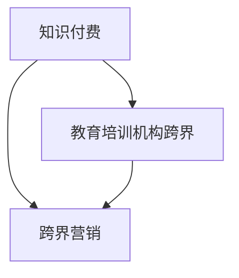
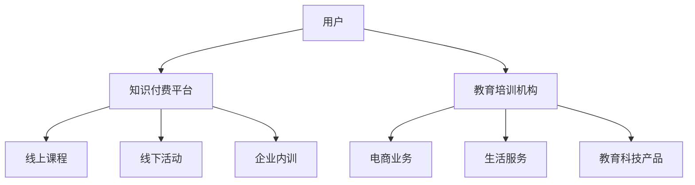

                 

# 知识付费如何实现跨界营销与教育培训机构跨界？

在数字化时代，知识付费已经从单纯的商品交易转变为一种新的商业模式，为教育培训机构的跨界转型提供了可能。本文将详细探讨如何通过知识付费实现跨界营销，并分析教育培训机构跨界发展的策略与挑战。

## 1. 背景介绍

随着移动互联网的普及和教育水平的提升，人们对于知识和技能的需求不断增长，而时间、空间等因素的限制使得传统的线下教育模式难以满足需求。知识付费应运而生，通过在线课程、直播讲座、电子书等形式，打破时空界限，将优质教育资源推向市场。

知识付费不仅是一种新型的商业模式，更是一种教育资源的重新分配方式。它打破了传统教育的界限，实现了知识的快速流通和传播，为教育机构的跨界发展提供了新的契机。

## 2. 核心概念与联系

### 2.1 核心概念概述

为了更好地理解知识付费与教育培训机构跨界发展，本节将介绍几个关键概念及其相互联系：

- **知识付费**：指用户通过付费方式获取知识和技能的学习平台，如腾讯课堂、网易公开课、得到等。
- **教育培训机构跨界**：指传统教育培训机构通过知识付费平台，向非教育领域延伸业务，如教育培训机构的电商、生活服务等。
- **跨界营销**：指教育培训机构通过多种渠道和手段，将自身的教育资源和服务推广到其他行业和领域，实现用户基础和市场份额的扩大。

这些概念之间的联系可以通过以下Mermaid流程图来展示：



这个流程图展示了知识付费平台、教育培训机构跨界和跨界营销三者之间的逻辑关系：

1. 知识付费是教育培训机构跨界发展的平台和手段。
2. 教育培训机构通过跨界营销，在知识付费平台上推广自身的教育资源和服务。
3. 跨界营销通过多样化渠道和手段，实现教育机构在其他领域的业务延伸。

### 2.2 核心概念原理和架构的 Mermaid 流程图



这个流程图展示了知识付费平台、教育培训机构与用户之间的互动关系，以及教育培训机构在知识付费平台上的服务内容。

## 3. 核心算法原理 & 具体操作步骤

### 3.1 算法原理概述

知识付费与教育培训机构跨界的核心在于内容和服务的多样化。教育培训机构通过知识付费平台，向用户提供多样化的课程和产品，如线上课程、线下活动、企业内训等，以满足不同用户群体的需求。

### 3.2 算法步骤详解

#### 3.2.1 用户需求分析

首先，教育培训机构需要分析目标用户群体的需求，了解他们的学习目标、兴趣和消费习惯，从而制定合适的课程和产品策略。

#### 3.2.2 内容生产和设计

其次，根据用户需求分析的结果，教育培训机构需要进行内容生产和设计。包括课程规划、教学设计、视频制作、互动环节设计等。

#### 3.2.3 平台选择和部署

选择合适的知识付费平台，并根据平台的要求进行内容部署和推广。平台选择需要考虑平台的用户基础、市场规模、推广策略等因素。

#### 3.2.4 推广和营销

通过多种渠道和手段进行推广和营销，吸引用户关注和参与。推广手段包括社交媒体营销、SEO优化、KOL合作等。

#### 3.2.5 数据分析和优化

定期收集和分析用户数据，了解用户行为和反馈，优化课程和推广策略，提高用户体验和满意度。

### 3.3 算法优缺点

#### 3.3.1 优点

- **用户覆盖广**：通过知识付费平台，教育培训机构能够覆盖更广泛的用户群体，突破地域和时间限制。
- **服务形式多样**：多样化的课程和产品形式，满足不同用户的需求。
- **灵活调整**：根据用户反馈和市场变化，灵活调整课程和产品策略，保持竞争力。

#### 3.3.2 缺点

- **成本较高**：内容生产和平台推广需要投入较大成本，特别是在初期阶段。
- **市场竞争激烈**：知识付费市场竞争激烈，需要不断创新和优化，才能保持竞争力。
- **用户体验有待提升**：知识付费平台上的用户体验和互动环节设计，需要不断优化和改进。

### 3.4 算法应用领域

知识付费与教育培训机构跨界的应用领域广泛，涵盖了教育培训、电商、生活服务等多个领域。具体应用包括：

- **线上课程**：如编程、语言学习、职业技能培训等。
- **线下活动**：如公开课、讲座、沙龙等。
- **企业内训**：如员工技能培训、企业文化建设等。
- **教育科技产品**：如学习管理系统、智能推荐系统等。

## 4. 数学模型和公式 & 详细讲解 & 举例说明

### 4.1 数学模型构建

在知识付费与教育培训机构跨界的场景中，我们可以构建一个简单的用户模型，用于分析用户行为和需求。假设用户总数为 $N$，其中 $N_1$ 为有付费意愿的用户，$N_2$ 为没有付费意愿的用户。教育培训机构的目标是通过营销和推广，将 $N_2$ 中的部分用户转化为有付费意愿的用户。

### 4.2 公式推导过程

根据上述用户模型，我们可以推导出以下公式：

- **转化率**：$\text{Conversion Rate} = \frac{N_1 + \Delta N}{N}$
- **总转化成本**：$\text{Total Cost} = C_{\text{prod}} + C_{\text{promo}}$
- **每用户转化成本**：$\text{Cost per User} = \frac{\text{Total Cost}}{\Delta N}$
- **用户生命周期价值**：$\text{Lifetime Value} = V_1 \cdot P + V_2 \cdot (1-P)$

其中 $C_{\text{prod}}$ 为内容生产成本，$C_{\text{promo}}$ 为推广成本，$V_1$ 为有付费意愿用户带来的价值，$V_2$ 为没有付费意愿用户带来的价值，$P$ 为转化率。

### 4.3 案例分析与讲解

假设教育培训机构通过知识付费平台推出一门线上课程，预计课程价值 $V_1 = 200$ 元，转化率为 $P = 0.3$。课程推广成本为 $C_{\text{promo}} = 10,000$ 元，内容生产成本为 $C_{\text{prod}} = 5,000$ 元。

则总转化成本为 $C_{\text{total}} = C_{\text{promo}} + C_{\text{prod}} = 15,000$ 元，每用户转化成本为 $C_{\text{user}} = \frac{C_{\text{total}}}{\Delta N}$，其中 $\Delta N$ 为新增有付费意愿用户数。

若期望新增 $100$ 名有付费意愿用户，则每用户转化成本为 $C_{\text{user}} = \frac{15,000}{100} = 150$ 元。

此外，需要计算用户生命周期价值，假设用户平均生命周期为 $3$ 个月，则用户生命周期价值为 $LVM = V_1 \cdot P \cdot 3 + V_2 \cdot (1-P) \cdot 3 = 180 + 150 \times 3 = 600$ 元。

## 5. 项目实践：代码实例和详细解释说明

### 5.1 开发环境搭建

在进行知识付费与教育培训机构跨界实践前，我们需要准备好开发环境。以下是使用Python进行Flask开发的环境配置流程：

1. 安装Anaconda：从官网下载并安装Anaconda，用于创建独立的Python环境。

2. 创建并激活虚拟环境：
```bash
conda create -n flask-env python=3.8 
conda activate flask-env
```

3. 安装Flask：
```bash
pip install Flask
```

4. 安装各类工具包：
```bash
pip install Flask-WTF flask-sqlalchemy flask-restful flask-cors
```

完成上述步骤后，即可在`flask-env`环境中开始知识付费与教育培训机构跨界的开发实践。

### 5.2 源代码详细实现

下面我们以一个简单的知识付费与教育培训机构跨界实践为例，给出Flask框架下线上课程的实现代码。

```python
from flask import Flask, render_template, request
from flask_sqlalchemy import SQLAlchemy
from flask_login import LoginManager, login_user, logout_user, login_required, current_user
from flask_wtf import FlaskForm
from wtforms import StringField, PasswordField, SubmitField
from wtforms.validators import DataRequired, Email

app = Flask(__name__)
app.config['SECRET_KEY'] = 'your-secret-key'
app.config['SQLALCHEMY_DATABASE_URI'] = 'sqlite:///app.db'
db = SQLAlchemy(app)
login_manager = LoginManager()
login_manager.init_app(app)
login_manager.login_view = 'login'

class User(db.Model):
    id = db.Column(db.Integer, primary_key=True)
    username = db.Column(db.String(80), unique=True, nullable=False)
    email = db.Column(db.String(120), unique=True, nullable=False)
    password = db.Column(db.String(120), nullable=False)

class LoginForm(FlaskForm):
    email = StringField('Email', validators=[DataRequired(), Email()])
    password = PasswordField('Password', validators=[DataRequired()])
    submit = SubmitField('Login')

@login_manager.user_loader
def load_user(user_id):
    return User.query.get(int(user_id))

@app.route('/')
@login_required
def home():
    return render_template('home.html')

@app.route('/login', methods=['GET', 'POST'])
def login():
    form = LoginForm()
    if form.validate_on_submit():
        user = User.query.filter_by(email=form.email.data).first()
        if user and user.password == form.password.data:
            login_user(user)
            return redirect('/')
        else:
            flash('Login Unsuccessful. Please check email and password', 'danger')
    return render_template('login.html', title='Login', form=form)

@app.route('/logout')
def logout():
    logout_user()
    return redirect('/')

@app.route('/register', methods=['GET', 'POST'])
def register():
    form = RegistrationForm()
    if form.validate_on_submit():
        hashed_password = generate_password_hash(form.password.data)
        user = User(username=form.username.data, email=form.email.data, password=hashed_password)
        db.session.add(user)
        db.session.commit()
        flash('Your account has been created! You are now able to log in', 'success')
        return redirect('/login')
    return render_template('register.html', title='Register', form=form)

@app.route('/course')
@login_required
def course():
    return render_template('course.html')

@app.route('/submit', methods=['POST'])
@login_required
def submit():
    course_name = request.form['course_name']
    course_price = request.form['course_price']
    db.session.add(Course(course_name=course_name, course_price=course_price, user_id=current_user.id))
    db.session.commit()
    return redirect('/')

if __name__ == '__main__':
    app.run(debug=True)
```

### 5.3 代码解读与分析

让我们再详细解读一下关键代码的实现细节：

**User类**：
- 定义用户数据模型，包含用户名、邮箱和密码字段，以及必要的CRUD操作。

**LoginForm类**：
- 定义用户登录表单，包含邮箱和密码字段，以及验证器。

**login_manager.user_loader**：
- 用户验证器，通过查询数据库获取用户信息。

**home路由**：
- 需要登录后才能访问的首页，用于展示用户已购买课程。

**login路由**：
- 处理用户登录请求，进行邮箱和密码的验证。

**logout路由**：
- 处理用户退出登录请求。

**register路由**：
- 处理用户注册请求，创建新用户并插入数据库。

**course路由**：
- 需要登录后才能访问的课程页面，用于展示课程信息。

**submit路由**：
- 处理用户提交购买请求，创建新课程并插入数据库。

可以看到，Flask框架提供了一个轻量级的后端解决方案，能够快速搭建起知识付费与教育培训机构跨界的系统。开发者可以根据具体需求进行扩展和优化。

## 6. 实际应用场景

### 6.1 智能教育

智能教育是大数据和人工智能技术在教育领域的深度应用。通过知识付费与教育培训机构跨界，可以实现个性化教育和智能化学习。

例如，某教育培训机构通过知识付费平台推出智能教学系统，利用大数据和机器学习技术，根据学生的学习行为和成绩，智能推荐适合的学习内容和教学方法，提升学习效果和体验。

### 6.2 企业培训

企业培训是提升员工职业技能的重要途径。通过知识付费与教育培训机构跨界，可以向企业提供定制化的培训课程和内训服务。

例如，某教育培训机构为企业定制了线上培训课程，涵盖编程、管理、财务等多个领域，帮助员工提升专业技能，促进企业发展。

### 6.3 在线教育

在线教育是知识付费的重要形式之一。通过知识付费与教育培训机构跨界，可以提供更丰富的在线教育资源和服务。

例如，某教育培训机构通过知识付费平台推出了多门高质量的在线课程，包括编程、语言学习、职业技能培训等，吸引大量用户注册和购买。

### 6.4 未来应用展望

随着知识付费与教育培训机构跨界的发展，未来的应用场景将更加多样和广阔。

1. **虚拟现实(VR)**：通过VR技术，为学生提供沉浸式的学习体验，提升学习效果和兴趣。

2. **人工智能(AI)**：利用AI技术，进行学习行为分析、情感识别、智能推荐等，提升个性化教学和用户体验。

3. **区块链(Blockchain)**：通过区块链技术，保障课程版权和用户权益，防止盗版和侵权行为。

4. **社交化学习**：构建学习社区，促进学生之间的交流和协作，提升学习效果。

5. **跨界合作**：与企业、政府、教育机构等多方合作，提供多元化的教育和培训服务。

6. **持续更新**：根据市场和用户需求的变化，持续更新和优化课程内容，保持竞争力。

## 7. 工具和资源推荐

### 7.1 学习资源推荐

为了帮助开发者系统掌握知识付费与教育培训机构跨界理论基础和实践技巧，这里推荐一些优质的学习资源：

1. **《知识付费的商业逻辑》**：详细介绍了知识付费的商业模式和用户行为，提供了丰富的案例和数据分析。

2. **《教育大数据与个性化学习》**：介绍了大数据技术在教育中的应用，探讨了个性化学习的实现路径。

3. **《人工智能在教育中的应用》**：介绍了AI技术在教育中的各种应用场景，包括智能推荐、情感识别、学习行为分析等。

4. **《教育技术的未来》**：讨论了教育技术的发展趋势，预测了未来的应用方向和机遇。

5. **《知识付费平台开发实战》**：提供了一个完整的知识付费平台开发教程，包括Flask框架、SQLAlchemy数据库、Flask-WTF表单等。

通过对这些资源的学习实践，相信你一定能够快速掌握知识付费与教育培训机构跨界的精髓，并用于解决实际的NLP问题。

### 7.2 开发工具推荐

高效的开发离不开优秀的工具支持。以下是几款用于知识付费与教育培训机构跨界开发的常用工具：

1. **Flask**：轻量级的Web应用框架，易于上手，适合快速迭代研究。

2. **SQLAlchemy**：Python ORM，方便进行数据库操作。

3. **Flask-WTF**：WTForms表单验证器，提供安全的表单处理方式。

4. **Flask-Login**：用户认证和授权模块，方便实现用户登录和注册功能。

5. **Flask-SQLAlchemy**：提供与SQLAlchemy的集成，方便进行数据库操作。

6. **Flask-CORS**：跨域资源共享模块，方便在前端进行跨域请求。

合理利用这些工具，可以显著提升知识付费与教育培训机构跨界任务的开发效率，加快创新迭代的步伐。

### 7.3 相关论文推荐

知识付费与教育培训机构跨界的发展源于学界的持续研究。以下是几篇奠基性的相关论文，推荐阅读：

1. **《知识付费平台的用户行为分析》**：研究了知识付费平台的用户行为特征和消费心理，提供了针对性的策略和建议。

2. **《基于大数据的个性化推荐系统》**：探讨了大数据技术在个性化推荐中的应用，提出了一套有效的推荐算法。

3. **《教育技术创新的未来展望》**：分析了教育技术的创新方向和应用前景，提出了未来发展的建议。

4. **《在线教育平台的商业模式创新》**：探讨了在线教育平台的商业模式创新，提供了丰富的案例和分析。

这些论文代表了大数据和人工智能技术在教育领域的应用方向和研究成果，通过学习这些前沿成果，可以帮助研究者把握学科前进方向，激发更多的创新灵感。

## 8. 总结：未来发展趋势与挑战

### 8.1 研究成果总结

本文对知识付费与教育培训机构跨界进行了全面系统的介绍。首先阐述了知识付费和教育培训机构跨界的发展背景和意义，明确了两者结合的商业价值和应用前景。其次，从原理到实践，详细讲解了知识付费平台和教育培训机构的跨界流程，给出了具体的代码实现和案例分析。最后，探讨了知识付费与教育培训机构跨界在实际应用中的场景和挑战，提供了工具和资源推荐。

通过本文的系统梳理，可以看到，知识付费与教育培训机构跨界正在成为教育领域的重要方向，极大地拓展了教育资源的覆盖和应用边界。未来，伴随大数据和人工智能技术的持续发展，知识付费与教育培训机构跨界必将迎来新的发展机遇和挑战。

### 8.2 未来发展趋势

展望未来，知识付费与教育培训机构跨界的发展趋势如下：

1. **多元化内容和服务**：知识付费平台将提供更加多元化和个性化的内容和课程，满足不同用户的需求。

2. **智能化教学**：利用AI技术，实现智能推荐、情感识别、学习行为分析等，提升个性化教学和用户体验。

3. **社交化学习**：构建学习社区，促进学生之间的交流和协作，提升学习效果。

4. **持续更新和优化**：根据市场和用户需求的变化，持续更新和优化课程内容，保持竞争力。

5. **跨界合作**：与企业、政府、教育机构等多方合作，提供多元化的教育和培训服务。

6. **国际化发展**：拓展国际市场，提供多语言的教育资源和服务。

### 8.3 面临的挑战

尽管知识付费与教育培训机构跨界已经取得了一定进展，但在迈向更加智能化、普适化应用的过程中，它仍面临着诸多挑战：

1. **内容质量**：如何保证课程内容的丰富性和高质量，是教育培训机构面临的一大挑战。

2. **用户体验**：如何提升用户的学习体验和互动性，提供更优质的在线教育服务，是教育培训机构需要不断优化的重点。

3. **技术支持**：如何利用大数据和AI技术，进行个性化推荐和智能分析，提升教学效果，是技术团队需要重点突破的难点。

4. **市场竞争**：如何应对知识付费市场的激烈竞争，保持自身的竞争力和市场份额，是教育培训机构需要持续关注的问题。

5. **法律法规**：如何遵守相关法律法规，保护用户隐私和知识产权，避免侵犯版权和专利，是教育培训机构需要严格遵循的规范。

6. **持续创新**：如何持续创新和优化，保持市场竞争力和技术领先地位，是教育培训机构需要不断探索的方向。

### 8.4 研究展望

面对知识付费与教育培训机构跨界所面临的挑战，未来的研究需要在以下几个方面寻求新的突破：

1. **内容生态建设**：建立开放的内容生态系统，吸引更多的优质教育资源和内容创作者，提升平台内容的丰富性和多样性。

2. **个性化学习**：利用AI技术，进行学习行为分析、情感识别、智能推荐等，提升个性化教学和用户体验。

3. **社交化学习**：构建学习社区，促进学生之间的交流和协作，提升学习效果。

4. **数据驱动决策**：利用大数据技术，进行用户行为分析和市场预测，制定更科学的决策策略。

5. **技术创新**：利用区块链、VR、AR等前沿技术，提升知识付费平台的技术水平和用户体验。

这些研究方向的探索，必将引领知识付费与教育培训机构跨界技术迈向更高的台阶，为构建安全、可靠、可解释、可控的智能系统铺平道路。面向未来，知识付费与教育培训机构跨界需要与其他人工智能技术进行更深入的融合，共同推动自然语言理解和智能交互系统的进步。只有勇于创新、敢于突破，才能不断拓展知识付费与教育培训机构跨界的边界，让智能技术更好地造福人类社会。

## 9. 附录：常见问题与解答

**Q1：知识付费与教育培训机构跨界是否适用于所有教育机构？**

A: 知识付费与教育培训机构跨界不仅适用于大型的教育培训机构，也适用于中小型教育机构。不同规模的教育机构，可以根据自身特点和资源，选择合适的平台和策略，实现跨界转型。

**Q2：如何进行用户需求分析？**

A: 用户需求分析是知识付费与教育培训机构跨界的基础。可以通过问卷调查、用户访谈、数据分析等方式，了解目标用户的需求和偏好，制定合适的课程和产品策略。

**Q3：如何设计多样化的课程和产品？**

A: 课程和产品的设计需要考虑目标用户的需求和市场趋势，可以通过市场调研、专家访谈等方式，获取有价值的信息，设计出符合用户需求的产品。

**Q4：如何进行跨界营销？**

A: 跨界营销需要多渠道、多手段的推广策略，可以结合社交媒体营销、SEO优化、KOL合作等手段，吸引用户关注和参与。

**Q5：如何进行数据分析和优化？**

A: 数据分析和优化是提升知识付费平台效果的重要手段。可以通过用户行为分析、学习效果评估等方式，了解用户反馈和需求，优化课程和推广策略。

---

作者：禅与计算机程序设计艺术 / Zen and the Art of Computer Programming

