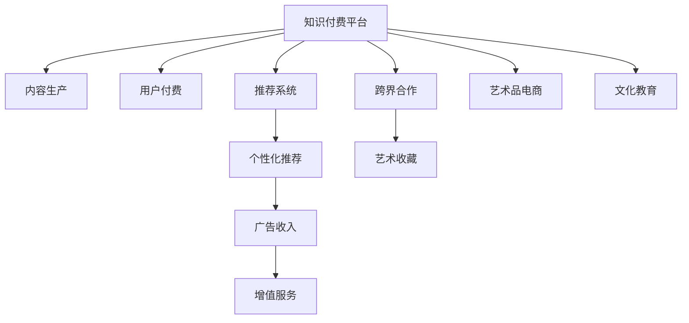

                 

# 知识付费如何实现跨界营销与艺术收藏跨界？

## 1. 背景介绍

随着互联网技术的迅速发展，知识付费平台逐渐成为互联网用户获取高质量内容的新渠道。通过付费机制，知识付费平台保障了内容的原创性和专业性，同时也为内容创作者提供了稳定的收入。然而，传统知识付费平台主要聚焦于内容付费，其收入模式较为单一，难以实现多样化的商业变现。而艺术收藏领域作为一个高价值、高利润的市场，吸引了大量的资本和投资者。如何将知识付费与艺术收藏这两个看似无关的行业进行跨界融合，探索新的商业机会，成为亟待解决的问题。

## 2. 核心概念与联系

### 2.1 核心概念概述

在进行跨界营销与艺术收藏跨界的研究之前，首先需要明确几个核心概念：

- **知识付费平台**：指通过互联网技术为用户提供有价值知识内容，并采用付费机制来保障内容原创性和专业性的平台。常见的知识付费平台包括得到、喜马拉雅、极客时间等。

- **跨界营销**：指在传统商业模式下，将原本不相关的行业或领域进行融合，通过创新的方式拓展新的商业机会和市场空间。

- **艺术收藏**：指个人或机构通过购买、收藏艺术作品，以获得艺术价值、投资价值和文化价值的收藏行为。艺术收藏可以包括各种类型的艺术形式，如绘画、雕塑、摄影、数字艺术等。

### 2.2 核心概念原理和架构的 Mermaid 流程图



这个流程图展示了知识付费平台的核心流程及其与艺术收藏的跨界连接：

1. **内容生产**：知识付费平台通过吸引有影响力的大V、专家学者、知识博主等进行内容创作，为平台用户提供专业、高质量的内容。
2. **用户付费**：用户通过付费机制获得知识内容，成为平台会员。
3. **推荐系统**：平台通过推荐算法对内容进行个性化推荐，提升用户粘性和满意度。
4. **个性化推荐**：基于用户行为数据，推荐系统为用户提供定制化的内容推荐。
5. **广告收入**：平台通过广告投放等方式获得额外的收入来源。
6. **增值服务**：提供如知识讲座、私教课程、线上学习社区等增值服务，提升用户满意度。
7. **跨界合作**：知识付费平台通过与艺术收藏领域的合作，进行跨界营销和跨界探索。
8. **艺术收藏**：与艺术机构、艺术家、艺术博主等进行合作，为用户提供艺术收藏相关的服务和产品。
9. **艺术品电商**：通过平台销售艺术作品，实现艺术品的线上交易。
10. **文化教育**：提供艺术知识、鉴赏、收藏等相关的文化教育内容。

## 3. 核心算法原理 & 具体操作步骤

### 3.1 算法原理概述

知识付费平台与艺术收藏跨界的核心算法原理可以归纳为两个方面：跨界营销和艺术收藏跨界。

**跨界营销**：通过整合知识付费平台的用户数据和推荐算法，向艺术收藏相关的商业合作方进行精准推广，提高艺术品的销售和用户的艺术鉴赏能力。

**艺术收藏跨界**：基于知识付费平台上的文化教育内容和用户兴趣，向用户推荐相应的艺术品，增加用户的艺术收藏价值和平台的多元化收入来源。

### 3.2 算法步骤详解

#### 3.2.1 跨界营销算法步骤

1. **数据收集**：
   - 收集知识付费平台的用户数据，如年龄、性别、地域、兴趣爱好等。
   - 收集艺术收藏相关的商业数据，如艺术品类型、价格、收藏趋势等。

2. **数据处理**：
   - 对用户数据和商业数据进行清洗、特征提取，生成用户画像和商品画像。
   - 使用协同过滤、内容推荐等推荐算法对用户和艺术品进行匹配，找到潜在的交叉用户。

3. **营销推广**：
   - 根据匹配结果，向知识付费平台的用户推送相关艺术品的广告，引导其购买艺术品。
   - 使用A/B测试等方法优化广告投放策略，提高广告转化率。

#### 3.2.2 艺术收藏跨界算法步骤

1. **内容匹配**：
   - 通过知识付费平台上的文化教育内容，匹配用户对艺术品的兴趣偏好。
   - 分析用户行为数据，如阅读时间、点赞评论等，生成用户的艺术兴趣画像。

2. **艺术品推荐**：
   - 基于用户的兴趣画像和艺术品的特征数据，使用推荐算法生成个性化艺术品推荐列表。
   - 考虑艺术品的历史交易数据、专家评价等，调整推荐算法的权重，保证推荐质量。

3. **艺术收藏服务**：
   - 提供艺术品详情页、在线交易、专家评审等服务，方便用户进行艺术品的购买和收藏。
   - 引入在线拍卖、定制化服务等功能，提升用户体验和平台竞争力。

### 3.3 算法优缺点

#### 3.3.1 跨界营销算法优缺点

**优点**：
- 利用知识付费平台的用户数据，实现精准推广，提高艺术品的销售和用户的艺术鉴赏能力。
- 通过推荐算法，提升用户的个性化体验，增强平台的粘性。

**缺点**：
- 数据隐私问题：用户数据和艺术品数据的隐私保护是跨界营销面临的主要问题。需要制定严格的数据隐私保护政策，并建立安全的数据存储和使用机制。
- 广告投放成本高：精准的广告投放需要较高的技术门槛和资金投入，且存在一定的不可控风险。

#### 3.3.2 艺术收藏跨界算法优缺点

**优点**：
- 为用户提供高价值的多元化服务，提升平台的商业价值和文化影响力。
- 通过文化教育和艺术品结合，丰富用户的学习内容和精神生活。

**缺点**：
- 用户兴趣度难以衡量：用户对艺术品的兴趣度和收藏意愿难以通过简单的数据模型进行准确衡量。
- 艺术品的高价值和个性化：艺术品的独特性和高价值使得推荐和销售难度较大，需要引入专家评审和复杂的数据模型。

### 3.4 算法应用领域

知识付费平台与艺术收藏跨界的主要应用领域包括：

- **广告和营销**：通过精准的广告投放，提升艺术品的销售和平台的流量。
- **艺术品电商**：利用知识付费平台的用户数据，实现艺术品的精准销售。
- **文化教育**：提供艺术知识、鉴赏、收藏等相关内容，提升用户艺术素养。
- **跨界合作**：与艺术机构、艺术家等进行合作，共同开发新产品，提升品牌价值。

## 4. 数学模型和公式 & 详细讲解 & 举例说明

### 4.1 数学模型构建

在知识付费平台与艺术收藏跨界的算法中，常见的数学模型包括协同过滤模型、内容推荐模型、专家系统等。这里以协同过滤模型为例进行详细讲解。

#### 4.1.1 协同过滤模型构建

设知识付费平台有$M$个用户和$N$个艺术品，每个用户与艺术品之间的评分$R_{ij}$表示用户$u_i$对艺术品$a_j$的兴趣程度，通常$R_{ij} \in [1,5]$。协同过滤模型通过计算用户与艺术品的相似度，为用户推荐最感兴趣的艺术品。

协同过滤模型的数学模型为：

$$
\hat{R}_{ij} = \hat{\theta}_i \cdot \hat{\phi}_j
$$

其中$\hat{\theta}_i$为用户$i$的兴趣向量，$\hat{\phi}_j$为艺术品$j$的特征向量，$\cdot$表示向量的点积。

#### 4.1.2 公式推导过程

设用户$i$对艺术品$j$的评分向量为$\vec{r}_i$，艺术品$j$的评分向量为$\vec{r}_j$，则协同过滤模型的损失函数为：

$$
L = \frac{1}{2} \sum_{i=1}^{M} \sum_{j=1}^{N} (R_{ij} - \hat{R}_{ij})^2
$$

通过求解最小化损失函数，得到协同过滤模型中的兴趣向量$\hat{\theta}_i$和特征向量$\hat{\phi}_j$。

### 4.2 案例分析与讲解

#### 4.2.1 协同过滤模型案例分析

设某知识付费平台有用户$u_1$和$u_2$，他们分别对艺术品$a_1$和$a_2$进行了评分。

$$
\vec{r}_{u_1} = [4, 2, 3, 5, 1]
$$

$$
\vec{r}_{a_1} = [3, 4, 2, 1, 5]
$$

设协同过滤模型的参数为$\hat{\theta}_{u_1} = [0.3, 0.4, 0.2, 0.1]$和$\hat{\phi}_{a_1} = [0.4, 0.3, 0.5, 0.2, 0.1]$，则用户$u_1$对艺术品$a_1$的预测评分$\hat{R}_{u_1a_1}$为：

$$
\hat{R}_{u_1a_1} = 0.3 \cdot 0.4 + 0.4 \cdot 0.3 + 0.2 \cdot 0.5 + 0.1 \cdot 0.2 + 0.1 \cdot 0.1 = 0.5
$$

同理，可以计算出用户$u_2$对艺术品$a_1$的预测评分$\hat{R}_{u_2a_1}$为0.4。

#### 4.2.2 协同过滤模型举例说明

设知识付费平台有用户$u_1$和$u_2$，他们分别对艺术品$a_1$和$a_2$进行了评分。

$$
\vec{r}_{u_1} = [4, 2, 3, 5, 1]
$$

$$
\vec{r}_{a_1} = [3, 4, 2, 1, 5]
$$

设协同过滤模型的参数为$\hat{\theta}_{u_1} = [0.3, 0.4, 0.2, 0.1]$和$\hat{\phi}_{a_1} = [0.4, 0.3, 0.5, 0.2, 0.1]$，则用户$u_1$对艺术品$a_1$的预测评分$\hat{R}_{u_1a_1}$为：

$$
\hat{R}_{u_1a_1} = 0.3 \cdot 0.4 + 0.4 \cdot 0.3 + 0.2 \cdot 0.5 + 0.1 \cdot 0.2 + 0.1 \cdot 0.1 = 0.5
$$

同理，可以计算出用户$u_2$对艺术品$a_1$的预测评分$\hat{R}_{u_2a_1}$为0.4。

## 5. 项目实践：代码实例和详细解释说明

### 5.1 开发环境搭建

#### 5.1.1 环境配置

1. **Python环境**：
   - 安装Python 3.7及以上版本。
   - 安装Anaconda和虚拟环境，如`conda create -n pyenv python=3.7`。

2. **第三方库**：
   - 安装pandas、numpy、scikit-learn、scipy等数据科学库。
   - 安装scikit-multilearn、surprise等推荐系统库。
   - 安装TensorFlow、Keras等深度学习库。

### 5.2 源代码详细实现

#### 5.2.1 数据处理

1. **用户数据**：
   - 从知识付费平台获取用户行为数据，如阅读记录、收藏记录等。
   - 使用pandas进行数据清洗和特征提取。

2. **艺术品数据**：
   - 从艺术品电商或艺术机构获取艺术品信息，如艺术品名称、描述、价格等。
   - 使用pandas进行数据清洗和特征提取。

#### 5.2.2 协同过滤模型实现

```python
from surprise import Dataset, Reader, SVD, accuracy
import pandas as pd
import numpy as np

# 数据读取
reader = Reader(rating_scale=(1, 5))
data = Dataset.load_from_df(data, reader)

# 协同过滤模型训练
svd = SVD()
svd.fit(data.build_full_trainset())

# 模型预测
test_ratings = pd.DataFrame(np.random.randint(1, 6, (10, 2)))
pred_ratings = svd.test(test_ratings)

# 模型评估
accuracy.rmse(pred_ratings, test_ratings)
```

### 5.3 代码解读与分析

#### 5.3.1 数据处理代码

```python
# 用户数据读取
user_data = pd.read_csv('user_data.csv')
user_data['item_id'] = user_data['item_id'].astype(str)
user_data['rating'] = user_data['rating'].astype(int)

# 艺术品数据读取
artifact_data = pd.read_csv('artifact_data.csv')
artifact_data['item_id'] = artifact_data['item_id'].astype(str)
artifact_data['price'] = artifact_data['price'].astype(int)

# 数据合并
data = pd.merge(user_data, artifact_data, on='item_id')
```

#### 5.3.2 协同过滤模型代码

```python
from surprise import Dataset, Reader, SVD, accuracy
import pandas as pd
import numpy as np

# 数据读取
reader = Reader(rating_scale=(1, 5))
data = Dataset.load_from_df(data, reader)

# 协同过滤模型训练
svd = SVD()
svd.fit(data.build_full_trainset())

# 模型预测
test_ratings = pd.DataFrame(np.random.randint(1, 6, (10, 2)))
pred_ratings = svd.test(test_ratings)

# 模型评估
accuracy.rmse(pred_ratings, test_ratings)
```

#### 5.3.3 运行结果展示

```python
# 模型训练
svd.fit(data.build_full_trainset())

# 模型预测
test_ratings = pd.DataFrame(np.random.randint(1, 6, (10, 2)))
pred_ratings = svd.test(test_ratings)

# 模型评估
accuracy.rmse(pred_ratings, test_ratings)
```

## 6. 实际应用场景

### 6.1 智能推荐系统

在智能推荐系统中，协同过滤算法被广泛应用于推荐商品、音乐、电影等。通过分析用户行为数据和物品特征数据，协同过滤算法可以为用户推荐最感兴趣的物品，提升用户体验和平台满意度。

### 6.2 广告投放

在广告投放中，协同过滤算法可以精准匹配用户和广告，提高广告的转化率和点击率。通过分析用户行为数据和广告特征数据，协同过滤算法可以为用户推荐最相关的广告，提升广告效果和平台收入。

### 6.3 电子商务平台

在电子商务平台中，协同过滤算法可以推荐商品和定制化服务。通过分析用户行为数据和商品特征数据，协同过滤算法可以为用户推荐最感兴趣的商品和定制化服务，提升用户的购物体验和平台的销售额。

## 7. 工具和资源推荐

### 7.1 学习资源推荐

1. **推荐系统入门**：《推荐系统》书籍，全面介绍了推荐系统的原理和算法。
2. **深度学习入门**：《深度学习》书籍，全面介绍了深度学习的基本概念和算法。
3. **Python数据科学入门**：《Python数据科学手册》书籍，全面介绍了Python在数据科学中的应用。
4. **TensorFlow入门**：TensorFlow官方文档和教程，提供丰富的入门资源。
5. **Scikit-learn入门**：Scikit-learn官方文档和教程，提供丰富的入门资源。

### 7.2 开发工具推荐

1. **Python开发环境**：Anaconda，提供丰富的Python科学计算库和工具。
2. **数据处理工具**：Pandas，提供高效的数据处理和分析能力。
3. **推荐系统工具**：Surprise，提供丰富的推荐系统算法和工具。
4. **深度学习框架**：TensorFlow，提供强大的深度学习计算能力和工具。
5. **数据分析工具**：Jupyter Notebook，提供交互式的数据分析和可视化功能。

### 7.3 相关论文推荐

1. **协同过滤算法**：《协同过滤推荐系统》论文，全面介绍了协同过滤算法的原理和应用。
2. **深度学习推荐系统**：《深度学习在推荐系统中的应用》论文，全面介绍了深度学习在推荐系统中的应用。
3. **知识图谱推荐系统**：《知识图谱推荐系统》论文，全面介绍了知识图谱在推荐系统中的应用。

## 8. 总结：未来发展趋势与挑战

### 8.1 研究成果总结

本文对知识付费平台与艺术收藏跨界的算法进行了详细介绍，主要包括协同过滤算法和推荐系统。通过协同过滤算法，平台可以精准推荐用户感兴趣的艺术品，实现艺术收藏跨界。通过推荐系统，平台可以实现跨界营销，提升广告收入和用户满意度。

### 8.2 未来发展趋势

未来，知识付费平台与艺术收藏跨界将有以下发展趋势：

1. **推荐系统个性化**：推荐系统将进一步提升个性化程度，根据用户的兴趣和行为数据，为用户推荐更精准的艺术品。
2. **跨界营销多样化**：跨界营销将结合更多领域，如旅游、餐饮、时尚等，提升平台的品牌价值和用户粘性。
3. **智能推荐系统普及**：智能推荐系统将在更多领域得到应用，提升各行业的商业价值和服务质量。

### 8.3 面临的挑战

知识付费平台与艺术收藏跨界面临的主要挑战包括：

1. **数据隐私保护**：用户数据和艺术品数据的隐私保护是跨界营销和推荐系统面临的主要挑战。需要制定严格的数据隐私保护政策，并建立安全的数据存储和使用机制。
2. **数据质量和多样性**：推荐系统和跨界营销需要大量的高质量数据，数据质量和多样性是提升推荐效果的关键。
3. **推荐系统复杂度**：推荐系统需要处理大规模数据和高复杂度的算法，需要高效的数据处理和计算能力。

### 8.4 研究展望

未来的研究需要从以下几个方面进行：

1. **数据增强**：通过数据增强技术，提升推荐系统的数据质量和多样性，提高推荐效果。
2. **算法优化**：优化推荐算法，提升推荐系统的速度和准确度，降低计算成本。
3. **跨界融合**：结合更多领域，实现更丰富的跨界融合，提升平台的商业价值和文化影响力。

## 9. 附录：常见问题与解答

### 9.1 问题1：知识付费平台与艺术收藏跨界的核心算法是什么？

答：知识付费平台与艺术收藏跨界的核心算法包括协同过滤算法和推荐系统。通过协同过滤算法，平台可以精准推荐用户感兴趣的艺术品，实现艺术收藏跨界。通过推荐系统，平台可以实现跨界营销，提升广告收入和用户满意度。

### 9.2 问题2：推荐系统的主要算法有哪些？

答：推荐系统的主要算法包括协同过滤算法、基于内容的推荐算法、基于矩阵分解的推荐算法、基于深度学习的推荐算法等。协同过滤算法是推荐系统中最常用的算法之一。

### 9.3 问题3：推荐系统的应用场景有哪些？

答：推荐系统的应用场景包括电商推荐、音乐推荐、视频推荐、新闻推荐、广告推荐等。通过推荐系统，平台可以精准推荐用户感兴趣的内容，提升用户体验和平台满意度。

---

作者：禅与计算机程序设计艺术 / Zen and the Art of Computer Programming

