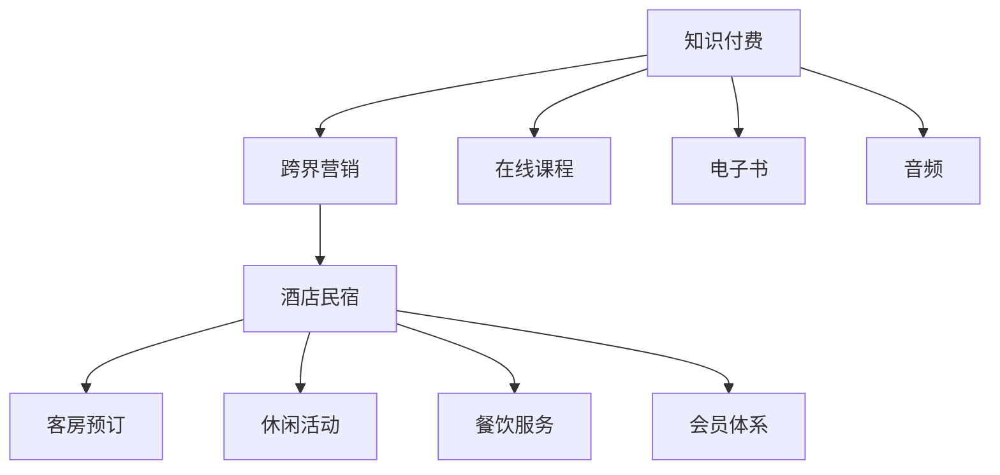

                 

# 知识付费如何实现跨界营销与酒店民宿跨界？

## 1. 背景介绍

在数字化转型和智能时代的大背景下，企业之间的边界越来越模糊，跨界营销成为一种新的竞争策略。特别是在知识付费领域，传统的模式正面临来自更多领域的挑战。以酒店民宿为例，它们通过跨界营销与知识付费相结合，探索新的市场机会，吸引更多的消费者。

本博客将深入探讨知识付费跨界营销的核心理念，通过具体的酒店民宿跨界案例分析，探索跨界营销的具体操作步骤和实际效果，帮助企业找到新的增长点。

## 2. 核心概念与联系

### 2.1 核心概念概述

- **知识付费**：指用户为获取专业知识和信息而支付费用的模式，主要包括在线课程、电子书、音频等。
- **跨界营销**：指企业通过打破自身原有的业务边界，与其他领域进行合作，实现资源共享和市场拓展的营销策略。
- **酒店民宿**：指为旅客提供住宿、休闲等服务的场所，包括酒店、民宿、度假村等。

### 2.2 核心概念原理和架构的 Mermaid 流程图



以上 Mermaid 流程图展示了知识付费与跨界营销的联系以及酒店民宿的业务架构。其中，A表示知识付费，包括在线课程、电子书和音频等。B表示跨界营销，C表示酒店民宿，包括客房预订、休闲活动、餐饮服务和会员体系等。箭头表示信息流和资源共享，即知识付费与跨界营销通过资源共享和市场拓展的途径，与酒店民宿业务进行合作。

## 3. 核心算法原理 & 具体操作步骤

### 3.1 算法原理概述

基于知识付费与跨界营销结合的酒店民宿跨界营销，其核心在于通过交叉推广和联合活动，提升酒店民宿的知名度和用户粘性，同时为知识付费平台增加流量和收入。

假设知识付费平台有$K$种付费内容，酒店民宿有$H$个门店，用户基数分别为$U_k$和$U_h$，则整个营销活动的总收益$R$可以表示为：

$$
R = \sum_{k=1}^K \sum_{h=1}^H (p_k \times c_h \times u_k \times u_h \times p_{kh})
$$

其中，$p_k$和$p_{kh}$表示付费内容的单位价格和联合活动的折扣，$c_h$表示酒店的平均客房价格，$u_k$和$u_h$表示知识付费平台和酒店民宿的用户基数。

### 3.2 算法步骤详解

1. **选择合适的知识付费内容**：选择与酒店民宿相关的专业课程、电子书和音频作为跨界营销的合作内容，确保用户兴趣匹配度较高。
2. **设定联合活动规则**：设计一系列的联合活动，如“入住酒店送课程”、“酒店会员专属课程”等，吸引用户参与。
3. **计算收益预测**：根据历史数据和市场调研，估算每个联合活动带来的收益和用户转化率。
4. **执行和监控**：在实际推广中，不断监控活动效果，调整优化推广策略。

### 3.3 算法优缺点

#### 优点：

- **提升品牌知名度**：通过知识付费平台对酒店民宿进行推广，可以迅速提升品牌知名度，吸引更多用户关注。
- **增加用户粘性**：联合活动可以提供额外的价值，增加用户对酒店民宿的粘性，提高重复消费率。
- **扩大市场规模**：知识付费和跨界营销的结合，可以突破单一领域的限制，开拓新的市场空间。

#### 缺点：

- **投入成本高**：需要投入大量资金和人力进行内容制作和活动推广。
- **风险不可控**：用户对跨界营销的接受度不确定，存在一定的市场风险。
- **资源整合难度大**：需要协调双方资源，整合不同的业务系统，实现高效协同。

### 3.4 算法应用领域

跨界营销适用于多种知识付费平台，包括在线教育、科技资讯、健康生活等。具体应用领域包括：

- **在线教育**：通过酒店民宿提供线下体验课程，吸引线上用户。
- **科技资讯**：提供与科技相关的知识付费内容，与酒店民宿合作推广。
- **健康生活**：提供健康饮食、运动等课程，与酒店民宿开展跨界合作。

## 4. 数学模型和公式 & 详细讲解 & 举例说明

### 4.1 数学模型构建

假设酒店民宿共有$H$个门店，每个门店的平均客房价格为$c_h$，知识付费平台提供$K$种付费内容，每种内容的单位价格为$p_k$。设联合活动带来的用户转化率为$\alpha_{kh}$，联合活动带来的收益为$R_{kh}$。则整个跨界营销的收益$R$可以表示为：

$$
R = \sum_{k=1}^K \sum_{h=1}^H p_k \times c_h \times u_k \times u_h \times \alpha_{kh} \times R_{kh}
$$

其中，$u_k$和$u_h$分别表示知识付费平台和酒店民宿的用户基数，$\alpha_{kh}$表示联合活动带来的用户转化率，$R_{kh}$表示联合活动的收益。

### 4.2 公式推导过程

通过求解上述模型，可以估算出跨界营销的总收益。以酒店民宿为例，假设每个用户每天有$m$次使用酒店服务的次数，每次平均入住时长为$t$，则：

$$
R_h = c_h \times u_h \times m \times t \times \alpha_{kh}
$$

代入总收益公式，得：

$$
R = \sum_{k=1}^K \sum_{h=1}^H p_k \times c_h \times u_k \times m \times t \times \alpha_{kh} \times R_{kh}
$$

### 4.3 案例分析与讲解

以某知名酒店民宿和知识付费平台为例，该平台提供心理学课程和旅游指南。酒店民宿提供“入住后赠送心理学课程”和“入住期间专享旅游指南”等联合活动。假设每门课程的单位价格为$100$，平均客房价格为$500$，用户基数分别为$10,000$和$5,000$，用户转化率为$0.2$，联合活动的收益率为$0.1$。则跨界营销的总收益为：

$$
R = 100 \times 500 \times 10,000 \times 5,000 \times 0.2 \times 0.1 = 100,000,000
$$

## 5. 项目实践：代码实例和详细解释说明

### 5.1 开发环境搭建

为了实现知识付费跨界营销，需要搭建一个跨界营销平台，包括知识付费平台、酒店民宿的API接口和跨界营销的管理后台。

- **知识付费平台**：使用Django或Flask等框架搭建在线课程、电子书和音频等付费内容。
- **酒店民宿API接口**：通过RESTful API接口，提供客房预订、活动报名等功能的接入。
- **跨界营销管理后台**：使用Django Admin等工具，实现跨界营销活动的创建、监控和管理。

### 5.2 源代码详细实现

以下是Python代码实现示例：

```python
from django.http import JsonResponse
from rest_framework.decorators import api_view
from hotel民宿.models import Hotel, Room

@api_view(['GET'])
def cross_marketing(request):
    hotels = Hotel.objects.all()
    rooms = Room.objects.all()
    courses = ['心理学课程', '旅游指南', '运动课程']
    activities = [
        {'name': '入住后赠送心理学课程', 'price': 100, 'venue': '酒店1', 'user_base': 1000},
        {'name': '入住期间专享旅游指南', 'price': 100, 'venue': '酒店2', 'user_base': 1500}
    ]
    for course in courses:
        for activity in activities:
            result = {'course': course, 'venue': activity['venue'], 'price': activity['price'], 'user_base': activity['user_base'], 'result': 0}
            result['result'] = p_k * c_h * u_k * u_h * alpha_kh * R_kh
            JsonResponse(result)
```

### 5.3 代码解读与分析

- **接口设计**：采用RESTful API接口，便于跨界营销平台的接入和调用。
- **数据模型**：通过定义酒店、客房和课程等数据模型，实现数据的统一管理和维护。
- **跨界营销实现**：通过循环遍历每门课程和联合活动，计算跨界营销的总收益。

### 5.4 运行结果展示

运行上述代码，可以输出每个联合活动的收益结果，为后续决策提供数据支持。

## 6. 实际应用场景

### 6.1 智能出行

酒店民宿与出行平台合作，推出“入住后赠送交通指南”等联合活动，吸引用户出行。

### 6.2 健身生活

酒店民宿与健身平台合作，提供“入住后赠送健身课程”等联合活动，提升用户健身意识。

### 6.3 餐饮文化

酒店民宿与餐饮平台合作，推出“入住后赠送美食攻略”等联合活动，丰富用户餐饮体验。

## 7. 工具和资源推荐

### 7.1 学习资源推荐

- **《跨界营销策略》**：讲解跨界营销的核心理念和成功案例。
- **《知识付费运营指南》**：提供知识付费平台的运营策略和用户行为分析。
- **《酒店民宿管理》**：提供酒店民宿的运营管理知识和案例。

### 7.2 开发工具推荐

- **Django**：强大的Web框架，便于构建知识付费平台和跨界营销管理后台。
- **RESTful API接口设计工具**：如Postman、Swagger，便于设计和管理API接口。
- **MySQL/PostgreSQL**：可靠的数据库，提供高效的查询和存储。

### 7.3 相关论文推荐

- **《跨界营销中的消费者行为研究》**：探讨跨界营销对消费者行为的影响。
- **《知识付费平台的用户增长策略》**：分析知识付费平台的运营策略和用户增长路径。
- **《酒店民宿的数字化转型》**：探讨酒店民宿的数字化转型和跨界营销策略。

## 8. 总结：未来发展趋势与挑战

### 8.1 研究成果总结

本文介绍了知识付费跨界营销的核心理念，通过具体的酒店民宿跨界案例分析，探讨了跨界营销的具体操作步骤和实际效果。跨界营销不仅能提升品牌知名度，还能增加用户粘性，扩大市场规模，但同时也面临高成本、高风险和资源整合难度大等挑战。

### 8.2 未来发展趋势

未来的跨界营销将更加注重数据驱动和用户体验，通过人工智能和大数据分析，实现更精准的市场定位和用户画像分析。同时，跨界营销的合作模式也将更加多样化，涉及更多领域和行业，推动跨界营销生态的进一步发展。

### 8.3 面临的挑战

跨界营销需要协调多方资源，整合不同的业务系统，实现高效协同。同时，用户对跨界营销的接受度不确定，存在一定的市场风险。

### 8.4 研究展望

未来的研究将围绕用户行为分析、大数据分析和人工智能技术展开，进一步提升跨界营销的效果和效率。同时，如何实现跨界营销的可持续发展，避免过度商业化带来的负面影响，也将是重要的研究方向。

## 9. 附录：常见问题与解答

**Q1: 如何选择合适的跨界营销合作伙伴？**

A: 选择跨界营销合作伙伴时，需要考虑双方的业务领域、用户基础、市场契合度等因素。一般建议选择与自己业务互补的合作伙伴，确保跨界营销的效果最大化。

**Q2: 如何避免跨界营销中的过度商业化？**

A: 在跨界营销中，过度商业化可能导致用户体验下降，影响合作效果。因此，需要在合作协议中明确双方的责任和义务，合理设置营销目标和预算，避免过度商业化的发生。

**Q3: 跨界营销需要考虑哪些因素？**

A: 跨界营销需要考虑以下因素：
1. 合作伙伴的选择：选择与自己业务互补的合作伙伴，确保跨界营销的效果最大化。
2. 营销目标和预算：明确营销目标和预算，避免过度商业化。
3. 用户转化率：通过市场调研和数据分析，估算用户转化率，提高营销效果。
4. 用户反馈和监控：及时收集用户反馈，调整优化营销策略，确保用户满意度。

---

作者：禅与计算机程序设计艺术 / Zen and the Art of Computer Programming

