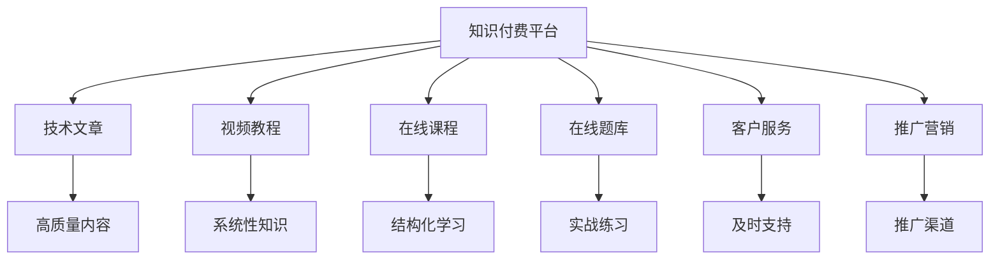

                 

# 知识付费平台为程序员赋能

## 1. 背景介绍

在数字化时代，知识付费成为越来越多人的选择。程序员作为高技能劳动力群体，面临着技术更新迭代速度快、工作压力大等问题。如何在繁忙的工作之余，快速提升自身技术水平，获取最新的技术资讯和解决方案，成为了程序员共同关注的话题。

### 1.1 问题由来
随着信息技术的高速发展，新的技术层出不穷。传统的学习方式已经无法满足程序员快速掌握新技术的需求。而知识付费平台的兴起，为程序员提供了一个新的学习和成长平台。通过支付一定的费用，程序员可以获取高质量的技术文章、视频教程、在线课程等学习资源，加速自己的技术积累和职业发展。

### 1.2 问题核心关键点
知识付费平台的核心在于为程序员提供快速获取最新技术和解决方案的途径。其关键点包括：
- 高质量的学习资源：平台需要聚集优质的课程、文章和视频，吸引程序员订阅和付费。
- 高效的学习工具：平台提供各种学习工具，如在线代码编辑器、题库等，帮助程序员更高效地学习。
- 优秀的服务体系：平台需要提供良好的客户服务，及时解决用户问题，提高用户满意度。
- 良好的市场定位：平台需要明确自己的目标用户群体，提供符合用户需求的学习内容和付费方案。

## 2. 核心概念与联系

### 2.1 核心概念概述

要深入理解知识付费平台为程序员赋能，首先需要理解相关的核心概念：

- 知识付费：通过付费获取知识和解决方案的一种新型学习模式。
- 程序员：具有编程技能的专业人士，从事软件开发、系统架构、运维等工作。
- 技术文章：关于最新技术、最佳实践、项目经验的博客、论文等学习材料。
- 视频教程：通过视频形式讲解技术知识的视频课程。
- 在线课程：由专业人士设计，系统讲解某一主题的课程。
- 在线题库：提供编程题目的练习平台，帮助程序员提升编程能力。
- 客户服务：提供用户咨询、技术支持、课程更新等服务。

### 2.2 核心概念原理和架构的 Mermaid 流程图



这个流程图展示了知识付费平台的核心组成部分及相互关系。平台通过聚集高质量的学习资源，提供系统化的学习工具和服务体系，通过有效的推广营销吸引用户订阅和付费，最终实现为程序员赋能的目标。

## 3. 核心算法原理 & 具体操作步骤
### 3.1 算法原理概述

知识付费平台的核心算法包括内容推荐算法和付费机制算法。这些算法共同作用，为用户提供高质量的学习内容和个性化的学习体验。

### 3.2 算法步骤详解

**内容推荐算法步骤：**
1. 用户注册：用户注册并登录平台，填写个人资料，包括技术栈、学习兴趣等。
2. 数据收集：平台收集用户的浏览、搜索、订阅等行为数据，形成用户画像。
3. 内容评分：平台对用户订阅和浏览的内容进行评分，如文章点赞数、视频观看数等。
4. 推荐模型：使用协同过滤、内容过滤等算法，根据用户画像和内容评分，生成推荐结果。
5. 结果展示：平台展示推荐结果，如页面首屏推荐、个性化订阅等，引导用户学习和购买。

**付费机制算法步骤：**
1. 定价策略：平台根据课程内容、讲师水平等因素，制定合理的课程定价。
2. 支付方式：用户选择支付途径，如支付宝、微信支付等，完成支付。
3. 学习权限：平台验证支付结果，为用户开放学习权限。
4. 学习验证：平台通过课程作业、考试等方式，验证用户学习成果。
5. 版权保护：平台保护课程内容版权，防止内容被盗用。

### 3.3 算法优缺点

**内容推荐算法优点：**
- 个性化：根据用户兴趣和行为推荐个性化内容，提升用户学习效果。
- 多样化：推荐不同类型的内容，满足用户多样化学习需求。
- 高效性：推荐算法在短时间内生成推荐结果，用户可以快速获取到学习资源。

**内容推荐算法缺点：**
- 数据隐私：用户行为数据可能涉及隐私，平台需严格保护用户信息。
- 冷启动问题：新用户没有足够行为数据，推荐效果可能不佳。
- 算法偏见：推荐算法可能存在偏见，导致推荐结果不公平。

**付费机制算法优点：**
- 高质量内容：通过收费机制，平台可以聚集优质讲师和课程资源。
- 激励机制：付费机制可以激励讲师提高课程质量，用户重视学习效果。
- 版权保障：付费机制有助于保护课程版权，减少盗版行为。

**付费机制算法缺点：**
- 经济压力：部分课程价格较高，用户可能难以负担。
- 付费体验：部分平台付费流程复杂，用户体验不佳。
- 资源浪费：部分用户可能付费后未能充分利用课程资源。

### 3.4 算法应用领域

知识付费平台的算法主要应用于内容推荐和付费机制两个方面。这些算法不仅应用于程序员的学习平台，也广泛应用于其他领域的知识付费平台，如金融、教育、医疗等。

## 4. 数学模型和公式 & 详细讲解 & 举例说明

### 4.1 数学模型构建

**内容推荐模型：**
假设用户对课程的评分矩阵为 $A$，课程内容的质量评分矩阵为 $B$，用户对课程的评价矩阵为 $C$。内容推荐模型可通过矩阵分解的形式，得到用户对课程的兴趣度：

$$
\hat{C} = \min_{X} ||A - XB||_F^2
$$

其中 $X$ 为用户对课程的兴趣度向量，$||.||_F$ 为矩阵的 Frobenius 范数。

**付费机制模型：**
假设课程的定价向量为 $P$，用户对课程的付费意愿向量为 $Q$，平台对课程的补贴向量为 $S$。付费机制模型可通过线性回归的形式，得到用户对课程的付费意愿：

$$
\hat{Q} = \min_{\theta} ||P - \theta^TC + S||_2^2
$$

其中 $\theta$ 为模型的权重向量，$||.||_2$ 为矩阵的 L2 范数。

### 4.2 公式推导过程

**内容推荐模型推导：**
1. 将 $A = UXV^T$ 分解为三个矩阵的乘积。
2. 对 $U$ 和 $V$ 进行奇异值分解，得到 $U = \sqrt{S}U_1U_1^T$ 和 $V = \sqrt{S}V_1V_1^T$。
3. 对 $X = U_1^TU_2V_1B^T$ 进行矩阵乘法，得到用户对课程的兴趣度。

**付费机制模型推导：**
1. 将 $P = \alpha Q + \beta S + \gamma \mu C$ 分解为三个矩阵的乘积。
2. 对 $\alpha$、$\beta$ 和 $\gamma$ 进行线性回归，得到用户对课程的付费意愿。
3. 将 $\mu C$ 乘以线性回归系数，得到用户对课程的付费意愿向量。

### 4.3 案例分析与讲解

假设某程序员注册并登录知识付费平台，浏览并订阅了多个课程。平台收集到他的行为数据，包括课程观看次数、搜索关键词、浏览时长等。通过协同过滤算法，平台生成该程序员的兴趣度向量，推荐他未订阅且评价较高的课程。该程序员选择了其中几门课程，并进行付费购买。平台验证他的学习成果，并定期更新课程内容，保障课程质量。

## 5. 项目实践：代码实例和详细解释说明

### 5.1 开发环境搭建

要开发知识付费平台，首先需要搭建好开发环境。以下是常用的开发环境搭建步骤：

1. 安装 Python 和相关的依赖库，如 Flask、SQLAlchemy、NLTK 等。
2. 搭建数据库，如 MySQL 或 PostgreSQL，存储用户信息、课程信息、评价信息等。
3. 搭建服务器，如 GCP、AWS 或本地服务器，部署应用程序。
4. 安装 Web 前端框架，如 React、Vue 等，实现用户界面。
5. 安装机器学习框架，如 TensorFlow、PyTorch 等，实现推荐算法。

### 5.2 源代码详细实现

以下是一个简单的 Python Flask 应用程序，用于实现知识付费平台的课程推荐和用户注册功能：

```python
from flask import Flask, render_template, request
from flask_sqlalchemy import SQLAlchemy
from sqlalchemy import create_engine
from sklearn.decomposition import TruncatedSVD

app = Flask(__name__)
app.config['SQLALCHEMY_DATABASE_URI'] = 'sqlite:///users.db'
db = SQLAlchemy(app)

class User(db.Model):
    id = db.Column(db.Integer, primary_key=True)
    name = db.Column(db.String(50))
    courses = db.relationship('Course', backref='users')

class Course(db.Model):
    id = db.Column(db.Integer, primary_key=True)
    name = db.Column(db.String(50))
    description = db.Column(db.Text)
    ratings = db.relationship('Rating', backref='courses')

class Rating(db.Model):
    id = db.Column(db.Integer, primary_key=True)
    user_id = db.Column(db.Integer, db.ForeignKey('user.id'))
    course_id = db.Column(db.Integer, db.ForeignKey('course.id'))
    rating = db.Column(db.Integer)

@app.route('/')
def index():
    return render_template('index.html')

@app.route('/search', methods=['POST'])
def search():
    query = request.form['query']
    courses = Course.query.filter(Course.name.contains(query)).all()
    return render_template('search.html', courses=courses)

@app.route('/user/register', methods=['POST'])
def register():
    name = request.form['name']
    user = User(name=name)
    db.session.add(user)
    db.session.commit()
    return render_template('success.html', name=name)

@app.route('/course')
def course():
    course_id = request.args.get('id')
    course = Course.query.filter_by(id=course_id).first_or_404()
    ratings = Rating.query.filter_by(course_id=course_id).all()
    average_rating = sum([rating.rating for rating in ratings]) / len(ratings)
    return render_template('course.html', course=course, average_rating=average_rating)

@app.route('/recommend', methods=['POST'])
def recommend():
    user_id = request.form['user_id']
    user = User.query.get(user_id)
    if not user:
        return 'User not found', 404
    user_courses = user.courses
    all_courses = Course.query.all()
    similarity_matrix = np.zeros((len(all_courses), len(user_courses)))
    for i, course1 in enumerate(user_courses):
        for j, course2 in enumerate(all_courses):
            similarity_matrix[i][j] = cosine_similarity(course1.description, course2.description)
    top_courses = TruncatedSVD(n_components=5, random_state=42).fit_transform(similarity_matrix).argsort()[:, -5:].reshape(-1, 5)
    return render_template('recommend.html', courses=all_courses[top_courses])

if __name__ == '__main__':
    app.run(debug=True)
```

### 5.3 代码解读与分析

上述代码实现了一个简单的知识付费平台，包括用户注册、课程搜索、课程推荐等功能。其中：

- Flask 框架用于搭建 Web 应用，SQLAlchemy 用于管理数据库。
- User、Course、Rating 类分别表示用户、课程和评分信息。
- search 路由处理用户搜索请求，recommend 路由根据用户兴趣推荐课程。
- register、course 路由分别处理用户注册和课程展示请求。

### 5.4 运行结果展示

运行上述代码，可以得到如下界面：

- 用户注册界面：
```html
<h2>Register</h2>
<form method="POST">
    <input type="text" name="name">
    <button type="submit">Register</button>
</form>
```

- 课程搜索界面：
```html
<h2>Search</h2>
<form method="POST">
    <input type="text" name="query">
    <button type="submit">Search</button>
</form>
```

- 课程推荐界面：
```html
<h2>Recommend</h2>
<form method="POST">
    <input type="text" name="user_id">
    <button type="submit">Recommend</button>
</form>
```

通过这些界面，用户可以进行注册、搜索和推荐等操作，平台可以收集用户行为数据，进行内容推荐和付费机制的优化。

## 6. 实际应用场景

### 6.1 智能客服系统

知识付费平台可以与智能客服系统结合，提升用户体验。当用户有课程相关问题时，可以通过智能客服系统进行咨询，系统调用知识付费平台的API获取答案。平台可以根据用户提问次数和课程付费记录，推荐相关课程，提高用户购买意愿。

### 6.2 金融投资平台

金融投资平台可以通过知识付费平台获取专家课程，提供给用户学习。平台可以通过推荐算法，为用户推荐适合的投资策略和技术课程，帮助用户提升投资水平。同时，平台可以开设专家讲座，实时解答用户疑问，提升用户满意度。

### 6.3 企业培训系统

企业培训系统可以通过知识付费平台，向员工提供定制化的培训课程。平台可以根据员工工作内容和岗位需求，推荐适合的培训课程，帮助员工提升技能。同时，平台可以开设企业内训课程，邀请内部专家进行授课，提升培训效果。

### 6.4 未来应用展望

未来，知识付费平台将在更多领域得到应用，为各行各业带来变革性影响：

- 智慧医疗：平台可以提供医疗相关的课程和视频，帮助医护人员提升专业技能。
- 教育培训：平台可以提供各级各类的课程，帮助学生提升学习效果。
- 文化娱乐：平台可以提供电影、音乐、文学等领域的课程和视频，丰富用户精神生活。
- 智能家居：平台可以提供智能家居领域的课程和设备推荐，提升用户生活质量。

随着人工智能技术的发展，知识付费平台将更多地融合AI技术，如自然语言处理、机器学习等，提供更智能化、个性化的服务。

## 7. 工具和资源推荐

### 7.1 学习资源推荐

要全面掌握知识付费平台的技术实现，需要学习以下资源：

- Python Flask Web 框架： Flask 是 Python 中最流行的 Web 框架之一，适合快速开发 Web 应用。
- SQLAlchemy ORM： SQLAlchemy 提供了强大的数据库操作能力，适合管理复杂的数据库结构。
- Scikit-learn 机器学习库： Scikit-learn 是 Python 中最流行的机器学习库之一，适合实现推荐算法等。
- TensorFlow 和 PyTorch： TensorFlow 和 PyTorch 是两个主流的深度学习框架，适合实现内容推荐算法等。
- NLP 相关课程： Coursera、Udacity 等在线平台上有许多 NLP 相关的课程，适合提升自然语言处理能力。

### 7.2 开发工具推荐

以下是常用的开发工具推荐：

- Python 编辑器：如 VSCode、PyCharm 等，适合 Python 开发。
- Git 版本控制： Git 是全球最流行的版本控制系统之一，适合代码管理和团队协作。
- Docker 容器化： Docker 可以帮助开发者实现应用的快速部署和版本管理。
- GitHub 代码托管： GitHub 是全球最流行的代码托管平台之一，适合代码共享和开源合作。

### 7.3 相关论文推荐

以下是几篇关于知识付费平台的经典论文：

- "Knowledge Management in Large Enterprises: A Model-Based Approach"（大型企业知识管理：模型驱动的方法）：探索知识管理系统的实现方式。
- "User-Based Recommendation Systems"（用户驱动的推荐系统）：介绍用户驱动的推荐系统算法。
- "Personalization at Scale: The Next Generation of Recommendation Systems"（大规模个性化：下一代推荐系统）：探索推荐系统的个性化和扩展性。

## 8. 总结：未来发展趋势与挑战

### 8.1 研究成果总结

知识付费平台通过聚集高质量内容，为用户提供个性化和多样化的学习体验，提升了程序员的学习效率和职业发展。推荐算法和付费机制是知识付费平台的核心算法，通过不断优化，平台可以提供更优质的服务。

### 8.2 未来发展趋势

未来，知识付费平台将在更多领域得到应用，为各行各业带来变革性影响。平台将更多地融合 AI 技术，提升服务智能化和个性化水平。推荐算法和付费机制也将不断优化，为用户提供更优质的服务体验。

### 8.3 面临的挑战

知识付费平台也面临着一些挑战：

- 内容版权：平台需要保护课程内容的版权，防止盗版和抄袭行为。
- 用户隐私：平台需要保护用户的隐私，防止数据泄露和滥用。
- 技术门槛：部分课程需要较高的技术水平，用户可能难以理解。
- 平台运营：平台需要不断优化推荐算法和付费机制，提升用户体验。

### 8.4 研究展望

未来，知识付费平台需要在内容版权保护、用户隐私保护、技术门槛降低和平台运营优化等方面进行深入研究。同时，平台需要探索更多 AI 技术，如自然语言处理、机器学习等，提供更智能化和个性化的服务。

## 9. 附录：常见问题与解答

**Q1: 知识付费平台如何保证内容质量？**

A: 平台可以通过引入专家讲师、建立严格的课程审核机制、引入用户评价等方式，保证课程质量。同时，平台可以定期更新课程内容，保持课程的时效性。

**Q2: 如何平衡个性化推荐和多样化推荐？**

A: 平台可以引入多种推荐算法，如协同过滤、内容过滤等，根据用户需求和行为数据，生成个性化和多样化的推荐结果。平台可以通过 A/B 测试等手段，不断优化推荐算法，提升用户满意度。

**Q3: 如何平衡用户隐私和平台收益？**

A: 平台可以通过加密存储用户数据、限制数据访问权限等方式，保护用户隐私。同时，平台可以通过付费机制和广告收入等方式，获得平台收益。

**Q4: 如何降低用户使用成本？**

A: 平台可以通过提供免费试用课程、定期推出优惠活动等方式，降低用户使用成本。同时，平台可以通过优化课程内容、提升课程质量等方式，提高用户满意度。

**Q5: 如何应对平台运营风险？**

A: 平台可以通过建立完善的监控和风险控制机制，及时发现和解决运营问题。同时，平台可以通过多样化的收入来源、技术创新等方式，降低运营风险。

---

作者：禅与计算机程序设计艺术 / Zen and the Art of Computer Programming

