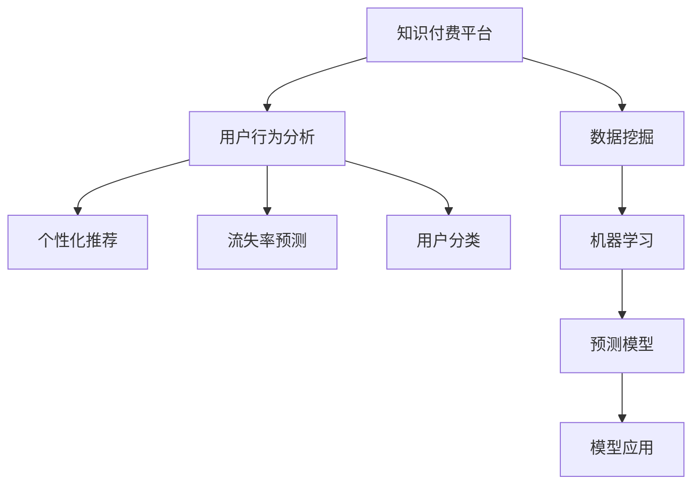

                 

# 知识付费平台的用户行为分析与应用

> 关键词：用户行为分析,知识付费平台,数据挖掘,机器学习,预测模型,个性化推荐

## 1. 背景介绍

### 1.1 问题由来
随着互联网的普及和数字经济的快速发展，知识付费平台在近年来得到了迅速发展。这种基于互联网的线上付费形式，为个人和企业提供了新的知识获取方式和商业模式。然而，知识付费平台的经营面临着诸多挑战，其中用户行为分析是一个核心问题。

用户行为分析可以帮助平台运营方了解用户偏好、活跃度和流失率，从而制定更加精准的运营策略，提升用户体验和平台营收。基于用户的互动数据、购买记录、搜索行为等，用户行为分析不仅可以提升个性化推荐的效果，还可以优化平台的用户体验和商品呈现。

### 1.2 问题核心关键点
在知识付费平台中，用户行为分析主要涉及以下几个关键点：
- **数据获取**：收集用户行为数据，如浏览记录、搜索词、购买记录等。
- **数据处理**：清洗、格式化和归一化数据，确保数据的准确性和一致性。
- **数据分析**：采用统计分析和机器学习方法，挖掘用户行为特征和模式。
- **模型建立**：建立预测模型，如推荐系统、流失率预测模型、用户分类模型等。
- **模型应用**：将模型应用到实际运营中，优化用户体验和平台收入。

### 1.3 问题研究意义
用户行为分析在知识付费平台中具有重要意义，具体如下：
- **提升用户体验**：通过精准的个性化推荐，提升用户满意度和黏性。
- **优化运营策略**：根据用户行为预测流失风险，及时采取措施提升留存率。
- **增加收入渠道**：通过用户分类和行为分析，发现新的收入机会和增长点。
- **增强平台竞争力**：通过深入了解用户需求和行为，构建差异化的竞争优势。

## 2. 核心概念与联系

### 2.1 核心概念概述

为更好地理解用户行为分析与知识付费平台之间的关系，本节将介绍几个密切相关的核心概念：

- **知识付费平台**：基于互联网，提供专业知识的付费服务，如文章、视频、音频等。常见平台包括得到、喜马拉雅、知乎等。
- **用户行为分析**：通过收集和分析用户在线行为数据，了解用户需求、偏好和行为模式，为平台运营提供数据支撑。
- **数据挖掘**：从大量数据中提取有用的信息和模式，辅助决策和优化运营。
- **机器学习**：利用数据和算法，自动化地构建和优化模型，提升预测准确率和决策效率。
- **个性化推荐**：根据用户历史行为和偏好，推荐最适合用户的商品或内容，提升用户体验和平台收入。
- **流失率预测**：通过用户行为数据，预测用户流失概率，提前采取措施提升用户留存率。
- **用户分类**：基于用户行为特征，将用户分为高价值、中价值和低价值用户，进行差异化运营。

这些核心概念之间的逻辑关系可以通过以下Mermaid流程图来展示：



这个流程图展示了好几个核心概念及其之间的关系：

1. 知识付费平台通过收集用户行为数据，启动用户行为分析过程。
2. 数据挖掘技术从海量数据中提取出用户行为特征。
3. 机器学习利用这些特征构建预测模型，如推荐系统、流失率预测等。
4. 预测模型通过模型应用，优化个性化推荐、流失预测、用户分类等运营策略。

## 3. 核心算法原理 & 具体操作步骤
### 3.1 算法原理概述

在知识付费平台中，用户行为分析的核心算法通常涉及以下几个方面：
- **推荐系统**：基于协同过滤、内容推荐等技术，个性化推荐商品或内容。
- **流失率预测**：通过构建预测模型，预测用户流失概率，及时采取挽留措施。
- **用户分类**：利用聚类、分类等技术，将用户分为高价值、中价值和低价值用户，进行差异化运营。

这些算法通常以用户行为数据为基础，通过机器学习模型进行预测和分类。其核心原理是利用历史数据，构建统计模型，预测用户未来的行为和偏好。

### 3.2 算法步骤详解

以个性化推荐系统为例，其核心算法步骤包括：

**Step 1: 数据收集**
- 收集用户的历史行为数据，如浏览记录、购买记录、评分数据等。
- 清洗和预处理数据，确保数据质量。

**Step 2: 特征提取**
- 从原始数据中提取有意义的特征，如用户的兴趣、行为时长、消费水平等。
- 利用机器学习技术，自动选择最相关的特征。

**Step 3: 模型训练**
- 选择适当的推荐算法，如协同过滤、基于内容的推荐等。
- 利用历史数据训练推荐模型，如矩阵分解、协同过滤等。

**Step 4: 模型优化**
- 使用交叉验证等方法，优化模型参数，提升预测准确率。
- 引入正则化技术，防止过拟合。

**Step 5: 模型应用**
- 将训练好的推荐模型应用于实际推荐系统中，生成个性化推荐。
- 实时更新模型，不断优化推荐效果。

### 3.3 算法优缺点

个性化推荐系统的优点包括：
- 提高用户满意度和黏性。个性化推荐可以提升用户对平台的依赖和满意度。
- 优化收入来源。通过推荐高质量内容和商品，增加平台收入。
- 提升运营效率。自动化推荐系统可以降低运营成本，提高服务效率。

其缺点包括：
- 数据隐私问题。收集和分析用户数据可能引发隐私问题，需要严格遵守数据保护法规。
- 数据质量问题。用户数据的质量和完整性直接影响推荐效果。
- 推荐效果不稳定。推荐算法需要不断优化和更新，才能适应用户需求的变化。

### 3.4 算法应用领域

个性化推荐系统在知识付费平台中具有广泛应用，具体如下：

- **商品推荐**：推荐用户感兴趣的文章、视频、音频等商品。
- **内容推荐**：推荐用户感兴趣的主题、标签、作者等。
- **广告推荐**：推荐与用户行为相关的广告内容，增加广告收入。
- **活动推荐**：推荐用户感兴趣的课程、讲座等，提升活动参与度。

此外，个性化推荐系统还广泛应用于电商、社交媒体、视频网站等多个领域，成为提升用户体验和平台收入的重要工具。

## 4. 数学模型和公式 & 详细讲解 & 举例说明

### 4.1 数学模型构建

在个性化推荐系统中，常用的数学模型包括协同过滤、基于内容的推荐、基于深度学习的推荐等。这里以协同过滤为例，介绍推荐系统的数学模型构建。

协同过滤推荐系统通过用户-物品评分矩阵 $R \in \mathbb{R}^{N\times M}$ 来表示用户对不同商品的评分，其中 $N$ 为用户数，$M$ 为商品数。假设用户 $i$ 对商品 $j$ 的评分记为 $r_{ij}$，协同过滤的目标是根据用户 $i$ 的历史评分数据，预测其未评分的商品 $k$ 的评分 $r_{ik}$。

协同过滤模型基于用户和商品之间的相似性，通过矩阵分解方法，将评分矩阵 $R$ 分解为两个低维矩阵 $P \in \mathbb{R}^{N\times K}$ 和 $Q \in \mathbb{R}^{M\times K}$，其中 $K$ 为因子数。分解后的用户向量 $p_i$ 和商品向量 $q_j$ 可以表示为：

$$
p_i = \mathbf{U}_i^T R q_j = \mathbf{U}_i^T P Q q_j
$$

$$
q_j = \mathbf{V}_j^T R p_i = \mathbf{V}_j^T P P q_j
$$

其中 $\mathbf{U}_i$ 和 $\mathbf{V}_j$ 为用户的评分向量。

### 4.2 公式推导过程

协同过滤模型采用矩阵分解方法，通过最小化损失函数来优化用户和商品向量。假设模型中的损失函数为均方误差损失，则最小化问题可以表示为：

$$
\min_{P,Q} \frac{1}{2} ||R-PQ||_F^2
$$

其中 $||\cdot||_F$ 表示矩阵的 Frobenius 范数。通过求解上述优化问题，得到最优的 $P$ 和 $Q$，即：

$$
\hat{P} = \mathbf{U} \hat{R} \mathbf{V}^T
$$

$$
\hat{R} = \min_{R} ||R-\hat{P}\hat{P}^T||_F^2
$$

其中 $\hat{P}$ 和 $\hat{R}$ 为分解后的用户和商品向量。

### 4.3 案例分析与讲解

假设用户 $i$ 对商品 $j$ 的评分为 $3.5$，对商品 $k$ 的评分为未知。根据协同过滤模型，用户 $i$ 对商品 $k$ 的预测评分为：

$$
\hat{r}_{ik} = p_i^T q_k
$$

其中 $p_i$ 和 $q_k$ 分别为用户 $i$ 和商品 $k$ 的因子向量。通过最小化上述均方误差损失，可以得到最优的 $p_i$ 和 $q_k$。

## 5. 项目实践：代码实例和详细解释说明
### 5.1 开发环境搭建

在进行推荐系统开发前，我们需要准备好开发环境。以下是使用Python进行PyTorch开发的环境配置流程：

1. 安装Anaconda：从官网下载并安装Anaconda，用于创建独立的Python环境。

2. 创建并激活虚拟环境：
```bash
conda create -n recommendation-env python=3.8 
conda activate recommendation-env
```

3. 安装PyTorch：根据CUDA版本，从官网获取对应的安装命令。例如：
```bash
conda install pytorch torchvision torchaudio cudatoolkit=11.1 -c pytorch -c conda-forge
```

4. 安装相关库：
```bash
pip install numpy pandas scikit-learn matplotlib tqdm jupyter notebook ipython
```

完成上述步骤后，即可在`recommendation-env`环境中开始推荐系统开发。

### 5.2 源代码详细实现

这里我们以协同过滤推荐系统为例，给出使用PyTorch进行推荐系统开发的PyTorch代码实现。

首先，定义推荐系统的基本组件：

```python
import torch
import torch.nn as nn
from torch import Tensor
from torch.nn import Parameter

class CollaborativeFiltering(nn.Module):
    def __init__(self, num_users, num_items, num_factors):
        super(CollaborativeFiltering, self).__init__()
        self.num_users = num_users
        self.num_items = num_items
        self.num_factors = num_factors
        
        # 初始化用户和商品因子向量
        self.user_factors = Parameter(torch.randn(num_users, num_factors))
        self.item_factors = Parameter(torch.randn(num_items, num_factors))
    
    def forward(self, user_ids, item_ids):
        # 获取用户和商品因子向量
        user_factors = self.user_factors[user_ids]
        item_factors = self.item_factors[item_ids]
        
        # 计算预测评分
        scores = (user_factors * item_factors).sum(dim=1)
        return scores
```

然后，定义训练函数和损失函数：

```python
from torch import nn
import torch.nn.functional as F
from torch import optim

def train_collaborative_filtering(model, optimizer, train_loader, device, num_epochs=10, batch_size=128):
    criterion = nn.MSELoss()
    device = torch.device('cuda' if torch.cuda.is_available() else 'cpu')
    
    for epoch in range(num_epochs):
        for user_ids, item_ids, true_scores in train_loader:
            # 将数据移动到设备上
            user_ids = user_ids.to(device)
            item_ids = item_ids.to(device)
            true_scores = true_scores.to(device)
            
            # 前向传播
            scores = model(user_ids, item_ids)
            
            # 计算损失
            loss = criterion(scores, true_scores)
            
            # 反向传播和优化
            optimizer.zero_grad()
            loss.backward()
            optimizer.step()
            
        # 每epoch打印损失和预测准确率
        if (epoch + 1) % 1 == 0:
            train_loss = loss.item()
            train_acc = calculate_accuracy(train_loader, model, device)
            print(f'Epoch {epoch+1}, train loss: {train_loss:.4f}, train accuracy: {train_acc:.4f}')
    
    return model

def calculate_accuracy(data_loader, model, device):
    correct = 0
    total = 0
    with torch.no_grad():
        for user_ids, item_ids, true_scores in data_loader:
            user_ids = user_ids.to(device)
            item_ids = item_ids.to(device)
            true_scores = true_scores.to(device)
            
            scores = model(user_ids, item_ids)
            _, predicted = torch.max(scores, 1)
            total += true_scores.size(0)
            correct += (predicted == true_scores).sum().item()
            
    return correct / total
```

最后，启动训练流程并测试推荐系统：

```python
from torch.utils.data import DataLoader
from torchvision.datasets import FashionMNIST
from torchvision.transforms import ToTensor
from torch import optim

# 加载数据集
train_data = FashionMNIST(root='./data', train=True, transform=ToTensor(), download=True)
test_data = FashionMNIST(root='./data', train=False, transform=ToTensor(), download=True)
train_loader = DataLoader(train_data, batch_size=128, shuffle=True)
test_loader = DataLoader(test_data, batch_size=128, shuffle=False)

# 实例化模型、优化器和损失函数
model = CollaborativeFiltering(len(train_data), len(train_data), 10)
optimizer = optim.Adam(model.parameters(), lr=0.01)

# 训练推荐系统
model = train_collaborative_filtering(model, optimizer, train_loader, torch.device('cuda' if torch.cuda.is_available() else 'cpu'))

# 测试推荐系统
test_loss = calculate_accuracy(test_loader, model, torch.device('cuda' if torch.cuda.is_available() else 'cpu'))
print(f'Test loss: {test_loss:.4f}')
```

以上就是使用PyTorch进行协同过滤推荐系统开发的完整代码实现。可以看到，PyTorch的强大封装使得推荐系统的开发变得简洁高效。

### 5.3 代码解读与分析

让我们再详细解读一下关键代码的实现细节：

**CollaborativeFiltering类**：
- `__init__`方法：初始化用户数、商品数、因子数，并初始化用户和商品因子向量。
- `forward`方法：计算用户和商品因子向量的点积，得到预测评分。

**train_collaborative_filtering函数**：
- 定义损失函数为均方误差损失。
- 对每个epoch进行数据迭代，前向传播、计算损失、反向传播和优化。
- 打印每个epoch的训练损失和准确率。

**calculate_accuracy函数**：
- 定义计算准确率的函数。
- 对测试集数据进行迭代，计算预测准确率。

**训练流程**：
- 定义训练轮数和批大小。
- 加载数据集，实例化模型、优化器和损失函数。
- 调用训练函数，训练推荐系统。
- 测试推荐系统，输出测试损失。

可以看到，PyTorch的自动微分机制使得推荐系统的计算过程变得高效简洁。开发者可以专注于模型设计和训练策略的优化，而不必过多关注底层计算细节。

## 6. 实际应用场景
### 6.1 智能推荐系统

智能推荐系统在知识付费平台中具有广泛应用。通过收集用户的历史行为数据，推荐系统可以精准地推荐用户感兴趣的内容，提升用户体验和平台收入。

具体而言，推荐系统可以通过以下几个步骤实现：
- 收集用户的历史行为数据，如浏览记录、购买记录、评分数据等。
- 进行数据清洗和预处理，确保数据质量。
- 通过协同过滤、基于内容的推荐等算法，构建推荐模型。
- 实时更新模型，优化推荐效果。

### 6.2 个性化内容推荐

个性化内容推荐是推荐系统的核心应用场景之一。通过收集用户的历史行为数据，推荐系统可以精准地推荐用户感兴趣的内容，提升用户体验和平台收入。

具体而言，个性化内容推荐可以通过以下几个步骤实现：
- 收集用户的历史行为数据，如浏览记录、购买记录、评分数据等。
- 进行数据清洗和预处理，确保数据质量。
- 通过协同过滤、基于内容的推荐等算法，构建推荐模型。
- 实时更新模型，优化推荐效果。

### 6.3 用户行为分析与流失预测

用户行为分析与流失预测是推荐系统的另一个重要应用场景。通过收集用户的行为数据，推荐系统可以预测用户流失概率，及时采取措施提升留存率。

具体而言，用户行为分析与流失预测可以通过以下几个步骤实现：
- 收集用户的行为数据，如访问次数、购买次数、停留时间等。
- 进行数据清洗和预处理，确保数据质量。
- 通过协同过滤、分类算法等，构建用户分类和流失预测模型。
- 实时更新模型，优化预测效果。

### 6.4 未来应用展望

随着推荐系统的不断演进，未来其在知识付费平台中的应用场景将更加丰富和多样化。

- **多模态推荐**：结合用户的多模态数据，如语音、视频、位置等，提升推荐效果。
- **实时推荐**：通过实时更新模型，实现即时推荐，提升用户体验。
- **社交推荐**：结合用户社交关系，进行推荐优化，提升推荐精度。
- **跨平台推荐**：将推荐系统扩展到不同的平台和设备，提升用户覆盖面。

未来，推荐系统将在知识付费平台的运营中扮演更加重要的角色，成为平台增长的重要引擎。

## 7. 工具和资源推荐
### 7.1 学习资源推荐

为了帮助开发者系统掌握推荐系统理论基础和实践技巧，这里推荐一些优质的学习资源：

1. 《推荐系统实战》：这本书详细介绍了推荐系统从理论到实践的完整流程，适合入门和进阶学习。
2. Coursera《推荐系统》课程：斯坦福大学开设的推荐系统课程，由教授亲自授课，涵盖推荐系统的基本概念和前沿技术。
3. Udacity《机器学习工程纳米学位》：该课程涵盖了推荐系统的构建和优化，通过实际项目练习，提升实践能力。
4. Kaggle推荐系统竞赛：参加推荐系统相关的Kaggle竞赛，积累实际经验，提升解决实际问题的能力。
5. TensorFlow推荐系统示例：TensorFlow官方提供的推荐系统示例代码，适合快速上手和实践。

通过对这些资源的学习实践，相信你一定能够快速掌握推荐系统的精髓，并用于解决实际的运营问题。

### 7.2 开发工具推荐

高效的开发离不开优秀的工具支持。以下是几款用于推荐系统开发的常用工具：

1. PyTorch：基于Python的开源深度学习框架，灵活动态的计算图，适合快速迭代研究。
2. TensorFlow：由Google主导开发的开源深度学习框架，生产部署方便，适合大规模工程应用。
3. Scikit-learn：Python机器学习库，包含多种常用的推荐算法实现，适合初学者。
4. Numpy：Python科学计算库，提供高效的数组和矩阵操作，适合数据处理和分析。
5. Pandas：Python数据分析库，提供高效的数据清洗和处理功能，适合数据预处理。
6. TensorBoard：TensorFlow配套的可视化工具，可实时监测模型训练状态，提供丰富的图表呈现方式。

合理利用这些工具，可以显著提升推荐系统的开发效率，加快创新迭代的步伐。

### 7.3 相关论文推荐

推荐系统的发展源于学界的持续研究。以下是几篇奠基性的相关论文，推荐阅读：

1. KDD Cup 2017 Winning Paper：推荐系统的经典竞赛论文，详细介绍了多种推荐算法的实现和效果。
2. The Bellkhop of Friendship and Other Social Networks by Degree Correlation：分析了社交网络中的朋友推荐问题，提出了基于度相关性的推荐算法。
3. Attention Is All You Need：提出了Transformer结构，开启了推荐系统中的自注意力机制。
4. Deep Collaborative Filtering with Userand Item Side Information：通过引入用户和物品侧信息，提升了协同过滤推荐系统的准确率。
5. Scalable Deep Matrix Factorization with Python：介绍了深度矩阵分解算法，适合大规模推荐系统的实现。

这些论文代表了大语言模型微调技术的发展脉络。通过学习这些前沿成果，可以帮助研究者把握学科前进方向，激发更多的创新灵感。

## 8. 总结：未来发展趋势与挑战
### 8.1 研究成果总结

本文对知识付费平台中的推荐系统进行了全面系统的介绍。首先阐述了推荐系统在平台运营中的重要意义，明确了推荐系统在提升用户体验和平台收入方面的独特价值。其次，从原理到实践，详细讲解了推荐系统的数学模型和关键步骤，给出了推荐系统开发的完整代码实例。同时，本文还广泛探讨了推荐系统在智能推荐、个性化内容推荐、用户行为分析与流失预测等多个场景中的应用前景，展示了推荐系统的巨大潜力。此外，本文精选了推荐系统的各类学习资源，力求为读者提供全方位的技术指引。

通过本文的系统梳理，可以看到，推荐系统在知识付费平台中具有重要意义。通过深入理解推荐算法的原理和实现，并结合实际场景进行优化，可以显著提升平台的运营效果和用户体验。

### 8.2 未来发展趋势

展望未来，推荐系统的发展趋势如下：

1. **模型复杂度提升**：随着深度学习的发展，推荐系统的模型将更加复杂，能够处理更丰富的用户行为数据。
2. **多模态融合**：结合用户的多模态数据，提升推荐效果。例如结合语音、视频、位置等数据，提供更加个性化和全面的推荐服务。
3. **实时推荐**：通过实时更新模型，实现即时推荐，提升用户体验。
4. **社交推荐**：结合用户社交关系，进行推荐优化，提升推荐精度。
5. **跨平台推荐**：将推荐系统扩展到不同的平台和设备，提升用户覆盖面。

以上趋势凸显了推荐系统的发展潜力，未来将在知识付费平台的运营中扮演更加重要的角色，成为平台增长的重要引擎。

### 8.3 面临的挑战

尽管推荐系统已经取得了不小的成就，但在迈向更加智能化、普适化应用的过程中，它仍面临着诸多挑战：

1. **数据质量问题**：用户数据的缺失、噪声和不一致性严重影响推荐效果。
2. **模型复杂度**：模型越复杂，训练和推理所需的时间和计算资源就越多，需要平衡模型复杂度和性能。
3. **隐私保护**：用户数据的隐私和安全问题需要严格遵守数据保护法规。
4. **算法鲁棒性**：推荐算法对数据的扰动和变化敏感，需要设计鲁棒性强、泛化能力好的算法。
5. **冷启动问题**：新用户的推荐需要额外的机制，以确保推荐效果不因数据不足而恶化。

以上挑战需要结合技术、算法、工程等多方面的努力，才能真正实现推荐系统的落地应用。

### 8.4 研究展望

面对推荐系统面临的挑战，未来的研究需要在以下几个方面寻求新的突破：

1. **数据质量增强**：通过数据清洗、特征选择和异常检测等技术，提高数据质量和一致性。
2. **模型复杂度优化**：采用轻量级模型和高效算法，提升推荐系统的性能和实时性。
3. **隐私保护技术**：结合差分隐私、联邦学习等技术，保护用户隐私，增强用户信任。
4. **鲁棒性增强**：引入鲁棒性评估和优化技术，设计鲁棒性强的推荐算法。
5. **冷启动问题解决**：引入新用户推荐机制，提高新用户的推荐效果。

这些研究方向的探索，必将引领推荐系统技术迈向更高的台阶，为知识付费平台的发展提供有力支撑。总之，推荐系统需要在技术、算法、工程、业务等多个维度协同发力，才能真正实现其应用价值，成为平台增长的重要引擎。

## 9. 附录：常见问题与解答

**Q1：推荐系统如何处理数据缺失和噪声问题？**

A: 推荐系统通常采用以下方法处理数据缺失和噪声问题：
1. 数据清洗：通过去除异常数据、填补缺失值等方法，提高数据质量。
2. 特征选择：选择与目标任务最相关的特征，减少噪声的影响。
3. 异常检测：使用统计方法和机器学习算法，检测和修复异常数据。

**Q2：推荐系统如何应对冷启动问题？**

A: 推荐系统通常采用以下方法应对冷启动问题：
1. 用户初始化：通过用户的人口统计学特征、历史行为等，对新用户进行初始化。
2. 物品推荐：通过物品流行度、相关性等指标，对新用户推荐热门和相关物品。
3. 协同过滤：利用用户的历史行为数据，对新用户进行协同过滤推荐。

**Q3：推荐系统的评价指标有哪些？**

A: 推荐系统的评价指标包括：
1. 精确率（Precision）：推荐的相关物品中，实际感兴趣的物品占比。
2. 召回率（Recall）：实际感兴趣的物品中，被推荐的相关物品占比。
3. F1分数（F1 Score）：精确率和召回率的调和平均数。
4. AUC值（Area Under Curve）：ROC曲线下的面积，用于衡量模型的分类性能。

通过这些指标，可以全面评估推荐系统的性能，发现和解决推荐过程中存在的问题。

---

作者：禅与计算机程序设计艺术 / Zen and the Art of Computer Programming

