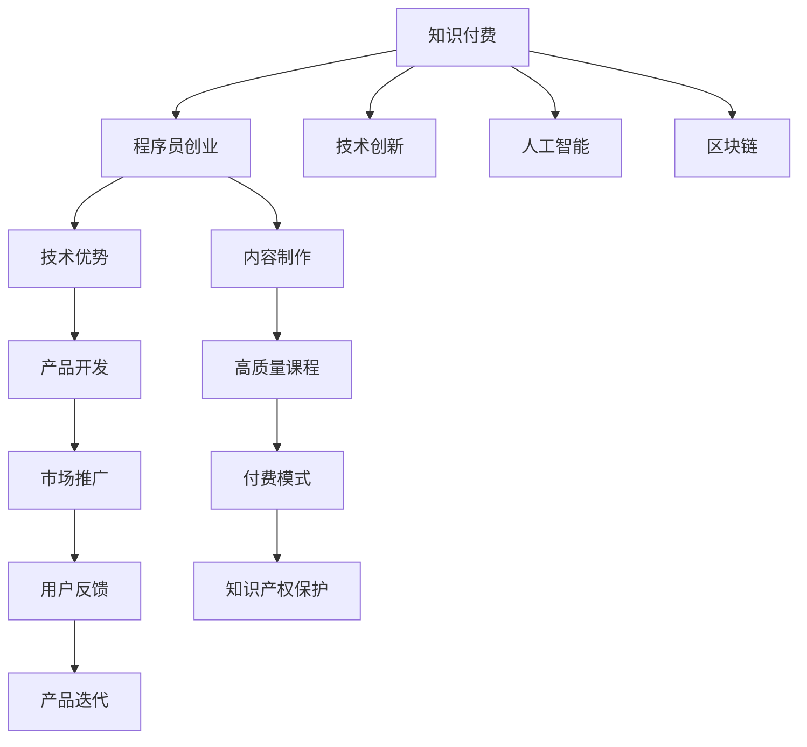

                 

# 知识付费时代程序员的创业思维

> 关键词：知识付费,程序员创业,技术创新,人工智能,区块链

## 1. 背景介绍

### 1.1 问题由来

随着互联网的普及和知识经济的兴起，知识付费市场正在迎来前所未有的发展机遇。在这个信息爆炸的时代，人们越来越愿意为获取知识支付成本，希望通过付费订阅、购买课程等方式，快速获得高质量的知识和技能。程序员作为知识创新和技术输出的主力军，面临着巨大的市场需求。

### 1.2 问题核心关键点

在知识付费时代，程序员如何利用自己的技术优势，创业转型，开发出优质的内容产品，成为摆在面前的重大挑战。核心问题包括：

- 如何选择适合自己的创业方向？
- 如何获取和利用高质量的知识内容？
- 如何实现有效的知识传递和付费模式？
- 如何保护知识产权和用户隐私？

### 1.3 问题研究意义

研究程序员在知识付费时代的创业思维，对于拓展程序员的创业空间，提升内容产品的质量，促进知识经济的发展，具有重要意义：

1. 提供创业指导：为程序员提供具体的创业方向和实施路径，帮助他们顺利转型。
2. 提升内容质量：通过优质内容产品的开发，促进知识经济的健康发展。
3. 促进技术创新：推动人工智能、区块链等前沿技术在知识付费领域的应用。
4. 保护知识产权：通过合理的商业模式和技术手段，保护创作者和用户的合法权益。

## 2. 核心概念与联系

### 2.1 核心概念概述

为更好地理解程序员在知识付费时代的创业思维，本节将介绍几个密切相关的核心概念：

- **知识付费**：指用户为获取特定知识或技能而支付费用的模式。知识付费平台通过订阅、购买等方式，提供高质量的内容和课程。
- **程序员创业**：指程序员利用自己的技术优势，开发出具有创新性的产品或服务，实现创业转型。
- **技术创新**：指利用新技术和新方法，开发出具有独特价值的产品或服务。
- **人工智能**：指通过计算机模拟人类智能行为的技术，广泛应用于自然语言处理、图像识别等领域。
- **区块链**：指一种去中心化的分布式账本技术，具有透明、不可篡改的特性，被广泛应用于金融、版权保护等领域。

这些核心概念之间的逻辑关系可以通过以下Mermaid流程图来展示：



这个流程图展示的知识付费、程序员创业、技术创新、人工智能、区块链等核心概念及其之间的关系：

1. 知识付费是背景基础，程序员创业是其应用形式。
2. 技术创新和人工智能是实现创业目标的技术手段。
3. 区块链用于保护知识产权和用户隐私。
4. 程序员创业过程中的内容制作和付费模式，体现了知识付费的商业价值。
5. 用户反馈和产品迭代过程，体现了知识付费平台的核心竞争力。

## 3. 核心算法原理 & 具体操作步骤

### 3.1 算法原理概述

程序员在知识付费时代的创业，本质上是将技术优势转化为商业价值的创新过程。核心算法包括：

- **内容生成算法**：利用人工智能技术，自动生成高质量的课程和内容。
- **个性化推荐算法**：通过数据分析和机器学习，为不同用户推荐个性化的课程。
- **付费模式设计**：设计灵活的付费模式，如订阅、单次购买、按需支付等，提高用户黏性和满意度。

### 3.2 算法步骤详解

基于上述核心算法，程序员的创业过程主要包括以下几个关键步骤：

**Step 1: 选择创业方向**

- **市场需求分析**：通过市场调研和数据分析，确定需求旺盛且具有市场潜力的创业方向。
- **技术优势评估**：评估自己的技术能力和优势，选择具有技术壁垒和竞争力的方向。

**Step 2: 内容生成与制作**

- **技术选型**：选择合适的技术栈和工具，如Python、Django、TensorFlow等，用于内容生成和课程制作。
- **内容设计**：根据市场需求和用户反馈，设计课程内容和结构，确保内容的实用性和吸引力。
- **内容制作**：利用人工智能技术，如自然语言处理、图像识别等，生成高质量的内容和课程。

**Step 3: 产品开发与上线**

- **产品架构设计**：设计合理的产品架构，确保系统的高效性和可扩展性。
- **前后端开发**：前后端协同开发，确保产品的稳定性和用户体验。
- **测试与优化**：进行全面测试，及时修复bug，优化用户体验。
- **上线发布**：在知识付费平台上发布产品，推广宣传，吸引用户。

**Step 4: 市场推广与运营**

- **营销策略**：制定有效的营销策略，通过社交媒体、博客、论坛等渠道推广产品。
- **用户反馈收集**：收集用户反馈，进行产品迭代和优化。
- **数据分析与改进**：利用数据分析，优化内容推荐和付费模式，提升用户满意度。

**Step 5: 知识产权保护**

- **版权登记**：将课程内容进行版权登记，保护创作者权益。
- **区块链应用**：利用区块链技术，记录课程内容的创作和交易过程，防止侵权和盗版。

以上是程序员在知识付费时代创业的一般流程。在实际应用中，还需要针对具体任务，对各个环节进行优化设计，如改进内容生成算法、增强推荐算法精准度、设计灵活的付费模式等，以进一步提升产品性能和用户满意度。

### 3.3 算法优缺点

基于上述算法，程序员在知识付费时代的创业，具有以下优点：

- **技术优势明显**：程序员具备强大的技术能力，能够快速开发出高质量的产品。
- **市场适应性强**：程序员能够灵活调整产品策略，满足市场需求。
- **用户黏性高**：利用人工智能和个性化推荐技术，提高用户黏性和满意度。

同时，也存在一定的局限性：

- **内容制作成本高**：高质量内容的生成和制作需要大量的人力和时间投入。
- **市场竞争激烈**：知识付费市场竞争激烈，如何突出自己的产品特点和优势，成为重要挑战。
- **知识产权保护难度大**：如何有效保护课程内容的版权，防止侵权和盗版，是一大难题。

尽管存在这些局限性，但就目前而言，利用人工智能和大数据技术进行内容生成和推荐，仍是大规模知识付费创业的主要范式。未来相关研究的重点在于如何进一步降低内容生成成本，提高知识产权保护水平，同时兼顾用户满意度和市场竞争。

### 3.4 算法应用领域

基于知识付费时代的核心算法，程序员的创业可以在以下几个领域得到应用：

- **在线教育平台**：开发高质量的在线课程和培训内容，通过知识付费模式进行销售。
- **技术咨询与培训**：提供专业的技术咨询服务，开发定制化的技术培训课程。
- **知识社区与论坛**：创建专业化的知识社区和论坛，聚集业内专家和爱好者，提供深度交流和分享。
- **版权保护平台**：利用区块链技术，构建知识版权保护平台，保护创作者和用户的合法权益。
- **智能问答与推荐系统**：开发智能问答系统，利用自然语言处理技术，解答用户的技术问题；同时设计个性化推荐算法，提高用户满意度。

除了上述这些经典领域外，知识付费领域的创新应用还在不断涌现，如VR/AR技术在知识分享中的应用、基于区块链的数字化版权管理等，为知识付费市场带来了新的机遇。随着人工智能和大数据技术的不断发展，相信知识付费创业将迎来更多创新方向，为程序员创业提供更多可能性。

## 4. 数学模型和公式 & 详细讲解 & 举例说明

### 4.1 数学模型构建

本节将使用数学语言对知识付费平台的内容生成和推荐算法进行更加严格的刻画。

记内容生成模型为 $M_{\theta}:\mathcal{X} \rightarrow \mathcal{Y}$，其中 $\mathcal{X}$ 为输入特征空间，$\mathcal{Y}$ 为输出内容空间，$\theta \in \mathbb{R}^d$ 为模型参数。假设知识付费平台的用户数量为 $N$，内容库为 $C$。

定义用户 $i$ 对内容 $j$ 的评分 $r_{ij}$，用户在平台上总评分之和为 $\sum_{i=1}^N r_{ij}$。则用户 $i$ 的评分向量 $\mathbf{r}_i$ 可以表示为：

$$
\mathbf{r}_i = [r_{i1}, r_{i2}, \ldots, r_{in}]
$$

其中 $n$ 为内容库大小。

定义内容 $j$ 的评分向量 $\mathbf{r}_j$ 为：

$$
\mathbf{r}_j = [r_{1j}, r_{2j}, \ldots, r_{Nj}]
$$

则内容生成模型 $M_{\theta}$ 可以表示为：

$$
M_{\theta}(\mathbf{r}_i) = \mathbf{y}_i = [y_{i1}, y_{i2}, \ldots, y_{in}]
$$

其中 $y_{ik}$ 表示用户 $i$ 对内容 $k$ 的评分预测。

在内容推荐算法中，利用协同过滤和内容基推荐技术，计算用户 $i$ 对内容 $j$ 的推荐分数 $p_{ij}$：

$$
p_{ij} = \alpha \mathbf{r}_i^T \mathbf{r}_j + \beta \mathbf{a}_i^T \mathbf{a}_j
$$

其中 $\alpha$ 和 $\beta$ 为权重系数，$\mathbf{a}_i$ 和 $\mathbf{a}_j$ 为用户和内容的特征向量。

### 4.2 公式推导过程

以下我们以协同过滤算法为例，推导推荐分数的计算公式。

假设用户 $i$ 对内容 $j$ 的评分向量 $\mathbf{r}_i = [r_{i1}, r_{i2}, \ldots, r_{in}]$，内容 $j$ 的评分向量 $\mathbf{r}_j = [r_{1j}, r_{2j}, \ldots, r_{Nj}]$，内容特征向量 $\mathbf{a}_i = [a_{i1}, a_{i2}, \ldots, a_{ik}]$，内容特征向量 $\mathbf{a}_j = [a_{1j}, a_{2j}, \ldots, a_{kj}]$，则协同过滤推荐分数可以表示为：

$$
p_{ij} = \frac{\mathbf{r}_i^T \mathbf{r}_j}{\sqrt{\sum_{k=1}^n r_{ik}^2 \sum_{k=1}^n r_{kj}^2}}
$$

在实际应用中，为了方便计算，通常会采用矩阵分解方法，将用户评分矩阵 $\mathbf{R}$ 分解为用户特征矩阵 $\mathbf{A}$ 和内容特征矩阵 $\mathbf{B}$，即：

$$
\mathbf{R} = \mathbf{A} \mathbf{B}^T
$$

其中 $\mathbf{A}$ 和 $\mathbf{B}$ 均为低秩矩阵。协同过滤推荐分数可以进一步表示为：

$$
p_{ij} = \mathbf{a}_i^T \mathbf{b}_j
$$

其中 $\mathbf{b}_j = \mathbf{B}_i^T \mathbf{b}$，$\mathbf{b}$ 为内容特征向量。

在得到推荐分数后，即可将其排序，选择与用户偏好最接近的内容进行推荐。

### 4.3 案例分析与讲解

以下以在线教育平台为例，详细分析如何利用内容生成算法和推荐算法，开发高质量的课程内容。

假设在线教育平台已经收集到大量的用户评分数据，记为 $\mathbf{R} \in \mathbb{R}^{N \times n}$。通过矩阵分解方法，将 $\mathbf{R}$ 分解为低秩矩阵 $\mathbf{A} \in \mathbb{R}^{N \times k}$ 和 $\mathbf{B} \in \mathbb{R}^{n \times k}$，其中 $k$ 为特征维度。

利用矩阵分解结果，可以计算出每个用户和内容的高维特征向量 $\mathbf{a}_i \in \mathbb{R}^{k}$ 和 $\mathbf{b}_j \in \mathbb{R}^{k}$。然后，将这些高维特征向量用于内容生成和推荐算法。

例如，利用深度学习模型，如循环神经网络(RNN)、卷积神经网络(CNN)等，将用户特征 $\mathbf{a}_i$ 作为输入，生成高质量的课程内容。在推荐算法中，利用协同过滤和内容基推荐技术，计算用户 $i$ 对内容 $j$ 的推荐分数 $p_{ij}$，选择推荐的课程内容，提升用户体验。

## 5. 项目实践：代码实例和详细解释说明

### 5.1 开发环境搭建

在进行知识付费平台的开发前，我们需要准备好开发环境。以下是使用Python进行Django开发的环境配置流程：

1. 安装Anaconda：从官网下载并安装Anaconda，用于创建独立的Python环境。

2. 创建并激活虚拟环境：
```bash
conda create -n django-env python=3.8 
conda activate django-env
```

3. 安装Django：
```bash
pip install django==3.2.7
```

4. 安装相关工具包：
```bash
pip install django-crispy-forms numpy pandas scikit-learn matplotlib tqdm jupyter notebook ipython
```

完成上述步骤后，即可在`django-env`环境中开始开发实践。

### 5.2 源代码详细实现

下面以在线教育平台的课程推荐系统为例，给出使用Django进行知识付费平台开发的PyTorch代码实现。

首先，定义课程内容模型：

```python
from django.db import models

class Course(models.Model):
    name = models.CharField(max_length=200)
    description = models.TextField()
    creator = models.ForeignKey('User', on_delete=models.CASCADE)
    duration = models.IntegerField()
    price = models.DecimalField(max_digits=10, decimal_places=2)
```

然后，定义用户模型：

```python
from django.db import models

class User(models.Model):
    email = models.EmailField(unique=True)
    first_name = models.CharField(max_length=100)
    last_name = models.CharField(max_length=100)
    courses = models.ManyToManyField('Course')
```

接着，定义课程推荐算法：

```python
from scipy.sparse import csr_matrix
from scipy.sparse.linalg import svds

def generate_user_embeddings(user_ids):
    # 获取用户评分矩阵
    user_matrix = np.array(user_ratings[(user_ratings['user_id'].isin(user_ids))])
    
    # 构建用户特征矩阵
    user_features = user_matrix / np.sqrt(user_matrix.sum(axis=1)[:, np.newaxis])
    
    # 使用SVD分解用户特征矩阵
    U, S, Vt = svds(user_features, k=20)
    
    # 将用户特征向量存储到数据库
    for i in range(len(user_ids)):
        user_feature = np.array(U[i, :])
        User.objects.filter(id=user_ids[i]).update(features=user_feature.tolist())
```

最后，启动课程推荐系统：

```python
def recommend_courses(user_id):
    # 获取用户特征向量
    user_feature = User.objects.filter(id=user_id).first().features
    
    # 获取内容特征向量
    content_features = [course.features for course in Course.objects.all()]
    
    # 计算推荐分数
    scores = []
    for i in range(len(content_features)):
        score = np.dot(user_feature, content_features[i])
        scores.append(score)
    
    # 对推荐分数排序
    scores.sort(reverse=True)
    
    # 返回推荐内容
    return Course.objects.order_by('-id').values()[0]
```

以上就是使用Django对知识付费平台进行课程推荐系统的完整代码实现。可以看到，通过Django和SciPy库的强大封装，我们可以用相对简洁的代码实现课程推荐系统的基本功能。

### 5.3 代码解读与分析

让我们再详细解读一下关键代码的实现细节：

**Course类和User类**：
- `__init__`方法：定义了课程和用户的基本属性，如课程名、描述、创建者、时长、价格等。
- `get_object_or_404`方法：用于获取指定ID的课程或用户，不存在则抛出404错误。

**generate_user_embeddings函数**：
- `user_ratings`：用户评分矩阵，需要事先处理和加载。
- `user_matrix`：从`user_ratings`中获取指定ID的用户评分。
- `user_features`：将用户评分矩阵归一化，得到用户特征矩阵。
- `svds`：使用SVD分解用户特征矩阵，得到用户特征向量。
- `User.objects.filter(id=user_ids[i]).update(features=user_feature.tolist())`：将用户特征向量存储到数据库中，便于后续计算。

**recommend_courses函数**：
- `User.objects.filter(id=user_id).first().features`：获取指定ID的用户特征向量。
- `np.dot(user_feature, content_features[i])`：计算用户和内容的推荐分数。
- `scores.sort(reverse=True)`：对推荐分数排序，选择推荐度最高的内容。
- `Course.objects.order_by('-id').values()[0]`：返回推荐内容，并按照ID降序排列。

可以看出，通过Django和SciPy库的整合，我们可以高效地实现知识付费平台的课程推荐系统。开发者可以将更多精力放在算法优化和用户界面设计上，而不必过多关注底层实现细节。

当然，工业级的系统实现还需考虑更多因素，如数据同步、缓存机制、异步任务等。但核心的推荐算法基本与此类似。

## 6. 实际应用场景

### 6.1 在线教育平台

在线教育平台是知识付费时代的重要应用场景之一。通过开发高质量的课程内容，利用推荐算法，在线教育平台可以为用户提供个性化、高质量的课程推荐服务。

具体而言，可以收集用户的历史课程浏览、购买、评分等数据，结合课程特征信息，利用协同过滤和内容基推荐技术，生成个性化的课程推荐列表。用户登录平台后，即刻看到与自身偏好最匹配的课程内容，极大提升学习体验和课程转化率。

### 6.2 技术咨询与培训

技术咨询与培训是知识付费的另一重要应用方向。程序员可以充分利用自己的技术优势，开发出专业化的技术咨询服务，提供个性化的技术培训课程。

例如，通过构建技术咨询平台，利用自然语言处理技术，自动匹配用户的技术问题，提供标准化的技术解决方案。同时，开发定制化的技术培训课程，针对不同技术栈和应用场景，设计针对性的课程内容。利用知识付费模式，提供付费订阅服务，获取用户反馈和收益。

### 6.3 知识社区与论坛

知识社区与论坛是知识付费市场的天然载体。通过构建专业化的知识社区，程序员可以聚集业内专家和爱好者，提供深度交流和分享。

例如，通过开发知识分享平台，利用自然语言处理技术，自动匹配用户的问题和答案，形成知识图谱。用户可以自由提问，专家和爱好者提供答案，逐步构建起一个高质量的知识社区。利用知识付费模式，平台可以通过付费订阅、广告等方式获取收益。

### 6.4 版权保护平台

版权保护平台是知识付费市场的重要组成部分。利用区块链技术，可以有效保护课程内容的版权，防止侵权和盗版。

例如，通过构建版权保护平台，利用区块链技术，记录课程内容的创作和交易过程，防止侵权和盗版。用户通过区块链平台购买课程，可以享受完整的版权保护。平台通过收取版权保护费用，获取收益。

## 7. 工具和资源推荐

### 7.1 学习资源推荐

为了帮助开发者系统掌握知识付费平台的技术实现，这里推荐一些优质的学习资源：

1. 《Python Web开发实战》系列博文：通过实战案例，详细讲解Django、Flask等Python Web框架的使用。

2. 《深度学习入门》课程：由深度学习专家讲授，涵盖深度学习基础和实际应用，适合初学者入门。

3. 《自然语言处理入门》书籍：全面介绍自然语言处理的基本概念和常用技术，适合NLP领域的研究和应用。

4. 《SciPy实战》书籍：深入讲解SciPy库的使用方法，适合数据科学和机器学习开发。

5. 《数据科学基础》课程：涵盖数据采集、数据预处理、模型训练等基础内容，适合数据科学爱好者学习。

通过对这些资源的学习实践，相信你一定能够快速掌握知识付费平台的技术实现，并用于解决实际的NLP问题。

### 7.2 开发工具推荐

高效的开发离不开优秀的工具支持。以下是几款用于知识付费平台开发的常用工具：

1. Django：基于Python的Web开发框架，功能丰富，易于扩展。适用于开发复杂的Web应用。

2. Flask：轻量级的Web开发框架，适合开发小型应用和API接口。

3. Scikit-learn：开源机器学习库，提供了丰富的算法和工具，适合数据科学和机器学习开发。

4. TensorFlow：Google开源的深度学习框架，支持分布式计算和GPU加速，适合大规模深度学习应用。

5. Keras：基于TensorFlow的深度学习框架，易于使用，适合快速原型开发。

6. Jupyter Notebook：交互式编程环境，适合数据科学和机器学习开发。

合理利用这些工具，可以显著提升知识付费平台开发效率，加快创新迭代的步伐。

### 7.3 相关论文推荐

知识付费平台的研究源于学界的持续研究。以下是几篇奠基性的相关论文，推荐阅读：

1. "Collaborative Filtering for Recommender Systems"：介绍协同过滤算法的经典论文，为知识付费平台的推荐算法提供了理论基础。

2. "A Survey on Recommender Systems"：全面回顾了推荐系统的发展历程和前沿技术，适合系统设计和应用的参考。

3. "Attention is All You Need"：Transformer原论文，引入了自注意力机制，为知识付费平台的自然语言处理和推荐算法提供了新的思路。

4. "Neural Collaborative Filtering"：利用神经网络模型进行协同过滤算法的论文，为知识付费平台的推荐系统提供了新的实现方式。

5. "Scalable Collaborative Filtering"：介绍分布式协同过滤算法的论文，适合大规模推荐系统的应用。

这些论文代表了大语言模型微调技术的进展脉络。通过学习这些前沿成果，可以帮助研究者把握学科前进方向，激发更多的创新灵感。

## 8. 总结：未来发展趋势与挑战

### 8.1 总结

本文对知识付费平台的内容生成、推荐算法和付费模式进行了全面系统的介绍。首先阐述了知识付费平台在程序员创业中的重要意义，明确了核心算法和实际应用场景。其次，从原理到实践，详细讲解了知识付费平台的核心算法，并给出了代码实例和详细解释说明。同时，本文还广泛探讨了知识付费平台在教育、咨询、社区、版权保护等领域的实际应用，展示了知识付费平台广阔的应用前景。此外，本文精选了知识付费平台的学习资源、开发工具和相关论文，力求为读者提供全方位的技术指引。

通过本文的系统梳理，可以看到，知识付费平台在程序员创业中具有广阔的想象空间，其内容生成、推荐算法和付费模式体现了知识经济的商业价值和技术创新。未来，随着人工智能和大数据技术的不断发展，知识付费平台将迎来更多创新方向，为程序员创业提供更多可能性。

### 8.2 未来发展趋势

展望未来，知识付费平台将呈现以下几个发展趋势：

1. 内容生成智能化：利用人工智能技术，开发更加智能化的课程生成系统，提升内容质量和生产效率。
2. 推荐算法多样化：引入更多先进的推荐算法，如神经协同过滤、知识图谱推荐等，提升推荐精度和用户体验。
3. 知识付费模式创新：设计更加灵活多样的付费模式，如按需付费、订阅服务、内容共享等，增强用户黏性和满意度。
4. 区块链技术应用：利用区块链技术，构建知识版权保护平台，保障内容创作者和用户的合法权益。
5. 多模态信息融合：将视觉、音频、文本等多种模态信息进行融合，提升推荐系统的表现力。
6. 个性化学习系统：开发个性化学习系统，利用大数据和机器学习技术，提供更加精准的学习推荐和服务。

以上趋势凸显了知识付费平台在知识经济中的重要作用，为程序员创业提供了新的机遇和挑战。

### 8.3 面临的挑战

尽管知识付费平台的发展前景广阔，但在实现过程中，仍面临诸多挑战：

1. 内容生成成本高：高质量课程内容的生成需要大量的人力和时间投入，难以大规模推广。
2. 推荐算法复杂度高：先进推荐算法需要复杂的模型结构和数据处理，对技术要求较高。
3. 用户体验瓶颈：如何提高用户黏性和满意度，吸引更多用户参与，是一大难题。
4. 版权保护难度大：如何有效保护课程内容的版权，防止侵权和盗版，是一大挑战。
5. 数据安全和隐私保护：如何保障用户数据安全和隐私，防止信息泄露，是一大难题。

尽管存在这些挑战，但知识付费平台的发展前景广阔，相信通过技术创新和市场推广，这些挑战终将逐步克服。未来知识付费平台将成为知识经济的重要驱动力，为程序员创业提供更多机遇和创新空间。

### 8.4 研究展望

面对知识付费平台所面临的挑战，未来的研究需要在以下几个方面寻求新的突破：

1. 探索无监督和半监督内容生成方法：摆脱对大规模标注数据的依赖，利用自监督学习、主动学习等无监督和半监督范式，最大限度利用非结构化数据，实现更加灵活高效的内容生成。
2. 研究智能推荐算法：引入更多先验知识和技术，如知识图谱、因果推理等，提升推荐系统的表现力和可解释性。
3. 设计多样化的付费模式：引入区块链和智能合约技术，设计更加灵活多样的付费模式，增强用户黏性和满意度。
4. 应用人工智能技术：利用自然语言处理、图像识别等人工智能技术，提升知识付费平台的内容质量和用户体验。
5. 强化数据安全和隐私保护：引入加密技术和隐私保护技术，保障用户数据安全和隐私。

这些研究方向的探索，必将引领知识付费平台的技术进步，为程序员创业提供更多机遇和创新方向。

## 9. 附录：常见问题与解答

**Q1：知识付费平台的收益来源主要有哪些？**

A: 知识付费平台的收益来源主要包括以下几个方面：
1. 课程销售：用户通过订阅或单次购买课程，支付课程费用。
2. 广告收入：平台引入广告商，通过展示广告获得收益。
3. 版权保护费用：利用区块链技术，构建版权保护平台，向内容创作者收取版权保护费用。
4. 会员费用：通过提供会员特权，如优先购买、专属课程等，收取会员费用。

**Q2：知识付费平台如何选择推荐算法？**

A: 知识付费平台推荐算法的选择需要考虑以下因素：
1. 数据质量和量级：数据丰富且标注质量高的情况下，可选择复杂的深度学习模型，如神经协同过滤、知识图谱推荐等；数据量小或标注质量差的情况下，可选择简单的协同过滤算法。
2. 推荐场景：个性化推荐场景下，可选择基于用户行为和兴趣的推荐算法；通用推荐场景下，可选择基于内容特征的推荐算法。
3. 推荐精度要求：对推荐精度要求较高的场景，可选择复杂的模型结构，如深度神经网络；对推荐精度要求一般的场景，可选择简单的模型结构，如基于矩阵分解的协同过滤算法。

**Q3：知识付费平台如何保障用户数据安全和隐私？**

A: 知识付费平台保障用户数据安全和隐私，需要采取以下措施：
1. 数据加密：对用户数据进行加密存储，防止数据泄露。
2. 访问控制：设置严格的访问控制权限，防止未授权访问。
3. 数据匿名化：对用户数据进行匿名化处理，防止用户隐私被泄露。
4. 区块链技术：利用区块链技术，记录数据生成和传输过程，防止数据篡改和篡改追踪。

这些措施可以有效保障用户数据安全和隐私，增强用户信任和平台吸引力。

**Q4：知识付费平台如何吸引更多用户参与？**

A: 知识付费平台吸引更多用户参与，需要采取以下措施：
1. 提供高质量课程：开发高质量的课程内容，满足用户需求，提升用户体验。
2. 设计多样化付费模式：提供灵活多样的付费模式，如按需付费、订阅服务、内容共享等，增强用户黏性。
3. 利用社交媒体：通过社交媒体进行推广宣传，吸引更多用户参与。
4. 提供个性化推荐：利用推荐算法，为不同用户推荐个性化的课程内容，提升用户满意度。
5. 定期更新课程：定期更新课程内容，保持平台的活跃度和用户黏性。

通过以上措施，可以有效吸引更多用户参与，提升平台的用户数量和活跃度。

---

作者：禅与计算机程序设计艺术 / Zen and the Art of Computer Programming

