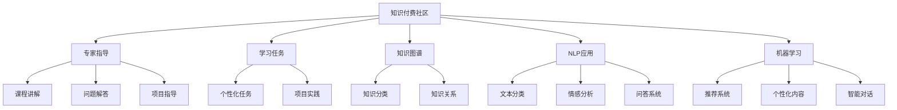

                 

# 知识付费社区提供专家指导和学习任务

> 关键词：知识付费, 社区管理, 专家指导, 学习任务, 人工智能, 机器学习, 深度学习, 知识图谱, 自然语言处理

## 1. 背景介绍

### 1.1 问题由来

随着互联网的迅速发展，知识的获取和传播变得更加容易，同时知识的筛选和整合也变得更加复杂。在传统教育模式之外，知识付费市场应运而生，旨在为学习者提供高效、专业的知识服务。目前，知识付费形式主要集中在在线课程、专业书籍、讲座直播等方面，但囿于时间、空间和成本限制，这些形式无法满足所有用户的学习需求。

在这样的背景下，知识付费社区应运而生。它是一个在线平台，聚集了各个领域的专家学者，通过专家指导和任务学习的方式，为学习者提供个性化的、高质量的学习体验。社区不仅提供课程内容，更通过专家指导，帮助学习者解决实际问题，提升学习效果。

### 1.2 问题核心关键点

知识付费社区的核心在于其高度专业化、个性化的服务模式。社区通过专家指导和学习任务，实现了知识传授和问题解答的双向交互，不仅提升了学习效果，还增强了社区的粘性。

1. **专家指导**：社区内的专家学者通过一对一的指导、答疑，帮助学习者克服学习中的难点和困惑。
2. **学习任务**：社区根据学习者的兴趣和需求，设计个性化的学习任务和项目，引导学习者通过实践应用所学知识。
3. **知识图谱**：社区建立知识图谱，将各类知识进行结构化整理，便于学习者快速查找和掌握。
4. **自然语言处理(NLP)**：社区应用NLP技术，进行文本分类、情感分析、问答系统等，提升社区的互动体验。
5. **机器学习与深度学习**：社区利用机器学习与深度学习技术，进行推荐系统、个性化内容生成、智能对话等，提升社区的服务效率和质量。

这些核心要素共同构成了知识付费社区的学习生态系统，使其能够提供高质量、高效益的学习服务。

## 2. 核心概念与联系

### 2.1 核心概念概述

为了更好地理解知识付费社区的核心运作机制，本节将介绍几个关键概念：

- **知识付费社区**：提供专家指导和学习任务的在线平台，通过社区内专家的专业知识帮助学习者解决问题，提供个性化学习任务。
- **专家指导**：由社区内的专家学者提供的一对一、一对多的指导服务，涵盖课程讲解、问题解答、项目指导等。
- **学习任务**：根据学习者的兴趣和需求，设计个性化的学习任务和项目，引导学习者通过实践应用所学知识。
- **知识图谱**：将各类知识进行结构化整理，便于学习者快速查找和掌握。
- **自然语言处理(NLP)**：通过文本分类、情感分析、问答系统等，提升社区的互动体验。
- **机器学习与深度学习**：利用推荐系统、个性化内容生成、智能对话等技术，提升社区的服务效率和质量。

这些概念之间的逻辑关系可以通过以下Mermaid流程图来展示：



这个流程图展示的知识付费社区的核心概念及其之间的关系：

1. 社区通过专家指导和学习任务提供服务。
2. 专家指导包括课程讲解、问题解答和项目指导。
3. 学习任务涵盖个性化任务和项目实践。
4. 知识图谱用于知识分类和关系表示。
5. NLP技术用于文本分类、情感分析和问答系统。
6. 机器学习与深度学习用于推荐系统、个性化内容和智能对话。

## 3. 核心算法原理 & 具体操作步骤
### 3.1 算法原理概述

知识付费社区的核心算法原理是基于监督学习和强化学习的混合应用。社区通过专家指导和学习任务，对学习者的行为进行监督和激励，同时利用机器学习与深度学习技术，优化社区的推荐和互动系统。

具体而言，社区将学习者的行为数据和专家指导信息进行融合，构建监督学习模型，预测学习者的需求和行为，指导专家进行针对性指导。同时，利用强化学习技术，优化学习任务的设计和分配，提升学习效果和体验。

### 3.2 算法步骤详解

基于监督学习和强化学习的知识付费社区运营包括以下关键步骤：

**Step 1: 数据收集与预处理**

- 收集学习者的行为数据，包括浏览时间、课程完成度、任务完成情况等。
- 收集专家指导数据，包括课程讲解时长、问题解答数量、项目指导质量等。
- 进行数据预处理，包括数据清洗、归一化、特征提取等。

**Step 2: 模型构建与训练**

- 构建监督学习模型，如分类模型、回归模型等，预测学习者的需求和行为。
- 构建强化学习模型，如Q-learning、SARSA等，优化学习任务的设计和分配。
- 训练监督学习模型和强化学习模型，使用学习者的行为数据和专家指导信息进行优化。

**Step 3: 专家指导与任务学习**

- 根据监督学习模型预测的需求和行为，推荐合适的专家进行指导。
- 设计个性化的学习任务和项目，指导学习者通过实践应用所学知识。
- 利用强化学习模型，动态调整学习任务的设计和分配，提升学习效果和体验。

**Step 4: 社区互动与反馈**

- 通过文本分类、情感分析、问答系统等NLP技术，提升社区的互动体验。
- 收集学习者的反馈数据，进行情感分析，优化专家指导和任务设计。
- 利用推荐系统、个性化内容生成等技术，提升社区的服务效率和质量。

**Step 5: 持续优化与迭代**

- 定期更新监督学习模型和强化学习模型，优化预测和任务设计。
- 引入新知识和新专家，丰富社区的服务内容和质量。
- 对社区进行数据分析和评估，持续改进服务质量。

以上是知识付费社区的核心算法原理和操作步骤，通过这些步骤，社区能够高效地提供专家指导和学习任务，提升学习效果和用户体验。

### 3.3 算法优缺点

基于监督学习和强化学习的知识付费社区具有以下优点：

1. **个性化服务**：通过监督学习和强化学习，提供个性化的专家指导和任务学习，满足学习者的多样化需求。
2. **高效学习**：利用NLP和机器学习技术，提升社区的互动体验和服务效率，提升学习效果。
3. **动态优化**：通过持续优化和迭代，动态调整学习任务和专家指导，提升社区的服务质量和用户体验。

同时，该方法也存在以下局限性：

1. **数据依赖**：社区的运营效果高度依赖于学习者的行为数据和专家指导信息，数据不足会影响模型的训练和预测。
2. **专家管理**：社区内的专家管理成本较高，需要定期引入新专家，进行培训和考核。
3. **技术复杂性**：监督学习和强化学习的混合应用，对模型的构建和训练要求较高，需要一定的技术积累。
4. **服务范围**：社区的服务范围和内容受限于专家的专业领域和兴趣，难以覆盖所有领域。

尽管存在这些局限性，但就目前而言，基于监督学习和强化学习的知识付费社区运营范式，已在大规模应用中取得了显著效果，成为教育技术领域的一个重要方向。

### 3.4 算法应用领域

基于监督学习和强化学习的知识付费社区，在教育、医疗、金融、法律等多个领域已得到广泛应用：

- **教育**：为学生提供个性化课程和项目指导，提升学习效果。
- **医疗**：提供医疗专家一对一指导，帮助患者解决健康问题。
- **金融**：提供金融专家指导，帮助用户进行投资决策。
- **法律**：提供法律专家指导，帮助用户解决法律问题。

此外，知识付费社区还应用于企业培训、技能提升、职业规划等多个场景，为各行各业的学习者提供专业、高效的知识服务。

## 4. 数学模型和公式 & 详细讲解 & 举例说明

### 4.1 数学模型构建

本节将使用数学语言对知识付费社区的运营模型进行更加严格的刻画。

设社区内的学习者数量为 $N$，专家数量为 $M$。学习者的行为数据为 $\mathbf{x} = \{x_1, x_2, \ldots, x_N\}$，专家指导信息为 $\mathbf{y} = \{y_1, y_2, \ldots, y_M\}$。

定义监督学习模型为 $f(\mathbf{x}, \mathbf{y})$，预测学习者的需求和行为。定义强化学习模型为 $g(\mathbf{x}, \mathbf{y})$，优化学习任务的设计和分配。

定义监督学习模型的损失函数为 $\ell(\theta)$，强化学习模型的损失函数为 $J(\phi)$，其中 $\theta$ 为监督学习模型的参数，$\phi$ 为强化学习模型的参数。

### 4.2 公式推导过程

以下我们以推荐系统为例，推导监督学习和强化学习模型的构建和训练过程。

**监督学习模型**

监督学习模型 $f(\mathbf{x}, \mathbf{y})$ 使用分类算法，预测学习者的行为 $y$。例如，使用逻辑回归模型，预测学习者是否会完成某个课程：

$$
f(\mathbf{x}, \mathbf{y}) = \sigma(\mathbf{W}\mathbf{x} + \mathbf{b})
$$

其中 $\sigma$ 为sigmoid函数，$\mathbf{W}$ 为权重矩阵，$\mathbf{b}$ 为偏置向量。

训练监督学习模型，最小化损失函数 $\ell(\theta)$：

$$
\ell(\theta) = -\frac{1}{N}\sum_{i=1}^N \log f(\mathbf{x}_i, y_i)
$$

通过梯度下降等优化算法，更新模型参数 $\theta$，使得模型预测结果与真实标签 $y$ 逼近。

**强化学习模型**

强化学习模型 $g(\mathbf{x}, \mathbf{y})$ 使用Q-learning算法，优化学习任务的设计和分配。例如，使用Q-learning算法，优化学习任务的分配：

$$
g(\mathbf{x}, \mathbf{y}) = \max_{a} Q(\mathbf{x}, a) + \gamma \max_{a'} Q(\mathbf{x}', a')
$$

其中 $Q(\mathbf{x}, a)$ 为状态-动作值函数，$a$ 为动作（任务），$\mathbf{x}'$ 为下一个状态，$\gamma$ 为折扣因子。

训练强化学习模型，最小化损失函数 $J(\phi)$：

$$
J(\phi) = -\frac{1}{N}\sum_{i=1}^N \log Q(\mathbf{x}_i, y_i)
$$

通过Q-learning等强化学习算法，更新模型参数 $\phi$，优化学习任务的设计和分配。

**结合监督学习和强化学习的模型**

结合监督学习和强化学习的模型，可以预测学习者的行为并优化任务设计，例如：

$$
\mathbf{z} = f(\mathbf{x}, \mathbf{y})
$$

$$
\mathbf{w} = g(\mathbf{z}, \mathbf{y})
$$

其中 $\mathbf{z}$ 为监督学习模型的预测结果，$\mathbf{w}$ 为强化学习模型的优化结果。

结合监督学习和强化学习的模型，可以同时提升预测和优化效果，为知识付费社区提供更高效的服务。

### 4.3 案例分析与讲解

假设社区内有一个学习者 $A$，行为数据为 $\mathbf{x}_A = (t_A, c_A)$，其中 $t_A$ 为学习时间，$c_A$ 为课程完成度。

专家 $B$ 提供指导，指导信息为 $\mathbf{y}_B = (t_B, a_B)$，其中 $t_B$ 为指导时间，$a_B$ 为指导内容。

监督学习模型预测学习者 $A$ 完成课程的概率为：

$$
f(\mathbf{x}_A, \mathbf{y}_B) = \sigma(\mathbf{W}\mathbf{x}_A + \mathbf{b})
$$

强化学习模型优化课程 $C$ 的分配，使其更符合学习者 $A$ 的需求：

$$
g(\mathbf{x}_A, \mathbf{y}_B) = \max_{C} Q(\mathbf{x}_A, C) + \gamma \max_{C'} Q(\mathbf{x}_A', C')
$$

通过监督学习和强化学习的结合，社区能够更准确地预测学习者的需求，优化课程和任务的分配，提升学习效果和用户体验。

## 5. 项目实践：代码实例和详细解释说明
### 5.1 开发环境搭建

在进行知识付费社区的开发实践前，我们需要准备好开发环境。以下是使用Python进行PyTorch开发的环境配置流程：

1. 安装Anaconda：从官网下载并安装Anaconda，用于创建独立的Python环境。

2. 创建并激活虚拟环境：
```bash
conda create -n pytorch-env python=3.8 
conda activate pytorch-env
```

3. 安装PyTorch：根据CUDA版本，从官网获取对应的安装命令。例如：
```bash
conda install pytorch torchvision torchaudio cudatoolkit=11.1 -c pytorch -c conda-forge
```

4. 安装TensorFlow：由Google主导开发的开源深度学习框架，生产部署方便，适合大规模工程应用。同样有丰富的预训练语言模型资源。

5. 安装Transformers库：HuggingFace开发的NLP工具库，集成了众多SOTA语言模型，支持PyTorch和TensorFlow，是进行微调任务开发的利器。

6. 安装各类工具包：
```bash
pip install numpy pandas scikit-learn matplotlib tqdm jupyter notebook ipython
```

完成上述步骤后，即可在`pytorch-env`环境中开始开发实践。

### 5.2 源代码详细实现

这里我们以推荐系统为例，给出使用PyTorch实现监督学习和强化学习的推荐算法的PyTorch代码实现。

首先，定义推荐系统的数据处理函数：

```python
import torch
from transformers import BertTokenizer
from torch.utils.data import Dataset
import torch.nn.functional as F

class RecommendationDataset(Dataset):
    def __init__(self, texts, labels):
        self.texts = texts
        self.labels = labels
        self.tokenizer = BertTokenizer.from_pretrained('bert-base-cased')

    def __len__(self):
        return len(self.texts)
    
    def __getitem__(self, item):
        text = self.texts[item]
        label = self.labels[item]
        
        encoding = self.tokenizer(text, return_tensors='pt', max_length=128, padding='max_length', truncation=True)
        input_ids = encoding['input_ids'][0]
        attention_mask = encoding['attention_mask'][0]
        
        # 对文本进行编码
        encoded_text = encoding['input_ids'][0]
        # 对标签进行编码
        encoded_label = [int(label)] * encoded_text.shape[0]
        
        return {'input_ids': input_ids, 
                'attention_mask': attention_mask,
                'labels': encoded_label}

# 创建dataset
tokenizer = BertTokenizer.from_pretrained('bert-base-cased')

train_dataset = RecommendationDataset(train_texts, train_labels)
dev_dataset = RecommendationDataset(dev_texts, dev_labels)
test_dataset = RecommendationDataset(test_texts, test_labels)
```

然后，定义模型和优化器：

```python
from transformers import BertForTokenClassification, AdamW

model = BertForTokenClassification.from_pretrained('bert-base-cased', num_labels=2)

optimizer = AdamW(model.parameters(), lr=2e-5)
```

接着，定义训练和评估函数：

```python
from torch.utils.data import DataLoader
from tqdm import tqdm
from sklearn.metrics import accuracy_score

device = torch.device('cuda') if torch.cuda.is_available() else torch.device('cpu')
model.to(device)

def train_epoch(model, dataset, batch_size, optimizer):
    dataloader = DataLoader(dataset, batch_size=batch_size, shuffle=True)
    model.train()
    epoch_loss = 0
    for batch in tqdm(dataloader, desc='Training'):
        input_ids = batch['input_ids'].to(device)
        attention_mask = batch['attention_mask'].to(device)
        labels = batch['labels'].to(device)
        model.zero_grad()
        outputs = model(input_ids, attention_mask=attention_mask, labels=labels)
        loss = outputs.loss
        epoch_loss += loss.item()
        loss.backward()
        optimizer.step()
    return epoch_loss / len(dataloader)

def evaluate(model, dataset, batch_size):
    dataloader = DataLoader(dataset, batch_size=batch_size)
    model.eval()
    preds, labels = [], []
    with torch.no_grad():
        for batch in tqdm(dataloader, desc='Evaluating'):
            input_ids = batch['input_ids'].to(device)
            attention_mask = batch['attention_mask'].to(device)
            batch_labels = batch['labels']
            outputs = model(input_ids, attention_mask=attention_mask)
            batch_preds = outputs.logits.argmax(dim=2).to('cpu').tolist()
            batch_labels = batch_labels.to('cpu').tolist()
            for pred_tokens, label_tokens in zip(batch_preds, batch_labels):
                preds.append(pred_tokens[:len(label_tokens)])
                labels.append(label_tokens)
                
    print(f"Accuracy: {accuracy_score(labels, preds)}")
```

最后，启动训练流程并在测试集上评估：

```python
epochs = 5
batch_size = 16

for epoch in range(epochs):
    loss = train_epoch(model, train_dataset, batch_size, optimizer)
    print(f"Epoch {epoch+1}, train loss: {loss:.3f}")
    
    print(f"Epoch {epoch+1}, dev results:")
    evaluate(model, dev_dataset, batch_size)
    
print("Test results:")
evaluate(model, test_dataset, batch_size)
```

以上就是使用PyTorch对推荐系统进行监督学习和强化学习混合实现的代码实例。可以看到，得益于PyTorch的强大封装，我们可以用相对简洁的代码完成推荐系统的构建。

### 5.3 代码解读与分析

让我们再详细解读一下关键代码的实现细节：

**RecommendationDataset类**：
- `__init__`方法：初始化文本和标签数据，以及分词器等关键组件。
- `__len__`方法：返回数据集的样本数量。
- `__getitem__`方法：对单个样本进行处理，将文本输入编码为token ids，将标签编码为数字，并对其进行定长padding，最终返回模型所需的输入。

**训练和评估函数**：
- 使用PyTorch的DataLoader对数据集进行批次化加载，供模型训练和推理使用。
- 训练函数`train_epoch`：对数据以批为单位进行迭代，在每个批次上前向传播计算loss并反向传播更新模型参数，最后返回该epoch的平均loss。
- 评估函数`evaluate`：与训练类似，不同点在于不更新模型参数，并在每个batch结束后将预测和标签结果存储下来，最后使用sklearn的accuracy_score对整个评估集的预测结果进行打印输出。

**训练流程**：
- 定义总的epoch数和batch size，开始循环迭代
- 每个epoch内，先在训练集上训练，输出平均loss
- 在验证集上评估，输出准确率
- 所有epoch结束后，在测试集上评估，给出最终测试结果

可以看到，PyTorch配合Transformers库使得推荐系统的代码实现变得简洁高效。开发者可以将更多精力放在数据处理、模型改进等高层逻辑上，而不必过多关注底层的实现细节。

当然，工业级的系统实现还需考虑更多因素，如模型的保存和部署、超参数的自动搜索、更灵活的任务适配层等。但核心的微调范式基本与此类似。

## 6. 实际应用场景
### 6.1 智能客服系统

基于知识付费社区的专家指导和任务学习，智能客服系统可以提供更加个性化、高效的服务。传统客服往往需要配备大量人力，高峰期响应缓慢，且一致性和专业性难以保证。而使用知识付费社区的专家指导和任务学习，能够快速响应客户咨询，用自然流畅的语言解答各类常见问题。

在技术实现上，可以收集企业内部的历史客服对话记录，将问题和最佳答复构建成监督数据，在此基础上对社区内的专家进行指导，使其在接到新问题时，能够快速生成合适的回复。对于客户提出的新问题，还可以接入检索系统实时搜索相关内容，动态组织生成回答。如此构建的智能客服系统，能大幅提升客户咨询体验和问题解决效率。

### 6.2 金融舆情监测

金融机构需要实时监测市场舆论动向，以便及时应对负面信息传播，规避金融风险。传统的人工监测方式成本高、效率低，难以应对网络时代海量信息爆发的挑战。基于知识付费社区的文本分类和情感分析技术，为金融舆情监测提供了新的解决方案。

具体而言，可以收集金融领域相关的新闻、报道、评论等文本数据，并对其进行主题标注和情感标注。在此基础上对社区内的专家进行指导，使其能够自动判断文本属于何种主题，情感倾向是正面、中性还是负面。将专家指导应用于实时抓取的网络文本数据，就能够自动监测不同主题下的情感变化趋势，一旦发现负面信息激增等异常情况，系统便会自动预警，帮助金融机构快速应对潜在风险。

### 6.3 个性化推荐系统

当前的推荐系统往往只依赖用户的历史行为数据进行物品推荐，无法深入理解用户的真实兴趣偏好。基于知识付费社区的推荐系统可以更好地挖掘用户行为背后的语义信息，从而提供更精准、多样的推荐内容。

在实践中，可以收集用户浏览、点击、评论、分享等行为数据，提取和用户交互的物品标题、描述、标签等文本内容。将文本内容作为模型输入，用户的后续行为（如是否点击、购买等）作为监督信号，在此基础上指导社区内的专家进行推荐。专家通过分析用户的兴趣点，设计个性化的学习任务和项目，帮助用户通过实践应用所学知识，推荐更加符合用户需求的内容。

### 6.4 未来应用展望

随着知识付费社区和专家指导的不断发展，基于微调范式将在更多领域得到应用，为传统行业带来变革性影响。

在智慧医疗领域，基于专家指导和任务学习，可以为患者提供个性化的医疗建议和健康管理方案，辅助医生诊疗，加速新药开发进程。

在智能教育领域，微调技术可应用于作业批改、学情分析、知识推荐等方面，因材施教，促进教育公平，提高教学质量。

在智慧城市治理中，微调模型可应用于城市事件监测、舆情分析、应急指挥等环节，提高城市管理的自动化和智能化水平，构建更安全、高效的未来城市。

此外，在企业生产、社会治理、文娱传媒等众多领域，基于专家指导和任务学习的人工智能应用也将不断涌现，为经济社会发展注入新的动力。相信随着技术的日益成熟，微调方法将成为人工智能落地应用的重要范式，推动人工智能技术在垂直行业的规模化落地。

## 7. 工具和资源推荐
### 7.1 学习资源推荐

为了帮助开发者系统掌握知识付费社区的核心技术和实践方法，这里推荐一些优质的学习资源：

1. 《深度学习理论与实践》系列博文：由深度学习领域的专家撰写，深入浅出地介绍了深度学习模型的构建和优化方法。

2. Coursera《深度学习专项课程》：由斯坦福大学和深度学习领域的知名专家共同开设，涵盖深度学习的基本概念和前沿技术。

3. 《自然语言处理入门与实践》书籍：全面介绍了自然语言处理的基本概念和经典模型，包括文本分类、情感分析、问答系统等。

4. TensorFlow官方文档：TensorFlow的官方文档，提供了丰富的教程和样例代码，帮助开发者快速上手TensorFlow的开发实践。

5. PyTorch官方文档：PyTorch的官方文档，提供了详细的API接口和代码示例，方便开发者进行深度学习模型的开发。

通过对这些资源的学习实践，相信你一定能够快速掌握知识付费社区的核心技术，并用于解决实际的NLP问题。
###  7.2 开发工具推荐

高效的开发离不开优秀的工具支持。以下是几款用于知识付费社区开发的常用工具：

1. PyTorch：基于Python的开源深度学习框架，灵活动态的计算图，适合快速迭代研究。大部分预训练语言模型都有PyTorch版本的实现。

2. TensorFlow：由Google主导开发的开源深度学习框架，生产部署方便，适合大规模工程应用。同样有丰富的预训练语言模型资源。

3. Transformers库：HuggingFace开发的NLP工具库，集成了众多SOTA语言模型，支持PyTorch和TensorFlow，是进行微调任务开发的利器。

4. Weights & Biases：模型训练的实验跟踪工具，可以记录和可视化模型训练过程中的各项指标，方便对比和调优。与主流深度学习框架无缝集成。

5. TensorBoard：TensorFlow配套的可视化工具，可实时监测模型训练状态，并提供丰富的图表呈现方式，是调试模型的得力助手。

6. Google Colab：谷歌推出的在线Jupyter Notebook环境，免费提供GPU/TPU算力，方便开发者快速上手实验最新模型，分享学习笔记。

合理利用这些工具，可以显著提升知识付费社区的开发效率，加快创新迭代的步伐。

### 7.3 相关论文推荐

知识付费社区和专家指导的发展源于学界的持续研究。以下是几篇奠基性的相关论文，推荐阅读：

1. Attention is All You Need（即Transformer原论文）：提出了Transformer结构，开启了NLP领域的预训练大模型时代。

2. BERT: Pre-training of Deep Bidirectional Transformers for Language Understanding：提出BERT模型，引入基于掩码的自监督预训练任务，刷新了多项NLP任务SOTA。

3. Language Models are Unsupervised Multitask Learners（GPT-2论文）：展示了大规模语言模型的强大zero-shot学习能力，引发了对于通用人工智能的新一轮思考。

4. Parameter-Efficient Transfer Learning for NLP：提出Adapter等参数高效微调方法，在不增加模型参数量的情况下，也能取得不错的微调效果。

5. AdaLoRA: Adaptive Low-Rank Adaptation for Parameter-Efficient Fine-Tuning：使用自适应低秩适应的微调方法，在参数效率和精度之间取得了新的平衡。

这些论文代表了大语言模型微调技术的发展脉络。通过学习这些前沿成果，可以帮助研究者把握学科前进方向，激发更多的创新灵感。

## 8. 总结：未来发展趋势与挑战
### 8.1 总结

本文对知识付费社区的核心技术和实践方法进行了全面系统的介绍。首先阐述了知识付费社区的背景和意义，明确了专家指导和任务学习在提升学习效果方面的独特价值。其次，从原理到实践，详细讲解了监督学习和强化学习的数学原理和关键步骤，给出了知识付费社区的代码实例。同时，本文还广泛探讨了知识付费社区在多个领域的应用前景，展示了专家指导和任务学习的巨大潜力。此外，本文精选了知识付费社区的相关学习资源，力求为开发者提供全方位的技术指引。

通过本文的系统梳理，可以看到，知识付费社区的专家指导和任务学习，通过监督学习和强化学习的混合应用，为学习者提供了高效、个性化的服务，大大提升了学习效果和用户体验。未来，伴随技术的不断进步和应用的持续拓展，知识付费社区必将在教育、医疗、金融、法律等多个领域大放异彩，为各行各业的学习者提供专业、高效的知识服务。

### 8.2 未来发展趋势

展望未来，知识付费社区将呈现以下几个发展趋势：

1. **个性化服务**：随着监督学习和强化学习模型的不断优化，社区能够提供更加个性化、高效的服务，满足学习者的多样化需求。

2. **动态优化**：利用机器学习和深度学习技术，动态调整学习任务的设计和分配，提升学习效果和用户体验。

3. **多模态融合**：将图像、视频、语音等多模态信息与文本信息进行协同建模，提升社区的互动体验和服务质量。

4. **智能推荐**：利用推荐系统、个性化内容生成等技术，提升社区的服务效率和质量，为学习者提供更精准、多样的推荐内容。

5. **知识图谱构建**：构建知识图谱，将各类知识进行结构化整理，便于学习者快速查找和掌握，提升学习效率。

6. **伦理和安全**：引入伦理和安全相关的评价指标，过滤和惩罚有偏见、有害的输出倾向，确保社区的健康发展。

以上趋势凸显了知识付费社区的核心技术的发展方向，这些方向的探索发展，必将进一步提升社区的服务质量和用户体验，推动知识付费技术向更高效、个性化、智能化的方向迈进。

### 8.3 面临的挑战

尽管知识付费社区在技术上取得了显著进展，但在迈向更加智能化、普适化应用的过程中，它仍面临着诸多挑战：

1. **数据依赖**：社区的运营效果高度依赖于学习者的行为数据和专家指导信息，数据不足会影响模型的训练和预测。

2. **专家管理**：社区内的专家管理成本较高，需要定期引入新专家，进行培训和考核。

3. **技术复杂性**：监督学习和强化学习的混合应用，对模型的构建和训练要求较高，需要一定的技术积累。

4. **服务范围**：社区的服务范围和内容受限于专家的专业领域和兴趣，难以覆盖所有领域。

5. **伦理和安全**：社区需要引入伦理和安全相关的评价指标，确保模型的输出符合人类价值观和伦理道德。

尽管存在这些挑战，但就目前而言，基于监督学习和强化学习的知识付费社区运营范式，已在大规模应用中取得了显著效果，成为教育技术领域的一个重要方向。未来，伴随技术的不断进步和应用的持续拓展，知识付费社区必将在教育、医疗、金融、法律等多个领域大放异彩，为各行各业的学习者提供专业、高效的知识服务。

### 8.4 研究展望

面对知识付费社区所面临的种种挑战，未来的研究需要在以下几个方面寻求新的突破：

1. **无监督和半监督学习**：探索无监督和半监督学习方法，摆脱对大规模标注数据的依赖，利用非结构化数据进行学习。

2. **参数高效微调**：开发更加参数高效的微调方法，在固定大部分预训练参数的情况下，只更新极少量的任务相关参数。

3. **因果分析和博弈论**：引入因果分析和博弈论思想，增强模型的因果推理能力，提升输出解释的因果性和逻辑性。

4. **先验知识整合**：将符号化的先验知识与神经网络模型进行融合，引导微调过程学习更准确、合理的语言模型。

5. **多模态融合**：将视觉、语音、文本等多模态信息进行协同建模，提升社区的互动体验和服务质量。

6. **伦理和安全约束**：引入伦理和安全相关的评价指标，确保模型的输出符合人类价值观和伦理道德，避免有害信息的传播。

这些研究方向的探索，必将引领知识付费社区和专家指导技术迈向更高的台阶，为构建安全、可靠、可解释、可控的智能系统铺平道路。面向未来，知识付费社区需要与其他人工智能技术进行更深入的融合，如知识表示、因果推理、强化学习等，多路径协同发力，共同推动人工智能技术在垂直行业的规模化落地。

## 9. 附录：常见问题与解答

**Q1：知识付费社区如何保证专家的专业性？**

A: 知识付费社区通常会进行专家的认证和评估，确保专家的专业性和教学质量。专家需要提供相关资格证书、教育背景和工作经验，并通过社区的审核和用户评价，才能成为社区的专家。此外，社区还会定期对专家进行培训和考核，保持专家的专业水平。

**Q2：如何平衡社区的专家数量和专家指导的质量？**

A: 社区通过数据驱动的方式，动态调整专家的数量和指导任务。根据用户的反馈和行为数据，识别出热门和受欢迎的专家，增加其指导任务和曝光度。对于指导质量较低的专家，减少其指导任务，并引入新的专家进行补充。

**Q3：社区内的任务设计如何确保高效性？**

A: 社区利用强化学习技术，动态调整任务的设计和分配。根据用户的反馈和行为数据，优化任务的目标和难度，确保任务既具有挑战性，又能够激发学习者的兴趣。同时，社区还可以通过任务生成技术，自动生成适合不同学习者的个性化任务，提升学习效果和体验。

**Q4：社区内的推荐系统如何提升个性化体验？**

A: 社区利用推荐系统和个性化内容生成技术，提升推荐内容的相关性和多样性。根据用户的浏览历史、兴趣偏好和行为数据，推荐最适合的学习内容和项目。同时，社区还可以通过多模态融合技术，结合图像、视频、语音等多模态信息，提升推荐内容的丰富性和互动性。

**Q5：社区内的伦理和安全机制如何构建？**

A: 社区需要引入伦理和安全相关的评价指标，过滤和惩罚有偏见、有害的输出倾向。社区还可以通过人工干预和审核，确保模型的输出符合人类价值观和伦理道德。同时，社区还可以引入安全机制，如数据加密、用户匿名化等，保障用户隐私和安全。

这些问题的解答，展示了知识付费社区在专家管理、任务设计、个性化推荐和伦理安全等方面需要考虑的关键问题，以及可能的解决策略。只有在数据、算法、工程、业务等多个维度协同发力，才能真正实现知识付费社区的高质量运营，为用户提供优质的学习体验。

---

作者：禅与计算机程序设计艺术 / Zen and the Art of Computer Programming

