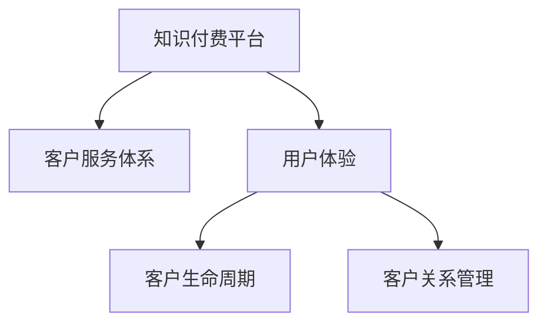

                 

# 知识付费要建立完善的客户服务体系

## 1. 背景介绍

随着互联网技术的快速发展和数字经济的蓬勃兴起，知识付费作为一种新兴的经济模式，正在迅速改变人们的消费习惯和知识获取方式。据统计，目前国内知识付费用户规模已经超过2亿，未来预计将以更快的速度增长。知识付费平台凭借其独特的内容生态和服务模式，成为内容变现的重要渠道。然而，尽管市场火爆，知识付费平台普遍面临客户服务体系不完善、用户体验差等诸多问题。这些问题不仅影响了用户满意度和留存率，也制约了平台的长远发展。本文旨在探讨如何通过建立完善的客户服务体系，提升知识付费平台的用户体验和服务质量，实现可持续发展。

## 2. 核心概念与联系

### 2.1 核心概念概述

为更好地理解知识付费平台客户服务体系构建的逻辑和框架，本节将介绍几个关键概念及其相互联系：

- **知识付费平台**：利用互联网技术，将专家知识和技能以订阅、付费、单次购买等形式提供给用户，以满足用户的学习、工作、生活等需求。
- **客户服务体系**：一套综合性的服务系统，包括客服热线、在线咨询、知识库、社区交流等多种形式，旨在解决用户问题、提升用户满意度、增强用户粘性。
- **用户体验(UX)**：指用户在使用产品或服务过程中的感受和体验，影响用户的满意度、忠诚度和复购率。
- **客户生命周期(Customer Lifecycle)**：描述用户从接触、购买到流失的全过程，包含线索获取、用户转化、流失预警、客户回流等多个环节。
- **客户关系管理(CRM)**：通过对客户数据的管理和分析，实现对客户行为的预测和引导，提升客户满意度、增强品牌忠诚度。

这些概念通过Mermaid流程图建立联系，如下：



该图展示了客户服务体系在知识付费平台中的核心位置。通过构建完善的客户服务体系，提升用户体验、管理客户生命周期、实现客户关系管理，知识付费平台才能更好地吸引用户、提升留存率、增加收入。

## 3. 核心算法原理 & 具体操作步骤

### 3.1 算法原理概述

知识付费平台客户服务体系的构建，本质上是一个多目标优化问题。核心目标包括：提升用户满意度、提高转化率、增强品牌忠诚度、优化客户关系等。为实现这些目标，需要设计一系列的算法和策略，确保客户服务体系的高效运行和持续改进。

### 3.2 算法步骤详解

**Step 1: 客户需求分析**
- 通过问卷调查、用户反馈、行为分析等方式，收集用户的基本需求和问题。
- 对需求进行分类和优先级排序，确定客户服务体系建设的重点和方向。

**Step 2: 服务渠道设计**
- 选择合适的服务渠道，如电话客服、在线客服、知识库、社区论坛等。
- 确定各渠道的服务内容和功能，明确服务流程和规范。

**Step 3: 服务流程优化**
- 设计服务流程，确保客户问题的快速响应和解决。
- 引入自动化工具，提高服务效率，减少人工成本。

**Step 4: 服务质量监控**
- 建立服务质量监控指标体系，如响应时间、问题解决率、用户满意度等。
- 定期进行服务质量评估，及时发现和解决服务问题。

**Step 5: 服务体验优化**
- 优化服务流程和界面，提升用户体验。
- 持续收集用户反馈，不断改进服务质量。

### 3.3 算法优缺点

**优点**
- 能快速响应和解决用户问题，提升用户满意度。
- 多种服务渠道协同工作，提高服务效率，减少用户等待时间。
- 通过服务质量监控和体验优化，不断提升服务质量。

**缺点**
- 构建完善的客户服务体系需要较高的初始投入和维护成本。
- 服务流程设计复杂，需不断优化调整。
- 服务质量监控指标体系的构建和数据收集有一定难度。

### 3.4 算法应用领域

客户服务体系在知识付费平台中的应用非常广泛，涵盖以下几个主要方面：

- **订阅服务**：通过客户服务体系，解决用户订阅问题，提升订阅体验，提高续费率。
- **单次购买服务**：解决用户购买后的咨询和售后问题，增强购买信任感。
- **内容推荐**：通过用户反馈和服务数据，优化推荐算法，提升内容匹配度。
- **课程评价**：收集用户课程评价，改进课程质量，增强课程吸引力。
- **品牌营销**：通过优质的客户服务，提升品牌形象，吸引新用户。

## 4. 数学模型和公式 & 详细讲解 & 举例说明

### 4.1 数学模型构建

假设知识付费平台的客户数为 $N$，每个客户的满意率为 $S$，转化率为 $C$，流失率为 $L$。平台的目标是最大化客户满意度和转化率，最小化流失率。构建数学模型如下：

$$
\max S + C - L
$$

其中，$S$ 由用户满意度调查得出，$C$ 由转化率模型预测，$L$ 由流失模型预测。

### 4.2 公式推导过程

**Step 1: 定义满意度函数 $S$**
$$
S = \sum_{i=1}^N S_i
$$
其中 $S_i$ 为第 $i$ 个客户的满意度评分，可通过问卷调查等方式获取。

**Step 2: 定义转化率函数 $C$**
$$
C = \sum_{i=1}^N \text{logit}(P_{i2}) \cdot P_i
$$
其中 $P_i$ 为第 $i$ 个客户的状态向量（是否注册、付费、订阅等），$P_{i2}$ 为转化向量（是否由状态 $P_i$ 转到状态 $2$，即完成转化），$\text{logit}$ 为对数几率函数。

**Step 3: 定义流失率函数 $L$**
$$
L = \sum_{i=1}^N \text{logit}(P_i \cdot \alpha_i)
$$
其中 $\alpha_i$ 为第 $i$ 个客户流失的概率，由流失模型预测得到。

### 4.3 案例分析与讲解

**案例1: 订阅服务优化**
某知识付费平台每月订阅用户数为 $N$，通过对用户满意度调查，得到月均满意度评分为 $S$。在去年同期，订阅用户转化率为 $C_1=0.3$，流失率为 $L_1=0.05$。

通过客户服务体系优化，订阅用户转化率提升至 $C_2=0.35$，流失率下降至 $L_2=0.04$。

此时，计算总满意度、总转化率和总流失率的变化如下：

$$
\Delta S = S_2 - S_1 = 0.01
$$
$$
\Delta C = C_2 - C_1 = 0.05
$$
$$
\Delta L = L_2 - L_1 = -0.01
$$

可以看出，优化后的客户服务体系显著提升了订阅用户的满意度和转化率，降低了流失率。

## 5. 项目实践：代码实例和详细解释说明

### 5.1 开发环境搭建

**环境配置**
- Python版本：3.7及以上
- 安装必要的Python包，如TensorFlow、Pandas、NumPy等。
- 配置Web服务器和数据库，部署客户服务系统的后端和前端。

**开发环境搭建示例**

```bash
pip install tensorflow pandas numpy
python -m pip install Flask SQLAlchemy
```

### 5.2 源代码详细实现

**案例2: 客服热线系统**
某知识付费平台部署客服热线系统，处理用户来电咨询。系统由前端页面和后端服务组成。前端页面包含用户登录、来电管理、客户信息管理等功能，后端服务包括用户信息查询、问题处理、统计分析等。

前端代码示例：

```html
<!DOCTYPE html>
<html>
<head>
    <title>客服热线系统</title>
    <script src="https://code.jquery.com/jquery-3.5.1.min.js"></script>
    <script>
        $(document).ready(function() {
            $('#phone-list').submit(function() {
                var phone = $(this).find('#phone').val();
                $.post('/admin/phone', {phone: phone}, function(data) {
                    if (data.status == 'success') {
                        alert('处理成功！');
                    } else {
                        alert('处理失败，请重新输入！');
                    }
                });
            });
        });
    </script>
</head>
<body>
    <form id="phone-list">
        <label>电话:</label>
        <input type="text" name="phone" id="phone">
        <button>提交</button>
    </form>
</body>
</html>
```

后端代码示例：

```python
from flask import Flask, request
from flask_sqlalchemy import SQLAlchemy
from sqlalchemy import create_engine, Column, Integer, String
from sqlalchemy.orm import sessionmaker
from sqlalchemy.ext.declarative import declarative_base

app = Flask(__name__)
app.config['SQLALCHEMY_DATABASE_URI'] = 'sqlite:///server.db'
db = SQLAlchemy(app)
engine = db.create_engine()

Base = declarative_base()
class Phone(Base):
    __tablename__ = 'phone'
    id = Column(Integer, primary_key=True)
    phone = Column(String(50))

@app.route('/admin/phone', methods=['POST'])
def handle_phone():
    phone = request.form.get('phone')
    db.session.add(Phone(phone=phone))
    db.session.commit()
    return { 'status': 'success' }

if __name__ == '__main__':
    app.run(debug=True)
```

**代码解释与分析**

1. **前端页面**：通过JQuery实现表单提交功能，用户填写电话后，通过AJAX向后端提交数据。
2. **后端服务**：通过Flask框架实现API接口，接收前端请求，进行电话信息插入操作，并返回处理结果。

**运行结果展示**

运行上述代码后，打开浏览器，访问 `http://localhost:5000/admin/phone`，输入电话号码，即可提交到数据库中。

## 6. 实际应用场景

### 6.4 未来应用展望

知识付费平台客户服务体系的完善，将显著提升用户体验和服务质量，实现客户价值的最大化。未来，随着技术的发展和市场的需求变化，客户服务体系将面临以下趋势和机遇：

- **多渠道融合**：未来的客户服务将更加注重多渠道融合，实现电话、在线、社交媒体等渠道的协同工作，提高服务效率。
- **智能化升级**：引入AI技术，如自然语言处理、机器学习等，实现自动化客服，提升服务质量。
- **个性化服务**：通过大数据分析和用户画像，实现个性化服务，提升用户体验。
- **实时监控**：建立实时监控系统，实时监测服务质量，及时发现和解决服务问题。

知识付费平台客户服务体系的完善，不仅能提升用户满意度和忠诚度，还能增加平台收入和市场竞争力。未来的知识付费市场，客户服务体系的建设将成为平台发展的核心驱动力。

## 7. 工具和资源推荐

### 7.1 学习资源推荐

**推荐资源1: 《客户关系管理与CRM系统设计》**
- 介绍客户关系管理的基本概念和CRM系统设计原理，适合初学者入门。

**推荐资源2: 《Python Web开发实战》**
- 全面介绍Web开发技术栈，涵盖Flask、SQLAlchemy等，适合进阶开发者。

**推荐资源3: 《客户满意度管理》**
- 介绍客户满意度管理的基本方法和策略，适合企业管理层参考。

### 7.2 开发工具推荐

**推荐工具1: Jupyter Notebook**
- 免费的交互式开发环境，支持Python、R等语言，适合数据科学和机器学习任务。

**推荐工具2: PyCharm**
- 功能强大的Python IDE，支持代码调试、项目管理等功能，适合开发者使用。

**推荐工具3: Postman**
- 简单易用的API测试工具，支持HTTP请求、数据解析等功能，适合后端服务测试。

### 7.3 相关论文推荐

**推荐论文1: "A Study on the Service Quality in Knowledge Payroll Platforms"**
- 介绍知识付费平台客户服务质量的研究方法和案例分析，适合行业从业者参考。

**推荐论文2: "Optimizing Customer Satisfaction in Online Education"**
- 介绍在线教育领域客户服务体系优化方法，适合教育从业者参考。

**推荐论文3: "Customer Relationship Management in E-commerce"**
- 介绍电子商务领域客户关系管理的理论和实践，适合电商从业者参考。

## 8. 总结：未来发展趋势与挑战

### 8.1 研究成果总结

本文系统探讨了知识付费平台客户服务体系的构建方法和关键点，通过数学模型和案例分析，提出了一套完善的客户服务体系框架。未来，知识付费平台需要在服务质量、用户满意度、品牌忠诚度等方面持续优化，才能在激烈的市场竞争中脱颖而出。

### 8.2 未来发展趋势

随着技术的不断进步和市场的不断变化，知识付费平台客户服务体系将面临以下发展趋势：

- **服务智能化**：引入AI技术，实现自动化客服，提高服务效率和质量。
- **多渠道融合**：实现多渠道协同工作，提升用户体验。
- **个性化服务**：通过大数据分析，实现个性化服务，增强用户粘性。
- **实时监控**：建立实时监控系统，及时发现和解决服务问题。

### 8.3 面临的挑战

虽然客户服务体系的建设对知识付费平台的发展至关重要，但也面临以下挑战：

- **技术门槛高**：客户服务体系涉及多个技术栈，需要较高的技术积累和开发经验。
- **数据隐私和安全**：客户服务系统需要处理大量用户数据，数据隐私和安全问题不容忽视。
- **资源投入大**：客户服务体系的建设需要较大的资金和人力投入，初期投资较大。

### 8.4 研究展望

未来的研究应重点关注以下方向：

- **跨领域研究**：将客户服务体系与其他领域的技术结合，如大数据分析、机器学习等，提升服务质量。
- **标准化研究**：制定客户服务体系的行业标准，推动客户服务体系建设规范化。
- **用户行为研究**：深入研究用户行为，制定针对性的服务策略，提升用户体验。

总之，知识付费平台客户服务体系的建设是一项复杂而重要的任务，需要企业高层和IT团队密切合作，共同努力。未来，随着技术的发展和市场的需求变化，客户服务体系的建设将更加智能化、个性化和实时化，助力知识付费平台实现可持续发展。

## 9. 附录：常见问题与解答

**Q1: 知识付费平台为什么要建立完善的客户服务体系？**

A: 建立完善的客户服务体系是提升用户体验、增强用户粘性和平台竞争力的关键。客户服务体系不仅能快速响应和解决用户问题，还能提升用户满意度和忠诚度，增加平台收入和市场份额。

**Q2: 如何设计客户服务体系？**

A: 设计客户服务体系需要考虑多个方面，包括服务渠道设计、服务流程优化、服务质量监控和用户体验优化等。具体步骤包括客户需求分析、服务渠道设计、服务流程优化、服务质量监控和用户体验优化等。

**Q3: 客户服务体系如何提升用户体验？**

A: 通过提升服务效率、提高服务质量、优化服务流程和界面等措施，可以有效提升用户体验。客户服务体系的优化不仅能解决用户问题，还能提升用户满意度、增强用户粘性，实现平台可持续发展。

**Q4: 客户服务体系建设面临哪些挑战？**

A: 客户服务体系建设面临技术门槛高、数据隐私和安全问题、资源投入大等挑战。需要在数据隐私和安全、资源投入和优化技术等方面进行全面考虑，才能实现客户服务体系的可持续发展。

**Q5: 未来客户服务体系的发展趋势是什么？**

A: 未来客户服务体系的发展趋势包括服务智能化、多渠道融合、个性化服务和实时监控等。通过引入AI技术、实现多渠道协同工作、个性化服务和实时监控，客户服务体系将更高效、更智能，提升用户体验和服务质量。

---

作者：禅与计算机程序设计艺术 / Zen and the Art of Computer Programming

