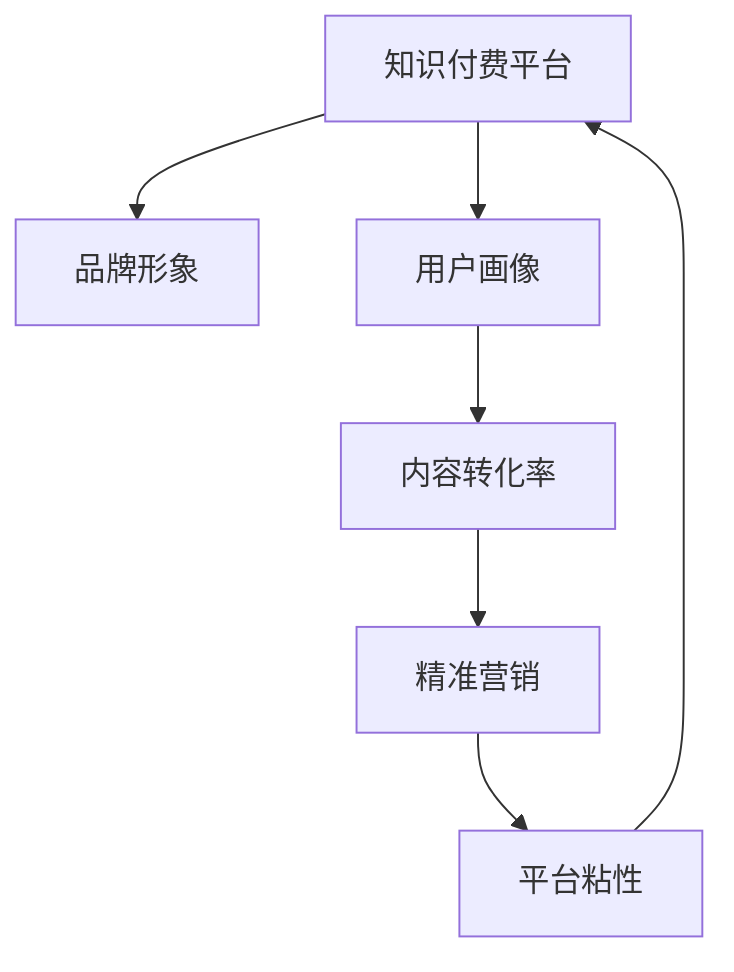

                 

## 1. 背景介绍

### 1.1 问题由来

在信息爆炸的时代，知识付费已成为一种流行的内容消费方式。这不仅让知识的传播变得更加高效，也帮助内容创造者实现了变现。然而，随着知识付费市场竞争的加剧，如何在众多品牌中脱颖而出，成为品牌营销的关键挑战。

### 1.2 问题核心关键点

品牌品牌营销的核心在于通过独特的品牌形象、故事、价值主张来吸引消费者，并建立稳定的用户关系。知识付费品牌尤其需要解决以下核心问题：

- 如何通过优质的内容吸引用户并提升转化率？
- 如何在激烈的竞争中保持品牌独特性？
- 如何利用数据和算法优化营销策略？
- 如何利用技术手段提升用户体验和平台粘性？

### 1.3 问题研究意义

品牌品牌营销和品牌推广策略对于知识付费品牌的长期发展和市场竞争至关重要。有效的品牌策略可以提升品牌的知名度和美誉度，增强用户粘性，实现稳定的用户增长和收入提升。

## 2. 核心概念与联系

### 2.1 核心概念概述

为更好地理解知识付费品牌品牌营销与品牌推广策略，本节将介绍几个密切相关的核心概念：

- **知识付费平台(Knowledge PaaS)**：提供知识内容的平台，用户可以通过订阅、购买等形式获取专业知识。常见的知识付费平台包括但不限于Coursera、Udemy、得到等。
- **品牌形象(Brand Image)**：消费者对品牌的感知和印象，包括品牌理念、视觉设计、用户口碑等。
- **用户画像(User Persona)**：通过分析用户行为数据，构建详细的用户群体描述，指导内容生产和营销策略。
- **内容转化率(Content Conversion Rate)**：用户从内容浏览到实际购买或订阅的转化比例，衡量内容质量和吸引力。
- **精准营销(Precision Marketing)**：利用大数据和算法技术，对目标用户进行精准触达和高效转化。
- **平台粘性(Platform Sticky)**：通过用户参与互动和长期价值绑定，提升用户留存率和消费频次。

这些概念之间的关系可以通过以下Mermaid流程图来展示：



这个流程图展示了知识付费平台如何通过品牌形象、用户画像、内容转化率、精准营销和平台粘性等多个环节，实现用户的持续吸引和转化。

## 3. 核心算法原理 & 具体操作步骤

### 3.1 算法原理概述

知识付费品牌的品牌营销与推广策略，本质上是一个基于数据驱动的用户行为分析和营销优化过程。其核心思想是通过收集和分析用户行为数据，识别出用户的潜在需求和行为模式，进而设计出更有针对性的营销策略。

形式化地，假设知识付费平台的标注数据集为 $D=\{(x_i,y_i)\}_{i=1}^N$，其中 $x_i$ 为用户的浏览记录和行为数据，$y_i$ 为用户的实际消费行为（购买或订阅）。品牌营销与推广的目标是找到最优的营销策略 $M$，使得：

$$
\hat{M} = \mathop{\arg\min}_{M} \mathcal{L}(M,D)
$$

其中 $\mathcal{L}$ 为损失函数，用于衡量营销策略的预测效果与实际消费行为之间的差异。

### 3.2 算法步骤详解

基于数据驱动的品牌营销与推广策略一般包括以下几个关键步骤：

**Step 1: 数据收集与预处理**
- 通过网站分析工具、用户行为追踪等手段，收集用户的行为数据，包括浏览时长、内容互动、购买记录等。
- 对数据进行清洗和去重，去除异常数据和重复记录。

**Step 2: 用户画像构建**
- 对用户行为数据进行特征提取，如浏览偏好、购买频率、停留时间等，构建用户画像。
- 使用聚类算法（如K-means、LDA）对用户进行分群，识别不同群体的特征和需求。

**Step 3: 营销策略设计**
- 基于用户画像，设计有针对性的营销策略，如个性化推荐、折扣促销、邮件营销等。
- 利用A/B测试，验证营销策略的效果，优化策略参数。

**Step 4: 用户转化率提升**
- 对模型输出进行概率化处理，预测用户的购买概率。
- 根据预测结果，进行精准推送和个性化推荐，提升内容转化率。

**Step 5: 平台粘性增强**
- 通过内容社区、互动功能等，增强用户粘性，提高用户活跃度和留存率。
- 利用推荐算法，提供更符合用户偏好的内容，延长用户停留时间。

### 3.3 算法优缺点

基于数据驱动的品牌营销与推广策略具有以下优点：

1. **精准性高**：通过分析用户行为数据，能够更准确地预测用户需求和行为，实现精准营销。
2. **效果显著**：能够显著提升内容转化率和用户粘性，带来稳定的用户增长和收入提升。
3. **可扩展性强**：能够针对不同的营销场景进行优化，提升营销活动的覆盖面和影响力。

同时，该方法也存在一定的局限性：

1. **数据隐私问题**：收集和分析用户行为数据需要严格遵守数据隐私法规，避免侵犯用户隐私。
2. **模型复杂性高**：需要构建和优化复杂的推荐模型，对技术要求较高。
3. **数据质量要求高**：数据质量会直接影响模型的预测效果，需要保证数据采集和处理的准确性。
4. **时效性要求高**：用户需求和行为会随时间变化，需要实时更新模型和策略。

尽管存在这些局限性，但就目前而言，基于数据驱动的品牌营销与推广策略仍是知识付费品牌的主要营销范式。未来相关研究的重点在于如何进一步优化数据收集和分析技术，提升模型的精度和可解释性，同时兼顾隐私保护和数据安全性等因素。

### 3.4 算法应用领域

基于数据驱动的品牌营销与推广策略，在知识付费领域已经得到了广泛的应用，覆盖了几乎所有常见营销场景，例如：

- 个性化推荐：根据用户画像，推荐最适合用户的内容，提升购买转化率。
- 精准投放：通过数据分析，精准投放广告和推广信息，提升品牌知名度。
- 用户回访：利用用户行为数据，分析用户流失原因，设计有效的回访策略。
- 社区运营：通过数据分析，识别社区活跃用户，优化社区互动功能，提升用户粘性。
- 价格优化：基于用户行为和市场动态，优化产品定价策略，提高销售转化。

除了上述这些经典应用外，知识付费品牌还可以创新性地应用到更多场景中，如内容付费激励、KOL合作、用户行为分析等，为品牌推广注入新的活力。

## 4. 数学模型和公式 & 详细讲解 & 举例说明

### 4.1 数学模型构建

本节将使用数学语言对基于数据驱动的品牌营销与推广策略进行更加严格的刻画。

记知识付费平台的标注数据集为 $D=\{(x_i,y_i)\}_{i=1}^N$，其中 $x_i$ 为用户的浏览记录和行为数据，$y_i$ 为用户的实际消费行为（购买或订阅）。假设品牌营销策略为 $M$，则损失函数 $\mathcal{L}$ 可以定义为：

$$
\mathcal{L}(M,D) = \sum_{i=1}^N \ell(M(x_i),y_i)
$$

其中 $\ell$ 为损失函数，用于衡量营销策略的预测效果与实际消费行为之间的差异。常见的损失函数包括交叉熵损失、均方误差损失等。

### 4.2 公式推导过程

以下我们以二分类问题为例，推导交叉熵损失函数及其梯度的计算公式。

假设品牌营销策略 $M$ 对用户 $x_i$ 的预测概率为 $\hat{y}_i=M(x_i) \in [0,1]$，表示用户 $x_i$ 购买的概率。真实标签 $y_i \in \{0,1\}$。则二分类交叉熵损失函数定义为：

$$
\ell(M(x_i),y_i) = -[y_i\log \hat{y}_i + (1-y_i)\log (1-\hat{y}_i)]
$$

将其代入损失函数 $\mathcal{L}$ 公式，得：

$$
\mathcal{L}(M,D) = -\frac{1}{N}\sum_{i=1}^N [y_i\log M(x_i)+(1-y_i)\log(1-M(x_i))]
$$

根据链式法则，损失函数对营销策略 $M$ 的梯度为：

$$
\frac{\partial \mathcal{L}(M)}{\partial M} = -\frac{1}{N}\sum_{i=1}^N (\frac{y_i}{M(x_i)}-\frac{1-y_i}{1-M(x_i)}) \frac{\partial M(x_i)}{\partial M}
$$

其中 $\frac{\partial M(x_i)}{\partial M}$ 可进一步递归展开，利用自动微分技术完成计算。

在得到损失函数的梯度后，即可带入优化算法，完成营销策略的迭代优化。重复上述过程直至收敛，最终得到适应目标用户群体的最优营销策略。

## 5. 项目实践：代码实例和详细解释说明

### 5.1 开发环境搭建

在进行品牌营销与推广策略的实践前，我们需要准备好开发环境。以下是使用Python进行PyTorch开发的环境配置流程：

1. 安装Anaconda：从官网下载并安装Anaconda，用于创建独立的Python环境。

2. 创建并激活虚拟环境：
```bash
conda create -n pytorch-env python=3.8 
conda activate pytorch-env
```

3. 安装PyTorch：根据CUDA版本，从官网获取对应的安装命令。例如：
```bash
conda install pytorch torchvision torchaudio cudatoolkit=11.1 -c pytorch -c conda-forge
```

4. 安装其他必要的库：
```bash
pip install numpy pandas scikit-learn torchtext transformers torch
```

完成上述步骤后，即可在`pytorch-env`环境中开始项目实践。

### 5.2 源代码详细实现

这里我们以个性化推荐系统为例，给出使用Transformers库对品牌营销策略进行优化实践的PyTorch代码实现。

首先，定义用户行为数据的处理函数：

```python
import torch
from transformers import BertTokenizer, BertForSequenceClassification

def process_data(data):
    tokenizer = BertTokenizer.from_pretrained('bert-base-cased')
    inputs = tokenizer(data, return_tensors='pt')
    input_ids = inputs['input_ids']
    attention_mask = inputs['attention_mask']
    return input_ids, attention_mask

# 模拟用户行为数据
user_behaviors = ["读书笔记", "视频教程", "编程挑战"]
inputs, masks = process_data(user_behaviors)
```

然后，定义推荐模型的加载和优化器设置：

```python
from transformers import AdamW

model = BertForSequenceClassification.from_pretrained('bert-base-cased', num_labels=2)
optimizer = AdamW(model.parameters(), lr=2e-5)
```

接着，定义训练和评估函数：

```python
def train(model, data_loader, optimizer, num_epochs):
    model.train()
    for epoch in range(num_epochs):
        for input_ids, attention_mask, labels in data_loader:
            model.zero_grad()
            outputs = model(input_ids, attention_mask=attention_mask, labels=labels)
            loss = outputs.loss
            loss.backward()
            optimizer.step()

def evaluate(model, data_loader):
    model.eval()
    correct = 0
    total = 0
    with torch.no_grad():
        for input_ids, attention_mask, labels in data_loader:
            outputs = model(input_ids, attention_mask=attention_mask)
            _, preds = torch.max(outputs, dim=1)
            total += labels.size(0)
            correct += (preds == labels).sum().item()
    print('Accuracy:', correct / total)

# 使用训练数据
train_dataset = ...
train_loader = DataLoader(train_dataset, batch_size=16)

train(model, train_loader, optimizer, num_epochs=5)
evaluate(model, train_loader)
```

最后，将模型部署到实际推荐系统中：

```python
from transformers import BertForSequenceClassification

model = BertForSequenceClassification.from_pretrained('bert-base-cased', num_labels=2)
model.eval()
input_ids = ...
attention_mask = ...
labels = ...
outputs = model(input_ids, attention_mask=attention_mask, labels=labels)
```

以上就是使用PyTorch对品牌营销策略进行优化实践的完整代码实现。可以看到，利用Transformers库，我们可以很方便地将预训练模型加载并应用于品牌推荐系统中。

### 5.3 代码解读与分析

让我们再详细解读一下关键代码的实现细节：

**process_data函数**：
- 定义了数据预处理函数，将文本数据转换为模型可以接受的格式。
- 使用BertTokenizer将文本转换为token ids，并生成对应的attention mask。

**train和evaluate函数**：
- 使用PyTorch的数据Loader对训练数据进行批处理，并在每个批次上进行模型训练和评估。
- 在训练函数中，模型前向传播计算损失函数并反向传播更新参数。
- 在评估函数中，模型前向传播计算预测结果，并与标签进行比较，统计准确率。

**train模型部署**：
- 定义推荐模型，加载优化器，训练模型，评估模型。
- 在训练完毕后，将模型保存并部署到实际应用场景中。

可以看到，通过上述步骤，我们可以快速构建基于数据驱动的品牌营销与推广策略的推荐系统。通过不断地优化和迭代，可以实现高效的精准推荐。

## 6. 实际应用场景

### 6.1 智能客服系统

基于数据驱动的品牌营销与推广策略，可以广泛应用于智能客服系统的构建。传统的客服系统往往需要配备大量人力，高峰期响应缓慢，且服务质量难以保证。通过个性化推荐、精准投放等技术，智能客服系统可以实现7x24小时不间断服务，快速响应客户咨询，提供高质量的客户服务。

在技术实现上，可以收集企业内部的历史客服对话记录，将问题和最佳答复构建成监督数据，在此基础上对推荐模型进行微调。微调后的推荐模型能够自动理解用户意图，匹配最合适的答案模板进行回复。对于客户提出的新问题，还可以接入检索系统实时搜索相关内容，动态组织生成回答。如此构建的智能客服系统，能大幅提升客户咨询体验和问题解决效率。

### 6.2 金融舆情监测

金融机构需要实时监测市场舆论动向，以便及时应对负面信息传播，规避金融风险。传统的舆情监测方式往往依赖人工分析，效率低，且难以覆盖大规模数据。通过个性化推荐和精准投放等技术，金融舆情监测系统可以实现自动化的舆论监测和分析。

具体而言，可以收集金融领域相关的新闻、报道、评论等文本数据，并对其进行主题标注和情感标注。在此基础上对推荐模型进行微调，使其能够自动判断文本属于何种主题，情感倾向是正面、中性还是负面。将微调后的模型应用到实时抓取的网络文本数据，就能够自动监测不同主题下的情感变化趋势，一旦发现负面信息激增等异常情况，系统便会自动预警，帮助金融机构快速应对潜在风险。

### 6.3 个性化推荐系统

当前的推荐系统往往只依赖用户的历史行为数据进行物品推荐，无法深入理解用户的真实兴趣偏好。基于数据驱动的品牌营销与推广策略的个性化推荐系统可以更好地挖掘用户行为背后的语义信息，从而提供更精准、多样的推荐内容。

在实践中，可以收集用户浏览、点击、评论、分享等行为数据，提取和用户交互的物品标题、描述、标签等文本内容。将文本内容作为模型输入，用户的后续行为（如是否点击、购买等）作为监督信号，在此基础上微调推荐模型。微调后的模型能够从文本内容中准确把握用户的兴趣点。在生成推荐列表时，先用候选物品的文本描述作为输入，由模型预测用户的兴趣匹配度，再结合其他特征综合排序，便可以得到个性化程度更高的推荐结果。

### 6.4 未来应用展望

随着数据驱动的品牌营销与推广策略的不断发展，未来将在更多领域得到应用，为传统行业带来变革性影响。

在智慧医疗领域，基于数据驱动的品牌营销与推广策略的医疗问答、病历分析、药物研发等应用将提升医疗服务的智能化水平，辅助医生诊疗，加速新药开发进程。

在智能教育领域，个性化推荐系统可以帮助学生找到适合自己的学习资源，提升学习效果，实现因材施教，促进教育公平。

在智慧城市治理中，数据驱动的营销策略可以实现对城市事件监测、舆情分析、应急指挥等环节的智能化处理，提高城市管理的自动化和智能化水平，构建更安全、高效的未来城市。

此外，在企业生产、社会治理、文娱传媒等众多领域，基于数据驱动的品牌营销与推广策略的应用也将不断涌现，为经济社会发展注入新的动力。相信随着技术的日益成熟，数据驱动的营销策略将成为品牌推广的重要手段，推动人工智能技术在垂直行业的规模化落地。

## 7. 工具和资源推荐

### 7.1 学习资源推荐

为了帮助开发者系统掌握基于数据驱动的品牌营销与推广策略的理论基础和实践技巧，这里推荐一些优质的学习资源：

1. 《深度学习基础》系列博文：由深度学习专家撰写，深入浅出地介绍了深度学习的基本原理和核心算法。

2. 《数据驱动的品牌营销》课程：由知名品牌专家和数据科学家联合授课，结合实际案例，讲解品牌营销与推广策略的核心要点。

3. 《推荐系统实战》书籍：详细介绍了推荐系统从原理到实现的各个环节，包含数据驱动的营销策略和推荐算法。

4. HuggingFace官方文档：提供丰富的预训练语言模型和推荐系统的样例代码，是进行品牌推广实践的必备资料。

5. Kaggle竞赛：参与实际的品牌推广竞赛，积累实战经验，检验和提升自己的策略设计能力。

通过对这些资源的学习实践，相信你一定能够快速掌握数据驱动的品牌营销与推广策略的精髓，并用于解决实际的品牌推广问题。

### 7.2 开发工具推荐

高效的开发离不开优秀的工具支持。以下是几款用于品牌营销与推广策略开发的常用工具：

1. Jupyter Notebook：提供交互式的开发环境，方便代码调试和实验验证。

2. PyTorch：基于Python的开源深度学习框架，适合快速迭代研究。

3. TensorFlow：由Google主导开发的开源深度学习框架，适合大规模工程应用。

4. Weights & Biases：模型训练的实验跟踪工具，可以记录和可视化模型训练过程中的各项指标，方便对比和调优。

5. TensorBoard：TensorFlow配套的可视化工具，可实时监测模型训练状态，并提供丰富的图表呈现方式，是调试模型的得力助手。

6. Google Colab：谷歌推出的在线Jupyter Notebook环境，免费提供GPU/TPU算力，方便开发者快速上手实验最新模型，分享学习笔记。

合理利用这些工具，可以显著提升品牌营销与推广策略的开发效率，加快创新迭代的步伐。

### 7.3 相关论文推荐

数据驱动的品牌营销与推广策略的研究源于学界的持续研究。以下是几篇奠基性的相关论文，推荐阅读：

1. Attention is All You Need（即Transformer原论文）：提出了Transformer结构，开启了深度学习模型的结构优化时代。

2. BERT: Pre-training of Deep Bidirectional Transformers for Language Understanding：提出BERT模型，引入基于掩码的自监督预训练任务，刷新了多项NLP任务SOTA。

3. Knowledge-Aware Recommender Systems：研究如何将外部知识与推荐系统结合，提升推荐效果和用户满意度。

4. Deep Learning for Personalized Recommendation：详细介绍了深度学习在推荐系统中的应用，包含数据驱动的推荐策略。

5. Deep Collaborative Filtering：提出基于矩阵分解的推荐算法，引入协同过滤的思想，提升推荐模型的精度和鲁棒性。

这些论文代表了大语言模型微调技术的发展脉络。通过学习这些前沿成果，可以帮助研究者把握学科前进方向，激发更多的创新灵感。

## 8. 总结：未来发展趋势与挑战

### 8.1 总结

本文对基于数据驱动的品牌营销与推广策略进行了全面系统的介绍。首先阐述了品牌品牌营销的核心概念和研究意义，明确了数据驱动策略在品牌推广中的独特价值。其次，从原理到实践，详细讲解了品牌营销与推广策略的数学模型和关键步骤，给出了品牌营销与推广策略的完整代码实例。同时，本文还广泛探讨了策略在智能客服、金融舆情、个性化推荐等多个领域的应用前景，展示了数据驱动策略的巨大潜力。此外，本文精选了品牌营销与推广策略的学习资源，力求为读者提供全方位的技术指引。

通过本文的系统梳理，可以看到，基于数据驱动的品牌营销与推广策略正在成为品牌推广的重要手段，极大地提升了品牌推广的精准性和效果。数据驱动策略不仅降低了品牌推广的运营成本，还显著提升了品牌知名度和用户粘性，为品牌推广带来了巨大的商业价值。

### 8.2 未来发展趋势

展望未来，数据驱动的品牌营销与推广策略将呈现以下几个发展趋势：

1. **数据融合与分析能力提升**：未来品牌营销与推广策略将更注重数据的多源融合和深入分析，通过大数据和机器学习技术，提取更全面、精准的用户画像，设计更有效的营销策略。

2. **智能决策系统构建**：通过构建基于人工智能的决策系统，品牌营销与推广策略将实现自动化和智能化，进一步提升决策效率和效果。

3. **隐私保护与伦理考量**：随着数据隐私法规的完善，品牌营销与推广策略将更加注重数据隐私和伦理保护，确保用户数据安全。

4. **跨平台协同营销**：通过跨平台协同营销，品牌推广策略可以覆盖更多用户群体，提升品牌影响力。

5. **实时动态优化**：利用实时数据和算法优化，品牌营销与推广策略可以动态调整营销策略，保持最佳效果。

这些趋势凸显了品牌营销与推广策略的广阔前景。这些方向的探索发展，必将进一步提升品牌推广的效果和效率，为品牌推广带来更大的商业价值。

### 8.3 面临的挑战

尽管数据驱动的品牌营销与推广策略已经取得了显著成果，但在迈向更加智能化、普适化应用的过程中，仍面临诸多挑战：

1. **数据隐私问题**：数据隐私法规的不断完善，对品牌推广策略的数据收集和处理提出了更高的要求，如何在保护用户隐私的前提下，获取有效数据，是一大难题。

2. **数据质量问题**：品牌推广策略的效果高度依赖于数据质量，如何保证数据的准确性和时效性，需要进一步优化数据采集和处理流程。

3. **算法复杂性**：构建和优化数据驱动的品牌营销与推广策略需要强大的技术支持，如何降低算法复杂性，提升策略的可操作性和可解释性，仍需不断探索。

4. **模型鲁棒性**：品牌推广策略的模型需要具备较强的鲁棒性，能够应对数据分布变化和异常情况，避免过拟合和灾难性遗忘。

5. **策略落地问题**：如何将品牌推广策略有效地应用于实际业务场景，需要考虑技术和业务的协同，确保策略的可执行性和效果。

这些挑战需要品牌推广策略的研究者不断创新和优化，才能实现其更大的商业价值和社会效益。

### 8.4 研究展望

面对品牌营销与推广策略所面临的种种挑战，未来的研究需要在以下几个方面寻求新的突破：

1. **数据融合与清洗技术**：开发更加高效的数据融合和清洗技术，提高数据的可用性和准确性，确保策略的有效实施。

2. **算法优化与模型鲁棒性**：研究和开发更加鲁棒的模型和算法，提升策略在各种场景下的稳定性和效果。

3. **隐私保护与伦理约束**：在算法设计和策略制定中引入隐私保护和伦理约束，确保用户数据的安全和伦理合规。

4. **跨平台协同营销**：研究跨平台协同营销技术，覆盖更广泛的用户群体，提升品牌推广的覆盖面和影响力。

5. **实时动态优化**：利用实时数据和算法优化，实现策略的动态调整和优化，提升策略的实时性和效果。

6. **用户行为分析**：深入分析用户行为数据，挖掘用户的潜在需求和兴趣点，设计更加个性化的推荐和营销策略。

这些研究方向将推动品牌营销与推广策略的不断进步，为品牌推广带来更多的商业机遇和用户价值。

## 9. 附录：常见问题与解答

**Q1：品牌品牌营销与推广策略如何实现精准推荐？**

A: 精准推荐的关键在于用户画像的构建和推荐模型的优化。通过分析用户的行为数据（如浏览历史、购买记录、互动行为等），构建详细的用户画像，包含用户的兴趣偏好、行为特征等信息。然后，利用机器学习算法（如协同过滤、深度学习等）设计推荐模型，根据用户画像和历史数据预测用户的未来行为。最后，根据预测结果进行个性化推荐，提升推荐效果和用户满意度。

**Q2：品牌推广策略如何提升用户粘性？**

A: 用户粘性是品牌推广策略的重要指标，可以通过以下方法提升：
1. 增强平台互动性：增加评论、点赞、分享等功能，鼓励用户参与互动，提升用户活跃度。
2. 提供优质内容：通过个性化推荐和内容推荐，提供符合用户兴趣的高质量内容，增加用户停留时间。
3. 建立社区文化：建立具有社区感的平台，增加用户归属感和参与感，提升用户粘性。
4. 提供增值服务：通过会员服务、专属优惠等方式，提升用户忠诚度和留存率。

**Q3：品牌推广策略如何应对数据隐私问题？**

A: 数据隐私问题在品牌推广策略中尤为重要。为应对数据隐私问题，可以采取以下措施：
1. 合法合规：严格遵守数据隐私法规，确保数据采集和使用过程的合法合规。
2. 数据匿名化：对敏感数据进行匿名化处理，保护用户隐私。
3. 用户控制：提供用户数据访问和控制功能，让用户可以自主管理个人数据。
4. 技术手段：采用加密、匿名化、差分隐私等技术手段，增强数据安全性。

这些措施可以有效地保护用户隐私，提升品牌推广策略的可信度和用户信任度。

**Q4：品牌推广策略如何评估其效果？**

A: 品牌推广策略的效果评估可以从多个维度进行：
1. 转化率：通过跟踪用户从浏览到购买或订阅的转化路径，评估策略的效果。
2. 用户活跃度：统计用户的活跃度和留存率，衡量策略的长期效果。
3. 品牌知名度：通过品牌曝光率和用户反馈，评估品牌推广的效果。
4. 用户满意度：通过用户满意度调查和评价，了解用户对品牌推广策略的反馈。

综合评估这些指标，可以全面了解品牌推广策略的效果，指导策略的优化和改进。

---

作者：禅与计算机程序设计艺术 / Zen and the Art of Computer Programming

