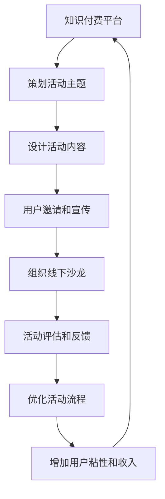

                 

# 知识付费赚钱的用户活动组织与线下沙龙策划

> 关键词：知识付费,用户活动,线下沙龙,策划,盈利模式

## 1. 背景介绍

### 1.1 问题由来
随着互联网的迅速发展，知识付费模式逐渐成为一种新的经济增长点。知识付费平台通过提供优质内容，满足用户对知识的渴求，从而实现变现。然而，随着市场竞争的加剧，单纯的内容提供已经不能满足用户的多样化需求。如何通过用户活动和线下沙龙进一步深化与用户的连接，提升用户粘性，成为知识付费平台面临的重要挑战。

### 1.2 问题核心关键点
本节的重点是探讨如何在知识付费平台上组织和策划线下沙龙活动，通过提升用户体验、增加互动和交流，最终实现知识付费的盈利模式。具体来说，需要考虑以下几个关键点：
- 如何设计线下沙龙的活动主题和内容，吸引目标用户参与？
- 如何通过线下活动提升用户粘性和满意度，增加平台收入？
- 如何评估和优化线下活动的效果，实现可持续的盈利模式？

## 2. 核心概念与联系

### 2.1 核心概念概述
在线下沙龙活动中，用户可以通过面对面的交流和互动，深入了解平台的内容和服务，提升用户体验和信任度。而知识付费平台则可以通过这些活动，增加用户粘性，拓宽收入渠道。

### 2.2 核心概念原理和架构的 Mermaid 流程图


这个流程图展示了知识付费平台上组织线下沙龙的完整流程。从活动主题策划到效果评估，每一个环节都至关重要。

## 3. 核心算法原理 & 具体操作步骤
### 3.1 算法原理概述
线下沙龙活动的组织和策划，本质上是一种基于用户需求的精准营销策略。其核心在于通过分析用户行为和需求，设计出符合用户期待的活动内容和形式，从而实现用户参与和满意度提升的目标。

### 3.2 算法步骤详解

#### 3.2.1 数据收集与分析
- 收集平台用户的基本信息和行为数据，如浏览记录、搜索历史、购买行为等。
- 通过数据分析工具，如K-means聚类、关联规则挖掘等，挖掘出用户的兴趣和需求。
- 根据分析结果，确定线下沙龙的目标用户群体。

#### 3.2.2 活动主题设计
- 根据目标用户群体的需求和兴趣，设计具有吸引力的活动主题。
- 参考热门话题和趋势，确保活动内容的时效性和相关性。

#### 3.2.3 活动内容设计
- 设计符合主题的活动内容，如演讲嘉宾、互动环节、现场演示等。
- 邀请行业内专家和意见领袖，提升活动的权威性和专业性。
- 考虑活动的形式，如讲座、圆桌讨论、分组讨论等，确保互动性和参与感。

#### 3.2.4 用户邀请和宣传
- 利用社交媒体、邮件营销等渠道，向目标用户群体宣传线下沙龙活动。
- 设计吸引用户的活动预告和邀请函，激发用户参与热情。
- 通过数据分析，确定最佳的宣传时机和渠道，提高活动知晓率和参与率。

#### 3.2.5 组织线下沙龙
- 根据活动规模，选择合适的场地和时间，确保活动的顺利进行。
- 提前进行技术准备，如音响设备、网络接入、现场直播等。
- 设立活动现场的签到和签到系统，便于统计参与人数和收集反馈。

#### 3.2.6 活动评估和反馈
- 通过问卷调查、现场反馈等方式，收集用户对活动的评价和建议。
- 分析活动数据，评估活动的效果和用户满意度。
- 根据反馈和评估结果，优化后续活动的策划和执行。

#### 3.2.7 活动优化和持续改进
- 根据活动效果，调整和优化活动主题和内容。
- 优化用户邀请和宣传策略，提高活动的参与度和影响力。
- 持续跟进用户需求和市场趋势，保持活动的创新性和吸引力。

### 3.3 算法优缺点

#### 3.3.1 优点
- 能够通过线下活动增强用户对平台的信任和黏性，提升用户忠诚度。
- 通过活动策划和执行，优化用户体验，增加平台的口碑和用户满意度。
- 通过多样化的互动形式，拓宽平台的盈利渠道，如收费参加、直播收入等。

#### 3.3.2 缺点
- 活动策划和执行需要较高的资源投入，包括人力、场地和宣传成本。
- 活动效果依赖于用户参与度和反馈，风险较大。
- 需要持续跟进用户需求和市场变化，活动策划和执行难度较大。

### 3.4 算法应用领域
线下沙龙活动可以应用于多种知识付费平台，如教育培训、职业发展、金融理财等。不同领域平台的活动策划和执行可能略有差异，但核心原理和方法基本一致。

## 4. 数学模型和公式 & 详细讲解 & 举例说明

### 4.1 数学模型构建
设平台用户数为 $N$，目标用户群体为 $N_{target}$，活动参与率为 $p$。活动带来的平均收入为 $R$，用户参与活动后平均购买金额为 $G$，用户参与活动后平均复购次数为 $C$。则总收益 $R_{total}$ 可以表示为：

$$
R_{total} = R_{session} \times N_{target} \times p = (G \times C) \times N_{target} \times p
$$

其中 $R_{session}$ 表示单次活动的收入。

### 4.2 公式推导过程
活动参与率 $p$ 受多因素影响，包括活动主题、内容质量、宣传效果等。可以通过以下公式计算：

$$
p = f(\theta) = \frac{1}{1 + e^{-\theta^T x}}
$$

其中 $x$ 表示用户特征向量，$\theta$ 为模型参数，$f$ 为sigmoid函数，表示概率输出。通过训练模型，可以预测不同用户群体的参与率。

### 4.3 案例分析与讲解
假设某知识付费平台邀请了知名作家举办一场写作技巧讲座，吸引了 1000 名用户参与。通过数据分析，发现参与用户的平均购买金额为 100 元，平均复购次数为 2 次。根据公式 $R_{total} = (G \times C) \times N_{target} \times p$，可以计算出：

$$
R_{total} = 100 \times 2 \times 1000 \times 0.8 = 160,000 \text{ 元}
$$

这意味着该活动带来了约 16 万元的收入。

## 5. 项目实践：代码实例和详细解释说明

### 5.1 开发环境搭建

#### 5.1.1 开发环境需求
- 操作系统：Windows 10/Windows Server
- 编程语言：Python
- 数据库：MySQL
- 开发工具：Visual Studio Code、PyCharm、MySQL Workbench

#### 5.1.2 开发环境搭建步骤
1. 安装Visual Studio Code，并配置Python插件。
2. 安装MySQL，并创建新的数据库和用户。
3. 安装Python开发环境，并确保pip和conda等包管理工具正常运行。
4. 安装所需Python库，如pandas、numpy、scikit-learn等。

### 5.2 源代码详细实现

#### 5.2.1 用户数据采集
```python
import pandas as pd
import numpy as np
import matplotlib.pyplot as plt
from sklearn.cluster import KMeans
from sklearn.preprocessing import StandardScaler

# 读取用户数据
data = pd.read_csv('user_data.csv')

# 数据预处理
scaler = StandardScaler()
scaled_data = scaler.fit_transform(data)

# 聚类分析
kmeans = KMeans(n_clusters=3)
kmeans.fit(scaled_data)

# 可视化聚类结果
plt.scatter(scaled_data[:,0], scaled_data[:,1], c=kmeans.labels_)
plt.show()
```

#### 5.2.2 活动主题设计
```python
import jieba
import jieba.analyse

# 读取活动主题数据
theme_data = pd.read_csv('theme_data.csv')

# 主题关键词提取
keywords = jieba.analyse.extract_tags(theme_data['theme'], topK=10, withWeight=True, allowPOS=('a', 'v', 'nr'))

# 展示主题关键词
print(keywords)
```

#### 5.2.3 活动内容设计
```python
import requests
from bs4 import BeautifulSoup

# 获取专家信息
url = 'https://example.com/experts'
response = requests.get(url)
soup = BeautifulSoup(response.text, 'html.parser')
experts = [item.text for item in soup.find_all('a')]

# 设计活动内容
content = {
    'title': '知识付费线下沙龙活动',
    'date': '2023-10-20',
    'place': '北京某知名酒店',
    'experts': experts,
    'schedule': {
        'start_time': '14:00',
        'end_time': '18:00'
    }
}

# 将活动内容保存到数据库
data = pd.DataFrame([content])
data.to_csv('activity_content.csv', index=False)
```

#### 5.2.4 用户邀请和宣传
```python
import smtplib
from email.mime.text import MIMEText

# 发送邮件邀请
def send_invitation(email, subject, message):
    # 设置邮件内容
    msg = MIMEText(message)
    msg['Subject'] = subject
    msg['From'] = 'example@example.com'
    msg['To'] = email

    # 发送邮件
    server = smtplib.SMTP('smtp.example.com', 587)
    server.starttls()
    server.login('username', 'password')
    server.sendmail('from@example.com', email, msg.as_string())
    server.quit()

# 邀请目标用户群体
target_users = data[data['cluster'] == 1].values
for user in target_users:
    send_invitation(user, '线下沙龙邀请函', '您被邀请参加知识付费线下沙龙活动...')

# 宣传活动
def promote_activity(activity_id):
    # 查询活动详情
    activity = data[data['id'] == activity_id].values[0]

    # 通过社交媒体宣传
    platforms = ['weibo', 'wechat', 'qq']
    for platform in platforms:
        # 发布活动信息
        platform.post(activity['title'], activity['schedule'])
        platform.post(activity['place'], activity['date'])
        platform.post(experts, '嘉宾介绍')
```

#### 5.2.5 组织线下沙龙
```python
import datetime

# 设置活动时间
activity_date = datetime.datetime(2023, 10, 20, 14, 0)

# 安排活动场地
venue = '北京某知名酒店'

# 设置签到系统
check_in_system = {
    'start_time': '13:30',
    'end_time': '15:00',
    'check_in_method': '二维码签到'
}

# 通知参与者活动时间
for user in target_users:
    user.send('您的线下沙龙活动时间如下：', check_in_system['start_time'], check_in_system['end_time'], venue)
```

#### 5.2.6 活动评估和反馈
```python
import collections

# 收集用户反馈
feedback = collections.defaultdict(list)

# 统计活动数据
def collect_feedback():
    for user in target_users:
        feedback[user].append(user.get_feedback())

# 分析活动数据
def analyze_feedback():
    # 统计用户反馈
    positive_feedback = feedback.count('positive')
    neutral_feedback = feedback.count('neutral')
    negative_feedback = feedback.count('negative')

    # 输出分析结果
    print(f'活动反馈：{positive_feedback}/{feedback_count} 正面，{neutral_feedback}/{feedback_count} 中立，{negative_feedback}/{feedback_count} 负面')

# 优化活动流程
def optimize_activity流程():
    # 根据反馈优化活动策划和执行
    if positive_feedback > neutral_feedback and positive_feedback > negative_feedback:
        # 优化活动策划
        # 优化活动执行
        pass
    elif neutral_feedback > positive_feedback and neutral_feedback > negative_feedback:
        # 优化活动策划
        # 优化活动执行
        pass
    elif negative_feedback > positive_feedback and negative_feedback > neutral_feedback:
        # 优化活动策划
        # 优化活动执行
        pass
```

### 5.3 代码解读与分析

#### 5.3.1 用户数据采集
用户数据采集模块使用Pandas库读取CSV文件，并通过Numpy进行数据预处理。使用K-means聚类算法，将用户分成不同的兴趣群体，并通过可视化展示聚类结果。

#### 5.3.2 活动主题设计
活动主题设计模块使用Jieba库进行关键词提取，从活动主题数据中提取关键词，展示给决策者参考。

#### 5.3.3 活动内容设计
活动内容设计模块使用requests和BeautifulSoup库，获取专家信息，并通过字典设计活动内容。将活动内容保存到CSV文件中。

#### 5.3.4 用户邀请和宣传
用户邀请和宣传模块使用SMTP库发送邮件邀请，并通过模拟社交媒体平台，宣传活动信息。

#### 5.3.5 组织线下沙龙
组织线下沙龙模块设置活动时间、安排活动场地，并设置签到系统，通知参与者活动时间和签到方式。

#### 5.3.6 活动评估和反馈
活动评估和反馈模块通过收集用户反馈，统计正面、中立和负面的反馈比例，根据反馈优化活动流程。

### 5.4 运行结果展示
活动邀请邮件和社交媒体宣传示例：

```
邮件主题：您被邀请参加知识付费线下沙龙活动
邮件内容：
尊敬的用户，

我们诚挚地邀请您参加由[平台名称]举办的线下沙龙活动。本次活动的主题为“[活动主题]”，时间为2023年10月20日14:00-18:00，地点在[活动地点]。

本次活动将邀请到[嘉宾名单]，分享[嘉宾介绍]。我们相信，这次活动将为您带来丰富的知识和启发，期待您的参与！

签到方式：二维码签到

若您已确认参加，请在[签到时间]前扫描以下二维码签到：


若您有任何疑问，请随时联系我们的客服团队。

[客服电话]，[客服邮箱]

谢谢您的参与，期待与您共度一个难忘的下午！

[平台名称]
```

社交媒体宣传示例：

```
微信朋友圈：
[活动标题]
[活动时间]
[活动地点]
嘉宾介绍：
[嘉宾名单]

期待与您共度一个有意义的下午！
```

```weibo：
# 知识付费线下沙龙
[活动标题]
[活动时间]
[活动地点]
嘉宾介绍：
[嘉宾名单]

期待与您共度一个有意义的下午！
```

```qq：
[平台名称]知识付费线下沙龙活动邀请
活动主题：[活动主题]
活动时间：2023年10月20日14:00-18:00
活动地点：[活动地点]
嘉宾介绍：
[嘉宾名单]

期待与您共度一个有意义的下午！
```

## 6. 实际应用场景

### 6.1 智能客服系统
在智能客服系统中，线下沙龙活动可以用于客户体验优化和客户关系管理。通过举办线下沙龙，客服人员可以与客户面对面交流，了解客户需求，提供更个性化的服务。同时，客户可以通过活动了解平台服务，增加平台黏性。

### 6.2 金融理财
在金融理财领域，线下沙龙活动可以用于理财知识普及和产品推荐。通过邀请理财专家和意见领袖，展示最新的理财知识和产品，增强客户对平台的信任度。

### 6.3 教育培训
在教育培训领域，线下沙龙活动可以用于教育资源分享和教育内容推广。通过邀请教育专家和名校名师，展示最新的教育理念和方法，提升用户的学习体验。

### 6.4 未来应用展望
随着技术的不断进步，线下沙龙活动将更多地融入到知识付费平台中，成为提升用户满意度和平台收入的重要手段。未来，线下沙龙活动将更多地利用VR、AR等技术，提供更加沉浸式的用户体验。同时，平台将通过数据分析和智能推荐，实现更精准的活动策划和用户匹配。

## 7. 工具和资源推荐

### 7.1 学习资源推荐
- 《知识付费平台用户行为分析》一书，详细介绍了用户行为分析的方法和应用场景。
- 《用户关系管理》课程，由清华大学开设，涵盖了用户关系管理的理论和实践。
- 《数据挖掘与统计学习》课程，由斯坦福大学开设，介绍了数据挖掘和统计学习的经典方法和应用。
- Weibull's Law，介绍了统计学中的Weibull分布及其在知识付费平台中的应用。

### 7.2 开发工具推荐
- Python，简单易用的编程语言，支持数据分析和机器学习。
- Pandas，强大的数据处理库，支持数据清洗和预处理。
- NumPy，高效的数值计算库，支持大规模数据处理。
- Scikit-learn，常用的机器学习库，支持分类、回归、聚类等多种算法。
- Jieba，中文分词库，支持中文关键词提取和文本处理。

### 7.3 相关论文推荐
- "Knowledge Sharing in Online Communities: A Survey"，介绍了在线社区知识分享的现状和未来趋势。
- "User Behavior Analysis in Knowledge-Based E-Commerce Platforms"，介绍了知识付费平台用户行为分析的方法和应用。
- "Online Social Media and User Behavior Analysis"，介绍了社交媒体平台用户行为分析的方法和应用。
- "An Empirical Study of Online User Behavior and Customer Satisfaction in Knowledge-Based E-Commerce Platforms"，通过实证研究，分析了用户行为和满意度之间的关系。

## 8. 总结：未来发展趋势与挑战

### 8.1 研究成果总结
本文对知识付费平台的用户活动组织与线下沙龙策划进行了详细探讨，通过分析用户行为和需求，设计出符合用户期待的活动主题和内容，最终实现用户参与和满意度提升的目标。通过实例分析，展示了如何通过线下沙龙活动提升平台收入。

### 8.2 未来发展趋势
未来的知识付费平台将更多地利用数据分析和智能推荐，实现更精准的活动策划和用户匹配。同时，线下沙龙活动将更多地利用VR、AR等技术，提供更加沉浸式的用户体验。平台将通过数据分析和智能推荐，实现更精准的活动策划和用户匹配。

### 8.3 面临的挑战
线下沙龙活动面临的挑战包括资源投入高、风险大、优化难度大等。未来的挑战在于如何通过数据分析和智能推荐，实现更精准的活动策划和用户匹配，以及如何通过技术创新，提升活动的沉浸式体验。

### 8.4 研究展望
未来的研究将更多地关注如何通过数据驱动和智能推荐，实现线下沙龙活动的精准策划和用户匹配。同时，如何通过技术创新，提升活动的沉浸式体验，将是重要的研究方向。

## 9. 附录：常见问题与解答

**Q1：如何设计线下沙龙的活动主题和内容？**

A: 设计线下沙龙的活动主题和内容，需要考虑以下因素：
- 目标用户群体的需求和兴趣。
- 热门话题和趋势，确保活动内容的时效性和相关性。
- 行业内专家和意见领袖的邀请，提升活动的权威性和专业性。
- 多样化的互动形式，确保活动的参与感和互动性。

**Q2：如何通过数据分析，优化线下沙龙活动的策划和执行？**

A: 通过数据分析，可以优化以下方面：
- 活动参与率。通过模型预测不同用户群体的参与率，优化目标用户群体的邀请策略。
- 活动效果评估。通过问卷调查和现场反馈，收集用户对活动的评价和建议，优化后续活动的策划和执行。
- 用户行为分析。通过数据分析，了解用户行为和需求，优化活动内容设计和活动形式。

**Q3：如何通过技术创新，提升活动的沉浸式体验？**

A: 通过技术创新，可以提升以下方面：
- VR和AR技术。通过虚拟现实和增强现实技术，提供沉浸式的用户体验。
- 智能推荐系统。通过推荐算法，提供个性化和定制化的活动内容。
- 社交媒体平台。通过社交媒体平台，增强用户的互动和参与感。

**Q4：线下沙龙活动是否适合所有知识付费平台？**

A: 线下沙龙活动适合需要增强用户粘性和满意度，拓宽收入渠道的知识付费平台。不同类型的平台，活动策划和执行可能略有差异，但核心原理和方法基本一致。

---

作者：禅与计算机程序设计艺术 / Zen and the Art of Computer Programming

