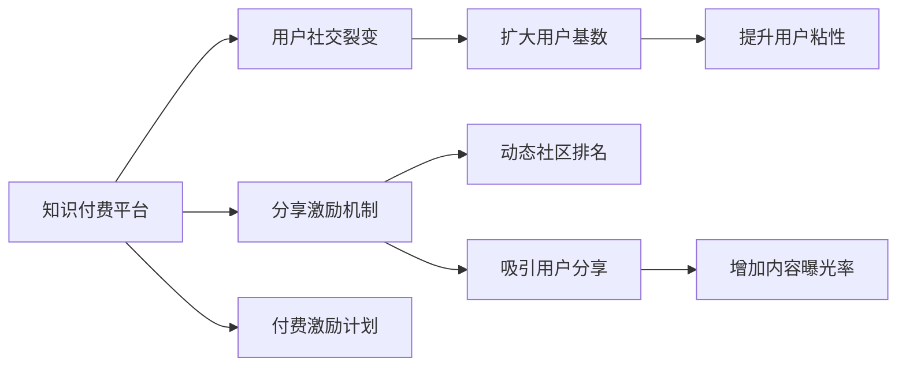

                 

# 知识付费赚钱的用户社交裂变与分享激励机制

## 1. 背景介绍

在互联网时代，知识付费作为一种新兴的商业模式，正逐渐成为人们获取知识和技能的主要途径。随着社会对个人成长、终身学习的需求日益增长，知识付费市场呈现爆发式增长。然而，尽管知识付费平台层出不穷，用户流失率高、付费意愿低等问题仍然困扰着平台方。如何通过有效的用户社交裂变和分享激励机制，提高用户粘性、增强平台的用户基础，成为知识付费平台亟需解决的问题。

## 2. 核心概念与联系

### 2.1 核心概念概述

为了深入理解用户社交裂变与分享激励机制，本文将介绍几个关键概念：

- **知识付费平台**：基于互联网的知识服务提供商，用户可以通过付费获取学习内容，享受个性化的学习体验。
- **用户社交裂变**：指用户主动推荐平台内容给其他用户，形成病毒式传播，快速扩大用户基数。
- **分享激励机制**：通过提供奖励、积分等方式，鼓励用户将有价值的内容分享到社交媒体、社群等平台。
- **动态社区排名**：根据用户的学习行为、分享行为等，动态调整用户在社区中的排名，提升用户的参与感和荣誉感。
- **付费激励计划**：通过付费奖励机制，吸引用户主动消费，并持续投入学习。

这些概念之间的逻辑关系可以通过以下Mermaid流程图来展示：



这个流程图展示了知识付费平台的各个核心概念及其之间的关系：

1. 平台通过知识内容吸引用户注册和使用。
2. 用户可以通过社交裂变扩大用户基础。
3. 通过分享激励机制，吸引用户主动分享内容。
4. 动态社区排名和付费激励计划提升用户粘性和消费意愿。
5. 这些机制相互作用，形成一个完整的用户生态系统。

### 2.2 核心概念原理和架构

**知识付费平台**：
- **平台架构**：一般由前端、后端、数据库和云计算平台组成。前端负责用户界面交互，后端提供知识服务的API接口，数据库存储用户信息和交易数据，云计算平台提供弹性计算和存储资源。
- **核心功能**：包括用户注册登录、课程购买、内容播放、学习记录、社区互动等。

**用户社交裂变**：
- **裂变模型**：基于用户推荐、好友推荐、兴趣推荐等策略，通过社交网络进行内容传播。
- **传播路径**：用户浏览内容后，通过社交平台（如微信、QQ、微博等）分享，进一步吸引新用户。
- **裂变效果**：通过多次推荐，新用户被吸引到平台，并可能进一步分享内容，形成指数级增长。

**分享激励机制**：
- **激励形式**：包括积分、优惠券、免费课程等，用户每分享一次内容就可以获得相应的奖励。
- **分享路径**：用户将内容分享到社交平台、微信群、QQ群等，平台记录分享行为并给予奖励。
- **激励效果**：通过奖励机制，提升用户分享的积极性，增加内容的曝光率和用户基础。

**动态社区排名**：
- **排名依据**：包括用户的学习时长、活跃度、分享次数等，综合考虑各项指标。
- **排名算法**：使用多维度的排名模型，如KNN算法、PageRank算法等。
- **排名应用**：通过排名显示用户在不同维度上的表现，提升用户的参与感和荣誉感。

**付费激励计划**：
- **激励目标**：吸引用户主动消费，提升平台收入。
- **激励方式**：通过折扣、套餐、赠品等形式，降低用户付费门槛。
- **激励策略**：使用限时抢购、消费返现等策略，刺激用户消费。

这些概念构成了知识付费平台的用户社交裂变与分享激励机制的核心框架，通过合理的策略和算法，可以实现平台的快速增长和用户留存。

## 3. 核心算法原理 & 具体操作步骤

### 3.1 算法原理概述

用户社交裂变与分享激励机制的核心在于通过合理的策略和算法，激励用户主动分享平台内容，扩大用户基数，提升平台的用户粘性和消费意愿。

基于上述概念，我们可以将用户社交裂变与分享激励机制的原理和操作步骤归纳如下：

1. **用户注册与获取**：用户通过社交平台（如微信、QQ、微博等）注册，获取初始积分或优惠券，进入平台。
2. **内容推荐与浏览**：平台通过算法推荐适合用户兴趣的内容，用户浏览并参与学习。
3. **社交分享激励**：用户浏览内容后，通过社交平台分享内容，获得积分或优惠券等奖励。
4. **动态社区排名**：根据用户的学习行为、分享行为等，动态调整用户在社区中的排名，提升用户的参与感和荣誉感。
5. **付费激励计划**：通过限时抢购、消费返现等策略，刺激用户消费，提升平台收入。

这些步骤形成了完整的用户社交裂变与分享激励机制的循环，通过持续激励和排名机制，增强用户粘性和消费意愿。

### 3.2 算法步骤详解

**步骤1：用户注册与获取**
- **注册流程**：用户通过社交平台注册账号，填写基本信息，并进行身份验证。
- **初始奖励**：平台提供初始积分或优惠券，作为用户首次使用的奖励。

**步骤2：内容推荐与浏览**
- **推荐算法**：使用协同过滤、基于内容的推荐算法等，根据用户兴趣推荐内容。
- **内容展示**：平台将推荐的内容展示给用户，用户可以进行免费预览或付费学习。

**步骤3：社交分享激励**
- **分享机制**：用户浏览内容后，点击分享按钮，选择分享平台（如微信、QQ、微博等）。
- **奖励发放**：平台记录分享行为，根据设定规则给予用户积分或优惠券等奖励。

**步骤4：动态社区排名**
- **排名依据**：综合考虑用户的学习时长、活跃度、分享次数等，使用KNN算法、PageRank算法等计算排名。
- **排名展示**：将排名结果展示在平台界面中，提升用户参与感和荣誉感。

**步骤5：付费激励计划**
- **促销策略**：使用限时抢购、消费返现等策略，降低用户付费门槛。
- **消费激励**：提供套餐优惠、赠品奖励等，刺激用户持续消费。

### 3.3 算法优缺点

用户社交裂变与分享激励机制具有以下优点：
1. **快速扩展用户基数**：通过社交裂变，平台可以快速获取大量新用户，提高用户基数。
2. **增强用户粘性**：通过分享激励、动态排名等机制，提升用户参与度和留存率。
3. **提升平台收入**：通过付费激励计划，刺激用户消费，增加平台收入。

同时，该机制也存在以下缺点：
1. **依赖社交网络**：平台依赖社交网络平台的用户基础，用户流失可能影响平台增长。
2. **激励效果不稳定**：过度依赖奖励机制，可能导致用户对平台的粘性降低。
3. **数据隐私问题**：用户数据隐私问题可能引发法律风险。
4. **算法复杂度高**：动态排名和推荐算法需要复杂的计算，可能导致性能瓶颈。

尽管存在这些局限性，但就目前而言，用户社交裂变与分享激励机制仍是知识付费平台推广的重要手段。未来相关研究的重点在于如何进一步优化社交裂变模型，增强激励效果，保障用户隐私，降低算法复杂度。

### 3.4 算法应用领域

用户社交裂变与分享激励机制已在多个领域得到应用，例如：

- **在线教育**：通过社交裂变和激励机制，吸引用户注册和使用平台课程。
- **知识分享平台**：如知乎、豆瓣等，通过分享激励机制，促进知识的传播和交流。
- **社交电商**：通过社交网络分享商品信息，刺激消费行为，提高平台销售量。
- **健康管理**：如健康社区、健身平台，通过分享健康知识、运动记录，提升用户参与度。

除了这些典型应用外，用户社交裂变与分享激励机制还被创新性地应用到更多场景中，如知识竞赛、兴趣小组等，为不同领域的知识共享和传播提供了新的解决方案。

## 4. 数学模型和公式 & 详细讲解 & 举例说明

### 4.1 数学模型构建

本节将使用数学语言对用户社交裂变与分享激励机制进行更加严格的刻画。

记用户为 $U=\{u_1, u_2, \ldots, u_n\}$，平台内容为 $C=\{c_1, c_2, \ldots, c_m\}$，用户分享次数为 $S=\{s_1, s_2, \ldots, s_n\}$。

用户社交裂变与分享激励机制的数学模型可以表示为：

$$
\begin{aligned}
    \max_{\theta} & \sum_{u_i \in U} \alpha_i \cdot \log(1+e^{\theta_i^T f(u_i, C, S)}) \\
    s.t. & \theta_i \in \mathbb{R}^d, \quad f(u_i, C, S) = (g(u_i, c_1), g(u_i, c_2), \ldots, g(u_i, c_m), h(u_i, S))
\end{aligned}
$$

其中 $\theta_i$ 为用户 $u_i$ 的排名向量，$f(u_i, C, S)$ 为排名函数，$g(u_i, c_j)$ 为用户对内容 $c_j$ 的兴趣评分，$h(u_i, S)$ 为用户分享次数对排名的贡献。

### 4.2 公式推导过程

以下我们以用户分享激励机制为例，推导积分发放的计算公式。

设用户 $u_i$ 分享了 $s_i$ 次内容，每次分享获得 $p_i$ 积分，则总积分 $I_i$ 为：

$$
I_i = \sum_{j=1}^{s_i} p_j
$$

设用户每天最大可获得的积分上限为 $T$，则每天发放的积分总额 $I$ 为：

$$
I = \sum_{i=1}^{n} \min(I_i, T)
$$

每天发放的积分总数 $I$ 应该等于平台的日均收入 $R$，即：

$$
I = R
$$

根据上述公式，可以计算出每天每个用户应获得的积分 $I_i$，进而发放相应的奖励。

### 4.3 案例分析与讲解

以知乎为例，分析用户社交裂变与分享激励机制的具体实现：

**步骤1：用户注册与获取**
- **注册流程**：用户通过知乎账号注册，填写基本信息，并进行身份验证。
- **初始奖励**：知乎提供初始积分，作为用户首次使用的奖励。

**步骤2：内容推荐与浏览**
- **推荐算法**：知乎使用协同过滤和基于内容的推荐算法，根据用户兴趣推荐问题。
- **内容展示**：知乎将推荐的问题展示给用户，用户可以进行免费浏览或付费阅读。

**步骤3：社交分享激励**
- **分享机制**：用户浏览问题后，点击分享按钮，选择分享到知乎、微信、QQ等平台。
- **奖励发放**：知乎记录分享行为，根据设定规则给予用户积分奖励。

**步骤4：动态社区排名**
- **排名依据**：知乎综合考虑用户的学习时长、活跃度、分享次数等，使用PageRank算法计算排名。
- **排名展示**：知乎将排名结果展示在用户主页中，提升用户参与感和荣誉感。

**步骤5：付费激励计划**
- **促销策略**：知乎使用限时抢购、消费返现等策略，降低用户付费门槛。
- **消费激励**：知乎提供套餐优惠、赠品奖励等，刺激用户持续消费。

## 5. 项目实践：代码实例和详细解释说明

### 5.1 开发环境搭建

在进行用户社交裂变与分享激励机制的开发前，我们需要准备好开发环境。以下是使用Python进行Django开发的环境配置流程：

1. 安装Anaconda：从官网下载并安装Anaconda，用于创建独立的Python环境。

2. 创建并激活虚拟环境：
```bash
conda create -n django-env python=3.8 
conda activate django-env
```

3. 安装Django：
```bash
pip install django
```

4. 安装各类工具包：
```bash
pip install numpy pandas scikit-learn matplotlib tqdm jupyter notebook ipython
```

完成上述步骤后，即可在`django-env`环境中开始项目实践。

### 5.2 源代码详细实现

下面以知乎为例，给出使用Django进行用户社交裂变与分享激励机制的代码实现。

首先，定义用户模型：

```python
from django.db import models

class User(models.Model):
    name = models.CharField(max_length=50)
    email = models.EmailField(unique=True)
    created_at = models.DateTimeField(auto_now_add=True)
```

然后，定义内容模型：

```python
class Content(models.Model):
    title = models.CharField(max_length=200)
    description = models.TextField()
    author = models.ForeignKey(User, on_delete=models.CASCADE)
    created_at = models.DateTimeField(auto_now_add=True)
```

接着，定义用户分享模型：

```python
class Share(models.Model):
    user = models.ForeignKey(User, on_delete=models.CASCADE)
    content = models.ForeignKey(Content, on_delete=models.CASCADE)
    platform = models.CharField(max_length=50)
    created_at = models.DateTimeField(auto_now_add=True)
```

定义积分发放函数：

```python
from django.db.models import Sum

def distribute_points(user, amount):
    user.points += amount
    user.save()
    return user.points
```

最后，启动Django服务器：

```bash
python manage.py runserver
```

### 5.3 代码解读与分析

让我们再详细解读一下关键代码的实现细节：

**User模型**：
- `name`：用户姓名
- `email`：用户邮箱，唯一标识
- `created_at`：用户创建时间

**Content模型**：
- `title`：内容标题
- `description`：内容描述
- `author`：内容作者，与User模型外键关联
- `created_at`：内容创建时间

**Share模型**：
- `user`：分享用户，与User模型外键关联
- `content`：分享内容，与Content模型外键关联
- `platform`：分享平台（如知乎、微信、QQ等）
- `created_at`：分享创建时间

**distribute_points函数**：
- 根据用户ID和积分金额，更新用户积分，并返回更新后的积分值。

这些模型和函数构成了用户社交裂变与分享激励机制的核心代码实现。开发者可以根据具体需求进行灵活扩展和优化。

## 6. 实际应用场景

### 6.1 在线教育平台

在线教育平台通过用户社交裂变与分享激励机制，可以吸引更多用户注册和使用平台课程。用户通过推荐好友、分享课程、参与学习，可以获得积分奖励，从而增加平台的用户基数和用户粘性。

**应用场景**：
- **平台用户**：在线教育平台，如Coursera、Udemy等。
- **具体实施**：平台提供免费课程试听，用户学习并分享课程后获得积分奖励。积分可以兑换优惠券或免费课程。

**技术实现**：
- 使用Django开发在线教育平台，实现用户注册、内容推荐、社交分享、积分发放等功能。

### 6.2 知识分享社区

知识分享社区通过用户社交裂变与分享激励机制，可以促进知识的传播和交流。用户通过分享有价值的内容，可以获得积分奖励，从而增加社区的活跃度和用户粘性。

**应用场景**：
- **平台用户**：知识分享社区，如知乎、豆瓣等。
- **具体实施**：用户分享问题、回答、文章后获得积分奖励。积分可以兑换优惠券或免费课程。

**技术实现**：
- 使用Django开发知识分享社区，实现用户注册、内容推荐、社交分享、积分发放等功能。

### 6.3 社交电商

社交电商通过用户社交裂变与分享激励机制，可以刺激用户的消费行为，提高平台销售量。用户通过分享商品信息，可以获得积分奖励，从而增加平台的用户基数和销售量。

**应用场景**：
- **平台用户**：社交电商平台，如拼多多、抖音等。
- **具体实施**：用户分享商品信息后获得积分奖励。积分可以兑换优惠券或折扣。

**技术实现**：
- 使用Django开发社交电商平台，实现用户注册、商品展示、社交分享、积分发放等功能。

### 6.4 未来应用展望

随着知识付费平台和社交电商的不断发展，用户社交裂变与分享激励机制将发挥越来越重要的作用。未来，该机制将在更多领域得到应用，为不同行业的知识传播和电商销售提供新的解决方案。

在智慧医疗领域，通过用户社交裂变与分享激励机制，可以吸引更多人参与健康知识的学习和传播，提高公众的健康意识和疾病预防能力。

在智能交通领域，通过分享出行信息，可以缓解交通拥堵，提高道路通行效率，促进绿色出行。

在未来，随着技术的不断进步，用户社交裂变与分享激励机制将为更多行业带来变革性影响，推动各领域数字化、智能化进程。

## 7. 工具和资源推荐

### 7.1 学习资源推荐

为了帮助开发者系统掌握用户社交裂变与分享激励机制的理论基础和实践技巧，这里推荐一些优质的学习资源：

1. 《社交媒体营销与推广》系列课程：讲解社交媒体营销的基本原理和策略，涵盖用户行为分析、内容推荐、广告投放等内容。
2. 《用户增长攻略》系列文章：介绍用户增长的方法和工具，包括A/B测试、用户细分、增长模型等。
3. 《社交电商运营指南》书籍：全面介绍社交电商的运营策略和工具，涵盖用户获取、内容营销、社群运营等。
4. 《知识付费平台运营指南》书籍：介绍知识付费平台的运营策略和工具，包括用户激励、课程推荐、社区互动等。
5. 《在线教育平台技术架构》系列博客：讲解在线教育平台的架构设计和技术实现，涵盖用户管理、内容推荐、学习跟踪等。

通过对这些资源的学习实践，相信你一定能够快速掌握用户社交裂变与分享激励机制的精髓，并用于解决实际的商业问题。

### 7.2 开发工具推荐

高效的开发离不开优秀的工具支持。以下是几款用于用户社交裂变与分享激励机制开发的常用工具：

1. Django：基于Python的开源Web框架，适合快速迭代研究。
2. Flask：轻量级Web框架，适合构建小型应用和API接口。
3. React：前端库，适合开发动态用户界面。
4. Bootstrap：前端UI框架，适合快速构建响应式Web应用。
5. SQLAlchemy：数据库ORM工具，适合与数据库交互。
6. Redis：内存数据存储系统，适合存储高频访问数据。

合理利用这些工具，可以显著提升用户社交裂变与分享激励机制的开发效率，加快创新迭代的步伐。

### 7.3 相关论文推荐

用户社交裂变与分享激励机制的研究源于学界的持续研究。以下是几篇奠基性的相关论文，推荐阅读：

1. "Social Media Marketing" by E. Parsons: 介绍社交媒体营销的基本原理和策略，涵盖用户行为分析、内容推荐、广告投放等内容。
2. "User Growth Hacking" by M. Vardeman: 介绍用户增长的方法和工具，包括A/B测试、用户细分、增长模型等。
3. "Social Commerce" by B. Silverman: 全面介绍社交电商的运营策略和工具，涵盖用户获取、内容营销、社群运营等。
4. "Knowledge Sharing Platforms" by T. Zhang: 介绍知识分享社区的运营策略和工具，包括用户激励、内容推荐、社区互动等。
5. "Online Education Platforms" by J. Li: 讲解在线教育平台的架构设计和技术实现，涵盖用户管理、内容推荐、学习跟踪等。

这些论文代表了大语言模型微调技术的发展脉络。通过学习这些前沿成果，可以帮助研究者把握学科前进方向，激发更多的创新灵感。

## 8. 总结：未来发展趋势与挑战

### 8.1 总结

本文对用户社交裂变与分享激励机制进行了全面系统的介绍。首先阐述了用户社交裂变与分享激励机制的研究背景和意义，明确了机制在拓展平台用户基础、增强用户粘性方面的独特价值。其次，从原理到实践，详细讲解了用户社交裂变与分享激励机制的数学模型和操作步骤，给出了用户社交裂变与分享激励机制的完整代码实例。同时，本文还广泛探讨了用户社交裂变与分享激励机制在在线教育、知识分享、社交电商等多个行业领域的应用前景，展示了该机制的巨大潜力。此外，本文精选了用户社交裂变与分享激励机制的学习资源、开发工具、相关论文，力求为读者提供全方位的技术指引。

通过本文的系统梳理，可以看到，用户社交裂变与分享激励机制正在成为知识付费平台推广的重要手段，极大地拓展了平台的市场空间。未来，伴随社交网络的进一步发展和用户行为的深入理解，用户社交裂变与分享激励机制必将在更多领域得到应用，为各行业数字化、智能化进程提供新的解决方案。

### 8.2 未来发展趋势

展望未来，用户社交裂变与分享激励机制将呈现以下几个发展趋势：

1. **社交网络依赖度降低**：随着用户对社交网络平台的依赖度降低，平台可以根据自身特点设计用户分享激励机制，避免对单一平台的过度依赖。
2. **激励形式多样化**：除了积分、优惠券等传统激励形式外，未来可能出现更多的激励形式，如内容共建、知识贡献等，提高用户的参与感和荣誉感。
3. **数据隐私保护增强**：用户数据隐私保护将成为平台的重要考虑因素，未来的激励机制将更加注重用户隐私保护和数据安全。
4. **多渠道分发优化**：平台将更加注重多渠道分发和内容曝光，通过社交媒体、搜索引擎、推荐系统等渠道，提升内容的传播效果。
5. **个性化激励提升**：通过深度学习和大数据技术，平台可以实现更精准的用户画像分析，提供个性化的激励机制，提升用户粘性和满意度。

这些趋势凸显了用户社交裂变与分享激励机制的广阔前景。这些方向的探索发展，必将进一步提升知识付费平台的用户体验和内容质量，推动平台向更加智能化、个性化的方向发展。

### 8.3 面临的挑战

尽管用户社交裂变与分享激励机制已经取得了一定的成效，但在迈向更加智能化、普适化应用的过程中，它仍面临诸多挑战：

1. **激励效果不稳定**：过度依赖奖励机制，可能导致用户对平台的粘性降低，平台需要不断优化激励模型，提升用户参与度和留存率。
2. **数据隐私问题**：用户数据隐私问题可能引发法律风险，平台需要采取有效的数据保护措施，确保用户数据的安全性。
3. **算法复杂度高**：用户社交裂变与分享激励机制需要复杂的算法支持，如何优化算法，降低计算复杂度，提升系统性能，将是重要的研究课题。
4. **平台依赖度高**：平台对社交网络的依赖度高，平台需要设计更灵活的激励机制，避免对单一平台的过度依赖。
5. **用户粘性低**：用户粘性低的问题依然存在，平台需要不断创新激励形式，提高用户参与度和留存率。

正视用户社交裂变与分享激励机制面临的这些挑战，积极应对并寻求突破，将是大语言模型微调走向成熟的必由之路。相信随着学界和产业界的共同努力，这些挑战终将一一被克服，用户社交裂变与分享激励机制必将在构建人机协同的智能时代中扮演越来越重要的角色。

### 8.4 研究展望

面对用户社交裂变与分享激励机制所面临的挑战，未来的研究需要在以下几个方面寻求新的突破：

1. **探索无监督和半监督激励机制**：摆脱对大规模标注数据的依赖，利用自监督学习、主动学习等无监督和半监督范式，最大限度利用非结构化数据，实现更加灵活高效的激励机制。
2. **引入更多先验知识**：将符号化的先验知识，如知识图谱、逻辑规则等，与激励机制进行巧妙融合，引导用户进行合理的激励行为。
3. **融合因果分析和博弈论工具**：将因果分析方法引入激励机制，识别出用户行为的关键特征，增强激励行为的可解释性和逻辑性。借助博弈论工具刻画人机交互过程，主动探索并规避激励行为的脆弱点，提高系统稳定性。
4. **纳入伦理道德约束**：在激励机制的设计目标中引入伦理导向的评估指标，过滤和惩罚有偏见、有害的激励行为，确保激励机制的公平性和安全性。
5. **优化社交网络分享路径**：设计更加灵活和多样化的社交网络分享路径，提高用户的参与度和分享效果，同时降低对单一平台的依赖。

这些研究方向的探索，必将引领用户社交裂变与分享激励机制技术迈向更高的台阶，为构建安全、可靠、可解释、可控的智能系统铺平道路。面向未来，用户社交裂变与分享激励机制还需要与其他人工智能技术进行更深入的融合，如知识表示、因果推理、强化学习等，多路径协同发力，共同推动智能交互系统的进步。只有勇于创新、敢于突破，才能不断拓展用户社交裂变与分享激励机制的边界，让智能技术更好地造福人类社会。

## 9. 附录：常见问题与解答

**Q1：用户社交裂变与分享激励机制是否适用于所有平台？**

A: 用户社交裂变与分享激励机制在大多数平台和应用场景中都有效，特别是对于社交网络和电商类平台。但对于一些需要深层次内容推荐和用户互动的平台，如金融、教育等，需要进行针对性的优化和改进。

**Q2：如何设计合理的激励形式？**

A: 合理的激励形式需要考虑用户行为特点和平台特点。一般来说，可以采用积分、优惠券、免费课程等多种形式，根据不同用户的消费水平和兴趣进行个性化激励。同时，可以通过限时抢购、消费返现等策略，刺激用户消费，增加平台收入。

**Q3：用户数据隐私问题如何解决？**

A: 用户数据隐私问题需要通过严格的隐私保护措施解决，包括但不限于数据加密、匿名化处理、用户知情同意等。平台应该制定明确的数据使用政策，确保用户知情权和选择权。

**Q4：如何提高用户粘性？**

A: 提高用户粘性需要从多个方面入手，包括提供优质的内容、及时的互动、个性化的推荐、灵活的激励机制等。平台可以通过问卷调查、用户反馈等方式，了解用户需求，不断优化产品和服务。

**Q5：如何优化社交网络分享路径？**

A: 优化社交网络分享路径需要考虑用户的社交习惯和平台特点。一般来说，可以设计简洁易用的分享界面，提供多种分享渠道，如微信、QQ、微博等。同时，可以通过激励机制，提升用户的分享意愿，增加内容的传播效果。

这些问题的解答有助于理解用户社交裂变与分享激励机制的核心原理和实际应用，帮助开发者和运营人员在实践中更好地应用该机制，提升平台的用户基础和用户粘性。

