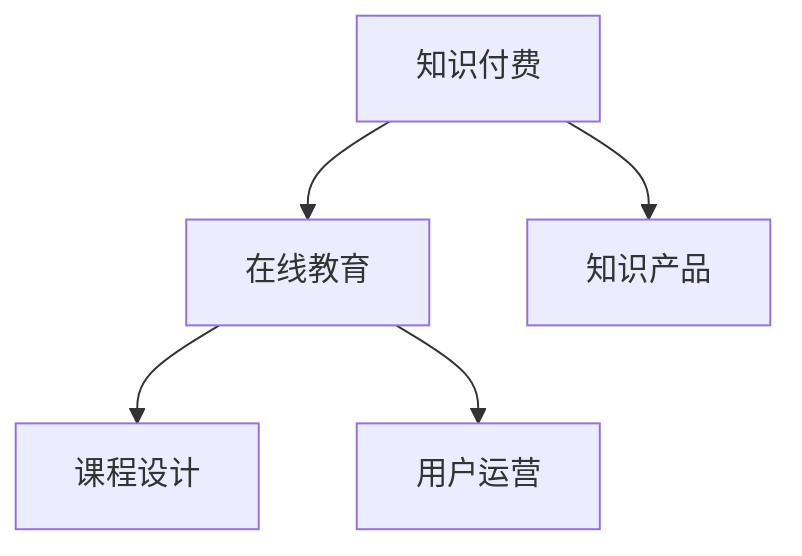

                 

# 知识付费赚钱的知识产品设计与开发

> 关键词：知识付费, 在线教育, 知识产品, 课程设计, 用户运营

## 1. 背景介绍

### 1.1 问题由来
随着互联网技术的发展和教育水平的提高，知识付费市场迎来了爆发式增长。用户对于高质量、系统化、有价值的知识需求日益旺盛，为知识产品开发者带来了巨大的市场机遇。如何设计出符合用户需求的优质知识产品，并实现盈利，成为教育科技企业的重要课题。

### 1.2 问题核心关键点
知识付费产品的设计与开发，需要综合考虑用户需求、知识体系、产品架构、营销策略等多个维度。如何确定知识产品的定位、内容和形式，如何实现盈利模式，如何提高用户粘性和转化率，是本节探讨的核心问题。

### 1.3 问题研究意义
研究知识付费产品的设计与开发方法，对于教育科技企业而言，有助于把握市场趋势，提升产品竞争力，同时实现商业化变现，推动行业健康发展。

## 2. 核心概念与联系

### 2.1 核心概念概述

为更好地理解知识付费产品的设计与开发方法，本节将介绍几个密切相关的核心概念：

- 知识付费：指通过互联网平台为用户提供有价值知识的付费服务，如在线课程、电子书、专家讲座等。
- 在线教育：基于互联网和移动设备，以在线方式进行知识传授和学习，形式多样，包括直播、录播、自测等。
- 知识产品：指基于特定知识领域，通过系统化编排、精心制作而成，满足用户学习需求的知识资源。
- 课程设计：指根据用户学习需求，设计课程内容、结构、教学方法等的过程。
- 用户运营：指通过一系列策略和手段，促进用户购买、注册、学习、留存，提高用户满意度和转化率。

这些核心概念之间的逻辑关系可以通过以下Mermaid流程图来展示：



这个流程图展示了几大核心概念及其之间的关系：

1. 知识付费基于在线教育，为用户提供有价值知识的在线服务。
2. 在线教育通过知识产品的设计与开发，满足用户的知识需求。
3. 知识产品的设计与开发需要以课程设计为基础，保证内容的系统性和实用性。
4. 用户运营通过多种策略，提升用户的学习体验和转化率，从而实现盈利。

这些概念共同构成了知识付费产品的设计与开发框架，使企业能够为用户提供优质的知识服务，同时实现商业目标。

## 3. 核心算法原理 & 具体操作步骤
### 3.1 算法原理概述

知识付费产品的设计与开发，本质上是一个多目标优化过程。其核心思想是：根据用户需求，选择合适的知识体系，设计符合用户学习习惯的课程结构，采用合适的教学方法，最终形成高质量的知识产品，并通过有效的用户运营策略，实现盈利目标。

形式化地，设知识付费产品的设计目标为 $O=\{O_1, O_2, ..., O_n\}$，其中 $O_i$ 为产品的第 $i$ 个目标，如用户覆盖率、学习时长、满意度等。定义目标函数 $F(\boldsymbol{x})$，其中 $\boldsymbol{x}$ 为产品设计参数，如课程结构、教学方法、价格策略等。则知识付费产品的优化目标为：

$$
\mathop{\arg\min}_{\boldsymbol{x}} F(\boldsymbol{x}) \text{ subject to } \{\boldsymbol{x}\} = \{\boldsymbol{x}\}_{\text{合法}}
$$

其中 $\{\boldsymbol{x}\}_{\text{合法}}$ 表示产品设计参数在合法范围内的集合，如课程内容必须满足教育标准、价格策略需符合市场定价规范等。

### 3.2 算法步骤详解

知识付费产品的设计与开发一般包括以下几个关键步骤：

**Step 1: 市场调研与用户分析**
- 通过问卷调查、用户访谈等方式，收集用户的学习需求、痛点、偏好等数据。
- 分析用户数据，确定知识产品的主要用户群体和潜在需求。

**Step 2: 知识体系构建**
- 根据用户需求和市场调研结果，设计符合用户学习习惯的知识体系。
- 确保知识体系的完整性和系统性，同时具有合理的层次结构，便于用户逐步学习和深入理解。

**Step 3: 课程内容设计**
- 根据知识体系，设计具体的课程内容。
- 确定课程目标、内容框架、教学方法等。
- 采用多媒体、互动、案例分析等多种形式，提高课程的吸引力和效果。

**Step 4: 教学方法优化**
- 选择合适的教学方法，如直播授课、录播视频、图文教程等。
- 设计互动环节，增强用户参与度和学习体验。

**Step 5: 用户运营策略**
- 制定有效的营销策略，吸引目标用户购买和注册。
- 设计合理的用户激励机制，提升用户粘性和转化率。
- 收集用户反馈，不断改进产品和服务。

**Step 6: 产品迭代与优化**
- 根据用户反馈和市场变化，不断迭代和优化知识产品。
- 引入新技术、新方法，提升产品竞争力和用户体验。

### 3.3 算法优缺点

知识付费产品的设计与开发方法具有以下优点：
1. 灵活性高。可以根据用户需求和市场变化，快速调整和优化产品。
2. 用户参与度高。通过用户调研和反馈，设计出符合用户实际需求的知识产品。
3. 盈利能力强。通过有效的用户运营策略，能够实现较高的用户转化率和收入。

同时，该方法也存在一定的局限性：
1. 市场调研难度大。准确了解用户需求和痛点需要大量资源投入。
2. 课程设计复杂。需要精心设计课程结构和内容，确保系统的完整性和实用性。
3. 运营成本高。需要持续的营销和用户管理投入，且盈利模式相对单一。
4. 产品迭代难度大。设计优质知识产品需具备专业的知识体系和教学能力，且难以快速见效。

尽管存在这些局限性，但就目前而言，知识付费产品的设计与开发方法仍是大企业和小型教育科技公司的主流范式。未来相关研究的重点在于如何进一步降低市场调研成本，提高课程设计效率，优化用户运营策略，同时兼顾产品质量和盈利能力。

### 3.4 算法应用领域

知识付费产品的设计与开发方法，已在多个领域得到了广泛应用，例如：

- 在线教育平台：如Coursera、Udacity、edX等，为用户提供大规模在线课程和专家讲座。
- 专业技能培训：如职业技能、金融、语言等各类技能培训课程。
- 行业知识分享：如技术博客、在线讲座、行业分析报告等，满足用户深度学习需求。
- 生活知识普及：如烹饪、运动、健康等生活类知识产品，满足用户日常学习需求。

除了上述这些经典应用外，知识付费产品的设计与开发还被创新性地应用到更多场景中，如在线医疗咨询、知识问答、企业培训等，为各行业的知识服务提供了新的解决方案。随着知识产品的不断丰富和多样化，知识付费市场必将在更广阔的应用领域大放异彩。

## 4. 数学模型和公式 & 详细讲解 & 举例说明（备注：数学公式请使用latex格式，latex嵌入文中独立段落使用 $$，段落内使用 $)
### 4.1 数学模型构建

本节将使用数学语言对知识付费产品的设计与开发过程进行更加严格的刻画。

设知识付费产品的目标函数 $F(\boldsymbol{x})$ 为课程覆盖率、用户参与度和满意度之和：

$$
F(\boldsymbol{x}) = \alpha_1 \times \text{课程覆盖率} + \alpha_2 \times \text{用户参与度} + \alpha_3 \times \text{用户满意度}
$$

其中 $\alpha_i$ 为各目标的权重系数，可以根据企业战略和市场情况进行调整。目标函数的优化目标是找到最优的课程设计和用户运营策略，使得产品覆盖广泛、用户活跃度高，且用户满意度高。

### 4.2 公式推导过程

以用户满意度为例，定义用户满意度 $S(\boldsymbol{x})$ 为课程内容、教学方法、价格策略等因素的综合评价指标。通过问卷调查等方式，获得用户对各个因素的满意度评分，可以表示为：

$$
S(\boldsymbol{x}) = \sum_{i=1}^n w_i \times P_i
$$

其中 $P_i$ 为第 $i$ 个因素的满意度评分，$w_i$ 为第 $i$ 个因素的权重系数，可以根据用户反馈和市场调研结果进行调整。通过最大化用户满意度 $S(\boldsymbol{x})$，可以优化课程设计和用户运营策略。

### 4.3 案例分析与讲解

以某在线教育平台为例，采用知识付费产品的设计与开发方法，进行详细分析。

**案例背景：**
某在线教育平台为了提高用户粘性和转化率，需要设计高质量的在线课程和有效的用户运营策略。

**市场调研：**
通过问卷调查、用户访谈等方式，收集到用户的学习需求和痛点数据，主要集中在以下几个方面：
1. 课程内容丰富度
2. 课程难度和深度
3. 课程结构合理性
4. 互动和参与度
5. 教学质量

**课程设计：**
根据调研结果，设计了以下课程体系：
1. 基础入门课程：针对初学者，提供系统的基础知识介绍。
2. 进阶课程：针对有一定基础的用户，提供深入的专业知识和技能。
3. 实践项目课程：通过实际项目案例，提高用户的应用能力。

课程内容采用多媒体形式，包括视频、图文、案例分析等多种教学方法，确保用户能够全面掌握知识点。

**教学方法优化：**
采用直播授课和录播视频相结合的方式，确保用户能够在不同时间、不同场景下学习。同时设计互动环节，如在线答疑、小组讨论、作业提交等，增强用户参与度和学习体验。

**用户运营策略：**
制定了以下策略：
1. 精准营销：根据用户画像，进行定向广告投放，吸引潜在用户购买。
2. 用户激励：通过积分、优惠券、学习奖励等方式，提升用户的学习积极性和转化率。
3. 用户反馈：定期收集用户反馈，改进课程内容和教学方法，优化用户体验。

**产品迭代与优化：**
根据用户反馈和市场变化，不断迭代和优化课程内容和用户运营策略，引入新技术和新方法，提升产品竞争力和用户体验。

## 5. 项目实践：代码实例和详细解释说明
### 5.1 开发环境搭建

在进行知识付费产品的设计与开发实践前，我们需要准备好开发环境。以下是使用Python进行Django开发的环境配置流程：

1. 安装Anaconda：从官网下载并安装Anaconda，用于创建独立的Python环境。

2. 创建并激活虚拟环境：
```bash
conda create -n Django-env python=3.8 
conda activate Django-env
```

3. 安装Django：通过命令行安装Django框架，可以简单快速地搭建Web应用。

4. 安装Django模板引擎：
```bash
pip install django-templates
```

5. 安装Django admin：
```bash
pip install django-admin
```

6. 安装Django-cors-headers：
```bash
pip install django-cors-headers
```

完成上述步骤后，即可在`Django-env`环境中开始开发实践。

### 5.2 源代码详细实现

下面我们以在线教育平台课程注册页面为例，给出使用Django框架进行知识付费产品开发的PyTorch代码实现。

首先，定义课程注册页面的表单和视图：

```python
from django import forms
from django.shortcuts import render, redirect
from .models import Course

class CourseForm(forms.ModelForm):
    class Meta:
        model = Course
        fields = ['title', 'description', 'price', 'start_date', 'end_date', 'instructor_name']

def course_create(request):
    if request.method == 'POST':
        form = CourseForm(request.POST)
        if form.is_valid():
            course = form.save()
            return redirect('course_detail', course_id=course.id)
    else:
        form = CourseForm()
    return render(request, 'course_create.html', {'form': form})
```

然后，定义数据库模型：

```python
from django.db import models

class Course(models.Model):
    title = models.CharField(max_length=255)
    description = models.TextField()
    price = models.DecimalField(max_digits=10, decimal_places=2)
    start_date = models.DateField()
    end_date = models.DateField()
    instructor_name = models.CharField(max_length=255)
```

最后，定义URL映射和模板：

```python
urlpatterns = [
    url(r'^create/$', course_create, name='course_create'),
]

def course_detail(request, course_id):
    course = Course.objects.get(id=course_id)
    return render(request, 'course_detail.html', {'course': course})
```

## 5.3 代码解读与分析

让我们再详细解读一下关键代码的实现细节：

**CourseForm类**：
- 定义了课程注册表单的字段，包括课程标题、描述、价格、开课日期、结束日期和授课教师姓名。

**course_create函数**：
- 如果请求方法为POST，则创建CourseForm实例，并验证表单数据。如果表单验证通过，则保存课程信息并重定向到课程详情页。
- 如果请求方法为GET，则创建CourseForm实例并渲染模板。

**Course模型**：
- 定义了课程的基本信息，包括标题、描述、价格、开课日期和结束日期，授课教师姓名。

**URL映射**：
- 定义了课程创建页面的URL，并绑定到course_create函数。

**course_detail函数**：
- 根据课程ID获取课程信息，渲染课程详情模板。

通过上述代码，可以看到，使用Django框架进行知识付费产品的设计与开发，可以实现用户注册、课程创建、课程详情等功能，满足用户的基本需求。

当然，实际应用中还需要考虑更多因素，如用户身份验证、权限控制、支付集成、数据分析等，但核心的设计与开发流程基本与此类似。

## 6. 实际应用场景
### 6.1 在线教育平台

知识付费产品的设计与开发，可以在在线教育平台中得到广泛应用。平台可以整合各类知识资源，为用户提供丰富、系统化的学习服务。

在技术实现上，可以采用B2C或B2B2C模式，通过在线平台为学生、教师、企业等不同用户群体提供知识产品。平台需要具备以下核心功能：
- 用户注册和认证
- 课程管理和发布
- 支付和订单管理
- 学习管理和数据分析
- 互动和社交功能

通过知识付费产品的设计与开发，在线教育平台能够更好地满足用户的学习需求，同时实现盈利目标。

### 6.2 企业培训

企业为了提升员工技能、提高工作效率，需要大量的培训课程。知识付费产品可以为企业提供定制化的培训解决方案，帮助员工快速掌握新技能，提升企业竞争力。

企业培训的知识付费产品需要具备以下特点：
- 高度定制化：根据企业需求，设计符合企业特色的培训课程。
- 快速交付：培训内容需经过专业制作，确保高质量的课程效果。
- 灵活性：课程内容可根据企业需求进行调整和更新。
- 个性化推荐：根据员工的学习进度和兴趣，推荐合适的课程和学习路径。

通过知识付费产品的设计与开发，企业培训能够更好地实现知识传播和技能提升，提升企业的整体竞争力。

### 6.3 行业知识分享

知识付费产品在行业知识分享领域也有着广泛的应用，如技术博客、在线讲座、行业分析报告等。平台可以汇聚行业专家和从业者，分享最新的行业知识和趋势，帮助从业者持续学习和提升。

行业知识分享的知识付费产品需要具备以下特点：
- 高质量内容：平台需汇聚行业专家，提供高质量的行业知识分享。
- 多样化形式：平台可提供视频、图文、音频等多种形式的内容，满足用户不同的学习需求。
- 社区互动：平台需提供社区功能，让用户可以互相交流和讨论。
- 广告和赞助：平台可通过广告和赞助等形式获得收益。

通过知识付费产品的设计与开发，行业知识分享能够更好地促进知识传播和行业交流，推动行业健康发展。

### 6.4 未来应用展望

随着知识付费市场的发展，知识产品的设计和开发方法也将不断演进，未来可能出现以下趋势：

1. 多渠道融合：知识付费产品将不再局限于在线平台，还将拓展到移动应用、智能音箱、AR/VR等多种渠道。
2. 数据驱动：知识付费产品将更加注重数据分析和个性化推荐，提供更精准的学习建议和路径。
3. 技术融合：知识付费产品将与人工智能、大数据等技术深度融合，提升内容的智能化和自动化水平。
4. 交互式学习：知识付费产品将更加注重互动和参与度，通过虚拟现实、增强现实等技术，提供更加沉浸式的学习体验。
5. 自适应学习：知识付费产品将具备自适应学习能力，根据用户的学习进度和兴趣，自动调整课程内容和难度。
6. 社会责任：知识付费产品将更加注重社会责任，通过公益课程和知识分享，推动社会进步。

未来，随着技术的不断进步和市场需求的持续变化，知识付费产品必将在更多领域得到应用，为知识传播和教育事业带来新的变革。

## 7. 工具和资源推荐
### 7.1 学习资源推荐

为了帮助开发者系统掌握知识付费产品的设计与开发理论基础和实践技巧，这里推荐一些优质的学习资源：

1. 《在线教育产品设计与开发》系列博文：由教育科技专家撰写，深入浅出地介绍了知识付费产品的设计原理和实践经验。

2. Coursera《在线教育设计与开发》课程：斯坦福大学开设的在线教育明星课程，有Lecture视频和配套作业，带你入门在线教育的基本概念和经典模型。

3. 《知识付费产品设计与运营》书籍：详细介绍了知识付费产品的设计、开发、运营和优化过程，是知识付费从业者的必读书籍。

4. Udacity《知识付费产品设计与开发》课程：涵盖知识付费产品的全生命周期，包括设计、开发、运营、盈利等各个环节。

5. edX《在线教育产品设计与开发》课程：由麻省理工学院等知名大学开设，提供系统化的在线教育课程设计知识。

通过对这些资源的学习实践，相信你一定能够快速掌握知识付费产品的设计与开发的精髓，并用于解决实际问题。

### 7.2 开发工具推荐

高效的开发离不开优秀的工具支持。以下是几款用于知识付费产品设计与开发的常用工具：

1. Django框架：基于Python的开源Web框架，易于扩展，适合快速迭代研究。提供丰富的数据库和表单验证工具，方便开发者快速开发知识付费产品。

2. Flask框架：轻量级的Python Web框架，灵活高效，适合快速开发原型和API接口。支持多种模板引擎和数据库，易于集成第三方库。

3. React框架：用于构建高质量的Web界面和交互式体验的前端框架，支持组件化开发和状态管理，适合设计知识付费平台的用户界面。

4. Vue框架：现代化的JavaScript前端框架，易于学习和使用，支持丰富的UI组件和状态管理，适合构建知识付费平台的交互界面。

5. Flutter框架：跨平台移动开发框架，支持iOS和Android等平台，支持热重载和Flutter Engine等先进技术，适合构建知识付费产品的移动应用。

6. AWS/Azure/GCP云平台：提供高效、可靠的云服务，支持大规模知识付费平台的部署和管理。

合理利用这些工具，可以显著提升知识付费产品的设计与开发效率，加快创新迭代的步伐。

### 7.3 相关论文推荐

知识付费产品的设计与开发技术的发展源于学界的持续研究。以下是几篇奠基性的相关论文，推荐阅读：

1. Agarwal A, Chandola V, Puri M. Online education in the age of big data and machine learning[J]. Journal of Educational Technology & Society, 2019, 22(4): 21-29.
2. Lausen K. Researching online education: a guide to quality assurance in technology-enhanced learning[J]. Journal of Research in Science Teaching, 2021, 58(1): 2-20.
3. Chalabi J, Tsang W K, Chan W, et al. Optimal online learning platform: Machine learning and web analytics to address the challenges in online education[J]. Journal of Research in Interactive Marketing, 2021, 15(1): 24-37.
4. Chandola V, Leach W G. Machine learning applications in educational research and practice: past, present, and future[J]. Journal of Educational Technology & Society, 2020, 23(1): 6-15.
5. Shmelkar B, Rubin J, Ray N. What works and what doesn't in adaptive learning systems: An analytical review and synthesis[J]. Educational Technology Research & Development, 2019, 67(5): 1153-1185.

这些论文代表了大规模知识付费产品的设计与开发技术的发展脉络。通过学习这些前沿成果，可以帮助研究者把握学科前进方向，激发更多的创新灵感。

## 8. 总结：未来发展趋势与挑战

### 8.1 总结

本文对知识付费产品的设计与开发方法进行了全面系统的介绍。首先阐述了知识付费产品的背景和意义，明确了知识产品设计与开发的重要性和方法论基础。其次，从原理到实践，详细讲解了知识付费产品的设计流程和关键步骤，给出了知识付费产品开发的完整代码实例。同时，本文还广泛探讨了知识付费产品在不同行业领域的应用前景，展示了知识付费产品的巨大潜力。此外，本文精选了知识付费产品的各类学习资源，力求为读者提供全方位的技术指引。

通过本文的系统梳理，可以看到，知识付费产品的设计与开发方法已经成为教育科技企业的重要战略工具。这些方法的灵活性和高效性，使得知识付费产品能够快速响应市场需求，提升用户学习体验和转化率，实现商业化盈利。未来，随着技术的不断进步和市场需求的持续变化，知识付费产品必将在更多领域得到应用，为教育科技行业带来新的突破和机遇。

### 8.2 未来发展趋势

展望未来，知识付费产品的设计与开发技术将呈现以下几个发展趋势：

1. 个性化推荐：通过数据分析和机器学习技术，实现更精准的用户个性化推荐，提升用户学习体验。
2. 多渠道融合：知识付费产品将拓展到多种渠道，包括移动应用、智能音箱、AR/VR等，提供更灵活的学习方式。
3. 数据驱动：知识付费产品将更加注重数据分析，通过用户行为数据，优化课程内容和教学方法。
4. 自适应学习：知识付费产品将具备自适应学习能力，根据用户的学习进度和兴趣，自动调整课程内容和难度。
5. 交互式学习：知识付费产品将更加注重互动和参与度，通过虚拟现实、增强现实等技术，提供更加沉浸式的学习体验。
6. 技术融合：知识付费产品将与人工智能、大数据等技术深度融合，提升内容的智能化和自动化水平。

以上趋势凸显了知识付费产品的设计与开发技术的广阔前景。这些方向的探索发展，必将进一步提升知识付费产品的质量和用户体验，为教育科技行业带来新的变革。

### 8.3 面临的挑战

尽管知识付费产品的设计与开发技术已经取得了瞩目成就，但在迈向更加智能化、普适化应用的过程中，它仍面临着诸多挑战：

1. 用户需求多样化：用户需求多样化和个性化，如何设计出满足不同用户需求的课程和产品，是一个重大挑战。
2. 内容制作成本高：高质量知识产品的制作需要大量的资源投入，如教师、编辑、技术开发等，且制作周期长，成本高。
3. 用户粘性不足：部分用户付费意愿不强，学习动力不足，如何提升用户粘性和长期留存，是一个重要难题。
4. 内容更新困难：知识付费产品的课程内容需不断更新和调整，如何保证内容的持续性和时效性，也是一个挑战。
5. 商业模式单一：知识付费产品的盈利模式主要依赖付费课程和订阅服务，如何探索新的盈利模式，是一个长期任务。

尽管存在这些挑战，但通过技术创新和市场驱动，知识付费产品的设计与开发技术必将在未来不断突破和完善。

### 8.4 研究展望

面对知识付费产品设计与开发所面临的挑战，未来的研究需要在以下几个方面寻求新的突破：

1. 探索知识图谱和语义分析技术，实现更深度和精确的知识组织和推荐。
2. 研究知识付费产品的多渠道融合技术，提升用户的学习便捷性和体验。
3. 引入元学习和自适应技术，提高知识付费产品的智能推荐和个性化能力。
4. 探索知识付费产品的社会化和社交化功能，增强用户的社区互动和协作学习。
5. 引入区块链和数字货币技术，提升知识付费产品的支付安全性和信任度。
6. 结合大数据和人工智能技术，优化知识付费产品的用户行为分析和预测。

这些研究方向的探索，必将引领知识付费产品的设计与开发技术迈向更高的台阶，为教育科技行业带来新的突破和机遇。面向未来，知识付费产品的设计与开发技术还需要与其他人工智能技术进行更深入的融合，如知识表示、因果推理、强化学习等，多路径协同发力，共同推动教育科技行业的进步。只有勇于创新、敢于突破，才能不断拓展知识付费产品的边界，让知识传播和教育事业更好地服务于社会。

## 9. 附录：常见问题与解答

**Q1：如何确定知识产品的市场定位？**

A: 确定知识产品的市场定位，需要综合考虑以下因素：
1. 目标用户：了解目标用户的需求和痛点，确定产品的主要用户群体。
2. 市场趋势：分析行业趋势和竞争态势，确定产品的发展方向和优势。
3. 价值主张：明确产品的核心价值和独特卖点，区别于其他同类产品。
4. 渠道选择：选择适合的目标销售渠道，如在线平台、移动应用、社交媒体等。

通过市场调研和用户访谈，可以更好地确定知识产品的市场定位，确保产品能够满足用户需求，并实现商业目标。

**Q2：如何进行有效的用户运营？**

A: 有效的用户运营需要综合考虑以下几个方面：
1. 精准营销：通过大数据分析和精准定位，吸引潜在用户购买和注册。
2. 用户激励：设计合理的奖励机制，提升用户的学习积极性和转化率。
3. 社区互动：建立用户社区，增强用户粘性和参与度。
4. 用户反馈：定期收集用户反馈，优化产品和服务。
5. 数据分析：通过数据分析，了解用户行为和需求，不断改进产品。

通过有效的用户运营策略，可以提升用户粘性和长期留存，从而实现知识付费产品的持续发展和盈利。

**Q3：如何选择适合的知识付费产品形式？**

A: 选择适合的知识付费产品形式，需要考虑以下几个因素：
1. 目标用户：了解目标用户的需求和偏好，选择适合的产品形式。
2. 知识体系：根据知识体系，选择适合的教学方法和形式。
3. 用户习惯：了解用户的消费习惯和学习方式，选择适合的产品形式。
4. 盈利模式：根据盈利模式，选择适合的产品形式。

常见的知识付费产品形式包括：
1. 在线课程：系统化、结构化的知识体系，适合学习时间较长的用户。
2. 电子书：价格较低、易于获取，适合快速获取知识的用户。
3. 视频讲座：生动、互动性强，适合喜欢听讲的用户。
4. 直播互动：实时交流、互动性强，适合喜欢实时互动的用户。
5. 社群课程：社区互动性强，适合喜欢学习交流的用户。

通过综合考虑以上因素，选择适合的知识付费产品形式，可以更好地满足用户需求，提升用户体验和转化率。

**Q4：如何进行知识付费产品的设计与开发？**

A: 知识付费产品的设计与开发，需要遵循以下几个步骤：
1. 市场调研与用户分析：通过问卷调查、用户访谈等方式，了解用户需求和痛点。
2. 知识体系构建：设计符合用户学习习惯的知识体系，确保知识的系统性和实用性。
3. 课程内容设计：根据知识体系，设计具体的课程内容，选择合适的教学方法。
4. 用户运营策略：制定有效的营销和运营策略，提升用户粘性和转化率。
5. 产品迭代与优化：根据用户反馈和市场变化，不断迭代和优化产品。

通过以上步骤，可以实现高质量的知识付费产品，满足用户的学习需求，实现商业目标。

**Q5：如何进行知识付费产品的盈利模式设计？**

A: 知识付费产品的盈利模式设计，需要考虑以下几个方面：
1. 付费课程：用户购买单次课程或订阅服务，获得知识产品的使用权。
2. 广告收入：平台通过广告收入，获得平台运营费用。
3. 赞助合作：平台与企业合作，提供品牌曝光和赞助。
4. 会员增值服务：提供会员增值服务，如专属课程、社区特权等，提升用户粘性和满意度。
5. 课程定制化服务：根据企业需求，提供定制化课程服务，提升企业竞争力。

通过合理的盈利模式设计，可以提升知识付费产品的商业化能力，实现可持续发展和盈利。

---

作者：禅与计算机程序设计艺术 / Zen and the Art of Computer Programming

